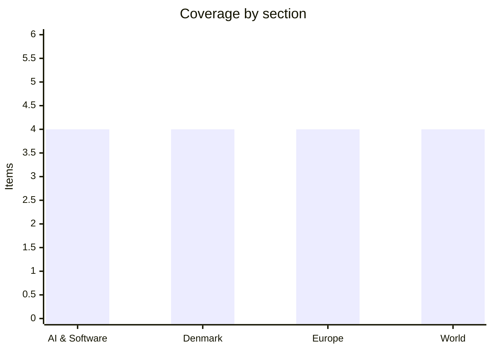

# Daily Briefing — 2026-07-17

**Top line:** Ukraine tipped into its worst wartime political crisis as protests spread over Zelensky's dismissal of Defence Minister Mykhailo Fedorov and the deputy air force commander resigned in solidarity — while the US and Iran agreed to resume talks in Oman tomorrow even as strikes continued and Qatar intercepted attacks over Doha this morning.

## Follow-ups

- **Gemini 3.5 Pro did not ship on its rumored July 17 date** — as of this briefing, Google DeepMind's own model page still lists "3.5 Pro coming soon", and there is no model card or API listing; aggregator claims of a launch today are unsubstantiated. A US-daytime release remains possible.
- **Xi Jinping delivered his WAIC keynote** in Shanghai as flagged — open-source push and AI access for developing countries (see AI & Software).
- **Iran–US conflict** ran into a sixth day of strikes, but both sides agreed to talks in Oman on Saturday; Qatar intercepted aerial attacks over Doha this morning (see World).
- **Israel–Lebanon pilot zones** advanced: army-to-army technical talks were expected today, and the Lebanese army has begun field measures in a pilot-zone village (see World).
- **Ebola in DRC**: the WHO now says the outbreak is spreading faster than any previous Ebola outbreak, with confirmed cases past 2,000 ([France24](https://www.france24.com/en/africa/20260716-ebola-spreading-faster-than-any-previous-outbreak-dr-congo-who-warns)) — the trajectory flagged yesterday is holding.

## AI & Software

**Moonshot AI releases Kimi K3, the largest open-weight model ever — and it lands in frontier territory.** The Chinese lab introduced Kimi K3 on July 16: a 2.8-trillion-parameter sparse mixture-of-experts model activating 16 of 896 experts per token, built on two architectural changes — Kimi Delta Attention and Attention Residuals — with native vision and a 1M-token context window. The API is live at $3.00 per million input tokens and $15.00 output, and Moonshot says full weights will be published by July 27, which would make it the largest open-weight release on record. The benchmark claims are striking: on GDPval-AA v2, which measures real-world tasks across 44 occupations, K3 scored 1,687 — third overall behind only Claude Fable 5 Max (1,815) and GPT-5.6 Sol Max (1,747.8), and ahead of Claude Opus 4.8 (1,600). It also claimed the top spot on Arena.AI's Frontend Code Arena at 1,679 and posted 93.5% on GPQA Diamond, the strongest open-weight result published on that benchmark, alongside 88.3% on Terminal-Bench 2.1 (all company-reported pending independent replication). Fortune's framing — Chinese AI pushing into "Fable-level territory" — captures why this matters: the gap between open Chinese models and closed US frontier models keeps narrowing, and open weights mean anyone can run, fine-tune and distill it. Simon Willison's early hands-on testing was broadly positive on its coding and reasoning behaviour. The timing, a day before Xi's Shanghai AI keynote pushing open source as China's strategy, is unlikely to be a coincidence. Watch the July 27 weights drop and whether independent evals confirm the numbers. [VentureBeat](https://venturebeat.com/technology/chinas-moonshot-ai-releases-kimi-k3-the-largest-open-source-model-ever-rivaling-top-u-s-systems) · [MarkTechPost](https://www.marktechpost.com/2026/07/16/moonshot-ai-releases-kimi-k3-a-2-8-trillion-parameter-open-moe-model-with-kimi-delta-attention-and-1m-context/) · [Fortune](https://fortune.com/2026/07/16/moonshots-kimi-k3-pushes-chinese-ai-into-fable-level-territory/) · [Simon Willison](https://simonwillison.net/2026/Jul/16/kimi-k3/)

**Xi Jinping opens Shanghai's World AI Conference with a pitch for open source and AI access for the Global South.** As flagged on yesterday's watch list, Xi delivered the keynote at the 2026 World AI Conference and High-Level Meeting on Global AI Governance, which runs July 17–20 — the first time China's top leader has appeared at the country's flagship AI event, a role customarily left to the premier. He said China would seize the "rare historic opportunity" of AI-driven growth by "encouraging open source, openness, collaboration and sharing", and framed a "people-centred" approach to AI development. The most consequential passage was aimed at the Global South: Xi promised Chinese cooperation on AI capacity-building with bodies across Africa, Latin America, Asia and BRICS to prevent what he called "new historical injustices" in access to the technology. The speech advances Beijing's push for a World AI Cooperation Organization headquartered in Shanghai — a governance body positioned as an alternative to US-led frameworks. The open-source emphasis is strategy, not sentiment: with Kimi K3, DeepSeek and Qwen, open Chinese models are the country's most effective export channel around US chip and model restrictions. The domestic subtext is also plain — the keynote landed a day after China's Q2 GDP miss, with AI-driven productivity positioned as the answer to slowing growth. Watch what concrete membership or charter emerges for the cooperation body before the conference closes July 20. [SCMP](https://www.scmp.com/tech/tech-war/article/3360870/top-takeaways-xi-jinpings-opening-address-world-ai-conference-shanghai) · [China.org.cn](http://www.china.org.cn/2026-07/17/content_118604065.shtml) · [CGTN](https://news.cgtn.com/news/2026-07-13/Xi-to-attend-and-address-opening-ceremony-of-2026-World-AI-Conference-1OKgsIkkofu/p.html)

**Microsoft unpacks the AsyncAPI npm compromise — malicious loaders that fire at import time, not install time.** Microsoft Threat Intelligence published its analysis on July 15 of a coordinated supply-chain compromise of the @asyncapi npm organization identified July 14: five package versions across four package names were republished within roughly ninety minutes, each carrying the same maliciously injected loader. AsyncAPI packages are widely used for API specification and code generation, and @asyncapi/specs is a transitive dependency of numerous tooling packages — so the blast radius spans developer workstations, CI/CD pipelines, container builds and production services that pulled the poisoned versions. The critical detail is the delivery mechanism: the payload executes at import time, when the package is loaded by code, rather than via install scripts. That matters because npm v12's headline security changes — blocking install scripts by default, covered in yesterday's briefing — do nothing against this vector; security researchers had warned about exactly this gap. The attack extends a relentless run: jscrambler packages compromised July 11, @injectivelabs/sdk-ts on July 8, and Red Hat's npm namespace in June. The practical guidance is unchanged but increasingly urgent: pin exact versions, verify provenance, audit lockfile diffs, and treat the registry as hostile. For teams using AsyncAPI tooling, Microsoft's post lists the affected versions and indicators of compromise. The structural lesson is that registry-level trust is broken and per-organization publishing compromises are now routine, not exceptional. [Microsoft Security Blog](https://www.microsoft.com/en-us/security/blog/2026/07/15/unpacking-asyncapi-npm-supply-chain-compromise-import-time-payload-delivery/) · [Unit 42](https://unit42.paloaltonetworks.com/monitoring-npm-supply-chain-attacks/)

**Anthropic and Blackstone launch "Ode", a $1.5bn bet that AI implementation is the next trillion-dollar business.** Announced July 15, Ode with Anthropic is a joint venture backed by Blackstone, Hellman & Friedman, Goldman Sachs and others, capitalised at $1.5bn, that will help large enterprises actually deploy AI models in their operations rather than just buy API access. The thesis, as TechCrunch frames it, is that the bottleneck in enterprise AI has moved from model capability to implementation — integrating models into workflows, data, compliance and change management — and that this services-plus-software layer is itself a trillion-dollar category. For Anthropic the venture creates a captive channel converting frontier-model capability into enterprise outcomes, with the financial backers supplying the client rolodex: Blackstone alone has hundreds of portfolio companies. The launch lands amid a broader run of Anthropic manoeuvres this week: the company is reported to be in talks with Samsung on a custom chip tuned to Claude models, and reported to be preparing an S-1 for an IPO as early as October 2026 *(both reported, unconfirmed)*. Industry trackers also report Anthropic's self-reported annualised revenue run-rate has overtaken OpenAI's *(reported, company self-reporting — treat with caution)*. The competitive read: while OpenAI pushes consumer surface area with its "super app" and ChatGPT Work, Anthropic is verticalising into the enterprise stack. Whether a services JV can scale like software — historically the hard problem for consultancies — is the open question. [TechCrunch](https://techcrunch.com/2026/07/15/anthropic-blackstone-bet-the-next-trillion-dollar-ai-business-is-implementation-not-models/)

## Denmark

**Denmark wins unanimously in the UK Supreme Court — the fraud case against ED&F Man can finally proceed.** The UK Supreme Court has ruled in Denmark's favour in the tax authority's long-running fight with the British finance house ED&F Man, overturning the Court of Appeal decision that stopped the case last year. Skatteforvaltningen has pursued ED&F Man for eight years over the dividend-tax (udbytteskat) scandal, originally claiming more than 500 million kroner it says the firm extracted by misleading Danish authorities into paying out refunds of dividend tax it was never entitled to. After an earlier version of the case was dismissed, the tax authority changed tack and refiled alleging outright fraud — and it is that fraud case the Supreme Court has now unanimously allowed to proceed, with the claim in the resumed main case standing at just over 300 million kroner. The stakes were absolute: DR notes that had the court gone the other way, the case would have been permanently lost. The ruling is a second major London win for Denmark in the wider dividend-tax complex, following the earlier landmark victory in the retsopgør against Sanjay Shah, whose cum-ex scheme drained an estimated 12.7 billion kroner from the Danish treasury. ED&F Man's alleged conduct is a distinct strand of the same scandal — refund applications based on shares that did not carry the claimed dividend rights. The main proceedings now resume in the English courts, and the outcome will shape how much of the scandal's billions Denmark ultimately claws back from institutions rather than individuals. [DR](https://www.dr.dk/nyheder/penge/hoejesteret-i-london-giver-danmark-stor-sejr-efter-strid-med-finanshus)

**Danish Crown cuts the pig price to its lowest level in over 20 years.** The slaughterhouse group lowered its settlement price (notering) to 7.1 kroner per kilo — the lowest in more than two decades — just weeks after a cut to 7.3 kroner that was itself described as a bottom level at the time. Danish Crown, owned by close to 5,000 Danish farmers, says the European pork market is under heavy pressure and that summer sales of grill products have not been sufficient to restore balance; the company calls the situation serious and says it is "difficult to see a turning point in the short term". For the farmer-owners the price is brutal arithmetic: the settlement price is what they are paid for their animals, and at these levels many producers are below break-even, which will accelerate the years-long decline in Danish pig production. LandbrugsAvisen notes the notering has fallen in historically large steps this summer. For consumers the raw-material collapse could eventually mean cheaper minced pork, chops and medister, though there is no guarantee retail prices follow quickly or fully. The structural backdrop is a European market squeezed by weak export demand — including a soft Chinese market (see World: China's demand problem) — and ample supply across the continent. Watch whether the autumn brings further cuts or stabilisation, and whether political calls for support to the sector emerge. [DR](https://www.dr.dk/nyheder/seneste/danish-crown-saenker-igen-prisen-paa-grisekoed-til-det-laveste-niveau-i-20-aar) · [LandbrugsAvisen](https://landbrugsavisen.dk/grisenoteringen-falder-igen-efter-historisk-stort-dyk-313524)

**Søren Gade breaks the confidentiality wall around the Afghanistan inquiry.** The Folketing's speaker — who was defence minister from 2004 to 2010, covering much of Denmark's Afghanistan engagement — has decided to consent to being quoted by name in the DIIS research inquiry into the Afghanistan war. Researchers at the Danish Institute for International Studies want to cite what ministers and committee members said in the Udenrigspolitisk Nævn (Foreign Policy Committee), whose proceedings are confidential with records sealed for 30 years; after a recommendation from the committee, the Presidium decided each politician chooses individually whether to be identifiable. Gade had been conspicuously silent on whether he would consent, drawing criticism — Information earlier skewered the irony of the man who helped send Danish soldiers to war declining to participate in the accounting of it. He now says that after reading the relevant records he has principled reservations about breaching committee confidentiality but has let the consideration of openness weigh heavier, adding that no one should accuse him of dodging responsibility. The decision matters beyond Gade personally: the inquiry's value depends on whether the key decision-makers of 2001–2021 allow their words to be attributed, and the speaker consenting sets a precedent that pressures others. A former foreign minister has meanwhile called the whole process around the confidentiality question scandalous, arguing committee secrecy exists to protect the state's interests, not politicians' reputations. Watch which other ministers from the war years follow suit — and who refuses. [DR](https://www.dr.dk/nyheder/politik/soeren-gade-vil-bryde-fortroligheden-i-udredning-om-afghanistan-krigen) · [Kristeligt Dagblad](https://www.kristeligt-dagblad.dk/debat/bryder-tavsheden-ingen-skal-beskylde-mig-forsoege-undgaa-ansvar) · [Altinget](https://www.altinget.dk/artikel/tidligere-udenrigsminister-forloebet-omkring-afghanistan-redegoerelsen-har-vaeret-skandaloes)

**Third alarm-system failure in Aalborg's psychiatric wards has regional politicians demanding action.** The personal alarm system at Aalborg University Hospital's psychiatric units has broken down for the third time in a few months, and members of the North Jutland regional council now say changes may be unavoidable. The alarms are the mechanism by which staff summon help if attacked — a real risk on closed psychiatric wards. The stakes were demonstrated in May, when staff at the forensic psychiatric unit (Retspsykiatrisk Afdeling) were assaulted by a patient while the alarm system failed; help was badly delayed, several employees ended up in the emergency room, and some remain on long-term sick leave. Regional councillor Susanne Flydtkjær (Enhedslisten) says the region may need to switch supplier or revert to older solutions known to work, while Lene Linnemann (SF) is investigating whether the region is legally bound to its contract with the alarm vendor and proposes a redundant fallback system. TV2 Nord reports staff patience is close to exhausted. The story is small in national terms but is the kind of workplace-safety failure that tends to escalate — three failures with a documented assault in between makes the region's liability position increasingly uncomfortable. Watch whether the region terminates the vendor contract. [DR](https://www.dr.dk/nyheder/indland/tredje-gang-svigtede-alarmsystem-i-psykiatrien-politikere-kalder-paa-handling) · [TV2 Nord](https://www.tv2nord.dk/region-nordjylland/talmodigheden-er-ved-at-vaere-opbrugt-22113)

## Europe

**Ukraine erupts in protest over Fedorov's dismissal — and the air force's deputy commander resigns in solidarity.** Hundreds of protesters gathered Thursday in Kyiv and other Ukrainian cities after President Zelensky dismissed Defence Minister Mykhailo Fedorov, the widely respected architect of Ukraine's drone programme, in a surprise reshuffle first reported Wednesday. The backlash has spread inside the military itself: the deputy commander of the Ukrainian Air Force submitted his resignation in protest, calling Fedorov's removal "a great evil for the country's defence capability", and the pro-government media organisation United24 paused publication to join the protests. Soldiers and activists quoted by the Kyiv Independent called the decision "utterly baffling", not least because Ukraine is widely seen to have turned the tide of the war in recent months — largely on the strength of the drone capabilities Fedorov built. Interior Minister Ihor Klymenko has reportedly been offered the defence portfolio *(reported, unconfirmed)*. The Washington Post notes Fedorov's ouster removes the government's most popular technocrat with no public explanation, and the episode is the most serious domestic challenge to Zelensky's wartime authority since the anti-corruption-agency protests of summer 2025. The danger is twofold: a leadership vacuum atop the defence ministry mid-war, and a signal to Western partners that Kyiv's political cohesion is fraying just as the EU deepens its defence-industrial commitment (yesterday's €1bn drone deal). Watch whether the protests grow, whether Zelensky reverses or explains the decision, and who actually takes the ministry. [Washington Post](https://www.washingtonpost.com/world/2026/07/16/zelensky-ousts-popular-defense-minister-an-architect-ukraines-drone-program/) · [Kyiv Independent](https://kyivindependent.com/utterly-baffling-soldiers-activists-slam-fedorovs-removal-as-defense-minister/) · [NBC](https://www.nbcnews.com/world/ukraine/protests-ukraine-zelenskyy-defense-minister-fedorov-drone-war-russia-rcna587783)

**The EU adopts anti-drone sanctions against Russia's Shahed supply chain.** The Council of the EU adopted a mini-package of sanctions today targeting the production of Shahed and Geran attack drones on Russian territory: five legal entities and one individual involved in developing and producing components that enhance the drones' combat capabilities. The measures were proposed by EU foreign-policy chief Kaja Kallas after Russia's large-scale strike on Kyiv on the night of July 1–2 and were originally slated for the July 13 foreign ministers' meeting before slipping to today. The package is deliberately narrow — an entity-level strike at the drone industrial base rather than a new numbered sanctions round — reflecting both the difficulty of assembling unanimity for broader measures and a strategy of iterative, targeted listings between major packages. It complements the week's other drone move from the demand side: the EU–Ukraine Defence Industrial Partnership signed Wednesday, which funds joint European-Ukrainian drone production with €1bn disbursed. Together the two amount to an explicit drone-war policy: build Ukraine's drone capacity up, choke Russia's down. The effectiveness question is familiar — Russia has repeatedly re-routed component sourcing through third countries, and Shahed-type production has kept scaling despite earlier listings. Watch for the next full sanctions package and whether component flows through intermediaries get targeted more aggressively. [Ukrainska Pravda](https://www.pravda.com.ua/eng/news/2026/07/16/8044404/) · [Kyiv Post](https://www.kyivpost.com/post/79903)

**Merz and Macron close the Brühl council with nuclear-deterrence declarations — at Macron's last such summit.** The Franco-German Council of Ministers concludes today at Brühl near Cologne, with the defence track — the Franco-German Defence and Security Council — meeting at Nörvenich Air Base and two joint declarations expected. The centrepiece is implementing the deterrence cooperation agreed in March, when Paris and Berlin established a high-ranking nuclear steering group for doctrinal dialogue and coordination across conventional, missile-defence and French nuclear capabilities — with first concrete steps including German participation in French nuclear exercises and joint visits to strategic sites, explicitly additive to NATO's nuclear sharing. Defense News reports the broader defence-industrial relationship remains under strain, with the long-troubled FCAS fighter programme and workshare disputes hanging over the summit. The political frame is transition: this is likely the last Franco-German council for Macron, who is not running for re-election in April 2027 after two terms, and Merz arrives historically weakened at 13% personal favourability. Macron nonetheless spoke of a "genuine Franco-German rapprochement". The substance is real — Germany discussing its security under a French nuclear umbrella supplement was unthinkable before doubts about the US guarantee — but both signatories are lame ducks to different degrees, which limits how much the declarations bind their successors. Watch the declaration texts for anything concrete on early-warning radars, deep-strike capabilities and missile defence, the steering committee's announced workstreams. [Defense News](https://www.defensenews.com/global/europe/2026/07/16/franco-german-defense-cooperation-under-strain-as-macron-merz-meet/) · [France Diplomatie](https://us.diplomatie.gouv.fr/en/strengthening-franco-german-cooperation-field-deterrence) · [Yahoo/AFP](https://www.yahoo.com/news/politics/articles/macron-speaks-genuine-franco-german-211839858.html)

**Brussels hits Google with its largest-ever DMA fine.** The European Commission issued decisions against Alphabet on July 16 in its long-running Digital Markets Act investigation, imposing penalties reported in the hundreds of millions of euros — exceeding the €500M against Apple and €200M against Meta, making it the largest DMA fine to date *(final amount per FT and others; the Commission's own figures should be checked against the formal decision)*. The findings cover two fronts: self-preferencing in Google Search, where Google's own shopping, transport and finance results received more prominent display than rivals', and Google Play anti-steering rules restricting developers from directing users to alternative payment channels. The decisions reportedly come with a 60-day compliance deadline and binding specification decisions on AI access attached — notable because it extends DMA enforcement toward how gatekeepers expose AI features. The timing, just before the Commission's summer recess, follows the pattern of clearing major enforcement decisions before the break. The transatlantic politics are combustible: recent DSA fines against X drew furious responses from Musk and Trump-administration officials, and a record fine against Google lands in an already tense EU–US trade atmosphere. Google is expected to appeal, as Apple and Meta have. The deeper significance is that the DMA is now producing repeat, escalating penalties rather than one-off warnings — the Commission is treating gatekeeper non-compliance as a continuing violation with a ratchet. Watch the formal Commission publication for the exact figure and the AI-access specification details. [TechTimes](https://www.techtimes.com/articles/320759/20260716/eu-fires-record-dma-fine-google-over-search-play-store-violations.htm) · [Silicon Republic/FT](https://www.siliconrepublic.com/business/ft-eu-set-to-hand-google-massive-fine-for-breaching-dma) · [ppc.land](https://ppc.land/eu-set-to-hit-google-with-record-dma-fine-before-summer-recess/)

## World

**US–Iran talks set for Oman tomorrow — even as strikes hit 90 targets and Qatar intercepts attacks over Doha.** The conflict entered a sixth day with both escalation and an off-ramp visible. CENTCOM completed a second, intensified round of strikes covering some 90 targets after Trump declared the ceasefire over; Iranian health officials say the week of US attacks has killed at least 35 people and wounded around 300 (Iranian government figures). The war spilled visibly into the Gulf this morning: Qatar raised its security level twice before dawn as its armed forces intercepted a number of aerial attacks over Doha — alerts went out around 3:30am and 5:45am local — with a child injured by falling shrapnel before authorities declared the threat eliminated; Iran has not confirmed it launched the attack. Yet the diplomatic channel has abruptly reopened: senior US officials say Iranian officials privately told Trump advisers the strikes on commercial shipping in the Strait of Hormuz were a mistake by an "errant" hardline faction seeking to undermine negotiations, and that Tehran wants to keep talking. Trump has directed a team led by Vice President Vance, Jared Kushner, Steve Witkoff and Secretary of State Rubio to resume negotiations in Oman on Saturday. The whiplash — Tehran publicly ruling out talks Wednesday, then this — suggests real factional struggle inside Iran over whether to negotiate, which cuts both ways: a deal is possible, but so is another "errant" attack that kills the talks. Oil has stayed remarkably calm with Brent below $85, pricing in de-escalation. Tomorrow's Oman meeting is the pivot point. [CBS](https://www.cbsnews.com/live-updates/us-iran-war-trump-ceasefire-talks-strait-of-hormuz/) · [NBC](https://www.nbcnews.com/world/iran/live-blog/live-updates-iran-attacks-gulf-us-strikes-tehran-ships-hormuz-oil-rcna353439) · [The Peninsula Qatar](https://thepeninsulaqatar.com/article/17/07/2026/qatar-intercepts-number-of-aerial-attacks-on-friday-child-injured-by-shrapnel)

**Trump administration ends open-ended US visas for students and journalists.** The Department of Homeland Security issued a final rule on July 16 eliminating "duration of status" — the decades-old arrangement under which foreign students (F visas), exchange visitors (J visas) and media representatives could remain in the US as long as their status held, without fixed end dates. Under the new rule, students and exchange visitors are admitted for the length of their programme capped at four years, and foreign journalists get up to 240 days per admission — just 90 days for Chinese nationals. Anyone needing longer must apply for an extension or leave and reapply; the rule takes effect 60 days after Federal Register publication. DHS frames it as ending "forever students" who perpetually enrol to avoid departure. The practical impact is large: a typical US PhD runs five to seven years, so essentially every doctoral student will now need at least one extension mid-programme, adding cost, backlog exposure and denial risk — universities warn this will push graduate talent toward Canada, the UK, Australia and Europe. The 90-day cap for Chinese journalists is a pointed reciprocity move likely to draw retaliation against US correspondents in China. For European institutions, an American system that is harder to enter is a recruiting opportunity — a dynamic Danish and EU universities have already begun exploiting since 2025's research-funding fights. Legal challenges are near-certain; a similar rule attempted in 2020 died before implementation. [DHS](https://www.dhs.gov/news/2026/07/16/trump-administration-issues-final-rule-end-foreign-student-visa-abuse) · [Al Jazeera](https://www.aljazeera.com/news/2026/7/16/trump-limits-length-of-visas-for-students-exchange-visitors-journalists) · [Time](https://time.com/article/2026/07/16/student-journalist-media-visa-limit-rule-trump-administration/)

**Israel–Lebanon pilot zones move from paper to ground: army-to-army talks and first field measures.** Following Wednesday's Rome agreement on the structure of the pilot-zone process, implementation has begun: technical talks between the Lebanese and Israeli armies were expected today under US auspices, and the Lebanese military has started field measures in one of the proposed pilot-zone villages. The zone has been narrowed to six villages in the central sector of southern Lebanon near the Litani River — Western Zawtar, Froun, Ghandouriyeh, Qalaouiyeh, Burj Qalaouiyeh and Srifa. The mechanics are the delicate part: under the plan both sides withdraw simultaneously, with the Lebanese Army deploying only after Israeli troops and Hezbollah fighters have vacated their positions — a sequencing that requires each side to trust the other's compliance in real time. Arab News frames the zone as the first concrete test of Hezbollah's willingness to actually withdraw south of the Litani, which the group has publicly rejected; the FDD analysis notes Israel has conditioned its pullout on demonstrated Lebanese Army capability. The war since March 2 has killed more than 4,000 people and displaced over a million in Lebanon, and Israeli strikes have continued through the talks. If the six-village experiment holds, it becomes the template for a phased, zone-by-zone unwinding of the war; if Hezbollah refuses to vacate or an incident collapses the sequencing, the framework likely dies with it. Watch for the outcome of today's technical talks and a start date for the simultaneous withdrawal. [UPI](https://www.upi.com/Top_News/World-News/2026/07/15/lebanon-pilot-zones-israel-lebanon-agreement/1601784140786/) · [Arab News](https://www.arabnews.com/node/2651115/middle-east) · [The New Arab](https://www.newarab.com/news/lebanon-readies-pilot-zones-presses-israeli-withdrawal)

**Beijing signals stimulus after the GDP miss — the late-July Politburo becomes the meeting to watch.** The policy response to Wednesday's growth miss (Q2 GDP at 4.3%, the weakest in three years) is taking shape: Premier Li Qiang has signalled that more aggressive counter-cyclical policy adjustments are needed, and analysts have converged on the late-July Politburo meeting as one of the year's most consequential economic sessions. The case for action is in the composition of the slowdown: consumption and industrial output actually surprised positively, but fixed-asset investment is contracting at an accelerating pace — the steepest slowdown in decades — with property investment down 18%, confirming real estate remains the structural drag no previous support round has fixed. The case for restraint is also real: a strong Q1 and resilient exports give Beijing arithmetic room toward its ~5% target, and local governments are buried in debt restructuring, limiting the traditional infrastructure-stimulus channel. Expected tools if Beijing moves: rate cuts, incremental fiscal spending and targeted property-sector support rather than a bazooka. The AI subtext runs through Xi's Shanghai keynote today — AI-driven productivity is being positioned as the long-run answer to exactly this growth problem, which is industrial policy, not stimulus. For Europe and Denmark the stakes are direct: weak Chinese demand means export headwinds (Danish pork's collapsed market is partly this story) and continued pressure from cheap Chinese goods into EU markets. Watch the Politburo readout for the words "extraordinary" or new special-bond quotas. [Fortune](https://fortune.com/2026/07/15/china-economy-slowest-growth-three-years-quarterly/) · [Yahoo Finance](https://finance.yahoo.com/economy/policy/articles/chinas-gdp-growth-set-slow-075332457.html)

## Watch list

- **US–Iran talks in Oman, Saturday July 18** — Vance/Kushner/Witkoff/Rubio team; first negotiation since Trump declared the ceasefire over.
- **Gemini 3.5 Pro** — missed its rumored July 17 date as of this briefing (DeepMind's page still says "coming soon"); a late-day or slipped launch both possible.
- **ECB decision, July 23** — post-Hormuz energy shock; market prices only ~20% odds of a second hike.
- **White House voluntary frontier-AI standards** — reportedly in advanced talks with OpenAI, Google and Anthropic, announcement possible as soon as next week *(reported, unconfirmed)*.
