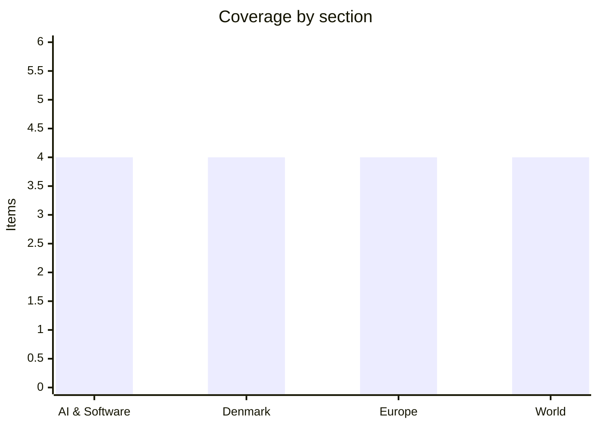

# Daily Briefing — 2026-07-18

**Top line:** US and Iranian negotiators meet in Oman today with Strait of Hormuz traffic collapsed to eight ships a day after a seventh straight night of American strikes — while Google finally shipped Gemini 3.5 Pro, ending a month of missed dates.

## Follow-ups

- **Gemini 3.5 Pro shipped July 17** — the rumor cycle tracked in the last two briefings resolved a day late (see AI & Software).
- **US–Iran talks in Oman are on for today** as flagged — though Iranian state-adjacent media are already muddying whether Tehran will actually negotiate (see World).
- **Israel–Lebanon pilot zones**: military-level technical talks are proceeding to finalize the zone list and withdrawal timetable; no comprehensive outcome announced yet, and Israel's defence minister has said forces will stay indefinitely in broader "security zones" ([JPost](https://www.jpost.com/middle-east/article-902625)).
- **Google DMA fine**: the Commission's formal decision text and exact figure have still not been published; reporting remains "hundreds of millions of euros" across the two tracks ([TechTimes](https://www.techtimes.com/articles/320759/20260716/eu-fires-record-dma-fine-google-over-search-play-store-violations.htm)).
- **Ebola in DRC**: now the third-largest Ebola outbreak on record with 754 confirmed deaths; it passed 1,000 cases within 40 days versus ~235 days for the 2018 North Kivu outbreak, and clinical trials of remdesivir and MBP134 began July 12 ([Wikipedia/WHO](https://en.wikipedia.org/wiki/2026_Ebola_epidemic)).

## AI & Software

**Google ships Gemini 3.5 Pro — 2M-token context and a Deep Think mode, but no free tier.** After weeks of slipped dates, Google DeepMind released Gemini 3.5 Pro on Friday July 17, its most capable model to date. The headline specification is a 2-million-token context window — enough to feed entire books, codebases or research-paper collections into a single request — plus a "Deep Think" reasoning mode gated to the $250-per-month Ultra tier. Google claims meaningful gains in coding and long-horizon reasoning over the 3.0 generation, though it has published no free-tier access, continuing its pattern of reserving frontier capability for paying users. The path here was rocky: the model was originally expected in June, but DeepMind reportedly scrapped its original base model and restarted pretraining after engineers found structural issues in areas like recursive tool-calling and SVG generation — an unusually public stumble for Google. The launch landed the same day Xi Jinping opened Shanghai's World AI Conference with his open-source pitch, an accidental split-screen of the two competing AI strategies: closed frontier capability sold by subscription versus open weights as geopolitical export. It also comes days after Moonshot's Kimi K3 claimed third place on GDPval-AA v2 and Thinking Machines shipped Inkling (below), meaning Gemini 3.5 Pro arrives into the most crowded frontier-model month in memory. Independent benchmarks are not yet in; watch how it scores against Claude Fable 5 Max and GPT-5.6 Sol once third-party evals land. [HNGN](https://www.hngn.com/articles/272128/20260717/google-launches-gemini-35-pro-xi-jinping-opens-chinas-ai-summit-shanghai-same-day.htm) · [Google DeepMind](https://deepmind.google/models/gemini/) · [HackerNoon](https://hackernoon.com/google-delays-gemini-35-pro-to-july-17-the-strategic-play-behind-the-scrapped-base-model)

**Mira Murati's Thinking Machines releases Inkling — the strongest US open-weight model yet.** Thinking Machines Lab published its first in-house model this week: Inkling, a 975-billion-parameter mixture-of-experts system with 41B active parameters, multimodal input (text, image, audio), pretraining on 45 trillion tokens, and a context window up to 1M tokens — released under Apache 2.0 on Hugging Face, with a lighter Inkling-Small (12B active) previewed alongside. It debuted at 41 on the Artificial Analysis Intelligence Index, making it the leading open-weights release from a US lab, and is also served via the company's Tinker platform API. The strategic framing matters as much as the specs: Murati's lab is explicitly betting against one-size-fits-all frontier models, arguing organizations that fine-tune and customize their own models will outperform those renting general-purpose ones — Inkling is the substrate for that thesis, and VentureBeat notes the lab also emphasizes low cost and "resistance to censorship". The release gives the US an answer in the open-weights race it had largely ceded to China: until this week the strongest open models were Kimi K3 (weights promised July 27), DeepSeek and Qwen. A US open-weight flagship from a lab stacked with ex-OpenAI researchers changes that calculus, and Apache 2.0 licensing makes it usable commercially without restriction. The open question is commercial: giving the model away is coherent with selling the fine-tuning platform, but the lab's $2bn-raised valuation now rests on Tinker adoption. Watch independent evals and whether enterprises actually fine-tune it at scale. [Artificial Analysis](https://artificialanalysis.ai/articles/thinking-machines-has-released-inkling-the-new-leading-u-s-open-weights-model) · [TechCrunch](https://techcrunch.com/2026/07/15/thinking-machines-amps-up-its-bet-against-one-size-fits-all-ai-with-its-first-open-model-inkling/) · [Thinking Machines](https://thinkingmachines.ai/news/introducing-inkling/)

**The White House's voluntary frontier-AI framework takes shape: a 30-day federal pre-release window** *(reported, unconfirmed)*. Details of the framework flagged on the watch list have firmed up: the administration is in final negotiations with OpenAI, Google and Anthropic on a voluntary regime under which federal agencies get a 30-day pre-release window on frontier models, with the Commerce Department's Center for AI Standards and Innovation and the NSA running classified benchmarks assessing each model's advanced cyber capabilities. An announcement is expected before August 1. The backdrop shows why the labs are negotiating rather than resisting: OpenAI already delayed the full public launch of GPT-5.6 at the government's request, limiting initial access to vetted partners, and Anthropic had a $200M Pentagon contract terminated in early 2026 after refusing contract language permitting Claude's use in autonomous weapons without human intervention — the relationship between Washington and the frontier labs is already operationally entangled, and this framework would formalize it. The design is notable for what it is not: not legislation, not licensing, and limited to the three companies that dominate US frontier development — a voluntary club, echoing the July 2023 commitments but with real teeth in the form of classified capability testing. The critique writes itself both ways: safety advocates will say voluntary is toothless; competition advocates will note a government-blessed three-lab club raises the moat for everyone else. Watch for the formal announcement and whether the 30-day window applies to open-weight releases — a question Inkling and Kimi K3 make urgent. [Eastern Herald](https://easternherald.com/2026/07/06/white-house-voluntary-ai-frontier-model-standards/) · [Yahoo Finance/Reuters](https://finance.yahoo.com/technology/ai/articles/us-talks-ai-companies-voluntary-001646707.html)

**The OpenAI–Anthropic access war escalates: lifted usage caps and extended trials.** The competitive temperature between the two labs keeps rising through their pricing and access levers. OpenAI announced it is "temporarily" lifting the five-hour usage window for ChatGPT Plus, Business and Pro subscribers, while Anthropic countered by extending the in-plan trial period for Claude Fable 5, giving subscribers another week of access to its top model. The moves sit on top of a structural price attack: GPT-5.6's tiering undercuts Claude Fable 5 by 50% or more at every capability level — Sol at $5 per million input tokens and $30 output against Fable 5's $10 and $50. The product fronts mirror each other too: OpenAI's ChatGPT Work, launched July 9, is a direct answer to Anthropic's Claude Cowork agent from January, both targeting non-developers with autonomous multi-step task execution. The dynamic to watch is whether this is a genuine price war — which would compress margins across the industry just as capex explodes — or promotional churn around a launch window. For users the short-term read is simple: frontier capability is temporarily cheaper and less rationed than it has ever been. [PCWorld](https://www.pcworld.com/article/3189851/tried-the-new-chatgpt-and-claude-models-nows-your-chance.html) · [TechChannel](https://techchannel.news/openai-fires-back-at-anthropic-with-chatgpt-work/)

## Denmark

**Shooting in Nørresundby: an uninvolved 62-year-old killed, a police officer wounded.** A major police operation unfolded Friday afternoon in an industrial area of Nørresundby after Nordjyllands Politi responded at 13:42 to a reported fire on Virkelyst — and were met with rifle fire on arrival. In the exchange that followed, an officer was hit in the leg (stable condition) and the 48-year-old suspected gunman was hit by police fire, reportedly in the neck, and is seriously wounded. The grimmest finding came afterwards: searching the area, police found a 62-year-old man shot dead — killed, police say, not by police bullets, and with no apparent connection to the suspect. Police inspector Claus Danø said there are reports the perpetrator shot at civilians in the area before officers arrived, and that the incident is considered isolated with no gang connection. The case now runs on two tracks: the criminal investigation of the suspect, and the Independent Police Complaints Authority's routine review that follows any police discharge of weapons. For a country where police shootings and random gun killings are both rare, a bystander shot dead in broad daylight by a rifle-armed man will keep this story running — expect charges to be presented in a grundlovsforhør once the suspect's condition allows. [DR](https://www.dr.dk/nyheder/indland/draebt-borger-blev-fundet-efter-skyderiet-i-noerresundby) · [TV2](https://nyheder.tv2.dk/live/krimi/2026-07-17-skyderi-i-noerresundby)

**The government fast-tracks new drone and anti-drone purchases with Finance Committee backing.** The government has received the Folketing Finance Committee's approval to urgently procure additional drones and anti-drone capabilities for the armed forces, Defence Minister Jeppe Bruus announced. The ministry will not disclose how many systems are involved or the price, citing security considerations — only that costs are covered within the defence ministry's existing framework, including the 2024–2033 defence agreement and the February 2025 agreement on strengthening combat capability. Bruus's framing was urgency itself: "development is progressing extremely rapidly, and it is crucial for combat strength that the Defence Force keeps up." The stated driver is battlefield experience from Ukraine, where drones and counter-drone systems have become decisive — a lesson Denmark absorbed directly during last autumn's drone incursions over Danish airports and military installations. The purchase extends a pattern: last year Denmark bought four long-range drones for 7.5 billion kroner, and hasteanskaffelser (emergency procurements) have become the government's standard instrument for bypassing normal multi-year procurement cycles it considers too slow for the threat picture. The secrecy around quantity and vendor will draw some parliamentary grumbling, but the Finance Committee's sign-off means the money moves now. Watch for which suppliers emerge — Danish drone firms have been lobbying hard for domestic orders. [DR](https://www.dr.dk/nyheder/seneste/regeringen-hasteanskaffer-nye-drone-og-antidronesystemer) · [Forsvarsministeriet](https://www.fmn.dk/da/nyheder/2026/regeringen-har-faet-folketingets-opbakning-til-at-kobe-yderligere-droner-og-antidrone-kapaciteter)

**Novo Nordisk gets EU approval for the Wegovy pill — the first oral GLP-1 for weight loss in Europe.** The European Commission granted marketing authorization this week (July 15) for the Wegovy pill, a once-daily 25 mg oral semaglutide for adults with obesity (BMI ≥30) or overweight (BMI ≥27 with a weight-related comorbidity), making it the first oral GLP-1 receptor agonist for weight management available across all EU member states. The Commission simultaneously approved a 7.2 mg injectable Wegovy dose in a single ready-to-use pen. The decision follows the EMA's positive CHMP opinion from May and is the fifth authorization for the pill after the US, UK, UAE and Bahrain. Commercially this matters enormously for Denmark's largest company: the injectable-to-oral transition is where the next phase of the obesity-drug war with Eli Lilly will be fought, since pills are cheaper to distribute, need no cold chain, and reach patients who refuse needles. An oral first-mover position in the EU gives Novo a window before Lilly's competing oral candidate arrives at scale. The Danish macro angle is familiar but real — Novo's export volumes have at times carried Danish GDP growth on their own, and the company has needed good news after a bruising eighteen months of competitive pressure and share-price decline. Watch pricing and country-by-country rollout, which determines how fast the approval converts to revenue. [GlobeNewswire](https://www.globenewswire.com/news-release/2026/07/15/3327953/0/en/novo-nordisk-receives-european-commission-approval-of-wegovy-pill-as-first-oral-glp-1-for-weight-management-in-the-eu-single-ready-to-use-pen-for-higher-dose-7-2-mg-also-approved.html) · [Benzinga](https://www.benzinga.com/trading-ideas/movers/26/07/60482125/wegovy-pill-in-europe-novo-nordisk-expands-franchise-with-first-european-approval-for-oral-weight-loss-drug)

**Denmark joins eight EU states demanding the IOC lose EU funding over Russia's readmission — and the IOC digs in.** Denmark, Finland, Sweden, Estonia, Latvia, Lithuania, the Netherlands, Poland and Romania have sent a joint letter to European Commissioner for Sport Glenn Micallef demanding that the International Olympic Committee — along with World Aquatics and the fencing federation FIE — be excluded from Erasmus+ and other EU financial support programmes. The trigger is the IOC Executive Board's July 7 decision to provisionally lift the suspension of the Russian Olympic Committee, opening the way for Russian and Belarusian athletes to compete at the Los Angeles 2028 Games. The Estonian-initiated letter argues readmission ignores the reality facing Ukrainian competitors, who cannot train under equal conditions because of displacement, destroyed infrastructure or military service. The IOC publicly defended its decision on July 16, rejecting the pressure — setting up a direct standoff between a bloc of nine EU governments and the Olympic movement over whether European public money can flow to bodies that normalize Russian participation. The politics are uncomfortable for the Commission: sport funding is a small budget line, but the principle — EU money conditioned on alignment with EU sanctions posture — would set a precedent reaching well beyond sport. For Denmark the position is consistent with its hard line on Russia across every track since 2022. Watch whether Micallef responds formally and whether more member states join; a Franco-German position would decide the issue. [Al Jazeera](https://www.aljazeera.com/sports/2026/7/14/olympic-funding-questioned-by-nine-eu-nations-over-russia-readmission) · [Cyprus Mail](https://cyprus-mail.com/2026/07/16/ioc-defends-russian-olympic-committee-reinstatement-after-eu-countries-call-for-funding-cuts) · [NordiskPost](https://www.nordiskpost.com/2026/07/16/denmark-finland-sweden-eu-fundinig-freeze-ioc/)

## Europe

**Zelensky moves to contain the Fedorov crisis: security-service chief Khmara named acting defence minister.** The political storm over Mykhailo Fedorov's dismissal entered its second day with a partial answer to the "who takes the ministry" question: Zelensky appointed Yevhenii Khmara, the acting head of Ukraine's Security Service, as acting defence minister on Thursday evening and asked parliament to confirm him — displacing the earlier reporting that Interior Minister Klymenko would get the job. Zelensky also moved to soften the blow, acknowledging the protests and saying he is "confident that [Fedorov] will remain on my team", with reports that Fedorov has been offered a senior position on the national defence and security council. The concessions have not stopped the backlash: hundreds again demonstrated near the Ivan Franko theatre in Kyiv, and the resignation of deputy air force commander Pavlo Yelizarov — a renowned drone unit commander who called the dismissal "a great evil for the country's defence capability" — stands. The emerging explanation is a power struggle: Fedorov clashed with armed forces chief Oleksandr Syrskyi, and his procurement-reform and anti-corruption drives made enemies across the political and military establishment. Installing a security-service chief atop the defence ministry mid-war is itself a statement — continuity of control over the corruption-prone procurement apparatus, or consolidation of loyalists, depending on the reading. Parliament's confirmation vote is now the test of whether Zelensky's authority absorbs the crisis or the Rada balks. Watch the vote, Fedorov's actual next role, and whether further military resignations follow. [CNN](https://www.cnn.com/2026/07/16/europe/russia-ukraine-attack-keir-starmer-visit-intl-hnk) · [Al Jazeera](https://www.aljazeera.com/news/2026/7/16/hundreds-protest-in-kyiv-over-zelenskyys-dismissal-of-defence-minister) · [NPR](https://www.npr.org/2026/07/16/g-s1-133920/ukraine-defense-minister-fired)

**France and Germany fly their first joint nuclear-deterrence exercise.** A day after the Brühl council covered yesterday, the substance arrived: two nuclear-capable French Rafales and two Bundeswehr Eurofighters flew a joint exercise from Nörvenich air base on Friday — the first-ever joint air force drill under the Franco-German nuclear-deterrence partnership agreed by Macron and Merz on March 2. The exercise practiced air-to-air refuelling with a French tanker aircraft, and the Franco-German Defence and Security Council, meeting in a maintenance hangar at the base, formally agreed that Germany will participate in a French nuclear exercise for the first time — the concrete step beyond declaration-writing. The mechanics run through the Nuclear Steering Group co-chaired by the French president and German chancellor, established in March for doctrinal dialogue across conventional, missile-defence and nuclear domains. The significance is hard to overstate in historical terms: France's arsenal is the EU's only independent nuclear force, and folding German aircraft and planners into its exercises begins turning "European deterrence" from a think-tank phrase into allied practice — explicitly additive to, not replacing, NATO nuclear sharing. The driver remains doubt about the durability of the US umbrella, which no one in Berlin or Paris says aloud in these terms. The caveat from yesterday stands: Macron leaves office in April 2027 and Merz is historically weak at home, so institutionalization — exercises on a calendar, staff structures, agreed doctrine — is what would make this outlast both. Watch for the announced date and scope of German participation in France's Poker nuclear exercise series. [Deutschland.de](https://www.deutschland.de/en/news/germany-and-france-launch-nuclear-cooperation) · [UNITED24](https://united24media.com/world/france-and-germany-hold-first-ever-joint-nuclear-deterrence-drill-20837) · [Élysée](https://www.globalsecurity.org/wmd/library/news/france/2026/france-260717-elysee02.htm)

**Starmer's farewell Kyiv visit: €300M for Gripen jets — and Britain hands over to Andy Burnham on Monday.** Keir Starmer made his final foreign trip as UK prime minister to Kyiv on July 16, announcing a €300 million ($340M) contribution toward delivering 16 Gripen fighter aircraft to Ukraine in cooperation with Sweden, and receiving Ukraine's Order of Freedom from Zelensky for his "outstanding personal contribution" to the relationship. The visit was choreographed as a continuity guarantee: Starmer formally steps down July 20, handing the premiership to incoming Labour leader Andy Burnham, and the message to Kyiv was that Britain's commitments — £3 billion in annual military support, and a tenure that delivered over 250,000 drones, some 8,000 missiles and 350,000 artillery rounds — survive the change of occupant. The Gripen funding is concrete rather than symbolic: it accelerates the Swedish-built fighters into Ukraine's air force alongside F-16s and Mirages, diversifying a fleet that until 2024 was entirely Soviet-legacy. The larger question is Burnham, whose foreign-policy instincts are less tested than his domestic profile; allies will read his first weeks for any softening on Ukraine spending, especially with UK fiscal pressure mounting. For Ukraine the timing is delicate — a leadership transition in its most reliable European military backer arrives in the same week as its own defence-ministry crisis. Watch Burnham's first statements on Ukraine policy after Monday's handover. [Kyiv Independent](https://kyivindependent.com/zelensky-awards-starmer-order-of-freedom-on-his-last-kyiv-visit-as-british-pm/) · [Kyiv Post](https://www.kyivpost.com/post/80370)

**The Commission's Electrification Action Plan: 46% of EU energy from electricity by 2040.** The European Commission published its long-delayed Electrification Action Plan on July 17, setting an indicative target for electricity to reach 46% of final energy consumption by 2040 — roughly double today's share of around 23%. The plan bundles measures to make electricity cheaper relative to fossil fuels (tax treatment, network-charge reform), accelerate permitting for grids and storage, and push electrification of heating, transport and industrial processes; a leaked draft also recognized the need for some 200 GW of energy storage by 2030, and the package lands alongside carbon-market reform. The geopolitical framing is explicit: the file was drafted partly in response to the oil and gas disruption from the Iran war — Hormuz-driven price spikes made the EU's fossil import dependence a security problem again, and electrification is the structural answer Brussels can actually legislate. The file had slipped repeatedly, from June 10 to July 22, before landing this week just ahead of the Commission's summer recess — the same pre-recess clearing pattern as the Google DMA decision. The hard part is implementation: electricity is still taxed more heavily than gas in many member states, grid connection queues run to years, and the 2040 target is indicative rather than binding. Industry groups broadly welcomed the direction while warning the plan under-delivers on electricity pricing. Watch the legislative follow-through in autumn and how the target interacts with the 2040 climate-target negotiation. [Euronext/Reuters](https://live.euronext.com/en/financial-news/eu-drafts-electrification-plan-curb-oil-and-gas-use-after-iran-war-disruption) · [Energy-Storage.News](https://www.energy-storage.news/leaked-eu-electrification-action-plan-recognises-need-for-200gw-of-energy-storage-by-2030/) · [WRI](https://www.wri.org/news/statement-european-commission-sets-46-electrification-target-alongside-carbon-market-reform)

## World

**Decision day in Oman: US negotiators meet Iran as Hormuz traffic hits a three-week low.** The talks flagged yesterday are on: the US team of Vice President Vance, Secretary of State Rubio and envoys Witkoff and Kushner was expected to meet Iranian Foreign Minister Araghchi in Muscat today, after Araghchi met Omani counterpart Badr al-Busaidi on arrival — the Omani readout said both sides agreed to continue talks "at technical and political levels" on safe navigation in the Strait of Hormuz. The signals from Tehran remain deliberately mixed: Fars news agency quoted a source saying there will be no negotiations until the US retreats from its positions — consistent with the factional struggle visible all week between Iranians who want a deal and those trying to kill one. The military pressure meanwhile did not pause: the US completed a seventh straight night of strikes, and the economic strangulation of the strait is now stark — only eight ships transited on Thursday, the lowest in three weeks, with seven of eight using the Iranian-directed route rather than the US-backed Omani corridor, a sign shippers fear Iranian missiles more than American instructions. Since the blockade tightened Tuesday, CENTCOM says it has redirected three commercial vessels and disabled the Curacao-flagged tanker M/T Belma. Iran's Revolutionary Guards claimed a fresh round of strikes on US facilities in Syria, Kuwait, Oman, Bahrain and Jordan on Friday; the US military denied the claims. The shape of a deal is visible — Washington wants Iran to publicly declare Hormuz open and stop firing on commercial ships — but so is the shape of failure: one more "errant" attack during the talks. What emerges from Muscat tonight sets the region's trajectory for weeks. [CBS](https://www.cbsnews.com/live-updates/iran-war-trump-strait-of-hormuz-attacks-persian-gulf/) · [Vatican News](https://www.vaticannews.va/en/world/news/2026-07/diplomacy-oman-united-states-iran-tensions-war.html) · [Oman FM](https://www.fm.gov.om/en/24744/)

**Trump's primetime election-fraud address: declassified documents, familiar claims, no new evidence.** President Trump used a primetime White House address Thursday night to argue American elections are vulnerable to fraud, declassifying documents he said showed a Chinese influence campaign, a cover-up by US intelligence officials, and fraud in Michigan in 2020. The specific claims: voting machines are vulnerable to hacking, China acquired American voter data, 270,000 noncitizens are registered to vote, and Michigan's 2020 count was tainted. Election experts and officials responded that the speech and document tranche contained no new evidence of widespread fraud — the China voter-data and machine-vulnerability material has long been public, and officials say mitigations were implemented years ago. Notably, Trump stopped short of repeating his claim that he won the 2020 election. The practical purposes are twofold and explicit in the coverage: pressuring Congress to pass a bill requiring documentary proof of citizenship to vote, and laying groundwork to contest the legitimacy of November's midterms if Republicans underperform. That second reading is what alarms election administrators — a sitting president establishing a fraud narrative four months before a national election he is not on the ballot for, but whose outcome determines control of Congress for his final two years. State election officials across both parties pushed back within hours. Watch the proof-of-citizenship bill's path in Congress and whether federal agencies are directed to act on the declassified claims. [NPR](https://www.npr.org/2026/07/17/nx-s1-5897446/trump-promised-evidence-of-election-fraud-experts-say-there-was-none) · [Votebeat](https://www.votebeat.org/national/2026/07/17/trump-election-speech-china-noncitizen-voters-voting-machine-vunerabilities/) · [CNN transcript](https://www.cnn.com/interactive/2026/07/politics/annotated-transcript-trump-speech-us-election-vis/)

**More than 500 Rohingya feared dead in twin shipwrecks — likely the deadliest single loss in years.** UN officials said Thursday that more than 500 people are feared dead after two boats carrying Rohingya refugees capsized in the Bay of Bengal. Both vessels left Myanmar's Rakhine state in late June carrying mostly Rohingya, including some who had come from the refugee camps in Bangladesh: one boat with around 250 people aboard lost contact shortly after departure, and a second carrying about 280 is believed to have sunk off Myanmar's Ayeyarwady coast on July 8. The timing compounds the tragedy — Rohingya normally avoid the sea route during monsoon season, when torrential rain and heavy seas make the crossing to Malaysia or Indonesia most dangerous, and the fact that hundreds boarded anyway is read by aid agencies as a measure of desperation. Conditions are deteriorating on both sides of the border: some 1.2 million stateless Rohingya remain in overcrowded Bangladeshi camps with rations repeatedly cut, while Rakhine is an active war zone between the Myanmar military and the Arakan Army. Last year was already the deadliest on record for the exodus — more than 6,500 fled by boat in 2025 and nearly 900 were reported dead or missing; a confirmed 500-plus toll from a single episode would exceed half of last year's total at once. The 2017 military campaign that drove the Rohingya out was declared a genocide by the US, and the junta that conducted it still controls their homeland, leaving no safe return. Watch for confirmation of the toll and whether regional governments respond with anything beyond condolences. [UN News](https://news.un.org/en/story/2026/07/1167951) · [NBC](https://www.nbcnews.com/world/asia/500-feared-dead-boats-carrying-rohingya-refugees-capsize-myanmar-rcna587790) · [Al Jazeera](https://www.aljazeera.com/news/2026/7/16/more-than-500-feared-dead-after-reports-of-boats-capsizing-off-myanmar)

**Hong Kong raids two more independent bookstores — the third crackdown on booksellers this year.** Hong Kong police raided two independent bookstores on Wednesday and arrested five people — two men and three women — on suspicion of displaying and selling "seditious" publications under the 2024 national security law, alleging the material stirred up hatred against the government, judiciary and law enforcement. Officers carted boxes from the buildings housing Have A Nice Stay, a bookshop founded by former journalists, and Greenfield Book Store. It is the third such operation this year: March brought the arrest of the owner and staff of Book Punch, reportedly over titles including a biography of Jimmy Lai — the media tycoon serving a 20-year sentence in his national security case — and June saw two booksellers arrested over seditious publications and alleged foreign funding. A government official followed Wednesday's raids with a public warning that booksellers should ensure their titles "won't harm national security" — guidance that, as Fortune's headline put it, criminalizes what is on your bookshelf, since no list of banned titles exists and sellers must guess. The pattern extends the post-2020 dismantling of Hong Kong's civil society from media and unions down to the smallest cultural institutions: independent bookstores were among the last physical spaces for dissenting literature. Each round of arrests has produced closures and self-censorship among remaining shops. Watch whether charges are formally laid under the sedition provisions, which carry up to seven years. [NPR](https://www.npr.org/2026/07/16/g-s1-133931/hong-kong-official-warns-booksellers-on-security-risks-after-raids) · [Fortune](https://fortune.com/2026/07/16/hong-kong-bookshelf-crackdown-third-raid/) · [NBC](https://www.nbcnews.com/world/asia/hong-kong-booksellers-reportedly-arrested-seditious-publications-rcna587241)

## Watch list

- **UK handover, Monday July 20** — Starmer steps down; Andy Burnham becomes PM. First signals on Ukraine and fiscal policy.
- **ECB decision, July 23** — post-Hormuz energy shock vs. slowing growth; market prices only modest odds of a second hike.
- **Kimi K3 open weights, promised by July 27** — would be the largest open-weight release on record; independent evals of the benchmark claims to follow.
- **White House frontier-AI standards** — announcement expected before August 1; watch whether the 30-day federal pre-release window covers open-weight models.
