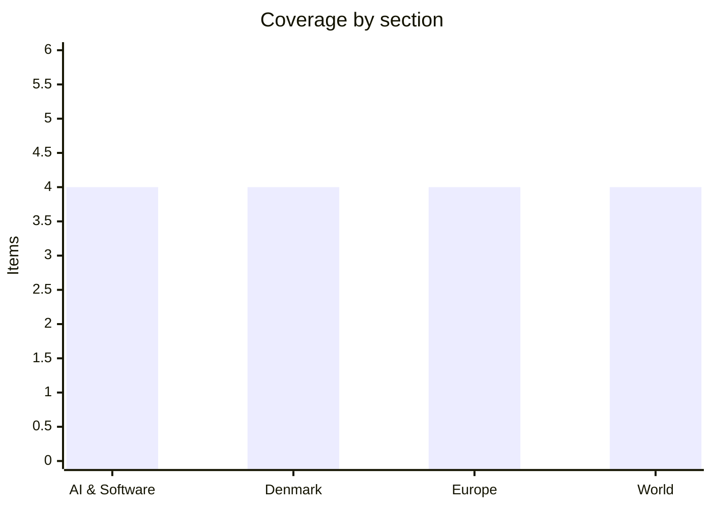

# Daily Briefing — 2026-07-19

**Top line:** The US and Iran traded strikes across the Gulf on Saturday as the Muscat talks bogged down over who actually controls the Strait of Hormuz — while Ukraine hit Russia with its deadliest deep strikes in two years, killing eight at logistics hubs near Moscow and Tambov.

## Follow-ups

- **Oman talks produced no breakthrough** — negotiations continued Saturday on mechanisms for securing Hormuz shipping, but the core disagreement over who manages the strait is unresolved (see World).
- **UK handover confirmed for Monday** — Andy Burnham was formally confirmed Labour leader on July 17 and becomes PM on July 20, pledging "100 percent" of current Ukraine support (see Europe).
- **Ukraine defence ministry**: the Rada has still not voted to confirm Yevhenii Khmara as defence minister; Russian state media are openly celebrating Fedorov's ouster ([Kyiv Post](https://www.kyivpost.com/post/80443)).
- **White House frontier-AI framework**: still no formal announcement; expectation remains before August 1.
- **No movement** on the ECB decision (July 23) or Kimi K3's promised open weights (July 27).

## AI & Software

**Critical WordPress pre-auth RCE goes fully public: working exploit for "wp2shell" released as forced updates roll out.** A proof-of-concept exploit for CVE-2026-63030, dubbed wp2shell, was published on GitHub on July 18, turning a patched-but-fresh WordPress core vulnerability into an immediate mass-exploitation risk. The flaw chains a REST API batch-route confusion with a SQL injection in WP_Query (CVE-2026-60137), allowing an unauthenticated attacker to execute arbitrary code on sites not using a persistent object cache. Affected versions are WordPress 6.9.0–6.9.4 and 7.0.0–7.0.1; fixes shipped in 6.9.5 and 7.0.2, and WordPress has taken the unusual step of enabling forced background auto-updates for affected sites. Cloudflare pushed WAF rules to blunt exploitation attempts at the network edge, and Rapid7 rates the bug critical given the pre-auth path to full server compromise. The scale is what makes this a lead item: WordPress powers on the order of 40% of the web, and history says a public PoC against core translates into automated scanning within hours and mass compromise of unpatched sites within days. The practical instruction for anyone running WordPress is to verify — not assume — that the background update actually landed, since forced updates fail silently on hosts with modified cores or disabled auto-updates. Watch for exploitation-in-the-wild reports and a possible CISA KEV listing in the coming days. [Rapid7](https://www.rapid7.com/blog/post/etr-cve-2026-63030-wp2shell-a-critical-remote-code-execution-vulnerability-in-wordpress-core/) · [Cloudflare](https://blog.cloudflare.com/wordpress-vulnerabilities/) · [SecurityOnline](https://securityonline.info/wordpress-pre-auth-rce-cve-2026-63030/)

**SharePoint zero-day under active attack — US federal agencies had 72 hours to patch, deadline today.** CISA added CVE-2026-58644, a critical deserialization vulnerability in on-premises Microsoft SharePoint Server rated CVSS 9.8, to its Known Exploited Vulnerabilities catalog on July 16 — with a remediation deadline for federal civilian agencies of July 19, today. A three-day KEV deadline is close to the agency's minimum and signals confirmed, ongoing exploitation rather than theoretical risk; CISA says attackers are chaining it with three other SharePoint flaws (CVE-2026-32201, CVE-2026-45659, CVE-2026-56164) to gain access, steal IIS machine keys for persistence, and deploy malware. All supported on-prem versions are affected — Subscription Edition, 2019 and 2016. The pattern is a near-rerun of 2025's "ToolShell" wave, when SharePoint deserialization bugs were exploited at scale against government and enterprise targets within days of disclosure, and it underlines why on-prem SharePoint has become one of the most reliably attacked enterprise products: internet-exposed, stateful, and slow to patch in large organizations. Anyone running on-prem SharePoint should treat the federal deadline as their own. Watch for attribution reporting — the earlier waves were tied to Chinese state-linked groups — and for whether exploitation spreads downmarket to ransomware crews. [The Hacker News](https://thehackernews.com/2026/07/cisa-adds-exploited-sharepoint-rce-zero.html) · [CISA](https://www.cisa.gov/news-events/alerts/2026/07/14/cisa-urges-sharepoint-hardening-after-new-exploitations)

**Meta signs a multiyear deal for millions of Nvidia chips — while building its own silicon as the hedge.** Meta has agreed to buy millions of AI accelerators from Nvidia over several years, one of the largest single chip commitments on record, to feed the data centers behind its AI training and inference roadmap. The deal lands alongside the other half of Meta's strategy: its next-generation in-house AI chips enter production in September, designed modularly so the architecture can shift as workloads change. The two moves are complementary rather than contradictory — every hyperscaler has concluded that Nvidia dependence is a strategic risk, but none can wait for home-grown silicon to reach frontier-training scale, so the pattern is to buy Nvidia at enormous volume while standing up internal alternatives for inference and specialized workloads. Apple is running the same play from further behind: it is reportedly scouting AI-chip company acquisitions to reduce its Nvidia dependence *(reported, unconfirmed)*, with its first dedicated AI server chip, codenamed Baltra, having slipped past its original 2026 target. For Nvidia the read is straightforwardly bullish — the customers building replacement chips keep signing bigger purchase agreements anyway — and for the industry it signals that the capex supercycle has years of committed demand left. Watch Meta's September production start and whether Apple's acquisition hunt produces a named target. [Alpha Spread](https://www.alphaspread.com/market-news/corporate-moves/meta-signs-multiyear-deal-to-buy-millions-of-ai-chips-from-nvidia) · [TechCrunch](https://techcrunch.com/2026/07/09/metas-new-ai-chips-will-begin-production-in-september/) · [MacRumors](https://www.macrumors.com/2026/07/15/apple-looking-to-acquire-ai-chip-companies/)

**China's counterweight takes institutional form: 29 countries found the World AI Cooperation Organization in Shanghai.** The substance behind Xi Jinping's World AI Conference keynote, covered Friday, has now firmed up: 29 founding countries signed on to establish the World Artificial Intelligence Cooperation Organization (WAICO), headquartered in Shanghai, with Xi calling it "a milestone in the history of world AI development". The founding membership is a Global South coalition — Indonesia, Brazil, Malaysia, South Africa, Senegal, Pakistan and Russia among them — with no US-aligned Western states. The concrete offers attached: 5,000 AI training opportunities for developing countries over five years, AI application cooperation centres with ASEAN, the Arab League, the African Union, CELAC, the SCO and BRICS, and access for 30 countries to China's MAZU AI-powered meteorological warning system. The framing is explicitly counter-American — open-source models as a public good against Washington's export controls and its emerging three-lab voluntary framework with OpenAI, Google and Anthropic. The split-screen from Friday is now structural: the US is institutionalizing control over frontier model releases at home while China institutionalizes distribution of AI capability abroad. The open question is whether WAICO becomes a real standards body or a diplomatic shell; the training pledges and weather-system rollout are the measurable commitments to track. Watch which additional countries join and how Washington and Brussels respond. [Al Jazeera](https://www.aljazeera.com/news/2026/7/17/chinas-xi-jinping-launches-new-ai-alliance-what-is-it) · [Fortune](https://fortune.com/2026/07/17/xi-jinping-ai-cooperation-organization-shanghai/) · [Chinese MFA](https://www.mfa.gov.cn/eng/xw/zyjh/202607/t20260717_11984910.html)

## Denmark

**Nørresundby gunman charged with murder, remanded four weeks — says he wanted to die.** The 48-year-old man behind Friday's shooting in Nørresundby was brought before a judge Saturday and remanded in custody until August 14, charged with the murder of the 62-year-old bystander — killed by "one to two shots" — and with attempted murder of the police officer who was hit in the leg and torso (the officer remains in stable condition; the court remanded on aggravated assault for one of the two charges). The suspect arrived in court with a large bandage on his head, having himself been hit by police fire during Friday's exchange. In court he admitted to manslaughter and gave a bleak account of his motive: "I was tired of it all, wanted to take my own life. I couldn't take it anymore." Police say he and the 62-year-old victim had no prior relationship, confirming the killing was random, and maintain there is no gang connection — the picture is of a suicidal man with a rifle rather than organized crime. The Independent Police Complaints Authority's routine review of the police discharge runs in parallel with the criminal case. The randomness of the victim's death — a man shot dead in an industrial area in broad daylight by a stranger — keeps this among the most unsettling Danish crime stories in years. Watch the mental-health dimension of the prosecution, which points toward a possible forensic psychiatric evaluation (mentalundersøgelse) before trial. [DR](https://www.dr.dk/nyheder/indland/48-aarig-mand-sigtet-drab-og-drabsforsoeg-efter-skyderi-i-noerresundby) · [TV2](https://nyheder.tv2.dk/live/krimi/2026-07-17-skyderi-i-noerresundby)

**Danish Crown cuts the pig price to a 20-year low — down 51% from peak, and farmers are producing at a loss.** Danish Crown lowered its settlement price (noteringen) for slaughter pigs to 7.10 kroner per kilo, the lowest level in over 20 years and the second cut in a matter of weeks, following the drop to 7.30 kroner. From the peak in summer 2025 the price has now fallen more than 51% — by far the largest percentage decline in the Danish pig price since 1984. The mechanism is brute oversupply: more pigs are being slaughtered across Europe than there are buyers for, and even the summer grilling season has failed to absorb the volume. Producers are explicit that the economics no longer work — "we are producing at a loss," as one told DR — which matters in a sector where Denmark remains one of the world's largest pork exporters and Danish Crown is a farmer-owned cooperative, meaning the price cut lands directly on its own members. The structural question is how long before losses force herd reductions across Europe; agricultural analysts argue precisely that supply destruction could set up a sharp price rebound later, cold comfort for producers who exit first. For the wider Danish economy this is a countercurrent to the Novo-driven export story: agriculture's terms of trade are deteriorating fast. Watch autumn slaughter numbers and whether the government faces calls for sector support. [DR](https://www.dr.dk/nyheder/seneste/danish-crown-saenker-igen-prisen-paa-grisekoed-til-det-laveste-niveau-i-20-aar) · [Copenhagen Post](https://cphpost.dk/2026-07-16/news/round-up/danish-crown-cuts-pork-price-to-over-20-year-low/) · [Effektivt Landbrug](https://effektivtlandbrug.landbrugnet.dk/artikler/markedsfokus/123744/brutal-svinekrise-kan-bane-vej-for-kraftigt-prisrebound)

**Spejdernes Lejr opens in Hedeland: 30,000 scouts build Denmark's fifth-largest city for nine days.** The Nordic region's largest scout jamboree opened Saturday in Hedeland Naturpark west of Copenhagen, running through July 26 in cooperation with Høje-Taastrup and Roskilde municipalities. The numbers are what make it a national event: roughly 30,000 participants, some 6,000 tents across an area equivalent to 100 football pitches, and around 50,000 expected guests over the nine days — making the camp, temporarily, Denmark's fifth-largest city by population. The camp is held only every four years, and the opening campfire at Skibakken — whose natural slope seats the full 30,000 — is the traditional centrepiece. Logistics at this scale are a story in themselves: the temporary city needs its own water, power, sanitation and emergency services, effectively a civil-preparedness exercise run by volunteers. The weather adds a wrinkle — meteorologists say the recent heatwave is breaking into rain and thunderstorms this weekend, which 30,000 people in tents will feel directly. A light story by this briefing's standards, but one most of Denmark will encounter this week through participating children, road traffic or media coverage. [DR](https://www.dr.dk/nyheder/indland/i-dag-starter-nordens-stoerste-spejderlejr) · [Spejdernes Lejr](https://spejderneslejr.dk/en/)

**Danish mother and 13-year-old daughter die after motorway crash in northern Italy.** A 13-year-old Danish girl died Thursday at a hospital in Bolzano from injuries sustained in a traffic accident on a motorway in northern Italy on Tuesday July 14 — the same crash that killed her 39-year-old mother. The Foreign Ministry confirmed the second death to Ritzau on Saturday. The family of five was travelling by car with the woman's 53-year-old husband driving; the couple's two other daughters were also injured, and the 13-year-old had been airlifted to Bolzano after the crash. Italian media report the accident occurred near Bolzano in South Tyrol, a corridor heavily used by Scandinavian holiday traffic heading south in July — the same weekend Scandlines expected nearly 100,000 passengers crossing between Denmark and Germany. A short item, out of respect for the facts available: the cause of the crash has not been publicly established. [TV2](https://nyheder.tv2.dk/samfund/2026-07-18-13-aarig-dansk-pige-doed-efter-ulykke-i-italien) · [Kristeligt Dagblad](https://www.kristeligt-dagblad.dk/13-aarig-dansk-pige-er-doed-efter-trafikulykke-i-norditalien)

## Europe

**Ukraine's deadliest strikes inside Russia in two years: 370 drones, two logistics hubs and an oil depot hit, eight dead.** Ukraine launched one of its largest coordinated deep-strike operations of the war on Saturday, sending what Moscow mayor Sergey Sobyanin claimed were over 370 drones toward the Moscow region. The strikes set fire to a 188,000-square-meter Wildberries logistics warehouse in Elektrostal outside Moscow, a second Wildberries complex in the Kotovsk Industrial Park in Tambov region, and an oil depot in Noginsk, with further targets struck in the Black and Azov seas and occupied Crimea. Local authorities say seven Wildberries employees were killed in Tambov, with warehouse workers among eight dead in total — which CNN reports makes these the deadliest Ukrainian attacks inside Russia in two years. Zelensky confirmed the strikes and framed the targeting: the hubs, he said, were used to supply sanctioned components for Russian drone production, making them legitimate military-logistics targets. The two readings are stark: Kyiv presents a strike on the supply chain feeding Russia's drone war; Russia presents civilian warehouse workers killed at an e-commerce facility — Wildberries being Russia's largest online retailer, its "Amazon". The operation extends Kyiv's strategy of imposing costs deep inside Russia — refineries, depots, now logistics — at the same moment its own defence ministry is in political crisis over Fedorov's dismissal. Watch Russia's retaliation pattern and whether strikes on dual-use commercial logistics become a sustained Ukrainian doctrine. [CNN](https://www.cnn.com/2026/07/18/europe/eight-killed-in-ukrainian-drone-attacks-on-russian-warehouses) · [Kyiv Post](https://www.kyivpost.com/post/80575) · [Kyiv Independent](https://kyivindependent.com/oil-depot-in-moscow-oblast-reportedly-struck-by-ukrainian-drones/) · [Euronews](https://www.euronews.com/my-europe/2026/07/18/ukrainian-forces-strike-major-logistics-hubs-in-central-russia)

**France legalizes assisted dying — then immediately sends the law to the Constitutional Council.** France's National Assembly definitively adopted the law creating a "right to aid in dying" on July 15, by 291 votes to 241, on the fourth reading — making France the latest and largest European country to legalize assisted suicide. The conditions are tightly drawn: applicants must be adults, French citizens or stable residents, suffering from a serious and incurable condition in an advanced phase engaging vital prognosis, experiencing suffering that is treatment-resistant or unbearable, and able to express their will freely. The parliamentary road was exceptional — the Assembly approved the text in May 2025, February 2026 and June 2026, and each time the right-leaning Senate blocked it, most recently rejecting it outright on July 7 — before the Assembly's final word prevailed under the constitution. Now the law is on hold: the Senate president, more than sixty senators, and notably the Prime Minister himself referred it to the Constitutional Council on July 16–17, an unusual configuration in which the government asks the court to stress-test its own parliament's law before promulgation. Opponents have also launched petitions demanding a referendum. The Council's ruling — due within the month — will determine whether the five criteria and the procedure survive intact, are partially censored, or force a rewrite. Either way the vote ends a debate France has circled since at least 2022's citizens' convention, and the outcome will reverberate in neighboring countries weighing similar laws. [France24](https://www.france24.com/fr/france/20260714-en-france-le-parlement-vote-une-derni%C3%A8re-fois-pour-la-cr%C3%A9ation-d-un-droit-%C3%A0-l-aide-%C3%A0-mourir) · [franceinfo](https://www.franceinfo.fr/societe/euthanasie/decouvrez-si-votre-depute-a-vote-pour-ou-contre-la-loi-sur-l-aide-a-mourir_8108873.html) · [Sénat](https://www.senat.fr/travaux-parlementaires/textes-legislatifs/la-loi-en-clair/proposition-de-loi-relative-au-droit-a-laide-a-mourir.html)

**Belgium's heat-wave toll revised to ~2,000 excess deaths — the deadliest since records began; Europe-wide toll at least 12,000.** Belgium's public health institute Sciensano revised the excess-mortality count for the June 18–July 1 heat wave up to around 2,000 deaths, from an initial 1,747, after delayed death registrations and two additional days were included. That represents excess mortality of 48% — the highest recorded during a heat wave since Belgian records began in 2000, in both absolute and percentage terms, well past the previous record from August 2020 (1,557 deaths, 37.5%). The regional split: 919 additional deaths in Wallonia, 682 in Flanders, 159 in Brussels. Sciensano attributes the severity to three compounding factors — the wave's duration, the intensity of temperatures, and elevated ozone concentrations. The Belgian figure sits inside a continental disaster: researchers estimate at least 12,000 excess deaths across Europe from the June heat wave, with earlier reporting flagging 3,700 across France, Belgium and the Netherlands alone before the full registrations arrived. The pattern is the one climate epidemiologists have warned about — heat deaths are largely invisible in real time, appearing only in mortality statistics weeks later, which systematically mutes the political response compared to storms or floods. With this summer's second heat episode having just ended, watch for the corresponding mortality data in August and for whether the EU's climate-adaptation agenda gets a push when parliaments return. [VRT](https://www.vrt.be/vrtnws/en/2026/07/08/1-747-additional-deaths-during-the-last-heatwave-highest-excess/) · [Brussels Times](https://www.brusselstimes.com/2221005/last-heatwave-was-belgiums-most-deadly-in-recent-history-tbtb) · [phys.org](https://phys.org/news/2026-07-excess-deaths-europe-june.html)

**Burnham confirmed as Labour leader — becomes UK prime minister Monday with a "100 percent" Ukraine pledge.** Andy Burnham was formally confirmed as leader of the governing Labour Party on Friday July 17 and will become prime minister on Monday July 20, when Keir Starmer completes the handover after his farewell Kyiv visit. Burnham's opening positions, set out around his confirmation: maintaining "100 percent" of current UK support for Ukraine, pursuing closer ties with the European Union, and ruling out an early general election — he intends to govern on the existing mandate. The Ukraine pledge carries weight because the doubt was real: Starmer's tenure delivered £3 billion a year in military aid, and analysts have openly questioned whether the UK's fiscal position can sustain it; Responsible Statecraft framed Starmer's exit as exposing that "the UK can't afford the Ukraine war". Kyiv-facing outlets have nonetheless catalogued Burnham as one of Ukraine's more reliable friends in British politics, engaged in humanitarian support since February 2022 as Greater Manchester mayor. The unknowns are on the domestic side — Burnham won the leadership from outside Westminster's front rank, on a platform well to Starmer's left, and how that translates into fiscal policy, EU negotiations and defence spending is untested. His first days will be read closely in three capitals at once: Kyiv for continuity, Brussels for the promised warming, and Washington for tone. Watch the cabinet appointments Monday and the first Ukraine statement as PM. [Al Jazeera](https://www.aljazeera.com/news/2026/7/17/burnham-confirmed-as-leader-of-uks-governing-labour-party-headed-for-pm) · [Kyiv Post](https://www.kyivpost.com/post/79581) · [united24](https://united24media.com/world/andy-burnham-elected-uk-labour-leader-what-we-know-about-britains-next-prime-ministers-ukraine-policy-20851)

## World

**Hormuz war grinds on through the talks: Saturday strike exchanges, disputed mine claims, and a deadlock over who runs the strait.** The US and Iran exchanged strikes on infrastructure and military targets Saturday even as negotiations continued in Muscat, and the shape of the deadlock is now public: the two sides read the pre-war memorandum of understanding in opposite ways, with Washington taking it to require Iran to guarantee safe passage through Hormuz, and Tehran reading it as recognition of an Iranian role controlling traffic and charging administration fees after a 60-day period. That is not a technical gap — it is the whole question of who runs the world's most important oil chokepoint. On the water, Iran said it stopped four ships attempting the transit on Friday in a drone and missile attack, and claimed two tankers caught fire and exploded after striking mines; CENTCOM flatly rejected the mine claim — "Like most IRGC claims, this is false" — leaving the actual cause of the tanker fires contested. The regional spillover widened: Jordan's armed forces said they intercepted 10 Iranian missiles early Saturday, and Kuwaiti officials reported Iranian missile and drone strikes on civilian infrastructure that hospitalized several Land Force soldiers. NPR's summary is blunt: both sides are "blowing past red lines" and lurching back toward all-out war, a week after the preliminary deal was supposed to end it. Oil markets continue to price the risk, with Brent extending gains through the week. The next days turn on whether the Muscat channel survives contact with the nightly strike tempo — each session so far has been followed by escalation, not de-escalation. [NPR](https://www.npr.org/2026/07/18/nx-s1-5898916/us-iran-escalate-strikes) · [Fox News](https://www.foxnews.com/live-news/iran-war-trump-israel-hormuz-oil-july-17-2026) · [GV Wire](https://gvwire.com/2026/07/11/us-seeks-iranian-pledge-to-free-up-strait-of-hormuz/)

**Israeli strike kills at least eight mourners at a Gaza funeral — for a victim of a strike hours earlier.** An Israeli airstrike on Friday hit a funeral in Nuseirat in the central Gaza Strip, killing at least eight Palestinians and wounding around 20, according to Gaza health officials — the funeral was for a person killed by an earlier Israeli strike on the same area that day. Separate strikes elsewhere in the enclave killed at least three more, bringing Friday's reported toll to at least 12. The Israeli military said it struck a cell belonging to Islamic Jihad, which alongside Hamas holds sway in parts of the strip, and said it is "aware of the claims that several uninvolved individuals were harmed as a result of the strike". Hamas condemned the attack as a "brutal massacre" of mourners and urged mediators and the UN to act. The casualty figures come from Gaza health authorities and the militant-cell claim from the Israeli military; neither is independently verified. The strike pattern — an attack, then casualties among those gathered in its aftermath — draws particular scrutiny under international humanitarian law and has recurred throughout the war. It lands while the region's diplomatic bandwidth is consumed almost entirely by Hormuz, leaving Gaza's ceasefire tracks stalled and largely unreported. Watch whether the mediators Hamas appealed to — Qatar and Egypt — respond with any renewed push. [Business Standard/Reuters](https://www.tbsnews.net/worldbiz/middle-east/israeli-strikes-kill-palestinians-attending-gaza-funeral-earlier-strike-victim) · [ARY](https://arynews.tv/israeli-strikes-kill-palestinians-attending-gaza-funeral)

**Magnitude 7.4 earthquake off Mexico's Pacific coast — tsunami warning, aftershocks, and remarkably little damage.** A magnitude 7.4 earthquake struck Friday off Mexico's southern Pacific coast near Puerto Madero in Chiapas, at a depth the USGS initially put at 10 km and later revised to 15.2 km. The US Tsunami Warning System warned of possible hazardous waves of 0.3 to 1 meter within 300 km of the epicenter for coasts in Mexico and Guatemala, and a magnitude 5.2 aftershock followed. The shaking was felt across borders — residents of Guatemala City ran into the streets, and tremors reached El Salvador — but the outcome was the good kind of surprising: President Claudia Sheinbaum said emergency protocols were activated with no issues reported in Chiapas or Tabasco, and Guatemalan President Bernardo Arévalo confirmed no deaths. Authorities deployed security and civil-protection personnel as a precaution. A shallow 7.4 near a populated coast producing essentially no casualties reflects both luck in the epicenter's offshore position and the region's hard-earned seismic preparedness — Mexico's early-warning system and building codes are among the world's most tested. The Chiapas coast sits on the Cocos-plate subduction zone that produced the deadly M8.2 of 2017; seismologists will watch the aftershock sequence for anything larger. [AP via Hawaii Tribune-Herald](https://www.hawaiitribune-herald.com/2026/07/18/nation-world-news/strong-quake-off-mexican-coast-rattles-guatemala-and-el-salvador-but-leaves-no-damage/) · [anews](https://www.anews.com.tr/world/2026/07/17/magnitude-74-earthquake-strikes-puerto-madero-mexico-usgs) · [Newsweek](https://www.newsweek.com/mexico-earthquake-puerto-madero-usgs-map-magnitude-12211196)

**China rejects Trump's election-interference claims as "entirely fabricated" — while the declassified files fail to substantiate them.** Beijing responded Friday to Trump's primetime election address, with Foreign Ministry spokesperson Lin Jian saying the allegations are "entirely fabricated and aimed at vilifying China", that China has never interfered in US elections and "has no interest" in doing so, and that similar accusations were "long ago proven to be unfounded". The specific charge Trump levelled Thursday: that China illegally obtained 220 million files of sensitive voter records to influence the 2020 election, which he called the largest compromise of election data of all time. The evidentiary record is not cooperating with the claim — reporting on the documents posted to the White House's "Election Integrity" site found them largely unsubstantiating and less conclusive than Trump suggested, and a 2021 US intelligence assessment found no evidence Beijing affected the 2020 outcome. The exchange adds a bilateral edge to what was already a domestic story: the claims now sit inside the US-China relationship alongside export controls, Taiwan and the AI standards race — and land the same week Xi launched WAICO as a counterweight to US tech influence (see AI & Software). The domestic mechanics from Thursday remain the ones to watch: the proof-of-citizenship bill in Congress, and whether federal agencies are directed to act on the declassified material ahead of November's midterms. [ABC/AP](https://abcnews.com/International/wireStory/china-rejects-trumps-election-interference-claim-groundless-accusations-134840885) · [The Hill](https://thehill.com/homenews/campaign/5973681-donald-trump-china-election-interference-claim-reaction/) · [CBS](https://www.cbsnews.com/live-updates/trump-primetime-speech-elections-china/)

## Watch list

- **Burnham becomes PM Monday July 20** — cabinet appointments and first Ukraine statement.
- **ECB decision, July 23** — post-Hormuz energy shock vs. slowing growth.
- **Kimi K3 open weights, promised by July 27** — would be the largest open-weight release on record.
- **White House frontier-AI framework** — announcement expected before August 1; watch whether the 30-day pre-release window covers open-weight models.
