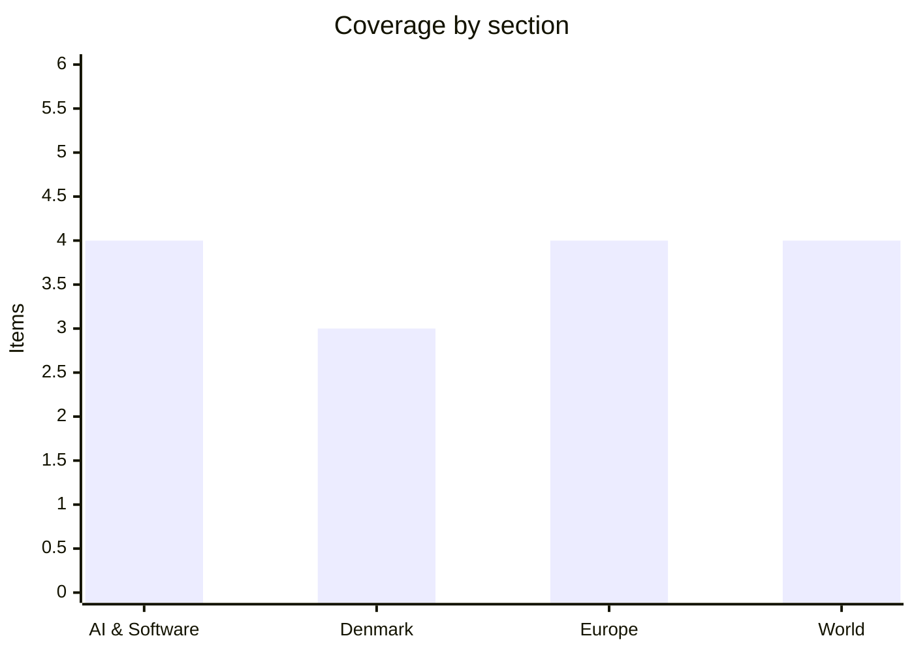

# Daily Briefing — 2026-07-21

**Top line:** Trump reached for a dormant 1930 trade weapon — Section 338 — to hit roughly $20bn of Canadian goods with 50% tariffs, opening a new front in the trade war, while the US–Iran war ground on with a third American service member killed and Russia pounded Kyiv with about 40 missiles overnight, killing at least ten.

*(No briefing ran on July 20, so this edition covers roughly the last 48 hours.)*

## Follow-ups

- **Burnham is now PM** — Andy Burnham was sworn in Monday July 20 as the UK's seventh prime minister in a decade; David Lammy resigned as deputy PM to let him build his own team, and Burnham held first calls with Trump and Zelensky (full item in Europe).
- **Hormuz war continued, not de-escalated** — the Pentagon confirmed a third US service member dead over the weekend; Mojtaba Khamenei vowed retaliation, and ASEAN ministers pressed for the strait to be reopened (full item in World).
- **ECB decision still set for July 23** — markets now price ~88% odds of a hold at 2.25% after June's hike (full item in Europe).
- **Kimi K3 open weights still promised by July 27** — independent benchmarks have now placed the model (full item in AI & Software).
- **France's assisted-dying law remains with the Constitutional Council** — a ruling is due within the month; no decision yet.

## AI & Software

**Google's Gemini 3.5 Pro is now months late, and the delay is a coding problem the company can't quickly fix.** Google has slipped the release of Gemini 3.5 Pro, its intended flagship frontier model, after internal testing showed it fell short on coding and complex long-horizon reasoning — the two areas where Anthropic's and OpenAI's latest models have pulled ahead. The Pro model was previewed at Google I/O in mid-May and had been expected around June; Google now says only that it is "currently testing 3.5 Pro, an upgraded Flash model, and other models with partners," with enterprise preview access on Vertex AI but no firm public date. Reporting cited by multiple outlets describes real frustration inside the company: Google updated Gemini's training data in late June specifically to improve coding and the results were "disappointing." The competitive stakes are unusually visible because coding has become the single clearest differentiator between frontier labs — the benchmark buyers actually pay for. Compounding the problem, at least four senior Gemini researchers left for Anthropic in late June, part of a sustained talent drain from DeepMind to rivals. One outlet tied the delay to roughly $225bn wiped off Alphabet's market value, though that figure should be read as a market reaction, not a clean cause-and-effect. The second reading matters: a delay to get a model right is defensible engineering discipline, but paired with the talent losses it reads to investors as Google slipping behind in the exact capability that defines this cycle. Watch whether Google ships Pro at all before autumn or leans on the upgraded Flash tier to stay in the conversation. [9to5Google](https://9to5google.com/2026/07/16/gemini-3-5-pro-delays/) · [Search Engine Journal](https://www.searchenginejournal.com/gemini-3-5-pro-delayed-over-coding-bloomberg-reports/582660/) · [Android Headlines](https://www.androidheadlines.com/2026/07/google-gemini-3-5-pro-model-delayed-coding-issues.html)

**Kimi K3's independent benchmarks land ahead of the July 27 open-weights drop — and they largely hold up.** Moonshot AI's Kimi K3, live via its apps and API since July 16 and the largest open-weight model ever announced at 2.8 trillion parameters, has now been run through independent evaluations ahead of the full weights release promised by July 27. The architecture is the headline: of 896 experts only 16 activate per token — roughly 1.8% of the pool — so a forward pass costs far less compute than the raw parameter count implies, built on a hybrid "Kimi Delta Attention" mechanism with a 1M-token context window and native vision. On LMArena's Frontend Code evaluation it ranked first at 1,679 points, ahead of Anthropic's Fable 5, in blind developer testing; on broader independent testing it lands fourth among all frontier models, trailing only Fable 5 and GPT-5.6 Sol and edging past Claude Opus 4.8. API pricing is aggressive — $0.30 per million cache-hit input tokens, $3 on cache misses, and $15 per million output tokens. The significance is strategic as much as technical: if the weights ship on schedule, K3 becomes the most capable openly available model on the planet, and it does so from a Chinese lab working around US compute export controls — the concrete counterpart to the WAICO alliance covered last week. The open question is deployment reality: at 2.8T parameters, "open weights" is meaningful only to organizations with the hardware to serve it, so the practical beneficiaries are cloud hosts and well-resourced enterprises, not hobbyists. Watch July 27 for whether Moonshot honors the release date and under what license. [Tom's Hardware](https://www.tomshardware.com/tech-industry/artificial-intelligence/moonshot-releases-2-8-trillion-parameter-kimi-k3) · [VentureBeat](https://venturebeat.com/technology/chinas-moonshot-ai-releases-kimi-k3-the-largest-open-source-model-ever-rivaling-top-u-s-systems) · [Simon Willison](https://simonwillison.net/2026/Jul/16/kimi-k3/)

**Microsoft's record Patch Tuesday — 570-plus flaws and an actively exploited SharePoint bug — keeps on-prem SharePoint in the crosshairs.** Microsoft's July 2026 Patch Tuesday fixed a record-breaking haul of vulnerabilities — reported at 570 by BleepingComputer and as high as 622 by other trackers — including three zero-days, of which two are under active attack. The one most relevant to enterprises is CVE-2026-56164, an elevation-of-privilege flaw in on-premises SharePoint Server caused by missing authentication for a critical function, which attackers are actively exploiting; it sits alongside the SharePoint deserialization zero-day (CVE-2026-58644) that CISA flagged last week with a three-day federal patch deadline. Elevation-of-privilege bugs dominated the release at 255 of the total (41%), followed by 166 remote-code-execution flaws (27%), and the batch also included a critical Windows Server network-driver RCE (CVE-2026-56188, CVSS 9.8) exploitable with no user interaction and a BitLocker bypass requiring physical access. The through-line from last week's SharePoint alarm is unmistakable: on-prem SharePoint has become one of the most reliably attacked enterprise products — internet-exposed, stateful, slow to patch — and 2026 is shaping up as a rerun of 2025's "ToolShell" wave. For anyone running these systems the instruction is the same as the federal one: treat the SharePoint fixes as emergency, not routine. Watch for exploitation-in-the-wild reports spreading from state-linked actors down to ransomware crews. [BleepingComputer](https://www.bleepingcomputer.com/news/microsoft/microsoft-july-2026-patch-tuesday-fixes-massive-570-flaws-3-zero-days/) · [The Hacker News](https://thehackernews.com/2026/07/microsoft-patches-record-622-flaws.html) · [Tenable](https://www.tenable.com/blog/microsofts-july-2026-patch-tuesday-addresses-569-cves-cve-2026-56155-cve-2026-56164)

**TSMC posts a record quarter on AI demand — the clearest proof yet the capex supercycle still has years to run.** Taiwan Semiconductor Manufacturing reported second-quarter revenue of about $39.62bn, up 36% year over year and a company record, and explicitly attributed the surge to AI demand. TSMC is the foundry that actually fabricates the leading-edge silicon for Nvidia, Apple, AMD and the hyperscalers' in-house chips, which makes its order book the least-hyped, most reliable barometer of whether the AI buildout is real spending or narrative. The read-through connects a run of recent commitments: OpenAI and Nvidia's partnership to deploy at least 10 gigawatts of Nvidia systems, with Nvidia intending to invest up to $100bn as they come online; Meta's multiyear deal for millions of Nvidia accelerators alongside its own September chip production; and Google's data-center electricity use jumping a record 37%. Taken together, the pattern is a committed, multi-year demand pipeline rather than a spot bubble — every major buyer is simultaneously placing record Nvidia orders and building replacement silicon, and TSMC fabricates both sides of that bet. The counter-case worth holding: concentration risk is now extreme, with a handful of firms underwriting hundreds of billions in interdependent commitments, so a stumble at any one of them ripples through the whole chain. Watch third-quarter guidance from the chip names and whether power availability, not chip supply, becomes the binding constraint. [NVIDIA Newsroom](https://nvidianews.nvidia.com/news/openai-and-nvidia-announce-strategic-partnership-to-deploy-10gw-of-nvidia-systems) · [Network World](https://www.networkworld.com/article/3562856/nvidia-latest-news-and-insights__trashed.html)

## Denmark

**Novo Nordisk's Wegovy pill clears the EU as prescriptions pass three million — and the company keeps buying back stock.** Novo Nordisk's oral Wegovy secured European Commission marketing authorization on July 15 as the first oral GLP-1 approved for weight management across the EU, clearing it for sale in all 27 member states plus Norway, Iceland and Liechtenstein, and a single ready-to-use pen for the higher 7.2mg injectable dose was approved alongside it. The company also reported that Wegovy pill prescriptions have surpassed three million — roughly one filled every five seconds — with the pill already available in the US, UK and UAE and more country launches planned in the second half of 2026. On July 20 Novo disclosed the latest tranche of its ongoing share-repurchase programme, the routine mechanism by which the Bagsværd-based group returns cash to shareholders. For the Danish economy the stakes are hard to overstate: Novo Nordisk is the country's largest company and its single biggest export engine, and the obesity franchise is the reason Danish GDP and the krone story have held up better than the wider European picture. The oral formulation matters commercially because a pill removes the cold-chain and injection barriers that cap the reach of the weekly shot, opening large primary-care and emerging markets. The competitive pressure from Eli Lilly is the constant backdrop, which is why the "first oral GLP-1 in the EU" framing is a genuine moat claim rather than marketing. Watch the second-half launch cadence and whether payers in individual EU states move quickly on reimbursement. [Novo Nordisk / GlobeNewswire](https://www.globenewswire.com/news-release/2026/07/15/3327953/0/en/novo-nordisk-receives-european-commission-approval-of-wegovy-pill-as-first-oral-glp-1-for-weight-management-in-the-eu-single-ready-to-use-pen-for-higher-dose-7-2-mg-also-approved.html) · [PR Newswire](https://www.prnewswire.com/news-releases/wegovy-pill-prescriptions-surpass-3-million-1-filled-roughly-every-5-seconds-bringing-glp-1-therapy-to-people-with-obesity-previously-untreated-while-novo-nordisk-unveils-new-data-at-ada-2026-302793337.html)

**Denmark commits to two Boeing P-8 Poseidon patrol aircraft as the Arctic build-up — and the Trump pressure behind it — continues.** The Danish Ministry of Defence has moved to acquire two Boeing P-8 Poseidon maritime patrol aircraft to strengthen surveillance over the North Atlantic and Greenland, specialised planes built to monitor vast sea areas and hunt submarines and surface warships. The Defence Command has also opened a study of possible cooperation with NATO allies on the fixed-wing programme — potentially a shared unit at one air base with pooled operations, maintenance and training — and TV2 has valued the broader effort at "tens of billions" of kroner. The purchase sits atop more than 40bn kroner allocated to Arctic defence over the past eighteen months, covering new ships, radars, satellite surveillance and facilities for F-35s. The political driver is explicit: the spending has accelerated under sustained pressure from President Trump, who has repeatedly said Greenland should be under US rather than Danish control, and Danish analysts openly concede the money has "not yet reassured" Washington. That is the uncomfortable core of the story — Denmark is spending heavily both to meet a genuine Russian threat in the High North and to demonstrate to an ally-turned-antagonist that it can defend the Kingdom itself. Whether that demonstration changes Trump's calculus is the open question, and the analysts quoted are sceptical. Watch for the formal procurement contract and any joint-basing announcement with allies. [Breaking Defense](https://breakingdefense.com/2026/07/denmark-greenlights-two-aircraft-p-8-procurement-for-arctic-surveillance/) · [DR](https://www.dr.dk/nyheder/indland/knap-15-milliarder-kroner-skal-styrke-forsvaret-af-groenland-men-det-er-naeppe-nok) · [gCaptain](https://gcaptain.com/denmark-commits-2-billion-to-arctic-defense-amid-growing-security-concerns/)

**Afghanistan-war transparency campaigner Morten Kromann honoured for forcing open Denmark's decision to go to war.** Morten Kromann was awarded an honorary prize from the Thomas Gerstenberg Foundation for the Protection of Legal Security, recognising his years of work to secure openness about the political decisions that underpinned Denmark's participation in the Afghanistan war. The award is a reminder of an unresolved national reckoning: how a small country committed troops to a two-decade conflict, and how much of that decision-making was ever exposed to public and parliamentary scrutiny. Prizes of this kind function partly as pressure — keeping alive the argument that access to the underlying documents is a matter of democratic accountability, not just historical curiosity. It is a comparatively quiet item on a slow domestic news day, but one that speaks to a recurring Danish debate about transparency in foreign and security policy at exactly the moment defence spending is surging. [DR](https://www.dr.dk/nyheder/indland)

*Otherwise a quiet domestic news day in Denmark: Nordic second-quarter earnings dominated the market wires (Volvo Cars disappointed on a 1.1% EBIT margin, Getinge and Viaplay rose), but there was little fresh national political news.*

## Europe

**Russia hammers Kyiv with about 40 missiles, killing at least ten, as NATO's top officer warns Moscow off the Baltics.** Russia struck Kyiv overnight into Monday July 20 with roughly 40 Iskander-M and hypersonic Zircon missiles, killing at least ten people and wounding more, in one of the heaviest barrages on the capital in recent weeks. Zelensky called protection against ballistic missiles Ukraine's "constant and top priority," repeating that interceptors are needed every single day — a direct appeal for more Western air-defence supply that lands in the first days of a new UK premiership pledged to sustain support. The strikes came as Ukraine's own deep-strike campaign continued to bite, with interdiction of Russian refineries and fuel logistics driving gasoline shortages in Moscow and pushing Russia toward Indian fuel imports. Against that backdrop, NATO's most senior officer, Admiral Giuseppe Cavo Dragone, warned that a Russian move against Poland or the Baltic states should be taken seriously but that Moscow "would lose a lot, much more than they could gain." The alliance framing is deliberately deterrent: officials describe an intensifying Russian hybrid campaign across Europe, and the EU has pointed to Russia's FSB "Center 16" conducting cyberespionage and sabotage against defence industries and critical infrastructure. The two messages — a bloody night in Kyiv and a warning shot to Moscow over NATO territory — capture the war's current phase: attritional inside Ukraine, and increasingly a contest of nerves along the alliance's eastern edge. Watch the air-defence pledges from Burnham's government and whether Russian hybrid incidents escalate over the summer. [CNBC](https://www.cnbc.com/2026/07/20/nato-russia-ukraine-war-missile-attacks-drone-europe-defense-.html) · [Guardian via UNN](https://unn.ua/en/news/nato-countries-warned-of-possible-russian-provocation-against-poland-and-the-baltics-the-guardian)

**Andy Burnham becomes UK prime minister, promising to "regain our stability" — and reshuffling from the first day.** Andy Burnham was formally appointed Britain's prime minister on Monday July 20 after meeting King Charles III, becoming the country's seventh leader in a decade and succeeding Keir Starmer, who completed the handover after a farewell Kyiv visit. In his first speech Burnham pledged to make politics "work better" and said Britain must "regain our stability," setting out a domestic agenda heavy on cost-of-living relief, getting young people into work, ending rough sleeping, re-industrialisation and putting "life's essentials back under public control." The transition triggered immediate churn at the top: David Lammy, the deputy prime minister and justice secretary and a former foreign secretary, resigned to let Burnham assemble his own team, and the finance minister also signalled departure. On the international side Burnham moved fast — Trump phoned him Monday, and Burnham spoke with Zelensky and invited him to visit the UK, consistent with the "100 percent" Ukraine pledge he made on winning the Labour leadership. The unknowns are real: Burnham won from outside the Westminster front rank on a platform to Starmer's left, and how that converts into fiscal policy, EU relations and defence spending is untested. He has ruled out an early election, meaning he governs on the existing mandate. Watch the full cabinet line-up and his first Commons statement, particularly on the fiscal room for continued Ukraine aid. [CNN](https://edition.cnn.com/2026/07/20/world/live-news/andy-burnham-uk-prime-minister-intl) · [ABC News](https://abcnews.com/International/andy-burnham-become-uks-prime-minister-after-meeting/story?id=134907835) · [NPR](https://www.npr.org/2026/07/19/nx-s1-5895993/andy-burnham-prime-minister-keir-starmer)

**ECB expected to hold on Thursday — but with energy-driven inflation revised up, the tone will matter more than the decision.** The European Central Bank's Governing Council meets Thursday July 23, and markets have almost entirely priced a hold at 2.25% — roughly 88% odds — after June's hike. The backdrop is awkward: the ECB's baseline 2026 inflation forecast has been revised sharply upward to 2.6% from an earlier 2.0%, driven largely by energy-price pressure from the Middle East conflict, even as growth slows. That combination — above-target inflation and softening activity — is the classic central-bank bind, and it gives the Council reason to pause and watch whether the energy shock persists rather than commit to another move. Crucially, July is a non-projection meeting: unlike June there are no fresh staff macro forecasts, so the entire signalling burden falls on the policy statement, the vote split and Lagarde's press conference at 14:30 CET. That makes the tone potentially more market-moving than the rate itself — a hawkish hold that keeps a further hike explicitly on the table would read very differently from a dovish one hinting the tightening cycle is done. For Denmark, whose krone is pegged to the euro, the ECB's path feeds directly into domestic mortgage and financing rates. Watch the statement language on energy pass-through and any dissent in the vote. [Morningstar](https://global.morningstar.com/en-nd/economy/ecb-rate-decision-what-expect-july-23) · [PipTheory](https://www.piptheory.com/research/ecb-meeting-july-2026-preview-euro-eur)

**France's assisted-dying law waits on the Constitutional Council as the church and Senate mobilise against it.** France's landmark right-to-die law, adopted by the National Assembly on July 15 by 291 votes to 241, remains suspended while the Constitutional Council reviews it — a referral pushed by the Senate president, more than sixty senators, and, unusually, Prime Minister Sébastien Lecornu, who is personally opposed and asked the court to stress-test his own parliament's law before promulgation. The Council has up to a month to rule on whether the text conforms to the constitution, meaning a decision is due within weeks. The law would let adults who are French citizens or stable residents, suffering from a serious and incurable illness in an advanced or terminal phase, request a lethal substance to be self-administered or, where the patient cannot, given by a doctor or nurse. French bishops have decried the vote as a "turning point" in the nation's history, and opponents have launched petitions demanding a referendum. If the Council upholds it, France joins the Netherlands, Belgium, Switzerland and Canada among countries permitting assisted dying — the largest to do so. Watch the ruling: it will determine whether the five eligibility criteria and the procedure survive intact, are partially struck down, or force a rewrite. [France 24](https://www.france24.com/en/france/20260715-france-expected-to-pass-final-vote-on-assisted-dying-after-years-of-debate) · [Al Jazeera](https://www.aljazeera.com/news/2026/7/15/french-parliament-approves-landmark-assisted-dying-bill) · [Time](https://time.com/article/2026/07/16/france-assisted-dying-bill-where-legal/)

## World

**Trump invokes a dormant 1930 statute to hit Canada with 50% tariffs — the "nuclear option" reopens the trade war.** President Trump signed three proclamations Monday July 20 imposing additional 50% tariffs on a range of Canadian imports, using Section 338 of the Tariff Act of 1930 — an authority with no public record of use since 1949 — on the grounds that Canada discriminates against US cars, alcohol and dairy. Each proclamation targets a different set of goods, spanning products from wine to hockey sticks to cement, and together they cover roughly $20bn in annual Canadian imports; the duties take effect 30 days after signing. The choice of Section 338 is what makes this more than another tariff headline: it is an obscure, untested "nuclear option" that lets the president impose duties by proclamation to counter alleged discrimination, and its revival invites both legal challenge and escalation. Ottawa signalled it will not absorb the blow — Ontario Premier Doug Ford said Canada should respond "tariff for tariff, dollar for dollar." Economists warn of a fresh inflationary shock and disruption to the USMCA framework that has governed North American trade. The two readings: the White House casts this as levelling the field for American exporters, while critics see an untested legal weapon that risks igniting a retaliatory spiral with the closest US trading partner. Watch Canada's retaliation list and whether the Section 338 basis draws an immediate court challenge before the 30-day clock runs. [CNBC](https://www.cnbc.com/2026/07/20/trump-tariffs-canada-trade.html) · [Fortune](https://fortune.com/2026/07/20/trump-tariffs-canada-50-percent-section-338-nuclear-option-inflation-usmca/) · [Al Jazeera](https://www.aljazeera.com/news/2026/7/21/trump-imposes-50-us-tariffs-on-some-canadian-goods-citing-discrimination)

**US–Iran war grinds on: a third American soldier killed, Khamenei vows retaliation, and ASEAN presses to reopen Hormuz.** The US–Iran conflict escalated further over the weekend, with the Pentagon confirming a third US service member dead — killed during the disposal of a downed Iranian attack drone in northern Iraq on Saturday, after two soldiers died in an Iranian missile strike in Jordan on Friday. Iran's Supreme Leader Mojtaba Khamenei issued a statement accusing Trump of violating the June US–Iran memorandum and pledging a strong response from Iran and its proxies, calling the United States "the great Satan." The fighting continues to centre on the Strait of Hormuz, where the underlying dispute is unresolved: Washington reads the pre-war understanding as requiring Iran to guarantee safe passage, while Tehran reads it as recognition of an Iranian role managing traffic. On July 20 Southeast Asian ministers meeting in Manila called for the strait to be reopened, a sign of how directly the crisis is now hitting Asian energy security. US Central Command has continued strikes on Iranian assets, and oil markets remain on edge with the risk premium embedded in prices. Casualty and violation claims from both sides should be read as contested and self-reported. The immediate question is whether any diplomatic channel survives the nightly strike tempo, since each recent round has been followed by escalation rather than a pause. Watch for an Iranian "strong response" materialising and for any renewed mediation push. [Democracy Now](https://www.democracynow.org/2026/7/20/headlines) · [Al Jazeera live](https://www.aljazeera.com/news/liveblog/2026/7/20/iran-war-live-us-military-carries-out-another-wave-of-strikes-on-iran) · [Wikipedia: 2026 Strait of Hormuz crisis](https://en.wikipedia.org/wiki/2026_Strait_of_Hormuz_crisis)

**Israeli strikes kill more Palestinians in Gaza as a leaked cabinet remark shows Netanyahu privately calling settler violence a "metastasizing cancer."** Israeli strikes across Gaza killed at least nine Palestinians on Saturday, including three children, with a further strike on a tent sheltering displaced families in the south killing at least one more on Sunday night, according to Gaza health officials — part of what Palestinians describe as an intensification of attacks in recent days. Separately, Israeli media surfaced a striking gap between Netanyahu's private and public positions on West Bank settler violence: Channel 13 reported that during cabinet deliberations in March he called violent settler extremists a "metastasizing cancer," even as he publicly dismissed the attacks as the work of "150 or so juvenile delinquents." The report says parts of a government plan to curb settler violence were kept hidden for political reasons, with Netanyahu and unnamed ministers wanting it concealed while Shin Bet chief David Zini and other security officials pushed to publicise it. The context is a documented surge: the UN humanitarian office OCHA records an average of six settler attacks per day in 2026, higher than any year on its record. The casualty figures come from Gaza health authorities and the private remark from Israeli reporting; neither is independently verified here. The through-line is a war whose diplomatic bandwidth is almost entirely consumed by the Hormuz crisis, leaving Gaza's ceasefire tracks stalled. Watch whether the leaked plan forces any public shift on West Bank enforcement. [Times of Israel](https://www.timesofisrael.com/liveblog-july-20-2026/) · [Democracy Now](https://www.democracynow.org/2026/7/20/headlines) · [Haaretz](https://www.haaretz.com/israel-news/israel-security/2026-07-07/ty-article/netanyahu-says-settler-attacks-caused-by-150-or-so-juvenile-delinquents/0000019f-3d9e-d07c-af9f-fddf6e160000)

**Spain wins its second World Cup, beating Argentina 1-0 in extra time as Ferran Torres settles a one-sided final.** Spain won the 2026 FIFA World Cup on Sunday July 19, beating Argentina 1-0 at MetLife Stadium in New Jersey on a 106th-minute goal from substitute Ferran Torres — its second title after 2010. The match was lopsided on the run of play: Spain outshot Argentina 20 to 3 but could not break through in regulation, and Argentina spent all of extra time a man down after Enzo Fernández was sent off for a second yellow late in normal time. Torres, on since the 62nd minute, pounced on a bouncing ball in the box and finished left-footed under the bar before a crowd of 80,663. The tournament was co-hosted across North America with the final in the US, and President Trump attended and presented the 18-karat gold trophy to the winners. For Argentina it closes a cycle around Lionel Messi that ends without back-to-back titles; for Spain it caps a generational run that pairs the senior men's crown with recent youth and continental success. A sporting item rather than a policy one, but a genuinely historic result that much of Europe followed closely. [NPR](https://www.npr.org/2026/07/19/nx-s1-5899071/2026-world-cup-fifa-argentina-spain-final-championship) · [CBS News](https://www.cbsnews.com/news/2026-fifa-world-cup-final-spain-argentina-sunday/) · [FIFA](https://www.fifa.com/en/match-centre/match/17/285023/289292/400021543)

## Watch list

- **ECB decision, Thursday July 23, 13:45 CET** — hold at 2.25% is priced in; the statement tone and vote split on energy-driven inflation are the real signal.
- **Kimi K3 open weights, promised by July 27** — would be the largest open-weight model ever released; watch the date and licence.
- **France's Constitutional Council** — ruling on the assisted-dying law due within weeks; determines whether it survives intact.
- **Canada's tariff retaliation** — response expected within the 30-day window before the US Section 338 duties take effect, plus a likely legal challenge to the statute.
