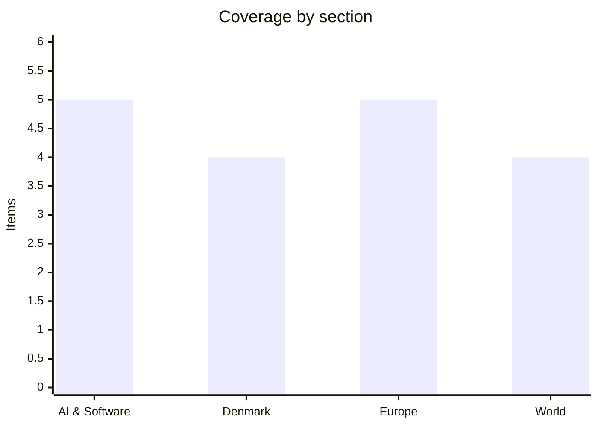

# Daily Briefing — 2026-07-25

**Top line:** Trump's replacement tariffs took effect overnight with the EU at 10%, he told Axios he is "close to making a decision" on a massive attack against Iran as oil holds above $100, and he opened a Section 301 probe of the EU over the Google fines — while Anthropic shipped Claude Opus 5, matching most of Fable 5's capability at half the price.

## Follow-ups

- **Tariff proclamation: resolved** — the EU landed at 10% alongside Taiwan and 17 named partners, 41 countries at 12.5%, effective 12:01 a.m. Friday (full item in World).
- **Trump–EU tech standoff: escalated** — a Section 301 investigation of EU trade practices over the DMA fines, with a separate "substantial TARIFF" threatened (full item in Europe).
- **Fedorov standoff: hardened** — he formally rejected the deputy-PM-for-military-innovation post as protests entered day 8 (full item in Europe).
- **Houthi blockade: widened asymmetrically** — one tanker transited Hormuz on Thursday (lowest since May 7), and the Houthis are exempting Chinese ships (in the World lead).
- **White House frontier-AI framework: still unpublished** — one week to the August 1 deadline; TechTimes notes Commerce has already suspended frontier models twice using export-control authority the EO does not limit.
- **DeepSeek V4 cutover: completed as scheduled** — the legacy aliases died at 15:59 UTC Friday; no widespread breakage reported so far.
- **EA Foreign Subsidies decision: near** — Reuters sources say PIF is set to win unconditional FSR clearance by the July 30 deadline *(reported, unconfirmed)*.
- **Yen: fresh 40-year low** — 163.99 Thursday, its worst week since May; the ¥165 intervention line held overnight.

## AI & Software

**Anthropic releases Claude Opus 5 — most of Fable 5's capability at half the price, and deliberately blunted on cyber.** Anthropic on July 24 released Claude Opus 5, priced at $5 per million input tokens and $25 per million output — unchanged from Opus 4.8 and exactly half the $10/$50 of Fable 5, the company's flagship. The pitch is frontier capability at the mid tier: Anthropic's own figures show 43.3% on Frontier-Bench v0.1 against Fable 5's 33.7% and Opus 4.8's 18.7%, wins in five of nine head-to-head benchmarks against Fable 5, and a gain of more than 10 percentage points over Opus 4.8 on organic-chemistry tasks. On OSWorld 2.0, the computer-use benchmark, Anthropic says Opus 5 clears Fable 5's peak score using roughly a third of the compute budget, and on Zapier's AutomationBench its pass rate runs about 1.5× the next-closest model at matching cost. Two details matter beyond the numbers. First, Anthropic calls it its most-aligned model to date and says cyber-capability classifiers intervene about 85% less often than on Fable 5 — a designed-in ceiling on offensive-security capability, which reads as a direct response to the June episode in which Commerce suspended Fable 5 and Mythos 5 globally for three weeks over a jailbreak exposing cyber-offence capabilities. Second, distribution: Opus 5 is immediately the default on Claude Max, the API, Claude Code and Claude Cowork, and the strongest model on Pro — meaning most Claude users get the upgrade without asking. A fast mode runs about 2.5× the default speed at twice the price. The competitive read: after GPT-5.6's tiered Sol/Terra/Luna launch this month, both labs now sell "near-flagship intelligence at commodity prices", and the margin pressure moves to everyone underneath. [Anthropic](https://www.anthropic.com/news/claude-opus-5) · [OfficeChai](https://officechai.com/ai/claude-opus-5-benchmarks/) · [MarkTechPost](https://www.marktechpost.com/2026/07/24/meet-the-new-claude-opus-5-frontier-class-agentic-coding-and-computer-use-at-unchanged-opus-pricing/)

**Big Tech and VCs sign a joint letter against open-weight restrictions — Nvidia's Jensen Huang publishes it as his first-ever post on X.** Meta, Microsoft, Nvidia, IBM, Palantir, Hugging Face, Perplexity, Mistral, Andreessen Horowitz, Y Combinator, the Linux Foundation and roughly a dozen other signatories on July 24 urged the US government to avoid "premature restrictions" on open-weight AI models and to expand public compute and shared training assets. The two most conspicuous absences are OpenAI and Anthropic — the two labs deepest inside the White House's voluntary pre-release review process — making the letter a fairly clean map of where the industry splits on the question. Huang broke his personal silence on X to publish it, arguing "the world needs both frontier closed models and frontier open models", a notable intervention given Nvidia sells the compute for both sides. The context is the August 1 frontier-model framework deadline: the voluntary review structure covers five closed-API labs while Meta — whose open-weight Llama models cannot be recalled after release — has refused to join, and Washington is actively debating restrictions on Chinese open-weight models. The diplomatic backdrop cuts the other way: at the APEC Digital and AI Ministerial in Chengdu on July 23, all 21 member economies including the US and China endorsed "trusted open-source approaches" in the first APEC AI declaration to explicitly back open source. The tension between those two positions — signing a multilateral statement backing open source while considering domestic restrictions on open weights — is now explicit. Watch whether the letter shifts the framework's treatment of open-weight models before August 1, and whether Meta joins the review pact or keeps betting it cannot be forced. [CNBC](https://www.cnbc.com/2026/07/24/nvidia-microsoft-meta-open-weight-ai-models.html) · [APEC statement](https://www.apec.org/meeting-papers/sectoral-ministerial-meetings/telecommunicationsandinformation/2026-apec-digital-and-ai-ministerial-statement)

**A one-message sandbox escape in Claude Cowork on Mac — and Anthropic says it won't patch.** Security firm Accomplish AI disclosed on July 23 that Claude Cowork's local Linux-VM sandbox on macOS can be escaped with a single message, giving the AI agent full read/write access to the host filesystem — including SSH keys and cloud credentials. The "SharedRoot" chain abuses unprivileged user namespaces plus CVE-2026-46331 in the guest kernel, and the researchers estimate roughly 500,000 Macs run the affected configuration. The uncomfortable part is the vendor response: Anthropic closed the report as "informative" without shipping a fix, pointing users to the cloud-execution default as the mitigation — a defensible engineering position (the local VM is explicitly a convenience mode) that still leaves a documented escape unpatched on half a million machines. The disclosure landed in a bad week for agentic-AI attack surface generally: Zenity Labs on the same day published "AgentForger", a cross-site request forgery in OpenAI's ChatGPT Workspace Agents builder in which a single phishing link could silently create and deploy an attacker-controlled agent inside a victim's organisation — inheriting the employee's Outlook, Teams, Slack, SharePoint and Google Drive connectors and polling attacker email every five minutes for orders. OpenAI patched that one in four days back in June; the write-up is new. The pattern across both: the agent platforms shipping fastest are accumulating classic web-security bug classes (CSRF, sandbox escape) with distinctly non-classic blast radius, because the compromised artifact is an authorised agent with the user's credentials. For anyone running agentic tooling with local file access, the practical takeaway is to treat sandbox mode as a soft boundary and prefer cloud execution for untrusted content. [The Hacker News](https://thehackernews.com/2026/07/claude-cowork-flaw-could-let-ai-agent.html) · [Zenity Labs](https://labs.zenity.io/p/agentforger-part-1-chatgpt-cross-site-agent-forgery)

**Intel doubles earnings expectations on its fastest growth in 15 years — and the stock drops 8% anyway.** Intel's Q2 report late Thursday showed non-GAAP EPS of $0.42 against the $0.21 analysts expected, on revenue of $16.1bn, up 25% year on year and well above the $14.4bn consensus — the company's fastest revenue growth in more than 15 years. The reaction repeated the Alphabet pattern from earlier in the week: an initial 4% after-hours pop, then a 7.9% fall on Friday to $92.32 as investors probed the quality of the beat, with questions concentrated on foundry-customer progress and AI-spending discipline. The stock is still up roughly 170% in 2026, which is the real context — Intel has gone from near-write-off to the year's best-performing mega-cap on the strength of the foundry turnaround, and at that valuation a huge beat that isn't a perfect beat reads as a sell signal. The most consequential detail may be a report from The Information that Google has ordered production of 3 million of its custom TPUs from Intel *(reported, unconfirmed)* — if accurate, that is the marquee external foundry customer Intel has spent three years promising, and it would slot Intel into the AI-accelerator supply chain that TSMC currently monopolises. CPU demand is also genuinely strong, pulled by AI server build-outs. The read-through: the AI capex supercycle that spooked Alphabet investors on the spending side is landing as revenue at Intel and the equipment makers — the same dollars, opposite side of the ledger. Watch whether the Google TPU order is confirmed, and how Intel's Q3 guidance holds up against the Qualcomm price-hike and memory-shortage backdrop rippling through the chip supply chain. [CNBC](https://www.cnbc.com/2026/07/24/intel-reported-a-huge-earnings-beat-analysts-remain-on-the-fence-.html) · [24/7 Wall St](https://247wallst.com/investing/2026/07/24/intel-rises-3-on-q2-earnings-beat-upbeat-q3-outlook-as-chip-sector-stays-flat/) · [Motley Fool](https://www.fool.com/coverage/stock-market-today/2026/07/24/stock-market-today-july-24-intel-reverses-gains-on-foundry-and-ai-spending-concerns/)

**Delhi High Court rules ChatGPT training is "fair dealing" — OpenAI wins the interim round in India's biggest AI copyright case.** Justice Amit Bansal of the Delhi High Court on July 24 denied Asian News International's bid for an interim injunction against OpenAI, ruling that training ChatGPT on ANI's news content falls under the "fair dealing" exception in Section 52(1)(a) of India's Copyright Act. The court found ChatGPT's outputs are not substantially similar to ANI's reporting and, notably, weighed the public interest on OpenAI's side — holding that granting the injunction would cause "irreparable injury" to OpenAI and the public. The underlying suit continues toward trial, but the interim ruling materially weakens training-data liability theories in India, the world's second-largest internet market and one of ChatGPT's biggest user bases. The global scoreboard now reads differently by jurisdiction: US courts have sent the NYT–OpenAI and related cases toward fact-heavy fair-use trials, the EU relies on opt-out text-and-data-mining exceptions, and India's first major precedent has come down clearly on the developers' side. ANI, which is part-owned by Reuters, brought the case in 2024 over both training and alleged verbatim reproduction; the substantial-similarity finding addresses the second theory head-on. Two readings: a straightforward application of India's enumerated exceptions, or a strategic signal that India — which is courting AI-infrastructure investment — will not let copyright become the sector's chokepoint. Watch whether ANI appeals to a division bench and whether the ruling shifts settlement dynamics in the parallel Indian music-industry cases against OpenAI. [LiveLaw](https://www.livelaw.in/high-court/delhi-high-court/delhi-high-court-rejects-ani-copyright-suit-open-ai-chatgpt-542736)

## Denmark

**One tanker through Hormuz, emergency rates up to $3,800 per container: the war's squeeze on Danish shipping, quantified.** The week's escalation — the Houthis' first actual attacks on Saudi-bound tankers Thursday, and Iran's continued contest of the Strait of Hormuz — is now visible in hard numbers at Maersk, whose response defines the Danish corporate stake in this war. Ship-tracking data showed just one tanker crossing Hormuz on Thursday, the lowest daily count since May 7, while Maersk's standing operational posture (Middle East Operational Update 40, July 22) keeps Hormuz transits suspended and bookings paused across the upper Gulf: reefer, dangerous-goods and out-of-gauge cargo suspended to and from the UAE, Iraq, Kuwait, Qatar, Bahrain and much of Saudi Arabia. In place of the sea route, the company is running a multimodal workaround at scale — transshipping via Salalah and Khor Fakkan, then trucking cargo overland to Sharjah and onward by intra-Gulf feeder, with an Emergency Freight rate of $1,800 per 20-foot container, $3,000 per 40-foot and $3,800 for reefer and DG boxes, plus $1,000 per container for any vessel that does risk a Hormuz transit. Air freight out of the region carries a fuel surcharge of at least 15% of the transport rate, and Maersk notes that several insurers have reduced or withdrawn cover for the Red Sea, Gulf of Oman and Persian Gulf outright. The strategic exposure is structural: shipping and logistics are a large share of Danish GDP and the C25's earnings base, and Maersk is effectively rebuilding its Middle East network in real time around two blocked chokepoints. The costs land on cargo owners now and on inflation later. Watch Maersk's Q2 interim report on August 6 for the first quantified P&L effect, and whether the "land bridge" holds if the Houthis extend attacks to Saudi Red Sea ports like Yanbu. [Maersk Update 40](https://www.maersk.com/news/articles/2026/07/22/middle-east-operational-update-40) · [gCaptain](https://gcaptain.com/maersk-keeping-strait-of-hormuz-transits-suspended-as-ceasefire-confidence-wavers/) · [Irish Times](https://www.irishtimes.com/world/middle-east/2026/07/24/us-continues-to-strike-iran-as-bahrain-warns-of-attack/)

**Thefts from bicycles in Copenhagen up 73% — the basket-bag snatch is the capital's growth crime.** Copenhagen police registered 1,300 reports of theft from bicycles in the first six months of 2026, against 753 in the same period last year — a 73% jump — and three of Denmark's largest insurers report the same trend in claims. The pattern is specific: bags lifted from bicycle baskets, either discreetly from parked bikes or snatched at speed by thieves on scooters while the cyclist waits at a red light, leaving little chance of pursuit. Reports of stolen bike equipment and e-bike batteries are also rising, the latter tracking the electrification of the Danish bike fleet — a battery is now often the most valuable easily-detached object on the street. The numbers land in a city that runs on cycling: with well over half of Copenhagen commutes by bike, the bicycle basket is effectively the city's handbag, and the crime wave amounts to industrialised pickpocketing of it. Insurers' advice is the unglamorous kind — keep bags on your body, lock batteries, register serial numbers — and police have not announced a targeted response yet. Worth noting alongside June's record smishing wave from yesterday's briefing: petty crime in Denmark is increasingly organised, mobile and volume-based, whether digital or physical. Watch whether the H2 numbers force a dedicated police operation the way bike-theft rings did a decade ago. [The Local Denmark](https://www.thelocal.dk/20260724/today-in-denmark-a-roundup-of-the-latest-news-on-friday-54)

**Spain extradites suspected 10-tonne cannabis smuggler to Denmark.** A 45-year-old man with Spanish and Moroccan citizenship, suspected of smuggling 10 tonnes of cannabis into Denmark across several periods in 2019–2020, has been handed over by Spanish authorities and was remanded in custody until August 19 at a hearing in Aarhus on Thursday. He was arrested in Spain in June at the request of the National Special Crime Unit (NSK), with the extradition run in close cooperation with the Guardia Civil. The case belongs to a larger NSK investigation that in 2023 produced a 17-year sentence — among Denmark's heaviest drug sentences — for another man over 167 kilos of cocaine and 3.2 tonnes of cannabis, along with weapons possession and a confiscation order of 14 million kroner. Ten tonnes places this among the largest cannabis-import cases Danish prosecutors have brought, and the successful extradition is the operative point: NSK's model of pursuing logistics-layer suspects abroad through European arrest warrants has quietly become routine, with Spain — the main cannabis gateway into Europe — the most frequent counterpart. The custody period to mid-August suggests charges are still being finalised. Expect a trial date announcement in the autumn. [The Local Denmark](https://www.thelocal.dk/20260724/today-in-denmark-a-roundup-of-the-latest-news-on-friday-54)

**Odense doubles its task force against the "caterpillar from hell" as the oak processionary moth digs in across Denmark.** Odense municipality is deploying 10 special teams this weekend to clear nests of the oak processionary moth — the toxic-haired caterpillar Danish media have dubbed "helvedeslarven" — and will double that to more than 20 teams next week, working both infested areas and zones where preventive action is judged necessary. The intensive phase is expected to run a couple more weeks before a reassessment. The caterpillar, whose microscopic barbed hairs cause severe skin rashes, eye irritation and in bad cases respiratory reactions, has now been found in Odense, Kerteminde, Nyborg, Morsø, Herning, on Amager and across North Funen — a distribution that suggests establishment rather than isolated arrivals. Odense, the worst-hit municipality, has already set aside millions of kroner for the effort earlier this month. The species' northward spread is a textbook warming-climate range expansion: established in the Netherlands and Germany over the past two decades, it reached Denmark in earnest only in recent years, and this is the first summer requiring sustained municipal task forces. The operational problem is that nests must be removed physically by protected crews — there is no practical spraying regime for urban oaks — making this a recurring seasonal cost rather than a one-off eradication. Watch whether the state steps in with a national strategy if next spring's hatch confirms the moth is now endemic. [The Local Denmark](https://www.thelocal.dk/20260724/today-in-denmark-a-roundup-of-the-latest-news-on-friday-54) · [Background](https://www.thelocal.dk/20260706/odense-municipality-sets-aside-millions-to-combat-caterpillar-from-hell)

## Europe

**Trump orders a Section 301 probe of the EU over the Google fines and threatens a "substantial TARIFF" — Brussels' enforcement is now formally a trade dispute.** A day after the Commission's €890m DMA fines against Google, Trump on July 24 said the US will investigate EU trade practices, accusing the bloc of "ROBBING" American tech companies and taxpayers, promising the EU will pay "a very big price", asserting the penalties "will be entirely reversed", and threatening a "substantial TARIFF" on the EU "at the earliest possible moment". The administration is using Section 301 of the Trade Act — the same statute underpinning the new global tariff regime that took effect the same morning with the EU at the favourable 10% rate, which gives the threat teeth: a 301 finding against EU digital enforcement would provide the legal vehicle to single the EU out for a higher rate later. The Commission offered no immediate comment; Google's president of global affairs Kent Walker separately attacked the DMA as a regulation that "continues to break everyday products". The escalation formalises something long implicit — Washington treating EU tech regulation (DMA, DSA, digital taxes) as a trade barrier rather than domestic policy — and it puts Brussels in a bind it has so far refused to acknowledge: the DMA's credibility requires enforcing against exactly the companies whose government now threatens retaliation. Two readings of the timing: an opportunistic bargaining chip in the broader tariff negotiation, or the opening of a genuine second front that ends with EU digital enforcement on the table in trade talks — as the UK's digital services tax once was. The Commission's first test comes fast: Google's 60-day compliance clock on the search-redesign order is running, and the TikTok DSA charges (below) landed the same day the probe was announced. Watch for the USTR's formal 301 notice and whether von der Leyen's team links the dispute to the still-unfinished EU–US trade framework. [CNBC](https://www.cnbc.com/2026/07/24/trump-tariffs-eu-trade-google-apple-tech.html) · [The Hill](https://thehill.com/policy/technology/5988736-trump-eu-google-fine-investigation/) · [US News](https://www.usnews.com/news/business/articles/2026-07-24/trump-says-us-will-investigate-eu-trade-practices-claiming-the-bloc-unfairly-fined-tech-giants)

**Brussels charges TikTok with DSA breaches over minors' accounts — the day after fining Google, and hours after Trump's tariff threat.** The Commission on July 24 issued preliminary findings that TikTok breaches the Digital Services Act by failing to keep minors' accounts safe: users aged 13–15 can switch their profiles from private to public with minimal friction, while accounts of 16- and 17-year-olds are public by default and their content is visible to anyone — including people without a TikTok login — and recommendable to any user through the For You feed. The Commission's position, per its minors-protection guidelines, is that minors' content should by default be visible only to approved followers; the exposure as designed creates risks of unwanted contact, cyberbullying and predatory behaviour. If the findings are confirmed, TikTok faces a fine of up to 6% of global turnover, and this is the fourth EU proceeding against the platform in two years — following the ad-repository case, the Lite rewards-programme retreat, and the ongoing algorithmic-risk investigation. TikTok can now respond in writing before a final decision. The timing is the story as much as the substance: the charges dropped within 24 hours of the Google DMA fines and hours after Trump announced his Section 301 probe of exactly this kind of enforcement — and TikTok's Chinese ownership makes it the one large platform whose punishment Washington is unlikely to defend. That asymmetry may be tactically convenient for Brussels, but it also exposes the Commission to the charge that enforcement pace now tracks geopolitics. Watch TikTok's response deadline, and whether the Commission's pending DSA cases against X and Meta accelerate or quietly slow while the trade dispute runs. [Commission](https://digital-strategy.ec.europa.eu/en/news/commission-preliminary-finds-tiktok-breach-digital-services-act-failing-ensure-safe-accounts-minors) · [EUNews](https://www.eunews.it/en/2026/07/24/eu-challenges-tiktok-over-the-safety-of-minors-accounts-risks-of-unwanted-contact/) · [JURIST](https://www.jurist.org/news/2026/07/eu-commission-finds-tiktok-failed-to-protect-minors-privacy-under-digital-services-act/)

**Tens of thousands flee wildfires in France and Spain; Madrid declares a national emergency as blazes merge.** Fast-moving wildfires driven by extreme heat, drought and strong winds forced mass evacuations on both sides of the Pyrenees on Friday: in southwestern France, fires around the Bordeaux coast — including a major blaze on the Cap Ferret peninsula that has burned through more than 10,000 hectares by some counts — drove tens of thousands of residents and tourists from campsites and holiday homes at the peak of the season, with French reports putting evacuations between 25,000 and 44,000. In Spain, the interior ministry declared a national emergency as separate fires merged into a single large front outside Madrid amid tinder-dry conditions. Both countries activated the EU Civil Protection Mechanism, which has dispatched Croatian and Portuguese firefighting aircraft to France along with heavy helicopters from the Czech Republic and Slovakia, and further aircraft to Spain. This is the same heat system that gave Denmark its third heat wave of the summer earlier in the week — arriving in Iberia and Aquitaine with catastrophically different fuel conditions. The seasonal pattern is now familiar enough to have a policy shape: rescEU's firefighting fleet has been expanded twice since 2022, and southern member states are pushing for a permanent EU aerial fleet rather than the current pooled national assets. For France the Cap Ferret fire revives memories of the 2022 Gironde fires, in the same pine belt, and will feed the running argument about forest management versus climate-driven inevitability. Watch the weekend weather — winds are forecast to shift — and whether the Madrid-area merger forces evacuations inside the capital's commuter belt. [Irish Times](https://www.irishtimes.com/world/europe/2026/07/24/wildfires-spain-declares-national-emergency-as-france-seeks-eu-help/) · [US News/AP](https://www.usnews.com/news/world/articles/2026-07-24/spain-declares-emergency-as-wildfires-force-thousands-of-evacuations) · [Daily Sabah](https://www.dailysabah.com/world/europe/wildfires-force-mass-exodus-in-france-spain-as-eu-deploys-aircraft)

**Ukraine: Fedorov rejects the deputy-PM consolation prize as Zelensky warns of a massive Russian strike within 48 hours.** Mykhailo Fedorov on July 24 formally turned down Zelensky's offer to become deputy prime minister for military innovation — the most substantive of the alternative posts floated since his July 15 dismissal — as street protests demanding his reinstatement as defence minister entered their eighth day outside the presidential office. The rejection was fully consistent with his Thursday ultimatum that only the presidency, the defence ministry and the command-in-chief "actually shape the course of the war", and it leaves Zelensky with a defence ministry that has now lacked a permanent minister for ten days of active war. The same day, Zelensky said Ukrainian intelligence indicates Russia is preparing a massive missile attack on Ukraine within 48 hours, alongside a "significant" mobilisation wave planned for the autumn — a warning that, whatever its predictive value, functions politically as a reminder of what the leadership vacuum costs. On the diplomatic track, Secretary of State Rubio met Russian foreign minister Lavrov on the ASEAN sidelines in Manila on Thursday, saying afterwards the US remains committed to helping end "a senseless war" but that no quick deal is in prospect — the first substantive US–Russia contact since the spring, and one that produced process rather than substance. The pieces interact: Moscow watches Kyiv's command crisis and Washington's ambivalence simultaneously, and both argue for waiting rather than conceding. Watch whether the predicted strike materialises this weekend, and whether Zelensky blinks on the ministry before his political capital erodes further. [Kyiv Post](https://www.kyivpost.com/post/80946) · [NBC](https://www.nbcnews.com/world/russia/us-committed-helping-end-ukraine-war-no-quick-deal-rubio-says-meeting-rcna588845) · [NPR](https://www.npr.org/2026/07/24/g-s1-135417/us-iran-war-updates)

**Beethoven or the kingfisher: the ECB puts the next euro banknotes to a public vote.** The ECB has published ten shortlisted design proposals for the first redesign of euro banknotes since their 2002 introduction and opened a public online survey, running until September 21, for Europeans to rank them. The proposals split across the two themes chosen earlier in the process: "European culture", with motifs including Beethoven and Marie Curie, and "Rivers and birds", featuring species like the kingfisher and the white stork — portraits versus plumage, as one design outlet framed it. The shortlist emerged from an EU-wide contest that drew more than 1,200 applications from graphic designers; a parallel survey by an independent research company will poll a representative sample of euro-area citizens, so the open vote cannot simply be brigaded. The Governing Council expects to select the winning design in late 2026, with years of production lead time before new notes circulate — the ECB has stressed cash remains a strategic priority even as the digital euro project advances in parallel. The redesign has a quietly political dimension: the current notes' deliberately fictional bridges and windows were chosen to offend no member state, and putting real people and real species on the notes reopens exactly the symbolic questions the 1990s designers dodged. For Denmark the exercise is spectator sport — the krone stays — but the notes are the most-handled physical artifact of the EU, and the outcome will be in Danish wallets via holiday change regardless. Watch the vote totals when the ECB publishes them this autumn. [ECB press release](https://www.ecb.europa.eu/press/pr/date/2026/html/ecb.pr260723~c2d43f9170.en.html) · [Brussels Signal](https://brusselssignal.eu/2026/07/ecb-puts-new-euro-banknote-designs-to-a-public-vote/) · [Designboom](https://www.designboom.com/design/new-euro-banknote-designs-europe-portraits-birds-vote/)

## World

**Iran war, night 14: strikes reach the Caspian coast as Trump says he is "close to making a decision" on a massive attack.** US forces struck targets across Iran into Friday morning — CENTCOM's latest round, concluded at 01:00 GMT, hit military command centres, drone-storage facilities, communication networks and coastal-surveillance sites, with explosions reported as far north as Iran's Caspian coast — the deepest geographic reach of the campaign so far. Trump told Axios he is weighing an escalation: "I am considering a massive attack. Bigger than ever before. I am close to making a decision," and separately threatened Iran and the Houthis with "major military punishment" after the week's Red Sea tanker attacks. Iran's army said it carried out retaliatory drone strikes on US military facilities in Bahrain and Jordan, and Bahrain publicly warned its residents of possible attack — the Gulf-state hosts are now inside the target set, which is precisely the escalation their governments spent months trying to avoid. The economic war is tightening in parallel: ship-tracking showed a single tanker transiting the Strait of Hormuz on Thursday, the lowest daily count since May 7, Brent is holding above $100 for the first time since 2022, and the Houthis announced they will exempt Chinese ships from their blockade — a pointed move that keeps Beijing supplied, splits the targets' incentives, and advertises whose protection matters in the Red Sea. Congress's two-vote Senate margin against the war (Thursday's 47–49) hangs over the "massive attack" decision: a major escalation with US casualties could flip it. No ceasefire track exists; Tehran continues to refuse terms resembling surrender while courting Pakistani and Gulf mediation. Watch whether the threatened attack materialises over the weekend, whether the port blockade produces a direct US–Iran naval incident, and the oil price's reaction to either. [NBC](https://www.nbcnews.com/world/iran/us-iran-strikes-trump-massive-attack-war-hormuz-red-sea-oil-rcna589016) · [Al Jazeera](https://www.aljazeera.com/news/2026/7/24/us-attacks-iran-as-houthis-allow-chinese-ships-to-pass-whats-the-latest) · [Irish Times](https://www.irishtimes.com/world/middle-east/2026/07/24/us-continues-to-strike-iran-as-bahrain-warns-of-attack/) · [NPR](https://www.npr.org/2026/07/24/g-s1-135417/us-iran-war-updates)

**The new tariff regime takes effect: EU and Taiwan at 10%, 41 countries at 12.5% — and this one has no expiry date.** The replacement tariffs Trump announced Thursday took effect at 12:01 a.m. Friday, the moment the stopgap global 10% duties lapsed: under the USTR's implementation, the EU, Taiwan and 17 named partners that have adopted forced-labor import prohibitions — including the UK, Canada, Mexico, India, Indonesia, Malaysia, Pakistan and Bangladesh — face 10%, while 41 countries that have not adopted such prohibitions face 12.5%. The coverage is essentially total: about 60 trading partners accounting for 99.4% of US goods trade, structured under Section 301 of the Trade Act of 1974 — the statute that survived the court challenges that killed the IEEPA tariffs in February — and, unlike the stopgap, without a sunset date. The EU's 10% landing resolves yesterday's open question and is the "good" outcome only in relative terms: a permanent 10% tax on European exports to the US, imposed unilaterally, on a human-rights rationale nobody in Brussels considers sincere, with Trump simultaneously threatening a separate "substantial" EU tariff over tech enforcement (see Europe). The EU and Australia criticised the measures within hours; no coordinated retaliation has been announced, and the Commission's countermeasure package from the spring remains suspended pending the broader negotiation. The forced-labor framing creates an odd incentive structure — countries can theoretically earn the lower rate by legislating import bans modelled on the US Uyghur Forced Labor Prevention Act, which would extend US China policy through third countries' statute books. The macro effect stacks a permanent tariff floor on top of the war-driven energy shock: importers face the same pyramiding, now without an expiry date to wait out. Watch the first Section 301 legal challenges, any EU move to reactivate countermeasures, and whether the 12.5% tier countries rush to legislate their way to 10%. [Bloomberg](https://www.bloomberg.com/news/articles/2026-07-24/trump-extends-10-tariff-baseline-in-broad-use-of-trade-powers) · [CNBC](https://www.cnbc.com/2026/07/23/trump-tariffs-trade-deadline.html) · [Tax Foundation](https://taxfoundation.org/research/all/federal/trump-tariffs-trade-war/)

**Qualcomm tells customers: double-digit price rises from September 1 — the AI supply crunch reaches the phone in your pocket.** Qualcomm sent customers a letter on Friday announcing it will raise prices by a double-digit percentage on products shipped after September 1, citing rising supplier costs it says it can no longer absorb and a shift to alternative components. The stock slipped more than 1% on the news, modest because the market reads the move as pass-through rather than distress — but the pass-through is the story: TSMC has already signalled 2027 wafer price increases, DRAM is in shortage as AI data centres absorb memory production, and Qualcomm sits exactly where those input costs meet consumer devices. Double-digit increases on Snapdragon-class silicon land directly in the bill of materials for Android flagships, Windows-on-Arm laptops and the automotive and edge-AI segments Qualcomm has spent years courting, with OEMs deciding through the autumn how much reaches retail prices. The timing compounds the tariff floor that took effect the same morning: hardware makers now face rising silicon costs and a permanent import duty simultaneously, an inflationary pincer landing just ahead of the holiday-season product cycle. It also sharpens the two-tier dynamic in the chip industry — AI-exposed fabs and memory makers have pricing power; everyone buying from them pays for it. Qualcomm reports Q3 earnings on July 29, where the letter guarantees the analyst calls will be about margins and how much of the increase sticks. Watch whether MediaTek and other mobile-silicon vendors follow within weeks — if they do, the smartphone industry's decade of flat-to-falling chip costs is formally over. [Yahoo Finance](https://finance.yahoo.com/markets/stocks/articles/qualcomm-tells-customers-double-digit-173344854.html)

**India's largest protest movement in years stands down: Sonam Wangchuk ends his 26-day hunger strike after government concessions.** Climate engineer and activist Sonam Wangchuk ended his hunger strike on Friday, its 26th day, breaking his fast in the presence of union ministers J.P. Nadda and Jitendra Singh after what participants described as long negotiations producing conditions he said had been fulfilled — "So with that being fulfilled, I am grateful, and I'll be happy to break my fast." The fast, his longest in a years-long campaign, demanded statehood for Ladakh and its inclusion in the constitution's Sixth Schedule, which would give the Himalayan region's tribal majority constitutional protection over land and resources — protections lost when Ladakh was carved from Jammu and Kashmir as a directly-ruled union territory in 2019. The campaign has galvanised one of India's largest youth movements in recent years, and the pressure told: 65 MPs from across parties visited or signed letters urging him to end the fast, an unusual cross-party alignment against the government's Ladakh policy. The exact terms of the government's assurances were not immediately published — Wangchuk said he would detail them separately — which is the caveat that matters, since previous rounds (including his 2024 marches on Delhi) ended in talks that then stalled, and protests in Leh turned deadly last September. The movement's blend of climate framing, constitutional demand and disciplined nonviolence has made it a template watched well beyond Ladakh. Watch whether the promised talks produce a Sixth Schedule commitment before India's winter parliamentary session, and whether the movement holds its truce if they do not. [Prokerala/IANS](https://www.prokerala.com/news/articles/a1791749.html) · [India.com](https://www.india.com/news/india/sonam-wangchuk-ends-his-hunger-strike-after-26-days-in-presence-of-mos-jitendra-singh-health-minister-jp-nadda-cjp-protest-neet-paper-leak-controversy-8482369/)

## Watch list

- **Trump's "massive attack" decision on Iran** — he told Axios he is close; any strike bigger than the current campaign likely lands this weekend.
- **Kimi K3 open weights due July 27** — 2.8T parameters under Modified MIT; the 1.4TB download will test who can actually self-host frontier models.
- **Fed FOMC meets July 28–29, with Microsoft, Meta and Qualcomm earnings July 29** — the AI-capex question moves to three more balance sheets, against a $100 oil backdrop.
- **EA's Foreign Subsidies decision due by July 30** — Reuters sources expect unconditional clearance; the White House frontier-AI framework deadline follows August 1.
