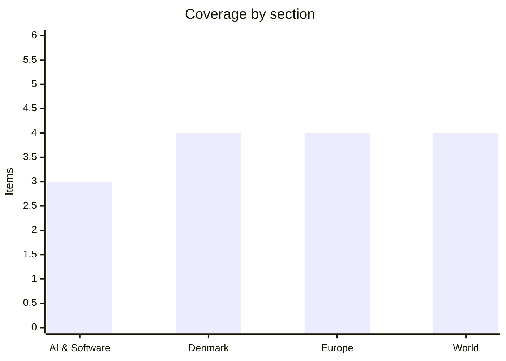

# Daily Briefing — 2026-07-26

**Top line:** For the first time in two weeks the US launched no strikes on Iran overnight, and mediators say both sides are negotiating a return to the interim ceasefire around a Hormuz transit compromise — but the war widened anyway, with the Houthis firing ballistic missiles at Saudi Aramco facilities and Russia answering Zelensky's warning with a weekend-long bombardment of Kyiv.

## Follow-ups

- **Trump's "massive attack" on Iran: did not materialize** — instead the first strike-free night in two weeks, with mediated de-escalation talks advancing (World lead).
- **Zelensky's warned 48-hour strike: materialized in waves** — Friday's ballistic hit on a Kyiv arms exhibition (10 dead) and two consecutive nights of attacks on the capital (Europe lead).
- **Fedorov standoff, day 10: protests resumed** Friday evening; organisers now say the campaign runs indefinitely until he is returned to the Defence Ministry.
- **Madrid fires: escalated sharply** — the regional emergency chief says the main blaze is "beyond the capacity of firefighters"; roughly 60,000 evacuated around Madrid and Ávila (Europe item).
- **Kimi K3 open weights: still on track** for tomorrow, July 27.
- **EA Foreign Subsidies decision: one gate cleared** — EU merger-rules approval came Thursday; the separate FSR decision remains due by July 30.
- **Intel–Google TPU order: still unconfirmed** — Intel declined comment on the June report; nothing new through the weekend.

## AI & Software

**Nvidia and SK Group sign a $500bn pact: memory, a 2-gigawatt Korean AI factory, and a $1bn stake in Naver.** Late Friday in San Francisco, Nvidia and South Korea's SK Group announced a letter of intent for a comprehensive partnership the companies value at up to $500 billion over several years — one of the largest supply arrangements in the industry's history. The core is memory: SK hynix, the HBM market leader, enters a long-term supply agreement with Nvidia and will co-develop next-generation high-bandwidth memory aligned to Nvidia's roadmap, with HBM4 modules feeding the upcoming Vera Rubin platform. Around it sits infrastructure: SK Telecom will build a 2-gigawatt AI data centre in South Korea on Nvidia's full-stack DSX "AI factory" architecture, with the first large-scale capacity expected online in 2027, and Nvidia will invest $1 billion in cloud and search company Naver, whose sovereign AI factory with Brookfield is separately being tripled to 200 megawatts. SK chairman Chey Tae-won said the group will combine SK hynix's memory and SK Telecom's infrastructure to build "a world-class AI factory"; Jensen Huang declared South Korea positioned to become "a global AI powerhouse". The context is this month's defining supply story: DRAM and HBM shortages have tripled some component prices, Microsoft attributes $25 billion of its record capex to memory and component costs, and Qualcomm's double-digit price increase letter landed only Friday — memory is now the binding constraint on the AI buildout, and Nvidia is locking its share of it the way it once locked advanced packaging at TSMC. TechTimes tallies the combined US-linked supply agreements of SK hynix and Samsung at roughly $950 billion through 2030. The caveat worth holding: an LOI is non-binding and the headline number is aspirational — watch what converts into firm purchase orders, and what this does to HBM availability for everyone who is not Nvidia. [CNBC](https://www.cnbc.com/2026/07/25/nvidia-locks-down-memory-from-sk-hynix-as-part-of-500-billion-ai-deal.html) · [SK Group press release](https://www.globenewswire.com/news-release/2026/07/25/3333161/0/en/SK-Group-and-NVIDIA-Expand-Strategic-Partnership-Across-AI-Factories-and-Next-Generation-Memory.html) · [Seoul Economic Daily](https://en.sedaily.com/finance/2026/07/25/sk-signs-500-billion-ai-infrastructure-loi-with-nvidia) · [TechTimes](https://www.techtimes.com/articles/321554/20260725/samsung-sk-hynix-lock-ai-chip-supply-through-2030-950b-us-deals.htm)

**Opus 5, day two: the first independent numbers arrive — and the evaluators disagree.** The independent benchmarking of Claude Opus 5 landed on Saturday, and it complicates Thursday's launch story in an interesting way. Artificial Analysis scores Opus 5 at 61 on its Intelligence Index — first of 187 models measured, a point ahead of Anthropic's own flagship Fable 5 (60) and two ahead of GPT-5.6 Sol (59) — which, if it holds, means the $5/$25 mid-tier model is now the top of the leaderboard, not just a bargain. Epoch AI's capability index disagrees: it rates Opus 5 at 159 against Fable 5's 161, with the two tied on software engineering — frontier-adjacent, not frontier-beating. Enterprise pilots at Cognition and Zapier report concrete gains on debugging and end-to-end business automation, and early developer commentary is largely positive on coding while noting rough edges in instruction-following temperament. The sharper criticism is methodological: several of the launch-day benchmark runs were Anthropic's own even where the benchmarks were built by outside organisations, and reviewers note the benchmarking ecosystem around frontier releases has become unstable enough that "which model is best" now genuinely depends on whose harness you trust. Why it matters: after GPT-5.6's tiered launch and Opus 5 at half Fable's price, the price-performance frontier has moved roughly twofold in under a month, and the independent numbers — not the launch decks — will determine where API traffic actually settles. Watch whether Fable 5 usage migrates down-tier, and whether Anthropic publishes reproducible harnesses for the contested results. [Yellow](https://yellow.com/news/experts-split-claude-opus-5-independent-tests) · [Latent Space](https://www.latent.space/p/ainews-claude-opus-5-fable-level) · [CodeRabbit](https://www.coderabbit.ai/blog/opus-5-model-review)

**One week to the EU AI Act's August 2 milestone — and it is not the one many teams think.** Next Sunday, August 2, the AI Act's next enforcement wave lands, and legal analyses published this month warn that many companies have misread June's "delay" as a blanket reprieve. What was actually delayed: the European Parliament's June 16 Digital Omnibus vote pushed the heavyweight high-risk obligations — quality-management systems, conformity assessments and the rest of Articles 9–17 — to December 2, 2027 for standalone Annex III systems (recruitment, credit scoring, education, law enforcement) and to August 2, 2028 for AI embedded in regulated products like medical devices and machinery. What still applies on August 2, 2026: the Article 50 transparency duties — telling users they are talking to a chatbot, machine-readable marking of AI-generated content, and labelling of deepfakes — plus the activation of the Commission's enforcement powers over general-purpose AI models, with fines for transparency violations running up to €15 million or 3% of global turnover. Cloud Security Alliance research notes a measurable enterprise readiness gap on exactly the surviving obligations, and law firms (Jones Walker's note is bluntly titled "Yes, August 2 Still Matters") report clients discovering the distinction late. For engineering organisations shipping AI features into the EU, the compliance work due this week is the disclosure-and-labelling layer, not the full QMS — a much smaller lift, but one with a hard date and real penalties attached. Watch for Commission guidance on GPAI enforcement in the first weeks of August, and whether marking standards for generated content get a grace period in practice. [Jones Walker](https://www.joneswalker.com/en/insights/blogs/ai-law-blog/yes-august-2-still-matters-the-eu-approved-a-high-risk-ai-delay-but-most-trans.html) · [Gibson Dunn](https://www.gibsondunn.com/eu-ai-act-omnibus-agreement-postponed-high-risk-deadlines-and-other-key-changes/) · [Digital Applied](https://www.digitalapplied.com/blog/eu-ai-act-august-2026-transparency-obligations-agency-checklist)

*Otherwise a genuinely quiet news Saturday in AI — the next scheduled events are Kimi K3's weights drop tomorrow and the Microsoft/Meta earnings Wednesday (see Watch list).*

## Denmark

**The rain finally came: Saturday's front ends the drought run that pushed the index to 10 and wheat to a three-year high.** A rain front rolled in over northwest Jutland at 14:00 Saturday and spread across the country through the evening, peaking over Jutland around 20:00 — the first proper nationwide soak after Denmark's third heat wave of the summer, with virtually the whole country forecast at least 3 millimetres over the weekend and northern areas above 7. It arrives late for a parched season: the drought index has been above 9 across much of the country this week and touched 10 — the top of the scale — on Bornholm and Læsø, per TV Midtvest, and the dryness is compounding a European harvest problem DR reported this month, with wheat prices at their highest in three years and corn up 15% year on year after the record-warm June. There is even a measurement dispute embedded in the story: DMI's classic drought index put southwest Bornholm at 9.9 while its newer satellite-based field index read a moderate 4.7, leaving farmers arguing about which number reflects their fields. For agriculture the calculus is now whether the rain came in time to salvage yields ahead of a harvest that begins within weeks, or merely settles the dust; for households it mostly ends the beach summer. Watch whether the wet pattern persists into next week — one front does not end a drought — and the first Danish yield estimates in August. [TV2 Vejret](https://vejr.tv2.dk/live/2024-12-02-vejr-og-klima) · [TV Midtvest](https://www.tvmidtvest.dk/midt-og-vestjylland/torken-bider-i-danmark-men-regn-er-pa-vej-7528c) · [DR](https://www.dr.dk/nyheder/udland/rekordvarm-juni-kan-haemme-hoesten-i-europa-og-foere-til-hoejere-kornpriser)

**Power prices went negative as the weather turned: minus 0.14 kroner per kilowatt-hour in West Denmark.** Between 14:00 and 14:30 on Saturday the raw spot price of electricity in western Denmark fell to minus 0.14 kroner per kilowatt-hour — the lowest in 42 days, since June 13 — meaning producers were briefly paying to offload power. The driver was the same weather system that ended the heat: the front brought wind back to a grid that had spent weeks in still, hot high-pressure conditions, and it stacked on top of midday solar and low weekend demand. For consumers on hourly-priced contracts the practical effect was near-free afternoon electricity, and for flexible loads — EV charging, heat pumps — Saturday was the day to run them. Negative summer prices have become a recurring feature of the Danish grid as wind and solar's share grows, but a 42-day gap between negative-price events is itself a signal of how unusually windless this hot July was. Watch Sunday's prices as the front clears, and whether August brings the usual pattern back. [TV2 Vejret](https://vejr.tv2.dk/live/2024-12-02-vejr-og-klima/laveste-elpriser-i-42-dage?entry=ce32bf21-7864-46d9-bc25-cf86619b991f)

**600 Vietnamese electric taxis, shipped in quietly: Green SM launches in Copenhagen on Thursday.** The Vietnamese taxi giant Green SM — sister company of carmaker VinFast under the Vingroup conglomerate — officially enters Denmark on July 30, TV2 reported this week, after shipping roughly 600 VinFast electric cars into the country with deliberately little publicity; 590 VF 6 and VF 8 models were registered in June alone. The company plans to employ up to 3,000 drivers, starting in Copenhagen with other Danish cities to follow, and FDM notes the VinFast brand arrives in Denmark exclusively as taxis — the VF 6 a compact crossover with 379 km of range, the VF 8 a Model Y-sized SUV with 457 km. Green SM runs tens of thousands of EV taxis across Vietnam, Indonesia, Laos and the Philippines, and Denmark is one of its first footholds in Western Europe — a striking choice of beachhead, presumably for the EV-friendly infrastructure and high taxi price point. For the Copenhagen market the arrival is a genuine shock: incumbents like Dantaxi and Viggo suddenly face a vertically integrated operator that manufactures its own vehicles and has scaled aggressively on price elsewhere. The open questions are driver recruitment at that scale in a tight labour market, and whether Danish passengers take to an unknown brand. Watch the launch Thursday and the incumbents' pricing response. [TV2](https://nyheder.tv2.dk/business/2026-07-23-taxaer-fragtet-til-danmark-i-hemmelighed-nu-rykker-selskab-ind) · [FDM](https://fdm.dk/nyheder/nyt-om-trafik-og-biler/hov-en-masse-biler-fra-vietnam-i-danmark) · [TV2 Kosmopol](https://www.tv2kosmopol.dk/koebenhavn/vietnamesisk-taxagigant-er-kommet-til-kobenhavn-6cd5a)

**Cyclist struck by bus on Dronning Louises Bro.** A cyclist was hit by a bus on Dronning Louises Bro in central Copenhagen on Saturday, with police deploying in force — including an incident commander and a vehicle inspector, the specialist normally called to serious or fatal crashes. No condition update had been published by Saturday evening. The location gives the accident weight beyond the routine: the bridge between Nørrebro and the lakes is one of the world's busiest cycling spans, carrying tens of thousands of cyclists daily through a corridor shared with high-frequency bus lines. It lands in a week when Copenhagen cycling was already in the news for the 73% surge in thefts from bicycles, and it will feed the running argument about bus-bike conflicts on the capital's densest corridors. [Local Eyes](https://localeyes.dk/alvorligt-faerdselsuheld-paa-dronning-louises-bro-cyklist-ramt-af-bus)

## Europe

**Russia's warned "massive attack" arrives in waves: an arms fair hit in daylight, then two nights of missiles and drones on Kyiv.** The large-scale attack Zelensky warned of on Thursday materialized across the weekend in stages. On Friday morning air-raid sirens sounded at 11:20 and a Russian ballistic missile struck an arms exhibition underway in Kyiv, killing at least 10 people and injuring more than 100 — a daytime strike on a defence-industry event in the capital's centre. That night Russia sent 157 attack drones and two missiles; air defences downed or suppressed 127 drones, but 26 got through at nine locations, damaging gas stations in Poltava region and setting a shopping mall in Zaporizhzhia on fire with casualties reported. Saturday brought what officials called "continuous drone terror" across front-line regions — at least 11 killed and some 70 injured nationwide, with glide bombs hammering Sloviansk — and just after midnight Sunday ballistic missiles targeted Kyiv again, with debris igniting an 18-storey residential building in the Shevchenkivskyi district, though no casualties had been reported there by morning. Zelensky, citing intelligence, added two warnings: Putin is "preparing the conditions for expanding mobilization" because Russian losses now exceed recruitment, and Russia wants to bring in another 30,000 North Korean troops. Ukraine struck back through the weekend — a fire at the Engels heavy-bomber base, a fifth hit in a week on logistics hubs of e-commerce giant Wildberries, and a Tyumen oil refinery — while Kazakhstan's President Tokayev broke ranks to urge freezing the war and returning to Istanbul-based negotiations. At home, protests demanding Fedorov's reinstatement resumed Friday evening with organisers pledging to continue indefinitely, meaning Zelensky faces the bombardment with his defence ministry still headless. Watch whether an even larger salvo follows — Ukrainian intelligence's original warning described something bigger than what has landed so far. [Kyiv Independent](https://kyivindependent.com/kyiv-attack-july-26-2026/) · [Kyiv Independent — arms exhibition](https://kyivindependent.com/explosions-in-kyiv-as-russia-launches-daytime-missile-attack/) · [RBC-Ukraine](https://newsukraine.rbc.ua/news/ukraine-s-air-defenses-battle-massive-overnight-1784961147.html) · [Euronews](https://www.euronews.com/my-europe/2026/07/25/zelenskyy-warns-of-massive-russian-attack-within-48-hours)

**More than 250,000 flee the fires: Madrid's blaze "beyond capacity", Gironde empties, and the EU's firefighting pool runs at full stretch.** The twin wildfire emergencies in Spain and France crossed a grim threshold on Saturday, with more than 250,000 people now evacuated across the two countries — Al Jazeera puts the combined figure at 267,000. In Spain, Madrid emergency chief Carlos Novillo said the fire bearing down on the capital region is "at its peak and is currently beyond the capacity of firefighters to contain", with erratic winds threatening to fan it further; the interior ministry reports nearly 10,000 hectares burned in the Madrid region and 13,000–15,000 in neighbouring Ávila, with roughly 29,000 evacuated and 20,000 confined around Madrid and another 30,000 evacuated in Ávila. Spain has deployed 2,737 personnel, 426 vehicles and 21 aircraft, reinforced by crews from Greece, Italy and Portugal. In France, the Gironde fire that forced Friday's complete evacuation of the Cap Ferret peninsula — including by boat from three piers — has burned roughly 14,000 hectares, at times growing 1,000 hectares an hour overnight, destroyed around 80 homes and driven some 110,000 people from the Bordeaux coastal belt at the height of the holiday season. The EU Civil Protection Mechanism is running aircraft from at least five member states across both fronts simultaneously — precisely the scenario behind southern members' push for a permanent EU aerial fleet rather than pooled national assets. The weekend's shifting winds decide whether Madrid's commuter belt faces evacuations and whether the Gironde fire jumps containment lines; both governments have signalled the emergencies will run into next week. [NPR](https://www.npr.org/2026/07/25/nx-s1-5907963/wildfires-spain-france-evacuations) · [Al Jazeera](https://www.aljazeera.com/news/2026/7/25/wildfires-in-spain-and-france-force-evacuation-of-200000-people) · [CNN live](https://www.cnn.com/2026/07/25/world/live-news/france-spain-wildfires-evacuations) · [CBS](https://www.cbsnews.com/news/wildfires-france-spain-madrid-bordeaux-evacuations-europe/)

**Merz reshuffles the chancellery with the AfD eyeing its first state government in September.** Chancellor Friedrich Merz announced a partial reshuffle of his government on Friday, moving Health Minister Nina Warken to head the chancellery — the first woman ever in the job — and installing CDU general secretary Carsten Linnemann as health minister, with further changes promised in "a few days yet, and perhaps more time". The context is a government in trouble: fifteen months after taking office on promises to restart Europe's largest economy, the Union–SPD coalition remains deeply unpopular, the turnaround has not arrived, and three difficult eastern regional elections loom in September — above all Saxony-Anhalt on September 6, where the AfD believes it can win outright and take control of a state government for the first time in the Federal Republic's history. That prospect is what makes a routine mid-term reshuffle consequential: an AfD state premiership would force every other party into an unprecedented choice between cooperation and blockade, and Merz is visibly trying to change the government's story before voters lock in. The Friday announcement's piecemeal character — naming two moves while leaving the rest open — drew immediate criticism that it projected improvisation rather than reset, undermining the intended effect. Watch the remaining appointments this week and the Saxony-Anhalt polling as the campaign enters its final six weeks. [AP](https://www.ksat.com/news/2026/07/24/german-chancellor-friedrich-merz-reshuffles-top-posts-amid-far-right-advance/) · [Washington Post](https://www.washingtonpost.com/world/2026/07/24/germany-merz-reshuffle/5ab3db1c-872f-11f1-9cec-0fb26676f07e_story.html)

**Brussels draws its line on the 301 probe: "anything that departs from the Turnberry Deal will not be acceptable".** The EU's first substantive response to Trump's Friday announcement of a Section 301 investigation into EU tech enforcement came Saturday from Bernd Lange, chair of the European Parliament's trade committee, who told Reuters that Washington has given no clear commitment to uphold the trade framework struck at Trump's Turnberry golf course — and that "anything that departs in substance from the Turnberry Deal will not be acceptable." The Commission's official line runs parallel: the US must "continue to fully honour its commitments", including in any future 301 investigations. The worry in Brussels is pattern rather than one case: USTR has signalled it expects new Section 301 probes to cover most major trading partners, and the EU already has a live precedent in the June 18 investigation of Germany's pharmaceutical pricing — formally titled "Germany's Persistent Underpayment for Innovative Pharmaceutical Products", with comments due August 10 and a hearing September 22 — which Lange at the time called "interference in national sovereignty". Notably, Brussels is simultaneously de-escalating where it can: the Commission on Friday assessed the new US forced-labour-linked tariff structure as compatible with the trade agreement, accepting the 10% rate rather than contesting it. The emerging EU posture is thus selective: swallow the tariff floor, defend the regulatory sovereignty — exactly the split the 301 probe is designed to pressure. Watch for USTR's formal notice in the Federal Register, which starts the clock on hearings, and whether the Commission links the dispute to Google's running 60-day DMA compliance deadline. [Reuters via Investing.com](https://www.investing.com/news/economy-news/us-must-honour-euus-deal-in-tariff-investigations-senior-eu-lawmaker-says-4556349) · [EUNews](https://www.eunews.it/en/2026/07/24/new-us-tariffs-the-eu-says-theyre-in-line-with-the-trade-agreement/) · [Reuters via AOL — USTR](https://www.aol.com/articles/ustr-expects-section-301-probes-010933848.html) · [USTR — Germany 301](https://ustr.gov/about/policy-offices/press-office/press-releases/2026/june/ustr-announces-initiation-section-301-investigation-germanys-persistent-underpayment-innovative)

## World

**The guns pause: no US strikes for the first time in 14 nights, talks centre on a Hormuz compromise — and Netanyahu arrives at the White House Tuesday.** After 13 consecutive nights of bombardment, US Central Command announced no new strikes on Iran into Saturday, and Iran's Health Ministry spokesman Hossein Kermanpour confirmed "Iran had a peaceful night" — the first since the war reignited; Bahrain, Jordan and Kuwait, which have absorbed most of Iran's counterstrikes, also reported quiet. Behind the silence is active mediation: a regional official told AP the mutual pause is "a positive signal that helps their efforts to de-escalate", that both Washington and Tehran want to return to the interim ceasefire that collapsed this month, and that the compromise under negotiation centres on Iran running vessel transit through the Strait of Hormuz with fewer restrictions on shipping. The pressures pushing Trump toward the off-ramp are legible: Brent held above $100 for much of the week (it slipped below $98 Friday but still gained more than 12% on the week), the war polls badly ahead of November's midterms, and Thursday's 47–49 Senate vote showed his margin for escalation is two senators wide. Trump is keeping both doors open, still threatening more strikes even as he confirms talks are pressing forward. The next hinge is Israeli: Netanyahu convenes his security cabinet Sunday, departs Monday, and meets Trump at the White House Tuesday — their first in-person meeting since the war began in late February — while also attending the Washington funeral of Senator Lindsey Graham, who died July 11 at 71. The Pentagon meanwhile identified Staff Sgt. Angel S. Rampersad among the service members killed in Iran's strike on Jordan. The fragility is obvious: the Houthi–Saudi exchange (next item) is exactly the kind of spark that has broken every previous pause, and Netanyahu arrives with his own definition of acceptable terms. Watch whether the pause survives the weekend and what emerges from Tuesday's meeting. [CNN live](https://www.cnn.com/2026/07/25/world/live-news/iran-war-trump) · [AP](https://www.ksat.com/news/world/2026/07/26/airstrikes-have-paused-and-talks-are-pressing-forward-but-can-the-us-and-iran-take-the-off-ramp/) · [Washington Post](https://www.washingtonpost.com/world/2026/07/25/iran-us-hormuz-strait-war-25-july-2026/db469ab4-880e-11f1-9cec-0fb26676f07e_story.html) · [Axios](https://www.axios.com/2026/07/24/trump-netanyahu-white-house-iran) · [Newsweek — Graham](https://www.newsweek.com/senator-lindsey-graham-funeral-details-announced-12194785)

**The Saudi front opens: Houthi ballistic missiles at Aramco's Jizan and Yanbu sites after coalition jets bomb Hodeidah.** The Iran war's most dangerous weekend development came on the Red Sea's other shore. On Friday the Saudi-led coalition bombed Houthi military positions in the port of Hodeidah — Riyadh's first direct strikes of this war, retaliation for the week's Houthi attacks on two Saudi-bound tankers — and on Saturday the Houthis answered in kind, announcing two operations against "sensitive Aramco-affiliated facilities": dozens of ballistic missiles and drones at Jizan, and ballistic and cruise missiles plus drones at Yanbu. Saudi air defences intercepted at least two missiles over Yanbu, civil defence issued warnings before declaring the danger passed, and no damage had been officially reported by Saturday evening. The target choice is strategic rather than symbolic: Yanbu is the terminus of the East–West pipeline and the kingdom's main alternative export route while Hormuz is contested — attacking it squeezes the workaround, exactly as the Houthis' Chinese-flag exemption keeps Beijing supplied while Western-linked shipping pays. For Saudi Arabia this is the scenario it spent the 2022 truce and years of Chinese-brokered détente trying to avoid: pulled into a shooting war with the Houthis just as its US ally negotiates an off-ramp with the Houthis' patron. The escalation risk runs in both directions — Trump threatened Iran and the Houthis with "major military punishment" over Red Sea attacks only days ago, and a successful strike on Aramco infrastructure would test the fresh US–Iran pause instantly. Watch for damage assessments from Jizan and Yanbu, whether Aramco's export loadings shift, and whether the Houthis explicitly link their campaign to the Hormuz negotiation. [Al-Monitor](https://www.al-monitor.com/originals/2026/07/houthis-fire-saudi-red-sea-oil-sites) · [Washington Post](https://www.washingtonpost.com/world/2026/07/25/houthis-claim-attack-saudi-oil-refinery-iran-war-widens-red-sea/) · [CNBC](https://www.cnbc.com/2026/07/25/saudi-military-strikes-iran-backed-houthi-targets-yemen.html) · [The Hill](https://thehill.com/policy/international/5990145-houthi-rebels-yemen-saudi-arabia-strikes-iran-war/)

**India's education minister resigns and the "Cockroach" movement stands down — Modi's second concession to street protest in two days.** Dharmendra Pradhan resigned from Narendra Modi's Council of Ministers on Saturday, capping seven weeks of nationwide student protests over leaked papers in the NEET-UG medical entrance exam, and protesters called off their demonstrations to celebrate in the streets. The arc ran fast by Indian standards: irregularities surfaced in the May 3 exam sat by millions of aspiring medical students; the government handed the case to the Central Bureau of Investigation, cancelled the exam and scheduled a re-test; and on June 6 a satirical online movement called the Cockroach Janta Party, founded by Abhijeet Dipke, staged the first demonstration at Delhi's Jantar Mantar demanding Pradhan's head. What began as satire grew into a Gen-Z-led national campaign for accountability and structural reform of the National Testing Agency, which NBC describes as perhaps the biggest challenge Modi has faced in his twelve years in office. Beyond the resignation, the government bowed to demands to fix the cheating-prone exam system itself — the protesters' more consequential ask. Coming a day after the government's assurances ended Sonam Wangchuk's 26-day hunger strike over Ladakh, it makes two street-movement victories against Delhi in 48 hours: a pattern of tactical concession that either defuses a dangerous political season for Modi or teaches every aggrieved constituency that sustained protest works. Watch who gets the education portfolio, whether the NTA reform is structural or cosmetic, and whether the movement's demobilisation holds through the re-examination. [CNBC](https://www.cnbc.com/2026/07/25/indias-education-minister-resigns-in-win-for-indian-youth-protesters.html) · [NBC](https://www.nbcnews.com/world/india/india-education-minister-resigns-escalating-cockroach-protests-challen-rcna589188) · [HNGN](https://www.hngn.com/articles/272339/20260725/dharmendra-pradhan-resigns-indias-education-minister-amid-ongoing-nationwide-neet-protests.htm)

**Gaza's nominal truce: Israel kills the Strip's police chief as the post-ceasefire death toll passes 1,180.** An Israeli airstrike on Saturday killed Brigadier-General Abdel-Nasser Al-Maqadma, head of the Hamas-run police force in northern Gaza, in the Sheikh Radwan area north of Gaza City, according to medics; a separate strike killed a Palestinian medic in the Nuseirat refugee camp. The strikes illustrate what NBC documents in detail: despite the ceasefire formally in place, Israel has stepped up deadly strikes and is expanding a physical barrier entrenching its control over more than half of the Gaza Strip, with Gaza officials counting more than 1,180 Palestinians killed since the ceasefire began. In the occupied West Bank the crackdown widened in parallel — Israeli forces arrested roughly 50 Palestinians in the village of Tal near Nablus on Saturday morning, part of mass arrests following a shooting that killed four Palestinians and two Israeli soldiers, amid escalating settler attacks. The politics connect directly to Washington: Netanyahu convenes his security cabinet at 13:00 Sunday ahead of his departure for the Trump meeting, where Iran will dominate but Gaza's unravelling truce is unavoidably on the table — the ceasefire is nominally a Trump-brokered achievement, and its hollowing-out is happening on his watch. Two readings of the police-chief strike: targeted enforcement against Hamas's residual governing apparatus, or the systematic dismantling of any Palestinian administrative structure ahead of whatever comes next in Israel's plans for the Strip. Watch whether Gaza features in Tuesday's White House statements, and whether the barrier expansion becomes formal annexation of a buffer zone. [Haaretz](https://www.haaretz.com/gaza/2026-07-25/ty-article/israel-kills-senior-hamas-led-police-official-in-gaza-medics-say/0000019f-9a04-df92-a7ff-be869d010000) · [NBC](https://www.nbcnews.com/world/gaza/israel-steps-deadly-strikes-expands-physical-barrier-gaza-truce-rcna587623) · [Al Jazeera](https://www.aljazeera.com/news/2026/7/25/israel-arrests-dozens-of-palestinians-in-west-bank-amid-settler-attacks) · [Times of Israel](https://www.timesofisrael.com/liveblog-july-25-2026/)

## Watch list

- **Kimi K3 open weights due Monday, July 27** — 2.8T parameters, 1.4TB download under Modified MIT; the test of who can actually self-host frontier models.
- **Netanyahu at the White House Tuesday, July 28** — first Trump meeting of the war, with the strike pause and Hormuz compromise on the table; Graham's Washington funeral the same day.
- **Fed decision Wednesday, July 29, with Microsoft, Meta and Qualcomm earnings the same day** — the AI-capex and memory-cost story moves to three more balance sheets against a $100-oil backdrop.
- **Thursday–Sunday cluster: EA/PIF FSR decision due July 30** (Green SM's Copenhagen launch the same day), **White House frontier-AI framework due August 1, EU AI Act Article 50 transparency duties apply August 2.**
