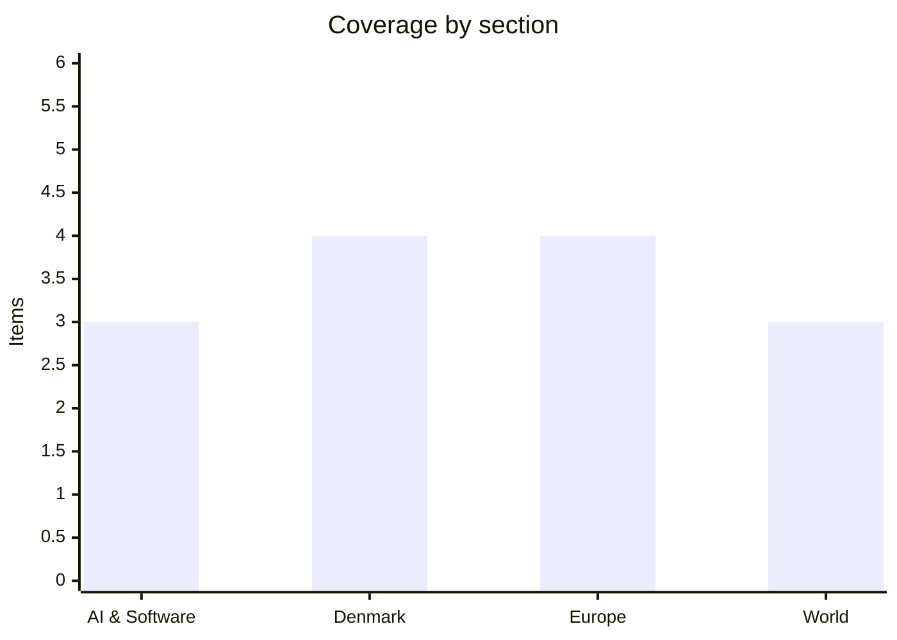

# Daily Briefing — 2026-07-27

**Top line:** At midnight UTC Moonshot AI published Kimi K3's full weights — 2.8 trillion parameters, 1.4 terabytes, the largest open-weight release in history — while Europe woke to the aftermath of an Islamist van-and-machete attack on Berlin Pride that killed one and injured 29, its perpetrator shot dead by police on Sunday, and the US–Iran strike pause held for a second night as Oman-mediated Hormuz talks reported progress.

## Follow-ups

- **Kimi K3 open weights: landed on schedule** at 00:00 UTC July 27 (AI lead).
- **Iran strike pause: held a second day** — both sides quiet, Oman-mediated Hormuz talks "making progress" (World lead).
- **Netanyahu at the White House Tuesday: confirmed** — he told Sunday's cabinet Iran tops the agenda; Zelensky is also expected in Washington this week for Graham's funeral *(reported)*.
- **Madrid fires: turned the corner** — Spain's Military Emergency Unit says the front is effectively contained, though the Ávila blaze is now called the largest in recent Spanish history (Europe item).
- **Fedorov standoff, day 12: unresolved** — Drapatyi runs the army, the Defence Ministry still has no minister, protests continue indefinitely.
- **Dronning Louises Bro cyclist: a foreign tourist, still severely injured** in hospital; the bridge has reopened and police are tracing his family abroad.
- **India's NEET crisis: reforms materializing** — the exam moves to computer-based format from next year and an NTA restructuring is underway ([The Week](https://www.theweek.in/news/india/2026/07/25/can-dharmendra-pradhans-exit-and-centres-new-education-reforms-restore-faith-in-indias-exam-system.html)).

## AI & Software

**Kimi K3's weights are live: the largest open-weight model ever published is now a 1.4-terabyte download.** At 00:00 UTC on Monday, Moonshot AI released the full weights of Kimi K3 under its Modified MIT license, eleven days after the model's API launch — the first open release of a 3-trillion-parameter-class model, at 2.8 trillion parameters with roughly 32 billion active per token, native vision, always-on reasoning and a 1-million-token context window. The native MXFP4 release weighs roughly 1.4TB, which reframes what "free" means: Moonshot recommends serving K3 on supernode configurations of 64+ accelerators, no llama.cpp support exists yet because K3's new KDA attention design needs fresh implementation work, and vLLM has spent the past week preparing day-0 production support with Moonshot, NVIDIA and AMD. The practical beneficiaries are therefore hosting providers and large teams first — community re-quantizations that shrink it toward prosumer hardware are expected to follow, as they did for every major open release this year. The capability case is real: K3 sits third on Artificial Analysis's Intelligence Index behind only Claude Fable 5 and GPT-5.6 Sol Max, and first on Frontend Code Arena, though the hosted API's measured median time-to-first-token of 161 seconds (industry median: 2.87) shows the always-on reasoning has a latency price. The self-hosting argument is as much about sovereignty as cost — running K3 on your own hardware sidesteps the data-residency and provenance questions that surround Chinese models accessed via API. Context makes this the densest open-weight stretch the industry has seen: DeepSeek V4 completed its transition to stable release on July 24 as the open-weight price floor, and K3 now caps the tier with a free frontier-scale flagship. The release is also a well-timed piece of Moonshot's Hong Kong IPO push at a valuation of up to $50 billion — free weights build the ecosystem story the fundraise is capitalizing on. Watch download and deployment reports this week, and how fast usable quantized versions appear. [VentureBeat](https://venturebeat.com/technology/chinas-moonshot-ai-releases-kimi-k3-the-largest-open-source-model-ever-rivaling-top-u-s-systems) · [Hugging Face community overview](https://huggingface.co/blog/ResterChed/kimi-k3-model-overview-mxfp4-quantization-open-wei) · [vLLM blog](https://vllm.ai/blog/2026-07-22-kimi-k3-preview) · [TECHi](https://www.techi.com/kimi-k3-open-weights-inference-economics/) · [Interconnects](https://www.interconnects.ai/p/kimi-k3-the-open-weights-escalation)

**MCP goes stateless tomorrow: the biggest rewrite of the protocol since launch, with release-candidate SDKs already out.** The Model Context Protocol's 2026-07-28 specification revision is finalized tomorrow, and the release candidate plus beta SDKs for Python, TypeScript, Go and C# are already published — worth attention from anyone running MCP servers, because this is the largest revision since the protocol launched. The core change removes the initialize handshake and protocol-level sessions entirely: every request becomes self-contained, carrying protocol version, client info and capabilities, which means a remote MCP server that previously needed sticky sessions and a shared session store can now run behind a plain round-robin load balancer, route on an `Mcp-Method` header, and let clients cache `tools/list` responses for as long as the server's `ttlMs` allows. The breaking changes are real: the Tasks feature is rebuilt around handles instead of session-bound objects, `tasks/list` is removed outright, three core features are deprecated under a new formal deprecation policy, and six Specification Enhancement Proposals formally position MCP servers as OAuth 2.1 resource servers — the authorization hardening enterprises have been asking for. Compatibility is handled sensibly: existing servers and clients do not break on July 28, and new clients fall back to the initialize handshake when they reach an older server. GitHub's MCP Server already supports the new spec ahead of the official release, and Microsoft has published guidance on what statelessness changes for scaling MCP on App Service. The Register's framing is apt — MCP is shedding its stateful past because the protocol won: it now underpins enough production agent infrastructure that gateway operability, not developer convenience, is the binding constraint. If you maintain MCP servers, the migration guide and SDK betas are the place to start this week. [MCP blog — release candidate](https://blog.modelcontextprotocol.io/posts/2026-07-28-release-candidate/) · [MCP blog — SDK betas](https://blog.modelcontextprotocol.io/posts/sdk-betas-2026-07-28/) · [The Register](https://www.theregister.com/devops/2026/07/23/model-context-protocol-prepares-to-break-with-its-stateful-past/5276722) · [WorkOS](https://workos.com/blog/mcp-2026-spec-agent-authentication) · [Microsoft](https://techcommunity.microsoft.com/blog/appsonazureblog/mcp-just-went-stateless-%E2%80%94-what-the-2026-spec-changes-about-scaling-on-app-servic/4530222)

**Claude Opus 5 reaches GitHub Copilot one day after launch.** GitHub added Claude Opus 5 to Copilot's model picker on Friday, one day after Anthropic's launch — available to Copilot Pro+, Max, Business and Enterprise users, billed at provider API list price under usage-based billing, with Business and Enterprise admins needing to enable the policy first. GitHub's early-testing notes emphasize agentic workflows: autonomous code changes, regression verification and multi-tool coordination, with the model "especially effective at making targeted changes and validating its work". One operational caveat worth knowing: the model ships with enhanced safeguards for high-harm cyber content that can block some security-adjacent requests — GitHub's suggested workaround is rephrasing with benign context or switching models. The one-day lag from launch to Copilot availability is itself the story: frontier models now diffuse into the largest developer platforms essentially instantly, which sharpens the question of where the independent benchmark numbers (still contested, per the weekend's split evaluations) actually settle. [GitHub Changelog](https://github.blog/changelog/2026-07-24-claude-opus-5-is-now-available-in-github-copilot/)

*Otherwise a quiet AI Sunday — the week's scheduled events (earnings, the White House framework, the AI Act date) are on the watch list.*

## Denmark

**Mads Pedersen writes green history in Paris: the first Dane ever to win the Tour de France points jersey.** The Tour ended Sunday in Paris with a Danish milestone inside a Slovenian coronation: Mads Pedersen won the green points jersey — the first Danish rider to do so in the race's history — finishing with 527 points, 77 clear of Jasper Philipsen, after mathematically sealing it on Saturday's stage 20 by dragging himself over the Col de la Croix de Fer to contest an intermediate sprint worth 25 points. Pedersen becomes only the sixth rider ever to win the points classification in all three Grand Tours, joining Eddy Merckx, Laurent Jalabert, Djamolidine Abdoujaparov, Alessandro Petacchi and Mark Cavendish; the only previous Dane to even wear green was Søren Lilholt, for five days across 1988–89. The final stage delivered a last twist — TV2's live coverage headlined that Pedersen was pipped on the line in the closing sprint — as Tadej Pogačar sealed his fifth overall Tour victory, equalling the all-time record shared by Anquetil, Merckx, Hinault and Indurain, with five stage wins this year and 26 career Tour stages. For Danish cycling the counterweight was grim: Jonas Vingegaard abandoned the race — the first Tour withdrawal of his career after years as Pogačar's only rival — leaving Mattias Skjelmose, sixth overall, as the best-placed Dane. Even the finale carried 2026's fingerprints: the final stage was reportedly shortened because French police and security assigned to the race were redeployed to the Gironde wildfires. A transitional moment, then — Vingegaard's era of duels pausing just as Pedersen delivers a first for Denmark that seemed permanently out of reach in the sprinters' game. [DR](https://www.dr.dk/sporten/cykling/tourdefrance/mads-pedersen-99-9-procent-sikker-paa-skrive-groen-historie) · [TV2 Sport](https://sport.tv2.dk/live/cykling/2026-07-26-mads-p-snydt-paa-stregen-pogacar-vinder-touren-for-femte-gang) · [Feltet.dk](https://www.feltet.dk/landevej/mads-p.-sikrer-den-groenne-troeje/11241980) · [CyclingWorld](https://www.cyclingworld.dk/tour-de-france-2026-er-slut-her-er-fakta/)

**From drought index 10 to cloudburst warnings in 48 hours: DMI's skybrud varsel ran until 6 this morning.** The weather whiplash continued: two days after the season's first proper rain ended Denmark's drought run, DMI issued cloudburst and thunderstorm warnings covering most of the country, with the formal varsel for eastern Funen, Lolland and most of Zealand running from Sunday noon until 06:00 Monday morning. The forecast called for 5–15 millimetres generally but 30–50 locally, with cloudbursts — at least 15 millimetres in 30 minutes — possible along with hail, thunder and strong gusts; Copenhagen was expected to be hit late Sunday evening as the cells drifted east. Utility HOFOR urged capital-region residents to watch for flooded roads and dislodged manhole covers, the standard skybrud damage pattern since the 2011 Copenhagen cloudburst set the benchmark. The agricultural readings of the swing are genuinely two-sided: the weekend's soak was what parched fields needed ahead of an August harvest, but intense convective rain runs off hard-baked soil rather than sinking in, and hail on ripening grain is its own hazard — whether the drought's end helps yields depends on exactly how the water arrives. The episode also reprises the summer's measurement dispute, with DMI's classic drought index and its newer satellite-based field index still telling different stories about how dry the ground actually is. Monday-morning tallies of where cloudbursts actually struck were still coming in as this was written. [DR](https://www.dr.dk/nyheder/vejret/dmi-varsler-skybrud-og-torden-i-det-meste-af-landet-soendag) · [TV2 Kosmopol](https://www.tv2kosmopol.dk/metropolen/varsler-risiko-for-skybrud-3a61d) · [Sjællandske Nyheder](https://www.sn.dk/art6608217/sjaelland/nyhed/dmi-udsender-varsel-om-voldsomt-vejr-paa-hele-sjaelland/)

**A 43-year-old woman died after a row-house fire in Holstebro.** The fire on Holbergsvej was reported to police at 11:57 Sunday; the fire service contained it during the afternoon, and the woman was airlifted to Rigshospitalet, where she died Sunday evening, Mid- and West Jutland Police's duty chief told Ritzau early Monday. The cause was not established Monday morning. It capped a weekend of serious fire incidents: two children were airlifted to Rigshospitalet with burns after a summer-house fire near Fjellerup Strand in East Jutland the same day. Danish summer-house and row-house fires cluster in exactly these weeks — holiday occupancy, grills and dry gardens — and this year's tinder-dry July has kept the fire services' callout numbers elevated. [TV2 Kort Nyt](https://nyheder.tv2.dk/live/kort-nyt) · [Avisen Danmark](https://avisendanmark.dk/krimi/to-boern-er-floejet-til-rigshospitalet-efter-sommerhusbrand)

**Seven kilos of ketamine and a kilo of cocaine: Holbæk bust lands two in custody.** Mid- and West Zealand Police arrested a 26-year-old woman and a 40-year-old man in Holbæk at 12:18 Sunday and seized seven kilograms of ketamine and one kilogram of cocaine, charging both with possession with intent to distribute. Seven kilos is a substantial ketamine seizure by Danish standards — the drug has moved from niche party use toward a volume market in recent years, and seizures of this size outside Copenhagen suggest distribution networks reaching well into the provinces. The two were expected in grundlovsforhør (preliminary court hearing) with a custody request. [Sjællandske Nyheder](https://www.sn.dk/art6597990/sjaelland/doegnrapporten/politiet-afsloerer-kaempe-narkofund-og-kvinde-blev-skubbet-ud-af-koerende-bil/)

## Europe

**Berlin's Pride attack: one dead, 29 injured — and the suspect, shot dead Sunday, was free pending appeal of a terror conviction.** A white van drove into a crowd in Tiergarten park around 22:00 Saturday, a few hundred metres from the Christopher Street Day closing party at the Brandenburg Gate, hitting several people before striking a tree, after which the driver apparently attacked others with a machete; a woman was killed and 29 people injured in what authorities are treating as an Islamist terror attack. The suspect, 21-year-old German citizen Abdul Ballout, fled and was tracked for nearly 24 hours before police found him around 18:00 Sunday in an allotment garden in Spandau, where officers shot him dead when he reportedly ran at them with a blade. The detail that will dominate German politics: Berlin prosecutors say Ballout travelled to Lebanon in 2025 intending to join Islamic State in Syria, was jailed there by a military court, was arrested at Berlin airport on return, and was convicted by a Berlin juvenile court in May of preparing a serious act of violence and spreading IS propaganda — receiving a suspended youth sentence of one year and ten months, which prosecutors appealed. He was free pending that appeal when he attacked. Chancellor Merz urged Germans not to be intimidated — "these acts aim to divide our society" — while Interior Minister Dobrindt said security at major events, including other Pride celebrations, would be reviewed and if necessary significantly boosted. The timing gives that review immediate stakes: Amsterdam hosts World Pride alongside its own Pride this week, with Mayor Femke Halsema saying authorities are monitoring security closely while trying to keep the celebration open. Berlin has been here before — the 2016 Breitscheidplatz Christmas-market truck attack killed 13 — and the argument over how a convicted IS sympathizer was at liberty will run straight into the AfD's September election surge and Merz's already-wobbling reshuffle. Hundreds of thousands had attended Saturday's parade of some 80 trucks; hundreds gathered at the Gate on Sunday to lay flowers. [AP via PBS](https://www.pbs.org/newshour/world/suspect-in-deadly-berlin-pride-attack-is-killed-in-confrontation-with-police) · [NBC](https://www.nbcnews.com/world/germany/manhunt-underway-suspect-islamist-ties-deadly-berlin-pride-attack-rcna589276) · [Washington Post](https://www.washingtonpost.com/world/2026/07/26/berlin-pride-attack-investigated-terrorism-with-suspect-large/)

**The fires turn: Madrid's front "effectively contained", but Ávila's blaze is called the largest in recent Spanish history and 300,000 have now fled in Spain and France.** Sunday brought the first genuinely good news of the twin fire emergencies — Prime Minister Sánchez said containment efforts were developing "very positively" though "there are still some difficult hours ahead", and Spain's Military Emergency Unit said the entire Madrid front was effectively contained with hotspots remaining. The scale is now historic: the Madrid-region and Ávila fires have burned a combined 111,000 acres (about 45,000 hectares), 23 towns have been evacuated, roughly 60,000 people evacuated and 88,000 more confined, and Ecological Transition Minister Sara Aagesen called the Ávila fire the largest in recent Spanish history. Across both countries, ABC put total evacuations above 300,000 — with at least one death reported — as France's Gironde fire continued to burn after forcing the evacuation of the Cap Ferret peninsula; Interior Minister figures show 115,000 hectares burned across France this year, a running total that already ranks among the country's worst fire seasons. The strain reached even the Tour de France, whose final-stage route was reportedly shortened because police assigned to the race were redeployed to the Gironde *(reported)*. The EU Civil Protection Mechanism remains at full stretch across both fronts — the exact scenario driving southern members' push for a permanent EU aerial firefighting fleet, which will get a fresh airing when institutions return from the summer break. The critical window is now: forecasts show hotter weather returning early this week, which will test whether Madrid's containment holds and whether Gironde's lines survive. Watch for the first damage assessments and the political accounting — in Spain over regional preparedness, in France over a holiday season that emptied the Bordeaux coast. [CNN live](https://edition.cnn.com/2026/07/26/world/live-news/france-spain-wildfires-evacuations) · [ABC News](https://abcnews.com/US/257000-evacuated-amid-wildfires-spain-france/story?id=135084380) · [France 24](https://www.france24.com/en/europe/20260725-france-evacuates-55-000-more-as-bordeaux-fires-worsen) · [NPR](https://www.npr.org/2026/07/25/nx-s1-5907963/wildfires-spain-france-evacuations)

**Navy Day without a navy parade: Putin cancels St. Petersburg's showcase again as Ukrainian drones cross western Russia, and Zelensky heads for Washington.** Russia cancelled its flagship Navy Day parade in St. Petersburg for the second consecutive year, with Kremlin spokesman Peskov citing "security reasons of utmost importance" — Putin instead addressed sailors at the Admiralty, an unmistakable measure of how far Ukraine's deep-strike reach now constrains even ceremonial life in Russia's second city, after June's strikes on the Baltic Fleet's Kronstadt headquarters. The threat was not hypothetical: Russia's defence ministry said about 100 Ukrainian drones were downed overnight into Sunday, at least 10 of them near St. Petersburg, with one woman wounded; the following night Ukrainian drones struck Belgorod and Rostov-on-Don, per monitoring channels and local authorities. On the Ukrainian side the weekend's bombardment eased in the capital but not the regions — regional authorities counted at least 7 civilians killed and 58 injured nationwide over the day to Sunday — and a civilian cargo ship that had been hit by Russian missiles on July 19 while carrying grain sank near Odesa, a data point in the grain corridor's slow strangulation. The political track now moves west: Zelensky is expected in Washington this week for Lindsey Graham's funeral and a meeting with Trump *(reported — Suspilne, citing diplomatic sources)*, putting Ukraine's president in the capital the same day as Netanyahu. At home his standoff with the street continues — day 12 of protests demanding Fedorov's return to the Defence Ministry, with new Commander-in-Chief Drapatyi installed but the ministry itself still leaderless. Zelensky's twin warnings from the weekend — Russian preparations to expand mobilization, and 30,000 more North Korean troops — frame what he will carry into the Trump meeting. Watch what the Washington visit produces, and whether Moscow answers the parade humiliation with the "massive attack" Ukrainian intelligence warned of. [Kyiv Independent](https://kyivindependent.com/russia-cancels-st-petersburg-navy-day-parade-for-second-straight-year-amid-ukrainian-drone-threat/) · [Yahoo/Reuters](https://www.yahoo.com/news/articles/moscow-says-nearly-100-drones-092756989.html) · [Kyiv Independent news feed](https://kyivindependent.com/news-archive/)

**Ukraine's Caspian strike draws first blood with Iran: Tehran says a sailor died, and blames Israel's hand.** The war's geography widened on its quietest flank: Zelensky confirmed Ukrainian forces struck a Russian warship and vessels used to transport Iranian-linked military cargo in the Caspian Sea on Saturday, and Iran's Foreign Ministry said the attack hit an Iranian commercial vessel, killing one sailor and injuring another. Tehran called it a "hostile and criminal act", summoned Ukraine's chargé d'affaires, and on Sunday escalated the framing — accusing Kyiv of acting "at Israel's behest" to broaden the Middle East conflict and pull Europe into Israel's war, language that stitches the Ukraine and Iran wars together in exactly the way most capitals have tried to avoid. The Caspian matters because it is the covered corridor of Russian–Iranian military logistics: Shahed drone components and other materiel move by ship between Iranian and Russian Caspian ports, beyond the reach of Western navies, and Ukraine has now demonstrated it can strike there. The first Iranian casualty attributed to Ukrainian fire creates an ugly new escalation pathway precisely as Washington and Tehran nurse their fragile strike pause — Iran has so far responded with protest rather than retaliation, which suggests it does not want this fight now, but "defending national interests" language leaves the door open. Two readings compete: a calibrated Ukrainian signal that the Shahed supply line has a price, or an operation whose Iranian casualty was incidental and unwelcome. Watch whether Ukraine strikes the corridor again and whether Iran's response stays rhetorical. [AP via Defense News](https://www.defensenews.com/global/mideast-africa/2026/07/26/iran-says-ukrainian-attack-on-vessel-in-caspian-sea-killed-sailor/) · [Al Jazeera](https://www.aljazeera.com/news/2026/7/25/iran-accuses-ukraine-of-deadly-attack-on-caspian-commercial-vessel) · [CNBC](https://www.cnbc.com/2026/07/26/ukraine-strikes-iranian-vessels-tehran-accuses-kyiv-of-hostile-act.html) · [Ynet](https://www.ynetnews.com/article/r1o143qrmg)

## World

**The pause holds, day two: Oman's Hormuz channel reports progress as Netanyahu departs for the decisive Washington meeting.** For the second straight day the US paused its strikes on Iran and Tehran held its fire too — the first sustained quiet since the war reignited — while the diplomacy behind it firmed up: Iran's Foreign Ministry spokesman Esmail Baghaei said Sunday that talks with Oman over managing safe passage through the Strait of Hormuz "continue and have made progress", and two regional sources told CBS the Oman–Iran discussions on reopening the strait and adjacent territorial waters are moving in a positive direction but need more time. US officials describe the strikes as "on a hold" rather than ended — Trump keeps the threat live — and the shape of the emerging compromise remains what mediators sketched Saturday: restored transit with fewer restrictions, in exchange for a return to the interim ceasefire that collapsed this month. The next hinge is Tuesday's White House meeting: Netanyahu convened his cabinet Sunday, said Iran would top the agenda with Trump, and departs Monday — their first in-person meeting of the war, doubling with Lindsey Graham's funeral, and now with Zelensky expected in town the same week. The risks to the pause are visible on both flanks: the Houthi–Saudi exchange (next item) and Iran's new grievance against Ukraine in the Caspian (see Europe) each offer a spark, and Netanyahu arrives with his own definition of acceptable terms after Israel spent the pause striking Gaza and the West Bank. Oil markets price the ambiguity — Brent slipped below $98 Friday but weekend reports put it back above $100 after the Aramco strikes *(reported)*. Watch whether the pause survives to Tuesday and whether the Hormuz compromise is announced there or collapses in the room. [AP via NPR](https://www.npr.org/2026/07/26/g-s1-135593/us-pauses-attacks-iran-second-day-tehran) · [CBS live](https://www.cbsnews.com/live-updates/iran-war-us-trump-strait-hormuz-middle-east/) · [Gulf News](https://gulfnews.com/world/mena/us-iran-conflict-apparent-airstrike-pause-as-oman-talks-advance-on-strait-of-hormuz-1.500620344) · [Fox News live](https://www.foxnews.com/live-news/us-iran-peace-strait-hormuz-talks-strikes-hold-july-26)

**Jizan burned, Yanbu held: the first damage picture from the Houthi strikes on Aramco — and Riyadh's silence.** The weekend's Houthi barrage against Saudi oil infrastructure left an asymmetric picture: at Jizan, NASA's satellite fire-detection system confirmed multiple substantial thermal anomalies at Aramco's refinery complex around 01:17 UTC Saturday, with regional media reporting at least five explosions and commercial flights diverting or holding; at Yanbu, two ballistic missiles aimed at oil installations were intercepted — reportedly by a Patriot battery operated in Saudi Arabia by the Greek military under an agreement with Riyadh *(reported)* — and Saudi officials said the terminal was undamaged and no longer at risk. Neither Aramco nor the Saudi government has issued an official damage assessment or casualty count, and Aramco has not responded to media queries — a silence consistent with Riyadh's long practice of minimizing attack publicity, but one that leaves the true state of Jizan's refinery to satellites and rumor. Houthi spokesman Yahya Saree cast the operation — "dozens of ballistic missiles and drones" at the two sites — as retaliation for the Saudi-led coalition's strikes on Hodeidah and Kamaran Island, Riyadh's first of this war. The target logic remains strategic: Yanbu anchors the East–West pipeline, the kingdom's main workaround while Hormuz is contested, so threatening it squeezes the alternative route exactly when the Hormuz negotiation is live. For Saudi Arabia the trap is complete — pulled into a shooting war with the Houthis just as its American ally negotiates an off-ramp with the Houthis' patron, with analysts warning Yemen itself risks sliding back into full war. Watch for independent damage assessments of Jizan, any shift in Aramco's export loadings, and whether either side extends the exchange into the pause. [TechTimes](https://www.techtimes.com/articles/321583/20260725/houthi-strike-burns-jizan-aramco-refinery-yanbu-attack-seals-saudi-arabias-oil-trap.htm) · [Al Jazeera](https://www.aljazeera.com/news/2026/7/26/new-front-in-us-iran-war-escalates-as-houthis-fire-at-saudi-oil-facilities) · [The National](https://www.thenationalnews.com/news/mena/2026/07/25/houthis-attack-saudi-aramco-sites-with-yemen-at-risk-of-renewed-war/)

**Netanyahu answers the Nablus bloodshed with new settlements — announced on his way to Washington.** After Friday's deadly confrontation southwest of Nablus — where a raid by roughly 20 settlers on a Palestinian community escalated into clashes that killed four Palestinians and two Israeli soldiers — Netanyahu and Defense Minister Israel Katz announced "a series of steps": raids in Palestinian villages suspected of hosting militants, "powerful action" against what they termed terrorism, and the acceleration of legalizing settler farm outposts plus the establishment of new ones. The package formalizes what the weekend's mass arrests (some 50 Palestinians detained in the village of Tal) had already signaled, and it lands atop a West Bank summer of escalating settler attacks that even Israeli security officials have described as out of control. All settlements in the occupied West Bank are illegal under international law; expanding them as an explicit response to violence in which settlers were the initiating party will draw European condemnation and complicates the Gaza ceasefire diplomacy Washington still nominally sponsors. The timing is the tell: announced hours before Netanyahu's departure for Tuesday's Trump meeting, it stakes out his domestic-coalition position — Smotrich publicly demanded harsher measures still — before any American pressure on Gaza or Iran terms can be applied. At Sunday's cabinet meeting Netanyahu vowed to "continue to strike terrorism on several fronts", batting away accusations of over-deference to Washington. Two readings again: pre-negotiation positioning that will be quietly shelved if Tuesday produces a deal, or confirmation that the West Bank's absorption proceeds regardless of what is signed about Gaza. Watch whether the outpost legalizations get cabinet dates, and whether the topic surfaces in Tuesday's White House statements. [CBS](https://www.cbsnews.com/news/israel-west-bank-settlers-palestinians-violence-netanyahu/) · [Al Jazeera](https://www.aljazeera.com/news/2026/7/24/four-palestinians-killed-as-israeli-settlers-raid-occupied-west-bank-town) · [Times of Israel](https://www.timesofisrael.com/at-cabinet-meeting-pm-vows-to-continue-to-strike-terrorism-wherever-necessary/)

## Watch list

- **MCP 2026-07-28 specification finalizes tomorrow** — the stateless rewrite ships; SDK betas and migration guides are already out.
- **Washington Tuesday, July 28:** Netanyahu–Trump meeting with the Hormuz compromise on the table, Graham's funeral, and Zelensky expected in town — three wars' diplomacy in one city on one day.
- **Fed decision Wednesday, July 29, plus Microsoft, Meta and Qualcomm earnings** — the AI-capex and memory-cost story against a $100-oil backdrop.
- **Thursday–Sunday cluster:** EA/PIF Foreign Subsidies decision due July 30, Green SM's Copenhagen taxi launch the same day, the White House frontier-AI framework due by August 1, and the EU AI Act's Article 50 transparency duties applying August 2.
