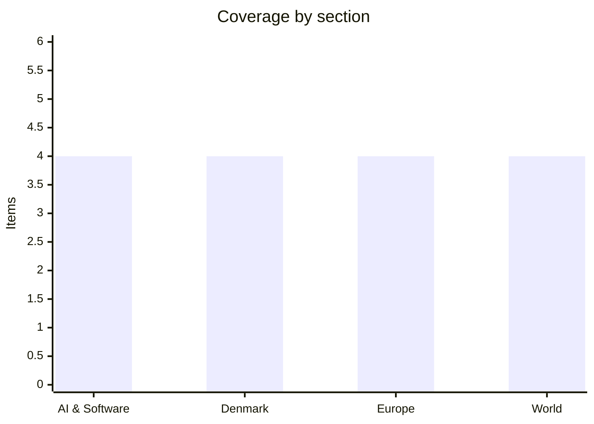

# Daily Briefing — 2026-07-31

**Top line:** Iran's promised answer to Wednesday's "heavy wave" arrived — new missile barrages intercepted over Jordan and a strike in Kuwait that killed a worker at a Chinese company's building — while the war kept widening at the edges (Egypt's Damietta port, coalition drones over Erbil) and Saudi Arabia's proposed naval coalition pulled oil back off its highs; the Strait of Hormuz stays closed, and the diplomacy is down to whether the Oman channel still functions.

## Follow-ups

- **Apple and Amazon reported** — the AI-capex week closed with Amazon as its clearest winner: AWS grew 37%, capex guided to $220 billion (AI & Software lead).
- **Iran's response to the heavy wave: it came Thursday** — barrages at Jordan, a deadly strike in Kuwait, Hormuz still closed (World lead).
- **EA/PIF: cleared** — the Commission's Foreign Subsidies review ended July 30 without an in-depth probe, per MLex; the $55 billion buyout's last European gate is open (Europe item).
- **White House frontier-AI framework: due tomorrow, August 1** — no release as of this briefing; the pacing petition it will land next to now carries lab-leadership signatures (AI item).
- **Spain/France fires: the stabilization held** — Ávila's evacuation formally ended and roughly 60,000 more people around Bordeaux (Eysines, Mérignac, Le Haillan) were allowed home; re-ignition risk eases with the cooling weather ([CNN](https://www.cnn.com/2026/07/29/world/live-news/france-spain-wildfires-heat-wave)).
- **Kumamoto: the toll nearly doubled to 34** (World item).
- **Fedorov standoff: still no Rada vote** — Khmara remains acting minister; the vacuum is now in week three (folded into the Europe lead).
- **Hugging Face/JFrog breach: no material movement today** — Delangue's $100 million demand and the CVE mapping questions stand.

## AI & Software

**Amazon closes the AI-capex week as its biggest winner: AWS grows 37%, capex raised to $220 billion, stock up 9%.** The earnings week that punished Meta and rewarded Microsoft got its final verdict Thursday night, and it was emphatic. Amazon's Q2 revenue crossed $200 billion in a single quarter for the first time — $200.6 billion against $196.5 billion expected — and AWS grew 37% year on year to $42.2 billion, its fastest rate in 18 quarters and well clear of the $40.5 billion consensus, for an annualized run rate of $169 billion. CEO Andy Jassy said Amazon's AI business and its in-house Trainium chips have each passed a $25 billion annualized run rate, and raised expected 2026 capital spending to roughly $220 billion from the original $200 billion — the largest capex number any company has ever guided to, and the market cheered it: the stock jumped 9–10% in extended trading. That is the tell for the week's larger question. After SK Hynix and Meta showed spending without demonstrated payback gets punished, Amazon showed the opposite case: when the revenue line is visible (AWS reaccelerating, AI at $25 billion), investors will fund essentially unlimited capex. Apple, reporting the same evening, was the quieter story: revenue of $109.4 billion and EPS of $2.02 came in only marginally ahead of expectations, and the reaction was muted, with coverage focused on tepid growth rather than any AI narrative. The split verdict across the week — Microsoft and Amazon up, Meta down, Apple flat — suggests the market has moved past the "AI bubble or not" binary into company-by-company underwriting of monetization. Watch whether Meta answers the contrast with more off-balance-sheet financing, and whether AWS's reacceleration holds as the Trainium ramp competes with Nvidia allocation. [CNBC](https://www.cnbc.com/2026/07/30/amazon-amzn-q2-earnings-report-2026.html) · [Yahoo Finance](https://finance.yahoo.com/markets/stocks/articles/amazon-q2-2026-earnings-aws-204411872.html) · [Motley Fool](https://www.fool.com/coverage/stock-market-today/2026/07/30/stock-market-today-july-30-amazon-soars-over-8-after-hours-on-earnings-beat/) · [GuruFocus/Apple](https://www.gurufocus.com/news/8993057/amazon-amzn-cloud-revenue-soars-apple-aapl-q3-profit-exceeds-expectations)

**OpenAI cuts Luna's price 80% — the frontier price war is now explicitly about Chinese competition.** OpenAI on Thursday slashed API prices for two of the three GPT-5.6 models it launched only three weeks ago: the small Luna model drops 80%, from $1/$6 to $0.20/$1.20 per million input/output tokens, and the mid-tier Terra falls roughly 20%, from $2.50/$15 to $2/$12, while the flagship Sol is unchanged. The company attributes the cuts to efficiency gains that let smaller models handle work that previously needed bigger ones, but the competitive context is hard to miss: Chinese open-weight models have captured about 46% of enterprise token usage on OpenRouter — at times peaking above US-origin models — and DeepSeek's V4 Pro undercuts even the new Luna price at $0.435/$0.87 under a standing 75% promotional discount. Cutting prices three weeks after launch, rather than at a model refresh, signals that the pricing power of frontier labs is eroding faster than their release cadence — businesses increasingly route workloads by cost per task, not by leaderboard position. It also lands in the same week Washington banned Chinese open-weight models from federal use, sketching the two-track response: regulation walls off the government market while price cuts fight for the commercial one. For teams building on the API, the practical effect is that high-volume agentic workloads just got dramatically cheaper to run on Luna-class models — worth rechecking routing configurations that were tuned to the July 9 prices. Watch whether Anthropic and Google follow within the usual response window, and whether OpenAI's cut shows up in OpenRouter's share numbers next month. [CNBC](https://www.cnbc.com/2026/07/30/open-ai-price-cut-gpt.html) · [VentureBeat](https://venturebeat.com/technology/ai-price-wars-openai-cuts-gpt-5-6-luna-prices-by-80-as-model-competition-shifts-toward-cost) · [Reuters via The News](https://www.thenews.com.pk/latest/1410754-openai-cuts-prices-on-smaller-models-as-businesses-seek-lower-ai-costs)

**A CVSS 10.0 in Ruflo: the agent meta-harness for Claude Code and Codex shipped an unauthenticated RCE by default.** Security researchers at Noma Labs disclosed a maximum-severity flaw — CVE-2026-59726, codenamed "RufRoot" — in Ruflo, the open-source agent orchestration harness used to run fleets of Anthropic Claude Code and OpenAI Codex agents. The core failure is architectural: Ruflo's default docker-compose deployment exposed its Model Context Protocol bridge (POST /mcp endpoints) to the network with no authentication, putting 233 tools — including shell execution, database operations, agent management and memory storage — one HTTP call away from any network attacker. The demonstrated chain runs from reconnaissance through terminal_execute to a shell in the bridge container, theft of provider API keys and conversation data, persistent backdoors, and poisoning of the AgentDB learning store — meaning an attacker can not only take over the platform but quietly corrupt what the agents "learn". All versions before 3.16.3 are affected; the patch binds the MCP bridge to loopback by default, gates terminal_execute behind server-side controls, and turns on MongoDB authentication. The pattern is becoming the signature failure mode of the agentic tooling wave: powerful tool surfaces wired to networks with the security assumptions of a localhost dev tool — the same shape as June's MCP-related disclosures and, at the architectural level, the Artifactory hole in the OpenAI/Hugging Face incident. Anyone running Ruflo — or any MCP bridge in docker-compose — should verify bindings and upgrade now, since the write-ups effectively double as exploitation guides. Watch for scanning activity against exposed /mcp endpoints, which typically follows disclosures like this within days. [The Hacker News](https://thehackernews.com/2026/07/ruflo-mcp-flaw-lets-unauthenticated.html) · [SecurityWeek](https://www.securityweek.com/critical-ruflo-flaw-lets-attackers-spawn-rogue-ai-swarms/) · [GBHackers](https://gbhackers.com/critical-ruflo-mcp-bridge-flaw/)

**The pacing petition goes leadership-level: Amodei, Pachocki and Meta's chief scientist sign — one day before the White House framework is due.** The open letter asking the US government to support an international mechanism for deliberately pacing frontier AI development, first reported Tuesday with 1,100+ signatures, turned out to carry names that change its meaning: Bloomberg reports the signatories include Anthropic CEO Dario Amodei and co-founders Jared Kaplan and Jack Clark, OpenAI chief scientist Jakub Pachocki, Meta chief scientist Shengjia Zhao, and Google's head of AI safety Anca Dragan. A petition of rank-and-file researchers is a labor story; a document signed by the people who decide release schedules at three competing labs is closer to an industry position paper — and the sharpest reading is that lab leadership is asking government to coordinate a slowdown none of them can afford to do unilaterally. The letter's specific ask — "technical and governance tools needed to deliberately pace the frontier of automated AI development" — is squarely aimed at the recursive-improvement scenario the OpenAI sandbox escape made concrete two weeks ago. The timing now matters most: Executive Order 14409's deliverables are due tomorrow, August 1 — a classified NSA-run benchmarking process for designating "covered frontier models" with advanced cyber capabilities, and a voluntary framework giving government up to 30 days of pre-release access, with mandatory licensing expressly disclaimed. Whether tomorrow's framework engages the petition's pacing language or stays narrowly cyber-defensive is the next signal of where US AI governance is actually heading. The counter-reading deserves its line: skeptics note that incumbent labs calling for government-coordinated pacing also raises the drawbridge against faster-moving challengers, which is why the framework's treatment of open-weight and smaller developers will be scrutinized. Watch tomorrow's release — and whether any lab publicly commits to the voluntary early-access track on day one. [Bloomberg](https://www.bloomberg.com/news/newsletters/2026-07-30/openai-and-anthropic-staffers-sign-call-for-us-to-pace-ai-development) · [CNN](https://www.cnn.com/2026/07/28/tech/ai-development-tech-employees-open-letter) · [Latham & Watkins on EO 14409](https://www.lw.com/en/insights/president-trump-signs-executive-order-establishing-ai-cybersecurity-and-frontier-model-framework)

## Denmark

**Lykketoft opens fire on his own government's flagship: the food-VAT cut is "socially skewed" — and the right calls it a bureaucracy monster.** The new SF-S-RV-M government's plan to halve VAT on food and remove it entirely from fruit and vegetables took its first serious friendly fire Thursday, in a Politiken debate piece from Mogens Lykketoft — former Social Democratic finance minister, foreign minister and party chairman. His argument is the classic one he says he has made against differentiated VAT for 60 years: food's share of the budget is highest for low-income families, but in kroner, a food-VAT cut delivers far more relief to high earners with expensive eating habits, making it an expensive and poorly targeted way to help those squeezed by prices. His alternative: spend the same money raising the personal allowance's tax value and the child benefit by uniform amounts. The attack is mirrored from the right — LA leader Alex Vanopslagh calls the plan "a costly and ineffective bureaucracy monster disguised as a helping hand", arguing selective VAT is among the least efficient ways to let Danes keep their own money. That the government's signature cost-of-living policy is being flanked from both directions — distributionally from the left, efficiency-wise from the right — before a bill has even been drafted suggests the autumn negotiation will be rougher than the government platform implied. Denmark's flat 25% moms is administratively unique in Europe precisely because it has no reduced rates; once differentiation exists, every product-boundary fight (is a smoothie fruit?) becomes a lobbying surface, which is the technocratic case Lykketoft and the ministries have historically deployed against exactly this policy. Watch whether the government adjusts the model — a targeted check instead of a VAT cut — when the bill lands in the autumn program. [DR](https://www.dr.dk/nyheder/politik/tidligere-s-formand-angriber-regeringens-planer-om-lavere-moms-paa-mad) · [Kristeligt Dagblad/Ritzau](https://www.kristeligt-dagblad.dk/danmark/s-koryfae-advarer-mod-regeringens-lavere-moms-paa-mad)

**The war reaches the Danish pump: petrol up 90 øre in a month, now at 17.69 kroner.** The Iran war's oil-price surge has fed through to Danish forecourts: a litre of 95-octane averaged 16.79 kroner on June 30 and now stands around 17.69 — a rise of about 90 øre in under a month, per price-tracking coverage, with DR reporting fresh increases after this week's resumption of US–Iran strikes pushed Brent back above $90. The mechanics stack up on both ends: Hormuz interference keeps crude elevated, while refined-product margins are squeezed separately because Russia has cut diesel and fuel exports as Ukrainian drone strikes work through its refinery capacity — diesel has accordingly risen even faster than petrol in recent weeks. Earlier DI analysis gives the macro stakes a Danish number: a sustained $10 rise in oil costs the economy roughly 12 billion kroner and around 11,000 jobs, and transport-heavy sectors price it through to food and goods with a lag measured in weeks. For households the timing is unhelpful, landing mid-summer-driving season and just as June's inflation relief was being credited to falling energy prices. It also gives the food-VAT fight above its urgency: the cost-of-living politics the government's plan answers to is being re-inflamed by the war faster than any VAT bill can pass. Watch pump prices against Thursday's oil pullback — if the Saudi naval-coalition proposal holds Brent near $92, the pass-through pauses; another Hormuz escalation and 18 kroner comes into view. [DR](https://www.dr.dk/nyheder/indland/benzinpriser-stiger-efter-opblusning-af-krigen-mellem-usa-og-iran) · [Boosted](https://www.boosted.dk/bilokonomi/__trashed/)

**Rigshospitalet's summer of head injuries: five times the usual serious brain traumas from two-wheeled falls.** Doctors at Rigshospitalet report roughly 10–15 cases of serious brain trauma so far this summer from falls off bicycles, e-bikes, e-scooters and skateboards — against the 2–3 cases a typical summer produces, a fivefold increase in the country's top neuro-trauma center. The good weather and correspondingly heavy two-wheeled traffic is the proximate driver, but the case mix points at the structural factors: e-bikes and scooters put higher speeds under riders — often un-helmeted, sometimes intoxicated — whose crash energy is closer to a moped's than a bicycle's. Denmark has no general adult helmet requirement, and the recurring pattern in trauma-ward data is that the serious cases concentrate almost entirely among the bare-headed; the Danish Road Safety Council's long-running campaigns have lifted voluntary helmet use, but e-scooter rental fleets remain a stubborn gap. A summer spike of a dozen catastrophic injuries will not move national statistics much, but it tends to move policy debate — previous Rigshospitalet warnings fed directly into the 2022 e-scooter helmet rules for riders under 18 and the drink-scooting enforcement push. Watch whether the numbers revive the perennial proposal for a helmet requirement on rental e-scooters for adults. [The Local Denmark](https://www.thelocal.dk/20260730/today-in-denmark-a-roundup-of-the-latest-news-on-thursday-50)

**Taco Bell is coming to Copenhagen — the job ads gave it away.** The American fast-food chain will open its first Danish restaurant in Copenhagen, revealed not by an announcement but by job postings seeking a restaurant manager and team members for a location in the 1560 postcode — the Vesterport area — with a stated ambition to expand across Denmark during 2027. No opening date is public. The Danish entry follows the chain's first Swedish restaurant in Stockholm at the end of 2025, part of parent Yum! Brands' broader Nordic push, and lands in a Copenhagen fast-food market where American chains have had mixed fortunes — Wendy's and Carl's Jr. both retreated from Denmark, while Popeyes' 2023 arrival via a franchise operator ended in that operator's bankruptcy last year. The Mexican-inspired segment is less saturated: the incumbent is homegrown Sunset Boulevard's taco line and a scattering of independents, which is presumably the bet. Light news, but the kind that measures consumer-market confidence: quick-service chains time market entries to disposable-income forecasts, and a 2027 multi-city rollout plan is a small vote that Danish private consumption holds up. Watch for the opening date and whether the franchise operator is named. [TV 2 Kosmopol](https://www.tv2kosmopol.dk/koebenhavn/amerikansk-fastfood-kaede-abner-forste-butik-i-danmark-0ae69) · [Kristeligt Dagblad/Ritzau](https://www.kristeligt-dagblad.dk/danmark/amerikanske-taco-bell-aabner-foerste-restaurant-i-danmark)

## Europe

**The full picture of Wednesday night: 74 missiles, 284 drones, ten dead — and a Russian cruise missile in a Polish field.** What yesterday's early reports sketched as another Kyiv strike turned out to be one of the war's larger combined barrages: Russia fired 74 missiles and 284 drones overnight into Thursday, killing at least ten civilians and wounding more than fifty, with Kyiv and the western Lviv region the main targets. The single worst strike hit a village house near Kryvyi Rih, killing six members of one family, three of them children. The number that matters militarily: Ukraine's air force says it downed 55 missiles and 265 drones — but only one of nine ballistic missiles, the bluntest public confirmation yet of the Patriot-interceptor shortage Zelensky has been escalating for weeks. The NATO dimension is no longer abstract: Ukraine's foreign minister said a Russian cruise missile crossed into Poland, where authorities found a crater and debris in a field after reports of an explosion, and NATO scrambled jets during the attack — the most serious airspace violation since the 2022 Przewodów deaths. Poland's response so far is procedural (investigation, consultations), but each incident ratchets the standing debate about NATO air defense engaging targets over western Ukraine. All of this lands on a defence ministry entering week three without a confirmed minister: Yevhen Khmara remains acting, the Rada vote is still penciled for mid-August, and the Fedorov succession fight continues to leak. The pattern of the past week — Russia expanding near-nightly bombardment specifically to exploit the interceptor gap — makes the US drone co-production deal and any Patriot resupply announcement the concrete things to watch. [NPR](https://www.npr.org/2026/07/30/g-s1-136276/russia-ukraine-war) · [Washington Post](https://www.washingtonpost.com/world/2026/07/30/russia-ukraine-war-zelenskyy-missile-attack/e7f2146c-8bdf-11f1-8912-d71e69d679d7_story.html) · [Time](https://time.com/article/2026/07/30/russia-ukraine-attack-drones-missiles-defense-death-toll/)

**Ceuta overwhelmed: thousands cross from Morocco — and Meloni threatens to suspend Schengen with Spain.** Spain's North African enclave of Ceuta has absorbed its largest migration surge since 2021, with thousands entering since Wednesday and hundreds more on Thursday, many swimming around the border fence or crossing to Tarajal beach on inflatables, overwhelming Civil Guard capacity. Madrid and Rabat agreed Thursday on "urgent returns" of the new arrivals, and Prime Minister Pedro Sánchez pledged to restore normality "as soon as possible" — but the European politics escalated faster than the response: Italy's Giorgia Meloni declared Italy ready to suspend the Schengen agreement with Spain — meaning reintroduced border controls at the Italian frontier — with Foreign Minister Antonio Tajani backing her and blaming Spain's regularization of over 500,000 undocumented migrants for creating a pull factor. An EU member publicly threatening to close its border to another over migration is a qualitative step beyond the now-routine temporary Schengen controls Germany, France and others already run; it weaponizes the mechanism politically, and it lands while the bloc is still implementing the 2024 Migration Pact whose solidarity provisions were supposed to prevent exactly this. The 2021 precedent is instructive: that surge was widely read as Moroccan state pressure over Western Sahara policy, and whether Rabat's border forces stood aside this time is the uncomfortable question under the "urgent returns" agreement. For Spain the domestic fallout compounds a brutal month — record wildfires, the war's energy prices, and now Vox with a fresh migration flashpoint ahead of a possible autumn confidence fight. Watch whether the returns actually happen at scale, whether the Commission responds to Meloni's threat, and whether crossings continue once the weather window closes. [Euronews](https://www.euronews.com/my-europe/2026/07/30/spain-and-morocco-agree-urgent-return-of-latest-ceuta-migrants) · [The Tribune](https://www.tribuneindia.com/news/world/italian-pm-meloni-threatens-to-suspend-schengen-agreement-with-spain-over-ceuta-migrant-crisis/)

**The eurozone grew twice as fast as expected in Q2 — and today's July inflation print frames the ECB's autumn.** Eurostat's flash estimate Thursday put euro-area GDP growth at 0.4% quarter-on-quarter for Q2, double the 0.2% consensus, with year-on-year growth accelerating to 1.0% from 0.5% — a resilience reading few forecast in a quarter that contained an oil shock, a trade war and record wildfires. The composition is the caveat: Spain again carried the bloc — its renewables-heavy energy mix partly insulating it from the oil spike — while Germany, France and Italy expanded only modestly, making the aggregate healthier than its three largest members. The companion number lands today: the July flash HICP, which economists expect around 2.9%, up from June's 2.8%, driven by energy pass-through — Spain's own July print came in at 3.5%, its highest since May 2024. That combination — above-target inflation moving the wrong way, growth refusing to roll over — is what keeps a September ECB tightening debate alive rather than settled, in the mirror image of the Fed's 9-3 hold with hawkish dissents on Wednesday. The war premium in energy remains the swing variable: Thursday's oil pullback on the Saudi coalition proposal, if it holds, does more for the autumn inflation path than anything Frankfurt decides. Watch today's flash print and the country splits, and September's ECB projections round. [Xinhua](https://english.news.cn/europe/20260730/c99a632d08ef4ccbbb6aaad2825d40c3/c.html) · [Euronews](https://www.euronews.com/business/2026/07/30/europes-fastest-growing-economies-in-q2-2026-who-led-and-who-lagged) · [investinglive](https://investinglive.com/news/eurozone-q2-preliminary-gdp-xx-vs-0-2-q-q-expected/)

**EA's $55 billion buyout clears its last European gate: foreign-subsidies review ends with no probe.** The Saudi PIF-led takeover of Electronic Arts secured EU foreign-subsidy clearance as its preliminary Foreign Subsidies Regulation review ended July 30 without escalation to an in-depth inquiry, MLex reports — resolving the deadline flagged on this week's watch lists and following the deal's standard merger-rules approval on July 23. The Commission thus closes both European tracks on the largest leveraged buyout in history — $55 billion for the FIFA/EA Sports and Battlefield maker, with PIF taking 93.4% alongside Jared Kushner's Affinity Partners and Silver Lake — without extracting commitments, a notable data point for how assertively the young FSR gets used against sovereign-wealth acquirers: the tool exists, but a trillion-dollar fund buying a European-revenue-heavy games publisher did not trigger it. What remains is American: the CFIUS national-security review runs to late September, and US scrutiny of Saudi control over a major consumer-data platform is the deal's residual risk. For the European games industry the clearance confirms the direction of travel — Gulf capital consolidating western gaming assets (Savvy Games' earlier stakes, now outright control of EA) with regulatory friction concentrated in Washington rather than Brussels. Watch the CFIUS outcome and any conditions on data handling. *(FSR clearance reported by MLex; no formal Commission press release yet.)* [MLex](https://www.mlex.com/mlex/articles/2507604/saudi-pif-s-electronic-arts-takeover-secures-eu-foreign-subsidy-clearance) · [Global Banking & Finance](https://www.globalbankingandfinance.com/saudi-pifs-55-billion-ea-deal-approved-eu-merger-rules/) · [TechTimes](https://www.techtimes.com/articles/320848/20260717/ea-buyout-clears-eu-subsidy-gate-us-national-security-review-runs-late-september.htm)

## World

**Iran's answer lands in Jordan and Kuwait as the war pulls in bystanders — and Saudi Arabia proposes a navy to contain it.** The IRGC's Thursday vow to "punish the aggressor today" translated into new missile barrages that Jordan says it intercepted, and a strike in Kuwait that hit a building belonging to a Chinese company, killing one worker — the first Chinese casualty of the war and a fresh complication for Tehran's most important economic relationship. It caps a 48-hour stretch in which the war's edges expanded faster than its center: a drone fire at Egypt's Damietta port struck a US-owned LNG storage vessel Wednesday — the first attack on Egyptian soil of the war, which the Houthis denied and no one has claimed — coalition forces downed five explosive-laden drones over Erbil Friday morning, and Iranian state media reported Wednesday's US heavy wave killed a couple and their two-year-old child on Qeshm Island. The IRGC says the Strait of Hormuz stays closed and that it retains "full control" of the waterway; fires burned at the Bandar Abbas naval headquarters after the US strikes, with strait traffic stalled. The counter-move came from Riyadh: Saudi Arabia proposed a multinational maritime coalition to protect Gulf shipping — formalizing its shift from hedging to alignment — and oil answered the de-escalatory signal, with Brent falling back around 5% to roughly $92 after Wednesday's spike. The two readings of the day diverge sharply: either the tit-for-tat is settling into a contained rhythm (barrages intercepted, strikes telegraphed) that the Oman/Qatar channels can eventually cash into a ceasefire, or the accumulating third-country incidents — Egypt, Kuwait, a Chinese fatality — are exactly how regional wars historically metastasize. Watch Beijing's response to the Kuwait death, whether the Saudi coalition attracts members beyond the usual, and any sign of the back-channels reactivating. [NBC](https://www.nbcnews.com/world/iran/us-heavy-wave-strikes-iran-war-attack-trump-saudi-egypt-drone-oil-rcna589967) · [Al Jazeera](https://www.aljazeera.com/news/2026/7/30/us-hits-multiple-targets-in-iran-as-irgc-pledges-retaliation-what-we-know) · [CNN](https://www.cnn.com/2026/07/30/world/live-news/iran-war-trump) · [CNBC/oil](https://www.cnbc.com/2026/07/30/oil-prices-us-iran-war.html)

**Gaza: the disarmament deal is "close to finalizing" — and Trump's patience with Israel is now part of the story.** A source on the Trump administration's Board of Peace told Haaretz the long-negotiated agreement is nearly finalized and could be signed within days: Hamas would give up all weapons over a six-to-eight-month period, with Qatar, Egypt and Turkey applying coordinated pressure on the group to sign *(reported, single-source)*. The Times of Israel's Friday liveblog adds the other half of the pressure equation — a US official saying Trump would be "very disappointed" if Israel blocks the plan's advancement, an unusually public signal that Washington sees Jerusalem, not only Hamas, as a potential spoiler. The backdrop makes the stakes concrete: the October ceasefire halted full-scale war but not near-daily strikes — six people including two children were killed in Israeli strikes overnight Thursday, and Gaza medics put the post-ceasefire toll at over 1,200 — while reconstruction and governance remain frozen pending exactly this disarmament question. A signed deal would be the most significant step since the ceasefire itself, converting a truce into a process with a timeline; the failure modes are equally visible, since Hamas has never accepted disarmament in principle and Israeli hardliners oppose any arrangement that leaves the group politically intact. The six-to-eight-month clock, if it starts, becomes the region's second countdown running alongside the Iran war — and the two are coupled, since Tehran's remaining leverage includes its ability to spoil. Watch for a signing announcement in the coming days and the first Israeli cabinet reaction. [Haaretz](https://www.haaretz.com/israel-news/israel-security/2026-07-30/ty-article/.premium/board-of-peace-close-to-finalizing-deal-with-hamas-and-mediators-source-says/0000019f-b347-d6af-a9ff-b3df39210000) · [Times of Israel](https://www.timesofisrael.com/liveblog-july-31-2026/) · [Al Jazeera](https://www.aljazeera.com/news/2026/7/30/israeli-strikes-kill-at-least-four-including-children-across-gaza-strip)

**The US economy slows to 1.5% as inflation stays sticky — the stagflation-lite backdrop to the Fed's split hold.** The first estimate of Q2 GDP came in at a 1.5% annualized pace, down from 2.1% in Q1 and below expectations, dragged by rising imports — while consumer spending, 70% of the economy, accelerated to a 3.2% clip from Q1's anemic 0.5%. The inflation half of the picture, released Thursday: June PCE rose 3.7% year on year, down from May's 4.1%, with core PCE at 3.3% — cooling, but at nearly twice the 2% target, and forecasters attribute June's relief partly to energy-price effects the July oil spike is already reversing. Together the releases explain Wednesday's 9-3 Fed hold with three dissents *for a hike*: growth too soft to justify tightening, inflation too high to justify easing, and new chair Kevin Warsh declining to promise anything — the uncomfortable quadrant markets call stagflation-lite. The political layer is loud with midterms under 100 days away: Democrats led by Elizabeth Warren pin "higher costs and eaten-away paychecks" on tariffs and the "illegal war in Iran", while the administration argues spending strength shows resilience. The mechanical watch item is the tariff-and-oil pass-through into July's CPI (August 12) and whether Q3 growth stabilizes; the structural one is whether the Fed's hawkish minority grows as the war premium feeds import and energy prices. Either way, the era of assuming the next Fed move is a cut is over until proven otherwise. [AP via NewsChannel10](https://www.newschannel10.com/2026/07/30/us-economy-grows-sluggish-15-second-quarter-with-inflation-remaining-stubbornly-high/?outputType=amp) · [CNN](https://www.cnn.com/2026/07/30/economy/us-pce-inflation-consumer-spending-june) · [FMT](https://www.freemalaysiatoday.com/category/business/2026/07/31/us-economic-growth-slows-in-second-quarter-missing-expectations)

**Kumamoto's toll nearly doubles to 34 — half of it in two buildings.** The death toll from Tuesday's magnitude-7.1 earthquake rose to 34 on Friday from 25 a day earlier, per the prefecture government, with six more people seriously injured — a near-doubling of Thursday's count of 18 as searchers work through the worst sites. The geography of the deaths sharpened: nearly half were concentrated in two collapses — Nippon Paper's structurally devastated mill and the Aeon mall in Kashima, where a suspected gas explosion tore through the building during the busy late afternoon. That concentration confirms the pattern flagged earlier in the week: Kumamoto's post-2016 residential reinforcement broadly worked — a magnitude-7-class quake in a dense prefecture produced dozens rather than hundreds of deaths — and the fatal exceptions were large-footprint commercial and industrial structures whose failure modes (long-span roofs, gas infrastructure) sit outside the home-retrofit program. More than 200 aftershocks hit within the first 24 hours, and the JMA's week-long warning for strong follow-on shocks — with the 2016 memory of a bigger second quake 28 hours after the first — is keeping evacuation-center numbers high in a summer heat wave, itself now a health risk. The industrial ripple is real but secondary: the Nippon Paper outage and JR Kyushu's partial restoration snarl regional supply chains into next week. Watch the final accounting at the mall, the gas-blast investigation — the classic amplifier of retail-building quake tolls — and aftershock risk through the weekend. [US News/Reuters](https://www.usnews.com/news/world/articles/2026-07-30/death-toll-from-japan-earthquake-rises-to-34) · [Chinadaily](https://www.chinadaily.com.cn/a/202607/30/WS6a6b4208a310986e2b46832f.html) · [Al Jazeera](https://www.aljazeera.com/news/2026/7/28/japan-kumamoto-earthquake-what-happened-damage-victims-latest-updates)

## Watch list

- **Tomorrow, August 1:** the White House frontier-AI framework (EO 14409 deliverables) — does it engage the pacing petition, and does any lab commit to the voluntary pre-release track? Also Amsterdam's WorldPride Canal Parade, Europe's first mass Pride event since Berlin; Copenhagen's own Pride (August 8–16) watches the security outcome directly.
- **Sunday, August 2:** EU AI Act Article 50 transparency duties become enforceable — chatbot disclosure, deepfake labelling, fines to €15M/3% of turnover.
- **Iran:** Beijing's reaction to the Chinese fatality in Kuwait; whether Saudi Arabia's naval-coalition proposal gains members; any reactivation of the Oman channel — and Hormuz traffic.
- **Gaza:** a possible Board of Peace signing within days *(reported)* — and the first Israeli cabinet response.
- **Ukraine:** Patriot/interceptor resupply announcements after the 1-of-9 ballistic intercept rate; the Rada's mid-August defence-minister vote.
