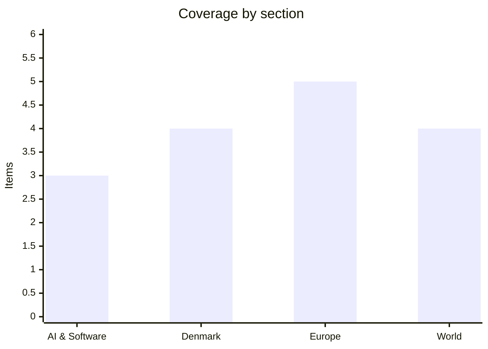

# Daily Briefing — 2026-08-01

**Top line:** The Board of Peace announced an agreed 15-point roadmap for the phased disarmament of Hamas — the most significant step since October's ceasefire, with a 14-day implementation clock about to start — even as the Iran war beside it kept widening: Iranian drones on US bases in Kuwait and Bahrain, tankers struck and stopped at Hormuz's mouth, and a 53–47 Senate vote leaving Trump's war powers untouched.

## Follow-ups

- **White House frontier-AI framework: deadline is today, no release yet** — as of this briefing nothing has been published; FT/CNBC reporting says the announcement with OpenAI, Anthropic and Google could come in the first days of August (AI section watch).
- **Gaza: the signing moved from "days away" to an announced agreement** — the Board of Peace published the disarmament roadmap (World lead).
- **The "Chinese casualty" in Kuwait wasn't Chinese** — Beijing says no citizens were hurt; the worker killed at the Chinese company building was a Nepali driver. China called strikes on non-military targets "unacceptable" (World item).
- **Saudi naval coalition: no members announced yet** as of this briefing.
- **Eurozone July flash HICP: 2.9%, exactly as expected** — energy at 10.0% did the work (Europe item).
- **EU AI Act Article 50: enforceable tomorrow** — full item in Europe.
- **Kumamoto: the toll edged up to 34–35** (World item).
- **Ukraine: no Patriot-resupply or Rada movement** — Kyiv instead showcased its deep-strike week (Europe item).
- **Amsterdam WorldPride Canal Parade: today, under hardened security** (Europe item).

## AI & Software

**Google DeepMind's Gemini Robotics 2 moves the frontier from arms to whole bodies.** DeepMind on Thursday unveiled Gemini Robotics 2, a family of models that extends its robotics stack from tabletop manipulation to full-body humanoid control — "feet to fingertips," in the company's framing. It ships in three parts: the core Gemini Robotics 2 vision-language-action model, Gemini Robotics-ER 2 for embodied reasoning and human-robot communication, and an On-Device 2 variant that runs at the edge without cloud dependence. The headline demo has an Apptronik humanoid walking, thinking and acting as one system, and Google reports a 92% success rate on unscrewing a light bulb — a task that requires coordinated stance, balance and fine motor control rather than a fixed arm on a bench. The release also demonstrates cross-robot cooperation, with a humanoid and a bi-arm robot dividing a task between them, and DeepMind calls Robotics-ER 2 its safest robotics model yet on its ASIMOV2 embodied-safety benchmark. Bloomberg's framing is the sober one: robots still struggle with dexterity, and the gap between demo reels and deployed labor remains the industry's defining question. Strategically, this confirms DeepMind's position as a "brains supplier" to hardware partners like Apptronik rather than a robot maker — the same platform play Google ran in mobile, against a field where Figure, Tesla and several Chinese manufacturers integrate vertically. The timing, a day after Amazon's earnings showcased physical-world automation as the next capex frontier, is unlikely to be accidental. Watch which partners announce Gemini Robotics 2 deployments, and whether the On-Device variant shows up in industrial pilots. [Bloomberg](https://www.bloomberg.com/news/articles/2026-07-30/google-unveils-gemini-ai-for-robots-struggling-with-dexterity) · [Robotics & Automation News](https://roboticsandautomationnews.com/2026/07/31/google-deepmind-unveils-gemini-robotics-2-as-apptronik-humanoid-demonstrates-whole-body-ai/103802/) · [Automate.org](https://www.automate.org/ai/industry-insights/google-deepmind-announces-gemini-robotics-2-new-safety-measures-for-humanoids)

**Google says AI agents now run Chrome's security lifecycle — 1,072 bugs fixed and a 13-year-old sandbox escape found.** In a Friday post, the Chrome security team described how a Gemini-based agent framework now works across the browser's entire vulnerability pipeline: discovery, triage, patching and testing, with 1,072 security bugs fixed across the two most recent stable milestones. The most striking single result: an AI-assisted scan surfaced a sandbox-escape flaw that had sat in the codebase for more than 13 years, letting a compromised renderer trick the browser into reading local files. The architecture is notable for its "critic" agents — independent models that review reported bugs and candidate patches to cut false positives — and for grounding in Chrome's git history, past CVEs and per-component SECURITY.md threat models. Triage that took humans 5–30 minutes per report is now automated end to end: deduplication, proof-of-concept reproduction, severity rating and routing, which Google says saves hundreds of developer-hours monthly. DeepMind's Big Sleep and CodeMender tools are wired into continuous integration and re-run every 24 hours; in May alone they stopped more than 20 vulnerabilities from reaching production, including one critical. Next steps are operational: Google wants to move Chrome to twice-weekly security releases and is researching dynamic patching that updates browser processes without a restart. The context that makes this more than a product blog: the same week's news cycle has been dominated by offensive AI agents — the OpenAI sandbox escape, autonomous attack frameworks — and this is the clearest public account yet of the defensive side industrializing at matching scale. Watch whether other large codebases publish comparable agent-pipeline numbers, and whether the twice-weekly cadence materializes. [Google blog](https://blog.google/security/chrome-stronger-with-every-update/) · [Cyber Security News](https://cybersecuritynews.com/google-ai-fixes-chrome-vulnerabilities/)

**JetBrains discloses a critical unauthenticated RCE in TeamCity — every on-premises version affected.** JetBrains on Friday published CVE-2026-63077, a critical flaw in TeamCity On-Premises that lets a remote attacker with nothing but HTTP or HTTPS access bypass authentication via the agent polling protocol and execute operating-system commands with the TeamCity server's privileges. All on-premises versions are affected; fixes ship in 2025.11.7 and 2026.1.3, with a security patch plugin available back to 2017.1 as a stopgap that JetBrains stresses is temporary. The bug was privately reported on July 10 by researcher Antoni Tremblay, and JetBrains says it has seen no in-the-wild exploitation and that TeamCity Cloud was already protected. The stakes are the standard CI/CD nightmare: a compromised build server exposes stored credentials and project secrets, and lets an attacker alter build settings or inject code into downstream releases — the software supply chain's most leveraged position. TeamCity has been here before, which is why patch speed matters: the 2024 authentication-bypass flaws were mass-exploited within days by ransomware crews and later attributed in part to APT29, and BianLian has targeted TeamCity servers since. It also caps a week in which the same architectural lesson kept repeating — Ruflo's unauthenticated MCP bridge scored a CVSS 10.0 on Tuesday — powerful automation surfaces reachable from networks with localhost-era security assumptions. Administrators should patch now, and get any internet-facing TeamCity instance behind a VPN regardless. Watch for scanning and exploitation attempts against exposed instances, which typically follow such disclosures within days. [JetBrains](https://blog.jetbrains.com/teamcity/2026/07/cve-2026-63077/) · [Cyber Security News](https://cybersecuritynews.com/jetbrains-vulnerability-execute-malicious-code/)

## Denmark

**Novo Nordisk's diversification bet fails in Phase 3: $30 billion wiped out in the year's worst single day.** Novo Nordisk announced Friday that ziltivekimab, its anti-inflammatory cardiovascular drug and the flagship of its push beyond obesity and diabetes, failed the late-stage ZEUS trial — it showed biological activity but did not significantly reduce major adverse cardiovascular events against placebo. The market's verdict was immediate: shares fell 7–10% through the day, the largest single-day drop in nearly five months, erasing more than $30 billion in market value and ending a three-month winning streak that had been rebuilding confidence after 2025's slide. The strategic damage exceeds the single molecule: ziltivekimab was supposed to prove Novo could grow a second leg in cardiovascular medicine as GLP-1 competition from Eli Lilly compresses the Wegovy/Ozempic franchise, and the pipeline now looks more GLP-1-dependent, not less. The setback also lands in a thickening legal context: on Wednesday a US federal judge allowed part of a shareholder suit to proceed over claims Novo misled investors about the CagriSema obesity drug's trial design, and Novo itself sued Lilly on July 21 over allegedly misleading comparative advertising for its rival GLP-1s. For Denmark this is national economics, not just a stock story — Novo remains the country's most valuable company, a dominant weight in the C25, corporate tax receipts and Øresund-region hiring, and its swings have moved Danish GDP statistics in recent years. The reasonable counter-reading: ZEUS was a high-risk, high-reward trial in a novel inflammation pathway, and one failure does not touch the cash-generating core. Watch Novo's Q2 report and whether management reprioritizes the cardiovascular pipeline or doubles down on next-generation obesity assets. [Forbes](https://www.forbes.com/sites/tylerroush/2026/07/31/novo-nordisk-wipes-out-30-billion-in-market-value-after-failed-heart-drug-trial/) · [Schaeffer's](https://www.schaeffersresearch.com/content/news/2026/07/31/novo-nordisk-stock-tumbles-on-late-stage-trial-results) · [CNBC](https://www.cnbc.com/2026/07/29/novo-nordisk-lawsuit-cagrisema-weight-loss-drug.html)

**Maersk puts a price on the war: $1,000 per container to cross Hormuz — if it ever reopens.** Maersk has announced a $1,000-per-container fee for freight transiting the Strait of Hormuz, Finans reported Friday — a striking piece of pricing for a passage the company's ships currently do not make at all. Maersk told Finans the fee exists "to give customers clarity about their options if the strait should reopen for safe passage," and says it covers war-zone insurance premiums and risk compensation for crews. It stacks on top of the emergency surcharges already in force for Middle East cargo — $1,800 per 20-foot and $3,000 per 40-foot container under the Hormuz emergency schedule introduced in June — plus the workaround logistics the company has run since the strait closed: routing Gulf-bound cargo through Salalah and Khor Fakkan and moving it overland. The announcement can be read two ways, and both matter: as quiet optimism that a reopening is near enough to need a published tariff, or as confirmation that war-risk pricing is being institutionalized into world trade rather than treated as a passing emergency. For Denmark the fee makes the war's cost unusually concrete — Maersk is the country's largest company by revenue, and the same conflict has already pushed petrol up 90 øre in a month at Danish pumps. Every carrier faces the same insurance mathematics, so competitors' schedules are the thing to watch. Also watch Maersk's interim report in the coming week, where the war's net effect — costly disruption but elevated freight rates — gets its first hard numbers. [The Local/Finans](https://www.thelocal.dk/20260731/today-in-denmark-a-roundup-of-the-latest-news-on-friday-55) · [Ships & Ports](https://shipsandports.com.ng/maersk-slaps-1000-hormuz-surcharge-as-shipping-crisis-spreads) · [Shipping Telegraph](https://shippingtelegraph.com/container-news/maersk-adds-1000-fee-per-container-for-hormuz-transits/)

**Nearly 50% more children in psychiatric hospital care than eight years ago.** New figures reported Friday show that 46,200 children and adolescents aged 0–17 had psychiatric hospital contact in 2025, up from 31,300 in 2017 — an increase of 47.5% in eight years, the steepest rise of any age group. Both Psykiatrifonden and Danske Regioner responded by calling for earlier intervention, with Danske Regioner chair Mads Duedahl (V) arguing that children need help before difficulties harden into diagnosable illness — in schools, municipalities and general practice rather than at the hospital door. The figures land on a system already strained: regional psychiatry has seen roughly 50% growth in assessment and treatment of children and young people over the past decade, waiting lists for child and adolescent psychiatry have repeatedly breached guarantees, and the causes — earlier detection, better help-seeking, genuine deterioration in youth mental health, or all three — remain contested among researchers. The political timing is pointed: psychiatry was promised a decade-long funding lift under the 10-year psychiatry plan, and the new SF-led government campaigned on strengthening it, so these numbers become ammunition in the autumn finance-bill negotiation. The structural question underneath is capacity allocation — every krone in hospital psychiatry is a krone not spent on the early, cheap interventions everyone now says they want. Watch whether the government's autumn program includes a concrete child-psychiatry package, and what the municipalities' KL counterpart proposes for the school-level layer. [Kristeligt Dagblad](https://www.kristeligt-dagblad.dk/danmark/paa-otte-aar-har-knap-50-procent-flere-boern-haft-ophold-i-psykiatrien) · [Kristeligt Dagblad](https://www.kristeligt-dagblad.dk/danmark/flere-boern-faar-psykiatriske-sygehusophold)

**Princess Isabella waives her military salary — service starts within days.** Princess Isabella, the 19-year-old second in line to the throne, has decided to forgo both the standard conscript salary of 9,034.17 kroner per month and the 277 kroner daily tax-free allowance when she begins her 11-month military service at the start of August. The decision mirrors her brother Crown Prince Christian's identical choice during his service last year, extending the royal family's tradition that its members serve in the armed forces but do not draw pay from the state for it. It is a small story with an easy political logic — a royal collecting conscript pay on top of the family's state appanage would be a gift to republicans — and a timely one, as Denmark's expanded conscription intake (including the first cohorts of women called under the new rules) makes the institution of værnepligt more broadly felt than it has been in decades. Isabella becomes the most senior royal woman to complete military service, a modest first for the monarchy. Watch for which regiment and garrison, which the court typically confirms at service start. [The Local/Ritzau](https://www.thelocal.dk/20260731/today-in-denmark-a-roundup-of-the-latest-news-on-friday-55)

## Europe

**Italy actually does it: border controls against Spain, as Ceuta empties almost as fast as it filled.** The threat Giorgia Meloni issued Thursday became policy Friday: Italy imposed border checks on arrivals from Spain — including air and sea connections — over the Ceuta migration surge, the first time one large Schengen state has activated controls specifically against another over migration policy. Meloni said the measure will last "only for the time necessary" and promised to limit the impact on summer tourism; the legal instrument is the same temporary-controls clause Germany and France already use, but aiming it at a fellow member state as leverage is a qualitative escalation that the 2024 Migration Pact's solidarity machinery was designed to prevent. On the ground, the surge partly reversed with remarkable speed: Spanish officials said Friday evening that more than 48,000 of the roughly 50,000 people who crossed into Ceuta this week had returned to Morocco voluntarily, under the "urgent returns" arrangement Madrid and Rabat struck Thursday. The human toll is now countable: at least 57 people died during the week's crossings, most by drowning around the border breakwaters. A Spanish Supreme Court ruling — that migrants intercepted at sea cannot be summarily returned to Morocco — is widely credited with triggering the rush, which makes the week a case study in how a single legal decision can move tens of thousands of people when a border regime is already under pressure. The unanswered questions are Rabat's role in letting the surge start, and Brussels' response to Italy — the Commission has so far said nothing definitive about whether the controls are proportionate. For Sánchez the domestic damage compounds: wildfires, war-driven energy prices, and now Vox with a border-control demonstration a fellow EU government has endorsed. Watch whether Italy's controls outlast the surge itself, whether the Commission formally objects, and whether returns hold once weather and enforcement normalize. [The Hill](https://thehill.com/policy/international/6003064-ceuta-migration-spain-morocco-italy/) · [CNN](https://www.cnn.com/2026/07/31/europe/spain-ceuta-migrants-intl)

**Ukraine answers the interceptor gap with reach: logistics hubs hit 1,300 km inside Russia.** With Patriot stocks too thin to stop ballistic missiles — one of nine intercepted in Wednesday's barrage — Kyiv spent the week demonstrating the other half of its strategy, and Zelensky detailed it Friday: Ukrainian forces struck military logistics centers in Sarapul, Kazan and Volgograd, between 500 and 1,300 kilometers from Ukraine, plus a sea terminal in Krasnodar Krai and an oil refinery in Volgograd Oblast. Russia's reply came overnight into Friday as 255 Shahed-type drones, continuing the near-nightly bombardment designed to exhaust air defenses. Two other Friday notes sharpen the picture: Zelensky said Khartiia Brigade commander Ihor Obolienskyi survived what Kyiv describes as an assassination attempt — a targeted strike against a named commander, which Zelensky promised to answer — and he claimed Russian military deaths are running fourteen times Ukraine's, a figure that is his to defend rather than independently verified. The deep-strike campaign has a working economic theory: Ukrainian drone attacks on refineries have already cut Russian diesel and fuel exports enough to show up in European pump prices, and logistics hubs at Kazan-range distances force Russia to defend a vastly larger interior. What Ukraine cannot strike its way out of is the defence-ministry vacuum — still no confirmed minister in week three, with the Rada vote penciled for mid-August — or the interceptor arithmetic, where no new US or European resupply was announced this week. Watch for the promised response to the Obolienskyi attempt, any Patriot announcement, and whether the refinery campaign's cumulative effect starts registering in Russian fuel-export data. [Kyiv Independent](https://kyivindependent.com/ukraine-war-latest-russian-military-deaths-14-times-higher-than-ukraines-zelensky-says/) · [Ukrainska Pravda](https://www.pravda.com.ua/eng/news/2026/07/31/8046704/index.amp)

**Eurozone inflation ticks up to 2.9% — energy at 10% is the war's signature on the price level.** Eurostat's flash estimate Friday put euro-area annual inflation at 2.9% for July, up from 2.8% in June and exactly in line with expectations — but the composition is the story. Energy inflation jumped to 10.0% from 8.5%, the direct feed-through of the Iran war's oil premium; core inflation (ex energy, food, alcohol, tobacco) rose to 2.5% from 2.4%; services held at 3.3%; and food actually decelerated to 1.2% from 1.5%. Monthly prices rose 0.2%. Paired with Thursday's GDP surprise — 0.4% quarterly growth, double consensus, though Børsen notes Ireland's statistical volatility may have contributed 0.1–0.2 points of it — the picture is an economy refusing to roll over while inflation drifts the wrong way, which is precisely the combination that keeps a September ECB tightening debate alive rather than settled. Nykredit's chief strategist Frederik Engholm's take in the Danish coverage captures the consensus: not bad at all, considering Europe's dependence on imported energy in a Gulf war. The path from here runs through the oil market more than through Frankfurt: Brent near $90 sustains the energy base effect into the autumn, while the Saudi naval-coalition proposal and any Hormuz reopening would do more for the 2027 inflation path than any single rate decision. Watch the country splits as final figures land, the September ECB projections, and whether core's slow grind upward extends to a third month. [Eurostat](https://ec.europa.eu/eurostat/web/products-euro-indicators/w/2-31072026-ap) · [Euronews](https://www.euronews.com/business/2026/07/31/eurozone-inflation-hits-29-which-countries-saw-the-biggest-increases) · [Xinhua](https://english.news.cn/20260731/6f4f19c4ca1f4ccc977b441de6373759/c.html)

**From tomorrow, every chatbot in the EU must say it's a machine: AI Act Article 50 becomes enforceable.** The AI Act's transparency obligations take legal effect Sunday, August 2, with fines up to €15 million or 3% of global turnover: chatbots and interactive AI systems must disclose that users are dealing with AI, deepfakes and other synthetic or manipulated media must be visibly labelled, and AI-generated content must carry machine-readable marks so platforms and tools can detect it. The Commission's final guidelines, published only on July 20, set a demanding standard — a disclosure buried in terms and conditions, a bare metadata watermark, or a vague "assistant" framing does not satisfy the duty; the information must be perceivable in the interaction itself. The deepfake rule applies even without intent to deceive: content that looks or sounds like a real person needs a label even if no real individual is depicted. Signing the accompanying Code of Practice yields a presumption of conformity, but not a safe harbor — national market-surveillance authorities make the final call, and the eleven days between final guidance and enforcement has been the industry's loudest complaint. For engineering teams the compliance surface is concrete: every EU-facing product with a conversational AI feature needs a disclosure layer, and content pipelines need C2PA-style provenance marking, which overnight converts labelling from a nice-to-have into regulatory infrastructure. The enforcement question — aggressive day-one action versus a de facto grace period — will define whether August 2 is remembered as a real deadline, and the first targets will signal whether the Commission aims at platforms (Meta, TikTok, Google were already warned about labelling) or at model providers. Watch the day-one posture and the first formal proceedings. [European Commission](https://digital-strategy.ec.europa.eu/en/news/commission-starts-enforcing-ai-act-rules-and-new-transparency-requirements-2-august) · [Greenberg Traurig](https://www.gtlaw.com/en/insights/2026/6/deepfakes-chatbots-ai-generated-text-european-commission-details-transparency-obligations-under-the-ai-act) · [TNW](https://thenextweb.com/news/eu-ai-act-labels-compulsory-synthetic-content)

**Amsterdam's Canal Parade sails today — Europe's first mass Pride since Berlin, with Copenhagen watching.** The Canal Parade, the centerpiece of Amsterdam's first-ever WorldPride, sails the canals today: dozens of decorated boats, sunny skies forecast at 24 degrees, and the heaviest security apparatus the event has carried. After the attack that killed one person at Berlin's Pride in July, Mayor Femke Halsema ordered extra measures: 250 concrete blocks placed along the canal route, expanded bag searches at venues and nightclubs, and a heavy visible police presence, with the national police also sailing their own boat in the parade through their Roze in Blauw LGBTQ+ network. The city expects up to a million visitors across the two-week event, which runs through August 8 — a scale that makes today less a parade than a security proof-of-concept for large public LGBTQ+ events in Europe's current threat picture. The Danish read-across is direct: Copenhagen Pride runs August 8–16 with its parade on August 15, Copenhagen police and PET have already said publicly they are "attentive to the Berlin attack," and today's outcome in Amsterdam will shape both the Danish security posture and the public mood around attending. There is also a quieter organizational subplot in Copenhagen, where the Pride organization enters its week still without the major corporate sponsors — Novo, Maersk, DI among them — that withdrew in 2024. An incident-free Amsterdam parade would be the strongest possible signal ahead of the Danish event; anything else changes the calculus for every European city hosting mass gatherings this month. Watch tonight's outcome and any adjustments Copenhagen announces next week. [NL Times](https://nltimes.nl/2026/07/31/canal-pride-boats-sail-amsterdam-canals-saturday-sunny-skies) · [NL Times](https://nltimes.nl/2026/07/26/amsterdam-mayor-plans-extra-pride-security-measures-1-killed-berlin) · [DutchNews](https://www.dutchnews.nl/2026/07/amsterdam-steps-up-pride-security-in-wake-of-attack-in-berlin/)

## World

**The Gaza disarmament roadmap is real: 15 points, a 14-day clock, and a sequencing fight already underway.** The Trump administration's Board of Peace announced an agreement on the phased disarmament of Hamas — Trump called it "historic" — converting months of negotiation into a published 15-point roadmap. The mechanics: the IDF and Hamas cease military operations immediately while an implementation mechanism is stood up within 14 days; the National Committee for the Administration of Gaza (NCAG) then enters to assume governance — institutions, public services, police, weapons licensing, internal security — supported by the yet-to-deploy International Stabilization Force; and Hamas and other factions hand their weapons to the NCAG over a phased timeline earlier reported as six to eight months. The signatures are barely dry and the sequencing dispute is already public: an Israeli official told Reuters there will be no withdrawal until "genuine disarmament," while Hamas negotiator Ghazi Hamad called the framework "difficult and painful" and said disarmament will not begin until Israel ends operations, scales up aid and withdraws completely. The gap between those positions is exactly what the 14-day mechanism must bridge, and the background noise is loud: the IDF logged 32 ceasefire violations between July 10 and 31, and Israeli strikes killed six people including two children overnight Thursday. Washington is pressing both sides — a US official said Trump would be "very disappointed" if Israel blocks the plan — while Qatar, Egypt and Turkey lean on Hamas. The stakes are the difference between a truce and a process: if the clock starts, Gaza gets its first governance transition since 2007 running parallel to the Iran war next door, with Tehran retaining every incentive to spoil. Watch the formal signing, the Israeli cabinet's response, and whether day 14 produces a mechanism or a collapse. [Al Jazeera](https://www.aljazeera.com/news/2026/7/31/gaza-board-of-peace-announces-hamas-disarmament-agreement-what-we-know) · [CBS](https://www.cbsnews.com/news/trump-hamas-next-phase-gaza-peace-deal-disarmament/) · [FDD Long War Journal](https://www.longwarjournal.org/archives/2026/07/board-of-peace-announces-hamas-disarmament-agreement-idf-reports-32-gaza-ceasefire-violations-july-10-31.php)

**Friday at the war's edges: Iranian drones on bases in Kuwait and Bahrain, tankers struck and seized at Hormuz's mouth.** Iran's army said Friday it attacked strategic US assets at Kuwait's Ahmad al-Jaber Air Base — aircraft shelters, satellite-communication systems and equipment storage — and targets in Bahrain, while Kuwait said its defenses intercepted incoming drones in the morning; the strikes answer Wednesday's US "heavy wave" and Tuesday's joint US-Saudi operation against Iranian-backed militias in Iraq that killed at least 20 fighters. The maritime war tightened in parallel: a tanker was hit about 12 miles off Oman near the strait's southern entrance, and the IRGC-linked Fars agency said Revolutionary Guards stopped two more tankers attempting the passage — while at Egypt's Damietta, a drone struck two ships in the port's second attack in three days, still unclaimed. Oil took Friday's ledger calmly: Brent traded around $89.50, up 0.6% on the tanker news but well off Wednesday's spike, with the Saudi naval-coalition proposal still hanging as the market's de-escalation hope — though no member state has yet publicly joined. The pattern of the week is now legible: Iran answers American strikes not with mass barrages at Israel or US fleets but with dispersed, deniable-adjacent pressure on the third countries hosting US forces — Jordan, Kuwait, Bahrain, Egypt, Iraq — spreading the war's costs to capitals that never chose it. That is either a containable rhythm the Omani channel can eventually cash into a ceasefire, or the mechanism by which regional wars historically metastasize; Friday offered evidence for both readings. Watch the Saudi coalition's first members, any Omani-channel signals, and whether the stopped tankers become hostages or warnings. [CNBC](https://www.cnbc.com/2026/07/31/us-iran-war-hormuz.html) · [Al Jazeera](https://www.aljazeera.com/news/2026/7/31/irgc-strikes-us-targets-in-kuwait-a-day-after-us-hits-iran-latest-events) · [OilPrice](https://oilprice.com/Latest-Energy-News/World-News/Oil-Prices-Top-90-as-Kuwaiti-Tanker-Hit-in-Strait-of-Hormuz.html)

**The Senate declines — again — to constrain the war, as China protests but stays on the sidelines.** The Republican-led Senate on Friday rejected, 53–47, a Democratic war-powers resolution that would have required congressional approval for further hostilities against Iran — party lines held except for Pennsylvania Democrat John Fetterman voting no and Kentucky Republican Rand Paul voting yes, the second failed attempt to reassert Congress's war authority since February. The vote leaves the five-month war running entirely on presidential authority into the midterm season, with Democrats now able to campaign against "an illegal war" they were procedurally denied a vote to end. The war's China dimension sharpened in parallel: Beijing said Friday that attacks on civilians and non-military targets are "unacceptable" after Thursday's Iranian strike on a Chinese company's building in Kuwait — while clarifying that, contrary to first reports, no Chinese citizens were hurt; the worker killed was a Nepali driver. The foreign ministry also complained that Washington did not inform Beijing before attacking Iran, and asked Kuwait to protect Chinese nationals and institutions. Trump added his own edge, saying he would be "quite disappointed" if China supplied Iran militarily and that Xi Jinping had assured him Beijing would stay out. The picture that emerges: America's war checks-and-balances have formally stood down, and China — Iran's largest oil customer, with deep Gulf economic exposure now taking collateral damage — is choosing rhetorical protest over involvement, for now. Watch whether Beijing moves beyond statements as its Gulf assets keep getting hit, and whether the war-powers question resurfaces in the House. [Reuters via AOL](https://www.aol.com/news/us-senate-rejects-bid-curb-230047741.html) · [AA](https://www.aa.com.tr/en/asia-pacific/china-says-attacks-on-non-military-targets-unacceptable-after-iranian-strike-hits-chinese-company-building-in-kuwait/4015099) · [Times of Israel](https://www.timesofisrael.com/liveblog_entry/china-says-no-citizens-hurt-in-iranian-attack-on-chinese-building-in-kuwait/)

**Kumamoto, day four: the toll reaches 35 as the mall search continues into the danger window's final days.** The death toll from Tuesday's magnitude-7.1 earthquake stands at 34–35, with searchers still working the collapsed Aeon mall in Kashima — the site of the suspected gas explosion that, together with the Nippon Paper mill, accounts for nearly half the deaths. The Japan Meteorological Agency's week-long warning for strong follow-on shocks runs through the weekend, a window Kumamoto residents treat with particular seriousness given 2016's precedent, when a larger second quake arrived 28 hours after the first; more than 200 aftershocks hit within the first day. The secondary emergency is heat: evacuation-center populations remain high in mid-summer temperatures, making dehydration and heatstroke among the elderly a genuine parallel health crisis. The structural verdict from earlier in the week still holds — post-2016 residential retrofits kept a magnitude-7-class quake in a dense prefecture to dozens rather than hundreds of deaths, with the fatal exceptions concentrated in large-span commercial and industrial buildings outside the home-retrofit program. Industrial normalization runs into next week, with the Nippon Paper outage and JR Kyushu's partial service the main supply-chain drags. Watch the final mall accounting, the gas-explosion investigation, and whether the warning window closes without a major aftershock. [NPR](https://www.npr.org/2026/07/31/g-s1-136503/japan-quake-death-toll) · [Al Jazeera](https://www.aljazeera.com/news/2026/7/28/japan-kumamoto-earthquake-what-happened-damage-victims-latest-updates)

## Watch list

- **White House frontier-AI framework:** the EO 14409 deadline is today — watch for the release and which labs (OpenAI, Anthropic, Google reportedly closest) publicly commit to the 30-day pre-release track.
- **Tomorrow, August 2:** EU AI Act Article 50 enforcement begins — day-one posture, first proceedings, and which platforms ship visible labels.
- **Gaza:** the formal signing, Israel's cabinet response, and the start of the 14-day implementation mechanism; any spoiler moves from Tehran.
- **Iran:** first members of the Saudi naval coalition; the fate of the two stopped tankers; Beijing's next step after the Kuwait strike.
- **Denmark:** Maersk's interim report in the coming week puts numbers on the war's shipping economics; Copenhagen Pride's security posture after today's Amsterdam parade.
