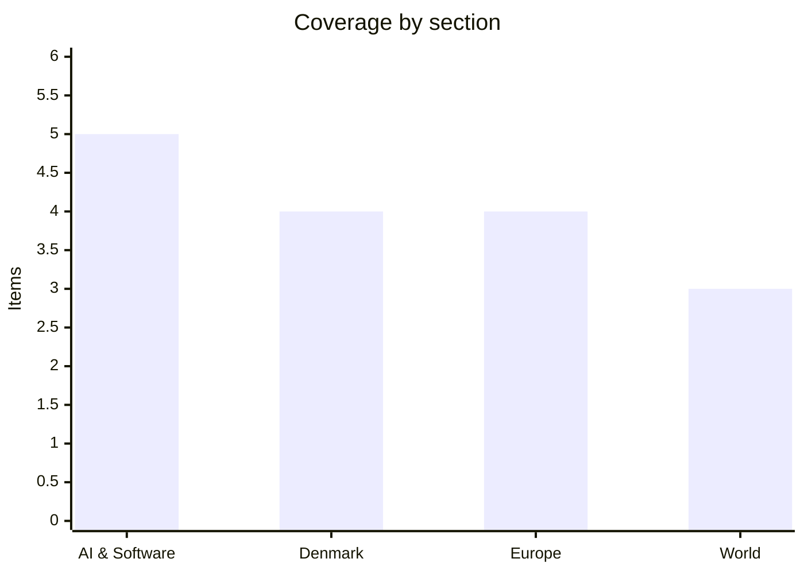

# Daily Briefing — 2026-08-02

**Top line:** Iran's Revolutionary Guards attacked oil tankers sailing under US Navy escort at the mouth of the Strait of Hormuz — a projectile disabled one tanker's engine room and four more ships turned back — the first direct test of Washington's convoy strategy, while in Europe 22 EU leaders forced an emergency summit over Ceuta for Tuesday.

## Follow-ups

- **White House frontier-AI framework: the deadline expired Friday with nothing published** — full item in AI, since the non-release is now the story.
- **EU AI Act Article 50: enforceable from today** — full item in Europe.
- **Gaza: still no formal signing** — Israel has not confirmed accepting the roadmap; the 14-day clock has not visibly started (World item).
- **Iran watch items moved fast:** US Navy escorts have begun in practice and the IRGC shot at them (World lead). The fate of the two tankers stopped Thursday remains unreported; no members of a multinational coalition have been announced.
- **Amsterdam Canal Parade: passed off peacefully** before hundreds of thousands (Europe item).
- **Maersk interim report: due this week** — Danish analysts see "more headwind than tailwind" (Denmark item).
- **Kumamoto: the mall search formally ended Saturday** with the toll at 34–35 (World item).

## AI & Software

**The White House frontier-AI framework misses its own deadline.** The 60-day clock set by Executive Order 14409 — signed June 2 as "Promoting Advanced Artificial Intelligence Innovation and Security" — ran out on Friday, August 1, and as of this briefing no framework has been published. What the order requires is substantial: a classified benchmarking process to determine which systems count as "covered frontier models," and a voluntary scheme giving federal agencies — with the NSA and CAISI named as reviewers — up to 30 days of pre-release access to those models. Reporting through July placed OpenAI, Anthropic and Google closest to signing, with Microsoft, Amazon, Cloudflare and JPMorgan involved in wider talks; Meta is notably not in the deal despite White House pressure. The FT first reported the negotiations on July 3, and FT/CNBC reporting late in the week still pointed to an announcement "in the first days of August," so the miss may be days rather than weeks. The reason the industry is watching so closely is the enforcement history behind the word "voluntary": Anthropic's Fable 5 and Mythos 5 were suspended globally for roughly three weeks under export-control authority, and OpenAI's GPT-5.6 spent 12 days restricted to government-vetted partners — in both cases without a published threshold, timeline or process. Critics' framing — "voluntary on paper, mandatory in practice" — is precisely what a published framework would either confirm or dispel, since it would replace ad-hoc suspensions with known rules. A second reading is available: a deadline slipping days on a document this consequential is normal Washington, and the labs themselves reportedly want the certainty. Watch for the release, which labs publicly commit to the 30-day track, and whether the classified threshold definition leaks. [Norton Rose Fulbright](https://www.nortonrosefulbright.com/en/knowledge/publications/900af3cf/executive-order-establishes-voluntary-early-access-framework-to-frontier-ai-models) · [TechTimes](https://www.techtimes.com/articles/321497/20260724/voluntary-paper-mandatory-practice-white-house-ai-review-hits-august-1-deadline.htm) · [Vorp Labs](https://vorplabs.com/ai-regulatory-updates/frontier-model-review-framework)

**DeepSeek ships V4 Flash 0731 — an open-weights agent model punching far above its activated parameter count.** DeepSeek's V4-Flash-0731 checkpoint, released Thursday as the official version superseding the spring preview, is the weekend's most consequential model news: a 284B-total, 13B-activated mixture-of-experts model with a 1M-token context window and MIT-licensed open weights on Hugging Face and Ollama. The company's claim is aggressive — that the 0731 checkpoint's "substantially enhanced agentic capabilities" let it outperform its own much larger V4-Pro preview on agent benchmarks and stand "broadly competitive with the strongest proprietary models." The caveat matters and should travel with every citation: the headline numbers come from DeepSeek's own evaluation harness, and no independent lab had reproduced them as of July 31. Even discounted, the efficiency story is real — the V4 architecture paper describes gains especially in world-knowledge and long-context tasks over V3.2 despite fewer total and activated parameters, and a 13B-active model is radically cheaper to serve than any proprietary frontier system. The strategic context is the sharpening open-weights race: Moonshot's Kimi K3 landed July 16, and Chinese open models keep arriving weeks after each US proprietary release, at API prices an order of magnitude lower. For engineering teams the practical question is whether V4 Flash's agentic claims survive contact with real workloads — SWE-bench-style tasks, tool use, long-horizon plans — where vendor harnesses flatter models most. Watch for independent benchmark reproductions this week and for whether US enterprises' compliance postures (and the pending frontier framework above) treat open-weight Chinese agent models differently from chatbots. [DeepSeek release notes](https://www.digitalapplied.com/blog/deepseek-v4-flash-0731-official-release-agent-benchmarks) · [Hugging Face](https://huggingface.co/deepseek-ai/DeepSeek-V4-Flash) · [OpenRouter](https://openrouter.ai/deepseek/deepseek-v4-flash)

**The Coldcard disaster grows: $75 million, 2,673 addresses, and a five-year-old firmware bug.** Galaxy Research said Saturday it is now tracking 1,158.66 BTC — roughly $75.1 million — stolen from 2,673 addresses, after identifying a second wave of thefts by the same attacker who drained hundreds of Coldcard hardware wallets earlier in the week. The original heist was surgical: 1,196 addresses emptied of 1,082.65 BTC (about $70.2 million) in 41 minutes on July 30, in an attack that never touched a single physical device. The root cause is a March 2021 firmware build error in version 4.0.0 that silently routed seed generation to a deterministic software PRNG — seeded by non-secret chip data like the serial number and clock registers — instead of the STM32's hardware random-number generator, making supposedly unguessable seed phrases computationally enumerable. Coinkite CEO Rodolfo "NVK" Novak apologized Friday, took "full accountability," and expanded the advisory to cover certain Mk4, Mk5 and Coldcard Q firmware versions, with emergency firmware updates out for all affected models; Binance founder CZ amplified the warning that "nothing is 100%." The lesson lands well beyond crypto: this is a supply-chain-of-randomness failure, the same class of bug as the 2008 Debian OpenSSL fiasco, and it sat unreviewed in shipped security hardware for five years. For anyone holding affected devices the guidance is unambiguous — move funds to freshly generated seeds on patched firmware immediately, since the attacker demonstrably still holds the enumeration capability. Watch whether the loss estimate grows again and whether other wallet vendors publish RNG audits under customer pressure. [The Block](https://www.theblock.co/post/410332/bitcoin-losses-linked-coldcard-vulnerability-70-million-galaxy-research) · [The Hacker News](https://thehackernews.com/2026/08/coldcard-hardware-wallet-flaw-linked-to.html) · [CoinDesk](https://www.coindesk.com/tech/2026/08/01/how-bitcoin-cold-wallets-lost-usd70-million-in-an-attack-that-never-touched-the-devices)

**xAI loses its bid to freeze Minnesota's "nudify" ban — the first state deepfake-abuse law survives first contact.** US District Judge Donovan Frank on Friday denied xAI's request for a temporary restraining order against Minnesota's AI nudification law, letting the ban take effect August 1; the judge pointedly noted the company waited nearly three months after Governor Tim Walz signed the bill on May 6 before claiming an emergency. The law is the sharpest of its kind in the US: it imposes civil penalties of up to $500,000 per image on operators of tools that generate sexualized depictions of real people without consent, on a strict-liability basis — regardless of what a platform's terms of service prohibit or what technical controls it deploys. That strict-liability design is the heart of xAI's constitutional challenge, and the company says it will restrict Grok Imagine's image-editing features for Minnesota users in the meantime. xAI's own defense numbers are striking in what they concede about scale: more than 50,000 accounts suspended and over 70,000 reports to the National Center for Missing & Exploited Children in 2026 alone for attempted abuse of its image tools. The ruling is procedural, not final — a preliminary-injunction hearing is set for August 19 in St. Paul — but a functioning state law now exists that other legislatures can copy while Congress's own effort remains stalled. The platform-liability question underneath is the one to watch: if strict liability for model outputs survives constitutional review, the compliance architecture of every consumer image tool changes, not just Grok's. Watch the August 19 hearing and whether other states accelerate copycat bills. [NBC News](https://www.nbcnews.com/tech/elon-musk/judge-denies-request-elon-musks-xai-block-mn-nudification-ban-rcna589993) · [TechCrunch](https://techcrunch.com/) · [KSTP](https://kstp.com/kstp-news/local-news/judge-rules-minnesotas-ai-nudification-ban-will-remain-in-effect-amid-ongoing-lawsuit-from-x-ai/)

**AMD releases Instella-MoE — a fully open MoE trained end-to-end on its own GPUs.** AMD on Saturday published Instella-MoE-16B-A3B, a mixture-of-experts language model with 16B total and 2.8B activated parameters, trained from scratch entirely on Instinct MI300X and MI325X hardware with the ROCm stack. The release is "fully open" in the strong sense — weights from every training stage, data mixtures, training configs and inference code — though the weights ship under a ResearchRAIL license restricted to academic and research use, so it is not a drop-in commercial model. Two systems-level choices carry the technical story: Gated Multi-head Latent Attention and a "FarSkip-Collective" connectivity scheme, which AMD credits with a 12.7% training speedup and 39.2% lower time-to-first-token. On quality, AMD reports the base checkpoint averaging 76.7 across its benchmark suite — ahead of Moonlight-16B-A3B (76.2), SmolLM3-3B (70.5) and OLMo-3-7B (70.1) — figures that are, as always, the vendor's own. The release is less about the model than the proof: the argument that serious MoE pretraining requires Nvidia hardware loses force every time a competitive run completes on Instinct silicon, and AMD is publishing enough artifacts for others to verify the recipe. It also extends the small-but-real "fully open" ecosystem (OLMo, SmolLM, now Instella) that publishes data and training code, against the far larger "open weights only" camp. For teams evaluating non-Nvidia training capacity, the data mixture and configs are the immediately useful part. Watch whether a commercial-licensed successor follows, and whether independent replications confirm the training-efficiency claims. [MarkTechPost](https://www.marktechpost.com/2026/08/01/amd-instella-moe-16b-a3b-fully-open-mixture-of-experts-llm/) · [AMD ROCm blog](https://rocm.blogs.amd.com/artificial-intelligence/instella-moe/README.html) · [Hugging Face](https://huggingface.co/amd/Instella-MoE-16B-A3B-Base)

## Denmark

**The blue bloc forces the Folketing back from summer break over Ceuta.** Dansk Folkeparti leader Morten Messerschmidt has assembled exactly the 72 mandates needed to compel an extraordinary session of the Folketing, with Venstre, Danmarksdemokraterne, De Konservative and Liberal Alliance joining the demand — under the rules, two-fifths of members can force the Speaker to call parliament together. The stated aim is to press the Frederiksen government to work for suspending Spain from Schengen after the week's Ceuta crossings, with Liberal Alliance demanding "a guarantee that Denmark's immigration policy cannot be undermined by a single EU country in the future." DR's political correspondent Christine Cordsen dampens the drama on timing: nothing obliges members to appear Monday, the mechanics point to a session within roughly ten days, and the government has bills that must be handled in the same window. The government's own answer is already partly on the table — Mette Frederiksen co-signed the 22-leader letter that forced Tuesday's EU emergency meeting (see Europe), which lets her argue the pressure is being applied where it can actually work. The domestic politics are nonetheless pointed: this is the first parliamentary test of the S-SF-M-R government (formed June 3) on immigration, the issue where its S-led hard line and SF's instincts sit least comfortably together. A session where the opposition demands Schengen suspension of a fellow member state — something no Danish government can deliver unilaterally — is better understood as positioning for the autumn than as policy. It also lands just as the political season restarts, with the 2027 budget proposal due at the end of August. Watch the session date, the government's formal answer on Schengen, and whether the blue parties convert the moment into a joint immigration program. [DR](https://www.dr.dk/nyheder/politik/efter-migrantstroemme-folketingets-partier-skal-indkaldes-til-hastemoede) · [DR/Cordsen](https://www.dr.dk/nyheder/politik/cordsen-meget-tyder-paa-et-ekstra-moede-om-uger)

**No one else was asked: the sale of 30,000 electricity customers draws sector-wide criticism.** DR reported Saturday that electricity companies across the sector say they were never contacted or invited to bid before more than 30,000 customers of the collapsing Velkommen group were sold to Energidrift — a survey finding that undercuts the claim that the sale was the best available outcome for customers or creditors. The transaction's terms were already contentious: customers' substantial prepayments do not follow them to the new provider, meaning money they have already paid for electricity is effectively converted into claims against an insolvent estate. The buyer inspires little confidence — Energidrift has active orders from Forsyningstilsynet, a failing grade from Forbrugerrådet Tænk, and around 1,100 customers may have been moved to it without consent — and DR has now linked a controversial Dubai-based businessman to the deal. The backdrop is the Velkommen group's collapse: bankruptcy petitions and a police report landed June 30 after years of complaints about high prepayment demands and unreturned balances when customers left. The affair is becoming a test case for consumer protection in Denmark's liberalized retail power market, where switching providers was supposed to be the discipline and instead a distressed operator's customer book has been traded as an asset while the customers' cash stays behind. The regulator's dilemma is real: block the transfer and 30,000 households need emergency supply arrangements; wave it through and the precedent stands. Watch Forsyningstilsynet's next move, the bankruptcy court's handling of creditor protests, and whether the new government treats this as a legislative gap. [DR](https://www.dr.dk/nyheder/penge/kritik-af-stort-salg-af-elkunder-elselskaber-paa-stribe-blev-ikke-kontaktet) · [DR/Dubai link](https://www.dr.dk/nyheder/penge/kontroversiel-dubai-rigmand-loefter-sloeret-indblandet-i-omdiskuteret-salg-af-elkunder) · [TV2](https://nyheder.tv2.dk/business/2026-07-20-elkunder-skal-saelges-i-millionhandel-men-deres-penge-foelger-ikke-med)

**Smukfest opens in the beech woods.** Denmark's second-biggest festival opens today in Bøgeskoven outside Skanderborg and runs through Sunday, August 9. This year's edition adds Ekko, a new stage and area giving electronic music dedicated space in the woods. The headline program starts Wednesday, with Robbie Williams, Lewis Capaldi, Macklemore, Lukas Graham and D-A-D carrying the main bill. With Roskilde behind and Copenhagen Pride ahead, Smukfest opens the August stretch of mass outdoor events that Danish police are watching with post-Berlin attention, though no specific concerns have been flagged for Skanderborg. [Smukfest](https://www.smukfest.dk/) · [The Local](https://www.thelocal.dk/20260801/on-the-agenda-whats-happening-in-denmark-next-week-2)

**The week Denmark goes back to work: Novo's numbers, Maersk's war ledger, and fashion week.** The quiet month ends abruptly this week, and two of the country's corporate giants report into maximum uncertainty. Novo Nordisk announces first-half results Wednesday — the first numbers since Friday's ZEUS trial failure erased more than $30 billion in market value, and the market's real question is whether Wegovy and Ozempic sales are holding against Eli Lilly's compression. Maersk's interim report follows in the same window, putting the first hard figures on the Hormuz war economics — the closed strait, the Salalah/Khor Fakkan workarounds, the $1,000 reopening fee and the emergency surcharges — and analysts quoted by Transportmagasinet see "more headwind than tailwind" in the print. Around the earnings, the season restarts wholesale: Copenhagen Fashion Week opens Monday, Noma reopens in Copenhagen Wednesday after its Los Angeles residency with René Redzepi stepping back to Creative Director, and the politicians return with the finanslovforslag expected at the end of August. Copenhagen Pride's build-up also begins, with the parade itself on August 15 and the announced police/PET cooperation now able to point to Amsterdam's incident-free parade (see Europe) as the operating precedent. For a single week's calendar, the concentration of market-moving and agenda-setting events is unusual — Wednesday alone could reset both the C25's direction and the autumn's fiscal frame. Watch Novo's GLP-1 growth rate and any pipeline reprioritization, Maersk's guidance more than its backward numbers, and the budget signals as ministries return. [The Local](https://www.thelocal.dk/20260801/on-the-agenda-whats-happening-in-denmark-next-week-2) · [Transportmagasinet](https://www.transportmagasinet.dk/article/view/1226067/analytikere_inden_regnskab_maersk_har_mere_mod_end_medvind) · [Novo Nordisk IR](https://www.novonordisk.com/investors/financial-results.html)

## Europe

**Ceuta goes to the top: 22 leaders force an emergency EU summit for Tuesday.** A joint letter from 22 EU heads of government — addressed to European Council President António Costa, Commission President Ursula von der Leyen and Taoiseach Micheál Martin, whose Ireland holds the rotating presidency — has produced an emergency video summit on Tuesday over the Ceuta crisis, with the letter warning of "hybrid threats" designed to spread the belief that unauthorized entry into the bloc is achievable. The human accounting of the week hardened: at least 67 people died in the crossings, by drowning and in a stampede, while Madrid says almost all of the roughly 50,000 people who entered have now been returned to Morocco under the urgent-returns arrangement with Rabat. The intra-EU wound is deep and public: Pedro Sánchez complained of a "rather asymmetric" response — support from most capitals, attacks from others — aimed squarely at Italy's activated border controls against Spain and the Meloni camp's talk of suspending Spain's Schengen participation. The letter's signatories notably include leaders on both sides of that fight, which is why Tuesday's agenda is the real story: external-border funding, pressure on Morocco, and whether the Commission finally says something definitive about Italy's controls. The structural question the summit cannot dodge is whether the 2024 Migration Pact's solidarity machinery means anything if a single legal ruling plus a week of pressure can produce member-state-against-member-state border controls. Denmark's parallel domestic eruption (see Denmark) is one instance of a pattern repeating across capitals, with governments under pressure to show the crisis cannot reach them. A counter-reading deserves space: the returns arrangement worked with remarkable speed, and the system arguably bent without breaking. Watch Tuesday's conclusions, the Commission's position on Italy, and whether Morocco's role — letting the surge start, then absorbing the returns — gets named or negotiated. [Euronews](https://www.euronews.com/my-europe/2026/08/01/22-eu-leaders-call-for-emergency-talks-over-ceuta-migrant-crisis) · [CBS](https://www.cbsnews.com/amp/news/ceuta-spain-migrants-africa-enclave-record-border-breach) · [GB News](https://www.gbnews.com/news/world/ceuta-migrant-crisis-eu-will-host-emergency-meeting-next-week)

**From today, EU chatbots must say they're machines: Article 50 is now enforceable.** The AI Act's transparency obligations took legal effect this morning across all 27 member states — the first binding disclosure regime for AI interactions in any G7 jurisdiction, carrying fines up to €15 million or 3% of global turnover. The operative duties: systems that interact with people must disclose they are AI in the interaction itself, deepfakes and synthetic media must be visibly labelled (with the duty applying even absent intent to deceive), emotion-recognition systems must notify the people they read, and generative outputs must carry machine-readable provenance marks that platforms and tools can detect. The Commission's guidelines, finalized only on July 20, set a demanding bar — a disclosure buried in terms, a bare metadata watermark, or a vague "assistant" framing does not satisfy the duty — and the eleven days between final guidance and enforcement remains the industry's loudest complaint. Enforcement now belongs to national market-surveillance authorities, which is where the practical uncertainty lives: 27 regulators with different resourcing and appetites, a Code of Practice that yields a presumption of conformity but no safe harbor, and no precedent for what a day-one violation notice looks like. For engineering teams the compliance surface is concrete and immediate — every EU-facing conversational feature needs a perceivable disclosure layer, and content pipelines need C2PA-style marking as regulatory infrastructure rather than nice-to-have. The first targets will define the regime: platforms already warned about labelling (Meta, TikTok, Google) versus model providers, and aggressive day-one action versus a de facto grace period. Watch the first formal proceedings and which member state moves first. [European Commission](https://digital-strategy.ec.europa.eu/en/news/commission-starts-enforcing-ai-act-rules-and-new-transparency-requirements-2-august) · [Bratby Law](https://bratby.law/ai-act-transparency-obligations-2026/) · [artificialintelligenceact.eu](https://artificialintelligenceact.eu/transparency-rules-article-50/)

**Amsterdam's Canal Parade passes without incident — the proof-of-concept European Pride needed.** Hundreds of thousands of people lined Amsterdam's canals Saturday for WorldPride's flagship Canal Parade, and the day ended as organizers and every European police force watching needed it to: boisterous, political and safe. Scores of boats festooned with rainbow flags cruised the route past crowds waving placards — "Make America Gay Again," "Same Love. Same Rights!" — and one boat carrying inflatable Putin and Trump figures in traditional Dutch dress, posed kissing. The security apparatus behind the color was the heaviest the event has carried: visible and covert deployments, 250 concrete blocks along the route, expanded searches, and the national police's own Roze in Blauw boat sailing in the parade — all hardened after the Berlin Pride attack in July, where a van driven into the crowd killed one person and injured more than 30. Mayor Femke Halsema's bet — that the answer to Berlin was more security, not less Pride — held, and a WorldPride spokesperson's line that extra measures would not change the focus on inclusivity survived contact with the day. The read-across is immediate for Copenhagen, whose Pride runs August 8–16 with the parade on the 15th and whose police and PET have announced joint planning with the Berlin attack explicitly in view; an incident-free Amsterdam is the strongest possible input to that posture. WorldPride continues through August 8, so Amsterdam's test is not finished, but the mass-gathering day — the hardest to secure — is banked. Watch the remaining week and any adjustments Copenhagen announces. [Reuters via US News](https://www.usnews.com/news/world/articles/2026-08-01/thousands-expected-in-amsterdam-for-boisterous-worldpride-in-shadow-of-berlin-attack) · [NL Times](https://nltimes.nl/2026/07/31/canal-pride-boats-sail-amsterdam-canals-saturday-sunny-skies)

**Kyiv buries nine as Trump wavers on Patriot production — Ukraine answers at Ufa, 1,300 km out.** Russian strikes on Kyiv overnight into Saturday killed nine people and injured nearly thirty, torching ambulances and damaging a film studio, as the near-nightly bombardment designed to exhaust Ukrainian air defenses continued. Ukraine's replies came at range and at sea: drones struck the Bashneft-Ufaneftekhim refinery in Ufa, Bashkortostan — roughly 1,300 kilometers from Ukraine, with black smoke reported over the site — and Ukrainian naval drones sank a cargo ship linked to Russia's state nuclear operator in the Black Sea, extending the week's campaign against Russian logistics and fuel. Ukraine's General Staff put Russian losses at 1,470 personnel and a startling 1,838 drones for the single day — Kyiv's figures, not independently verified, but the drone number tracks the war's drift toward machine attrition. The strategic alarm of the day is American: Trump cast doubt on whether Washington will allow Ukraine to manufacture Patriot interceptor missiles, retreating from a commitment he made to Zelensky in July — and interceptors are precisely the binding constraint, after a week in which one of nine ballistic missiles was intercepted over Kyiv. Zelensky meanwhile warned Russia is preparing a "new massive strike," a standard warning that has recently tended to precede exactly that. The two tracks — Ukraine's deepening reach into Russian fuel logistics, and the West's wobbling interceptor pipeline — are converging on the same question of who runs out of capacity first. The defence-ministry vacuum persists in week three, with the Rada vote still penciled for mid-August. Watch the Patriot question hardening or reversing, the promised Russian barrage, and Russian fuel-export data as the refinery campaign compounds. [Kyiv Post](https://www.kyivpost.com/thread/81502) · [RBC-Ukraine](https://newsukraine.rbc.ua/war-in-ukraine) · [Kyiv Independent](https://kyivindependent.com/ukraine-war-latest-ukraine-strikes-both-sides-of-crimean-bridge-zelensky-warns-of-new-massive-strike-by-russia/)

## World

**The IRGC shoots at the convoy: US-escorted tankers hit at Hormuz's mouth.** The escort experiment met the war Saturday: the UK Maritime Trade Operations centre reported a tanker struck by an "unknown projectile" 11 nautical miles northeast of Oman, causing engine-room damage but no casualties, while a second tanker nearby reported "a large splash and explosion in close proximity." Iran's Revolutionary Guards said they hit the vessels because they "ignored our warnings and continued sailing an unsafe and illegal route" — and, critically, that the tankers were attempting the transit under US military escort; four other tankers turned back after the strikes. The strikes expose the mechanics of Iran's squeeze: Tehran has been hitting tankers that use the US-sanctioned route hugging the Omani coast, strong-arming shipping into Iranian-controlled waters and paid "safe passage" — a protection racket with sovereign branding. The promised multinational escort coalition remains unannounced, and reporting points to friction behind the delay: Times of Israel and Jerusalem Post report Trump paused earlier escort plans after Saudi Arabia refused use of its airspace and bases *(reported)*. The market's verdict was strikingly calm: WTI closed Friday at $84.67 and Brent at $90.12, both up about 1% on the tanker news but down more than 5% for the week on de-escalation hopes tied to the Omani channel — a pricing of the war as contained even as it demonstrably is not. The June 17 US–Iran memorandum's interim ceasefire is now described flatly as broken down, leaving the Oman talks as the only live diplomatic track. The question Saturday sharpened: whether the US Navy treats a projectile near its escorts as the red line it has implied, or absorbs it as Iran calibrating below the threshold. Watch whether escorted transits continue, any US response, the fate of Thursday's two stopped tankers — still unreported — and insurance rates, which move faster than navies. [CNBC](https://www.cnbc.com/2026/08/01/tankers-near-oman-come-under-fire.html) · [CNBC/oil](https://www.cnbc.com/2026/07/31/oil-prices-today-brent-wti-hormuz-trump-iran-.html) · [The National](https://www.thenationalnews.com/news/mena/2026/07/31/live-us-iran-war-houthis-red-sea-threats-saudi-coalition/)

**Gaza's 15-point roadmap is stuck at the starting line.** Forty-eight hours after the Board of Peace announced the phased disarmament agreement, the plan sits in a limbo that neither party is hurrying to resolve: there has been no formal signing, and Israel has pointedly not confirmed it accepts the roadmap, with officials telling the Jerusalem Post they "don't believe Hamas will actually disarm." Hamas's public position mirrors the skepticism in reverse — the agreement moves forward only if Israel honors its ceasefire obligations, with disarmament proceeding "in lockstep" with Israeli withdrawal and conditioned on aid scale-up. The mechanism the announcement created is specific: a precise disarmament schedule must be produced within 14 days, extensions require approval of an international verification body, weapons go to the implementation structure phase by phase, and an independent body verifies each stage before the next begins. What has not visibly happened is the clock starting — no implementation mechanism has been stood up, no verification body named, and the sequencing dispute (withdrawal first versus disarmament first) remains exactly where it was Friday. Washington's pressure is the plan's real engine — a US official's line that Trump would be "very disappointed" if Israel blocks it still stands as the operative threat — while Qatar, Egypt and Turkey lean on Hamas. The reasonable reading of the weekend's silence is that both sides are testing whether the other will absorb blame for the collapse before the mechanism even forms. Fourteen days is generous for drafting a schedule and very short for building trust that does not exist. Watch for a formal signing or Israeli cabinet decision, the naming of the verification body, and whether the IDF's ceasefire-violation tempo changes. [Al Jazeera](https://www.aljazeera.com/news/2026/7/31/gaza-board-of-peace-announces-hamas-disarmament-agreement-what-we-know) · [Jerusalem Post](https://www.jpost.com/middle-east/article-904197) · [CNBC](https://www.cnbc.com/2026/07/31/trump-hamas-disarmament-conditions.html)

**Kumamoto ends the mall search — the disaster's accounting closes at 34–35.** Japanese authorities on Saturday formally ended the days-long search-and-rescue operation at the collapsed Aeon mall in Kashima, the site that came to define Tuesday's magnitude-7.1 earthquake; the overall toll stands at 34–35. The mall's story remains the disaster's grim center: a suspected gas-leak explosion after the quake brought down walls and a floor — though the roughly 3,000 shoppers inside had already been evacuated, which prevented a far larger catastrophe. The other concentrated loss was industrial: a chimney collapse at the Nippon Paper factory in Yatsushiro trapped eleven workers, nine of whom died. The seismological danger window — the Meteorological Agency's week-long warning for aftershocks up to shindo 7, taken seriously in a prefecture that remembers 2016's larger second quake arriving 28 hours after the first — closes this weekend without a major follow-on shock. The structural verdict from earlier in the week holds and is worth restating: post-2016 residential retrofits held a magnitude-7-class quake in a dense prefecture to dozens rather than hundreds of deaths, with the fatal exceptions concentrated in large-span commercial and industrial structures outside the home-retrofit program — where Japan's building-code politics will now focus. The emergency phase shifts to recovery: evacuation centers in mid-summer heat remain a parallel health risk for the elderly, and the Nippon Paper outage and JR Kyushu's partial service are the lingering supply-chain drags. Watch the gas-explosion investigation and the building-standards debate it feeds. [NBC News](https://www.nbcnews.com/world/japan/japan-earthquake-mall-rcna590363) · [Washington Post](https://www.washingtonpost.com/world/2026/08/01/japan-quake-kumamoto-mall-factory-search/b113fe18-8da8-11f1-8912-d71e69d679d7_story.html)

## Watch list

- **Tuesday:** the EU's emergency video summit on Ceuta — conclusions, the Commission's verdict on Italy's border controls against Spain, and Morocco's role.
- **The overdue frontier-AI framework:** reporting still says "first days of August" — and which labs publicly commit if it lands.
- **Denmark's loaded week:** Novo Nordisk H1 Wednesday, Maersk's interim report with the first hard Hormuz numbers, and the forced Folketing session expected within ~10 days.
- **Hormuz and Gaza clocks:** whether US-escorted transits continue after Saturday's strikes, the two stopped tankers, and any formal start of Gaza's 14-day implementation mechanism.
