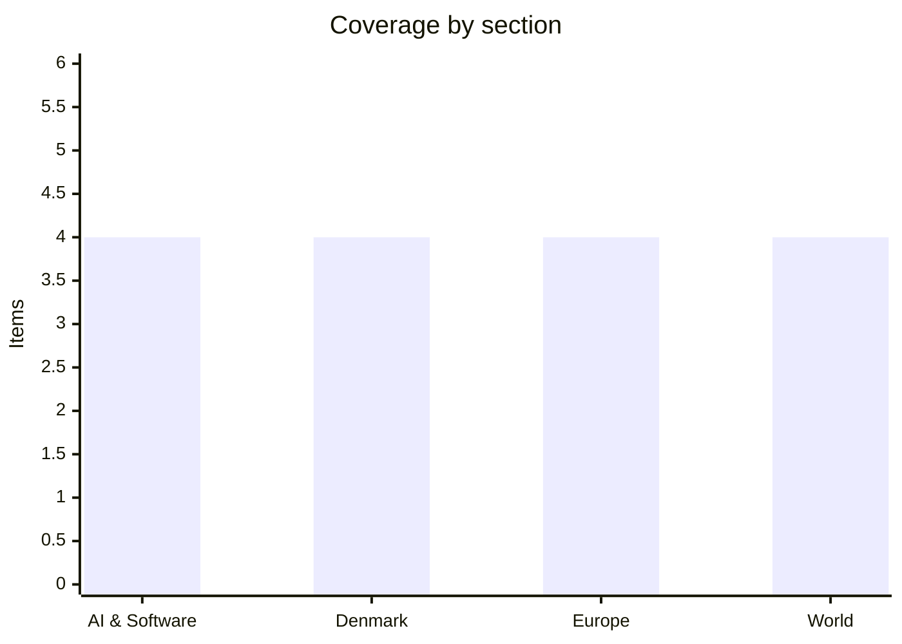

# Daily Briefing — 2026-08-04

**Top line:** The US and Iran spent Monday disputing whether their own peace talks exist — Trump insists negotiations are "going on right now", Tehran denies any direct talks but says a separate Oman channel on managing the Strait of Hormuz is in its "final stages" — while a ship was struck in the strait and oil fell anyway on hopes the war's off-ramp is real.

## Follow-ups

- **Iran talks began in confusion:** Monday produced duelling accounts of whether US-Iran negotiations are even happening; oil fell ~4.6% regardless (full item in World).
- **The Ceuta EU meeting is today:** the extraordinary interior-ministers videoconference convenes this Tuesday under Ireland's presidency (full item in Europe).
- **Gaza's roadmap was effectively rejected:** Israel told the Board of Peace it will not withdraw from its current line, and the Board now says disarmament comes first (full item in World).
- **The frontier-AI framework is still unpublished** three days past its August 1 deadline — no Federal Register notice, no NIST/CISA publication ([Yahoo Finance](https://finance.yahoo.com/technology/ai/articles/white-house-ai-framework-deadline-002011007.html)).
- **Correction:** yesterday's World item on a weak US jobs report, the firing of the BLS chief and "August 7 tariffs" was a resurfaced **August 2025** story that search results presented as current — the actual July 2026 US employment report has not yet been released; it lands this Friday, August 7 ([BLS schedule](https://www.bls.gov/schedule/)). Apologies for the error; the Friday release is on the watch list.
- **Energidrift:** Energinet now says roughly 1,100 electricity customers may have been moved to the company without consent; the four supervisory cases' documentation deadline is tomorrow, August 5 ([Kristeligt Dagblad](https://www.kristeligt-dagblad.dk/danmark/myndigheder-indleder-tilsyn-med-omdiskuteret-koeber-af-elkunder)).
- **The forced Folketing session has a date:** expected August 12 (full item in Denmark).

## AI & Software

**Palantir posts a 93%-growth quarter and raises full-year guidance to 82% growth.** Palantir reported Q2 2026 revenue of $1.94 billion on Monday, up 92.8% year on year and well above the $1.80 billion consensus, driven by US commercial revenue growing 149% to $764 million. GAAP net income was $1.06 billion — a 55% net margin and 225% growth year on year — with adjusted operating margin at 62%, and adjusted EPS of $0.41 beating estimates of $0.35. The company raised full-year revenue guidance to $8.15–8.16 billion, an 82% growth rate, lifted US commercial guidance to at least $3.42 billion (134% growth), and guided Q3 to about $2.16 billion; shares jumped roughly 12% on the print. The numbers matter beyond Palantir because the company has become the clearest public-market proxy for whether enterprises are actually paying for AI software rather than just running pilots — and a 149% US commercial growth rate at this scale says the spending is real and accelerating. The sceptical reading is unchanged: even bulls concede the valuation prices in years of flawless execution, and the growth is concentrated in US government-adjacent and large-enterprise contracts, so any procurement slowdown cuts deep. Palantir's AIP platform is the engine, with management crediting agentic-AI deployments for shortening sales cycles to weeks. For the AI trade broadly, Palantir plus Amazon's milestone (next item) made Monday a strong session: the Dow closed at a record 53,178. Watch whether other enterprise-software names confirm the demand signal when they report through August. [CNBC](https://www.cnbc.com/2026/08/03/palantir-pltr-earnings-q2-2026.html) · [Business Wire / press release](https://www.businesswire.com/news/home/20260802523449/en/Palantir-Reports-Q2-2026-U.S.-Comm-Revenue-Growth-of-149-YY-and-Revenue-Growth-of-93-YY-Raises-FY-2026-Revenue-Guidance-to-82-YY-Growth-and-U.S.-Comm-Revenue-Guidance-to-134-YY-Crushing-Consensus-Expectations) · [Benzinga](https://www.benzinga.com/markets/earnings/26/08/60889943/palantir-posts-otherworldly-q2-double-beat-raises-guidance-across-all-key-metrics)

**Amazon becomes the fifth company in history to cross $3 trillion.** Amazon's market capitalization topped $3 trillion on Monday as the stock rose about 5% to a record near $285, extending a post-earnings surge that has added more than 20% over two sessions, including a roughly 15% jump on Friday. It joins Apple, Microsoft, Nvidia and Alphabet in the club, slightly more than two years after first reaching $2 trillion in June 2024. The catalyst was last week's Q2 report, in which AWS revenue grew 37% year on year to $42.2 billion — a sharp reacceleration that investors read as proof Amazon is converting the AI infrastructure boom into cloud revenue at scale rather than ceding the moment to Microsoft and Google. The two-session move is the market rerating that single fact: AWS growth had hovered in the high teens through 2025, and 37% at a $170 billion annual run rate changes the company's growth story. The milestone also concentrates the index-level stakes — five companies now account for a historically large share of the S&P 500, so the market's fortunes are increasingly the AI trade's fortunes, in both directions. Watch whether AWS's growth holds next quarter and how much of Amazon's announced capex expansion lands in 2026. [CNBC](https://www.cnbc.com/2026/08/03/amazon-amzn-stock-market-cap-earnings.html) · [Yahoo Finance](https://finance.yahoo.com/markets/stocks/articles/amazon-stock-hits-3-trillion-164347585.html)

**INC ransomware is exploiting a patch bypass in N-able's N-central — emergency fix shipped.** The remote-monitoring-and-management platform N-central, used by managed service providers to administer thousands of downstream customer networks, is being actively exploited through CVE-2026-18577 after attackers found a bypass for the original patch; N-able shipped build 2026.3.1.7 on August 2 as the first unaffected version. The Hacker News reports that the INC ransomware operation has emerged as the dominant actor weaponising the flaw, and the group's leak site listed new victims between July 17 and August 1 spanning private-sector and government organisations in Australia, the US and the UAE. The same group has been targeting unpatched SonicWall SMA 1000 appliances for root access and lateral movement, giving it two parallel entry vectors into corporate networks. RMM platforms are among the highest-value targets in the ecosystem because one compromised instance hands an attacker legitimate administrative tooling across every customer the MSP manages — the Kaseya incident of 2021 remains the canonical example. A patch bypass is the nastier variant of the story: organisations that patched promptly on the original advisory believed they were safe and were not. For teams running N-central the action is unambiguous — get to 2026.3.1.7 or later now and review for signs of compromise since mid-July; for everyone else the reminder is that "patched" is a claim about a specific build, not a permanent state. Watch for CISA adding the CVE to its known-exploited catalogue and for victim disclosures working through the pipeline. [The Hacker News](https://thehackernews.com/2026/08/inc-ransomware-emerges-as-dominant.html)

**Ai4, the year's biggest applied-AI conference, opens in Las Vegas with a Hinton–Ng headline debate.** The Ai4 2026 conference opens today at The Venetian in Las Vegas, running August 4–6 after Monday's pre-conference workshops, with opening keynotes from 8:30am Pacific. The headline draw is a rare joint session putting Geoffrey Hinton — who has spent two years warning that advanced AI poses existential risk — opposite Andrew Ng, the field's most prominent sceptic of that framing, alongside Fei-Fei Li, Waymo's Dmitri Dolgov and Sebastian Thrun. The conference has grown into the largest US gathering focused on production AI deployment rather than research, drawing executives from Cisco, PayPal, Mayo Clinic and several thousand enterprise attendees. The Hinton–Ng pairing is the interesting part: the "pacing the frontier" petition signed by 1,200+ AI researchers in late July put the slowdown question squarely into mainstream industry debate, and this is the first big stage where both poles of that argument share a microphone since. Expect quotable friction rather than resolution — but with the White House's frontier-model framework overdue and OpenAI's Astra preview fresh in memory, the audience for the safety-versus-speed argument is no longer academic. Watch for any news made on stage and for enterprise-deployment data points that tend to surface in Ai4 keynotes. [TechTimes](https://www.techtimes.com/articles/322674/20260802/ai4-2026-opens-tuesday-hinton-ng-face-off-ais-existential-stakes.htm) · [Ai4](https://ai4.io/)

## Denmark

**Biogas covered 100% of Denmark's gas consumption in July — a first for any month.** Final figures from Energinet show July's biogas production matched the country's entire gas consumption, the highest share ever recorded for a single month and a milestone DR describes as historic. Production reached 708 GWh in July, up 23% from the same month last year, and the month set four records at once: highest monthly biogas share, highest monthly production, highest single-day share and highest single-day production. Notably, the result was not an artefact of low summer demand — gas consumption actually rose in July, but biogas output grew faster. The milestone caps a steady climb: biogas covered over 40% of Danish gas consumption across 2025, up from roughly a quarter in 2021, as upgraded biogas plants have connected to the grid and fed in methanised gas from agricultural and food waste. Denmark is further along this curve than any comparable European gas market, and the trajectory matters for energy security as much as climate policy — every biogas percentage point displaces imported molecules in a system still shadowed by the post-2022 Russian supply rupture. The caveat is seasonal: July is a low-consumption month, so a 100% annual share remains far off, and the sector's economics still lean on subsidy schemes whose long-term design is contested. Watch whether the summer share holds through August and how the figure lands in the autumn's energy-policy debates. [DR](https://www.dr.dk/nyheder/indland/historisk-resultat-biogasproduktion-matcher-vores-gasforbrug) · [Maskinbladet](https://www.maskinbladet.dk/artikel/92437-biogas-dakkede-hele-landets-forbrug-i-juli) · [Effektivt Landbrug](https://effektivtlandbrug.landbrugnet.dk/artikler/energi/123946/biogasproduktionen-i-juli-svarede-til-100-procent-af-danmarks-gasforbrug)

**The forced Folketing session lands August 12 — with the government voting present but unmoved.** The extraordinary parliamentary debate on the Ceuta crossings that the blue bloc compelled with exactly 72 mandates is expected to take place Wednesday, August 12 at 10:00, according to initiator Morten Messerschmidt. The Social Democrats have confirmed they will not support the session's premise, arguing the migrant surge is being handled where it can actually be influenced — at EU level, where today's interior-ministers videoconference convenes (see Europe) — rather than through a domestic debate aimed at suspending Spain from Schengen. That sets up the dynamic for the day: Dansk Folkeparti, Venstre, Danmarksdemokraterne, De Konservative and Liberal Alliance forcing the government to defend its line in the chamber, with no realistic path to the Schengen-suspension outcome Messerschmidt wants, since no Danish government can deliver it unilaterally. The session is therefore best read as the opening set-piece of the autumn political season — a chance for the opposition to fix immigration as the frame before the 2027 finance bill lands at the end of August, and the first parliamentary stress test of the S-SF-M-R coalition on the issue where its internal seams are most visible. For the government, the risk is less the debate than any daylight between coalition partners' rhetoric under pressure. Watch the formal confirmation of the date from Speaker Søren Gade, the government's line on Spain going in, and whether the blue parties emerge with a coordinated immigration platform. [DR](https://www.dr.dk/nyheder/politik/efter-migrantstroemme-folketingets-partier-skal-indkaldes-til-hastemoede) · [Kristeligt Dagblad](https://www.kristeligt-dagblad.dk/danmark/s-stoetter-ikke-hastemoede-i-folketinget-om-migrantstroemme) · [SE og HØR / TV 2 on the date](https://www.seoghoer.dk/nyheder/hastemoede-i-folketinget-har-noedvendig-opbakning-efter-la-stoette)

**Denmark's early harvest shows the drought hit very unevenly — first estimate is an average year.** The grain harvest is under way earlier than normal for the second consecutive year, and the first loads across the scale reveal a starkly uneven picture: fields on irrigated or heavier soil are delivering good yields, while the driest parcels — often harvested first — are coming in well under normal. The early consensus from grain traders and advisors is a roughly average national harvest, a better outcome than feared in June, when Denmark logged its sixth-warmest June since national records began in 1874 amid long dry spells. The unevenness follows the summer's rainfall, which fell in scattered heavy bursts rather than evenly, so outcomes diverge sharply between neighbouring parishes and even fields. The wider European backdrop is less benign: drought has cost the continent an estimated nine million tonnes of grain this season, and the June–July heat has trimmed harvest expectations in France and Germany, which sets the price environment Danish growers will sell into. An average Danish volume in a short European year is a reasonable commercial position, though quality parameters — protein content and kernel weight from heat-stressed fields — are still unknown until more of the crop is in. For the agricultural economy the harvest lands on top of the sector's running debates about drought adaptation and irrigation permits, which each dry summer sharpens. Watch the volume and quality estimates firm up over the next fortnight, and whether the European shortfall moves feed and bread-grain prices. [LandbrugsAvisen](https://landbrugsavisen.dk/foreloebigt-peger-hoesten-til-at-blive-gennemsnitlig-315147) · [Effektivt Landbrug](https://effektivtlandbrug.landbrugnet.dk/artikler/planter/123853/tre-ugers-dejlig-travlhed-venter) · [Effektivt Landbrug / Europe](https://effektivtlandbrug.landbrugnet.dk/artikler/afgroeder/123802/toerke-har-kostet-europa-ni-millioner-ton-korn)

**Greenland's new airport is about to multiply whale-safari traffic in Disko Bay — with no binding rules to govern it.** DR reports from Ilulissat that the town's new international airport is expected to sharply increase tourist arrivals and, with them, whale-safari sailings in Disko Bay, where humpbacks gather each summer to feed on krill and schooling fish before migrating to breeding grounds. Local operators and a whale researcher warn the pressure on a relatively small number of animals is already visible: Greenland has no laws or binding rules for whale watching, only voluntary guidelines on approach distance and speed, and Ilulissat Whale Tours' captain Claus Foss says some operators sail too close and too fast. The concern is not hypothetical — repeated close approaches disrupt the feeding that builds the fat reserves humpbacks need to survive migration, so the harm accumulates invisibly before it shows. The story is a small instance of the big Greenland question: the new airports at Nuuk and Ilulissat are the centrepiece of a deliberate strategy to grow tourism into an economic pillar alongside fishing, and the regulatory scaffolding is being built after the demand arrives, not before. Whale tourism is among Ilulissat's biggest draws, so the industry has its own incentive to avoid degrading the resource — but voluntary codes have a poor record against competitive pressure in every comparable destination. Watch whether Naalakkersuisut moves binding whale-watching rules up its agenda ahead of next season. [DR](https://www.dr.dk/nyheder/indland/groenland/ny-international-lufthavn-kan-sende-flere-paa-hvalsafari-i-diskobugten-lokale-frygter-oeget-pres)

## Europe

**EU interior ministers meet today on Ceuta — with Italy's border controls against Spain the unavoidable question.** The extraordinary Justice and Home Affairs videoconference convenes this Tuesday under Ireland's presidency, chaired by justice minister Jim O'Callaghan, after the 22-leader letter initiated by Italy and Denmark demanded an urgent response to the roughly 60,000 people who crossed into Ceuta from Morocco in 72 hours — an influx equal to about 70% of the enclave's population, in which at least 57–67 people died. The agenda is formally a "common assessment", external-border funding and pressure on Morocco, but the political substance is the rupture between member states: Italy has reintroduced border controls on air and sea arrivals from Spain for 30 days, and Madrid — which says practically all crossers have been returned under an urgent arrangement with Rabat — has denounced the "selfish" response and demanded the Commission say plainly whether Rome's move is compatible with Schengen. EU-news coverage ahead of the meeting frames it as the deepest interior-policy rift among member states in years, with the 2024 Migration Pact's solidarity mechanism being contradicted in real time. The realistic outcome today is conclusions language plus money and a Morocco track, not a verdict on Italy — the Commission has every incentive to avoid ruling formally against either capital. But ministers' remarks going in and out will show whether the returns arrangement has actually stabilised the situation or merely paused it. Denmark's domestic echo lands August 12 (see Denmark). Watch the conclusions text, any Commission statement on Italy's controls, and whether Morocco's cooperation is named, praised or bought. [EUnews](https://www.eunews.it/en/2026/08/03/ceuta-divides-the-eu-on-tuesday-face-to-face-meeting-of-interior-ministers/) · [Euronews](https://www.euronews.com/my-europe/2026/08/01/22-eu-leaders-call-for-emergency-talks-over-ceuta-migrant-crisis) · [Al Jazeera](https://www.aljazeera.com/news/2026/8/2/why-has-the-eu-called-an-emergency-meeting-on-spain-migrants-surge)

**Wildfires jump containment lines in Greece and France as the record summer grinds on.** Europe's hot, dry summer tightened its grip at the weekend and into Monday: water-dropping aircraft worked a major wildfire west of Athens that jumped containment lines a day after a midair collision between two firefighting helicopters killed two crew members, while crews in Provence fought to stabilise a large blaze and much of the map from Portugal to the Western Balkans sat under extreme fire-danger warnings. France and Spain have borne the brunt of one of the worst European fire seasons in years, with repeated heatwaves, drought and strong winds driving large, fast-moving fires that have burned thousands of hectares since early July and degraded air quality across affected regions. The pattern connects directly to the drought stories running in parallel — the Rhine at a record low (covered yesterday), England's driest July in nearly two centuries (next item) — as expressions of the same stalled high-pressure regime that has parked heat over the continent for weeks. Authorities warn the extreme fire danger runs through August, which is historically the peak month. Beyond the immediate emergencies, the season is feeding the EU-level argument about scaling rescEU's firefighting fleet and about whether Mediterranean forestry and land-use practice can adapt as fast as the fire climate is shifting. The helicopter collision also underlines how much of Europe's aerial firefighting remains a dangerous, ageing-airframe operation. Watch the Athens-area fire's containment, France's next heat peak, and any new EU civil-protection deployments. [France 24](https://www.france24.com/en/europe/20260803-europe-s-record-breaking-heat-sparks-wildfires-drought-in-france-greece-and-the-uk) · [Al Jazeera](https://www.aljazeera.com/features/2026/8/3/new-summers-how-heatwaves-and-wildfires-change-life-across) · [Euronews](https://www.euronews.com/my-europe/2026/07/28/europe-is-burning-how-bad-could-this-wildfire-crisis-get)

**England and Wales log the driest July since 1836 — 29 million people now under hosepipe bans.** July closed as the driest on record for England and Wales in nearly two centuries of measurement: south-east and central-southern England averaged just 5.0mm of rain — around 5–7% of the long-term norm — East Anglia 5.4mm, both the lowest since Met Office records began in 1836, and the Thames at Reading has recorded its lowest level ever measured. All of Wales and more than half of England are now officially in drought, and with Thames Water, Welsh Water, Southern Water, South East Water, South West Water and Yorkshire Water all imposing restrictions, more than 29 million customers are under hosepipe bans — the widest such restriction in modern UK history, with South East Water's Kent and Sussex ban taking effect from August 12. The immediate economics run through agriculture (irrigation bans hitting vegetable yields), utilities (leakage rates now politically radioactive at Thames Water, which is simultaneously in a financial restructuring), and water-quality pressure as low flows concentrate pollution. The structural story is starker: southern England's water system was engineered for a rainfall pattern that is visibly shifting, no major reservoir has been completed in England since 1992, and the planned new reservoirs are a decade away at best. A wet autumn can rescue this year; it cannot rescue the trend. The UK angle also completes the continental picture — the same blocking pattern behind the Rhine's record low and the Mediterranean fires. Watch reservoir and river levels through August, any move to tighter restrictions, and whether the government accelerates water-infrastructure approvals. (Rainfall figures as relayed by international coverage of Met Office data.) [France 24](https://www.france24.com/en/europe/20260803-europe-s-record-breaking-heat-sparks-wildfires-drought-in-france-greece-and-the-uk) · [Yahoo News / PA](https://news.yahoo.com/hosepipe-ban-area-111433076.html)

**Ukraine's drone campaign hits record scale: Russia claims 635 drones downed in one night as Kyiv burns down Wildberries' logistics network.** Russia's defence ministry said it intercepted 635 Ukrainian drones overnight into Monday — the largest single-night figure either side has claimed in the war — as Ukraine's deep-strike campaign moved from oil refineries to the logistics backbone of Russia's consumer economy. Drones set a Wildberries warehouse ablaze in Vladimir region on Monday morning, the latest in a two-week campaign that has struck more than a dozen of the e-commerce giant's depots, alongside reported strikes on a university facility linked to drone development; Russian governors said Ukrainian strikes killed at least eight people across several regions at the weekend. The Wildberries targeting is a deliberate escalation of theory as much as geography: Kyiv is extending its campaign beyond fuel and military-industrial targets to infrastructure whose disruption ordinary Russians feel directly, betting that visible economic pain erodes the Kremlin's ability to keep the war abstract at home. It comes on top of the refinery campaign covered yesterday — Saratov, Engels, Ryazan, Perm — which Kyiv says targets roughly 220 million barrels of annual refining capacity. Russia's counterstrikes killed at least seven across Ukraine into Monday, and the interceptor shortage Zelensky described last week remains the binding constraint on Ukrainian air defence. The diplomatic wildcard is unchanged: a possible Trump–Putin meeting around mid-August, which Kyiv fears could trade away leverage precisely as its economic-pressure campaign compounds. Watch Russian fuel and retail-logistics disruption data, whether the 635-drone scale becomes the new normal, and any firming of the summit. [The Moscow Times](https://www.themoscowtimes.com/2026/08/02/ukrainian-drones-kill-8-in-russia-and-strike-wildberries-warehouse-a93396) · [Kyiv Independent](https://kyivindependent.com/ukraine-reportedly-strikes-wildberries-warehouse-in-russias-vladimir-oblast/) · [US News / Reuters](https://www.usnews.com/news/world/articles/2026-08-02/ukrainian-drones-kill-two-in-russia-strike-wildberries-warehouse-governors-say)

## World

**Trump says Iran talks are happening; Iran says they aren't — while Oman quietly finalises a Hormuz transit arrangement.** Monday's promised US-Iran negotiations dissolved into duelling realities: Trump told reporters talks were "going on right now" at the request of Iran, Saudi Arabia, the UAE and Qatar, calling it Tehran's "last chance", while Iran's foreign ministry flatly denied any direct negotiations with Washington. What Tehran did confirm is a separate channel with Oman on "management" of the Strait of Hormuz, which Foreign Minister Abbas Araghchi said is "on the way to being finalised" — describing a new transit route with separate entry and exit lanes, while insisting the arrangement "has nothing to do with whether the Strait of Hormuz is reopened or remains closed". The gap matters: Washington reads the June memorandum as requiring Iran to open the waterway, Tehran says the text preserved its authority over shipping, and the two positions are now being tested against each other in public. The day also delivered a reminder of how fragile the pause is — a ship was struck in the strait on Monday, with attribution unclear — yet oil fell anyway, Brent dropping about 4.6% to just over $83, as markets chose to price the Oman channel as the real story and the rhetoric as noise. That read is plausible: a technically-managed transit corridor under Omani auspices would let both sides claim their version — Iran retaining nominal authority, Washington getting ships moving — without either signing the other's interpretation. The equally plausible dark read is that Trump's "last chance" framing rebuilds the justification for the strike he paused on Saturday. Watch whether the Oman arrangement is announced in concrete terms, whether escorted or scheduled transits actually resume, and the shipping-insurance market's verdict. [US News / Reuters](https://www.usnews.com/news/world/articles/2026-08-03/status-of-us-iran-talks-uncertain-as-ship-struck-in-hormuz) · [CNBC](https://www.cnbc.com/2026/08/03/trump-iran-us-negotiations-peace-proposals-.html) · [Bloomberg](https://www.bloomberg.com/news/articles/2026-08-03/iran-says-hormuz-talks-underway-after-trump-calls-off-strikes)

**Israel formally rebuffs the Gaza roadmap: no withdrawal from the current line, no halt to strikes.** The Board of Peace's 15-point disarmament roadmap absorbed its worst day yet on Monday. Board envoy Nickolay Mladenov met Netanyahu in Jerusalem and, according to two people familiar with the meeting, pressed him to halt strikes in Gaza — and was rebuffed: a senior Israeli diplomatic source said afterwards that Israel will not withdraw from its current line and will keep acting against threats, directly contradicting the roadmap's phased-withdrawal architecture. The Board's own position then shifted visibly: by Tuesday it was stating publicly that there will be no Israeli withdrawal before Hamas disarms — a sequencing concession to Jerusalem that inverts how Hamas read the deal, since the movement has said it will only hand weapons over for storage after Israeli operations stop and a withdrawal begins. Domestic pressure on Netanyahu is pushing the same direction: finance minister Bezalel Smotrich and minister Orit Strock sent an urgent letter demanding the security cabinet convene to formally block implementation and halt the entry of multinational stabilisation forces, warning the roadmap "paves the way for a Palestinian state". The mechanism's own clock underlines the drift — the roadmap requires a detailed disarmament timetable within 14 days of approval by both sides, and there is still no approval, no named verification body, and no started clock. The charitable reading is that this is position-hardening before an eventual signature under US pressure; the darker one is that both sides have concluded the plan's collapse is survivable if the other absorbs the blame. Watch whether the security cabinet formally takes up the Smotrich demand, any Board statement reconciling its sequencing with Hamas's, and whether Washington escalates from envoys to the president. [Irish Times](https://www.irishtimes.com/world/middle-east/2026/08/03/israel-rejects-trumps-gaza-roadmap-and-refuses-to-suspend-strikes/) · [Washington Times](https://www.washingtontimes.com/news/2026/aug/3/benjamin-netanyahu-board-peace-envoy-meet-gaza-disarmament-deal-urges/) · [Al Jazeera](https://www.aljazeera.com/news/2026/8/4/board-of-peace-says-no-israeli-withdrawal-from-gaza-before-hamas-disarms) · [Ynet](https://www.ynetnews.com/article/ryhi57rsfg)

**An Indonesian ferry fire kills at least five, with 28 still missing off Madura.** The Mutiara Sentosa 2, sailing from Surabaya to Makassar with 271 people aboard — 232 passengers and 39 crew — caught fire between 6 and 7am Sunday in waters off Sumenep, near the northern tip of Madura Island, sending panicked passengers leaping into the sea as flames spread. At least five people are confirmed dead; rescue figures have improved as survivors were pulled from the water and nearby vessels, with 238 rescued and 28 still missing as of Monday's update from search-and-rescue authorities, who continue operations alongside navy and coast-guard ships. The operator, PT Atosim Lampung Pelayaran, reportedly notified the Surabaya search-and-rescue office about an hour after the captain first reported the blaze — a delay investigators will examine, since the first hour determines survival odds in an evacuation at sea. Ferry disasters are a grimly recurring feature of Indonesian transport: the archipelago's 17,000 islands make ferries essential infrastructure, and enforcement of safety standards — manifest accuracy, fire suppression, crew training — has repeatedly failed under commercial pressure despite reform promises after each major sinking. Early reporting has not established the fire's cause; vehicle decks with fuel-laden trucks are the historical culprit on this class of vessel. The passenger manifest also matters: initial counts in Indonesian ferry incidents are frequently revised upward as unlisted passengers are reported by families. Watch the final casualty figure as the search winds down, the manifest reconciliation, and the transport-safety investigation's early findings. [Al Jazeera](https://www.aljazeera.com/news/2026/8/2/at-least-five-dead-41-missing-after-ferry-catches-fire-off-indonesia) · [NPR](https://www.npr.org/2026/08/03/g-s1-136858/blaze-indonesian-passenger-ferry) · [StratNews Global](https://stratnewsglobal.com/asia/indonesia-asia/28-still-missing-after-ferry-catches-fire-off-indonesias-madura-island/)

**Sudan's war escalates on two axes: an army drone strike kills 35 at a Darfur court as Hemedti orders his fighters "unleashed" on Khartoum.** A Sudanese army drone strike hit a civil court in the RSF-held village of Garra al Zawaya in North Darfur at around 1pm Sunday, killing at least 35 people — some counts say 37 — who had gathered for hearings on local disputes, according to the Emergency Lawyers rights group, which called it a massacre of civilians engaged in the most ordinary of civic acts. The strike lands amid a broader lurch in the war: after losing control of a key highway linking Khartoum and El-Obeid, RSF commander Mohamed Hamdan Dagalo — Hemedti, sentenced to death in absentia last month by a Port Sudan court for genocide and war crimes in el-Geneina — released a video telling his fighters to consider themselves "unleashed" against the army, as RSF assaults spread across Kordofan and Darfur. El-Obeid, Kordofan's largest city, is under intensifying drone attack and a re-imposed RSF blockade with an estimated 500,000 people trapped, prompting a UN "red alert" over a feared ground offensive. The pattern is the war's signature dynamic in miniature: both sides now field long-range drones liberally against targets in the other's zone of control, and civilians in contested regions absorb the consequences of each escalation. Sudan's war — now in its fourth year — remains the world's largest displacement crisis, with famine conditions documented in multiple regions and a humanitarian response funded at a fraction of need, competing for attention it rarely wins. No credible peace track currently exists; the Jeddah process is moribund and both sides believe they can still improve their position militarily. Watch the El-Obeid siege, whether the "unleashed" order translates into a Khartoum offensive, and any international response beyond condemnation. [France 24](https://www.france24.com/en/africa/20260803-sudan-darfur-drone-army-kill) · [Middle East Eye](https://www.middleeasteye.net/news/drone-strike-north-darfur-court-kills-least-35-rights-group-says)

## Watch list

- **Wednesday:** Novo Nordisk H1 results — the first numbers since the ZEUS trial failure — and Maersk's interim report with the first hard Hormuz-war figures; also Forsyningstilsynet's August 5 documentation deadline for Energidrift and three other electricity companies.
- **Today/Wednesday:** conclusions from the EU interior-ministers videoconference on Ceuta — especially any Commission language on Italy's border controls against Spain.
- **Friday:** the July 2026 US employment report (8:30am ET) — the real one, after yesterday's correction; watch the revisions and market reaction.
- **Mid-August:** the possible Trump–Putin summit, the expected August 12 Folketing session, and whether the Oman-brokered Hormuz transit arrangement is announced in concrete, verifiable terms.
