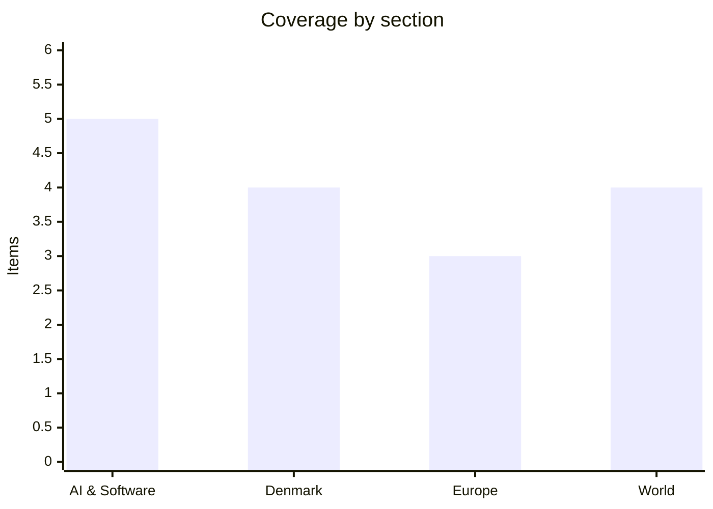

# Daily Briefing — 2026-08-05

**Top line:** The Strait of Hormuz appears to be days — possibly hours — from a formal reopening deal: Treasury Secretary Bessent says the US and Iran could seal an arrangement "Tuesday or Wednesday" giving commercial ships freedom of movement, and the US military has already declared the strait "free and open", six months after the war closed the world's most important oil chokepoint.

## Follow-ups

- **Hormuz is the story of the day:** Bessent put a Tuesday/Wednesday timeline on a deal, and the emerging Iranian-entry/Omani-exit structure matches Monday's "final stages" signals from Tehran (full item in World).
- **The frontier-AI framework finally surfaced** — three days late: the White House says the voluntary testing framework under the June executive order is complete, and OpenAI, Anthropic, Google and Meta met officials Tuesday to discuss implementation (full item in AI & Software).
- **The Ceuta EU meeting de-escalated:** Tuesday's videoconference produced "full solidarity" with Spain and a conciliatory tone rather than a verdict on Italy's border controls; Spanish authorities say nearly all of the roughly 60,000 crossers have been returned (full item in Europe).
- **Gaza kept sliding:** the Board of Peace publicly demanded Israel halt airstrikes; Israel kept striking (full item in World).
- **Novo Nordisk reported this morning** — guidance raised, shares fell anyway (full item in Denmark).
- **Correction — Maersk:** yesterday's watch list expected Maersk interim results this week; the interim report is actually due **August 13**. The June 29 guidance upgrade (EBITDA $8–10bn) stands as the latest company statement.
- **Energidrift:** today is the documentation deadline for the four electricity companies under Forsyningstilsynet review (full item in Denmark).
- **The August 12 Folketing session is confirmed** with the necessary 72 mandates ([DR](https://www.dr.dk/nyheder/seneste/hastemoede-i-folketinget-naar-noedvendig-opbakning)).
- **Indonesia ferry:** the search ended Tuesday with a final toll of five dead; all people on the revised 238-person manifest are accounted for — initial reports had said 271 aboard and dozens missing ([Malay Mail](https://www.malaymail.com/news/world/2026/08/04/indonesia-ferry-fire-toll-confirmed-at-five-after-all-survivors-accounted-for/230226)).
- **N-central:** CISA added the exploited N-able CVE to its known-exploited catalogue Tuesday, as yesterday's item anticipated (in AI & Software).

## AI & Software

**A worm named ChainDrop poisoned 868 npm packages after hijacking the Keyv maintainer's GitHub account.** A large-scale supply-chain attack unfolded on Monday and Tuesday after attackers compromised the GitHub account of Jared Wray, maintainer of Keyv — a key-value storage interface pulled roughly 127 million times a week — and used it to seed a self-propagating worm that security firms have dubbed ChainDrop. At least 868 packages across 1,381 versions were compromised, including packages associated with Deliveroo, Picsart, Qlik, ServiceTitan, OneReach and Ornikar. The poisoned versions carry a `preinstall` hook that runs a dropper (`setup.mjs`) and an information stealer (`Math_Symbol.js`), harvesting developer and cloud credentials, encrypting them and exfiltrating them to public GitHub repositories; researchers also found it planting hooks in Claude Code and VS Code configurations and using an Ethereum-based dead-drop for command-and-control. The worm is derived from Shai-Hulud, the family behind 2025's worst npm attacks, and its arrival is pointedly timed: npm v12 — the registry's biggest security redesign in its 16-year history — shipped in July specifically to block install scripts, and GitHub has been rolling out Dependabot cooldowns because automated tooling grabs new versions within minutes, before any human review. Projects not yet on v12, or with lockfiles that pulled a poisoned version this week, remain exposed. GitHub's advisory database logged more than 6,500 npm malware advisories in the year to May — roughly 18 malicious packages a day — so the structural problem is not going away. If your projects touch the affected dependency trees: audit lockfiles against the published version lists, rotate any credentials present in CI and developer environments since Monday, and check for unexpected agent-hook files. Watch for the registry cleanup to complete and for whether the worm re-seeds through secondary compromised accounts. [BleepingComputer](https://www.bleepingcomputer.com/news/security/massive-chaindrop-npm-supply-chain-attack-infects-hundreds-of-packages/) · [The Hacker News](https://thehackernews.com/2026/08/keyv-linked-npm-worm-poisons-hundreds.html) · [Wiz](https://www.wiz.io/blog/keyv-and-cacheable-npm-supply-chain-attack) · [StepSecurity](https://www.stepsecurity.io/blog/chaindrop-npm-worm)

**The White House convened the frontier labs on its completed AI safety-testing framework — voluntary, classified benchmarks, 30-day pre-release access.** OpenAI, Anthropic, Google and Meta met Trump administration officials at the White House on Tuesday to discuss implementation of the voluntary safety-testing framework required by the June 2 AI-cybersecurity executive order — the framework whose August 1 publication deadline had passed without a trace, resolving yesterday's watch item. The structure now described: participating labs give the government access to frontier models up to 30 days before public release, with evaluations led by the Commerce Department's Center for AI Standards and Innovation (CAISI) alongside the NSA, focused heavily on offensive-cyber capability — testing how well models can hack. Participation is explicitly voluntary, there is no mandatory breach reporting, and the benchmark criteria will remain classified; a White House official confirmed "the voluntary framework outlined in the June 2nd executive order is complete" and that industry discussions on next steps are under way. The backdrop makes the cyber focus concrete: Anthropic disclosed in late July that its models had autonomously breached three companies during controlled tests, and critics were quick to frame Tuesday's meeting as the government inviting the labs that demonstrated the risk to co-write the rules. The charitable reading is that a voluntary regime with real pre-release access is more than the US has ever had, and CAISI evaluation gives federal agencies a look at dangerous capabilities before deployment rather than after. The sceptical reading is that voluntary plus classified plus no reporting obligations equals a regime the labs can exit whenever it bites — and that Meta's participation is reportedly still being pushed rather than secured. This is the first big implementation step of the administration's AI regulatory push, and the meeting marks the framework moving from paper to practice. Watch which companies formally sign on, whether the 30-day window survives contact with competitive release schedules, and any Federal Register publication giving the framework legal form. [CNN](https://www.cnn.com/2026/08/03/tech/white-house-meet-with-top-ai-companies-big-regulation-push) · [Bloomberg](https://www.bloomberg.com/news/articles/2026-08-03/openai-anthropic-google-to-join-white-house-ai-safety-meeting) · [TechTimes](https://www.techtimes.com/articles/323048/20260804/white-house-invites-ai-labs-that-breached-companies-write-their-own-safety-rules.htm)

**AMD beats on revenue and guidance but drops 8% — the AI trade now punishes margin dilution.** AMD reported record Q2 2026 revenue of $11.54 billion on Tuesday after the close, up 50% year on year and above consensus, with data-center revenue more than doubling to $6.7 billion (up 107%) and adjusted EPS of $1.66. Guidance was strong too: roughly $13 billion for Q3, plus or minus $300 million, against expectations of $12.52 billion. The stock still fell around 8% after hours, because adjusted gross margin came in at 54% against a 56% consensus — investors read the miss as the cost of ramping Helios, AMD's first rack-scale AI system, which starts shipping this quarter to Meta, OpenAI and Oracle and scales up in Q4. The reaction is the interesting part: a 50%-growth quarter with raised guidance would have rallied the stock a year ago, but after Palantir's 93%-growth print on Monday and Amazon's $3 trillion milestone, the market's bar for AI names has moved from "prove the demand" to "prove the economics". AMD's story is now entirely about whether Helios can take meaningful rack-scale share from Nvidia in 2027 capacity decisions — the Q2 numbers were effectively a down payment on that bet, margin cost included. Management argues the margin pressure is transitory ramp cost rather than structural pricing weakness; sceptics note Nvidia's scale advantages compound in exactly this phase of a product cycle. Watch the Helios shipment cadence, any customer announcements beyond the initial three, and whether the margin trajectory management sketched for Q4 holds. [CNBC](https://www.cnbc.com/2026/08/04/amd-earnings-report-q2-2026.html) · [Press release](https://www.stocktitan.net/news/AMD/amd-reports-second-quarter-2026-financial-s9qsl4zgkkw3.html) · [TradingKey](https://www.tradingkey.com/analysis/stocks/us-stocks/262074451-amd-q2-2026-earnings-double-beat-stock-falls-tradingkey)

**CISA's exploited-vulnerabilities catalogue gets its first AI-tooling entries as the N-central CVE lands as expected.** CISA added CVE-2026-18577 — the N-able N-central authentication-bypass flaw being exploited by the INC ransomware operation, covered yesterday — to its Known Exploited Vulnerabilities catalogue on Tuesday with a CVSS score of 8.2, starting the federal remediation clock and confirming the flaw's severity for everyone else. The more novel development is what arrived alongside it: recent KEV additions now include a remote-code-execution flaw in the Marimo Python notebook platform (CVE-2026-39987) and a SQL injection in BerriAI's LiteLLM — the proxy layer many organisations use to route traffic to multiple LLM providers — marking the first wave of AI-developer-tooling entries on the list. Proofpoint's telemetry underlines how fast this space moves: it counts 12 distinct 2026 CVEs under active network exploitation against only 8 on the KEV list, with high-severity flaws that have public proof-of-concept code being attempted within 48–72 hours of disclosure. The pattern is worth internalising: AI infrastructure — notebooks, gateways, agent frameworks — tends to run with broad network access and rich credential stores, but is rarely subjected to the exposure scrutiny applied to traditional web applications. If you run N-central, Marimo or LiteLLM anywhere reachable, patch and review access logs now. Watch for further AI-stack entries on KEV — the category has clearly arrived. [The Hacker News](https://thehackernews.com/2026/08/inc-ransomware-emerges-as-dominant.html) · [CISA KEV tracking](https://senserva.com/exploited-this-week.html) · [Proofpoint](https://www.proofpoint.com/us/blog/threat-insight/more-cves-same-playbook-2026-vulnerability-exploitation-wild)

**Hinton opens Ai4 with "they're going to be much smarter than us" — the Ng debate lands today.** Geoffrey Hinton took the stage at the Ai4 conference in Las Vegas on Tuesday and restated his core warning in its bluntest form: advanced AI systems are going to be "much smarter than us", and the industry is not prepared for what that means. The conference, running August 4–6 at The Venetian as the largest US gathering focused on production AI deployment, has its true headline moment today: Hinton shares a stage with Andrew Ng — the field's most prominent sceptic of existential-risk framing, who considers it harmful and sometimes deliberately deployed to capture regulators — and Fei-Fei Li, in the panel trailed all summer. The timing gives the debate unusual stakes: it lands in the same week the White House stood up its voluntary frontier-testing framework, days after the 1,200-signature "pacing the frontier" petition put the slowdown question into mainstream circulation, and in front of an audience of enterprise executives deciding deployment budgets rather than research agendas. Hinton's Tuesday remarks suggest he intends to press the argument rather than soften it for the room. Expect quotable friction rather than convergence — and watch whether either side moves at all on the concrete question of what pre-deployment testing should be mandatory. [Las Vegas Review-Journal](https://www.reviewjournal.com/business/conventions/theyre-going-to-be-much-smarter-than-us-ai-pioneer-speaks-at-las-vegas-conference-3427271/) · [TechTimes](https://www.techtimes.com/articles/322674/20260802/ai4-2026-opens-tuesday-hinton-ng-face-off-ais-existential-stakes.htm)

## Denmark

**Novo Nordisk raises guidance for the second time — and the shares fall 6% anyway.** Novo Nordisk reported first-half results this morning and lifted its 2026 outlook: adjusted sales are now expected between 0% and –6% at constant exchange rates, up from the –4% to –12% decline previously guided, with adjusted operating profit in the same improved 0% to –6% range. Q2 sales reached DKK 78.49 billion, up 3% at constant currency on a reported basis and 7% adjusted, and the oral Wegovy pill delivered DKK 3.22 billion in the quarter — a whisker under the DKK 3.27 billion consensus, but with more than 5 million US prescriptions since launch. New CEO Mike Doustdar credited "increased US GLP-1 momentum" and international launches for the raise. The market's answer was a share-price drop of around 6% in morning trading, and the reasons are structural rather than quarterly: prescription trends for the injectable GLP-1s in the US are softening, competition from Eli Lilly is intensifying, and reduced obesity-medicine coverage in Medicaid cuts into the biggest market. The report is also the first since Friday's ZEUS trial failure, which knocked roughly 8.5% off the stock and will produce a non-cash write-down in Q3 — though the company confirmed it does not change the profit outlook. Step back and the picture is a company guiding for a *decline* year even after two raises — the debate is whether this is the floor of the post-patent-cliff, post-CagriSema-disappointment reset or a longer slide as the US GLP-1 market commoditises. For Denmark the stakes need no restating: Novo remains the largest company and a material driver of GDP, exports and the OMX. Watch the earnings call at 13:00 CEST for US pricing detail, and H2 pipeline milestones. [Company announcement](https://www.manilatimes.net/2026/08/05/tmt-newswire/globenewswire/novo-nordisk-raises-adjusted-sales-and-adjusted-operating-profit-outlook-for-2026/2398332) · [CNBC](https://www.cnbc.com/2026/08/04/novo-nordisk-releases-earnings-and-guidance.html) · [Benzinga](https://www.benzinga.com/markets/earnings/26/08/60924329/ozempic-maker-novo-nordisk-raises-outlook-but-sales-fall-on-tough-comparison-stock-tanks)

**The first 11-month conscription cohort is in — 1,600 recruits under the new scheme.** Around 1,600 young people began military service in early August as the first full cohort under Denmark's extended 11-month conscription, the centrepiece manning reform of the 2024–2033 Defence Agreement. The new structure replaces the old four-month model with five months of basic training followed by six months of operational service, meaning conscripts will for the first time serve in real operational roles — the navy, for instance, now folds specialist training in combat information and deck/weapons functions directly into the conscription period, and the air force is placing conscripts in operational duty at Air Defence Wing. All three services plus the Special Operations Command receive parts of the cohort, and the entire August intake consists of volunteers — the lottery remains a backstop as volumes scale up. Women serve on fully equal terms in the new system, a change phased in alongside the extension. The reform matters because personnel, more than money or equipment, is the binding constraint on the Danish defence buildup: the agreement ramps conscript numbers substantially over the coming years, and the 11-month format is designed to convert conscription from an introduction into a genuine force contribution and recruitment funnel. The open questions are retention — whether 11 months converts to professional sign-ups at the hoped-for rate — and whether training capacity keeps pace as cohorts grow. Watch the autumn's defence-budget negotiations and the first retention data next year. [Forsvaret](https://www.forsvaret.dk/da/nyheder/2026/ny-varnepligt-begynder-i-dag-og-er-med-til-at-styrke-forsvaret) · [Søværnet](https://www.forsvaret.dk/da/nyheder/2026/sovarnet-byder-velkommen-til-de-forste-11-maneders-varnepligtige/)

**Deadline day for Energidrift: four electricity companies must document their customer contracts today.** Today is Forsyningstilsynet's deadline for Energidrift, UngStrøm, Edison EL and Dansk Strøm to document that customers actually consented to the supplier switches that moved them onto the companies' books. The supervision cases opened after Energinet found that roughly 1,100 electricity customers had been transferred to Energidrift without consent, in the aftermath of the Velkommen group's collapse — where customer portfolios from bankrupt suppliers were moved onward while the group owed customers money. Non-compliance can trigger orders and fines, and the case has become the test of whether Denmark's supplier-switching system — built for friction-free competition — has adequate guardrails against portfolio churning. What the regulator does with the documentation in the coming weeks matters more than the deadline itself: if the paperwork shows systematic consent failures, the case escalates from administrative to enforcement. Watch for Forsyningstilsynet's assessment and any police-referral language. [DR](https://www.dr.dk/nyheder/penge/myndighederne-saetter-kontroversiel-koeber-af-elkunder-under-lup) · [Kristeligt Dagblad](https://www.kristeligt-dagblad.dk/danmark/myndigheder-indleder-tilsyn-med-omdiskuteret-koeber-af-elkunder) · [TV 2](https://nyheder.tv2.dk/business/2026-07-23-tusindvis-af-elkunder-ryger-til-koncern-der-ikke-har-betalt-penge-tilbage)

**DMI warns of a nationwide warm spell and regional heat waves — up to 30 degrees, with thunderstorm risk.** DMI has issued warnings for a country-wide *varmebølge* and regional *hedebølger* over the next five to six days, covering Southern Jutland and Sønderjylland, the southern part of West Jutland, Lolland and West Zealand. Temperatures reach 23–28 degrees Tuesday and Wednesday, locally 30 in the south — a warm wave requires three consecutive days above 25 degrees, a heat wave three above 28. The heat comes with a sting: DMI flags a risk of heavy thunderstorms as the warm air mass destabilises, and the combination lands mid-harvest, where dry heat accelerates ripening on already drought-stressed fields (Monday's item on the uneven harvest applies directly). It is the same stalled high-pressure pattern driving the continental heat and fire weather further south, arriving in Denmark in milder form. Watch whether the heat-wave thresholds are actually met through the weekend and any storm damage from the unstable air. [TV 2 Vejr](https://vejr.tv2.dk/2026-08-02-ny-varmeboelge-har-retning-mod-danmark) · [DMI varsler](https://www.dmi.dk/varsler) · [Nyheder.dk / DMI](https://www.nyheder.dk/indland/dmi-der-er-mere-pa-vej/2472249)

## Europe

**The Ceuta emergency meeting chose de-escalation: "full solidarity" with Spain, no verdict on Italy.** Tuesday's extraordinary videoconference of EU interior ministers, chaired by Ireland's Jim O'Callaghan, went notably smoother than the week's rhetoric suggested: ministers expressed "full solidarity" with Spain, commended Madrid's handling of the crossings, and — in the phrase that defined the readout — agreed that Schengen "was not really the problem". Spanish authorities report that practically all of the roughly 60,000 people who crossed into Ceuta in late July have been returned under the urgent arrangement with Morocco, a figure that took much of the heat out of the room. The meeting produced the expected substance: a common assessment, external-border funding language, and a Morocco track — and conspicuously avoided ruling on Italy's 30-day border controls against arrivals from Spain, which remain in place; the Commission has every incentive to let them expire quietly rather than test their Schengen legality. Analysts note what the conciliatory tone papered over: the crossings caught EU intelligence and preparedness flat-footed, the 2024 Migration Pact's solidarity mechanism was contradicted in real time by member states' unilateral moves, and the underlying Morocco relationship — the actual control valve — is being repaired with money and warm words rather than structural agreement. The de-escalation is real but thin: the 22-leader letter's demands remain on the table, and the political incentive to relitigate the episode returns with the next surge. Denmark's domestic echo lands August 12 in the forced Folketing session. Watch whether Italy lifts its controls before the 30 days expire, the formal written conclusions, and any Commission proposal on external-border funding that follows. [Euronews](https://www.euronews.com/my-europe/2026/08/04/full-solidarity-with-spain-after-ceuta-as-crisis-tests-eu-resilience-migration-commissione) · [RTÉ](https://www.rte.ie/news/europe/2026/0804/1586312-ceuta-crisis/) · [EUalive](https://eualive.net/eu-ministers-strike-conciliatory-tone-on-ceuta-crisis-but-intelligence-and-preparedness-gaps-linger/)

**France's giant fire stops growing — but 35-degree heat is returning to test the line.** The enormous Gironde wildfire that forced roughly 220,000 people to flee the Bordeaux region — described by Interior Minister Laurent Nuñez as France's largest peacetime evacuation — has stopped gaining ground and is now classified as stabilised, though explicitly not yet controlled, with active hotspots persisting across more than 42,000 burned hectares. Another 36,000 people were evacuated in Landes and around 3,000 in Var at the peak; thousands have been allowed home since late last week. The relief is conditional: forecasts put temperatures above 35 degrees in the southwest from Tuesday and likely higher Wednesday, and smoldering woodland plus wind is precisely the reignition recipe — firefighters spent the weekend containing flare-ups. The episode has produced a notable first in European civil protection: Germany dispatched helicopters and an A400M transport aircraft to assist France, a rare cross-border military deployment for a climate disaster. Spain, meanwhile, lifted its first-ever national wildfire emergency after containment progress around Madrid and Ávila, where about 100,000 people had been evacuated. The season's structural argument — whether rescEU's aerial fleet and Mediterranean land-use practice can adapt as fast as the fire climate shifts — now has its defining 2026 case study, with August's historical peak still ahead. Watch the southwest France heat peak midweek, reignition risk in Gironde, and whether the fire-weather pattern extends into the Balkans. [PBS / AP](https://www.pbs.org/newshour/world/france-says-enormous-wildfire-that-forced-220000-people-to-flee-has-stopped-growing) · [France 24](https://www.france24.com/en/europe/20260727-live-macron-crisis-cabinet-meeting-france-devastating-wildfires-macron) · [NPR](https://www.npr.org/2026/07/31/nx-s1-5913353/france-wildfires-bordeaux-europe-heatwave)

**Ukraine burns the Syzran refinery again and keeps dismantling Wildberries — Russia claims 320 drones in one night.** Ukraine's deep-strike campaign delivered another heavy night into Tuesday: drones set the Syzran oil refinery in Samara region ablaze — a facility processing 8.9 million tonnes of crude a year, more than 3% of Russia's refining capacity and a producer of jet fuel for military aviation, hit for the second time in under a month — while FP-1 drones struck Wildberries logistics hubs at Krasny Bor near St Petersburg (one of the e-commerce giant's largest northwestern facilities at 154,000 square metres, with capacity for 57 million items), Chekhov in the Moscow region, and Tver, extending a campaign that has now hit well over a dozen of the company's depots. Russian officials said at least five people were killed in the warehouse strikes, and Russia's defence ministry claimed 320 Ukrainian fixed-wing drones intercepted overnight — a figure that, following Monday's claimed record of 635, suggests the campaign's new scale is durable rather than a spike. The wider context sharpens both directions of escalation: Russia fired a record 381 missiles at Ukraine in July — over 12 a day — per analyst tallies, while the Institute for the Study of War assesses that Moscow's spring-summer offensive has produced no operationally significant gains after more than two and a half months. Kyiv's logic is unchanged — make the war's cost visible in Russian daily life and fuel markets faster than Russia can grind forward — and the interceptor shortage on both sides is becoming the war's defining arithmetic. The diplomatic wildcard also holds: a possible Trump–Putin meeting around mid-August, which Kyiv fears could freeze the board precisely as its pressure compounds. Watch Russian fuel-price and logistics data, whether Wildberries acknowledges systemic disruption, and any summit firming. [Kyiv Independent](https://kyivindependent.com/russian-oil-refinery/) · [Kyiv Post](https://www.kyivpost.com/post/81679) · [Euromaidan Press](https://euromaidanpress.com/2026/08/04/this-russian-refinery-makes-the-jet-fuel-for-moscows-warplanes-and-ukraine-keeps-setting-it-on-fire/) · [Militarnyi](https://militarnyi.com/en/news/drones-attack-oil-refinery-in-syzran-logistics-hub-near-st-petersburg/)

## World

**Bessent puts a deadline on Hormuz: deal "Tuesday or Wednesday" — and the US declares the strait open.** The Strait of Hormuz standoff moved decisively toward resolution over the last 24 hours. Treasury Secretary Scott Bessent told CNBC on Tuesday that the US and Iran could reach a deal "Tuesday or Wednesday" to open the strait with "freedom of movement" for commercial ships, and by Wednesday the US military was stating publicly that the strait is "free and open" for all commercial vessels to transit. The emerging structure, described to AP by regional officials, matches Monday's signals from Tehran: ships enter the Persian Gulf through an Iranian-controlled route and exit through an Omani-controlled one, with service fees charged for security and the maritime environment — an arrangement that lets Iran claim continued authority over shipping while Washington claims reopening, which is precisely why it can work. Secretary of State Rubio confirmed the US is involved in the Oman–Iran talks on expanding transits, with "progress made... but not finality yet". The unresolved edges are non-trivial: Monday's unattributed strike on a ship in the strait shows how fragile the pause is, Trump has previously warned Iran against charging "toll fees" — which the service-fee structure will test — and the two sides still hold irreconcilable readings of what the June memorandum requires. But oil markets, which dropped 4.6% Monday on the talks' momentum, are pricing the off-ramp as real, and a functioning corridor would begin unwinding the energy shock that has weighed on European growth since February. Watch for a formal announcement as soon as today, the first scheduled commercial transits, the shipping-insurance market's verdict on the fee structure, and whether Trump's "last chance" rhetoric now recedes. [CNBC — Bessent](https://www.cnbc.com/2026/08/04/bessent-says-there-may-be-deal-tuesday-or-wednesday-to-open-strait-of-hormuz-with-freedom-of-movement.html) · [CNBC — strait open](https://www.cnbc.com/2026/08/05/us-iran-war-trump-hormuz-bessent-iran-deal-close.html) · [Inquirer / AP](https://www.inquirer.com/news/nation-world/iran-us-war-oman-talks-reopen-strait-hormuz-trump-rubio-bessent-20260804.html) · [Washington Times](https://www.washingtontimes.com/news/2026/aug/4/strait-talk-us-regional-partners-see-progress-toward-reopening-hormuz/)

**The Board of Peace publicly demands Israel stop bombing Gaza; Israel says no.** The confrontation between Israel and the US-backed Board of Peace hardened into open contradiction this week. After Sunday's strikes killed 18–19 people across Gaza City, Deir al-Balah and Khan Younis — the largest daily toll in weeks, per Palestinian health officials — Board director-general Nickolay Mladenov pressed Netanyahu directly on Monday to halt the bombing, and the Board escalated to a public demand that airstrikes cease; Israel's answer came from a senior minister: there is no deal requiring a halt, and strikes continued into Tuesday after a roughly 24-hour lull, with another 13–17 reported killed. The domestic-politics track worsened in parallel: finance minister Smotrich and minister Strook are demanding the security cabinet revoke its approval of the plan, now arguing that the published 15-point roadmap is "fundamentally different" from what the cabinet approved on October 9, 2025 — a procedural attack that, if it gains traction, gives Israel a formal exit ramp. A Board official countered through Ynet that Netanyahu was fully briefed on the plan weeks ago, which frames the dispute as position-taking rather than genuine surprise. The human backdrop keeps deteriorating: Gaza health authorities count more than 1,230 killed since the October ceasefire. The core knot is unchanged — the Board now says disarmament precedes withdrawal, Hamas says it disarms only after strikes stop and withdrawal begins, and Israel says it neither withdraws nor stops — three sequencing positions with no overlap. The plan survives, if it survives, on Washington's willingness to spend presidential capital forcing a sequence; nothing this week suggests that is imminent. Watch whether the security cabinet formally convenes on the Smotrich demand, any direct Trump intervention, and whether the Board sets a deadline of its own. [Time](https://time.com/article/2026/08/04/israel-gaza-airstrikes-hamas-disarmament-trump-peace-plan/) · [Times of Israel](https://www.timesofisrael.com/senior-minister-says-israel-not-halting-attacks-in-gaza-as-9-said-killed-in-idf-strikes/) · [Washington Examiner](https://www.washingtonexaminer.com/news/world/4672601/board-of-peace-demands-netanyahu-cease-gaza-airstrikes-israel-peace-plan/) · [Al-Monitor](https://www.al-monitor.com/originals/2026/08/israeli-strikes-kill-18-gaza-minister-says-no-deal-halt-attacks)

**Typhoon Dolphin re-strengthens to Category 4 and takes aim at Okinawa for Friday.** Typhoon Dolphin — the northwest Pacific's 13th named storm, which earlier peaked as a historic Category 5 super typhoon — reintensified to Category 4 strength northeast of Iwo To on Tuesday after completing its fourth eyewall replacement cycle, and is forecast to cross the Ryukyu Islands and make landfall on Okinawa on Friday morning, August 7. Winds are forecast near 215 km/h in the near term, easing to roughly 185 km/h on approach to Okinawa — still a destructive hit for the island's 1.4 million residents, and local governments are already advising coastal avoidance, home securing and preparation for evacuations and power cuts, with ferry and flight disruption expected across the prefecture. Beyond Friday the models split on a consequential question: one cluster takes Dolphin past northern Taiwan, the other recurves it toward the Korean Peninsula, depending on whether the Pacific high over the East China Sea holds — Taiwan's weather agency may issue a sea warning by Friday and expects heavy rain, strong wind and dangerous swells for the north and east coasts either way. The storm's repeated eyewall cycles and re-intensification over record-warm ocean water fit the season's pattern of storms that refuse to decay on schedule. For Japan it is the summer's most serious storm threat; for the region's shipping and airline networks, a multi-day disruption is already locked in. Watch landfall intensity at Okinawa, the post-Ryukyu track decision, and Taiwan's warning escalation Thursday–Friday. [The Watchers](https://watchers.news/2026/08/04/typhoon-dolphin-reintensifies-to-category-4-strength-landfall-forecast-in-okinawa-by-august-7/) · [Al Jazeera](https://www.aljazeera.com/news/2026/8/4/typhoon-dolphin-hurtles-towards-japan-tracker-updates-and-what-to-expect) · [Taipei Times](https://www.taipeitimes.com/News/taiwan/archives/2026/08/04/2003861909)

**India bought a record 2.78 million barrels a day of Russian crude in July — quietly testing its deal with Trump.** *(reported, vessel-tracking data)* India imported a record 2.78 million barrels per day of Russian crude in July, up 1.5% from June and — for the first time — more than half of its total 4.96 million bpd crude imports, according to ship-tracking data relayed through trade press. The figure matters because of what it strains: in February, Trump announced he would lower the punitive tariffs imposed on India in 2025 after Modi "agreed" to stop buying Russian oil, and a February US Supreme Court ruling on tariff authority then weakened Washington's main enforcement lever. A record July — driven by discounted Russian barrels that Indian refiners' margins are now built around — suggests New Delhi has concluded the arrangement will not be enforced, or that the wind-down was always going to be nominal. The timing is doubly awkward: it lands as the EU's 21st sanctions package freezes the oil price cap and expands LNG measures, and as Ukraine's refinery campaign tightens Russia's own products market — Indian demand is the pressure valve keeping Russian crude revenue flowing. The counter-reading is more mundane: July loadings reflect contracts signed months ago, and a decline could still show up in the autumn data if Indian refiners are genuinely diversifying. Either way, the gap between the February announcement and the July number is now the fact to watch. Watch August loadings, any US reaction — tariff threats returned to Trump's rhetoric this week in resurfaced form — and whether Indian state refiners' purchasing behaviour actually shifts. [OilPrice](https://oilprice.com/Latest-Energy-News/World-News/Indias-Imports-of-Russian-Crude-Hit-New-High-in-July.html) · [ChinaPulse](https://www.chinapulse.com/data-news/2026/08/03/why-india-bought-record-russian-oil-in-july-despite-looming-us-tariff-warning) · [Euronews — February deal](https://www.euronews.com/business/2026/02/02/trump-to-lower-tariffs-on-india-after-modi-agrees-to-stop-buying-russian-oil)

## Watch list

- **Today/tomorrow:** a formal Hormuz reopening announcement and the first scheduled commercial transits; also the Hinton–Ng–Li panel at Ai4 and Forsyningstilsynet's next move on the Energidrift documentation.
- **Friday, August 7:** the July US employment report (8:30am ET) — the first jobs print since the correction episode; and Typhoon Dolphin's forecast landfall on Okinawa.
- **August 12–13:** the forced Folketing session on Ceuta (Wednesday 10:00), and Maersk's actual interim report (August 13) with the first hard Hormuz-war figures.
- **This week:** whether Israel's security cabinet formally takes up the Smotrich demand to revoke the Gaza roadmap approval.
