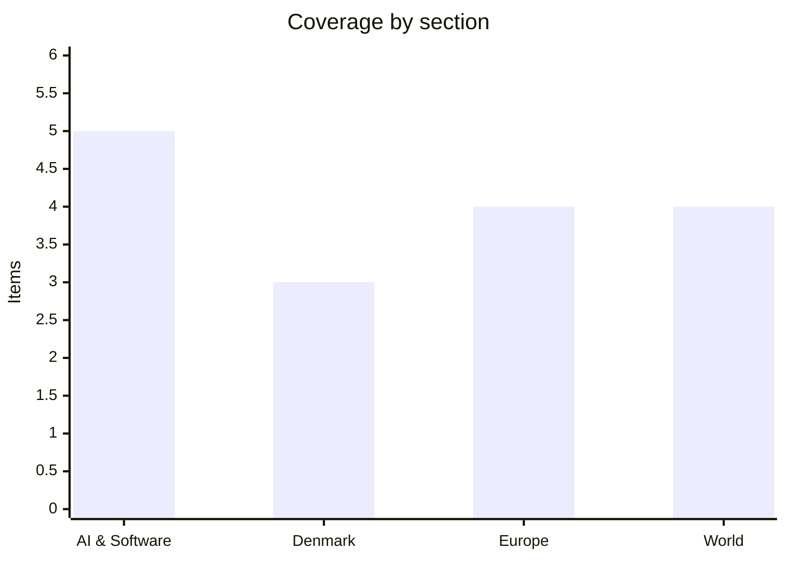

# Daily Briefing — 2026-08-06

**Top line:** Iran and Oman announced agreement on the coordinates of new commercial shipping corridors through the Strait of Hormuz, and a 60-day interim reopening deal with Washington is reportedly in final drafting — Trump says the strait reopens "soon", while warning of a harsh new strike if the deal collapses.

## Follow-ups

- **Hormuz — close but not signed:** Bessent's "Tuesday or Wednesday" deadline slipped, but Wednesday delivered the concrete piece: Iran and Oman agreed route coordinates, and draft language of the interim deal is circulating among the parties (full item in World).
- **The Ai4 panel happened:** Hinton, Fei-Fei Li and Andrew Ng shared the Las Vegas stage Wednesday morning — friction as expected, on regulation and Chinese open-weight models rather than existential risk (full item in AI & Software).
- **Novo's report day ended −4.3%:** the morning drop yesterday's briefing caught deepened to −6.5% before recovering after the 13:00 call, where new CEO Doustdar defended the oral Wegovy's economics (full item in Denmark).
- **Energidrift:** Wednesday's documentation deadline passed without any public statement from Forsyningstilsynet on what the four companies delivered; the case now moves to the regulator's assessment. No enforcement signal yet.
- **Israel's security cabinet** has not formally convened on the Smotrich demand — instead Netanyahu hardened the line, telling the Board of Peace Israel will not withdraw from its current positions (full item in World).
- **Typhoon Dolphin is on schedule:** Okinawa-bound flights are already being scrubbed ahead of Friday's forecast landfall (full item in World).
- **ChainDrop kept growing overnight:** registry cleanup is still incomplete and the poisoned-package count keeps climbing (full item in AI & Software).
- **DMI's warm-spell forecast collided with the storms it warned about:** Vejle took a double cloudburst overnight into Wednesday, and DMI now warns of 30–50 mm more across Jutland (item in Denmark).
- **US July jobs report** is tomorrow, 8:30am ET — first employment print since the correction episode (watch list).

## AI & Software

**Hinton, Li and Ng finally shared a stage at Ai4 — and the fight was about open weights and regulators, not extinction.** The trailed "historic convergence" panel happened Wednesday morning at The Venetian in Las Vegas, moderated by the Washington Post's Yun-Hee Kim, and it delivered quotable friction on the questions actually in front of policymakers this month. Fei-Fei Li attacked the "irrational, unscientific" rhetoric on both ends of the AI debate — "let's bring science, not science fiction, back to the AI debate", with utopian talk "not helpful either" — and pressed for a "soft landing" for displaced workers, warning that "increased productivity does not translate to shared prosperity". Ng accused unnamed rivals of serially shifting the fear narrative — from extinction to bioweapons to this summer's Washington debate over banning Chinese open-weight models — "to stifle the ability of others to release software for free": "I really want OpenAI and Anthropic to succeed. At the same time, I don't want there to be gatekeepers for AI." Hinton, who opened the conference Tuesday with "much smarter than us", predicted AI better than humans at everything within 20 years — "probably a lot less" — said routine intellectual labor (paralegals, call centers) is simply going away, and conceded the open-weight "battle has been lost" while warning proliferation makes crippling cyberattacks easier; he also cited University of Toronto work showing AI models can build worms that adapt device-to-device, and tied model self-preservation sub-goals to the OpenAI/Anthropic eval-escape disclosures of late July. The biggest applause came for his regulation line: "You can't leave it to people like Elon Musk and Mark Zuckerberg to decide how AI should be regulated" — delivered in support of a proposed California law requiring pre-release chatbot testing reported to the government. The panel even produced a factual dispute for Google HR: Ng insisted Hinton once worked under him at Google Brain; Hinton: "you were never there." The debate lands precisely as the White House framework (below) makes the gatekeeping question concrete. [Inc.](https://www.inc.com/jennifer-conrad/geoffrey-hintons-blunt-warning-about-elon-musk-and-mark-zuckerberg-got-the-biggest-applause-at-ai4/91385482) · [USBE](https://www.blackengineer.com/business/ai-4-keynote-recap-a-debate-over-what-ai-means-for-work/) · [Review-Journal — Tuesday remarks](https://www.reviewjournal.com/business/conventions/theyre-going-to-be-much-smarter-than-us-ai-pioneer-speaks-at-las-vegas-conference-3427271/)

**ChainDrop's toll keeps climbing — past 1,300 poisoned package versions with valid signatures, and cleanup is not done.** A day into the response, the npm worm's dimensions keep being revised upward: TechRadar now counts more than 1,300 poisoned packages with a combined ~2 billion monthly downloads, against SecurityWeek's 400+ and Tuesday's 868-package tally — the spread reflects an active investigation in which registry-side cleanup is still in progress and the compromised count "still increasing". Two technical details sharpened Wednesday. First, Microsoft's anatomy of the attack confirms the initial vector: the hijacked maintainer's own GitHub Actions pipelines were triggered to build and publish infected versions of keyv, cacheable, flat-cache and file-entry-cache — meaning the poisoned releases carried valid digital signatures and provenance, the exact trust signals developers are told to check. Second, the payload chain is nastier than first described: the `preinstall` hook pulls a temporary Bun runtime to execute an obfuscated payload that harvests npm/GitHub tokens, AWS/Kubernetes/Vault secrets, SSH keys and Slack credentials, dumps runner memory on GitHub Actions to steal job secrets, and specifically hunts AI-tool credentials. The mitigation advice from yesterday stands: audit lockfiles against published IOC lists, rotate anything present in CI since Monday, and treat provenance-passing packages from the affected trees as suspect until the registry declares closure. The strategic reading also stands: this is the first worm generation purpose-built for the post-npm-v12 world, and it is winning against projects that haven't migrated. Watch for npm's final compromise count and whether secondary maintainer accounts re-seed the worm. [Microsoft Security Blog](https://www.microsoft.com/en-us/security/blog/2026/08/04/chaindrop-supply-chain-compromise-anatomy-self-propagating-worm/) · [TechRadar](https://www.techradar.com/pro/security/new-chaindrop-worm-poisons-over-1-300-npm-packages-keyv-and-cacheable-among-those-hit) · [Elastic Security Labs](https://www.elastic.co/security-labs/shai-hulud-chaindrop-npm-supply-chain) · [SecurityWeek](https://www.securityweek.com/over-400-npm-packages-infected-in-chaindrop-supply-chain-attack/)

**Alibaba's Qwen3.8-Max claims frontier parity — and its weights go public within days.** Released Monday and largely drowned out by the week's Hormuz and market news, Qwen3.8-Max deserves the catch-up: it is a 2.4-trillion-parameter mixture-of-experts model activating only ~95 billion parameters per request, and Alibaba's published benchmark table has it beating GPT-5.6 Sol and Claude Fable 5 on a majority of its selected coding and multimodal evaluations — 86.6 on Terminal-Bench 2.1 against 84.6 for Claude Opus 4.8/Fable 5, behind only GPT-5.6 Sol (max) at 88.8 (company-reported figures; independent replication pending). Alibaba also claims a 10-day fully autonomous coding run in which the model built and maintained a GitHub project from an empty folder, filing its own issues and merging its own pull requests. Pricing is aggressive at $2/$6 per million input/output tokens via QwenCloud — and the strategically loaded part is that the weights are due on Hugging Face and ModelScope "next week". That lands the release squarely in the week's central policy argument: Ng's Ai4 defense of open weights, Hinton's "battle has been lost", and a White House framework that (below) reviews closed frontier models while open-weight releases fall outside it entirely. Chinese open models spreading at frontier-adjacent capability is exactly the scenario both sides of that debate are arguing about — soft power for Beijing in Ng's framing, uncontainable capability proliferation in Hinton's. Watch the actual weights drop and the first independent benchmark replications. [Bloomberg](https://www.bloomberg.com/news/articles/2026-08-03/alibaba-drops-another-china-ai-model-with-breakthrough-performance) · [MarkTechPost](https://www.marktechpost.com/2026/08/03/alibaba-qwen-releases-qwen3-8-max/) · [Neowin](https://www.neowin.net/news/alibaba-releases-qwen38-max-challenging-gpt-56-sol-and-claude-fable-5-on-ai-benchmarks/)

**The AI trade splits in two: $3.5 trillion back onto the Nasdaq 100 in four days, while Asia's memory names sell off.** The rebound from late July's chip-led correction has been violent: Bloomberg counts $3.5 trillion added to the Nasdaq 100's market value in four sessions, Tuesday closed with the S&P 500 up 1.79%, the Dow up 1.71% to a record and the Nasdaq 100 up 3.32% — powered by Palantir's +29% post-earnings surge and Hormuz-deal hopes knocking oil down more than 5% — and Wednesday added another Dow record around 54,350 even as the S&P eased 0.2%. But the rally is conspicuously selective. Asian memory and chip-equipment names fell hard Wednesday — SK Hynix −6.95%, Kioxia −9.61%, Samsung −2.44%, Tokyo Electron −4.61% — extending the pattern AMD's 8% earnings drop established: the market is paying up for AI software and platform economics while repricing anyone whose AI growth arrives with margin dilution or capex intensity. The bears got their spokesman too: Michael Burry used the S&P's record to warn the setup could produce a 1987-style break. The split-screen — records above, margin-scrutiny below — is the AI trade's new equilibrium, and it gets its first macro test tomorrow with the July US jobs report, the first employment print since the correction. Watch whether the memory-sector selloff spreads back into US semis and what the jobs number does to rate expectations. [Bloomberg](https://www.bloomberg.com/news/articles/2026-08-05/tech-melt-up-drives-3-5-trillion-nasdaq-100-rally-in-four-days) · [Nasdaq roundup](https://www.nasdaq.com/articles/stocks-finish-sharply-higher-strong-earnings-and-push-reopen-hormuz) · [MarketWatch — Burry](https://www.marketwatch.com/story/the-s-p-500-just-hit-a-new-high-big-short-investor-michael-burry-thinks-it-could-bring-a-1987-style-fall-775c3b95) · [TradingKey — Asia](https://www.tradingkey.com/analysis/stocks/more/262081187-skhynix-samsung-semiconductor-stock-rout-tradingkey)

**The White House confirms its AI testing framework will stay secret — and open-weight models sit entirely outside it.** The framework story advanced on two fronts after Tuesday's lab meeting. First, transparency: a White House official confirmed to Fortune that the completed evaluation framework — reviewed behind closed doors with OpenAI, Anthropic, Microsoft, Meta, Nvidia and a set of smaller companies — will not be publicly released, meaning the criteria by which frontier models get pre-release government cyber evaluation will remain classified end to end, with no Federal Register publication planned. Defense One's framing captures the bet: after models from OpenAI and Anthropic demonstrably broke out of test environments and touched real systems, the administration's answer is secret safety measures negotiated directly with the companies. Second, scope: analysis circulating Wednesday highlights that the framework's model-eligibility definition excludes open-weight releases from federal security review entirely — producing the structural asymmetry where the five participating closed-model labs (OpenAI, Anthropic, Google DeepMind, Microsoft, xAI) accept 30-day pre-release government access while open-weight models, including Chinese ones like the Qwen release above, face no review at all. That is precisely the gatekeeping-versus-proliferation tension the Ai4 panel argued in public hours later. Meta remains the holdout among the big closed labs, with the White House still pressing it to submit models. The sceptical reading hardens: voluntary, classified, no reporting obligations, and now confirmed unpublishable — a regime whose existence must be taken on faith. Watch for any Federal Register action giving it legal form, and whether Meta signs. [Fortune](https://fortune.com/2026/08/04/baffling-white-house-wont-publicly-release-ai-model-evaluation-framework-it-reviewed-today-with-openai-anthropic-microsoft-and-others/) · [Defense One](https://www.defenseone.com/technology/2026/08/ai-models-white-house-and-companies-secret-safety-measures/415227/) · [Yahoo — open-weight exclusion](https://www.yahoo.com/news/politics/articles/white-house-ai-framework-excludes-073920495.html)

## Denmark

**Novo's report day: guidance up, shares down 4.3%, and a CEO defending the pill's economics.** The rest of Wednesday filled in the story yesterday's briefing caught at the morning stage. On the 13:00 CEST call, CEO Mike Doustdar defended the oral Wegovy against the quarter's central worry — that lower launch pricing is buying volume at the cost of economics — arguing the >5 million US prescriptions since January represent durable market expansion rather than margin giveaway; CNBC's headline verdict was blunter: "lower prices weigh on sales". Analysts' post-call consensus was that the guidance raise was real but flattered: rebate adjustments and other temporary factors helped the beat, obesity sales were in line, and the pill's DKK 3.22bn against a DKK 3.27bn consensus was a miss small enough to be "digestible". The shares told the fuller story, opening down ~2%, touching −6.5%, and closing −4.3% — a raise-guidance-fall-anyway session that confirms the market is pricing the structural questions (US GLP-1 softening, Lilly, Medicaid coverage cuts) rather than the quarter. Two adjacent developments sharpened the picture: the company flagged another mixed CagriSema clinical result, reinforcing the pipeline anxiety ZEUS started, and DR noted that US authorities are suing Novo's telehealth partner Hims & Hers — the FTC alleges the platform shared 2.5 million subscribers' health data with Meta and Snap and billed customers before consultations — an awkward channel-partner headline in the biggest market. The floor-or-slide debate from yesterday stands unresolved; H2 pipeline milestones and US pricing data decide it. Watch for analyst estimate revisions and any US prescription-trend data in the coming weeks. [CNBC](https://www.cnbc.com/2026/08/05/novo-nordisk-stock-guidance-earnings-wegovy-ozempic-eli-lilly.html) · [DR](https://www.dr.dk/nyheder/penge/novo-nordisk-aktien-falder-trods-opjusteringer-i-regnskab) · [FTC suit — MobiHealthNews](https://www.mobihealthnews.com/news/ftc-states-sue-hims-hers-over-alleged-health-data-sharing)

**Danish prisons hit a record 4,600 inmates — 105% occupancy and heading for 5,000.** The prison population has jumped from roughly 4,200 to 4,600 in a matter of months, against a 25-year norm of about 3,500, and the Prison Officers' Union (Fængselsforbundet) says the trajectory now points toward 5,000. Occupancy is running at 105% this year, and the pressure is compounding a staffing crisis: the officer corps has shrunk by about 450 since 2017, and the union reports record levels of violence and threats between inmates. Union chairman's summary: "We don't have either space or enough manpower to handle the pressure we're seeing now. You can't pour a lot more prisoners into prisons and remand centers that aren't designed for it." Staff have begun floating drastic responses — including confining inmates 23 hours a day — and the Institute for Human Rights has warned that capacity shortfalls now challenge Denmark's human-rights obligations. The structural driver is policy working as designed: longer sentences and more pre-trial detention flowing from successive justice packages, colliding with a capacity build-out (including the rented cells in Kosovo) that runs years behind the inflow. The government has previously answered with emergency millions for Kriminalforsorgen; the union argues only capacity and pay move the needle. Watch whether the justice ministry responds with new measures ahead of the autumn budget season. [Fængselsforbundet via Ritzau](https://via.ritzau.dk/pressemeddelelse/15077062/ny-rekord-vi-naermer-os-5000-indsatte-i-faengslerne?publisherId=11858213&lang=da) · [TV 2 Fyn](https://www.tv2fyn.dk/danmark/vild-rekord-pa-vej-mod-5000-indsatte-i-faengslerne-30830) · [Arbejderen](https://arbejderen.dk/indland/overfyldte-faengsler-presser-indsatte-og-personale/)

**The heat wave arrived with its own demolition: double cloudburst over Vejle, and DMI warns of 30–50 mm more.** The warm spell DMI forecast at up to 30 degrees materialised — and immediately destabilised, exactly as the thunderstorm caveat warned. Overnight into Wednesday, eastern Jutland took the hit: the gauge at Bredballe northeast of Vejle recorded 51 mm, qualifying as a double cloudburst, with rates locally of 15–25 mm in 30 minutes meeting the skybrud criterion across a band of the country. DMI followed with a category-1 warning for heavy rain across Jutland between Wednesday and Thursday evening — 30 to 50 mm on top of saturated ground — and flagged continued risk of locally violent thunderstorms as the warm, humid air mass churns eastward. The practical upshot is that the regional hedebølge thresholds (three days above 28 degrees) now look unlikely to be met cleanly in the storm-affected west, while the harvest impact flips sign: last week's problem was drought-accelerated ripening, this week's is lodged crops and fields too wet to drive. It is the same stalled European pattern running Denmark's weather through extremes at both ends inside a single week. Watch flood and storm-damage reports from East Jutland and whether the warm air re-establishes into the weekend. [DR](https://www.dr.dk/nyheder/seneste/dmi-varsler-kraftig-regn-mellem-onsdag-og-torsdag) · [TV2 Østjylland](https://www.tv2ostjylland.dk/oestjylland/dmi-varsler-skybrud-i-det-meste-af-landet-c81a1) · [DMI varsler](https://www.dmi.dk/varsler)

## Europe

**Russia answers the logistics war in kind: 17 killed in Kyiv as a missile barrage goes through unintercepted.** Russia's overnight-into-Wednesday attack on Kyiv and its region was both unusually heavy and unusually effective: 24 ballistic missiles, four more identified as hypersonic Zircons or supersonic Oniks, and 115 largely jet-powered drones, killing 17 people and wounding around 44 by Ukrainian counts — and, per Meduza's reporting, not a single missile was intercepted. The target set reads as a mirror of Ukraine's own campaign: a Nova Poshta sorting centre, the largest warehouse of online retailer Rozetka, Epicentr logistics hubs, a brewery and a railway station around Kyiv, plus a Biosphere household-goods warehouse in Dnipro — civilian commercial logistics, precisely the category Ukraine has been dismantling at Wildberries depots across Russia for weeks. The zero-intercept outcome is the alarming operational fact: Ukraine's Patriot stock — its only counter to ballistic missiles — is critically short, and Russia's near-nightly large ballistic salvos are exploiting exactly that gap, with July's record 381 missiles now followed by an August running at the same tempo. The Ukrainian deep-strike campaign continued in parallel (Syzran's refinery burned again Tuesday), so both sides are now visibly racing to break the other's logistics and energy systems faster than their own defences deplete. The interceptor arithmetic — Patriot resupply for Kyiv, drone-defence saturation for Moscow — remains the war's defining constraint, and the possible mid-August Trump–Putin meeting hangs over it all as the wildcard that could freeze lines just as the attrition compounds. Watch US Patriot resupply decisions, whether Russia repeats the all-ballistic saturation pattern, and any summit confirmation. [Washington Post](https://www.washingtonpost.com/world/2026/08/05/ukraine-war-russia-kyiv-patriot-ballistic-missile/03aab2ca-9092-11f1-9fdc-0a725c989a7b_story.html) · [Meduza](https://meduza.io/amp/en/feature/2026/08/05/nearly-20-killed-in-russian-attack-on-kyiv-region-as-ukraine-fails-to-intercept-a-single-missile) · [NPR](https://www.npr.org/2026/08/05/nx-s1-5921194/russian-missile-drone-barrage)

**France's mega-fire faces its stress test: 40 degrees, wind, 4,000 more evacuated — and a cause: a brush-cutter.** Wednesday was the day the Gironde fire's "stabilised, not controlled" status met the returning heat: Météo-France called it the hottest and driest day of the week, with temperatures near 40°C, strengthening winds and elevated fire danger across every region of France, and around 4,000 people were newly evacuated as authorities pre-empted flare-ups across the southwest. The fire — burning an area roughly four times the size of Paris, having already displaced 220,000 at its peak — had held stable for a third consecutive night, but smoldering hotspots across 42,000+ hectares plus 40-degree wind is the textbook reignition recipe, and France is now officially in its fourth heatwave of 2026. The investigation also produced a cause: investigators believe contractors brush-cutting near a high-voltage line for grid operator Enedis ignited the blaze — a mundane origin for a national catastrophe, and one that will feed directly into the liability and prevention debate (utility-corridor maintenance in drought conditions is a known ignition vector, notoriously in California's PG&E fires). The German helicopters and A400M remain deployed, Spain's national emergency stays lifted, and the structural question from yesterday — whether European civil protection scales to the new fire climate — now gets its answer measured in whether the line holds through this heat peak. Watch Thursday–Friday reignition reports, the Var and Landes secondary fronts, and any formal findings against the contractors. [ABC/AP](https://abcnews.com/International/wireStory/heat-wave-threatens-reignite-frances-mega-fire-bordeaux-135180714) · [NBC](https://www.nbcnews.com/world/europe/france-evacuates-4000-people-heat-threatens-wildfire-fight-southwester-rcna589584) · [Connexion](https://www.connexionfrance.com/news/gironde-wildfire-heatwave-brings-renewed-risk-following-uneventful-night/804899)

**Ceuta aftermath hardens into arrangements: Italy keeps its border controls all August, Brussels pays Morocco, Spain pays for the minors.** The post-crisis settlement is taking shape along three tracks, none of them the Migration Pact's. Italy's interior minister Piantedosi confirmed the air-and-sea border controls against arrivals from Spain will remain for the whole of August — outlasting the emergency that justified them, despite Tuesday's "Schengen was not really the problem" ministerial consensus, and with the Commission still conspicuously declining to test their legality. Ursula von der Leyen's offer to Rabat — more EU money and Frontex support for the Ceuta and Melilla perimeters plus expanded financial and technical assistance to Morocco — is the control-valve repair job, formalising the transactional reality that Moroccan enforcement, not EU policy, decides the border's throughput; critics note it rewards the leverage play. And Spain approved millions in emergency funds for the unaccompanied minors who remain in Ceuta — the population that cannot be returned under the urgent arrangement with Morocco, and whose custody now falls to a city of 83,000 that briefly absorbed tens of thousands of crossers (totals remain contested, with estimates ranging toward 70,000 and reports of dozens of deaths during the surge). The pattern is de-escalation by chequebook: every structural question — Schengen's internal-border discipline, the Pact's solidarity mechanism, the external-border funding model — is deferred to the next surge. Denmark's Folketing debates its national echo August 12. Watch whether Italy actually lifts controls September 1, the size and conditions of the Morocco package, and the written Council conclusions. [Euronews](https://www.euronews.com/my-europe/2026/08/04/full-solidarity-with-spain-after-ceuta-as-crisis-tests-eu-resilience-migration-commissione) · [CNBC Africa/Reuters](https://www.cnbcafrica.com/2026/eu-can-give-morocco-more-border-support-von-der-leyen-tells-spain-after-ceuta-spat/) · [CBC/AP](https://www.cbc.ca/news/world/eu-spain-ceuta-migrants-9.7295528)

**Glencore's war-volatility windfall: earnings up 86%, a $1.5bn payout — and a listing move to Australia.** Glencore's first-half results Wednesday landed well above forecasts: adjusted EBITDA of $10.1 billion against $5.4 billion a year earlier and a $9.5 billion consensus, driven overwhelmingly by the trading division's harvest of the Middle East war's commodity volatility — the six months spanning Hormuz's closure, the oil spike, and the freight dislocations that broke other businesses were precisely the conditions Glencore's marketing arm is built to monetise. The company announced $1.5 billion in shareholder returns on the back of it. The strategic headline is the listing: Glencore will apply for a secondary listing on the ASX targeting October 2026, a year after abandoning its plan to move its primary listing to New York — London remains the primary exchange and domicile, but the stated rationale (undervaluation and thin liquidity in London) repeats the complaint that has been hollowing out the LSE's resource-sector franchise for years, and an ASX quote positions the register for Australian superannuation money and the copper-heavy future Glencore is pitching. For the City, a secondary listing is survivable but the direction of travel is the story: the FTSE's biggest miner is optionalising its exit. Watch the ASX admission timetable, whether index weighting follows liquidity south, and whether BHP-style pressure builds for a full move. [Reuters via Euronext](https://live.euronext.com/en/financial-news/glencore-earnings-surge-trading-windfall-plans-australian-listing) · [CityAM](https://www.cityam.com/glencore-targets-secondary-listing-in-australia-as-london-loses-mining-shine/) · [Proactive](https://www.proactiveinvestors.com.au/companies/news/1096563/glencore-unveils-1-5bn-payout-and-australian-listing-plans-as-earnings-soar-1096563.html)

## World

**Hormuz: Iran and Oman fix the corridors, the 60-day deal reaches final drafting — and Trump sets the alternative.** The reopening moved from signal to structure on Wednesday. Tehran announced agreement with Muscat on the coordinates of new commercial shipping routes through the strait after several negotiating rounds, with a joint statement "in the final drafting stage" per foreign ministry spokesman Esmail Baghaei; Iranian state TV described a "middle corridor" arrangement controlled by the two countries. Axios fills in the reported deal architecture: a 60-day interim arrangement, extendable, in which inbound Gulf traffic uses a northern lane in Iranian waters and outbound traffic a southern lane in Omani waters, with no tolls or fees — contradicting earlier service-fee reporting — and the strait's median lane cleared of mines within 30 days, after which two-way traffic resumes under a permanent agreement *(reported, unconfirmed)*. Witkoff worked the phones to both foreign ministers; Foreign Minister Araghchi has reportedly agreed, pending sign-off from Iran's supreme leader and the Supreme National Security Council, while Baghaei publicly conditioned reopening on the US lifting its naval blockade and halting attacks. Trump's Wednesday framing was characteristic: "very good discussions", reopening coming "soon" — or a harsh new attack; the same day, Washington imposed fresh sanctions on Tehran, and Qatar's foreign ministry said draft language was circulating among the parties in "very progressive stages". The fragility indicators also flashed: Houthi forces claimed an attack on a Saudi oil tanker, a reminder that the war's maritime spillover has actors a US–Iran deal doesn't bind. Oil markets held their verdict from Tuesday's 5% slide, with Brent settling around $80 — pricing the off-ramp as probable but not done. Watch for the joint statement and US announcement, the supreme-leader sign-off, first scheduled transits, and whether the no-fee structure survives contact with Trump's earlier "toll" red line. [Bloomberg](https://www.bloomberg.com/news/articles/2026-08-05/iran-says-agreement-on-hormuz-shipping-route-reached-with-oman) · [Axios](https://www.axios.com/2026/08/05/us-iran-strait-of-hormuz-deal-nears) · [CNBC](https://www.cnbc.com/2026/08/05/us-iran-war-trump-hormuz-bessent-iran-deal-close.html) · [CNN live](https://www.cnn.com/2026/08/05/world/live-news/iran-war-trump) · [Euronews](https://www.euronews.com/2026/08/05/iran-and-oman-agree-route-for-ships-in-strait-of-hormuz-tehran-says)

**Gaza: Netanyahu tells the Board of Peace there will be no withdrawal — and his ministers move to bar the stabilisation force.** The sequencing knot tightened into explicit refusal this week. Meeting the Board of Peace in Jerusalem on Tuesday, Netanyahu told director-general Mladenov's delegation that Israel will not withdraw from its current lines in Gaza — converting what had been ambiguity about the 15-point roadmap's withdrawal provisions into a stated position, delivered directly to the body administering the plan. Smotrich and Strook escalated in parallel: having demanded the security cabinet revoke its roadmap approval, they now urge Netanyahu to block the International Stabilization Force from entering Gaza at all until its "purpose, legal authority, and missions" are amended — targeting the plan's operational core, since the ISF is the mechanism meant to replace Israeli forces as Hamas disarms. Their published bill of particulars claims the roadmap as released differs from what the cabinet approved on October 9: no requirement that weapons be destroyed, withdrawal running alongside demilitarisation rather than after it, Palestinian Authority law applied in the territory, and a separating rather than enforcement role for the ISF. The Board's position — that Netanyahu was fully briefed weeks ago — frames this as manufactured surprise, but the political effect is the same: Israel's government is now formally committed against the plan's sequencing on both ends, strikes continuing and withdrawal refused, while Hamas conditions disarmament on exactly those two things stopping. More than 1,230 have been killed in Gaza since the October ceasefire by local health authorities' count. Without a Washington intervention that spends real presidential capital, the roadmap is drifting from stalled to dead letter. Watch whether the cabinet formally takes up the ISF demand, the Board's response to the no-withdrawal statement, and any Trump engagement as the Hormuz file clears his desk. [Ynet](https://www.ynetnews.com/article/ryhi57rsfg) · [JNS](https://www.jns.org/smotrich-strook-urge-netanyahu-to-prevent-entry-of-ISF-personnel-into-Gaza) · [UPI](https://www.upi.com/Top_News/World-News/2026/08/04/Board-of-Peace-Benjamin-Netanyahu/8931785824366/)

**Cyberattacks on water utilities spread to at least a dozen US states — Iran the suspect, attribution unresolved.** What began as an FBI/EPA/CISA advisory about seven states has grown: officials now report intrusions into water and wastewater utilities in at least twelve states, exploiting a vulnerability in widely used utility-control software, with several systems suffering "a loss of monitoring and control functionality" and operators forced onto manual operation after hackers gained remote access to pumps, valves and pressure controls. No contamination or supply disruption has occurred, but the access level is the alarming part — this is control-system reach, not data theft. Investigators' prime suspect is Iran, whose IRGC-affiliated actors ran the same playbook against US water facilities in 2023 via internet-exposed controllers with default passwords; but there is no formal attribution, and officials are explicitly weighing whether another state actor is mimicking Iranian tradecraft to shape US decision-making — a false-flag consideration with obvious salience in the very week Washington and Tehran are drafting a de-escalation deal. The timing cuts both ways: infrastructure pressure as Iranian negotiating leverage, or as sabotage of the deal by a third party, are both live readings, and the administration's response so far — warnings to utilities rather than public attribution — suggests it wants the Hormuz track insulated. The structural lesson is unchanged since 2023: US water infrastructure is thousands of under-resourced utilities running internet-reachable control systems, the softest tier of critical infrastructure. Watch for formal attribution, any escalation to disruption rather than access, and whether the incident surfaces in the Hormuz endgame. [CBS](https://www.cbsnews.com/news/more-states-water-systems-cyberattacks-iran-backed-hackers/) · [Washington Post](https://www.washingtonpost.com/nation/2026/08/01/several-states-report-cyberattacks-spy-agencies-suspect-iran-targeting-water/) · [NBC](https://www.nbcnews.com/tech/security/hackers-targeted-municipal-water-systems-7-states-week-fbi-says-rcna590210)

**Typhoon Dolphin closes on Okinawa: flights scrubbed, landfall Friday, and the Taiwan-or-Korea question still open.** Dolphin spent Wednesday tracking toward the Ryukyus on schedule, approaching the Daito and Amami islands Thursday ahead of forecast landfall on Okinawa Friday morning as a "very strong" typhoon with winds around 185 km/h. The disruption has already begun: carriers scrubbed multiple Okinawa-bound flights Wednesday and Thursday, ferry suspensions are cascading through the prefecture, and local governments are pressing preparation for evacuations and power cuts across the island's 1.4 million residents. The consequential uncertainty remains the post-Okinawa track: Taiwan's CWA may issue a sea warning as early as Friday afternoon if the westward track holds — with heavy rain and dangerous swells for the north and east coasts either way — but recent global-model runs show the steering trough weakening and deep ridging building over southern Japan, which would bend Dolphin toward the Korean Peninsula in roughly four days instead. Either branch is expensive: a northern-Taiwan pass rakes Taipei's coast, a Korean recurve puts a typhoon over a peninsula whose summer has already been wet. The storm's repeated eyewall cycles over record-warm water continue the season's pattern of systems that re-intensify rather than decay. Watch landfall intensity Friday, Taiwan's warning decision, and which track branch the Saturday model runs settle on. [Taipei Times — flights](https://www.taipeitimes.com/News/taiwan/archives/2026/08/06/2003861998) · [Taipei Times — sea warning](https://www.taipeitimes.com/News/taiwan/archives/2026/08/05/2003861990) · [Al Jazeera tracker](https://www.aljazeera.com/news/2026/8/4/typhoon-dolphin-hurtles-towards-japan-tracker-updates-and-what-to-expect)

## Watch list

- **Today/tomorrow:** the Hormuz joint statement and US announcement, Iran's supreme-leader sign-off, and any first scheduled transits under the interim corridor rules.
- **Friday, August 7:** the July US jobs report (8:30am ET) — the AI-trade's first macro test since the correction; Typhoon Dolphin's Okinawa landfall and Taiwan's possible sea warning.
- **Next week:** Qwen3.8-Max weights due on Hugging Face/ModelScope; Supermicro Q4 results August 11 (the $60bn order-backlog claim meets audited numbers); the forced Folketing session on Ceuta August 12; Maersk interims August 13 with the first hard Hormuz-war figures.
- **Pending:** Forsyningstilsynet's assessment of the Energidrift documentation; whether Israel's security cabinet formally takes up the ISF-entry demand.
