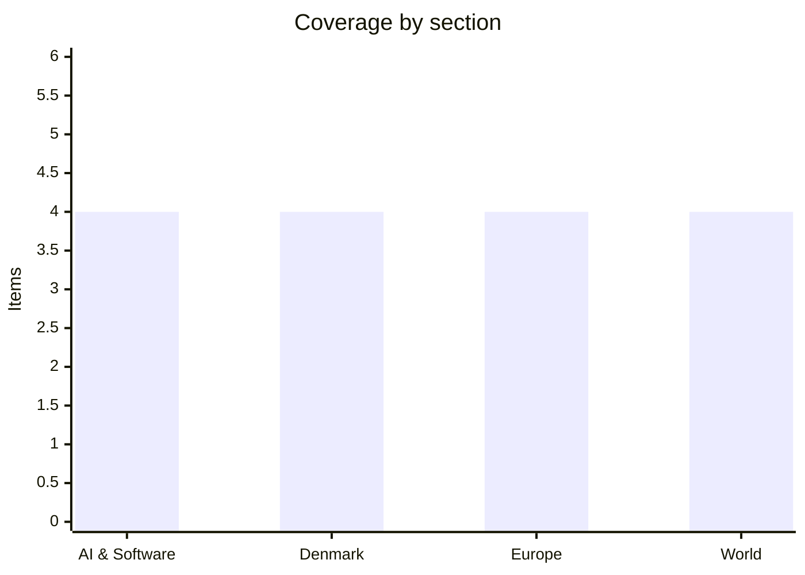

# Daily Briefing — 2026-08-07

**Top line:** Google announced the biggest AI-leadership restructuring in its history — Demis Hassabis steps back from running DeepMind to become Alphabet's chief scientist, while Jeff Dean and three of the company's most-cited researchers leave to found a Google-backed startup — wiping 4% off Alphabet's shares on a day the flagship Gemini release remains overdue.

## Follow-ups

- **Hormuz — statement still unsigned, and a new snag:** the joint statement remains in "final drafting", but Thursday surfaced the sticking point: draft language reportedly barring US and Israeli vessels from the corridors, which Washington flatly rejects (full item in World).
- **The July US jobs report is out — and weak:** +73,000 against ~104,000 expected, unemployment up to 4.2%, and "larger than normal" downward revisions to May and June (full item in World).
- **Typhoon Dolphin reached Okinawa on schedule:** Friday is landfall day, with Taiwan's sea-warning decision due in the afternoon (full item in World).
- **Qwen3.8-Max weights have not dropped:** Alibaba's stated window is the week of August 10 on Hugging Face/ModelScope; no license has been disclosed yet (watch list).
- **ChainDrop's count settled:** the 1,300+ figure conflated npm packages with attacker exfiltration repos — the confirmed toll is ~435 packages, with registry cleanup still unfinished (full item in AI & Software).
- **Energidrift:** still no public statement from Forsyningstilsynet after Wednesday's documentation deadline; the regulator's assessment continues.
- **Israel's security cabinet** has still not formally convened on the Smotrich–Strook demand to bar the stabilisation force; the no-withdrawal standoff is unchanged.
- **The Gironde fire held:** the 40-degree stress test passed without a major breakout, though hotspots persist (full item in Europe).
- **Novo aftermath:** the first analyst moves are landing — Goldman Sachs has reportedly cut its price target to DKK 285 from 310, with the structural US-pricing debate unresolved.

## AI & Software

**Google breaks up its AI command structure: Hassabis steps back, Kavukcuoglu takes Gemini, Alphabet drops 4%.** Announced Wednesday evening, the restructuring ends the era in which Demis Hassabis ran Google DeepMind as a semi-autonomous empire: he becomes chairman of DeepMind and chief scientist of Alphabet, focused on what the company frames as the big scientific questions around AGI and its societal impact, while Koray Kavukcuoglu — DeepMind's long-time CTO and lately Alphabet's "chief AI architect" — takes day-to-day command as a senior vice president reporting directly to Sundar Pichai. The title matters: Kavukcuoglu does not inherit the CEO role, which effectively dissolves DeepMind's stand-alone status and pulls model development closer to Google Cloud and product. The timing is not subtle either: the flagship version of Google's latest Gemini model is still unreleased despite a planned June launch, and both Anthropic and OpenAI poached star Google researchers this summer, feeding an investor narrative that Google is drifting in the race it was supposed to lead — Alphabet shares fell about 4% on the news. The reorganisation also swept the Gemini product side, with Google Labs head Josh Woodward's remit shifting per Bloomberg's reporting on the wider shake-up. There are two readings, and both are plausible: an elevation that frees the field's most decorated scientist from management to chase AGI-scale research, or a polite sidelining of a leader whose lab lost its shipping cadence — Hassabis keeps the science mandate but loses the org chart. What Kavukcuoglu is being asked to deliver is unambiguous: get the delayed Gemini flagship out and make DeepMind's research pay commercial rent. Watch the Gemini release date, whether further senior departures follow, and how Alphabet frames the structure at its next earnings call. [CNBC](https://www.cnbc.com/2026/08/06/demis-hassabis-google-reshuffle-deepmind-role.html) · [Fortune](https://fortune.com/2026/08/05/demis-hassabis-steps-down-google-deepmind-ai-shakeup/) · [Axios](https://www.axios.com/2026/08/05/google-deepmind-demis-hassabis-ai) · [Bloomberg](https://www.bloomberg.com/news/newsletters/2026-08-06/google-s-shakeup-complicates-race-with-openai-anthropic)

**Jeff Dean leaves Google after 27 years — with Ghemawat, Le and Vinyals — to automate the scientific method at Discovery Loop.** The other half of the shake-up is a departure with few precedents in Google's history: Jeff Dean, the engineer whose name is on MapReduce, BigTable, Spanner and the original Google Brain, exits after nearly 27 years to co-found Discovery Loop, taking with him Sanjay Ghemawat (his legendary systems co-author), Google Brain founding member Quoc Le, and DeepMind principal researcher Oriol Vinyals. The startup is structured as a public benefit corporation and its pitch is maximal: use AI to run and iterate thousands of experiments simultaneously, partially automating the research process itself, starting with the automation of machine-learning research and engineering before expanding into hardware design, drug discovery and clean energy. Dean is expected to serve as CEO. Google is notably not fighting the exit — it is a founding investor and Cloud partner, with Radical Ventures and Khosla Ventures co-leading a seed round that remains open and a valuation undisclosed. The through-line with the Qwen and agentic-coding stories of recent weeks is hard to miss: "AI that does AI research" is becoming the explicit product category for the field's most senior people, not a speculative aside. For Google the double loss is structural — Hassabis stepping back and Dean walking out in the same 24 hours removes the two figures who anchored its research credibility for a decade, however friendly the terms. The sceptical reading: backing the venture as investor and cloud provider converts an unpreventable departure into a customer, the same playbook Google ran with Anthropic's early days. Watch the seed close, the first automation-of-ML-research demos, and whether more DeepMind researchers follow. [TechCrunch](https://techcrunch.com/2026/08/05/jeff-dean-and-other-top-ai-researchers-are-leaving-google-to-launch-their-own-startup/) · [GeekWire](https://www.geekwire.com/2026/the-startup-idea-that-convinced-a-uw-computer-science-legend-to-leave-google-after-27-years/) · [Quartz](https://qz.com/jeff-dean-google-chief-scientist-discovery-loop-startup-080526)

**Meta enters the coding-agent race: Muse Code, a terminal agent powered by the new Spark 1.2.** Meta launched its first agentic coding tool Wednesday — Muse Code, a terminal-based agent in beta that the company says can perform "complex software engineering tasks": planning, writing and validating code across large codebases. It ships alongside Spark 1.2, a coding-focused update to the flagship model Meta unveiled in April, available through Muse Code and the Meta Model API. The launch puts Meta directly into the category defined by Claude Code and OpenAI's equivalents — the segment of the AI market currently generating the clearest enterprise revenue — and it is a conspicuous strategic turn for a company whose AI story this year has been open-weight releases and a bruising talent war rather than developer tooling. Context makes the move read as catch-up with distribution: Meta remains the holdout among big labs against the White House evaluation framework, its Llama-line open releases have been overtaken by Chinese models on most benchmarks, and its internal reorganisation has pushed thousands of employees toward AI initiatives. The open question is the wedge — Anthropic and OpenAI monetise coding agents through model quality, while Meta's plausible play is price and its enormous installed developer ecosystem. Early independent benchmarks of Spark 1.2 will tell whether Muse Code is a real competitor or a strategic placeholder. Watch adoption numbers, Spark 1.2 evaluation results, and whether Meta bundles Muse Code into its business products. [Forbes](https://www.forbes.com/sites/jonmarkman/2026/08/06/meta-launches-muse-code-a-new-ai-coding-agent-powered-by-spark-12/) · [Manila Times/AFP](https://www.manilatimes.net/2026/08/06/world/meta-chases-openai-anthropic-with-new-ai-coding-app/2400254)

**ChainDrop's real toll: ~435 packages, 1,557 versions — the 1,300 headline number was counting the attacker's own exfil repos.** Two days in, the npm worm's dimensions have finally stabilised, and the correction runs in the reassuring direction for once: StepSecurity's confirmed count stands at 435 unique packages and 1,557 poisoned versions, with the widely circulated "1,300+" figure revealed as a conflation of actual npm packages with the public GitHub repositories the worm created to receive stolen credentials — other trackers' tallies still range up to ~440 packages and 2,200+ versions, a spread that reflects ongoing investigation rather than ongoing spread. The core facts are unchanged and still severe: the worm ripped through 444 packages in under four hours on August 4 starting from keyv@6.0.0, used the hijacked maintainer's own GitHub Actions pipelines so poisoned releases carried valid signatures and provenance, and harvests npm/GitHub tokens, cloud and Vault secrets, SSH keys and AI-tool credentials, exfiltrating via GitHub repos and Ethereum smart-contract dead drops. Registry-side cleanup remains incomplete, and the compromised maintainer's account and original repositories have been taken down. The response has reached government level, with Singapore's Cyber Security Agency among national CERTs issuing formal advisories. The guidance is unchanged: treat machines that installed affected versions as compromised, rebuild CI runners, rotate everything present in CI since Monday, and audit for anomalous repo activity. Watch for npm's formal closure statement and whether secondary compromised maintainer accounts re-seed the worm — the mechanism that made Shai-Hulud's original run so persistent. [StepSecurity](https://www.stepsecurity.io/blog/chaindrop-npm-worm) · [BleepingComputer](https://www.bleepingcomputer.com/news/security/massive-chaindrop-npm-supply-chain-attack-infects-hundreds-of-packages/) · [CSA Singapore](https://www.csa.gov.sg/alerts-and-advisories/advisories/ad-2026-009/)

## Denmark

**"Rædselsscenarie" på Lolland: a 531-million-kroner hole, and everything non-statutory on the cutting block.** Lolland Kommune is confronting a deficit of 531 million kroner in next year's budget — for a municipality of roughly 54,000 residents, among the largest per-capita shortfalls in the country — and the savings catalogue now on the table dictates how the first 200 million should be found. The catalogue's logic, as local officials describe it, is to cut "everything that is not directly required by law": prevention programmes, culture and sports activities are all listed, and it proposes closing Østofte School and Søllested School outright while merging two others. The mayor requested a meeting (foretræde) with the responsible minister to plead the case and, per TV2 ØST's reporting, received no answer. The local paper Folketidende captured the mood in a councillor's phrasing: previous years cut to the bone — now they are deciding how far above it to cut. Lolland is the extreme case of a national squeeze: Hjørring has produced its own reduction catalogue of over 230 million kroner for 2027–2030 with children's services at risk, and the pattern points at the coming economy-agreement negotiations between KL and the new government, where the service-ceiling arithmetic collides with demographics in exactly the municipalities least able to absorb it. Lolland's structural bind — an old, shrinking, low-income population with high social expenditure — makes it the canary rather than the exception. Watch the autumn budget process, whether the ministry responds to Lolland's plea, and whether school closures survive the local political fight. [DR](https://www.dr.dk/nyheder/indland/raedselsscenarie-kommune-skal-spare-flere-hundrede-millioner-og-maa-skaere-paa-alt-der-ikke-er) · [TV2 ØST](https://www.tv2east.dk/lolland/lolland-kommune-frygter-sparekrav-pa-en-halv-milliard-df748) · [Folketidende](https://www.folketidende.dk/nyheder/de-andre-ar-har-vi-skaret-ind-til-benet-og-nu-er-vi-ved-at-overveje-hvor-langt-oppe-vi-skal-klippe-det-af/5303500)

**August 12 becomes the Folketing's double restart: the Ceuta emergency debate and a shortened summer recess to push 17 bills.** Next Wednesday's hastily convened session now has its full shape. At 10:00, the emergency interpellation (hasteforespørgsel) on the Ceuta crisis runs for two hours and fifteen minutes, directed at Prime Minister Mette Frederiksen and Immigration Minister Morten Bødskov and forced by the opposition bloc of Venstre, Danske Folkeparti, Liberal Alliance, Konservative and Danmarksdemokraterne — with DF leader Morten Messerschmidt explicitly campaigning for Denmark to press for Spain's suspension from Schengen cooperation after the late-July surge in which Spanish authorities assessed that some 70,000–80,000 people crossed into the enclave over a few days (the ministry's own running estimate reached 49,000 in a single day) before most were returned to Morocco. The same date marks the formal early end of the summer recess: the Udvalget for Forretningsordenen cut the break short because the spring's record-long government formation left the legislative programme in arrears, and the S–SF–R–M government wants 17 bills through before the new parliamentary year opens in October — among them the long-trailed requirement for ID cards on large construction sites to combat illegal labour. The combination makes for an unusually charged August: a new government defending its European line in the migration debate while simultaneously sprinting a backlog through committee. Watch the debate's tone as a preview of the autumn — and whether any of the 17 bills slip. [DR](https://www.dr.dk/nyheder/seneste/folketinget-er-hasteindkaldt-12-august-om-migrantstroemmen) · [Kristeligt Dagblad](https://www.kristeligt-dagblad.dk/danmark/folketinget-skal-debattere-ceuta-situationen-den-12-august) · [Altinget](https://www.altinget.dk/udvikling/artikel/folketinget-forkorter-sommerferien)

**Danes returned 247 million bottles and cans in July — the biggest pant month ever recorded.** Dansk Retursystem's July figure of 247 million returned bottles and cans makes it the highest-volume month in the deposit system's history, comfortably beating previous summer peaks. The obvious drivers line up: a hot July, festival season, and the system's steadily widening coverage of juice and other categories added in recent years. It is a small story with a genuinely good statistic inside it — Denmark's return rates were already among the world's highest, and a record month suggests the infrastructure absorbed an extreme-consumption summer without leakage. File under: the circular-economy machinery working as designed. [DR](https://www.dr.dk/nyheder/penge)

**Novo's post-report week: targets coming down, and a "year for the financial memory hole" verdict.** The analyst recalibration after Wednesday's raise-guidance-fall-anyway session has begun: Goldman Sachs has reportedly cut its Novo Nordisk price target to DKK 285 from 310 while holding its neutral stance, and the consensus target now sits around DKK 317 against a share price near 300 — pricing in low single-digit upside for what was recently Europe's most valuable company. Økonomisk Ugebrev's assessment frames 2026 as "a year for the financial memory hole": guidance was technically raised, but the quality of the beat (rebate adjustments, temporary factors) and the oral Wegovy's sub-consensus DKK 3.22bn debut leave the structural questions — US GLP-1 market softening, Lilly's momentum, Medicaid coverage cuts, CagriSema's mixed data — exactly where they were. The stock closed the report day down 4.3% and has not meaningfully recovered. The unresolved debate from the report stands: either the pill's >5 million US prescriptions since January are durable market expansion (management's case) or margin-dilutive volume-buying (the market's fear), and H2 pipeline milestones plus US prescription-trend data will decide it. Watch further target revisions and the next US scripts data. [Økonomisk Ugebrev](https://ugebrev.dk/life-science/novo-nordisks-2026-et-aar-til-den-finansielle-glemmebog/) · [Unge Investorer — targets](https://www.ungeinvestorer.dk/novo-nordisk-kursmaal/) · [DR](https://www.dr.dk/nyheder/penge/novo-nordisk-aktien-falder-trods-opjusteringer-i-regnskab)

## Europe

**Ukraine hits two more refineries 800 miles deep — Yaroslavl for the second night running — as Russia's fuel rationing spreads to 90% of regions.** The logistics war's Ukrainian side answered Wednesday's Kyiv barrage within 24 hours: overnight into Thursday, long-range drones struck the Bashneft-Novoil refinery in Bashkortostan — more than 800 miles from Ukraine — and the Slavneft-Yanos refinery in Yaroslavl, one of Russia's five largest at 15 million tonnes of annual capacity, hit for the second consecutive night; the regional governor confirmed a fire in storage tanks while attributing it, in the standard formula, to "falling drone debris". Ukrainian forces also claimed strikes on two Russian military patrol boats and shadow-fleet vessels in the Black Sea, extending the campaign against the tanker economy that funds the war. Russia's defence ministry claimed 605 Ukrainian drones downed overnight — a figure that, even discounted for inflation, indicates the largest Ukrainian drone operation of the war so far. The cumulative effect is no longer deniable: more than 90 percent of Russian regions have introduced some form of fuel rationing or reported petrol and diesel shortages, an outcome Ukraine's general staff describes as the explicit goal of the refinery campaign. Set against Wednesday's zero-intercept ballistic barrage on Kyiv, the war's shape this week is two states racing to collapse each other's energy and logistics systems faster than their own defences deplete — Ukraine short of Patriots, Russia short of refined fuel. The possible Trump–Putin meeting remains the wildcard over all of it, unconfirmed for now. Watch whether Yaroslavl gets hit a third night, Russian retaliation patterns, and any summit confirmation. [Kyiv Independent](https://kyivindependent.com/ukraine-attacks-one-of-russias-largest-refineries-for-2nd-night-in-a-row-locals-report/) · [NBC](https://www.nbcnews.com/world/ukraine/ukraine-strikes-oil-facilities-deep-russia-zelenskyy-says-rcna591250) · [ABC](https://abcnews.com/International/ukrainian-long-range-strikes-hit-2-major-russian/story?id=135415495)

**Ceuta's mayor tells the European Parliament the "invasion" left his city traumatised — and demands immediate deportations.** The Ceuta crisis got its first formal parliamentary airing Thursday, when mayor Juan Jesús Vivas testified before the European Parliament's civil-liberties committee (LIBE), convened specially during recess. His account was maximal: the entry of roughly 80,000 people by sea on July 30–31 — against a city population of 83,000 — was an "invasion" that produced "a humanitarian emergency of enormous proportions", public-order breakdown and lasting trauma, and his demand was immediate deportations of those who remain. The numbers remain contested across sources (Spanish ministry assessments ran toward 70,000 with most since returned to Morocco), but the political fact is settled: language that would have been fringe a decade ago is now delivered from a mayor's chair to MEPs, a mainstreaming CNN's analysis of the crisis had already traced. The hearing changes little operationally — Italy's border controls run through August, the Commission's money-for-Morocco track proceeds, Spain funds the stranded minors — but it hands the European Parliament a formal record ahead of the autumn's Migration Pact implementation fights. The structural question from the crisis remains untouched by all of it: whether a border regime dependent on Moroccan enforcement can be called EU policy at all. Denmark's Folketing debates its national echo Wednesday (see Denmark). Watch the LIBE follow-up, the written Council conclusions, and whether Italy actually lifts controls September 1. [Euronews](https://www.euronews.com/my-europe/2026/08/06/ceuta-mayor-tells-meps-migrant-invasion-left-city-traumatised-demands-immediate-deportatio) · [CNN](https://www.cnn.com/2026/08/03/europe/the-fallout-from-the-cueta-border-rush-shows-extreme-populist-views-are-now-mainstream)

**Europe's quiet Hormuz exposure: gas storage at 55% entering August, and a refill window that assumes the strait stays open.** While the reopening negotiations play out (see World), the European number that matters has been sliding past mostly unremarked: EU gas storage entered August at roughly 55% of capacity — well behind the five-year average trajectory and far below last year's pace at the same date — after a summer in which the Hormuz closure took about 20% of global LNG supply (roughly 110 bcm annually, overwhelmingly Qatari) off the water. The TTF front-month contract has settled around the €50/MWh level, roughly double the price of a normal storage-injection season, which is precisely the problem: every week of elevated prices makes the mandated storage targets more expensive to hit, and the refill math now leans heavily on the strait's interim corridors actually functioning. The first hopeful data points exist — Qatari LNG transits have resumed cautiously since the Al Areesh's July 30 passage, and European prices have levelled off as traffic stirs — and the ECB's own analysis notes the energy shock has propagated less violently than the 2022 crisis, thanks to LNG diversification and demand destruction already banked. But the asymmetry is uncomfortable: a functioning corridor regime merely returns Europe to an expensive normal, while any collapse of the deal — and the exclusion-clause fight is live this week — hits a continent that has already spent its storage buffer. A cold winter would do the rest. Watch weekly injection rates, Qatari transit cadence under the corridor rules, and whether the Commission revisits storage-target flexibility. [OilPrice](https://oilprice.com/Latest-Energy-News/World-News/European-Natural-Gas-Prices-Jump-on-Hormuz-Escalation.amp.html) · [Baird Maritime](https://www.bairdmaritime.com/shipping/tankers/gas/european-gas-prices-level-off-as-shipping-traffic-stirs-in-hormuz) · [ECB blog](https://www.ecb.europa.eu/press/blog/date/2026/html/ecb.blog20260727~1212bdb8f9.en.html)

**The Gironde fire survived its stress test — "fixed" and no longer advancing, but the embers get weeks, not days.** The heat peak that threatened to reignite France's largest fire since 1949 passed without a major breakout: Thursday's high-risk day — temperatures toward 41°C, humidity through the "rule of three" floor, gusts to 45 km/h — produced one new outbreak near Lanton on the basin's edge, contained by crews that included 50 marine firefighters from Marseille drowning embers along the perimeter, and the interior minister's designation of the fire as "fixé" (no longer progressing) has held. The fine print stays sober: active zones and buried hotspots persist south of Lacanau and on the Cap-Ferret peninsula, still blocking some returns, and franceinfo's expert assessment is blunt that a 42,000-hectare burn in pine and peat can smoulder for weeks and "continue for a long time" regardless of official designations. France's fire year now stands above 119,000 hectares burned. The burn zone has also begun yielding its history — hundreds of WWII-era munitions exposed at Le Porge, requiring bomb-disposal teams before residents can return. The investigation's brush-cutter-near-a-power-line origin (contractors working an Enedis corridor) is hardening into the liability fight, with utility-corridor maintenance in drought conditions now a named national vulnerability alongside the climate signal of a fourth heatwave. The structural question — whether European civil protection scales to the new fire climate — got a provisional answer this week: barely, with German helicopters and luck. Watch the weekend heat, the Var and Landes secondary fronts, and formal findings against the contractors. [franceinfo](https://www.franceinfo.fr/environnement/evenements-meteorologiques-extremes/incendies-et-feux-de-foret/incendies-en-gironde/le-feu-peut-continuer-longtemps-quand-l-incendie-en-gironde-sera-t-il-vraiment-eteint_8132210.html) · [feuxdeforet.fr](https://feuxdeforet.fr/alerte-info/le-feu-en-gironde-est-fixe-et-ne-progresse-plus-selon-le-ministre-de-l-interieur-01-08-2026-7221/) · [Connexion](https://www.connexionfrance.com/news/gironde-wildfire-heatwave-brings-renewed-risk-following-uneventful-night/804899)

## World

**Hormuz: the deal is drafted — and the new fight is over a clause barring US and Israeli ships.** The joint statement trailed for days remains unsigned, and Thursday clarified why: under the draft arrangements reported by CNBC, US and Israeli vessels would be excluded from transiting the new corridors — an Iranian sovereignty marker that Washington rejects outright, insisting any temporary routes operate "without any impediment". Iran's foreign ministry says the drafting with Oman is in its "final stage" and a joint statement will issue "if certain parties do not obstruct this process" — the certain parties being, transparently, the United States — while Tehran also continues to condition reopening on the lifting of the US naval blockade of its ports. The architecture itself appears settled: inbound Gulf traffic through an Iranian-waters lane, outbound through Omani waters, a joint Iran–Oman coordination centre managing traffic, no tolls, and the median lane cleared of mines within 30 days *(reported, unconfirmed)*. CNN's analysis captures the strategic irony: an agreement genuinely taking shape, but one that codifies Iranian-Omani control of the world's most important oil artery rather than the unconditional reopening Trump demanded — his choice now being whether to bless a deal that excludes American ships or blow it up and own the consequences at $80 Brent. The June 17 MoU's collapse last month is the cautionary precedent both sides cite. Oil markets are holding their patient verdict, Brent steady around $80, pricing reopening as probable. Watch the joint statement, whether the exclusion clause survives American pressure, the supreme leader's sign-off, and the first scheduled transits. [CNBC](https://www.cnbc.com/2026/08/06/us-iran-war-hormuz-trump-bessent-deal.html) · [Al Jazeera](https://www.aljazeera.com/news/2026/8/6/hormuz-deal-close-whats-the-latest-on-each-sides-positions) · [CNN analysis](https://www.cnn.com/2026/08/05/middleeast/hormuz-iran-oman-agreement-analysis-intl) · [NBC](https://www.nbcnews.com/world/iran/trump-iran-war-deal-strait-hormuz-deal-oman-rcna590920)

**The jobs report lands soft: +73,000, unemployment up to 4.2% — and the revisions rewrite the spring.** The July employment report — the first since the AI-trade correction and the print yesterday's market rally was implicitly betting on — came in weak on every axis: nonfarm payrolls rose 73,000 against roughly 104,000 expected, the unemployment rate ticked up to 4.2% from 4.1%, and the BLS flagged downward revisions to May and June it described as "larger than normal" — May's gain cut to 19,000 and June's to 14,000, numbers that redraw the spring labor market from "cooling" to "stalled". The reaction in rate markets was immediate: September cut odds jumped toward the high-70s percent range, with economists calling the report the clincher for Fed action. Equities' first response was the ambivalent one this cycle always produces — futures had risen into the print on cut hopes, then wobbled as the growth signal sank in; whether weak-jobs-means-cuts or weak-jobs-means-recession wins the session is the day's live question, and the answer will say much about whether last week's $3.5 trillion Nasdaq rebound has a macro floor under it. For the AI trade specifically the print cuts both ways: rate relief supports the multiple, but a genuinely stalling labor market revives the July correction's core anxiety that capex-heavy AI growth is priced for an economy that cooperates. The asterisk on all of it: revisions of this size, in this political environment, guarantee renewed fire at the BLS itself. Watch the market close, Fed speakers' first reactions, and next week's CPI as the second half of the September-cut case. [Yahoo Finance](https://finance.yahoo.com/news/us-labor-market-adds-73000-jobs-in-july-while-may-june-reports-see-larger-than-normal-downward-revisions-195103455.html) · [SeekingAlpha](https://seekingalpha.com/news/4476512-nonfarm-payrolls-lower-than-expected-in-july-unemployment-rate-ticks-up-to-42) · [CNBC preview](https://www.cnbc.com/2026/08/06/the-july-jobs-numbers-are-due-out-friday-heres-what-to-expect.html)

**The water-utility hacks get their name: US officials point to Iran's CyberAv3ngers, running on a bug that cannot be patched.** The attribution question from earlier this week has hardened: US intelligence officials now assess Iran as "likely responsible" for the intrusion campaign against water and wastewater utilities across twelve states, with CISA pointing to CyberAv3ngers — the IRGC-affiliated group behind the 2023 water-controller attacks — as the operator. The technical picture explains the alarm: the campaign exploits CVE-2021-22681, a 9.8-severity authentication bypass in Rockwell Automation's Logix PLC family for which Rockwell has confirmed no patch exists or is coming, and CISA's updated advisory has expanded the exploited-device list to Schneider Electric and Siemens controllers — meaning the vulnerable base is most of the American water sector's installed automation. The impact ledger so far: coordinated intrusions across 30+ Minnesota communities in late July, several utilities operating pumps and valves by hand indefinitely after losing monitoring and control, boil-water notices in some jurisdictions — and still no confirmed contamination anywhere. The strategic timing remains the uncomfortable part: attribution to Tehran is firming in public exactly as the Hormuz deal reaches final drafting, which reads either as Iranian leverage-building through deniable pressure, or as Washington quietly pre-positioning the justification for walking away — and officials' earlier false-flag caution has receded without fully disappearing. The structural lesson has not changed since 2023: thousands of small utilities running internet-reachable, unpatchable controllers are the soft underbelly of US critical infrastructure, and the fix is procurement and segmentation, not advisories. Watch for formal public attribution, any escalation from access to disruption, and whether the file surfaces in the Hormuz endgame. [The Record](https://therecord.media/iran-cyberattacks-water-treatment) · [TechRadar](https://www.techradar.com/pro/security/us-government-confirms-iran-is-behind-cyberattacks-on-water-companies) · [Tenable](https://www.tenable.com/blog/coordinated-cyberattack-on-minnesota-water-utilities-what-you-need-to-know) · [TIME](https://time.com/article/2026/08/02/what-to-know-about-the-u-s-water-systems-cyberattacks/)

**Dolphin arrives: Okinawa takes its typhoon Friday, and Taiwan decides on a sea warning by afternoon.** Typhoon Dolphin closed on Okinawa on schedule, with landfall Friday as a "very strong" system carrying winds around 185 km/h — the disruption already extensive before the eye's arrival: China Airlines and Starlux scrubbed Taiwan–Okinawa rotations through Saturday, Japanese carriers cancelled dozens of Okinawa flights, ferries across the prefecture are suspended, and local governments spent Thursday pressing preparations for evacuations and power cuts across the island's 1.4 million residents. Taiwan's Central Weather Administration holds its sea-warning decision for Friday afternoon, contingent on whether the westward track persists; its current guidance puts Dolphin's closest approach between Saturday and Monday, with torrential rain possible in northern mountain districts and heavy rain across the north, centre and Lienchiang regardless of the final track. The consequential fork is unchanged and unresolved: global models still split between a continued westward run toward northern Taiwan and a recurve north toward the Korean Peninsula as ridging builds over southern Japan — either branch expensive, with Taipei's coast raked in one and an already-saturated Korea taking a typhoon in the other. The season's pattern of storms re-intensifying over record-warm water through repeated eyewall cycles has held for Dolphin throughout. Watch landfall intensity and damage reports from Okinawa, the CWA's warning decision, and which branch the weekend model runs finally settle on. [Focus Taiwan](https://focustaiwan.tw/society/202608050011) · [Taipei Times](https://www.taipeitimes.com/News/taiwan/archives/2026/08/06/2003861998) · [Al Jazeera tracker](https://www.aljazeera.com/news/2026/8/4/typhoon-dolphin-hurtles-towards-japan-tracker-updates-and-what-to-expect)

## Watch list

- **Today/weekend:** the Hormuz joint statement and whether the US/Israeli-vessel exclusion survives; the US market close after the jobs print; Dolphin's Okinawa landfall outcome and the Taiwan-vs-Korea track decision.
- **Next week:** Qwen3.8-Max weights due on Hugging Face/ModelScope (week of Aug 10) with license unknown; Supermicro Q4 results Aug 11; the Folketing's double session Aug 12 (Ceuta debate + legislative restart); Maersk interims and Pandora Q2 both Aug 13 — the first hard Danish corporate numbers from the war quarter.
- **August 29:** Iceland's referendum on resuming EU accession talks — early voting already underway.
- **Pending:** Forsyningstilsynet's Energidrift assessment; Israel's security cabinet on the ISF-entry demand; the Gemini flagship release date under DeepMind's new management; npm's formal ChainDrop closure statement.
