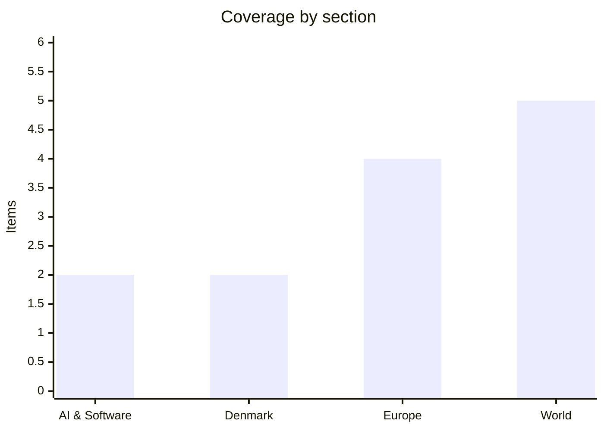

# Daily Briefing — 2026-08-09

**Top line:** The UAE accused Iran's Revolutionary Guard of hitting an ADNOC tanker with a missile inside the Strait of Hormuz — "acts of piracy", in Abu Dhabi's words — on the very Saturday Tehran called the corridor deal with Oman "very close", leaving the Gulf watching a deal and an escalation race each other to the finish.

## Follow-ups

- **Hormuz:** the framework is "very close" per Foreign Minister Araghchi on Saturday — but Saturday also brought the ADNOC tanker strike, and Thursday night's unexplained explosions now have a likely identity: the Friday attack that disabled the LNG carrier Gaslog Shanghai (full items in World).
- **Typhoon Dolphin's landfall window firmed up:** between Zhoushan (Zhejiang) and Fuding (Fujian), Sunday night to Monday morning — slightly later than forecast (full item in World).
- **Zelensky–Vučić delivered concrete outcomes:** an agriculture MoU signed Saturday and a free-trade-agreement target of end-2026 (full item in Europe).
- **Qwen3.8-Max weights have still not dropped;** Alibaba's stated window — the week of August 10 — opens tomorrow, with the license still undisclosed.
- **Gemini's flagship remains unreleased:** DeepMind's Logan Kilpatrick says 3.5 Pro is "testing with partners" and he hopes to "land soon", with Gemini 4 pre-training reportedly under way; Saturday reporting also added a detail to the reorg — London coding teams consolidating to Mountain View *(reported)*.
- **ChainDrop:** still no formal npm closure statement; Microsoft's and Palo Alto Unit 42's post-mortems now anchor the toll at 444 packages and ~2,200 poisoned versions.
- **Energidrift:** still no published assessment from Forsyningstilsynet; reporting shows the supervision spans four companies — Energidrift, Ungstrøm, Edison EL and Dansk Strøm — with Energidrift under a three-week ban on connecting new customers while the documentation is reviewed.
- **Israel's security cabinet** has still not convened on the Smotrich–Strook demand to bar the Gaza stabilisation force; the standoff is unchanged.

## AI & Software

**OpenAI resets ChatGPT's economics: unlimited free text chat on GPT-5.6 Luna, a refreshed Sol for subscribers.** OpenAI announced a refresh of ChatGPT's default models late Friday: paying Plus and Pro users get an updated GPT-5.6 Sol that folds instant responses and deep reasoning into a single model — with a new slider to adjust reasoning depth — while the smaller GPT-5.6 Luna becomes the default for Free and Go tiers, and daily message caps on standard text conversations are removed entirely. OpenAI claims the refreshed Sol cuts responses containing factual errors by 68% versus GPT-5.5 Instant in high-risk factual evaluations, a company self-report worth treating as such until independent evals land. The free tier also gains a "Think" button to invoke extended reasoning on hard questions, rolling out with the unlimited chats during the week of August 10; caps remain on image generation, voice, file uploads and visual analysis. The strategic read is straightforward: OpenAI is spending inference margin to make "AI text is free and unlimited" the consumer baseline, betting that competitors who monetise through capped free tiers — and open-weight rivals like the imminent Qwen drop — lose relative appeal when the marginal conversation costs nothing. It is also a defensive move in a week when Google reorganised its AI command structure and Meta shipped a coding agent: the free tier is OpenAI's distribution moat, and Luna makes it cheaper to defend. The open question is what unlimited free usage does to OpenAI's compute bill at ChatGPT's scale, and whether "Think" becomes the upsell funnel to paid tiers the design implies. Watch adoption and latency once the rollout completes, independent verification of the 68% claim, and whether Google and Meta match unlimited free text. [OpenAI](https://openai.com/index/improving-gpt-5-6-sol-in-chatgpt/) · [SQ Magazine](https://sqmagazine.co.uk/openai-chatgpt-unlimited-text-chats-free-users/) · [ChatGPT release notes](https://help.openai.com/en/articles/6825453-chatgpt-release-notes)

**Catch-up — Anthropic's independence week: an in-house chip team, a $10bn compute deal, and a global-affairs chief.** This one is a few days old but went uncovered here during a crowded week, and it matters too much to Martin's beat to skip: Anthropic confirmed Wednesday it is assembling an in-house custom-silicon team to co-design chips with Claude — its first public acknowledgment of a hardware programme reportedly building quietly since June, anchored by Clive Chan, previously the second hardware hire on OpenAI's chip team and a Tesla Dojo alum, with chip-engineer salaries posted at $320,000–485,000 and The Information naming Samsung as a prospective manufacturing partner *(reported)*. The company frames it as "the latest step in our multi-chip approach" alongside Nvidia GPUs, Google TPUs and AWS Trainium — co-design for inference economics, not a break with suppliers. The financing side is the bigger story: Anthropic signed a $10 billion, six-year compute contract with Nvidia-backed infrastructure startup Volta, sits on roughly $71 billion in accumulated chip-lease obligations per reporting, and is the sole tenant of a Bitdeer-operated, hydro-powered 133 MW data center in Tydal, Norway running Nvidia's Vera Rubin chips — a stack of project-finance structures (16-year colocation worth ~$4.7bn base, JPMorgan-arranged credit enhancements) that shows frontier-lab funding migrating from venture rounds to infrastructure finance *(reported)*. The same week, Anthropic named Mariano-Florentino (Tino) Cuéllar — former California Supreme Court justice and Carnegie Endowment president — as its first Chief Global Affairs Officer, reporting to Daniela Amodei. Taken together with AMD's acquisition of inference-silicon startup Taalas and Tesla/SpaceX's Terafab (both covered Friday), the pattern of the week is unambiguous: the AI race's center of gravity is shifting from models to the silicon and megawatts underneath them. Watch for the first silicon-team hires going public, whether the Samsung partnership is confirmed, and how quickly rivals copy the lease-finance playbook. [TechCrunch](https://techcrunch.com/2026/08/05/anthropic-is-hiring-an-ai-chip-design-team/) · [Tom's Hardware](https://www.tomshardware.com/tech-industry/anthropic-to-build-its-own-co-designed-custom-ai-accelerator-for-inferencing-workloads-samsung-reported-to-be-partnering-with-the-claude-ai-maker-for-manufacturing) · [TechCrunch (Volta)](https://techcrunch.com/2026/08/04/anthropic-signs-10-billion-deal-with-ai-cloud-startup-volta/) · [Anthropic](https://www.anthropic.com/news/tino-cuellar)

*Otherwise a genuinely quiet AI weekend — the calm before Qwen's open-weights week.*

## Denmark

**Hizb ut-Tahrir targets gymnasium students with a back-to-school campaign — and Bødskov calls it "dangerous and divisive".** The Islamist organisation Hizb ut-Tahrir launched a campaign aimed at Muslim gymnasium students ahead of the school year, published as a letter titled "Stå fast på din islamiske identitet og bær den med stolthed" ("Stand firm in your Islamic identity and wear it with pride"), warning students they will meet a youth culture whose behaviour, norms and lifestyle "do not harmonise with Islam" presented as the natural or desirable choice. Immigration and integration minister Morten Bødskov (S) responded Saturday that he is "deeply concerned", calling the campaign dangerous and divisive — "Hizb ut-Tahrir calls on people to remember their Islamic values — implicitly, to keep away from Danish values" — and, per Kristeligt Dagblad's reporting on an accompanying video, describing it as camouflaged extremism, with an accompanying call for the group to leave Denmark. The gymnasium sector pushed back hard: Allan Kortnum, chair of Danske Erhvervsskoler og -Gymnasier, said the campaign "fundamentally contradicts everything Danish school culture and the gymnasium stand for: freedom, open-mindedness, personal empowerment, democratic education". The timing is not incidental — it lands two days after Heunicke's AI-cheating strakspakke put gymnasiums at the center of the news cycle, and in the opening week of a school year where 9,000 HF students face new oral-defense requirements; schools now start the year with a second, harder integration debate on their hands. Hizb ut-Tahrir remains legal in Denmark — unlike in Germany and Britain — which is precisely the recurring political flashpoint: previous attempts to ban the organisation have foundered on grundlovens forsamlingsfrihed, and the predictable next move is renewed calls for a ban assessment. Watch whether Folketing parties demand action when the chamber reconvenes Wednesday, and whether schools report the campaign showing up physically at study starts. [DR](https://www.dr.dk/nyheder/indland/boedskov-dybt-bekymret-over-hizb-ut-tahrir-kampagne-maalrettet-gymnasieelever) · [DR (reactions)](https://www.dr.dk/nyheder/indland/hizb-ut-tahrir-kampagne-medfoerer-protester-det-strider-grundlaeggende-mod-alt-det-som-dansk) · [Kristeligt Dagblad](https://www.kristeligt-dagblad.dk/danmark/minister-ser-hizb-ut-tahrir-video-som-kamufleret-ekstremisme)

**Pride's first weekend passes with police choosing visibility over discretion.** Copenhagen Pride's opening weekend proceeded under the security regime announced Friday, and the posture sharpened in Saturday's reporting: Københavns Politi says the police presence will be *more visible* than at previous Prides — a deliberate inversion of the usual Danish preference for discreet security — with the operation calibrated to PET's current threat assessment and running dialogue with Pride's own professional security organisation. The explicit reference point remains Berlin's Christopher Street Day attack of July 25, where a van-and-machete attacker killed one woman and injured 29; Copenhagen is the first major Scandinavian Pride since, and the force has said plainly that the Berlin attack shapes the operation while declining to detail measures. The organisers' line is unchanged — the event proceeds as planned, as Amsterdam's WorldPride did last week behind a massive police deployment that passed without incident. The structure of the week concentrates risk at the end: the parade on August 15 is among Denmark's largest recurring public gatherings, and the visible-security experiment will be judged on that day. Watch the threat-assessment language as the parade approaches and whether the visibility strategy — reassurance to some, a target-marker debate to others — holds through the week. [DR](https://www.dr.dk/nyheder/indland/politi-vil-vaere-mere-synligt-ved-pride-i-koebenhavn) · [TV 2 Kosmopol](https://www.tv2kosmopol.dk/metropolen/politi-bliver-mere-synligt-ved-pride-efter-berlin-angreb-9856a)

*A thin Danish weekend beyond these — the political calendar restarts Wednesday with the Ceuta debate and the 17-bill sprint.*

## Europe

**Two more refineries burn as Russia throws S-400s at Kyiv: the energy war's weekend ledger.** Ukraine's deep-strike campaign kept its tempo through the weekend: drones set the Ilsky refinery in Krasnodar and the Syzran refinery in Samara region on fire in the night to Saturday — both confirmed by Ukraine's General Staff, with military intelligence (HUR) separately confirming Ilsky — alongside a strike on a Russian observation post installed on the Sivash drilling rig in the Black Sea, and the Unmanned Systems Forces reported hitting 12 more shadow-fleet vessels in the Black Sea and Sea of Azov across the first week of August. Russia's counter-ledger was aimed at people and rails rather than refineries: the same night it fired six Iskander-M ballistic missiles plus S-400 anti-aircraft missiles in a surface role from Bryansk and 151 drones, striking Kyiv in two waves — four injured, one body found in the cleanup — after the Brovary strike that killed three, including a child, covered yesterday. Saturday's daytime toll ran through the familiar geography: more than 40 strikes on four districts of Dnipropetrovsk region killed two, a bus driver died in Nikopol, drones hit industrial plants in Zaporizhzhia and a residential district of Kharkiv, and Kherson region counted two dead and 24 wounded, a child among them, over the past day. Zelensky used the barrage to surface a supply detail with real strategic weight: Ukraine now has an agreement with the US on *monthly* deliveries of Patriot interceptor missiles — the war's binding constraint since the interceptor famine of early August — but the volumes, he said, remain insufficient, and interceptors "protect people when they're in Ukraine, rather than sitting in warehouses". The shape of the war is unchanged from Friday's assessment — two states racing to break each other's energy systems before winter — but the weekend's detail is that Ukraine's refinery arithmetic keeps compounding while its air-defense arithmetic merely stabilises. Border guards meanwhile reported no strike-force buildup in Belarus despite Russian pressure to draw Minsk in. Watch whether the Patriot monthly pipeline holds, which refinery burns next, and Russian fuel-market data as the cumulative damage bites. [Ukrinform (refineries)](https://www.ukrinform.net/rubric-ato/4152311-general-staff-defense-forces-strike-two-russian-oil-refineries-and-observation-post-on-sivash-drilling-rig-in-black-sea.html) · [Ukrinform (missiles)](https://www.ukrinform.net/rubric-ato/4152248-russians-attack-ukraine-with-iskander-missiles-s400-missiles-and-151-drones.html) · [Ukrinform (Patriot)](https://www.ukrinform.net/rubric-ato/4152321-ukraine-has-agreement-with-us-on-monthly-deliveries-of-interceptor-missiles-says-zelensky.html) · [Ukrinform (shadow fleet)](https://www.ukrinform.net/rubric-ato/4152274-unmanned-systems-forces-strike-12-more-vessels-of-russias-shadow-fleet-in-black-sea-and-sea-of-azov.html)

**Belgrade delivers more than optics: an agriculture MoU signed, a free-trade agreement promised by year-end.** Zelensky's first-ever Ukrainian presidential visit to Serbia produced concrete outcomes on Saturday: Serbia's agriculture ministry and Ukraine signed a memorandum of understanding on cooperation in agriculture and food safety, the two presidents set a target of finalising a mutual free-trade agreement by the end of the year, and Vučić framed the relationship around a "common goal" of EU membership — while Zelensky secured public Serbian support for Ukraine's territorial integrity. Vučić received Zelensky with what Euronews called pomp and circumstance, a deliberate signal to both Brussels and Moscow from the EU candidate that still refuses sanctions on Russia — a position Vučić reconfirmed before the meeting — still flies to Moscow and still runs on Russian gas. Bloomberg's framing captured the direction of travel: the visit lands as Belgrade quietly reduces Russian ties, with US sanctions squeezing the Russian-owned NIS oil company at the heart of Serbia's fuel supply and Serbian-made ammunition long reaching Ukraine through intermediaries. The free-trade agreement is the piece with real content — Serbia would become a rare non-EU European economy with open trade lines to wartime Ukraine, and agricultural cooperation between two major grain economies has substance beyond symbolism. The photograph of Vučić and Zelensky was itself the message, as anticipated — but the year-end FTA deadline gives the relationship a verifiable milestone rather than a mood. Moscow's response so far is commentary rather than consequence. Watch whether FTA negotiations actually launch, NIS's sanctions endgame, and whether Vučić pays any domestic price from his pro-Russian flank. [Euronews](https://www.euronews.com/my-europe/2026/08/08/serbias-vucic-sends-signal-to-brussels-and-moscow-by-hosting-zelenskyy-with-pomp-and-circu) · [Bloomberg](https://www.bloomberg.com/news/articles/2026-08-08/zelenskyy-makes-debut-trip-to-serbia-as-russian-influence-wanes) · [Yahoo/dpa](https://www.yahoo.com/news/politics/articles/zelensky-vu-seek-cooperation-despite-134829343.html)

**"Palace revolt" in the CDU: Merz's party openly discusses replacing him after September's state elections.** *(reported)* What was a competence crisis a week ago has hardened into open succession politics: Der Spiegel, citing party sources, reports that CDU leadership circles are discussing Chancellor Friedrich Merz's possible resignation after the September regional elections in Berlin, Saxony-Anhalt and Mecklenburg-Vorpommern — describing the mood as a "palace revolt", quoting one member that "Merz is at a dead end — he can no longer get through to the party", and floating North Rhine-Westphalia premier Hendrik Wüst as successor for both party and chancellery. The mechanism sketched in the reporting: if the CDU performs as badly as polls suggest in all three states, state premiers would urge Merz to step aside, with a leadership transition managed after the vote. The reporting has run all week without effective rebuttal, and Saturday's round-up coverage framed it as an unprecedented destabilisation of a country that was supposed to anchor European stability — this briefing covered the trigger on August 3: the chaotic reshuffle after Jens Spahn's resignation, which crystallised months of frustration over Merz's authority. The caveats matter: this is sourced party chatter amplified across secondary outlets, "discussing resignation" is not a decision, and chancellors have survived worse Septembers — but the fact that virtually no senior CDU figure consulted by Spiegel defended Merz's future is itself the data point. The European stakes are direct: a lame-duck chancellor through the autumn would stall the EU's German motor on defence financing, budget fights and the AI-framework file, with the AfD polling first or second in all three September states. Watch the state-election polls, whether Wüst says anything at all, and whether Merz attempts a confidence-restoring move before September. [The European Conservative](https://europeanconservative.com/articles/news/merz-faces-mounting-pressure-as-reports-of-cdu-revolt-grow/) · [Caliber (citing Der Spiegel)](https://caliber.az/en/post/der-spiegel-german-ruling-party-discusses-chancellor-merz-s-possible-resignation) · [Daily News Egypt](https://www.dailynewsegypt.com/2026/08/08/german-chancellor-merz-faces-internal-party-rebellion-and-replacement-speculation-ahead-of-regional-elections/)

**The Black Sea's civilian ledger: a crewless bulker adrift off Odesa, a seaman killed on a wheat ship, and a seized freighter awarded to Ukraine.** The week's maritime file, running through Friday, shows the Black Sea shipping war reaching civilian hulls at a rising rate: the German-operated capesize bulker Emil is drifting abandoned some 21 nautical miles off Odesa after Russian drones attacked it Wednesday — the strikes continuing even as the crew evacuated — while the 91-metre Mera Queen, loaded with Ukrainian wheat, was hit Wednesday evening with a Ukrainian crew member killed, extending what Danish maritime media bluntly headline as the continued killing of civilian seafarers. The legal front produced a precedent the same week: Sweden's Supreme Court upheld the Ystad district court's ruling that the freighter Caffa — seized off Trelleborg on March 6 and previously used by Russia to export grain from occupied Ukrainian territory — must be handed over to Ukraine, a first-of-its-kind confiscation-and-transfer through an EU state's courts. Meanwhile Russia is reportedly assembling oil convoys on the Northern Sea Route as sanctions and Ukrainian strikes squeeze its conventional export channels — the Arctic becoming the shadow fleet's pressure valve. The pattern connects to the weekend's other stories: Ukraine's 12 shadow-fleet strikes, the Oman spill, and the Senate's new sanctions bill all target the same tanker economy, and the civilian cost — crews from countries with no stake in the war — is climbing on both sides of the ledger. For Denmark the file is close to home: Danish shipping transits these waters, and the Caffa precedent will interest every EU flag state holding a detained Russian-linked hull. Watch salvage or sinking for the drifting Emil, whether the Caffa transfer executes, and insurance-market reactions to the seafarer deaths. [Maritime Danmark (Emil)](https://www.maritimedanmark.dk/forladt-bulker-driver-i-sortehavet-efter-russisk-angreb) · [Maritime Danmark (Mera Queen)](https://www.maritimedanmark.dk/drab-pa-civile-sofolk-i-sortehavet-fortsaetter) · [Maritime Danmark (Caffa)](https://www.maritimedanmark.dk/opbragt-fragtskib-overdrages-til-ukraine)

## World

**A missile hits an Emirati tanker in Hormuz — and the Gulf calls Iran a pirate while the deal sits one signature away.** The UAE's foreign ministry said an ADNOC-owned tanker was struck by a missile in the early hours of Saturday while transiting the Strait of Hormuz, with no casualties — and attributed the attack directly to Iran's Revolutionary Guard, calling the use of the waterway "as a tool of economic coercion or blackmail" an act of piracy and demanding the strait reopen "fully and unconditionally". The condemnations arrived in a coordinated wave: the GCC's secretary-general called it a "dangerous and unacceptable escalation", Saudi Arabia invoked international law and Resolution 2817 "in the strongest terms", Qatar rejected the strait as a "bargaining chip", and Jordan declared full support for the UAE — while Kuwait's defence ministry separately reported intercepting Iranian drones entering its airspace *(reported)*. The attack was not isolated: ADNOC said Friday that 15 of its vessels have been attacked by missiles and drones since the conflict began — three this week alone — killing one crew member and injuring 20, a toll the company's Friday statement notably declined to attribute, and Friday also saw the Qatari-loaded LNG carrier Gaslog Shanghai disabled by a projectile to its engine room 11 nautical miles off Limah, the second LNG tanker hit in under a month. The strategic absurdity is that this escalation runs parallel to a nearly finished deal: Foreign Minister Araghchi said Saturday the Oman corridor agreement is "very close", parliament's national-security spokesman says the framework is agreed pending a green light from "higher levels", and US media describe a 60-day extendable interim arrangement with mine clearance and a possible fee system *(reported)*. But Saturday also exposed Tehran's internal fault line: IRGC spokesman Hossein Mohebbi declared the strait's reopening "has its own specific mechanism and has nothing to do with the negotiations between Iran and Oman", insisting Washington must accept Iran's conditions — including lifting the naval blockade — and calling the strait a "source of power" Iran intends to leverage, while President Pezeshkian defended the June MoU and again denied resignation rumors. Markets are pricing the deal, not the missiles: Brent closed near $83, the rial strengthened to 1.85 million to the dollar from last week's 1.94 million record low, and the Tehran exchange rose 2% to near all-time highs on Saturday. The two readings are irreconcilable and both live: either the IRGC is spoiling a deal the diplomats have finished, or the attacks are Tehran's final-stretch leverage to force US concessions before signing. Watch whether the joint statement lands despite the strike, Gulf states' next move if attacks continue, and whether the US responds to a direct hit on an Emirati hull. [Al Jazeera](https://www.aljazeera.com/news/2026/8/8/uae-says-iran-targeted-adnoc-tanker-in-hormuz-no-casualties-2) · [Al Jazeera (Iran's deliberations)](https://www.aljazeera.com/news/2026/8/8/iran-deliberates-hormuz-arrangement-amid-uncertain-prospects-with-us) · [CNBC](https://www.cnbc.com/2026/08/08/uae-ship-targeted-missile-us-iran-tensions-stay-high.html) · [Maritime Executive (Gaslog Shanghai)](https://maritime-executive.com/article/lng-carrier-hit-by-iranian-attack-in-strait-of-hormuz)

**The Mecca pact: Saudi Arabia, Turkey and Pakistan sign a mutual-defence treaty — a new Muslim-power bloc in NATO's blind spot.** Signed Thursday in Mecca by Crown Prince Mohammed bin Salman, President Erdoğan and Prime Minister Shehbaz Sharif — and analysed through the weekend as its scale sank in — the Mecca Joint Defence Agreement commits the three states to treat an armed attack on any one as an attack on all, extending the September 2025 Saudi-Pakistani mutual-defence pact to Turkey and creating a trilateral bloc spanning NATO's second-largest army, the Gulf's financial superpower and the Muslim world's only nuclear weapons state. The immediate driver is the war: Saudi Arabia has spent the summer under Houthi missile and drone attack — Najran was struck Thursday, and the Houthis claimed hits on two Saudi tankers last week — while Gulf capitals watched Washington's security guarantee look increasingly conditional as the US-Israel war on Iran ground on without protecting Gulf shipping. The Al Jazeera and Atlantic Council analyses converge on the core point: this is the institutional expression of a "post-American Middle East" — states that hosted US bases for decades building a mutual-defence architecture that pointedly does not include Washington, with Pakistan's nuclear arsenal supplying the implicit umbrella that US ambiguity no longer does. The unresolved tensions are structural: Turkey's NATO membership raises unprecedented questions about overlapping Article 5-style commitments, the pact's posture toward Israel is deliberately unstated, and whether it would actually trigger over the next Houthi strike on Jeddah is exactly the kind of test alliance texts prefer to avoid. Saturday brought a related move on the diplomatic board: Saudi Arabia's intelligence chief met Iraq's prime minister in Baghdad and renewed an invitation to Riyadh, part of the same regional realignment. The pact will now shadow every Hormuz and Gaza calculation — a Gulf state attacked by Iran can now, on paper, call on Turkish and Pakistani force. Watch for accession interest from other states (Qatar and Jordan are the obvious candidates), Washington's formal response, and the first crisis that tests the clause. [Al Jazeera (what's in it)](https://www.aljazeera.com/news/2026/8/7/turkiye-saudi-arabi-pakistan-sign-joint-defence-agreement-whats-in-it) · [Atlantic Council](https://www.atlanticcouncil.org/dispatches/why-saudi-arabia-pakistan-and-turkey-just-signed-a-defense-pact/) · [Al Jazeera (US role)](https://www.aljazeera.com/news/2026/8/8/what-could-the-mecca-defence-pact-mean-for-the-us-role-in-the-middle-east)

**The Senate passes the Graham sanctions bill 86-11 — tariffs of up to 100% on buyers of Russian oil, now heading for a harder fight in the House.** The US Senate on Friday passed the Lindsey O. Graham Sanctioning Russia and Iran Act of 2026 — named for the late senator who championed it through years of stalling — by an overwhelming 86-11, authorising sanctions on Russian officials and, centrally, empowering the president to impose tariffs of up to 100% on goods from countries that continue buying large volumes of Russian oil and gas, with China and India the explicit targets, alongside extended Iran sanctions. The bill's history is the story: Graham introduced it in 2025 with 80-plus cosponsors only to watch it languish while the White House preferred deal-making with Moscow, and its passage now — with waiver authority built in for presidential flexibility — signals that Senate patience with the negotiation track has run out as Russia's summer offensive grinds on and the energy war escalates. For Ukraine's supporters the vote is the biggest congressional win in two years; for the sanctions architecture it is a potential step-change, converting secondary-sanctions threats into tariff mechanics that hit Beijing and New Delhi's trade calculus directly. The obstacles ahead are real: the House must reconcile tariff provisions that unsettle both free-trade Republicans and Democrats wary of handing the president unilateral trade weapons, and the administration's appetite for actually pulling the 100% trigger against China — mid-trade-truce — is untested. The interaction with the week's other files is direct: the bill lands as the Senate's answer to the same tanker economy Ukraine is striking kinetically and the EU is squeezing through its own packages. Watch the House timetable, whether Trump signals veto or signature, and initial reactions from Beijing and New Delhi. [Washington Post](https://www.washingtonpost.com/national-security/2026/08/07/senate-approves-tough-russia-sanctions-bill/) · [NBC](https://www.nbcnews.com/politics/congress/senate-passes-sanctions-bill-russia-iran-named-late-sen-lindsey-graham-rcna589949) · [RFE/RL](https://www.rferl.org/a/russia-ukraine-senate-trump-graham-sanctions/33824412.html)

**China battens down for Dolphin: landfall tonight between Zhoushan and Fuding, ports closed, highest coastal alert in Zhejiang.** Typhoon Dolphin — the western Pacific's 13th named storm, which formed near the International Date Line in what Chinese meteorologists call an exceptionally rare genesis — is bearing down on the Zhejiang-Fujian coast with landfall projected between Zhoushan and Fuding from Sunday night to Monday morning, packing winds of 38–45 m/s (roughly 137–162 km/h) near its center and possibly strengthening over the warm East China Sea on final approach. The preparation machine is running at full scale: the China Meteorological Administration upgraded its emergency response to Level III and its warning to orange, Zhejiang raised its coastal typhoon alert to the highest level and halted port operations — the landfall zone includes Ningbo-Zhoushan, the world's busiest port complex by tonnage — while ferries are suspended, fishing fleets recalled, construction stopped, and flights and trains cancelled across the region, with Shanghai activating its own emergency response. The rainfall forecast is the graver number: heavy to torrential rain through Wednesday across Taiwan, Fujian, Zhejiang, Shanghai and inland provinces, with parts of eastern Zhejiang facing more than 600 mm — the kind of totals that turn typhoon events into flood disasters well after the wind story ends — and force 9–11 winds gusting to 12–13 across the East China Sea and Hangzhou Bay. Authorities are deploying drones and AI-assisted monitoring across Zhejiang in what state media present as the most technology-heavy typhoon response yet. Dolphin's Okinawa passage on Friday — five injured, ~17,000 households without power — now reads as the storm's gentler act; the season's pattern of storms re-intensifying over record-warm water has held through every stage of its track. Watch landfall intensity and location tonight, evacuation numbers (routinely in the hundreds of thousands for this coast), Ningbo-Zhoushan's closure duration and shipping backlog, and inland flooding through midweek. [Global Times](https://www.globaltimes.cn/page/202608/1367620.shtml) · [NBC](https://www.nbcnews.com/world/china/typhoon-dolphin-hits-japans-okinawa-china-shuts-ports-ahead-landfall-rcna591465) · [SCMP](https://www.scmp.com/news/china/politics/article/3363262/13-times-size-zhejiang-china-deploys-drones-ai-typhoon-dolphin-nears-coast) · [CGTN](https://news.cgtn.com/news/2026-08-09/Typhoon-Dolphin-approaches-China-s-eastern-coast-1PsDSDv2d8s/p.html)

**Fuego enters a more explosive phase: Guatemala's nationwide orange alert and fresh village evacuations.** Guatemala's disaster agency CONRED escalated its response to the Fuego volcano on Saturday, maintaining a nationwide orange alert and evacuating two villages closest to the crater as the eruption that began August 4 moved into what the national volcanology institute INSIVUMEH calls a more explosive phase. The eruption's running numbers: pyroclastic flows — the superheated avalanches of gas, ash and debris that make Fuego lethal — are descending multiple ravines, lava fountains have reached roughly 300 metres, ash columns have exceeded 5,000 metres altitude and spread up to 120 km, more than 29,000 people are affected by ashfall, and over 650 residents were evacuated in the first days with more following this weekend. The mountain's history is why authorities move fast: Fuego sits about 50 km southwest of Guatemala City with dense villages on its flanks, and its June 2018 eruption killed more than 200 people when pyroclastic flows buried the community of San Miguel Los Lotes — a disaster whose delayed-evacuation lessons now drive the hair-trigger protocol. Midweek assessments had suggested the intensity was easing; Saturday's escalation shows the oscillating pattern typical of Fuego's longer episodes, where lulls precede stronger pulses. The practical risks stack beyond the immediate blast zone: ashfall on Guatemala City's airport and crops, lahars when rain hits the fresh deposits — this is the wet season — and evacuation fatigue in communities asked to leave repeatedly. Watch whether the alert escalates to red, airport operations, and the lahar forecasts as rain moves in. [KSL/AP](https://www.ksl.com/article/51605665/guatemala-evacuates-villages-due-to-an-eruption-of-the-fuego-volcano) · [Fox Weather](https://www.foxweather.com/weather-news/guatemala-evacuates-communities-fuego-volcano-eruption) · [Al Jazeera](https://www.aljazeera.com/news/2026/8/4/guatemala-issues-second-highest-danger-alert-after-fuego-volcano-erupts)

## Watch list

- **Tonight–Monday:** Dolphin's landfall between Zhoushan and Fuding — intensity, evacuation scale, and how long Ningbo-Zhoushan stays shut; the Hormuz joint statement, now racing the IRGC's missiles, with the supreme leader's sign-off still unclaimed.
- **This week:** Qwen3.8-Max open weights (window opens Monday — license is the thing to read first); US July CPI Wednesday and PPI Thursday, the September FOMC's effective decider; the Folketing's double session Wednesday (Ceuta hasteforespørgsel + 17-bill sprint); Maersk and Pandora interims Thursday; Supermicro Q4 Tuesday.
- **August 15:** Copenhagen Pride parade — peak test of the visible-security regime; **August 29:** Iceland's EU referendum, with the yes-side lead narrowing.
- **Pending:** the House's handling of the Graham sanctions bill; Forsyningstilsynet's Energidrift assessment; Israel's security cabinet on the stabilisation force; npm's formal ChainDrop closure; the Merz succession chatter ahead of September's three state elections.
