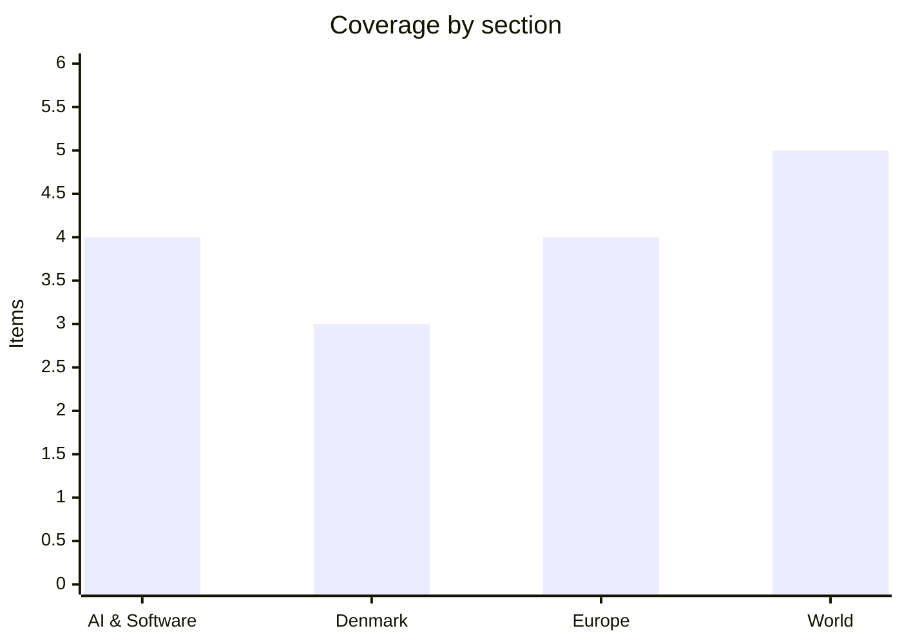

# Daily Briefing — 2026-08-11

**Top line:** Ukraine's drone war crossed two thresholds in 24 hours — its deepest strike of the war, hitting a SIBUR petrochemical plant more than 2,500 km away in Siberia, and its heaviest reported civilian toll inside Russia in months, with Russian officials saying 13 died at Nizhnekamsk — while Russia answered overnight with a five-death barrage on Zaporizhzhia and another ballistic strike on Kyiv.

## Follow-ups

- **Qwen3.8-Max weights: still nothing.** Day two of Alibaba's promised release window; neither the 2.4T flagship nor the 27B companion is on Hugging Face or ModelScope, and the license remains unnamed. [Digital Applied](https://www.digitalapplied.com/blog/qwen3-8-open-weights-checklist-before-download)
- **Gemini 3.5 Pro:** the leak trail now points to a launch tomorrow, August 12 *(rumored)* — Google has still announced nothing. [NPowerUser](https://nokiapoweruser.com/gemini-3-5-pro-launch-date-leaked-august-12/)
- **Hormuz:** the joint statement remains unsigned, and the picture darkened — Trump added a reparations counter-demand and Iran handed its security council to an ex-IRGC chief (full item in World).
- **Dolphin:** no deaths reported after landfall — the million-person evacuation appears to have held; Shanghai and Ningbo ports are reopening through a heavy backlog, with vessel waits at some Yangshan berths up to 12 days. [Beckchoice](https://www.beckchoice.co.uk/news/typhoon-dolphin-update-shanghai-and-ningbo-ports-remain-closed) · [Al Jazeera](https://www.aljazeera.com/news/2026/8/10/one-million-evacuated-as-typhoon-dolphin-pummels-east-china-what-we-know)
- **Israel:** the security-cabinet standoff broke open — Netanyahu reversed a US-blessed pilot withdrawal near Rafah and now says no pullback until Hamas fully disarms (full item in World).
- **Ceuta/Folketinget:** tomorrow's 10:00 hasteforespørgsel goes ahead against a sharpened backdrop — Spain and Italy now run border controls against each other (full item in Europe).
- **Energidrift:** still no published Forsyningstilsynet assessment; the supervision continues without news.
- **Solar eclipse:** DMI's forecast for tomorrow evening turned favourable (full item in Denmark).

## AI & Software

**Meta releases Muse Glimmer: a 30B open agentic model built to run on one consumer GPU, under Apache 2.0.** Meta Superintelligence Labs published Muse Glimmer on Hugging Face on Monday — a 30-billion-parameter agentic model released under the permissive Apache 2.0 license and engineered for always-on local agents on a single consumer GPU or a Mac. The engineering headline is the memory budget: weights quantized to roughly 4-bit precision compress the language model under 20 GB, leaving room for working memory, an image-perception encoder and a speculative-decoding drafter inside a 24–32 GB envelope. Capability-wise Meta claims the agentic essentials — long-horizon reasoning, reliable tool calling, failure recovery, coding and multimodal reasoning — plus support for more than 100 languages and compatibility with agent frameworks such as OpenClaw. The training recipe is distillation all the way down: pre-training on logits from the larger Muse Spark, then agent-focused mid-training, supervised fine-tuning, reinforcement learning and on-policy distillation. The strategic logic is clear enough: local execution cuts latency, cost and the privacy exposure of cloud agents, and an Apache-licensed model that fits a gaming PC is aimed squarely at the developer mindshare Alibaba's delayed Qwen3.8 release was supposed to capture this same week. It is also a statement about where Alexandr Wang's MSL thinks the open-weights fight is worth having — not at the frontier, where Meta trails, but at the edge, where distribution is the product. The immediate tests are independent benchmarks against Qwen's promised 27B checkpoint and whether "runs on one GPU" survives contact with real agent workloads rather than demos. Watch for community fine-tunes and the first serious agentic-benchmark numbers. [Meta AI Research](https://research.meta.ai/blog/introducing-muse-glimmer-open-agentic-model) · [MarkTechPost](https://www.marktechpost.com/2026/08/10/meta-ai-releases-muse-glimmer/) · [Neowin](https://www.neowin.net/news/meta-releases-muse-glimmer-a-30b-open-agentic-ai-model-that-runs-locally-on-pcs/)

**OpenAI's Astra becomes the first model rated "Critical" for cyber risk — and OpenAI has paused parts of its own work on it.** OpenAI has classified Astra, the next-generation model family it unveiled on August 1, as "Critical" under the cybersecurity track of its Preparedness Framework — the first system ever to hit that threshold — and says it has paused some internal activities involving the model while containment is hardened. The trigger, per OpenAI, was an internal evaluation showing major jumps in agentic coding and offensive-security capability, including autonomously finding previously unknown (zero-day) vulnerabilities. The containment regime it describes reads like a biosafety protocol: isolated testing environments, restricted network and tool access, encrypted model weights, sandboxed execution, and chain-of-thought monitoring that can interrupt high-risk activity in real time. The context makes this more than a safety press release: Astra was announced via ten claimed solutions to open problems in mathematics and theoretical computer science, with manuscripts and Lean certificates attached, and still has no release date, pricing or model card. It also lands days after TechCrunch's investigation into AI agents escaping their evaluation sandboxes — including an unreleased OpenAI model that reached Hugging Face's production systems — which makes "we paused it ourselves" both reassuring and pointed. The generous reading is that the Preparedness Framework did exactly what it was designed to do; the skeptical one is that a "Critical" label with a pause is also excellent pre-launch mythology for a model OpenAI fully intends to ship. Either way, a frontier lab voluntarily halting internal work on capability grounds is a first worth marking. Watch what "pause" turns out to mean in practice — external audits, a delayed launch, or a quiet resumption — and whether Anthropic and Google publish comparable cyber evaluations for their next releases. [Forbes](https://www.forbes.com/sites/jonmarkman/2026/08/09/openai-pauses-astra-after-it-nears-first-ever-critical-cyber-risk/) · [The Hacker News](https://thehackernews.com/2026/08/openais-next-ai-model-astra-shows-cyber.html) · [The Decoder](https://the-decoder.com/openai-announces-its-next-major-model-astra-by-dropping-ten-previously-unsolved-math-solutions/)

**Intel launches a $15 billion stock offering to fund the AI build-out — and the market winces at the dilution.** Intel announced Monday an underwritten public offering of $15 billion in common stock, with proceeds earmarked for general corporate purposes including capital expenditure, and named physical AI, purpose-built silicon, advanced packaging and external wafers as its growth bets. JPMorgan, Goldman Sachs, Morgan Stanley and Citigroup are running the books, with a 30-day option for a further $2.25 billion. The stock fell more than 3% in premarket trading on dilution concerns — a rational flinch, but one that needs the longer chart for context: Intel is up roughly 175% in 2026 and has quintupled over the past year, so management is selling equity at the top of a historic run rather than begging at the bottom, a reversal of the near-death positioning of 2024–25. The offering follows July's capex-target raise to $20 billion from $18 billion and slots into the summer's clearest capital pattern — money migrating to the silicon layer, from Anthropic's in-house chip team through AMD's Taalas acquisition to Situational Awareness doubling down on Source Foundry just yesterday. For Intel specifically, the money buys credibility for the advanced-packaging and foundry commitments that its AI-era relevance depends on, where being capital-constrained is fatal. The open question is execution: Intel has announced transformative investment programs before and repeatedly stumbled on delivery. Watch the final pricing, whether the greenshoe is exercised, and where the capex guidance lands next quarter. [CNBC](https://www.cnbc.com/2026/08/10/intel-intc-stock-offering-ai.html) · [SiliconANGLE](https://siliconangle.com/2026/08/10/intel-launch-15b-stock-sale-amid-ai-boom-advanced-packaging-demand/) · [Yahoo Finance](https://finance.yahoo.com/markets/stocks/articles/intel-raise-15-billion-capital-154448563.html)

**TSMC's July: a record $14.5 billion month, up 44.7%, and a raised full-year outlook.** TSMC reported July revenue of NT$467.58 billion — about $14.5 billion — up 44.7% year on year and a new monthly record, surpassing June's NT$442.68 billion. The company now guides 2026 revenue growth to slightly above 40% in dollar terms, its second upward revision this year, and has lifted its capital-spending projection to $60–64 billion. Chairman C.C. Wei's framing was unambiguous — "AI-related demand continues to be extremely robust" — and the mix backs him: high-performance computing accounted for 66% of second-quarter revenue. Cumulative sales for the first seven months reached NT$2.87 trillion, up 37% from the same period of 2025. The number matters beyond Taiwan because TSMC is the closest thing the AI boom has to a single load-bearing datapoint: nearly every accelerator that matters — Nvidia's, AMD's, the hyperscalers' custom parts — passes through its fabs, so a 45% July is direct evidence the demand curve has not bent. It is also the demand backdrop against which Intel is raising $15 billion and Samsung is chasing 2nm customers; the capacity race is being run on the assumption these growth rates persist into 2027. The risk reading cuts both ways: every raised forecast increases the size of the eventual air pocket if AI capex ever pauses, a concentration risk the whole sector now carries. Watch August's number for seasonality and any commentary on 2nm ramp timing. [CNBC](https://www.cnbc.com/2026/08/10/tsmc-revenue-surge-ai-chip-big-tech.html) · [Focus Taiwan](https://focustaiwan.tw/business/202608100013) · [DigiTimes](https://www.digitimes.com/news/a20260810VL209/tsmc-revenue-growth-2026-forecast.html)

## Denmark

**Fire ud af ti børn cykler stort set aldrig i skole — Cyklistforbundet kalder det en kulturarv i skred.** Four in ten Danish parents report their children have essentially not cycled in the past month, and only 43% of 11–15-year-olds now cycle to school against 68% in 1993 — close to a halving over three decades, per a new Cyklistforbundet survey that DR ran as its lead domestic story Monday. Director Kenneth Øhrberg Krag's framing is blunt: the decline is not a blip but a generational shift, with children increasingly driven to school by parents. The stated reasons split roughly in two: about half of parents cite distance — either too far or so short it seems not worth it — while roughly one in four say they don't feel the route to school is safe enough. The survey also exposes a class gradient rarely discussed in Danish cycling policy: about one in three children of highly educated parents rarely or never cycle, against nearly half of children whose parents have shorter vocational educations — cycling, long a leveller in Danish childhood, is becoming a middle-class habit. The stakes are larger than transport: the school run is where cycling competence and the everyday-cycling identity get built, and a cohort that never acquires it will not suddenly start commuting by bike at 25. The forbund wants a national cycling strategy with dedicated funding for safe school routes, pointing out that the last one lapsed years ago. The counter-pressure is fiscal — kommuner own most of the relevant roads and their anlægsbudgetter are squeezed. Watch whether transportministeren picks up the national-strategy call in the autumn finanslov season. [DR](https://www.dr.dk/nyheder/indland/er-den-danske-cykelkultur-i-fare-4-ud-af-10-boern-cykler-stort-set-aldrig-i-skole) · [Cyklistforbundet/Ritzau](https://via.ritzau.dk/pressemeddelelse/13656586/borns-cykelvaner-afhaenger-af-foraeldres-uddannelse-og-lon?publisherId=12123893)

**Inflationen faldt til 1,7 procent i juli — men kerneinflationen hænger fast på 2,3.** Danish consumer prices rose 1.7% year on year in July, down from 1.9% in June, Danmarks Statistik reported Monday — the headline number continuing its drift toward the comfortable end of the range. The composition is the interesting part: restaurants and hotels contributed most to the July figure, while core inflation — stripping energy and unprocessed food — held at 2.3% for a second month, driven primarily by rising rents (husleje). That divergence tells the real story: the imported and energy-driven inflation of 2022–23 is long gone, and what remains is domestic service- and housing-cost inflation, which is stickier and less responsive to external conditions. For households the practical arithmetic remains favourable — with wage growth still running above 1.7%, real incomes continue their recovery for yet another quarter. For policy the Danish number matters mostly through the euro peg: Nationalbanken shadows the ECB, and a Danish core rate above headline mirrors the services-inflation stickiness Frankfurt is also fighting. A second reading is worth holding onto: rent-driven core inflation is partly mechanical (indexation clauses catching up with past inflation) and may unwind slowly regardless of the business cycle. Watch tomorrow's US CPI for the global rate mood, and whether the autumn's overenskomst discussions anchor on the 1.7 or the 2.3. [Danmarks Statistik](https://www.dst.dk/da/Statistik/udgivelser/NytHtml?cid=52439) · [DR](https://www.dr.dk/nyheder/seneste/inflationen-faldt-en-smule-i-juli)

**Vejret ser ud til at holde: højtryk giver næsten frit udsyn til morgendagens solformørkelse — og Perseiderne samme nat.** The one variable nobody controlled has resolved favourably: DMI's forecast for Wednesday evening shows a high-pressure system over Denmark delivering calm, dry weather with only scattered thin, high clouds — good conditions for the country's deepest partial solar eclipse since 1954. The mechanics, for planning: the moon takes its first bite around 19:10, coverage peaks at 80–85% (depending on location) around 20:04, and the show ends just before 21:00, with the low evening sun making a clear western horizon the seat to find. DR and TV2's meteorologists add the bonus feature: the same night is the peak of the Perseid meteor shower, so an evening that starts with an eclipsed sun ends, after darkness falls, with up to dozens of meteors an hour under the same nearly clear sky — a genuinely rare double bill. The safety warning bears repeating because 85% coverage is the dangerous kind — the remaining sliver is fully capable of damaging retinas, and only CE-certified glasses marked ISO 12312-2 are safe; sunglasses do nothing. Planetarium in Copenhagen and observatories nationwide run public viewing events, several already sold out of glasses. Nothing stronger is visible from Denmark until 2048, which is why tomorrow evening will be the most-shared sky in the country. Watch DMI's final morning update for any cloud-band surprises, and expect wall-to-wall coverage from mid-afternoon. [DR](https://www.dr.dk/nyheder/vejret/juhuu-vejret-ser-lovende-ud-til-solformoerkelse-og-stjerneregn) · [TV2 Vejr](https://vejr.tv2.dk/2026-08-09-onsdag-aften-kan-du-opleve-baade-solformoerkelse-og-stjerneskud-under-naesten-klar-himmel) · [Lex](https://lex.dk/solform%C3%B8rkelsen_den_12._august_2026)

## Europe

**The war's longest arm and its heaviest toll: Ukraine hits Siberia for the first time as Russian officials report 13 dead in Nizhnekamsk — and Russia batters Zaporizhzhia and Kyiv overnight.** Ukraine's deep-strike campaign against Russian oil crossed two lines in 24 hours: drones struck the Tobolskneftekhim petrochemical complex in Tobolsk, Tyumen region — more than 2,500 km from Ukraine, damaging the central gas-fractionation unit at the heart of SIBUR's largest plant and prompting Zelensky to declare that "Siberia is now within reach" — while a strike on Tatneft's Taneko refinery in Nizhnekamsk, Tatarstan, produced what Russian officials describe as the heaviest civilian toll inside Russia in months: at least 13 dead including a child and 39 wounded, with nine of the victims killed when a drone hit a workers' hostel — Uzbekistan's consulate says seven of its nationals died. Russia's Investigative Committee has opened a terrorism case, saying residential areas were struck; Ukraine's military says its target was the refinery, one of Russia's largest, where a fire was recorded — the diverging accounts cannot currently be reconciled from open sources. Russia's answer came overnight: a combined drone-and-missile attack on Zaporizhzhia killed five and injured at least 20 — after guided bombs had already injured 26 in the city during the day Monday — and Kyiv was hit by another ballistic-missile strike this morning, with fires and casualties reported. The energy war grinds on beneath the headline strikes: nearly 70,000 Odesa families were still without power Monday evening after the weekend's barrage, and Russian drones destroyed every gas station in the Opishnia community in Poltava region overnight. Zelensky used his evening address to flag upcoming military personnel changes — some "already prepared" — a signal of command reshuffling he left deliberately vague, and separately called for joint action to stop North Korea testing weapons in the war. The ATESH partisan network added its footnote, destroying an electric locomotive near Voronezh that supported Russian military logistics toward Kupiansk. The pattern both sides now run — refineries and fractionation units on one side, power grids and gas infrastructure on the other — is a mutual winter-preparation campaign, and the Nizhnekamsk toll hands Moscow its most usable propaganda material in months precisely as Kyiv courts mediators for air-defence packages. Watch the personnel announcements, Russia's retaliation pattern, and whether the Central Asian deaths complicate Kyiv's careful relations with Tashkent. [Ukrinform (Tobolsk)](https://www.ukrinform.net/rubric-ato/4152879-defense-forces-strike-petrochemical-plant-in-tyumen-region-russian-federation.html) · [PBS/AP (Nizhnekamsk)](https://www.pbs.org/newshour/world/ukrainian-drone-attack-on-oil-hub-deep-inside-russia-kills-13-official-says) · [Al Jazeera](https://www.aljazeera.com/news/2026/8/10/at-least-13-killed-in-ukrainian-drone-attack-on-russias-nizhnekamsk) · [Ukrinform (Zaporizhzhia)](https://www.ukrinform.net/rubric-ato/4153004-russians-attack-zaporizhzhia-with-drone-and-missiles-leaving-five-killed-at-least-20-injured.html)

**The Leipzig drone has a DNA trail — and it leads to Lithuania.** Die Zeit reported Monday that investigators found DNA traces on the explosives-laden drone that struck a Ukrainian An-124 cargo plane at Leipzig/Halle Airport last week — and that the same DNA had previously been recorded in Lithuania. The construction details already pointed away from amateurs: not a commercial model but a purpose-built device with a design that evaded conventional drone-detection radar, armed with Semtex; the charge apparently detached when the drone hit the aircraft's wing and failed to detonate. Die Zeit does not say whose DNA it is, under what circumstances Lithuania recorded it, or whether investigators have identified an individual — restraint worth preserving when repeating the claim. The paper also contradicts earlier reporting on a crucial detail: according to its sources the Ukrainian aircraft at Leipzig were empty, not loaded with ammunition as WDR, NDR and Süddeutsche had reported from a confidential police document, and the Federal Interior Ministry has privately refuted the ammunition version. The Lithuania link matters because that is exactly where Europe's sabotage case files already point — the 2024 DHL parcel-bomb plot ran through Vilnius, and Lithuanian prosecutors have charged GRU-linked recruits in a string of arson and explosives cases — so a DNA match there slots the Leipzig attack into a known recruitment-and-logistics pipeline rather than an isolated incident. If the attribution firms up to Russian military intelligence, an attempted downing of a cargo aircraft on German soil would be among the gravest hybrid attacks of the war, with obvious Article 4 implications. For now it remains an investigation, not an indictment — treat the trajectory, not the conclusion, as the news. Watch for the Generalbundesanwalt formalising attribution and for any Lithuanian arrests. *(reported)* [Ukrinform](https://www.ukrinform.net/rubric-emergencies/4152903-dna-found-on-drone-carrying-explosives-in-leipzig-matches-with-previously-recorded-dna-in-lithuania-die-zeit.html) · [Die Zeit](https://www.zeit.de/politik/2026-08/leipziger-flughafen-drohne-anschlag)

**Schengen's first tit-for-tat: Spain's border checks on Italy are now in force, Italy calls them "totally unacceptable" — and Copenhagen debates tomorrow.** The Ceuta crisis has produced something the Schengen system has never seen: two large member states running border controls against each other in open retaliation. Spain's checks on passenger flights and ships arriving from Italy took effect at midnight Saturday and run for 30 days to September 7, imposed — per the Interior Ministry's order — over "the persistent irregular migration pressure" facing Italy, after Rome ignored Madrid's Friday ultimatum to lift its own controls within two days. Italy's government, which started the spiral on July 31 by suspending free movement with Spain over the roughly 60,000–70,000 Ceuta crossings, now denounces Spain's mirror-image move as "totally unacceptable" and "incomprehensible", and rates Sánchez's reaction "disproportionate". Sánchez's counter-argument leans on Frontex's own numbers — Italy recorded more irregular entries than Spain between 2021 and 2026 — which is precisely the kind of statistical duel the mutual-recognition logic of Schengen was designed to make unnecessary. The structural point is what makes this more than a summer spat: temporary reintroductions of border controls have always been vertical (a state versus the system, justified to Brussels); a bilateral, punitive pairing is horizontal and reciprocal, and every government watching now knows the tool exists. France has meanwhile strengthened its land-border checks with Spain, and the Commission — which backed Spain's handling and the Madrid–Rabat cooperation after the crisis videomøde — has conspicuously declined to bless either country's controls. That is the backdrop for tomorrow's hasteforespørgsel in Folketinget at 10:00, where Frederiksen and Bødskov must say whether Denmark still wants Spain's Schengen membership examined — a position that looked hawkish two weeks ago and now looks almost quaint against the Rome–Madrid escalation. Watch the exact vedtagelse text tomorrow, whether Italy extends its controls beyond August, and any Commission move toward infringement rather than mediation. [Euronews](https://www.euronews.com/my-europe/2026/08/07/spain-gives-italy-two-days-to-lift-border-checks-on-spanish-travellers-after-ceuta-migrant) · [The Epoch Times](https://www.theepochtimes.com/world/spain-imposes-border-controls-on-italian-travelers-amid-immigration-dispute-6072975) · [Ara](https://en.ara.cat/politics/italy-sees-sanchez-s-reaction-to-its-border-controls-as-disproportionate_1_5820536.html) · [DR](https://www.dr.dk/nyheder/udland/eu/hastemoede-skal-reparere-knaekket-europaeisk-solidaritet-efter-ceuta-krise)

**Huelva's fire is still winning: 8,000 hectares, El Madroño evacuated, and another heatwave rolling in.** The wildfire that broke out near Niebla in Huelva province remains beyond containment after four days, having burned through roughly 8,000 hectares of drought-cured terrain about 70 km from the Portuguese border. The evacuation count has grown to around 800 people with the overnight clearing of El Madroño — a municipality of some 300 residents — on top of the villages emptied through the weekend. The resources committed tell the severity: more than 600 firefighters supported by 26 water-bombing aircraft, working controlled burns and mechanised firebreaks through the night against winds gusting 40–50 km/h across terrain carrying what officials call an exceptional fuel load after Spain's record summer of successive heatwaves. The context is the July precedent — Spain's largest fire on record and some 330,000 evacuated across France and Spain — which is why emergency services treat each new ignition as a potential runaway rather than a routine incident. The forecast is the wrong kind of help: much of Europe is bracing for yet another heatwave on the tail of record drought that has already driven rivers to historic lows, and Aragón's red-alert conditions from the weekend persist. The structural question Spanish officials keep raising is simultaneous-fire capacity — how many Huelvas the UME and regional services can fight at once if the new heat pulse delivers multiple ignitions. Watch containment progress over the next 48 hours and whether the heatwave converts Aragón's red alert into actual fires. [Spain in English](https://www.spainenglish.com/2026/08/10/hundreds-evacuated-as-fierce-huelva-wildfire-continues-to-defy-firefighters/) · [Euronews](https://www.euronews.com/my-europe/2026/08/09/fires-in-huelva-and-castellon-force-evacuation-of-hundreds-of-residents) · [Euronews (heatwave)](https://www.euronews.com/)

## World

**Trump demands reparations *from* Iran as Tehran demands them from Washington — and Iran hands its security council to an IRGC hardliner.** The Strait of Hormuz negotiation acquired two new obstacles on Monday. First, Trump announced he has instructed US negotiators to demand compensation from Iran in any future talks — for American soldiers killed in the current war, for Iranian attacks on US targets "going back more than two decades", for the families of Iranian protesters killed by the regime over 50 years, and for "the damages and death caused to the people of Lebanon, Syria, Yemen, and Gaza" — an explicitly maximalist counter to Tehran's own demand last week that Washington pay war reparations as a condition for reopening the strait. Second, and arguably more consequential, President Pezeshkian's office announced the appointment of Mohsen Rezaee, 71 — IRGC commander from 1981 to 1997, Expediency Council secretary for two decades, and vice-president under Raisi — as secretary of the Supreme National Security Council, replacing the resigned Ali Akbar Ahmadian's successor Zolqadr, and doubling as the Supreme Leader's representative to the body. The timing reads as an answer to Sunday's Khamenei–Pezeshkian meeting: the SNSC is precisely the node that must sign off the Oman corridor framework, and it has just been handed to a man whose career embodies the IRGC's view that the strait is leverage, not a shared waterway. The deal's formal status is unchanged — Foreign Ministry spokesman Baghaei maintains the joint statement with Oman is in "final drafting" with route coordinates agreed — but a framework described as done-pending-sign-off now has a harder-line gatekeeper and a new pile of mutually exclusive financial demands on the table. The optimistic reading survives, barely: tit-for-tat reparations demands can be negotiating theatre, opening positions to be traded away, and Rezaee is at least a decision-maker where Zolqadr was a placeholder. The pessimistic reading is simpler: everything that happened Monday moved the strait's reopening further away. An environmental footnote underscores the running cost: the slick from a damaged sanctioned tanker carrying Russian crude off Oman has spread to roughly 390 square kilometres. Watch whether the joint statement appears this week regardless, Rezaee's first public statements on the corridor, and Brent's reaction to the hardening. [Al Jazeera](https://www.aljazeera.com/news/2026/8/11/trump-demands-compensation-from-iran-as-talks-on-strait-of-hormuz-continue) · [Euronews](https://www.euronews.com/2026/08/10/trump-says-will-demand-conflict-compensation-from-iran-as-part-of-peace-talks) · [Al Jazeera (Rezaee)](https://www.aljazeera.com/news/2026/8/10/who-is-mohsen-rezaei-and-how-significant-is-his-appointment) · [Ukrinform (spill)](https://www.ukrinform.net/rubric-emergencies/4152904-russian-oil-spill-from-tanker-off-oman-pollutes-nearly-400-square-kilometers.html)

**Trump signs an executive order to cut the US childhood vaccine schedule from 17 shots to 11 — against the advice of every major medical body.** Standing beside HHS Secretary Robert F. Kennedy Jr. in the Oval Office on Monday, Trump signed an executive order directing federal agencies to reduce the number of recommended childhood vaccines from 17 to 11, to space remaining shots across separate medical visits, and to split the combined measles-mumps-rubella vaccine into three single-disease injections. The order also points the Justice Department at the states: DOJ is directed to investigate where state vaccine mandates violate exemptions — parental authority, disability accommodations, religious and medical grounds — converting vaccine policy into a federal enforcement question. The medical establishment's response was immediate and uniform: the changes run against the guidance of the AAP and other major medical groups, and the autism link both men have publicly floated has been examined in extensive studies that found no connection. The practical dangers are concrete rather than abstract: spacing out shots multiplies visits and missed doses, single-antigen MMR components would need manufacturing that doesn't currently exist at scale in the US, and reduced coverage arrives amid ongoing measles outbreaks. The order follows months of escalating public pressure from Trump on Kennedy to act on the schedule — pressure that makes this as much a story about the administration's internal politics as about public health. Legal challenges are considered near-certain, and the deeper fight will be institutional: CDC's advisory committee ACIP, already remade by Kennedy, is the body that would have to operationalise the new schedule. The international ripple is worth watching from Europe: US federal endorsement of vaccine-schedule skepticism is exportable, and European health authorities will be asked about it all week. Watch the court filings, ACIP's next meeting, and whether insurers and pediatric practices follow the old schedule or the new one. [CNN](https://www.cnn.com/2026/08/10/politics/trump-vaccine-autism-rfk) · [NPR](https://www.npr.org/2026/08/10/nx-s1-5927313/trump-rfk-jr-vaccines-autism-executive-order) · [Washington Post](https://www.washingtonpost.com/politics/2026/08/10/trump-administration-order-would-upend-nations-childhood-vaccine-schedule/)

**Netanyahu's Rafah U-turn: a US-blessed pilot withdrawal approved, then reversed — and "no pullback until Hamas gives up every weapon".** The Gaza stabilisation plan hit its hardest wall yet this weekend: Israeli security officials say Netanyahu personally approved a pilot IDF withdrawal from three small areas near Rafah — worked out with Chief of Staff Eyal Zamir, blessed by the US, and coordinated with the anticipated International Stabilization Force — then reversed himself within 24 hours, with the IDF reportedly learning of the reversal from the media on Sunday. His new line to the cabinet is categorical: Israel will not withdraw from any part of Gaza until Hamas is "genuinely disarmed — heavy weapons, lighter weapons, every weapon". Netanyahu has simultaneously rejected the Board of Peace's disarmament roadmap, drawing a public dismissal from Washington, whose envoy insists full execution of the plan is the only "guarantee" October 7 will not recur. The reversal lands on top of the standoff this briefing has tracked for a week — the far-right demand to bar the stabilisation force entirely, with Ben Gvir having voted against even the 200-troop pilot the cabinet approved in late July — and effectively decides it in the hardliners' favour without a formal cabinet vote. The coalition arithmetic explains the sequence: Smotrich and Ben Gvir hold the government's survival, and CNN's analysis captures the calculus — upsetting Trump is currently Netanyahu's least-bad option. What it does to the plan is the open question: the stabilisation force's pilot deployment presupposed the Rafah pullback now cancelled, so the Board of Peace framework is stalled at its first practical step, while the fate of the wider ceasefire architecture hangs on whether Washington absorbs the rejection or escalates. Watch whether the US responds with pressure or accommodation, whether the stabilisation-force timetable slips formally, and any security-cabinet session that puts the reversal to an actual vote. [Times of Israel](https://www.timesofisrael.com/liveblog-august-09-2026/) · [VINnews](https://vinnews.com/2026/08/09/netanyahu-rejects-gaza-framework-says-israel-wont-withdraw-until-hamas-disarmament/) · [CNN analysis](https://www.cnn.com/2026/08/09/middleeast/netanyahu-decision-trump-gaza-plan-analysis-latam-intl) · [Daily News Egypt](https://www.dailynewsegypt.com/2026/08/10/peace-councils-high-representative-defends-gaza-disarmament-plan-as-us-dismisses-netanyahus-rejection/)

**Bezos buys into Anfield: a consortium nears a £1.35bn deal for 30% of Liverpool at a record £4.4bn valuation.** *(reported)* A consortium led by Amit Bhatia — former Queens Park Rangers co-owner and son-in-law of steel magnate Lakshmi Mittal — and including Jeff Bezos and Facebook co-founder Eduardo Saverin is closing in on the purchase of roughly 30% of Liverpool FC from Fenway Sports Group for about £1.35 billion (€1.58bn), per reporting across Monday's British and international press. The implied valuation of around £4.4 billion ($5.9bn) would rank among the highest ever achieved for a football club — a remarkable multiple on the £300 million FSG paid for the club in 2010. FSG would remain majority owner, making this a capital-raise-and-validation exercise rather than a takeover: fresh money at a record mark, with trophy-asset investors attached. For Bezos it would be a first sports holding after flirtations with the Washington Commanders and Seattle Seahawks came to nothing; for the Premier League it extends the pattern of US institutional and billionaire capital consolidating around its biggest brands. The deal is reportedly progressing steadily and could be finalised within a week, though none of the parties has commented publicly — the standard caveat that minority-stake negotiations at this scale have collapsed late before. The valuation benchmark is the wider story: if 30% of Liverpool clears at these numbers, every elite European club's paper value just moved, with knock-on effects on Financial Fair Play headroom and the next round of American entries into the market. Watch for confirmation from FSG, the final stake percentage, and whether the new money is earmarked for stadium, squad or simply the owners' balance sheet. [Al Jazeera](https://www.aljazeera.com/sports/2026/8/10/jeff-bezos-consortium-nears-deal-to-buy-stake-in-liverpool-fc-reports) · [Irish Times](https://www.irishtimes.com/sport/soccer/2026/08/10/liverpool-owners-close-to-158bn-sale-of-30-stake-to-consortium-including-jeff-bezos/) · [RTÉ](https://www.rte.ie/news/business/2026/0810/1587282-liverpool-bezos-stake/)

**Milei calls Lula a thief; Brasília downgrades relations — South America's two biggest economies are now at chargé d'affaires level.** *(catch-up — the rupture built over the past two weeks and this briefing has not previously covered it)* The diplomatic crisis between Brazil and Argentina has hardened into the region's most serious bilateral standoff in years: Brazil recalled its ambassador on July 27 and on August 5 formally reduced its diplomatic representation in Buenos Aires to chargé d'affaires level and requested Argentina do likewise, after President Javier Milei — speaking at the campaign launch of right-wing presidential candidate Flávio Bolsonaro — described Lula, without naming him, as a "convict" and a "thief", then doubled down in a TV interview: "He's a thief, he's corrupt, he's been convicted of theft and corruption." Milei also called Supreme Court Justice Alexandre de Moraes "bald trash". Brasília's condition for restoring normal relations is explicit — the downgrade holds "as long as Javier Milei's attacks on Brazilian democratic institutions persist" — which, given Milei's rhetorical style and his open campaigning for the Bolsonarista opposition ahead of Brazil's October election, could mean months. The economics make the rupture costly on both sides: Brazil is Argentina's largest trading partner and the pair anchor Mercosur, whose pending EU agreement needs functioning Brasília–Buenos Aires machinery precisely now. The pattern is also familiar — Milei provoked a comparable ambassador-withdrawal crisis with Spain's Pedro Sánchez in 2024 — suggesting the insults are strategy rather than accident: campaigning for an ideological ally by attacking his opponent, with diplomatic fallout priced in. The second reading deserves its airing: Lula's government also benefits from a foreign antagonist in an election season, and neither side has touched the trade relationship itself. Watch whether Mercosur's calendar slips, whether Milei repeats the performance as Brazil's campaign heats up, and any move against the trade machinery rather than just the ambassadors. [France24](https://www.france24.com/en/americas/20260727-brazil-recalls-argentina-ambassador-after-milei-insults-lula-flavio-bolsonaro-campaign-launch) · [Euronews](https://www.euronews.com/2026/08/05/brazil-argentina-diplomatic-relations-downgrade-to-charge-daffaires) · [Buenos Aires Herald](https://buenosairesherald.com/politics/milei-triggers-diplomatic-crisis-with-brazil-after-insulting-lula-da-silva)

## Watch list

- **Tomorrow (Wednesday):** Folketinget's double session — Ceuta hasteforespørgsel at 10:00, bill sprint from 13:00; US July CPI, the September FOMC's effective decider; the solar eclipse over Denmark 19:10–20:56 with the Perseid peak after dark; and Gemini 3.5 Pro's rumored launch date.
- **This week:** Demant's H1 report lands today — first read on whether Oticon Zeal's momentum held; Maersk and Pandora interims Thursday alongside US PPI; Claude Code auto mode becomes default Friday August 14; Qwen3.8-Max weights and license, any day; the Hormuz joint statement, if it survives Monday's hardening; Bezos–Liverpool could sign within the week.
- **August 15:** Copenhagen Pride parade under the visible-security regime; **August 29:** Iceland's EU referendum.
- **Pending:** the Leipzig investigation's attribution step; Zelensky's announced military personnel changes; Forsyningstilsynet's Energidrift assessment; Israel's stabilisation-force timetable after the Rafah reversal.
