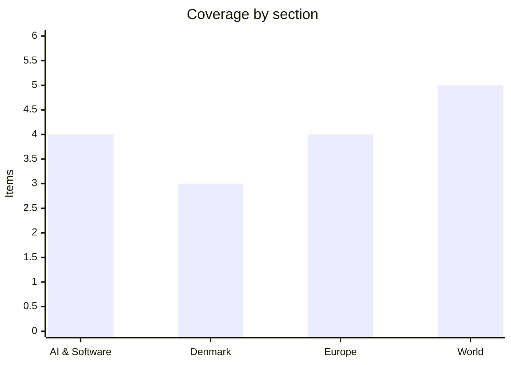

# Daily Briefing — 2026-08-12

**Top line:** Colombia's strongest earthquake in decades — a 7.4-magnitude strike in Chocó on Monday — has killed at least 224 people with rescuers still unable to reach the epicentre, handing President Abelardo de la Espriella a national catastrophe days into his term.

## Follow-ups

- **Gemini 3.5 Pro / Made by Google:** still no launch — but the rumored window is now. Google's Pixel 11 event runs tonight at 15:00 PT (midnight CEST), and the leak trail points to a Gemini 3.5 Pro release between today and Friday *(rumored)*. [Benzinga](https://www.benzinga.com/news/26/08/60981812/googl-stock-declined-last-month-on-gemini-3-5-pro-launch-delay-reports-prediction-market-is-now-betting-on-this-date) · [Android Central](https://www.androidcentral.com/phones/live/made-by-google-2026-launch-live-pixel-11-pixel-11-pro-fold-pixel-watch-5-gemini-and-all-the-news)
- **Intel upsized its offering from $15bn to $20bn** less than a day after announcing it — 210.5 million shares at $95 for roughly $19.7bn in net proceeds. [Tech Startups](https://techstartups.com/2026/08/11/top-tech-news-today-august-11-2026-anthropic-intel-meta-openai-nvidia-unitree-more/)
- **Qwen3.8-Max weights: day three, still nothing** on Hugging Face or ModelScope, and still no license named. [Neomanex](https://neomanex.com/news/qwen38-max-open-weights-countdown-aug-2026)
- **Demant's H1 landed Tuesday:** the hearing business held up and shares closed +2.6% at 284.20 kr (+33% YTD) — thin analyst detail in public coverage so far. [Audiology Worldnews](https://www.audiology-worldnews.com/world-news/market/4878-demant-s-healthy-h1-hearing-business-is-at-the-heart-of-its-interim-financial-report/) · [NPinvestor](https://npinvestor.dk/aktier/markedsoverblik/)
- **Hormuz:** the joint statement remains unsigned; Araghchi's Sunday conditions (sanctions relief plus reparations) still stand, and Brent held near $88 after Monday's ~5% jump. [Al Jazeera](https://www.aljazeera.com/economy/2026/8/10/oil-prices-climb-as-iranian-demands-cloud-outlook-for-strait-of-hormuz)
- **Bezos–Liverpool:** FSG has reportedly struck the agreement with the Bhatia-led consortium; a formal announcement could come this week *(reported)*. [Football365](https://www.football365.com/news/liverpool-fsg-sale-amazon-founder-jeff-bezos-amit-bhatia)
- **Zelensky's flagged personnel changes:** no announcements yet.
- **Solar eclipse tonight:** DMI's favourable forecast held — near-cloudless skies for the 19:10–20:56 partial eclipse (80–85% coverage), and the Perseids peak after dark with up to 100 meteors an hour under a moonless sky. [DR](https://www.dr.dk/nyheder/vejret/juhuu-vejret-ser-lovende-ud-til-solformoerkelse-og-stjerneregn) · [TV2](https://vejr.tv2.dk/2026-08-09-onsdag-aften-kan-du-opleve-baade-solformoerkelse-og-stjerneskud-under-naesten-klar-himmel)

## AI & Software

**Nvidia recruits Wall Street's six biggest names to mobilize $500 billion for AI infrastructure — financing itself becomes part of the stack.** Nvidia announced partnerships with Apollo Global Management, BlackRock, Blackstone, Brookfield, Goldman Sachs and KKR to establish AI compute infrastructure financing platforms intended to mobilize more than $500 billion of third-party capital. The agreements are memorandums of understanding, not committed funds: the six firms would channel institutional money to independent platforms building data centres, power systems and chip deployments based on Nvidia hardware, keeping the debt off Nvidia's own balance sheet. Jensen Huang told CNBC he approached exactly six firms and none turned him down. The scale matches the problem: Morgan Stanley estimates hyperscalers could spend roughly $3.5 trillion between 2026 and 2028, and the wider AI build-out could exceed $8 trillion — sums that neither corporate cash flows nor conventional project finance can carry alone. The strategic shift is significant: Nvidia moves from selling accelerators to orchestrating how its customers' purchases get funded, effectively removing capital access as a constraint on demand for its own products. That is also the uncomfortable reading — the arrangement intensifies the circular-financing debate, where the supplier of AI infrastructure becomes entangled in financing the buyers of that infrastructure, a pattern critics compare to vendor financing in past capex booms. It lands in a week thick with the same theme: Intel upsizing its equity raise to $20 billion, and Riot Platforms signing a $9.1 billion compute deal (below). Watch which projects the platforms fund first, and whether the other chipmakers respond with financing vehicles of their own. [Nvidia Newsroom](https://nvidianews.nvidia.com/news/nvidia-partners-with-apollo-blackrock-blackstone-brookfield-goldman-sachs-and-kkr-to-establish-ai-compute-infrastructure-financing-platforms-to-mobilize-over-500-billion-of-third-party-capital) · [Bloomberg](https://www.bloomberg.com/news/articles/2026-08-10/nvidia-to-team-with-wall-street-on-500-billion-package-ft-says) · [Yahoo Finance](https://finance.yahoo.com/technology/ai/articles/nvidia-partners-apollo-blackrock-others-150200750.html)

**OpenAI launches GPT-5.6-Cyber for vetted defenders — the flip side of the Astra pause.** OpenAI released GPT-5.6-Cyber, a specialised cybersecurity model available only to approved security professionals, alongside an expansion of its Daybreak programme into two tiers: Daybreak Blue gives vetted defenders access to general models like GPT-5.6 Sol with fewer system-level restrictions, while Daybreak Red unlocks the new model for advanced offensive-security research. Built on GPT-5.6 Sol, the Cyber variant was trained to perform on exactly the tasks consumer models refuse — finding zero-day vulnerabilities, constructing exploit chains, authentication bypass, privilege escalation — and OpenAI says testing showed it responding to 95% of advanced security requests. Access requires identity verification, account security measures, monitoring and legal declarations. The timing is the story: days ago OpenAI classified its upcoming Astra model as potentially "Critical" on the cybersecurity track of its Preparedness Framework and paused internal work that did not meet strengthened security requirements — the first time a frontier lab has slowed its own model on cyber grounds. Releasing a defender-only exploit-development model while pausing the frontier model completes a deliberate policy: OpenAI's stated logic is that the window in which defenders can adopt AI faster than attackers is narrowing, and that withholding capability from vetted security teams no longer makes anyone safer. The obvious risk is that "vetted" is a process, not a guarantee, and every added access tier is an added leak surface. Anthropic and Google run comparable security programmes, so expect competitive escalation in exactly this dual-use zone. Watch for the first public research produced with the model, and whether the Astra pause resolves into external audits or a quiet resumption. [OpenAI](https://openai.com/index/expanding-daybreak-as-the-cyber-defense-window-narrows/) · [The Decoder](https://the-decoder.com/openai-launches-gpt-5-6-cyber-to-help-defenders-find-vulnerabilities-before-attackers-do/) · [Axios](https://www.axios.com/2026/08/10/openai-gpt-astra-restrictions-safety-hacking-defenders)

**Anthropic will watermark all Claude output — invisible text marks plus C2PA metadata, globally.** Anthropic announced it is embedding machine-readable provenance signals in content generated by Claude: an invisible watermark woven into text that the company says can survive copy-paste and some light editing, and cryptographically signed C2PA metadata attached to supported image files (SVG, PNG, JPG). The immediate driver is regulatory — the EU AI Act's transparency rules for AI-generated content took effect August 2, and Claude models launched in the EU from that date support marking from release — but Anthropic says the system applies globally, not only in Europe. Text watermarking has long been generative AI's hardest provenance problem, because plain text carries no metadata layer; the watermark is statistical, designed to be invisible to readers while detectable by authorised tools. Anthropic is careful about the claims: the marks indicate AI involvement rather than proving authorship, heavy rewriting or translation can weaken the signal, and C2PA metadata can be stripped by format conversion or screenshots. Detection tooling is expected to become available to third parties, which is where the consequences get interesting — publishers, universities and enterprises would gain a concrete signal for identifying Claude-generated material at scale. For a developer audience the practical question is what "authorised detection tools" means for building on the API, and whether watermarked output changes behaviour in downstream pipelines. If it proves robust, model-level watermarking becomes a de facto industry standard the other labs will be pressed to match; if it proves brittle, it becomes a compliance checkbox. Watch for the detection tools' release terms and the first independent robustness tests. [The Decoder](https://the-decoder.com/anthropic-watermarks-all-claude-outputs-globally-with-marks-that-may-persist-through-some-editing/) · [Interesting Engineering](https://interestingengineering.com/ai-robotics/anthropic-claude-text-invisible-watermarks) · [Cybersecurity News](https://cybersecuritynews.com/anthropic-adds-invisible-watermarks/)

**Riot Platforms signs a $9.1 billion, 20-year compute deal with Anthropic — the biggest crypto-to-AI conversion yet.** Bitcoin miner turned infrastructure operator Riot Platforms disclosed a 20-year computing agreement worth $9.1 billion with what it described as a leading frontier AI laboratory, identified in reporting as Anthropic. The deal covers approximately 191 megawatts of computing capacity at Riot's Rockdale, Texas campus, with phased deployment through 2027 and 2028; Riot shares jumped sharply on the announcement. The logic runs on grid arithmetic: mining sites already hold the assets AI labs are starved of — land, substations, grid interconnections, industrial cooling and staff who run large compute estates — and those interconnections take years to obtain from scratch. Converting a bitcoin campus is therefore one of the fastest routes to AI capacity that exists, and it swaps volatile mining revenue for two decades of contracted income. For Anthropic, the deal illustrates the physical scale now required for frontier-model training and growing Claude usage, and it slots into the same infrastructure week as Nvidia's financing platforms and Intel's enlarged raise. It also extends a pattern this briefing has tracked all summer: capital migrating to the compute-and-power layer, with crypto-era assets repriced as AI real estate. The open questions are execution ones — 191 MW of mining shed is not 191 MW of AI-grade data centre, and retrofit costs and timelines will decide the deal's real economics. Watch for which chips fill the halls, and whether other miners land comparable anchor tenants. [Tech Startups (citing Riot's disclosure and Investopedia)](https://techstartups.com/2026/08/11/top-tech-news-today-august-11-2026-anthropic-intel-meta-openai-nvidia-unitree-more/)

## Denmark

**Folketinget mødes kl. 10 til Ceuta-hastedebat — mens et ministerie-notat underminerer DF's Schengen-exit-krav.** The Folketing convenes this morning at 10:00 for the emergency debate (hasteforespørgsel) on the Ceuta crisis and Spain's place in Schengen, directed at statsminister Mette Frederiksen and udlændinge- og integrationsminister Morten Bødskov, with 2 hours and 15 minutes allotted. The debate was forced by Venstre, Dansk Folkeparti, Liberal Alliance, Konservative and Danmarksdemokraterne after Morten Messerschmidt's ultimatum that the government back the Italian proposal to examine Spain's Schengen membership went unmet. The backdrop numbers remain striking: Spanish authorities assess that roughly 72,000 people crossed into Ceuta from Morocco in a few days in late July, of whom about 70,000 have since returned. Into this lands a freshly reported notat from Udlændinge- og Justitsministeriet concluding that DF's escalated demand — pulling Denmark out of Schengen entirely — could *attract* more asylum seekers and migrants rather than fewer; DF rejects the analysis. The European context has moved past the question the debate was called on: Spain and Italy now run reciprocal border controls against each other, both have assured the Commission the measures are temporary, and Finland, the Netherlands, Denmark, Czechia and Sweden have reportedly drifted toward Italy's harder position — making the Commission's June opinions urging nine states to phase out long-running controls look increasingly nominal. For Frederiksen the trap is positional: the government's July line that Spain's Schengen membership deserves examination looked hawkish then, but endorsing it again today means blessing the precedent of bilateral, punitive border controls inside the free-movement zone. The vedtagelse text — what the Folketing actually votes through — is the concrete output to watch, along with whether the government distances itself from both the Italian proposal and DF's exit demand. [DR](https://www.dr.dk/nyheder/seneste/folketinget-er-hasteindkaldt-12-august-om-migrantstroemmen) · [Kristeligt Dagblad](https://www.kristeligt-dagblad.dk/danmark/folketinget-skal-debattere-ceuta-situationen-den-12-august) · [TV2](https://nyheder.tv2.dk/live/kort-nyt)

**Regeringen åbner for olie- og gasjagt i Nordsøen frem mod 2050 — og splitter sit eget bagland.** The S-SF-M-R government is examining whether to extend North Sea oil and gas licences that would otherwise expire in 2042 — potentially to 2050 — a move klima-, energi- og forsyningsminister Lars Aagaard defends with the argument that the government will investigate "whether it might make sense to extend one or more licenses — not for Denmark's sake, but for Europe's", given Europe's continued dependence on fossil fuels and the post-Hormuz energy picture. The examination collides with the 2020 Nordsø-aftale, in which S, V, R, DF, SF and K agreed to end Danish extraction by 2050 and cancelled future licensing rounds, and it sits awkwardly for a coalition that branded itself Denmark's greenest. The split is open: Radikale's climate spokesperson Samira Nawa says the party "cannot in any way compromise with our climate goals", while Konservative back the investigation on energy-security grounds; erhvervsminister Martin Lidegaard — himself Radikale — defends the process as establishing "a proper decision-making basis" on climate, economic and energy-security effects before any decision. The government's framing leans heavily on the geopolitical moment: with Hormuz still closed and European gas storage a live concern, domestic production reads differently than it did in 2020. The counter-reading is equally available: a licence extension decided in 2026 would lock in production infrastructure well past the point Denmark's own climate law demands steep cuts, and campaigners note Denmark spent years marketing the 2050 stop internationally as proof small producers could lead. Watch whether the beslutningsgrundlag lands before finanslov season and whether Radikale's folketingsgruppe forces the question to a coalition showdown. [DR](https://www.dr.dk/nyheder/politik/danmarks-groenneste-regering-holder-doeren-aaben-hente-mere-olie-og-gas-op-fra-nordsoeen) · [Nordjyske/Ritzau](https://nordjyske.dk/nyheder/politik/regeringens-udvidede-olie-og-gasjagt-i-nordsoeen-splitter-aftalepartier/5936230) · [Kristeligt Dagblad](https://www.kristeligt-dagblad.dk/danmark/regeringen-er-klar-til-fortsaette-oliejagt-frem-til-2050)

**Fremtrædende Aalborg-politiker meldt til NSK for fusk med forsikringsselskaber.** Daniel Borup, 34, byrådsmedlem and former Venstre group chairman in Aalborg Kommune, has been reported to the National enhed for Særlig Kriminalitet (NSK) — the national unit handling the most complex economic and cyber crime — accused of misappropriating funds from Plain Insurance, an insurance brokerage, and Plain Technologies, which builds technology for the insurance industry, TV2 Nord reports. The report also alleges mandatsvig (breach of trust): that Borup used insider knowledge from his director role in one company to enter agreements outside it. Both companies sit under Obel & Borup Holding, co-owned by businessman Peter Obel and Borup himself, which gives the case its unusual shape — the complaint concerns a founder allegedly working against companies he part-owns. NSK confirmed receiving the report on May 26; that it surfaces publicly now, via TV2 Nord's reporting, is what makes it news, and no charges have been announced. Borup was a prominent figure in nordjysk politics — young, visible and until recently leading Venstre's byrådsgruppe — so the case lands hard in a party still rebuilding locally after the spring election. The usual caveats apply with force: an anmeldelse is an accusation, not a finding, NSK receives many reports it never converts to charges, and Borup has not been convicted of anything. Watch whether NSK opens a formal investigation and how Venstre i Aalborg handles his byråds-seat in the meantime. *(reported)* [TV2 Nord](https://www.tv2nord.dk/aalborg/fremtraedende-politiker-anmeldt-for-fusk-til-specialenhed-ved-politiet-00380)

## Europe

**Russia's heaviest missile mix of the month: North Korean ballistics and Zircons against Kyiv and Zaporizhzhia — seven dead at the Zaporizhstal steel works.** Russia struck Kyiv and Zaporizhzhia in an overnight barrage that Ukrainian authorities say combined Iskander ballistic missiles, KN-23 ballistic missiles of North Korean origin and Zircon hypersonic cruise missiles — one of the clearest recent confirmations of Pyongyang's munitions in frontline use against Ukrainian cities. The worst single toll was at the Zaporizhstal iron and steel works, one of Ukraine's largest plants, where seven workers were killed and around two dozen injured; Al Jazeera reports at least 12 killed nationwide across the barrage and subsequent strikes. Russia's Defence Ministry described the targets as military-related transport and logistics centres in Kyiv and the steel works in Zaporizhzhia — a claim that, as usual, cannot be reconciled with the civilian casualty pattern from open sources. The strike package continues the mutual escalation this briefing tracked through Monday: Ukraine's deepest-ever strike into Siberia and the deadly Nizhnekamsk refinery attack, answered by Russia with steadily heavier mixed-missile barrages on Ukrainian industrial cities. Zelensky's public claim of North Korean missile use lands two days after he called for joint international action on North Korea's role in the war — the weapons forensics now do his arguing for him. The strategic pattern hardens: Ukraine hits oil refining, Russia hits steel and power, and both are stockpiling leverage and degradation ahead of winter. Ukraine's near-daily refinery campaign has meanwhile produced measurable fuel shortages inside Russia, which is precisely the pressure Kyiv says is meant to force Moscow toward negotiation. Watch whether the KN-23 claim draws formal responses from Seoul or new sanctions moves, and whether Russia sustains this missile tempo or is burning stock it cannot quickly replace. [Kyiv Independent](https://kyivindependent.com/explosions-rock-kyiv-zaporizhzhia-as-russian-ballistic-missiles-strike-cities-across-ukraine/) · [Al Jazeera](https://www.aljazeera.com/news/2026/8/11/russian-attacks-kill-six-in-ukraines-zaporizhzhia) · [Reuters via US News](https://www.usnews.com/news/world/articles/2026-08-11/russia-says-it-struck-military-related-warehouses-and-steel-works-in-overnight-ukraine-strikes)

**Hannover airport closed by a drone overnight as the Leipzig DNA trail firms up: a match to the 2024 DHL arson case.** Germany's drone crisis produced both a new incident and an investigative breakthrough inside 24 hours. Hannover airport suspended operations overnight into Tuesday after a drone sighting — runways closed repeatedly between roughly 03:50 and 05:20, six flights delayed, a freight aircraft diverted — and the investigation went straight to the state-security branch of the criminal police, the unit for politically motivated crime. Meanwhile the Leipzig case advanced: the DNA found on the explosives-carrying drone at Leipzig/Halle produced a hit in a European DNA database, matching a trace from the July 2024 arson attack on the DHL logistics centre at the same airport — the parcel-bomb plot for which five men, including alleged GRU-recruited operatives, have been on trial in Vilnius since spring on charges of terrorism and sabotage on behalf of a foreign power *(reported, per Bild/Euronews; no individual has been identified)*. The Generalbundesanwalt took over the Leipzig case on August 6, alleging attempted explosion and dangerous interference with air traffic; Interior Minister Alexander Dobrindt calls an armed drone at an airport "a new quality of danger", and German press reporting suggests only a technical fault prevented detonation. The systemic numbers explain the alarm: German police logged more than 1,000 suspicious drone flights in 2025, mostly near airports and military sites, with Frankfurt alone recording 45 sightings in eleven months against 17 the year before. The federal response is institutionalising — a joint drone-defence centre in Berlin and a roughly 130-officer federal police unit with jammers and interceptor drones. The DNA link matters because it converts Leipzig from an isolated incident into a node in a known Russian-linked sabotage pipeline running through Lithuania — the same infrastructure, possibly the same hands, two years apart. If the Generalbundesanwalt formalises that attribution, an attempted downing of a cargo aircraft on German soil becomes one of the gravest hybrid attacks of the war, with Article 4 consultations a live option. Watch for arrests, the Vilnius trial's intersection with the new evidence, and whether the drone closures spread to more German airports. [Euronews](https://www.euronews.com/my-europe/2026/08/11/explosive-drone-at-leipzig-airport-whose-dna-trail-is-it) · [LRT](https://www.lrt.lt/en/news-in-english/19/3018041/german-investigators-find-link-between-leipzig-drone-incident-and-lithuania-parcel-case) · [ZDF via Rio Times](https://www.riotimesonline.com/europe-intelligence-brief-tuesday-august-11-2026/)

**The Niebla fire has tripled to 25,000 hectares — Spain's fire season keeps outrunning its firefighters.** The wildfire that broke out near Niebla in Huelva province has now burned through more than 25,000 hectares of eucalyptus, dehesa, scrub and pine — roughly triple the area reported a day earlier — and officials describe it as "still very complex and dangerous" after five days beyond containment. The evacuation picture: 681 people remain displaced, 500 in Huelva province and 181 in Sevilla province, after the overnight clearing of El Madroño and its hamlets added to the weekend's evacuations; preventive measures have touched nearly 800 people in total. The fire began at Raboconejo north of Niebla's old town and has driven its main axis of spread toward the Cuenca Minera and the Sevilla provincial border, feeding on the exceptional fuel load left by Spain's record summer of successive heatwaves and drought. More than 600 firefighters and 26 aircraft remain committed, working firebreaks and controlled burns against gusting winds. The national context is brutal: Spain has close to 200,000 hectares burned this year, the July fire was its largest on record, and another heat pulse is moving across the peninsula this week — the simultaneous-fire capacity question officials kept raising in July is now being answered in practice. Andalucía's emergency services are treating every new ignition as a potential runaway, a posture that itself consumes resources. Watch containment over the next 48 hours, whether the Sevilla-side front forces more evacuations, and whether the new heatwave produces the multi-front scenario the UME has warned about. [Infobae](https://www.infobae.com/espana/2026/08/11/el-fuego-de-niebla-ya-supera-las-25000-hectareas-y-mantiene-a-681-personas-desalojadas-sigue-siendo-muy-complejo-y-peligroso/) · [Tecnobosque](https://tecnobosque.es/analisis-tecnico-incendio-de-niebla-huelva/)

**Tonight: a total solar eclipse crosses Spain at sunset — the continent's biggest shared sky since 1999.** This evening's eclipse gives Europe its first total solar eclipse visible from the continental mainland since 1999: the path of totality crosses northern and eastern Spain and the Balearics shortly before sunset, with roughly 15 million people inside the band and nearly a billion able to see a partial phase; ESA broadcasts live from 19:30 CEST. Mallorca is preparing for exceptional viewing conditions and an influx of eclipse tourism — German public broadcasters are sending live programming and 360-degree cameras — while Spanish authorities manage the less romantic logistics of sunset-hour crowds on west-facing coasts. For Denmark the same event delivers the deepest partial eclipse since 1954: the moon takes its first bite at 19:10, coverage peaks at 80–85% around 20:04, and it ends just before 21:00, with DMI's forecast holding at near-cloudless. The safety point bears one more repetition because a deep partial is the dangerous kind — the remaining solar sliver damages retinas, and only ISO 12312-2 certified glasses are safe. The astronomical double bill is what makes tonight singular: the Perseid meteor shower peaks the same night with the moon below the horizon, meaning up to 100 meteors an hour under dark, clear skies once the eclipsed sun has set. Spain's tourism economics give the event a second reading — the fastest-growing large euro economy has become expert at converting attention into arrivals, and a two-minute celestial coincidence fills hotels — even as the same country fights a 25,000-hectare fire, both facts describing the same climate-stressed summer. Nothing stronger is visible from Denmark until 2048. Watch the evening skies; tomorrow's briefing will note whether the continental cloud forecasts held. [EU/ESA](https://european-union.europa.eu/news-and-events_en) · [Lex](https://lex.dk/solform%C3%B8rkelsen_den_12._august_2026) · [DR](https://www.dr.dk/nyheder/vejret/juhuu-vejret-ser-lovende-ud-til-solformoerkelse-og-stjerneregn)

## World

**Colombia's 7.4 earthquake: at least 224 dead, the epicentre still unreached, and a brand-new president facing a national catastrophe.** A magnitude-7.4 earthquake struck western Colombia on Monday near San José del Palmar in Chocó department, at a depth of roughly 96 kilometres — one of the strongest quakes in the country's recent history — and the toll has climbed all day: from 111 through 132 to at least 224 dead by Tuesday evening, with officials warning the figure will rise because rescuers have still not reached the epicentre zone. More than 1,600 homes have collapsed nationwide, with dozens more structures down or damaged; the cities of Pereira and Cali, far larger than the remote epicentre, account for a substantial share of the deaths, reflecting how the deep quake propagated across the coffee axis and the Valle del Cauca. President Abelardo de la Espriella — in office only days — declared a national disaster and faces his first crisis with the machinery of government barely assembled around him. The geography compounds everything: Chocó is among Colombia's poorest and least connected departments, mountainous, rain-soaked and partly outside effective state presence, so roads to the epicentre were marginal before landslides cut them. The response will be the first real test of a president elected on hardline security promises now needing exactly the civil-protection state capacity his politics rarely emphasised; disaster response has made and broken Latin American presidencies before. International assistance offers are arriving, and the deep-focus nature of the quake — which spreads shaking widely but usually reduces surface violence — is the one mitigating factor seismologists cite against an even worse toll. Watch the toll as rescuers reach San José del Palmar, whether aftershocks threaten weakened structures in Cali and Pereira, and how De la Espriella's government handles its first days under pressure. [CNN](https://www.cnn.com/2026/08/11/world/live-news/colombia-earthquake-latest) · [ABC News](https://abcnews.com/International/colombia-earthquake-fatalities-buildings-collapsed/story?id=135518897) · [NBC News](https://www.nbcnews.com/world/latin-america/strong-earthquake-colombia-ecuador-people-evacuating-homes-buildings-rcna591709)

**A Damascus court sentences Bashar al-Assad to death in absentia — the first verdict against him since his fall.** Syria's Fourth Criminal Court in Damascus on Tuesday sentenced former president Bashar al-Assad to death in absentia for crimes against humanity and war crimes committed during the civil war, the first judicial verdict against him since his December 2024 ouster. Judge Fakhr al-Din al-Aryan convicted Assad of premeditated murder, the intentional killing of multiple people including children under 15, torture, torture leading to death and repeated deprivation of liberty — classified as crimes against humanity and war crimes. The court delivered two more death sentences in the same case: Assad's brother Maher, in absentia, for commanding the 4th Armored Division that killed protesters in 2011, and their cousin Atef Najib — present in court, standing in a cage as the sentence was read — for overseeing the Daraa crackdown that ignited the uprising. The sentences' enforceability is close to nil for the brothers: both live in Russian exile, and Moscow has shown no inclination to surrender them. That makes the verdict primarily a statement of the new Syrian state's intent — building a domestic judicial record against the old regime rather than waiting for international tribunals, and doing it through ordinary criminal courts with named judges and public proceedings. The counter-reading deserves note: in-absentia death sentences from a post-revolutionary judiciary will strike some observers as victor's justice with due-process questions, and the death penalty itself puts European partners in an awkward supporting position. Najib's presence in the cage is the detail that matters most legally — a senior regime figure tried in person, which the exiles never will be. Watch whether further trials follow against the security-service leadership, and whether Damascus formally requests extradition from Moscow, forcing Russia to answer on the record. [Washington Post](https://www.washingtonpost.com/world/2026/08/11/former-syrian-dictator-bashar-al-assad-is-sentenced-death-absentia/) · [France 24](https://www.france24.com/en/middle-east/20260811-syria-court-sentences-bashar-al-assad-to-death-for-crimes-against-humanity-in-absentia) · [NPR](https://www.npr.org/2026/08/11/g-s1-138166/syria-assad-sentenced-to-death)

**Fifteen states sue over Trump's vaccine order within a day — the predicted legal war arrives on schedule.** The legal challenge that yesterday's briefing called near-certain materialised in under 24 hours: more than a dozen states — New Jersey among a group of 15 — sued the Trump administration on Tuesday over its rollback of childhood vaccine recommendations, calling the policies "radical and unlawful" and an illegal threat to public health. The suits target the executive order signed Monday, which declares "Gold Standard Childhood Vaccine Recommendations" cutting the list of diseases all children are advised to be immunised against from 18 to 11, pushes remaining shots toward separate visits and single-antigen formulations, and — the aggressive part — directs the Attorney General to pursue litigation against states whose mandate regimes allegedly fail to honour religious and medical exemptions. That DOJ directive turns the federal government and the states into simultaneous plaintiffs against each other over vaccine policy, a first. The medical profession's response has hardened from statements to posture: the American Academy of Pediatrics says it is "evaluating our next steps", while state chapters are blunter — Florida's AAP president: "We don't answer to this nonsense." The practical stakes sit with implementation: insurers deciding which schedule to cover, pediatric practices deciding which to follow, and CDC's remade advisory committee ACIP being the body that would have to operationalise the new schedule against the unified opposition of the professional bodies it historically relied on. The administration's legal theory — that federal recommendations plus DOJ enforcement can reshape what are constitutionally state public-health powers — now gets tested in multiple circuits at once, and preliminary injunctions could freeze the order before any schedule change takes effect. Measles outbreaks are ongoing, which gives both sides their urgency argument. Watch the first injunction rulings, ACIP's next meeting, and whether any state actually loses federal action over its exemption regime. [AP via Gulf News](https://gulfnews.com/amp/story/world%2Famericas%2Fstates-sue-trump-administration-over-changes-to-childhood-vaccine-recommendations-1.500454369) · [JURIST](https://www.jurist.org/news/2026/08/trump-order-directs-justice-department-to-sue-states-over-vaccine-exemptions/) · [NBC News](https://www.nbcnews.com/health/kids-health/trump-order-fewer-childhood-vaccines-rcna591774)

**Unitree's Shanghai IPO is 8,000 times oversubscribed — China's embodied-AI fever gets a price.** Chinese robot maker Unitree Robotics said its Shanghai IPO drew retail demand more than 8,000 times the available shares — some reports put it at 8,288-to-1 — giving retail investors roughly 0.018% odds of an allocation and making it one of the hottest mainland listings in years. The offering prices at 150.80 yuan (about $22) for roughly 40.45 million shares — 10% of post-offering capital — raising about 6.1 billion yuan ($904 million) and valuing the company above 60 billion yuan. The multiples are the story: about 219 times 2025 earnings and 36 times revenue, for a company whose revenue grew from 393 million yuan in 2024 to 1.70 billion in 2025 with 278 million yuan in net profit — real growth, but valuation running far ahead of it. Unitree becomes the first mainland-listed humanoid-robot maker, a milestone Beijing has actively cultivated under its "embodied intelligence" push — AI paired with machines that act in the physical world — which state planners have elevated to strategic-industry status. The company has a commercial base many humanoid startups lack, selling quadrupeds and humanoids at volume, which is partly why it gets to be the sector's public-market test case. The risk reading writes itself: 219x earnings prices in a general-purpose humanoid market that does not yet exist, and a listing this oversubscribed says as much about trapped Chinese retail savings hunting narrative as about robot demand. Western readers should still take the signal seriously — the US-China robotics gap is now as much about capital formation and manufacturing scale as algorithms. Watch the first-day pop, whether Beijing showcases the listing as industrial-policy vindication, and Unitree's order book once public disclosure forces specificity. [Reuters via Yahoo](https://finance.yahoo.com/markets/stocks/articles/unitrees-shanghai-ipo-more-8-112909363.html) · [Quartz](https://qz.com/unitree-robotics-ipo-oversubscribed-shanghai-081126)

**An overloaded ferry capsizes on Lake Kariba: at least 15 dead, 27 missing.** A ferry carrying far beyond its capacity capsized on Zimbabwe's Lake Kariba on Tuesday, killing at least 15 people and leaving 27 missing, according to the national Civil Protection Unit; 77 people were rescued and brought to an island on the lake. Ticket sales confirm 114 adult passengers plus five crew aboard a vessel rated for 90 — and officials caution an unknown number of children below ticketing age were not counted, so the true manifest may be larger. The ferry served rural communities along the lakeshore travelling to the town of Kariba; a local MP's video showed an ageing vessel waved off from shore, and an underwater search-and-rescue team has been deployed on the vast reservoir that forms part of the Zimbabwe–Zambia border. The pattern is depressingly regional: overloaded, ageing vessels on African lakes produce recurring mass-casualty accidents, and enforcement of capacity limits on rural routes is close to nonexistent because the boats are often the only transport there is. For Zimbabwe the accident adds pressure on a civil-protection apparatus already stretched thin, and the missing count means the toll will likely grow as the search continues. Watch the final casualty figures and whether the government moves beyond the customary inquiry announcement toward actual ferry-safety enforcement. [AP via Washington Post](https://www.washingtonpost.com/world/2026/08/11/boat-capsizes-kariba-zimbabwe/2f32ea3c-95c6-11f1-9ef9-1be722184483_story.html) · [PBS](https://www.pbs.org/newshour/world/a-ferry-capsizes-on-zimbabwes-lake-kariba-leaving-at-least-15-people-dead-and-27-missing)

## Watch list

- **Today:** US July CPI — the September FOMC's effective decider; Folketinget's Ceuta vedtagelse text after the 10:00 debate; the eclipse 19:10–20:56 with the Perseid peak after dark; Made by Google at midnight CEST with Gemini 3.5 Pro rumored in the Aug 12–14 window.
- **Thursday:** Maersk and Pandora interims; US PPI. **Friday:** Claude Code auto mode becomes default.
- **Any day:** Qwen3.8-Max weights and license; the Hormuz joint statement; Bezos–Liverpool confirmation; Colombia's toll as rescuers reach the epicentre.
- **Pending:** the Generalbundesanwalt's next step on Leipzig after the DNA match; first injunction rulings on the US vaccine order; Zelensky's military personnel changes; **Aug 15:** Copenhagen Pride under the visible-security regime; **Aug 29:** Iceland's EU referendum.
