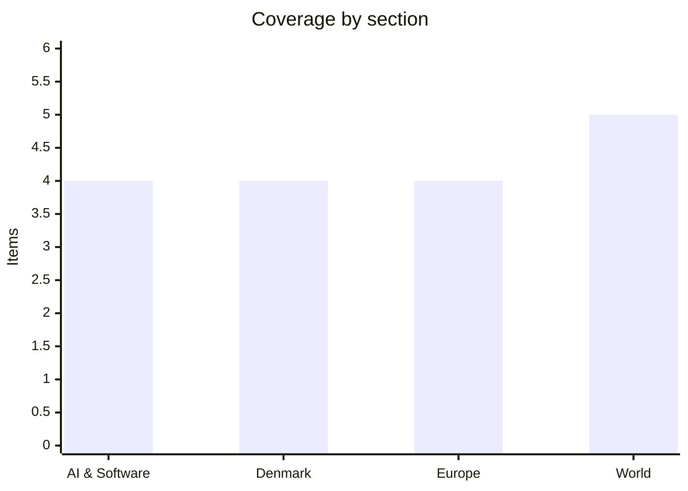

# Daily Briefing — 2026-08-13

**Top line:** Vladimir Putin, speaking from a warship off Sakhalin, threatened to seize European vessels "anywhere" in retaliation for the EU's new power to sell off cargo from intercepted shadow-fleet tankers — a direct threat against European commercial shipping, landing the same morning Maersk publishes its Q2 report.

## Follow-ups

- **Gemini 3.5 Pro: still not out.** Made by Google came and went Wednesday night without the flagship model — the leak trail and prediction markets now point to a release between today and Friday *(rumored)*. Full event coverage in the AI lead. [Benzinga](https://www.benzinga.com/news/26/08/60981812/googl-stock-declined-last-month-on-gemini-3-5-pro-launch-delay-reports-prediction-market-is-now-betting-on-this-date)
- **Qwen3.8-Max weights: resolved.** After nine days of waiting, the open weights dropped Wednesday morning — full item below.
- **US July CPI landed tame** — 0.1% on the month, 3.4% annually — full item in World.
- **Folketinget's Ceuta debate** produced heat but no policy shift: the government rejected both the Italian proposal and DF's Schengen-exit demand, and Information's verdict — "great fuss over a migrant crisis that never came near Denmark" — captured the mood. Morocco, meanwhile, escalated (see Europe). [Information](https://www.information.dk/indland/2026/08/stor-staahej-folketinget-migrantkrise-aldrig-kom-naerheden-danmark)
- **Hormuz:** the joint statement remains unsigned; Iran's foreign ministry repeated Wednesday that the strait stays shut until Washington lifts its "blockade", and MarineTraffic counts 8–15 daily transits against roughly 130 pre-conflict. [Times of Israel](https://www.timesofisrael.com/liveblog-august-12-2026/) · [CNBC](https://www.cnbc.com/2026/08/10/oil-prices-today-brent-wti-hormuz-trump-iran.html)
- **Bezos–Liverpool:** still no formal announcement; fan and industry outlets say the roughly £1.4bn, one-third-stake deal could be confirmed this week *(reported)*. [This Is Anfield](https://www.thisisanfield.com/2026/08/jeff-bezos-consortium-liverpool-stake-announcement-this-week/)
- **Leipzig drone:** no arrests and no new Generalbundesanwalt steps reported since the DNA match to the 2024 DHL arson case.
- **US vaccine order:** the 15-state lawsuits are filed; no injunction rulings yet.
- **The eclipse:** DMI's forecast held — see Denmark.

## AI & Software

**Made by Google delivers the Pixel 11, a $29 AirTag rival and a pile of Gemini features — but not the model everyone was waiting for.** Google's annual hardware event ran Wednesday evening California time and made the Pixel 11 lineup official: the standard Pixel 11 at $899 with a redesigned camera bar and 256GB base storage, the Pixel 11 Pro and Pro XL from $1,099 with an anti-scratch display coating, and a Pixel 11 Pro Fold — all running Google's new Tensor G6 chip, reportedly built on a more efficient 2nm process. Alongside the phones came the Pixel Watch 5 and the Pixel Tag, a $29 item tracker ($99 for a four-pack) aimed squarely at Apple's AirTag. The software layer was thick with Gemini: ASL translation inside Live Transcribe, a Rambler voice-input mode that handles unstructured natural speech, and assorted on-device features across the lineup. What did not appear was Gemini 3.5 Pro — the flagship model Google announced at I/O on May 19 with a "next month" promise that has now slipped past June, July and its own hardware showcase. Google's model page still carries a "coming soon" badge, there is no API entry or pricing row, and reporting attributes the delay to a rebuild focused on coding reliability, with leaks claiming a near-complete base model was scrapped over recursive tool-calling and SVG-generation failures *(rumored)*. The absence matters because the current Gemini 3.1 Pro dates to February — an eternity at frontier pace — while Anthropic and OpenAI have both shipped flagship updates this summer. Leaked timelines and prediction markets now converge on a launch between today and Friday, possibly timed to ride the Pixel news cycle. Watch the window through Friday; if it passes empty again, the delay story hardens into a strategy question for Google's AI leadership. [TechCrunch](https://techcrunch.com/2026/08/12/google-unveils-pixel-11-lineup-new-airtag-rival-and-gemini-features-at-made-by-google-2026/) · [Android Central](https://www.androidcentral.com/phones/live/made-by-google-2026-launch-live-pixel-11-pixel-11-pro-fold-pixel-watch-5-gemini-and-all-the-news) · [eesel](https://www.eesel.ai/blog/gemini-3-5-pro)

**Alibaba open-weights a Max-class model for the first time — and strips out the parts that made it interesting.** At 10:00 Beijing time on Wednesday, Alibaba released the weights of Qwen3.8-2.4T-A95B — the first time any lab has open-weighted a model at "Max" scale — alongside the smaller Qwen3.8-27B, resolving the countdown this briefing has tracked since the family launched on August 3. The flagship is a 2.4-trillion-parameter mixture-of-experts model with roughly 95 billion active parameters; the 27B is a dense sibling positioned as the practical workhorse. The release ships under a custom "Qwen3.8-Max License" rather than Apache 2.0, and the fine print stung the community: the open weights are text-only, with the vision input, the default 1M-token context window and the built-in tools all reserved for the paid Qwen Cloud API — the top discussion thread on Hugging Face is titled "Huge disappointment". For calibration, the commercial Qwen3.8 Max scores 66.1 on the Vals Index (second among open-weight-family models), 87.3% on SWE-bench Verified and 67.4 on Terminal-Bench 2.1, according to Vals' published evaluations — how much of that survives in the stripped open release is exactly what independent testers will now establish. The context makes the release significant regardless: after last year's "Qwen Exodus" and a management change, there was real doubt whether Alibaba would keep shipping relevant open models, and that doubt is now settled. On r/LocalLLaMA the 27B generated more excitement than the 2.4T giant, since almost nobody can serve a 2.4T MoE but a 27B dense model slots into every local stack. The two-tier pattern — open weights as a feature-stripped shadow of the commercial product — may become the template other labs copy, which is worth watching in itself. Watch for independent benchmarks of the open 2.4T against the API version, and legal analyses of what the custom license actually permits. [Hugging Face](https://huggingface.co/Qwen/Qwen3.8-2.4T-A95B) · [Latent Space](https://www.latent.space/p/ainews-qwen-38-max24t-and-27b-new) · [byteiota](https://byteiota.com/qwen3-8-open-weights-drop-this-week-read-before-you-download/)

**Spotify will badge "AI Personas" — and cut them out of recommendations entirely.** Spotify announced it will begin labelling AI-generated artist identities with an "AI Persona" badge from mid-September, applied on artist profiles (banner and About section), in Search, and on track rows across playlists. The policy targets the identity, not the toolchain: an act whose name and photorealistic imagery represent an AI-generated persona gets the badge, while human artists using AI in production — generated beats, AI mastering, backing tracks — do not. Spotify will accept self-disclosure but won't rely on it, running its own reviews of profiles that appear to be synthetic identities, with every Spotify-applied badge checked by a human before it goes on. The consequential part is distribution: AI Personas will be excluded from Spotify's editorial and algorithmic recommendations — Discover Weekly, Release Radar, editorial playlists — which is where streaming careers are made. That amounts to economic demonetisation of fake-artist farming at scale, a business that has flooded streaming services as generation costs collapsed. It is the first hard policy line a major streaming platform has drawn between AI-assisted music and AI-fabricated artists, and rivals will face immediate pressure to match it. The open questions are enforcement ones: whether detection keeps pace with generators, and where heavily AI-dependent human acts fall on the line. Watch the September rollout, the first contested badge disputes, and how labels — some of which quietly run AI catalogue plays themselves — respond. [Spotify Newsroom](https://newsroom.spotify.com/2026-08-11/ai-persona-badges-transparency/) · [TechCrunch](https://techcrunch.com/2026/08/11/spotify-will-label-ai-persona-profiles-and-exclude-their-music-from-recommendations/) · [Euronews](https://www.euronews.com/culture/2026/08/12/spotify-to-label-ai-generated-artist-personas-with-new-ai-persona-badges)

**Cognition is reportedly raising again at $40 billion — three months after its last round.** *(reported)* TechCrunch reported Wednesday that Cognition, maker of the Devin coding agent, is already in talks with investors about a new round at a valuation of at least $40 billion — up from the $26 billion it commanded in May, when it raised $1 billion. The pitch rests on growth: the company has reportedly reached roughly $1 billion in annualised revenue run rate, which would make the mooted valuation about 40 times forward revenue and a 54% markup in a single quarter. Cognition bulked up in 2025 by absorbing Windsurf after the OpenAI acquisition collapsed, and now sits in the hottest lane of applied AI, where agentic coding tools are repricing faster than any other software category. The context is a week thick with capital-structure news across the AI stack — Nvidia's $500bn financing platforms, Intel's $20bn raise, Riot's $9.1bn compute deal — with Cognition representing the application layer's claim on the same investor appetite. The obvious caution: a valuation doubling every few months prices flawless execution in a market where Anthropic, OpenAI, Cursor and GitHub are all shipping aggressively against it. No round is signed; the talks could still change shape or fall through. Watch for confirmation, the lead investor, and whether the revenue run-rate figure survives scrutiny. [TechCrunch](https://techcrunch.com/2026/08/12/ai-coding-startup-cognition-reportedly-already-in-talks-to-raise-at-40b-valuation/)

## Denmark

**Maersk's make-or-break Q2 lands this morning — the quarter that has to cash the June upgrade.** A.P. Møller-Mærsk publishes its Q2 interim report around 8:00 CEST today — effectively as this briefing goes out — and it arrives with the bar already set high. On June 29 the company upgraded full-year guidance dramatically: underlying EBITDA of $8–10bn (from $4.5–7.0bn), underlying EBIT of $2–4bn (from a range spanning a $1.5bn loss to a $1bn profit), and free cash flow of at least -$1.5bn, on global container volume growth of about 4% — driven by strong Far East demand and the sustained spot-rate surge that followed the closure of Hormuz and the wider Middle East disruption. Analyst consensus per Bloomberg sits around $2.06bn in Q2 EBITDA and roughly $612m in EBIT, and the tone has flipped completely since spring, when Ocean was flagged for downgrade risk after Q1 revenue fell 8.2% on weak rates despite 9.3% volume growth. Danish trade press notes Maersk has beaten consensus in seven consecutive quarters, and frames today as a potential "financial fest" — rate momentum plus an unusually early peak season. Beyond the headline numbers, the things worth reading for are the rate outlook (war-driven spot rates can unwind as fast as they spiked), the Gemini network's performance with Hapag-Lloyd (roughly 275 vessels and 3.5m TEU deployed in H1, with 90%+ schedule reliability), and any move on the buyback. The second reading is the risk: with the upgrade six weeks old and the shares having run, a merely in-line print could disappoint a market priced for beats. Putin's ship-seizure threat (see Europe) is an uncomfortable backdrop for the sector's risk premium. Tomorrow's briefing will carry the actual figures and the market's verdict. [Maersk IR](https://investor.maersk.com/news-releases/news-release-details/upgrade-guidance-full-year-2026) · [Transportmagasinet](https://www.transportmagasinet.dk/article/view/1239786/fra_truende_nedjustering_til_rateoptur_torsdag_kan_blive_en_finansiel_fest_for_maersk)

**Pandora pulls its report forward a day: 3% organic growth, and a guidance upgrade paid for by a US tariff refund.** Pandora published its Q2 interim report Wednesday, a day ahead of schedule, showing organic growth of 3% to DKK 7.22bn in revenue — 1 percentage point from like-for-like growth and 2 from network expansion. The EBIT margin came in at 20.3%, flattered by a one-off: gross margin reached 80.5%, but only 78.2% excluding a tariff-related windfall. That windfall drives the headline news — full-year guidance rises to 0–3% organic growth (from -1% to 2%) and an EBIT margin of 22–23% (from 21–22%) — because Pandora now expects one-off income from its IEEPA tariff refund claim, the money US importers stand to recover after American courts struck down the tariff regime. Strip that out and the quarter is solid rather than strong: efficiencies and promotional discipline are offsetting real headwinds from gold and silver prices, remaining tariffs and currency, while like-for-like growth of 1% shows demand is stabilising, not accelerating. The world's largest jewellery maker entered the report up 23.7% for the year at around 834 kr., with the average analyst target sitting well below the price — a set-up in which upgrades bought with legal one-offs rather than demand tend to get discounted. Coverage noted investor growth concerns persisted after the release. Watch whether the IEEPA refunds actually pay out on schedule — that is a US-politics story as much as an accounting one — and whether Q3 like-for-like improves. [Pandora/GlobeNewswire](https://www.globenewswire.com/news-release/2026/08/12/3343901/0/en/pandora-delivers-3-organic-growth-in-q2-guidance-upgraded.html) · [FashionNetwork](https://uk.fashionnetwork.com/news/Pandora-reports-3-organic-growth-in-fy26-q2-raises-guidance,1859059.html) · [WWD](https://wwd.com/accessories-news/jewelry/pandora-q2-results-2026-guidance-raised-early-announcement-1239092531/)

**The eclipse delivered: 83–85% coverage under clear skies — and the King reopened Rundetaarn's observatory for the occasion.** Wednesday evening's partial solar eclipse played out almost exactly as DMI promised: near-cloudless skies across most of the country as the moon took its first bite at 19:10, covered 83–85% of the sun around 20:04, and slid off before 21:00. Danes turned out in numbers — organised viewing events ran at Amager Strand, Højer in Sønderjylland, Højbjerg and Brabrand by Aarhus, Vejle, Slagelse and beyond, and readers' photos streamed into TV2 and the local papers through the evening. Kong Frederik marked the event by reopening Rundetaarn's Folkeobservatorium in Copenhagen. In Spain, the path of totality crossed the mainland at sunset as planned — continental Europe's first total eclipse since 1999 — while Denmark's 80%+ coverage was the country's deepest since 1954. The Perseids then peaked after dark under a moonless sky, capping the rare double bill. Nothing comparable is visible from Denmark until 2048. [TV2](https://vejr.tv2.dk/live/2026-08-12-solformoerkelse-over-danmark) · [Videnskab.dk](https://videnskab.dk/rummet/se-billederne-saadan-saa-solformoerkelsen-over-ud-fra-danmark-og-udlandet/) · [Presse-fotos](https://presse-fotos.dk/kan-du-finde-dig-selv-se-de-mange-billeder-fra-solformoerkelsesarrangementer-i-hele-danmark/)

**Copenhagen Pride's Saturday parade: 250,000-plus expected under the most visible security posture in the event's history.** Copenhagen Pride week is running through Sunday August 16, and Saturday's parade — the biggest recurring public event in the capital, expected to bring more than 250,000 people onto the streets — will go ahead under a demonstratively reinforced police presence. Københavns Politi says its deployment is calibrated to PET's current threat assessment and that it maintains continuous dialogue with the organisers, while declining to discuss operational details; Pride's own security organisation says it follows the authorities' recommendations closely. The driver is the July 26 attack on a Pride event in Berlin, where a car was driven into the crowd, killing one woman and injuring at least 29 — an attack that pushed visible security to the top of the agenda for every large European summer event. The organisers' consistent message has been that the parade should feel like a celebration, not a security operation, and that participation is itself the answer to intimidation. For the city it is also simply the year's largest crowd-management task, with street closures across Frederiksberg and Vesterbro and pressure on public transport through the afternoon. Watch Saturday — and expect assessments afterwards of whether the new visible-security regime becomes the permanent template for Danish mass events. [DR](https://www.dr.dk/nyheder/indland/politi-vil-vaere-mere-synligt-ved-pride-i-koebenhavn) · [TV2 Kosmopol](https://www.tv2kosmopol.dk/koebenhavn/priden-og-politiet-kommenterer-pa-sikkerhedssituationen-til-arets-pride-parade-50e8a) · [Copenhagen Post](https://cphpost.dk/2026-08-12/life-in-denmark/copenhagen-pride-2026-what-to-know-about-the-parade-safety-children-and-getting-around/)

## Europe

**Ukraine hits Russia's last Black Sea stronghold: frigates and grain terminals struck in Novorossiysk.** Ukraine struck the Novorossiysk naval base and port overnight into Wednesday with a combined package of Neptune cruise missiles, jet-powered Palianytsia missile-drones and unmanned naval vehicles — a coordinated strike on the harbour that became the Black Sea Fleet's principal sanctuary after it abandoned Crimea. President Zelensky said the strike hit two frigates — identified in Ukrainian reporting as Admiral Makarov and Admiral Essen — plus a Buyan-M missile corvette, the patrol ship Vasily Bykov and a large landing ship, along with air-defence positions and pier infrastructure; those are Ukrainian claims, with satellite confirmation still pending. Operations were suspended at the NKHP grain terminal, one of Russia's largest with an annual export capacity of 7.1 million tonnes, and Russian officials reported three killed in the port area. The point is strategic as much as material: Novorossiysk sits more than 300 kilometres from the front, and hitting capital ships there — with domestically produced weapons unconstrained by Western usage permissions — signals that no Russian anchorage in the Black Sea is safe. Russia's overnight reply ran to 138 Shahed-type drones plus Iskander-M, Kh-31P and Kh-35 missiles; Ukrainian authorities counted 8 dead and 57 injured across the country, including a strike on a fuel tanker truck in Odesa oblast. The UN added a grim ledger entry this week: more than 16,000 Ukrainian civilians are still held in Russian detention. At home, the military overhaul this briefing has been watching moved from rhetoric to action Thursday — the head of the Transcarpathia recruitment centre was suspended as Commander-in-Chief Drapatyi's team began reviewing the mobilisation system, the institution Ukrainians complain about most. Watch for satellite damage assessments on the frigates, the effect on Russian grain exports, and whether Moscow escalates its counter-barrages in response. [Ukrainska Pravda](https://www.pravda.com.ua/eng/news/2026/08/12/8048350/) · [Euronews](https://www.euronews.com/my-europe/2026/08/12/ukraine-strikes-novorossiysk-putting-russias-last-black-sea-sanctuary-within-reach) · [Al Jazeera](https://www.aljazeera.com/news/2026/8/12/three-killed-in-overnight-attacks-on-russian-ukrainian-port) · [Militarnyi](https://militarnyi.com/en/news/ukraine-strikes-russian-navy-base-and-port-in-novorossiysk-with-neptune-palianytsia-missles-and-naval-drones/)

**Putin threatens to seize European ships "anywhere" — the shadow-fleet fight gets an explicit naval threat.** Speaking Wednesday aboard the cruiser Varyag off Sakhalin, where the Pacific Fleet is running drills, Vladimir Putin threatened retaliatory seizures of European vessels over the EU's newest sanctions mechanism, which permits member states to sell the oil and other cargo confiscated from intercepted shadow-fleet tankers. Putin called the European interceptions "piracy and banditry" and said Russia "will be forced to respond in kind… wherever we ourselves deem necessary and appropriate — anywhere." The staging added its own message: Pacific Fleet commander Viktor Liina told Putin on camera that his forces are capable of inspecting and detaining vessels of "unfriendly states", including ships sailing under third-country flags. The escalation has been building all summer — European navies and authorities have intercepted a series of sanctioned tankers, the June EU package created the legal basis for selling their cargoes, and Moscow has until now confined its response to rhetoric. A threat to board EU-flagged commercial vessels is different in kind: any actual seizure would be a major state-on-state incident, and even the threat alone feeds into war-risk premiums and insurance pricing for European operators — an uncomfortable backdrop for Danish shipping on the morning Maersk reports. The second reading is that this is calibrated bluster: delivered from a fleet an ocean away from the Baltic, timed for a domestic audience during exercises, and deliberately vague about where and how Russia would act. The Kremlin has form for maximalist maritime rhetoric it does not operationalise; it also has form for testing exactly these thresholds. Watch for the first Russian inspection attempt against a European-linked vessel, the EU's formal response, and movement in P&I and war-risk markets. [Euronews](https://www.euronews.com/my-europe/2026/08/12/putin-threatens-retaliatory-seizures-of-european-ships) · [Bloomberg](https://www.bloomberg.com/news/articles/2026-08-12/putin-threatens-retaliation-over-eu-moves-to-seize-russian-ships) · [Moscow Times](https://www.themoscowtimes.com/2026/08/12/putin-threatens-retaliation-if-europe-seizes-russian-ships-a93470)

**Morocco raises the stakes on Ceuta: accusations of Spanish brutality — and the sovereignty claim put back "on the table".** Morocco escalated the Ceuta crisis on two fronts Wednesday, as its National Human Rights Council (CNDH) circulated a preliminary report accusing Spanish security forces of assaulting and ill-treating migrants during the late-July crossings, and Justice Minister Abdellatif Ouahbi revived Rabat's territorial claim to the enclave itself. The CNDH report, dated August 8, says roughly 80,000 people crossed into Ceuta on July 30–31 — a higher figure than Spain's own assessment of about 72,000, most of whom have since returned — and cites migrant testimony of beatings by Spanish officers "especially in places beyond the reach of cameras", plus accounts of minors insulted and beaten by "extremist groups" inside the city. Ouahbi, speaking to Asharq News, said Morocco's claim to Ceuta and Melilla "remains on the table" whenever representatives of the two countries meet, describing a "long-term" strategy to recover what Rabat considers Moroccan territory through dialogue. The timing is pointed: the accusations land as Spain absorbs reciprocal border controls with Italy, as the Folketing debates Spain's Schengen standing, and as the Commission's authority over internal borders looks weaker by the week — every incentive for Rabat to press. For Madrid the report is doubly awkward: contesting the abuse allegations requires exactly the transparency about border enforcement that governments under migration pressure avoid, while ignoring the sovereignty statement normalises it. The unresolved question from July — whether Morocco's border authorities enabled the surge, as Spain alleged with its "blackmail" accusation — now has a mirror-image counter-narrative in which Spain is the abuser. Watch Madrid's formal response, whether the EU comments on the sovereignty language, and whether crossings resume as the diplomatic temperature rises. [Euronews](https://www.euronews.com/my-europe/2026/08/12/morocco-accuses-spain-of-assaulting-migrants-crossing-into-ceuta-and-claims-sovereignty-ov) · [CNN (background)](https://www.cnn.com/2026/08/01/europe/spain-morocco-migrants-intl)

**France swelters as Spain burns: the summer's next heat pulse tightens water restrictions with Niebla still uncontained.** France entered a new heatwave Wednesday, with water restrictions tightening across affected departments as the second major heat pulse of August builds over southwestern Europe — the same system driving extreme fire danger across the Iberian peninsula. In Spain the Niebla fire in Huelva remains beyond containment after a week: official statements put the burned area between roughly 20,000 and more than 25,000 hectares depending on the perimeter measured, with around 800 residents displaced across Huelva and Sevilla provinces and more than 600 firefighters and 26 aircraft committed. The national arithmetic keeps worsening: Spain has now lost 256,937 hectares to fire this year — about 170% above the 20-year average — after a record July fire and successive heatwaves that have left extreme fuel loads across the country. Officials' standing worry, that simultaneous large fires would exceed suppression capacity during an August heatwave, is now a live operational question rather than a scenario. For France the immediate concern is water: restrictions were already in force across much of the south before this pulse, and each successive heatwave forces wider curbs on agriculture and industry. The pattern is the story — Europe's fire and water crises are no longer episodic but sequential, with each event starting from the deficit the last one left. Watch containment on the Niebla fire's Sevilla flank, new ignitions as the heat peaks, and how far France's restriction map spreads. [Euronews](https://www.euronews.com/2026/08/12/france-swelters-in-new-heatwave-as-water-restrictions-tighten) · [Deeparrival](https://deeparrival.com/news/niebla-huelva-wildfire-evacuations-august-2026/)

## World

**Colombia's earthquake toll passes 250 by local counts, with thousands still listed as missing.** The toll from Monday's magnitude-7.4 earthquake (some outlets report 7.6) keeps climbing as rescuers work deeper into the damage zone: estimates from local authorities now put deaths above 250, with Euronews citing 216 confirmed as of Wednesday and earlier official counts at 224 — the spread reflects how chaotic casualty reporting remains. Cali's mayor says 95 people died in his city alone, underscoring how the deep quake — roughly 96km down, under remote San José del Palmar in Chocó — propagated its worst damage into the big cities of the coffee axis and Valle del Cauca. Al Jazeera reports more than 2,700 people listed as missing, a fluid figure that mixes the truly trapped with the unaccounted-for; around 2,595 are injured, and over 1,600 homes have collapsed nationwide. The rescue effort produced its emblematic image Wednesday when crews pulled a woman alive from rubble after 36 hours, and international help is arriving — Ecuador sent a 47-member urban search-and-rescue team with dogs, and the EU released €2 million in humanitarian funding. Access to the epicentre zone itself remains marginal, with landslides cutting the few roads into one of Colombia's poorest and least connected departments — the toll there is still largely unknown. President De la Espriella, days into his term, is running his first national catastrophe with the machinery of government barely assembled, a test that has defined or broken new Latin American presidencies before. Watch the toll as crews reach San José del Palmar, aftershock damage to weakened structures in Cali and Pereira, and whether the response holds up politically. [CBC](https://www.cbc.ca/news/world/colombia-earthquake-search-survivors-9.7302758) · [Euronews](https://www.euronews.com/2026/08/12/colombia-rescuers-search-for-survivors-after-76-magnitude-earthquake-kills-216-people) · [Al Jazeera](https://www.aljazeera.com/news/2026/8/11/colombia-quake-frantic-search-for-survivors-as-over-2700-reported-missing)

**The Air Force One decoy: new details emerge of Trump's secret flight home from Turkey under an Iranian assassination threat.** The most extraordinary security story of the summer gained detail Wednesday: after the Washington Post revealed Monday that Donald Trump secretly flew home from the NATO summit in Turkey on an alternate aircraft while Air Force One flew its published route as a decoy, CNN reported who was actually aboard. Trump made the flight on a smaller C-32A with a handful of close aides — Natalie Harp, Dan Scavino and Walt Nauta — plus Defense Secretary Pete Hegseth, while Secretary of State Rubio, Treasury Secretary Bessent and Deputy Chief of Staff Stephen Miller stayed on the decoy plane, maintaining the fiction. A US official told NBC the scramble was triggered by warnings of a possible shoulder-fired missile threat to the presidential aircraft, and officials found the intelligence alarming because the Iranians appeared to know specific details of Trump's arrangements in Turkey; Israeli outlet Ynet adds the claim, sourced to a forthcoming book, that Trump was moved concealed in a catering cart during the switch *(reported)*. The White House judged the risk severe enough that flying either the legacy 747 or the Qatar-donated replacement was ruled out. The revelations raise hard questions in both directions: about how Iranian intelligence penetrated summit logistics on NATO soil, and — as The Hill notes — about the propriety of a days-long public deception regarding the president's whereabouts. The episode also recontextualises the Hormuz diplomacy this briefing tracks daily: the administration has been negotiating reopening terms with a state its own security services assess was actively plotting to kill the president. Watch for formal US responses tied to the plot — indictments, sanctions or retaliation — and its effect on the stalled Hormuz talks. [Washington Post](https://www.washingtonpost.com/national-security/2026/08/10/trump-flew-secrecy-amid-iran-threat-air-force-one-became-decoy/) · [CNN](https://www.cnn.com/2026/08/12/politics/missile-threat-trump-plane) · [NBC](https://www.nbcnews.com/politics/donald-trump/warnings-possible-shoulder-fired-missile-led-trumps-secret-plane-swap-rcna591919) · [The Hill](https://thehill.com/homenews/administration/6023425-trump-air-force-one-turkey-secret-service-ruse/)

**US inflation cooperates: 3.4% in July, and the September hike question tilts toward hold.** The July CPI, released Wednesday, came in tame: headline prices rose 0.1% on the month and 3.4% year-over-year — down 0.1 point from June — while core CPI (ex food and energy) rose 0.2% monthly and 2.5% annually, also down a tenth. Shelter accounted for about two-thirds of the monthly increase, and the numbers confirm that the energy-driven inflation burst from the Hormuz closure is fading rather than broadening into core prices. The market read it as licence to relax about September — but in this cycle "relax" means fewer hike bets, not cut bets: prediction markets and futures put the odds of a September rate rise around 33–40% after the print (Benzinga's tracker at 33%, Bloomberg describing bond traders holding roughly coin-toss wagers), while CME FedWatch still shows about 73% odds of a move by December. Equities took the benign print and ran: the S&P 500 rose 0.3% to 7,748, just shy of Friday's record close of 7,757.67, and the Nasdaq added 0.5% to 26,588, helped by what Kiplinger called a red-hot AI rally. The caveats are geopolitical: Brent still trades near $88 with Hormuz shut, and a re-escalation in the Gulf would reload the energy pipeline into headline inflation within weeks. Today brings July PPI at 14:30 CEST, the last major input before the Jackson Hole conference later this month. Watch PPI today and Fed speakers' reactions through the week. [CNBC](https://www.cnbc.com/2026/08/12/cpi-inflation-report-july-2026.html) · [Kiplinger](https://www.kiplinger.com/investing/stocks/s-and-p-500-rises-on-mild-inflation-data-red-hot-ai-rally-stock-market-today) · [Bloomberg](https://www.bloomberg.com/news/articles/2026-08-12/bond-traders-keep-cointoss-wager-on-september-fed-hike-post-cpi)

**North Korea fires its second ballistic missile in a week ahead of Monday's US–South Korean drills.** North Korea launched a ballistic missile from its eastern Wonsan coastal area around 6:00 Wednesday morning, flying more than 700 kilometres before landing in the sea between the Korean peninsula and Japan, outside Japan's exclusive economic zone — the second such test in under a week. The timing follows the script: two days earlier Seoul and Washington announced their annual Ulchi Freedom Shield exercises will begin August 17, and Pyongyang habitually answers the announcement with launches and rhetoric framing the drills as invasion rehearsal. Analysts' standard caveat applies — the North uses its rivals' exercise calendar as convenient cover for tests it wants to run anyway, working through a development program that continues regardless of the diplomatic weather. Japan's Defence Ministry tracked the launch and lodged the usual protests; no damage was reported. The week ahead is the elevated-risk window: UFS runs from Monday, and the question is whether Pyongyang sticks to short-range signalling or escalates to something larger. Watch the drills window from August 17. [Euronews](https://www.euronews.com/2026/08/12/pyongyang-tests-another-missile-within-one-week-and-ahead-of-us-south-korean-military-dril) · [France 24](https://www.france24.com/en/asia-pacific/20260812-north-korea-conducts-second-ballistic-missile-test-in-less-than-a-week)

**Israel resumes targeted killings in Gaza — the first announced strike since August 3, days after rejecting the Trump plan.** The Israeli military said Wednesday it carried out a targeted drone strike in Beit Lahiya in northern Gaza, killing a man it described as a Hamas commander — the first such announced strike since August 3, and conducted, in the AP's phrasing, "despite pressure to halt such attacks from officials overseeing peace efforts". The strike lands in the raw aftermath of Sunday's rupture: Netanyahu explicitly rejected the US-backed 15-point Gaza plan, insisting on complete Hamas disarmament before any Israeli withdrawal — "genuine disarmament, not fictitious disarmament" — where the plan envisaged phased, parallel steps. That rejection of a plan Trump personally championed has strained the relationship further, and Wednesday's resumed strike reads as Netanyahu demonstrating freedom of action regardless of Washington's peace architecture. The domestic clock matters: Israel votes October 27, Netanyahu's coalition is polling at risk, and the war's status is his central electoral variable — a dynamic that gives hardline signalling its own momentum. The same day, Israeli forces arrested 23 Palestinians across the West Bank and demolished the home of a man killed in a July confrontation with settlers, while the UK's foreign secretary pressed his Israeli counterpart over settler violence. The question now is whether Beit Lahiya was a one-off or the reopening of the targeted-killing campaign — and what that does to a ceasefire framework that exists mostly on paper. Watch for further strikes, Washington's reaction, and whether the plan's sponsors attempt a rescue round of diplomacy. [AP via Las Vegas Sun](https://lasvegassun.com/news/2026/aug/12/israel-says-gaza-drone-strike-targeted-a-hamas-com/) · [NBC](https://www.nbcnews.com/world/israel/israel-rejects-trumps-15-point-plan-gaza-pm-benjamin-netanyahu-says-rcna591555) · [Al Jazeera](https://www.aljazeera.com/news/2026/8/9/israel-rejects-trumps-15-point-plan-for-gaza)

## Watch list

- **Today:** Maersk's actual Q2 figures and the market's verdict; US July PPI at 14:30 CEST — the last big input before Jackson Hole.
- **Today–Friday:** the Gemini 3.5 Pro launch window per leaks and prediction markets *(rumored)*; Claude Code's auto-mode default flips Friday.
- **Saturday:** Copenhagen Pride parade under the reinforced security regime.
- **Aug 17–21:** Unitree's first trading day on Shanghai's STAR Market; Ulchi Freedom Shield drills begin Aug 17 with North Korea already signalling.
- **Any day:** Bezos–Liverpool confirmation; the Hormuz joint statement; Colombia's toll once rescuers reach San José del Palmar; **Aug 29:** Iceland's EU referendum.
