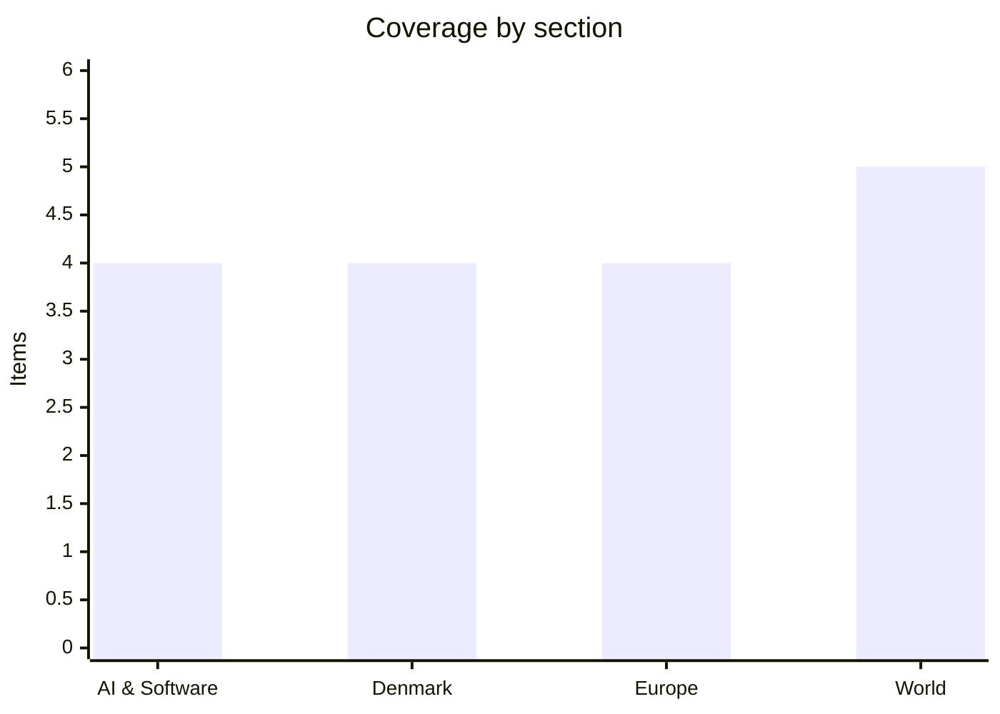

# Daily Briefing — 2026-08-14

**Top line:** Google answered the Gemini 3.5 Pro question sideways — no flagship, but a half-price Gemini 3.7 Flash aimed squarely at coding agents, shipped as DeepMind reorganises under Koray Kavukcuoglu with Demis Hassabis stepping back to chair.

## Follow-ups

- **Gemini 3.5 Pro: the leaked launch window closed empty.** Google instead shipped Gemini 3.7 Flash on Thursday and said nothing at all about Pro — full item in AI. [TechTimes](https://www.techtimes.com/articles/324366/20260813/google-launches-gemini-37-flash-coding-gains-half-price-through-year-end.htm)
- **Maersk: resolved, emphatically.** Q2 EBITDA of $3.0bn against a $2.12bn consensus and a second guidance upgrade — full item in Denmark.
- **US July PPI landed flat** on the month, 4.7% annually (from 5.5%) — markets item in World.
- **Claude Code's auto-mode default flips today** as announced — full item in AI.
- **Novorossiysk: satellite confirmation arrived.** Vantor imagery shows fire damage concentrated at the Kalibr launch sections of both Admiral Makarov and Admiral Essen; analysts assess both will need full-scale repairs before they can fire missiles again, though neither sank. [Defence Blog](https://defence-blog.com/satellite-images-confirm-damage-to-two-russian-missile-frigates/) · [Naval News](https://www.navalnews.com/naval-news/2026/08/ukrainian-drone-strike-russian-frigates-novorossiysk/)
- **Putin's ship-seizure threat:** no seizure attempt and no formal EU response yet; insurance trade press is already gaming out war-risk premium effects. [Insurance Journal](https://www.insurancejournal.com/news/international/2026/08/12/881198.htm)
- **Hormuz:** still shut, talks now formally in deadlock — Trump answered Tehran's compensation demand with a counter-demand that Iran pay compensation; Qatar calls the separate Iran–Oman shipping-lane talks "advanced". [Al Jazeera](https://www.aljazeera.com/news/2026/8/13/us-iran-talks-in-deadlock-whats-the-latest)
- **Bezos–Liverpool:** still no announcement; reporting now says it could slip into next week *(reported)*. [Sky Sports](https://www.skysports.com/football/news/11669/13571596/liverpool-amazon-founder-jeff-bezos-nears-deal-to-buy-stake-with-consortium-led-by-amit-bhatia)
- **Colombia quake:** toll at 265, the missing count refined down from 2,700 to 496 — folded into the World item on Colombia's new US military alignment.
- **Ceuta in the Folketing** took a farcical turn Thursday — DF item in Denmark.

## AI & Software

**Google ships Gemini 3.7 Flash at half price — and says nothing about the missing 3.5 Pro.** Google released Gemini 3.7 Flash on Thursday, just three weeks after 3.6 Flash, at an introductory price of $0.75 per million input tokens and $3.75 per million output — exactly half of 3.6 Flash's launch price, held through December 31 before rising to $1.50/$7.50 in January. The model targets coding and agent workflows, and Google's own benchmarks show why it leads with those: on AutomationBench, an enterprise workflow-automation test, 3.7 Flash scores 30.4% against 17.0% for its predecessor, 23.6% for GPT-5.6 Terra and 10.7% for Claude Sonnet 5 — company-reported numbers that independent evaluators have not yet replicated. Google attributes the compressed release cadence to algorithmic optimisation work rather than a new pretraining run, which is itself a statement about where its effort is going while the flagship remains stuck. Because the conspicuous absence was, again, Gemini 3.5 Pro: announced at I/O on May 19 with a "next month" promise, missed June, July and the Made by Google event, and now the August 12–14 window that leaks and prediction markets had converged on. Thursday's announcement did not mention Pro at all, and coverage now openly asks whether it ships this year, gets folded into a 3.7-series Pro variant carrying the new optimisations, or is skipped in favour of a Gemini 4. The release also lands amid a leadership restructure: Demis Hassabis has relinquished day-to-day control of DeepMind to become its chair and Alphabet's chief scientist, with former CTO Koray Kavukcuoglu running the unit as a senior vice president reporting directly to Sundar Pichai. The strategic read is price war in the mid-tier while the flagship is rebuilt — Google competing on cost-per-agent-task where it can win today. Watch whether the half-price introductory rate pulls agent workloads from Anthropic and OpenAI, and any official word on Pro's fate. [VentureBeat](https://venturebeat.com/technology/googles-gemini-3-7-flash-targets-coding-and-agents-with-a-50-introductory-price-cut) · [TechTimes](https://www.techtimes.com/articles/324387/20260813/google-cuts-gemini-37-flash-price-half-it-claims-top-claude-business-workflows.htm) · [Model card](https://deepmind.google/models/model-cards/gemini-3-7-flash/)

**DeepSeek takes V4-Pro to general availability — with agent-heavy benchmarks and a steep price hike.** DeepSeek released V4-Pro-0813 to general availability on Thursday across its app, web interface and API, graduating the model from the preview it had run since April. The GA release is pitched almost entirely at agentic work — tool use, code execution, multi-step workflows — with vendor-reported scores of 87.9 on Terminal-Bench 2.1, 62.7 on DeepSWE and 61.5 on NL2Repo, none yet replicated by third-party evaluators. Independent testing of the preview gives a more mixed picture: V4-Pro leads coding-style benchmarks like LiveCodeBench and Codeforces and essentially ties Claude Opus 4.7 on SWE-bench Verified, but trails meaningfully on the harder SWE-bench Pro at 55.4 against Opus 4.7's 64.3. The specs are aggressive — a 1-million-token context window, outputs up to 384,000 tokens, and switchable thinking/non-thinking modes. The catch is the bill: with GA, DeepSeek raised API prices by up to 12x over preview rates, ending the era of the company as the frontier's bargain option and signalling confidence it can charge like a peer. The release caps a week in which the open-versus-closed contest sharpened noticeably — Meta open-weighted Muse Spark 1.2 and announced its laptop-class Muse Glimmer family alongside a 6,500-word Zuckerberg essay urging Washington to back American open models, and Nvidia shipped the single-GPU Nemotron 3.5 Lightning — all explicitly framed as a response to Chinese labs like DeepSeek, Moonshot and Alibaba's Qwen. Whether V4-Pro's agent claims survive independent benchmarking is the near-term question; the pricing move matters either way. Watch for Artificial Analysis and SWE-bench Pro runs of the GA build, and developer reaction to the new rates. [TechTimes](https://www.techtimes.com/articles/324241/20260813/deepseek-v4-pro-0813-goes-ga-benchmark-claims-await-independent-proof.htm) · [Yahoo Tech](https://tech.yahoo.com/ai/articles/deepseek-officially-launches-v4-pro-181255468.html) · [CNBC](https://www.cnbc.com/2026/08/12/meta-nvidia-open-weight-ai-race-china.html)

**Catching up: xAI's Grok 4.6 ties GPT-5.6 Sol Max — with a long-context toll booth.** A release this briefing missed on Wednesday deserves the slot: xAI shipped Grok 4.6, a post-training upgrade over Grok 4.5 that holds the base model constant and spends the improvement on a longer supplemental training run, regenerated fine-tuning trajectories and reinforcement learning in agentic environments. The result scores 61 on the Artificial Analysis Intelligence Index — up five points and tied with GPT-5.6 Sol Max — at unchanged headline pricing of $2 per million input and $6 per million output tokens. The fine print is the story for anyone running long-horizon agents: the 500K context window is unchanged, but any request whose prompt crosses 200K tokens now pays doubled rates across input, cached input and output — $4/$1/$12 — a "toll booth" structure that effectively prices long-context work as a separate product. Reasoning effort gains an "xhigh" level above the default high, the knowledge cutoff moves to February 1, 2026, and the model is immediately the default in Grok Build, available in Cursor on all plans, and routable via OpenRouter, Vercel and Cloudflare. The competitive picture: xAI now matches OpenAI's mid-flagship on a composite index at a fraction of the price, which keeps the commodity pressure on everyone's mid-tier — the same dynamic Google answered Thursday with 3.7 Flash's price cut. The toll-booth pricing is worth watching as a possible template: labs are discovering that long context is where the costs live, and per-request repricing may spread. [MarkTechPost](https://www.marktechpost.com/2026/08/12/spacexai-releases-grok-4-6/) · [Kingy](https://kingy.ai/blog/grok-4-6-price-benchmarks-api-cursor-context-window/) · [xAI release notes](https://docs.x.ai/developers/release-notes)

**Claude Code's auto mode becomes the default today — the agentic default flip, on schedule.** As flagged on the watch list, Anthropic's change takes effect today, August 14: auto mode is now on by default in Claude Code for Pro, Max and Team accounts, with Enterprise, API and cloud-platform users to follow within the next month. In auto mode the agent no longer asks for human approval at each step, proceeding on its own unless an action would be destructive or irreversible; depending on existing settings, users may get a one-time prompt asking whether to enable it. Anthropic's safety argument leans on its own testing numbers: auto mode's checks caught 89% of harmful actions, against 13.6% caught by humans reviewing the same steps — a claim that doubles as an admission that approval fatigue had made per-step review largely theatrical. Coverage has split along predictable lines, with developer-focused outlets treating it as overdue ergonomics and The Register framing it as the industry normalising unsupervised agents because supervision was failing anyway. The significance is the default, not the capability — auto mode existed before, but defaults decide what the median user actually runs, and the largest coding-agent deployment in the industry just flipped its median user to autonomous operation. It also sets a precedent competitors will be measured against: once one major vendor makes autonomy the default with published catch-rates, "human approves every step" stops being the assumed baseline for the category. Watch the first weeks of incident reports and whether the 89% claim holds up outside Anthropic's own evaluation. [TechCrunch](https://techcrunch.com/2026/08/09/anthropic-is-turning-claude-codes-auto-mode-on-by-default/) · [InfoWorld](https://www.infoworld.com/article/4207959/anthropic-makes-claude-codes-auto-mode-default-for-paid-users.html) · [The Register](https://www.theregister.com/ai-and-ml/2026/08/10/claude_code_puts_auto_mode/5285326)

## Denmark

**Six DF members hand the government a 54–52 victory on Ceuta — and their group chairman is furious.** Thursday's votes after Dansk Folkeparti's own urgent interpellation on the Ceuta migrant crisis produced the week's most self-defeating parliamentary result: the government's resolution — including language on strengthening control of the EU's external borders — passed unexpectedly 54 to 52, because DF failed to field its own members. Under the Folketing's clearing agreements DF needed only 9 of its 16 MPs present; just 6 showed up, including group chairman Alex Ahrendtsen, and the shortfall handed the government its majority while the opposition's competing text — drafted by DF with Venstre, Konservative, Liberal Alliance, Danmarksdemokraterne, Borgernes Parti and the Faroese Sambandsflokkurin — never came to a vote. Ahrendtsen's public reaction was unusually raw: he told DR he was "dødtræt" (sick and tired) of it and confirmed the group had been given a dressing-down, "it is simply not good enough". The stumble stings because it cuts against DF's otherwise commanding position: recent polling makes it the largest blue-bloc party at its highest level in over seven years, with Morten Messerschmidt actively working to be seen as a credible statsminister candidate — a project not helped by the party fumbling the mechanics of a vote it had itself demanded. For the government, the accidental majority converts Wednesday's contentious Ceuta debate into an endorsed position at no political cost. The deeper pattern this summer is a fragmented blue bloc — four parties polling stronger since the holidays but unable to coordinate — against a government that keeps winning on discipline. Watch whether the blue parties re-table their border text, and DF's attendance at the next contested vote. [DR](https://www.dr.dk/nyheder/politik/doedtraet-df-er-giver-sine-partifaeller-en-roeffel-efter-koks) · [Kristeligt Dagblad](https://www.kristeligt-dagblad.dk/danmark/doedtraet-df-gruppeformand-giver-folketingsgruppen-en-roeffel-efter-koks) · [DR (polling)](https://www.dr.dk/nyheder/politik/ny-maaling-goer-df-til-landets-stoerste-blaa-parti)

**Maersk delivers the "financial fest": $3bn EBITDA, profit doubled, and a second guidance upgrade — shares jump 5%.** The Q2 report this briefing previewed yesterday landed even above the raised bar: underlying EBITDA of $3.0 billion against a Bloomberg consensus of $2.12 billion and $2.3 billion a year earlier, net profit more than doubled to $1.31 billion from $639 million, and revenue up 20% to $15.76 billion. The engine was Ocean, where EBIT surged to $935 million from $229 million as average loaded freight rates hit $2,746 per FFE — roughly 15% above analyst projections — on the war-driven spot-rate surge that has held since Hormuz closed, with an unusually early peak season on top. Management upgraded full-year guidance for the second time this year, lifting underlying EBITDA to $10.5–12.5 billion from the $8–10 billion range set only six weeks ago in the June upgrade. The market's verdict was unambiguous: the shares jumped about 5%, with some reports citing 8% at the open, extending what is now an eighth consecutive quarter of consensus beats. The caveats from yesterday's preview still stand and management repeated them in its own way — these are geopolitically manufactured rates that can unwind as fast as they spiked if Hormuz reopens, and Putin's threat this week to seize European vessels is exactly the kind of tail risk that sits outside any guidance range. The second reading: a company earning windfall profits from a disruption it publicly wishes would end, now priced for that disruption persisting into 2027. Watch the rate curve as peak season matures, and any Hormuz breakthrough as the biggest single risk to the upgraded numbers. [RTÉ](https://www.rte.ie/news/business/2026/0813/1587678-maersk-q2-results/) · [gCaptain](https://gcaptain.com/maersk-raises-outlook-for-second-time-this-year-after-second-quarter-profit-surge/) · [Investing.com](https://www.investing.com/news/earnings/maersk-raises-2026-earnings-outlook-after-q2-profit-more-than-doubles-4856691)

**Copenhagen's apartment market goes from amok to standstill: prices flat in July, still 21% up on the year.** New Boligsiden figures published Thursday show the average square-metre price for owner-occupied flats in both Copenhagen and Frederiksberg municipalities unchanged from June to July — the first clear pause in a market that DR describes as having "gone amok", and that Nordea housing economist Lise Nytoft Bergman now likens to an engine "beginning to sputter". The stall follows a run so steep that July's flat reading still leaves prices more than 21% above the same month last year. The mechanics behind the pause are textbook cooling: the supply of flats for sale has grown while the pool of potential buyers has thinned, shifting bargaining power for the first time in two years. TV2's framing — "the party is over" in Copenhagen — contrasts deliberately with the rest of the country, where prices are still rising; in Aarhus the apartment market is described as roaring ahead with prices up nearly 20% year-on-year. Whether this is a plateau or a turn is the open question: Boligsiden itself calls the stop unsurprising after the spring's acceleration, and a single flat month after 21% annual growth is consistent with both a healthy breather and the top of a cycle. For the broader economy the timing is notable — a Copenhagen price plateau removes some of the overheating argument just as Danish rate policy tracks the ECB's autumn decisions. Watch the August figures for whether Aarhus follows Copenhagen into stall, and listing volumes as the autumn selling season opens. [DR](https://www.dr.dk/nyheder/penge/boligmarkedet-er-gaaet-amok-i-koebenhavn-men-nu-viser-nye-tal-motoren-er-begyndt-hakke) · [TV 2](https://nyheder.tv2.dk/business/2026-08-13-priserne-paa-danske-boliger-stiger-stadig-i-koebenhavn-er-festen-forbi) · [TV 2 Kosmopol](https://www.tv2kosmopol.dk/koebenhavn/priserne-pa-ejerlejligheder-star-bomstille-i-kobenhavn-72239)

**The Nørre Nebel wolf is now effectively outlawed: shoot-on-sight rules on private land and thermal drones in the hunt.** The problem wolf that approached playing children in private gardens in the West Jutland town of Nørre Nebel — three separate episodes on August 5, presumed to be the same animal — has this week been placed under the loosest regulation rules Danish wildlife law allows. Naturstyrelsen's expanded permission means the wolf may now be shot on private property, with shotguns, and without the previous requirement that it be documented approaching people closely; Danish outlets summarise the status as the wolf being "fredløs" — outlawed. The regulation zone created after the August 5 incidents has been extended in line with the existing Oksbøl zone, stretching roughly 30 kilometres north to Hvide Sande and covering both private and state land including Blåbjerg Klitplantage, and the agency has authorised thermal-imaging drones to locate the animal — a first at this scale in a Danish wolf operation, prominent enough that DR is running live coverage of the drone hunt. The case is the sharpest test yet of the regulation regime built after years of debate over problem wolves around Oksbøl, where lack of shyness toward humans — rather than livestock kills — triggers intervention. Wolf advocates note the animal has injured no one; the counterargument driving policy is that a wolf repeatedly seeking out children in gardens is exactly the behaviour the escalation ladder was designed for. The outcome will set precedent either way: a swift regulated kill validates the zone system, while a prolonged failed hunt with drones will feed the argument that the framework is theatre. Watch for the shot itself, and the political reaction from both wolf-protection groups and the rural municipalities demanding faster procedures. [DR](https://www.dr.dk/nyheder/indland/live-problemulv-jages-med-droner) · [Maskinbladet](https://www.maskinbladet.dk/artikel/92491-nargaaende-ulv-ved-norre-nebel-skal-reguleres) · [Sydnyt](https://sydnyt.dk/naturstyrelsen-ulven-ved-noerre-nebel-er-fredloes-nu-den-maa-nedlaegges-paa-private-arealer-med-haglvaaben-og-uden-krav-om-at-den-skal-gaa-taet-paa-mennesker/)

## Europe

**Explosion and fire at the KNDS ammunition plant south of Rome — Europe's 155mm supply chain holds its breath.** A large explosion rocked the KNDS Ammo Italy plant in Colleferro, about 60 kilometres south of Rome, on Wednesday evening, sending a blast wave heard across neighbouring districts and igniting a fire at one of Europe's more important ammunition facilities. The plant — a subsidiary of the Franco-German defence group KNDS — produces medium- and large-calibre ammunition from 25mm up to 155mm artillery rounds, including the propellants, explosives, fuses and complete rounds that feed European deliveries to Ukraine. Preliminary reporting attributes the blast to an accident in the powder compaction shop, the gunpowder processing and compression unit, and no injuries had been reported as of Thursday evening — a fortunate outcome for an explosives facility. The sensitivity is structural: Europe suffers an acute shortage of gunpowder and TNT, propellant production is the recognised bottleneck in the continent's shell ramp-up, and Colleferro sits at the heart of that chain — which is why the incident drew immediate attention beyond Italy. The sabotage question hangs over the story unavoidably, given this summer's Leipzig drone case and a documented Russian sabotage campaign against European defence logistics; there is currently no evidence pointing away from an industrial accident, and Italian authorities are treating it as one, but the investigation will be watched with that context in mind *(cause preliminary)*. Production impact is the practical unknown — even a localised fire in a propellant unit can idle lines for months. Watch the investigation's findings, any statement from KNDS on output, and whether Italian prosecutors involve anti-terrorism units as a precaution. [Kyiv Independent](https://kyivindependent.com/massive-explosion-rocks-italian-ammunition-plant-that-produces-artillery-for-ukraine/) · [ZeroHedge](https://www.zerohedge.com/military/massive-blast-rocks-italian-munitions-plant-heart-europes-ammo-supply-chain)

**SpaceX blinks in the Poland fight — and Ukraine's Starlink lifeline stays intact.** SpaceX backed down Thursday in its escalating dispute with Warsaw, announcing that Poland will after all be included in the intra-European "Starlink Roam" travel area from which the company had excluded it — a carve-out that would have made the service more expensive for Polish customers. Poland's digital minister claimed the win directly: "SpaceX has responded to my request and will not treat Polish customers worse than those in other European countries." The stakes were never really about Polish tourists' terminals: Poland pays roughly $50 million a year covering about half of the 42,000 Starlink terminals Ukraine's military and infrastructure depend on, and Foreign Minister Radosław Sikorski had answered the roaming exclusion by publicly threatening to rethink that payment — reviving his 2025 clash with Elon Musk in which Musk told him to "be quiet, small man". For Kyiv the resolution is straightforward relief; the episode had put battlefield connectivity at the mercy of a commercial pricing spat between its key logistical patron and its key connectivity vendor. The structural lesson is less comfortable and increasingly familiar: Ukraine's front-line communications still run through a single company whose relationship with European governments is volatile, and Europe's sovereign alternative (IRIS²) remains years from operational parity. The episode also lands awkwardly in the same news cycle as SpaceX-linked xAI's model launch — a reminder of how much critical infrastructure and consumer AI now share one corporate orbit. Watch whether Poland's payment threat resurfaces at contract renewal, and any EU-level move to formalise Starlink terms for Ukraine. [Kyiv Independent](https://kyivindependent.com/ukraines-starlink-access-at-risk-as-polish-foreign-minister-revives-feud-with-musk/) · [United24](https://united24media.com/world/ukraine-starlink-access-at-risk-as-poland-and-elon-musk-clash-over-satellite-roaming-rules-21665)

**Ukraine hits Gazprom's Salavat complex 1,300 km inside Russia — as fuel shortages resurface in 16 Russian regions.** Ukraine's deep-strike campaign reached into Bashkortostan overnight into Thursday, with drones of the Unmanned Systems Forces' 1st Separate Center striking the Gazprom Neftekhim Salavat oil refining and petrochemical complex roughly 1,300 kilometres from the border and setting the facility ablaze. The plant is among Russia's largest integrated refining-petrochemical sites, with hydrocarbon processing capacity up to 10 million tonnes a year, producing gasoline, diesel, fuel oil, bitumen and polymers — and, per Ukraine's General Staff, supplying Russia's occupation forces. It is the third confirmed strike on the site, after September 2025 and July 14 this year, when a fire halted refining operations; the repetition is the point, since Russian repairs keep being undone faster than they complete. The campaign's cumulative effect is now measurable inside Russia: Euromaidan Press reports fuel shortages returning across 16 Russian regions as refinery outages stack up, echoing the gasoline crisis that followed last year's strike wave. Alongside Novorossiysk's damaged frigates (see Follow-ups) and this week's Crimea strikes, the pattern is a coordinated squeeze on Russian energy, naval and logistics assets far beyond the front — all with domestically produced weapons unconstrained by Western usage permissions. Russia's response continues nightly against Ukrainian cities and energy infrastructure, which is the grim symmetry of the deep-strike war both sides are now fully committed to. Watch Russian wholesale fuel prices and export curbs as the shortage indicator, and whether Moscow answers with another mass barrage on Ukraine's grid. [Kyiv Independent](https://kyivindependent.com/russian-gazprom-oil-refinery-1-300-km-from-ukraine-hit-general-staff-confirms/) · [Kyiv Post](https://www.kyivpost.com/post/82273) · [Euromaidan Press](https://euromaidanpress.com/2026/08/13/ukraine-strikes-gazproms-salavat-refinery-again-as-russias-fuel-shortages-return-in-16-regions/)

**The Niebla fire slows at last — but France logs its worst fire year on record with four months still to run.** The fire picture in southwestern Europe shifted from acceleration to grinding containment Thursday: the Niebla fire in Huelva has now burned past 31,000 hectares along a roughly 120-kilometre perimeter, but its daily growth has fallen from 12,000 hectares to 6,000 and then to about 3,000, and authorities are voicing the first cautious optimism of the two-week emergency while keeping it at operational situation 2. Preventive evacuations since the emergency began total 718 people — 524 in Huelva and 194 in Sevilla province — with 62 still in shelters, figures that remain remarkably low for a fire this size and a testament to the evacuation discipline that has held throughout. France, meanwhile, quantified its season and the number is historic: the interior ministry counts 13,566 fires and more than 116,000 hectares burned since January — against roughly 70,000 hectares in the whole of 2025, and the highest annual figure in the country's modern records, with the fourth heatwave of the summer still peaking and water restrictions tightening across the south. Spain's own year-to-date tally of 256,937 hectares stands about 170% above the 20-year average. The two national stories are one climate story: sequential heat pulses onto record fuel loads, each fire season now starting from the deficit the last one left. The operational fear from earlier in the week — simultaneous large ignitions exceeding suppression capacity during peak heat — has so far not materialised, which counts as the good news. Watch for new ignitions as the heat crests this weekend, the Niebla perimeter's Sevilla flank, and whether France's record prompts an autumn policy response on prevention funding. [CNN](https://www.cnn.com/2026/07/29/world/live-news/france-spain-wildfires-heat-wave) · [Mappr](https://www.mappr.co/europe-wildfires-map/) · [Euronews](https://www.euronews.com/2026/08/12/france-swelters-in-new-heatwave-as-water-restrictions-tighten)

## World

**Two tame inflation prints in two days: S&P 500 closes at a record above 7,800 as oil slides.** July's producer price index, released Wednesday, confirmed what Tuesday's CPI suggested — the Hormuz-driven inflation pulse is fading at the pipeline level too: headline PPI was unchanged on the month and up 4.7% year-over-year, down sharply from June's 5.5%, with core PPI's 0.2% monthly rise undershooting the 0.3% consensus. The composition was almost entirely benign — goods prices fell 0.7% on a 3.1% drop in energy (gasoline down 5.7%) and a 0.9% fall in food, while services rose a modest 0.2% led by a 6.5% jump in portfolio management fees, itself a side effect of record markets. Wall Street took the licence: the S&P 500 crossed 7,800 intraday for the first time and closed at a record 7,798.99, up 0.65%, with the Nasdaq adding 0.81% to 26,803.03 on strength in Meta, Micron and Netflix, and the Dow inching up to 53,839.99. The rate-expectations shift is the substantive part: traders now assign roughly 63% probability to the Fed holding in September per CME FedWatch — a meaningful move from the near-coin-toss hike odds priced earlier in the week. Oil helped everything, with Brent shedding more than 2% to $87.07 and WTI settling at $81.25 — notable declines given Hormuz remains closed, suggesting the market is quietly pricing either progress in the Gulf or demand softness. The caveat is unchanged: 4.7% wholesale inflation is still far above target, and one Gulf escalation reloads the energy channel within weeks. Jackson Hole later this month is now the stage where the Fed either blesses or fights the market's dovish drift. Watch Fed speakers into the conference, and oil's behaviour as the tell on Hormuz expectations. [Bloomberg](https://www.bloomberg.com/news/articles/2026-08-13/us-producer-price-growth-decelerates-by-more-than-forecast) · [CNBC](https://www.cnbc.com/2026/08/12/stock-market-today-live-updates.html) · [BLS](https://www.bls.gov/news.release/archives/ppi_08132026.htm)

**Hegseth: Colombia's new president has authorised joint US military operations against cartels — as the quake toll reaches 265.** US War Secretary Pete Hegseth announced Wednesday, at a meeting of the Americas Counter-Cartel Coalition in Panama, that Colombia's newly inaugurated president Abelardo de la Espriella has authorised joint military operations with the United States against drug cartels — "to destroy terrorist and terror networks", in Hegseth's phrasing — making Colombia the 19th member of the US-organised coalition. Bogotá had not publicly confirmed the details as of Thursday, an asymmetry worth noting when the announcement comes from Washington *(Colombian confirmation pending)*. The strategic reversal is stark either way: De la Espriella's predecessor Gustavo Petro spent years clashing with Trump over drug policy and sovereignty, while the new president — a first-time politician who openly admires Trump and El Salvador's Nayib Bukele — has promised intensified strikes on guerrillas and traffickers and has offered to host US troops on Colombian soil. He is making that alignment while running his first national catastrophe: the earthquake toll reached 265 Thursday, with the missing count refined from the chaotic 2,700 down to 496 as registries consolidate, 3,494 injured, and 9,215 homes destroyed with another 45,457 damaged. The one mercy is the epicentre itself — San José del Palmar's mayor reports no deaths or injuries in the village despite severed roads, the deep quake having thrown its worst damage into the cities of the coffee axis. The 72-hour survival window has now closed, shifting operations from rescue toward recovery. The convergence of the two stories is the thing to watch: a brand-new presidency simultaneously absorbing a mass-casualty disaster and signing up for US military operations on national soil — either could define it, and both invite domestic opposition once the emergency solidarity fades. Watch for Bogotá's own account of what was authorised, and the first joint operation. [Colombia One](https://colombiaone.com/2026/08/12/pete-hegseth-says-de-la-espriella-authorized-joint-military-operations-with-the-u-s-in-colombia/) · [Washington Examiner](https://www.washingtonexaminer.com/policy/defense/4685357/colombia-president-joint-military-drug-cartels-lethal-hegseth-abelardo-espriella/) · [NewsCord](https://newscord.org/article/colombia-earthquake-death-toll-rises-to-265-as-rescuers-search-near-san-jos-del--Story_20260812_Colombiaquakedeathtob99f65de)

**Zimbabwe's Lake Kariba ferry disaster: 44 dead from an overloaded boat, and a state of disaster declared.** The death toll from Tuesday's ferry capsizing on Lake Kariba rose to 44 by Thursday, with more still missing, and President Emmerson Mnangagwa declared a state of disaster over what is now one of Zimbabwe's worst transport tragedies in years. The arithmetic of the sinking is damning: the Mbuya Nehanda, operated by the state Rural Infrastructure Development Agency, had registered ticket sales showing 114 adults plus five crew aboard against a stated capacity of 90, before strong waves struck it near Long Island on the vast reservoir that forms the Zimbabwe–Zambia border. Some 77 survivors reached a small island and were recovered; police divers and an underwater search team continue working the site, which is why the toll has kept climbing from the initial 15. The ferry is a lifeline service — rural communities along the lake use it to reach the town of Kariba, with few road alternatives — and chronic overloading of such lifeline routes is a recurring African lakes tragedy, from Kariba to Victoria to Kivu, where enforcement of capacity limits collapses under demand. The state-operator detail sharpens the accountability question: this was not an informal operator but a government agency exceeding its own vessel's capacity by a third. The state-of-disaster declaration unlocks emergency funding and, in practice, buys the government time before the inquiry it will now face. Watch the final toll as the search concludes, and whether the inquiry produces enforcement changes or follows the usual arc into silence. [Al Jazeera](https://www.aljazeera.com/news/2026/8/12/at-least-15-dead-dozens-missing-as-ferry-capsizes-in-zimbabwe) · [ABC News](https://abcnews.com/International/wireStory/ferry-capsizes-zimbabwes-lake-kariba-leaving-15-people-135557504) · [CBC](https://www.cbc.ca/news/world/overloaded-ferry-capsizes-zimbabwe-9.7303723)

**Taiwan empties Taipei's streets and throttles the internet — rehearsing digital degradation for the first time.** Air-raid sirens sounded across Taipei at 2:30pm Thursday, sending millions indoors for the annual Han Kuang civil-defence drill: streets went eerily quiet as police waved pedestrians into underground carparks, metro stations, malls and office basements, in the exercise that rehearses a Chinese air attack on the island of 23 million. The genuinely new element was digital: for 30 minutes, mobile internet speeds across northern Taiwan were deliberately throttled — messaging apps, video calls, live streams and food-delivery services slowed to a crawl while fixed-line and Wi-Fi stayed up — the second such exercise after Monday's first-ever throttling test in central Taiwan. The design logic is explicit preparation for what Chinese strikes or cable-cutting would actually do: not a clean blackout but degraded, unreliable connectivity, which planners increasingly treat as the realistic opening condition of a blockade or attack. The drills ran alongside an anti-blockade naval exercise, against a backdrop of stepped-up Chinese maritime pressure around the island this summer. The civil-defence evolution is the story — Taiwan's exercises have moved in three years from symbolic sirens toward whole-of-society resilience rehearsal, including the uncomfortable step of deliberately inconveniencing civilians to build tolerance for disruption, something few democracies have attempted. Skeptics note 30 minutes of slow TikTok is still a long way from wartime conditions; the counterpoint is that normalising the category of exercise matters more than this year's intensity. Watch whether the throttling drills expand island-wide next year, and Beijing's rhetorical response. [France 24](https://www.france24.com/en/live-news/20260813-taiwan-chokes-mobile-internet-speeds-in-drill-for-chinese-attack) · [Taipei Times](https://www.taipeitimes.com/News/taiwan/archives/2026/08/14/2003862474) · [US News](https://www.usnews.com/news/world/articles/2026-08-12/taiwan-holds-anti-blockade-naval-drill-during-war-games-as-china-steps-up-maritime-pressure)

**Gaza's peace architecture wobbles but doesn't collapse: strikes now need the chief of staff's sign-off as Kushner and Mladenov push to restore the halt.** The week's rupture over the Trump plan has settled into an unstable holding pattern with its own new rules: after Israel ended a week-long strike pause with Wednesday's targeted killing in Beit Lahiya, reporting indicates further Gaza strikes now require the IDF chief of staff's personal approval — a throttle that suggests Jerusalem wants escalation control even while demonstrating freedom of action *(reported)*. On the diplomatic track, Jared Kushner and UN envoy Nicolai Mladenov — the operating figures of the plan's "Board of Peace" — are working to pressure Israel back into the strike halt and its humanitarian commitments, on the theory that only a restored freeze lets them approach Hamas about beginning to hand over weapons. Hamas has stated its price: it will move on disarmament only if Israel halts strikes and pulls forces back to the "yellow line" of the October ceasefire agreement — a sequencing demand that directly collides with Netanyahu's "genuine disarmament first" position from Sunday's rejection. Washington's frustration is increasingly on the record, with a senior administration official saying Trump would be "very, very disappointed" if Israel fails to comply with the framework. The Israeli calculus remains electoral as much as strategic — October 27 is eleven weeks away, Netanyahu's coalition is polling at risk, and every concession is measured against far-right defection threats. The plan is thus alive in the only sense that currently matters: nobody has formally walked away, and the mediators are still mediating. Watch whether the strike throttle holds, any Kushner–Mladenov visit to Jerusalem, and the first sign of Hamas engaging the disarmament question at all. [Times of Israel](https://www.timesofisrael.com/liveblog-august-13-2026/) · [NBC](https://www.nbcnews.com/world/gaza/israeli-strikes-kill-nine-gaza-israeli-minister-no-deal-rcna590436) · [Al Jazeera](https://www.aljazeera.com/news/2026/8/3/israel-defies-trumps-peace-plan-as-it-escalates-deadly-attacks-on-gaza)

## Watch list

- **Saturday:** Copenhagen Pride parade, 250,000+ expected under the reinforced security regime — with heavy thunderstorms forecast as Friday's cold front crosses Denmark into Saturday morning.
- **Monday Aug 17:** Ulchi Freedom Shield begins with 18,000 South Korean troops; North Korea's defence minister calls it rehearsal for "a real nuclear war" and Kim Yo Jong warns of "terrible consequences" — further launches likely in the window.
- **Zambia:** election results due within days; President Hichilema expected to win a second term, cost-of-living anger the wildcard.
- **Any day:** Bezos–Liverpool confirmation *(reported)*; Colleferro investigation findings and production impact; Bogotá's own account of the US joint-operations authorisation; Gemini 3.5 Pro's fate — ship, fold into a 3.7-series Pro, or skip to 4.
- **Aug 29:** Iceland's EU referendum.
