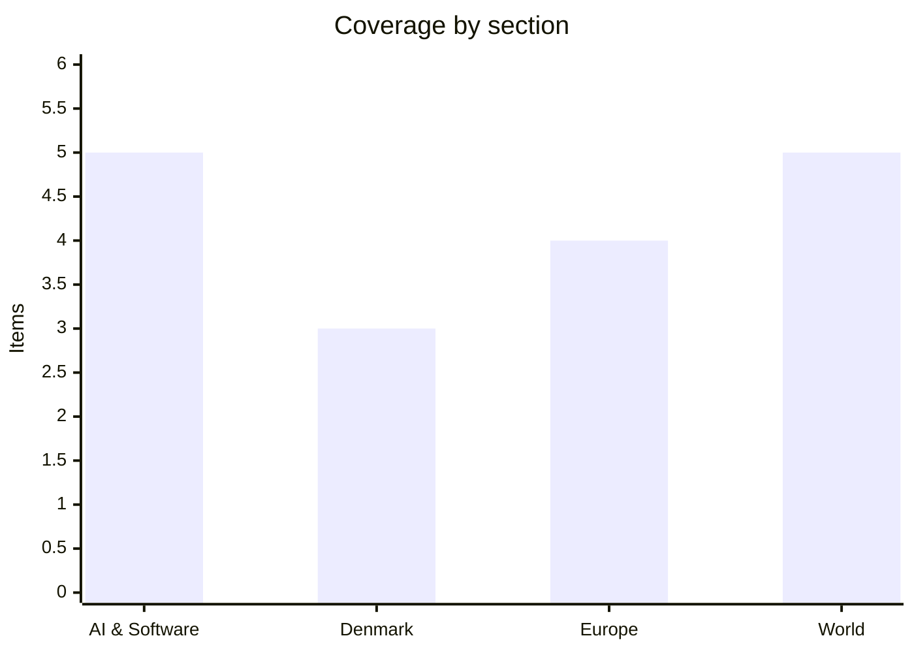

# Daily Briefing — 2026-08-15

**Top line:** Trump told a New York rally he will "pretty soon" declare the Strait of Hormuz a territory of the United States once Iran is defeated — a claim with no basis in international law that lands squarely on the sorest point of the deadlocked ceasefire talks.

## Follow-ups

- **Bezos–Liverpool: confirmed.** The consortium deal was announced Friday at a ~£5.5bn valuation — full item in Europe.
- **Nørre Nebel wolf: shot Thursday** after a drone-assisted hunt — full item in Denmark.
- **Zambia: escalated sharply.** The electoral commission suspended counting nationwide amid violence and rival victory claims — full item in World.
- **Colleferro: accident, provisionally.** Velletri prosecutors opened an inquiry for "causing a fire", early assessments rule out sabotage, and the plant was closed for summer holidays — which explains the zero injuries. No KNDS statement yet on production impact. [Global Banking and Finance](https://www.globalbankingandfinance.com/large-explosion-rips-through-italian-munitions-factory/)
- **Copenhagen Pride parade is today** at 13:00 under the reinforced security regime, with DMI warning of cloudbursts and thunder crossing Denmark overnight into Saturday — full item in Denmark.
- **Hormuz talks:** overtaken by Trump's "territory" declaration — lead item in World.
- **Colombia:** still no substantive confirmation from Bogotá of the joint-operations authorisation beyond Hegseth's account, though De la Espriella has publicly offered to host US troops. [Colombia One](https://colombiaone.com/2026/08/12/pete-hegseth-says-de-la-espriella-authorized-joint-military-operations-with-the-u-s-in-colombia/)
- **Spanish fires:** the Niebla front threatening homes was contained overnight, but conditions worsened at Aznalcóllar near Sevilla and a Huesca fire now threatens the San Juan de la Peña monastery. [Demócrata](https://www.democrata.es/en/current-events/fires-in-spain-today-august-14-fog-worsens-in-aznalcollar-and-the-fire-in-huesca-threatens-san-juan-pena/)
- **US July retail sales fell 0.6%** — the inflation-versus-cooling picture gets its markets item in World.
- **Gemini 3.5 Pro:** another day of silence from Google.

## AI & Software

**Z.ai's GLM-5.3 is "too good at hacking" to open-source on day one — a first for a Chinese lab.** Z.ai released GLM-5.3 on Friday with API access and coding plans available immediately, but broke with its own precedent by withholding the open weights for roughly two weeks of additional safety testing, saying the model's offensive cyber capabilities need stronger controls first — its predecessor GLM 5.2 had shipped MIT-licensed weights within days. The company's stated reason is the benchmark line: a company-reported 84.5% on CyberGym, the vulnerability-detection benchmark, which Z.ai says edges Anthropic's Mythos 5 at 83.8% — and beats Claude Fable 5 and GPT-5.6 Sol — though on exploit *development* it trails Mythos 5 badly, 54.4% against 78%. None of these numbers have independent replication yet. The model is post-trained on a 743-billion-parameter base and also claims roughly 50% improvement over GLM 5.2 on internal coding benchmarks, with the most sensitive cyber functions gated behind a "trusted access" verification programme even after the weights ship. The context that makes this more than a product launch: OpenAI expanded its Daybreak security programme with the deliberately dangerous GPT-5.6-Cyber just days ago (covered Wednesday), and GLM-5.3 shows the same dual-use pressure now operating on the *open-weights* side, where a released model can never be recalled. A Chinese lab voluntarily delaying an open release on safety grounds is genuinely novel — until now the pattern had been Western labs gating capability while Chinese labs competed on openness and price. The second reading is less flattering: a two-week delay with a benchmark press release is also excellent marketing, and "too dangerous to release immediately" has become a familiar way to advertise capability. Either way, the open-versus-closed contest that Meta, Nvidia and DeepSeek escalated last week now has an explicit cybersecurity dimension. Watch what actually ships in two weeks — full weights, or a capability-stripped variant that would set a template for "open, minus the dangerous parts". [Axios](https://www.axios.com/2026/08/14/china-open-source-ai-glm-53) · [SCMP via TechStartups](https://techstartups.com/2026/08/14/top-tech-news-today-august-14-2026-apple-anthropic-deepseek-google-ibm-pony-ai-openai-spacex-uber-more/) · [IBTimes](https://www.ibtimes.sg/glm-5-3-released-what-know-about-chinese-z-ais-new-ai-model-challenging-openai-anthropic-92170)

**Apple has trained its own AI model for China, with Alibaba's help.** Apple has built a custom large language model for the Chinese market with support from Alibaba, per The Verge's reporting Thursday — a significant shift for a company that has so far brought Apple Intelligence to China by leaning on models from Chinese partners, since OpenAI's ChatGPT (its Western integration partner) is unavailable on the mainland *(reported)*. The move follows Apple's recent registration of its on-device generative AI service with Chinese regulators, clearing one of the mandatory hurdles China imposes on generative AI offered to the public. Owning the model rather than renting a partner's gives Apple control over the AI layer on Chinese iPhones at a moment when Huawei and other domestic makers have made on-device AI central to their pitch, and Apple's China sales have spent two years under pressure from exactly that competition. The strategic read extends well beyond Cupertino: China's regulatory wall is forcing global companies into separate technology stacks per market — different models, different infrastructure partners, different compliance regimes — and Apple building a bespoke Chinese model with a Chinese partner is the clearest example yet of AI's geopolitical fragmentation reaching consumer hardware. It also deepens Apple's dependence on Alibaba as a strategic partner in a market where Washington has periodically threatened to scrutinise exactly such arrangements. Watch for the formal Apple Intelligence China launch date and any US political reaction to the Alibaba tie-up. [The Verge](https://www.theverge.com/ai-artificial-intelligence/980160/apple-intelligence-china-custom-ai-model-alibaba)

**OpenAI previews "Ultrafast": GPT-5.6 Sol at 750 tokens per second on Cerebras silicon.** OpenAI introduced an early preview of Ultrafast on Thursday, a new API service tier that runs its top model GPT-5.6 Sol up to 14 times faster than standard processing — up to 750 output tokens per second against roughly 53 on the standard tier — powered by Cerebras's wafer-scale inference hardware. The preview is limited to a select group of API customers, and notably ships with no published price and no general-availability date, which suggests OpenAI is still discovering what latency is worth. The technical significance is that frontier-quality reasoning becomes fast enough to sit inside real-time products — interactive coding environments, customer-facing conversations, agents that take their next action without a perceptible pause — rather than behind an overnight batch job. Cerebras says its testing on knowledge-work tasks showed the end-to-end speedup without quality degradation, a company claim that will get independent scrutiny quickly. The partnership is also a milestone for specialised inference hardware as a competitive layer alongside Nvidia GPUs: OpenAI putting its flagship on Cerebras for a premium tier is the strongest endorsement the alternative-silicon camp has had. It slots into the week's broader pattern — Google competing on price with 3.7 Flash, xAI repricing long context, and now OpenAI productising speed — as the frontier labs stop competing only on intelligence and start segmenting on economics. For anyone building agents, a 14x wall-clock improvement compounds across every step of a multi-call workflow, which is where the real bill and the real waiting live. Watch the eventual pricing, and whether Anthropic and Google answer with fast tiers of their own. [OpenAI](https://openai.com/index/previewing-ultrafast/) · [Cerebras](https://investors.cerebras.ai/news-releases/news-release-details/cerebras-powers-ultrafast-mode-openais-gpt-56-sol) · [TechTimes](https://www.techtimes.com/articles/324514/20260814/gpt-56-sol-now-runs-real-time-speed-openais-ultrafast-preview-offers-no-price-date.htm)

**IBM and OpenAI strike a broad enterprise alliance — consultants become the distribution channel for frontier AI.** IBM and OpenAI announced a strategic partnership Thursday to deploy OpenAI's models and tools across enterprise workflows, application modernisation, software development and cybersecurity, with IBM's consultants and engineers integrating the technology into client operations starting with financial services, government, telecommunications and retail. The deal also connects IBM into OpenAI's enterprise partner ecosystem and its Daybreak security initiative. The logic on both sides is straightforward: OpenAI builds capable models but large corporations still need someone to wire them into decades-old databases, compliance regimes and security policies, which is precisely the integration business IBM has run for generations of enterprise technology. For IBM it answers the awkward question of what a legacy integrator sells in the AI era — it sells the plumbing, alongside its own watsonx line, which this deal quietly relegates to one option among several. The structural signal is that enterprise AI adoption is moving from visible chatbots toward invisible embedding in accounting, claims processing, support and security workflows, where consulting firms rather than app stores decide which models reach the Fortune 500. It is also another data point for OpenAI's revenue diversification ahead of its widely reported IPO ambitions. The open question is exclusivity — nothing announced prevents IBM from wiring Anthropic or Google models into the same clients, so this looks like the first of several such alliances rather than a lock-up. Watch whether Accenture, Deloitte and the other integrators answer with rival lab partnerships. [IBM via TechStartups](https://techstartups.com/2026/08/14/top-tech-news-today-august-14-2026-apple-anthropic-deepseek-google-ibm-pony-ai-openai-spacex-uber-more/) · [Releasebot](https://releasebot.io/updates/openai)

**The FT tallies Big Tech's AI purchase commitments: nearly $1.5 trillion, before counting the leases.** A Financial Times analysis published Friday puts the accumulated purchase commitments of Alphabet, Microsoft, Amazon, Nvidia, Oracle and Meta at close to $1.5 trillion — largely long-term contracts for chips, data-centre capacity and energy — separate from roughly another $1.5 trillion in lease obligations identified by Goldman Sachs *(FT analysis; seen via aggregator coverage)*. Alphabet alone reported its purchase commitments rising dramatically between the first and second quarters as it locked in infrastructure and energy agreements. The reason the number matters is accounting: purchase commitments are future cash obligations that do not sit on balance sheets like debt, so the headline capex figures the market tracks — enormous as they already are — materially understate the sector's true contractual exposure. The economics increasingly resemble heavy industry: massive fixed costs, long-lived contracts and demand assumptions that must eventually be validated by revenue, with limited ability to pull back if AI monetisation disappoints. The timing sharpens the point, because the same week brought evidence that model pricing is deflating — Google halving 3.7 Flash's introductory price, OpenAI's earlier 80% Luna cut — meaning the revenue per unit of compute that must service these obligations is falling even as the obligations grow. The bull case is that usage growth swamps price declines, and the committed capacity is what makes that usage possible; the bear case is a classic capacity cycle dressed in new vocabulary. For investors the practical lesson is to read the commitments notes, not just the capex line. Watch the Q3 filings for whether the commitment curve keeps steepening. [TechStartups (citing FT)](https://techstartups.com/2026/08/14/top-tech-news-today-august-14-2026-apple-anthropic-deepseek-google-ibm-pony-ai-openai-spacex-uber-more/)

## Denmark

**The alleged 'Balrog' mastermind is back in Denmark: extradited from Turkey and remanded for 27 days.** The 32-year-old man prosecutors consider a leading figure in Operation Balrog — the sprawling case named after Tolkien's demon — was extradited from Turkey on Thursday and promptly remanded in custody for 27 days. The charge sheet is heavy: two attempted murders of the same named victim in Kokkedal in May 2025, allegedly carried out through hired assassins recruited over encrypted channels, and the detonation of a hand grenade at a hair-and-nail salon in Copenhagen. The prosecution's theory is that he coordinated five other accused via the Signal messaging service, directing the grenade operation from abroad; he has been held in Turkey since late 2025 awaiting the handover. He is described in Danish reporting as having rocker-gang affiliation, and the case has carried an air of mystery in coverage precisely because a background figure seemed to be orchestrating serious attacks that street-level operatives then executed. The extradition matters beyond this one case: Turkey has historically been a complicated destination for Danish gang figures, and a successful handover of an alleged organiser — not just a triggerman — is the kind of result Danish police have spent years building toward through bilateral channels. It also moves the Balrog complex toward trial with its alleged hierarchy intact, which prosecutors need to prove the coordination charges rather than just the individual acts. Watch the substantive hearings this autumn and whether further extradition requests follow. [DR](https://www.dr.dk/nyheder/seneste/mand-tiltalt-i-sag-om-drabsforsoeg-er-blevet-udleveret-til-danmark) · [TV 2 Kosmopol](https://www.tv2kosmopol.dk/metropolen/formodet-bagmand-til-drabsforsog-udleveret-fra-tyrkiet-86aa4) · [Kristeligt Dagblad](https://www.kristeligt-dagblad.dk/formodet-bagmand-bag-attentatforsoeg-udleveret)

**The Nørre Nebel wolf is dead — shot after a hunt that put a controversial Chinese drone in Danish skies.** Naturstyrelsen shot the West Jutland problem wolf on Thursday, ending the drone-assisted hunt that had run since the animal approached playing children in Nørre Nebel gardens in three episodes on August 5. The killed animal was a young male showing no particular shyness toward the agency's staff — the behavioural marker that had triggered the escalation — and the agency expressed high confidence it was the right wolf, though DNA confirmation follows. The operational details are the interesting part in hindsight: the agency used an SMS tip service, shotgun permissions on private land without the usual proximity-documentation requirement, and a thermal-imaging drone — which Ingeniøren reports was a Chinese-made model whose deployment in a state operation is itself controversial, given the running Danish debate about Chinese drones in critical and official use. The nature minister's framing was unapologetic: a wolf that has lost its natural fear of humans must be shot. The kill validates the regulation-zone system built after years of Oksbøl controversy — the escalation ladder from documentation to shoot-on-sight worked, and quickly, once fully engaged. Wolf-protection groups will note the animal never injured anyone; rural municipalities will note it took nine days and special permissions to remove a wolf that repeatedly sought out children. Both readings will feature when the framework next faces revision, and the drone-sourcing question now has its own afterlife in procurement debates. Watch the DNA confirmation and any political follow-up on Chinese equipment in state wildlife operations. [DR](https://www.dr.dk/nyheder/indland/problemulv-i-vestjylland-er-blevet-skudt) · [Ingeniøren](https://ing.dk/artikel/kontroversiel-kinesisk-drone-blev-indsat-i-jagten-paa-problemulv)

**Pride parade day in Copenhagen: 250,000+ expected, reinforced security — and DMI's storm warning hanging over the route.** Copenhagen Pride's parade steps off today at 13:00 from Frederiksberg City Hall, following the route down Frederiksberg Allé and Vesterbrogade to Pride Square at City Hall Square, with organisers and police expecting well over 250,000 participants and spectators in what is typically Denmark's largest recurring public event. This year's edition runs under the reinforced security regime — a large professional setup in close coordination with police — that has been the standard since threat assessments against LGBT+ events tightened across Europe, and The Copenhagen Post's practical guidance to attendees this week reflected that changed baseline: expect visible policing, bag checks and crowd-flow management. The complication is the sky: DMI has warned of powerful showers with cloudbursts, thunder, hail and local downpours of 15–25 millimetres in half an hour crossing the country from Friday night into Saturday, and the forecast's uncertainty is about placement and timing rather than whether the unstable air arrives. Organisers have not signalled any change to the programme. The parade is the finale of a Pride Week that has otherwise run without incident, which is itself the news given the security anxiety that surrounded the buildup. Watch this evening's attendance figures, the weather's actual behaviour over Zealand mid-afternoon, and whether the security operation stays as invisible as everyone hopes. [Copenhagen Pride](https://www.copenhagenpride.dk/en/event/copenhagen-pride-parade-2026-2/) · [The Copenhagen Post](https://cphpost.dk/2026-08-13/art-culture/copenhagen-pride-2026-what-to-know-about-the-parade-safety-children-and-getting-around/) · [DMI](https://www.dmi.dk/varsler)

Otherwise a genuinely quiet Danish news Friday — no major political or business developments worth an item.

## Europe

**France confirms a tax-authority breach: data on 678,000 taxpayers stolen — the hacker claims two million.** France's Finance Ministry confirmed late Thursday that a malicious actor accessed and extracted taxpayer data from the DGFiP, the General Directorate of Public Finances, affecting both individuals and businesses — the ministry puts the confirmed count at 678,000 people, while a hacker using the alias "ZeroBytes" is touting a database of more than two million records. The intrusion technique, per the attacker's own account and reporting by The Register and The Record, ran through access to internal servers that allowed a VPN connection into the agency's network, where an internal search tool could then be used to look up individuals and businesses at will; the access was reportedly gained in late June and detected and severed the same month — meaning the public confirmation followed the criminal's advertisement of the data, not the detection. Affected taxpayers will be contacted individually about what was exposed. Tax records are among the richest identity datasets a state holds — income, employment, property, family structure, bank details for refunds — and unlike passwords they cannot be rotated after theft, making this a years-long phishing and fraud resource regardless of what happens to this particular database. The breach lands in a running series of French public-sector compromises — the health-insurance and social-security incidents of recent years among them — that has made the state's custodianship of citizen data a recurring political vulnerability. It also arrives days after the French government's broader cybersecurity posture was already under scrutiny from this summer's incidents. Watch for the confirmed scope (678,000 versus two million matters), any ransom or sale of the dataset, and whether ANSSI's investigation attributes the intrusion. [The Register](https://www.theregister.com/security/2026/08/14/french_tax_authority_admits_data_heist_after_crook_touts_2m_records/5287885) · [The Record](https://therecord.media/french-tax-authority-dgfip-confirms-data-breach) · [Reuters via Yahoo](https://www.yahoo.com/news/articles/french-taxpayers-data-stolen-cyber-073340174.html)

**Etna's ash keeps Catania airport shut a fifth day — the longest volcanic closure since 2002, at the peak of Ferragosto.** Persistent ash emissions from Mount Etna kept Sicily's busiest airport closed for a fifth consecutive day Friday, with operator SAC extending the shutdown into early Saturday — the Ferragosto holiday itself, the apex of the Italian summer travel season. The disruption numbers are substantial: 36% of the nearly 2,000 flights scheduled into Catania between August 6 and 12 were cancelled, and more than 600 were diverted to Palermo, Trapani, Comiso and Lamezia Terme, airports hours away by road and themselves running at holiday capacity. Etna disrupts Catania's operations routinely — the airport sits about 30 kilometres south of the crater — but volcanologists note this ash emission has been far more persistent than the short eruptive pulses of recent decades, making it the longest such emergency in 24 years. The physics is unforgiving: volcanic ash melts inside jet engines and can stall them, so there is no flying through it, only around or not at all. The economic hit concentrates on Sicily's tourism-dependent east coast in its highest-revenue week, with hotels absorbing stranded guests and losing arrivals simultaneously. There is no forecastable end to an ash emission, which is what separates this from a storm closure — the airport reopens when the mountain decides. Watch whether Saturday's planned reopening holds, and the accumulating compensation and rebooking chaos under EU261 as the cancellation count climbs. [Euronews](https://www.euronews.com/my-europe/2026/08/14/ash-from-mount-etna-volcano-forces-closure-of-sicilys-busiest-airport-during-peak-holiday-) · [AP via Washington Post](https://www.washingtonpost.com/world/2026/08/14/italy-etna-volcano-airport-closure-catania/4af7ce20-97cb-11f1-9ef9-1be722184483_story.html)

**Ukraine's refinery campaign compounds: Orsk fully halted "for months" as a fourth refinery in three days is hit.** The cumulative effect of Ukraine's deep-strike campaign against Russian oil infrastructure became concrete this week: the governor of Orenburg Oblast confirmed that the Orsk refinery — roughly 1,300 kilometres from the border, struck most recently overnight into Thursday — has completely halted processing, with repairs expected to keep it down for months. Ukrainian drones hit what officials described as the fourth refinery in three days, extending the wave that already reached Gazprom's Salavat complex in Bashkortostan (covered Friday), and Ukrainian forces additionally targeted a refinery in Tatarstan as attacks were reported in occupied Crimea and Donetsk Oblast. Russia claimed 456 Ukrainian drones intercepted in a single night — a figure that, whatever its accuracy, indicates the scale Kyiv is now flying at. The strategic accounting is increasingly visible inside Russia: fuel shortages across 16 regions per this week's reporting, wholesale price pressure, and repair capacity that cannot keep pace with re-strikes on the same facilities. Russia's counterpart campaign continued with 133 Shahed-type drones and loitering munitions launched against Ukraine overnight into Friday, per Ukraine's Air Force, in the grinding symmetry of the deep-strike war. Kyiv's stated theory — officials call the strikes "long-range sanctions" — is that degrading Russia's refining economy is the pressure Western sanctions never delivered, and the multi-month Orsk outage is the strongest single data point that theory has produced. Watch Russian gasoline export restrictions and rationing signals as the shortage spreads, and whether Moscow answers with another mass barrage on Ukraine's grid as autumn approaches. [Kyiv Independent](https://kyivindependent.com/ukrainian-forces-target-russian-oil-refinery-in-tatarstan-as-attacks-reported-in-occupied-crimea-donetsk-oblast/) · [ABC News](https://abcnews.com/International/wireStory/ukraines-drones-hit-major-russian-refinery-800-miles-135605504) · [Kyiv Independent (Orsk)](https://kyivindependent.com/ukraine-attacks-one-of-russias-largest-refineries-for-2nd-night-in-a-row-locals-report/)

**Bezos buys into Liverpool: the confirmed deal values the club at £5.5 billion.** The two-week-old reports resolved Friday: Liverpool FC and Fenway Sports Group confirmed the sale of a 30% stake to 1892 Holdings, a consortium led and managed by Amit Bhatia — son-in-law of steel billionaire Lakshmi Mittal — with Jeff Bezos as lead investor through his K5 Sports vehicle, alongside EE Capital, the family office of Eduardo and Elaine Saverin, and the Mittal Family Trusts. The transaction values Liverpool in the region of £5.5 billion (reports put the dollar figure at $7–7.5 billion), among the highest valuations ever attached to a football club, and FSG retains majority ownership and operational control. The governance outcome is deliberately quiet: Bezos takes no position at the club, while Bhatia joins the board as vice-chairman — a structure that reads as capital and connections without a change of regime, and consciously avoids the fan backlash that greets ownership upheavals at English clubs. For FSG the logic is crystallising paper value and funding capacity while keeping control; for the investors it is a scarcity asset — top-six Premier League clubs essentially never come to market — bought at a moment when US capital has already consumed most of the league. The Bezos name nonetheless changes the club's ceiling in perception terms, and speculation about eventual full ownership will now be permanent background noise, whatever Friday's structure says. Sport is normally outside this briefing's scope, but a $7 billion valuation event with this investor set is a business story wearing a football shirt. Watch whether the new capital shows up in the January transfer window, and which club US mega-capital targets next. [ESPN](https://www.espn.com/soccer/story/_/id/49610494/liverpool-owners-fsg-sell-stake-consortium-jeff-bezos-amit-bhatia) · [ITV](https://www.itv.com/news/granada/2026-08-14/jeff-bezos-in-consortium-for-confirmed-stake-in-liverpool-fc) · [Sportico](https://www.sportico.com/business/team-sales/2026/jeff-bezos-liverpool-stake-bhatia-saverin-1234941903/)

## World

**Trump: "Pretty soon I'll be declaring the Hormuz Strait a territory of the United States."** Speaking to a law-enforcement gathering in New York on Friday, Trump announced he will declare the Strait of Hormuz a US territory once the war against Iran is won — "after we finish defeating Iran, which is being very badly defeated, pretty soon I'll be declaring the Hormuz Strait a territory of the United States" — delivered, per Al Jazeera's account, with a chuckle, alongside praise for the US blockade as "unstoppable... a wall of steel" and a framing of the whole operation as "a great service for the world". The declaration has no mechanism in international law, which protects transit through straits and does not recognise territorial claims over international waterways, and legal experts had already dismissed the milder July version of this idea — the US as toll-collecting "guardian" taking 20% of transiting cargo value. But as negotiation signalling it lands precisely on the sticking point: control of the strait is the central unresolved issue in the deadlocked US–Iran talks, six months into a war that has kept the strait restricted since Iran's response to the February 28 strikes, with the June 17 memorandum of understanding long since collapsed into mutual violation claims. Iran's deputy foreign minister Kazem Gharibabadi answered within hours: "The Strait of Hormuz cannot be taken over by a tweet, nor by an aircraft carrier, nor by issuing a decree, nor by an election speech." The domestic context is the tell — Trump was in New York campaigning for Republicans ahead of midterms in which control of Congress hangs in the balance, while a late-July Quinnipiac poll finds 60% of US voters oppose the military action against Iran, and reporting points to strained munitions stockpiles limiting escalation options. Treasury Secretary Scott Bessent separately said new economic measures against Iran may come within days, suggesting the pressure track is shifting economic as the military track plateaus. The plausible readings run from midterm applause line to genuine annexation intent, and Trump's Greenland and Canada record means neither can be fully discounted. Watch Tehran's operational response in the strait, the promised Bessent measures, and whether any formal "declaration" document actually materialises. [Al Jazeera](https://www.aljazeera.com/news/2026/8/14/trump-says-he-will-declare-strait-of-hormuz-a-us-territory) · [The Hill](https://thehill.com/homenews/administration/6030671-trump-says-strait-of-hormuz-us-territory/) · [NBC](https://www.nbcnews.com/politics/trump-administration/live-blog/trump-congress-2026-elections-doj-live-updates-rcna592467)

**Zambia's vote count is suspended nationwide — with two men claiming the presidency.** Zambia's post-election standoff escalated Friday when the Electoral Commission suspended counting and the announcement of results across the country, citing violence during tabulation — including reported attacks on polling staff and alleged theft of marked ballots — leaving Thursday's presidential election with no official results and two candidates asserting victory *(situation fluid)*. Opposition leader Brian Mundubile of the NRPUP claims his party's parallel voter tabulation, compiled from polling-station data nationwide, shows him winning outright, and he has escalated his rhetoric with allegations that military personnel took control of totalling centres in Mufulira and that election documents were removed — claims without independent verification. President Hakainde Hichilema, seeking a second term, urged calm and said his camp continues to receive "encouraging results". The suspension is the dangerous part: parallel tabulations and delayed official counts are the classic ingredients of African electoral crises, because the information vacuum lets both sides harden supporters around incompatible certainties. The irony is heavy — Hichilema himself came to power in 2021 as an opposition candidate whose victory was protected by exactly the kind of transparent, prompt counting now suspended, and Chatham House had warned before the vote that his democratic reputation depended on the process holding. Cost-of-living anger made the race genuinely competitive, so neither claim can be dismissed on priors. The next 72 hours decide whether this resolves as an administrative pause or curdles into a contested-legitimacy crisis with street mobilisation. Watch the ECZ's resumption timeline, international observer statements, and any deployment of security forces around Lusaka. [MSN/Africanews](https://www.msn.com/en-xl/politics/elections/zambia-election-2026-electoral-commission-suspends-presidential-results-as-candidates-claim-victory/ar-AA2a7LO3) · [allAfrica](https://allafrica.com/stories/202608140407.html) · [Zambian Observer](https://zambianobserver.com/ecz-suspends-counting-and-announcement-of-results/)

**Kushner, Mladenov and Blair fly in Sunday to rescue the Gaza plan Netanyahu rejected.** The Board of Peace's three operating figures — Jared Kushner, UN envoy Nickolay Mladenov and Tony Blair — will arrive in Israel on Sunday and continue to Egypt, in the most direct intervention yet to salvage Trump's 20-point Gaza framework after Netanyahu's rejection of its disarmament sequencing last week and the end of the week-long strike pause. The choreography of the dispute is now explicit: the plan would have Hamas gradually transfer weapons to a Palestinian third party while Israel concurrently withdraws — Netanyahu rejects the concurrency, demanding genuine disarmament before withdrawal, while Hamas calls the framework "comprehensive" but conditions any disarmament movement on Israel halting strikes and pulling back to the October ceasefire's yellow line. That is a solvable sequencing gap on paper and a nearly unbridgeable trust gap in practice. Washington's leverage is real but awkward — a senior official's "very, very disappointed" line about Israeli non-compliance stands, yet the administration cannot afford the plan's collapse any more than Jerusalem can afford an open break with Trump. Netanyahu's calculus remains dominated by October 27 elections eleven weeks out and the far-right defection threats that every concession triggers. The visit's realistic ceiling is a restored strike pause plus resumed humanitarian commitments — the preconditions Kushner and Mladenov reportedly see for even approaching Hamas about weapons — rather than a breakthrough on disarmament itself. Egypt's inclusion points at the Rafah and reconstruction files, where Cairo holds the keys the plan needs. Watch what the trio actually extracts Sunday–Monday, whether the chief-of-staff approval throttle on strikes holds through the visit, and any Hamas statement engaging the disarmament question concretely. [The National](https://www.thenationalnews.com/news/mena/2026/08/14/kushner-visit-egypt-israel-tony-blair-nickolay-mladenov-gaza/) · [Al Jazeera](https://www.aljazeera.com/news/2026/8/14/kushner-to-visit-israel-after-netanyahu-rejects-gaza-board-of-peace-plan) · [Times of Israel](https://www.timesofisrael.com/liveblog-august-14-2026/)

**Record rain drowns Chiba: at least five dead — 451 millimetres in six hours east of Tokyo.** Record-breaking rainfall flooded the Japanese prefecture of Chiba east of Tokyo from Thursday evening into Friday, killing at least five people by initial official counts — with later tallies reported as high as eight — injuring more than two dozen and stranding thousands *(toll unsettled)*. The meteorology was extreme by any standard: the Japan Meteorological Agency recorded 351 millimetres at Chiba station on Thursday, the highest daily total since records began there in 1966, while an observation station in Chiba City's Midori Ward measured roughly 450 millimetres in the six hours from 6pm and hourly rates in Chuo Ward hit 115 millimetres — the 100-millimetre-per-hour threshold DR cited is roughly a month of Danish rain in sixty minutes. The Ground Self-Defense Force evacuated some 4,000 people stranded for hours at Soga station after rail lines flooded, around 170 homes were inundated, more than 300 people sheltered in public facilities, and some 20,000 households lost power at the peak. Evacuation orders that at one point covered several hundred thousand residents were lifted for most areas Friday as the JMA downgraded its highest-level emergency warnings across a dozen municipalities — while forecasting more rain into the weekend, keeping saturated ground and swollen rivers dangerous. Chiba's flat coastal geography and dense commuter infrastructure make it a recurring flood victim, but the rainfall intensity here fits the broader pattern of stalled convective systems delivering once-per-century totals with increasing frequency across East Asia. The toll's relative modesty against the rainfall extremity is a testament to Japan's warning and evacuation machinery — and the deaths that did occur were largely in cars and basements, the usual blind spots. Watch the weekend's additional rainfall and the final casualty reconciliation. [Al Jazeera](https://www.aljazeera.com/news/2026/8/14/record-rainfall-leaves-four-dead-thousands-stranded-in-japan) · [The Watchers](https://watchers.news/2026/08/14/record-rainfall-floods-and-outages-hit-chiba-leaving-at-least-8-dead-japan/) · [Manila Times](https://www.manilatimes.net/2026/08/14/world/record-breaking-rain-floods-chiba-east-of-tokyo-killing-at-least-5/2405784)

**The US consumer blinks: July retail sales fall 0.6%, the worst month in over a year, and the record rally stalls.** US retail sales fell 0.6% in July, the sharpest monthly decline since May 2025 and far below the +0.1% consensus, with pullbacks concentrated in online retail and auto dealers; excluding autos and gasoline, sales still fell 0.2%. The release complicates the week's comfortable narrative — Tuesday's tame CPI and Wednesday's flat PPI had markets pricing disinflation with a resilient consumer, and Friday's data suggests the consumer may be cooling faster than the price data implied. Equities took it mildly rather than badly: the S&P 500 slipped back from Thursday's record 7,798.99 close, trading marginally lower on the day as the indexes digested the data, while rate expectations continued drifting toward a September Fed hold — weak consumption argues against hikes, though it starts to whisper about growth rather than just inflation. The two-sided risk is what makes the print notable: 4.7% wholesale inflation with a softening consumer is the uncomfortable quadrant where policy mistakes live, and it sharpens the stakes for Jackson Hole later this month, where the Fed either blesses the market's dovish drift or pushes back. Oil's continued softness — Brent in the high $80s despite Hormuz remaining closed and Trump's territorial theatrics — quietly supports the disinflation side. One weak retail month after a strong run is noise until confirmed; two would be a trend. Watch August consumer indicators, Fed speakers into Jackson Hole, and whether the record-high market keeps shrugging off data that would once have moved it. [Bloomberg](https://www.bloomberg.com/news/articles/2026-08-14/us-retail-sales-fall-by-most-in-more-than-a-year) · [Benzinga](https://www.benzinga.com/markets/market-summary/26/08/61209330/us-stocks-mixed-retail-sales-fall-in-july) · [Eurasia Business News](https://eurasiabusinessnews.com/2026/08/14/stock-market-today-sp-500-slips-from-record-as-us-retail-sales-fall/)

## Watch list

- **Sunday:** Kushner, Mladenov and Blair arrive in Israel, then Egypt — first test of whether the strike pause can be restored.
- **Monday Aug 17:** Ulchi Freedom Shield begins with 18,000 South Korean troops; North Korea has promised "terrible consequences" — launches likely in the window.
- **Coming days:** Zambia's ECZ must resume and declare — or the standoff hardens; Bessent's promised new economic measures against Iran; Catania airport's Saturday reopening attempt.
- **Later:** GLM-5.3's open-weight release in ~two weeks — full weights or capability-stripped; Iceland's EU referendum Aug 29.
