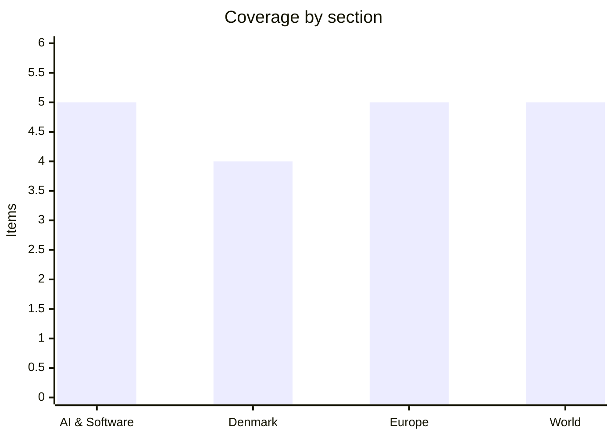

# Daily Briefing — 2026-08-16

**Top line:** Europe's wildfire emergency has moved north — Germany is fighting the largest forest fire in North Rhine-Westphalia's history and Croatia the worst in its modern history — with von der Leyen putting the continent on "high wildfire alert" and a Dutch bank estimating that this summer's heat and drought will erase most of the EU's 2026 growth.

## Follow-ups

- **Catania reopened.** Sicily's busiest airport resumed flights Saturday at 14:00 local time after the volcanic alert was downgraded from red to orange, ending a week of closures that began August 8. The Ferragosto peak was lost regardless.
- **Zambia's count restarted.** The ECZ resumed and began releasing presidential results in batches Saturday (13:00 and 20:00 announcements), with verification running 15–17 August and the formal presidential declaration now set for Monday 17 August.
- **The Board of Peace trio landed.** Kushner, Mladenov and Blair arrived in Israel Sunday as scheduled and continue to Cairo — see World below.
- **Ulchi Freedom Shield still starts Monday.** No new North Korean launch since the August 12 midrange missile; Pyongyang remains publicly silent, which analysts read as unusual.
- **GLM-5.3 weights:** no movement. Z.ai's promised open release is still roughly a week and a half out.

## AI & Software

**Anthropic explains how Claude's text watermark actually works — and admits what it cannot do.** Anthropic published a detailed post on Saturday setting out the mechanics of the watermarking it announced earlier in the week, after several days of user argument about what the company would be embedding in Claude's output. The technique for text is statistical rather than steganographic: the watermark subtly biases Claude's word choices so that a detectable pattern emerges across enough generated content, and because the bias lives in the token selection itself, the mark survives being copied and pasted out of the app. For files rather than raw text, Anthropic is using C2PA, the open content-provenance standard already adopted across parts of the imaging industry. The commitment is unusually broad in scope — it covers the consumer app, the Claude Platform API, Claude Code, Claude Cowork and Claude Tag, plus Claude accessed through AWS, Google Cloud and Microsoft Foundry, and it applies worldwide rather than only inside the EU. The driver is regulatory: Anthropic signed the EU AI Act's Article 50(2) Code of Practice on Transparency of AI-Generated Content, which took effect August 2 and requires machine-readable marking of generative output. The honest part of the post is the limitations — a detected mark shows only that content "may have been processed by Claude", and the absence of a mark does not establish that content is human-written, which means the system is close to useless as an academic-plagiarism or hiring-screen tool and is really built for provenance at scale. The wider significance is the pattern it sets: a European transparency rule is being implemented globally by a US company because maintaining two output pipelines is harder than complying everywhere, the same Brussels-effect dynamic GDPR produced. The unresolved question is detection tooling — Anthropic promises detectors and further documentation but has not shipped them, and a watermark nobody can check is a policy artefact rather than a control. Watch whether OpenAI and Google follow with comparable text watermarking, and how quickly paraphrasing tools appear that claim to strip the bias. [TechCrunch](https://techcrunch.com/2026/08/15/anthropic-shares-more-details-about-how-claudes-new-watermarks-will-work/) · [Euronews](https://www.euronews.com/next/2026/08/11/eu-compliance-delivered-globally-anthropic-to-watermark-claudes-output-worldwide) · [The Register](https://www.theregister.com/ai-and-ml/2026/08/11/anthropic-pledges-to-embed-watermarks-to-help-discern-ai-slop-in-sop-to-eu/5285792)

**Alibaba ships Qwen3.8-27B fully open under Apache 2.0 — the exact move Z.ai declined to make.** Alibaba's Qwen team released Qwen3.8-27B on Hugging Face and ModelScope, a dense 27.78-billion-parameter multimodal model accepting text, images and video, with a native 262,144-token context window and no licensing strings — Apache 2.0, weights included, immediately. The benchmark deltas against its predecessor Qwen3.6-27B are the interesting part and are company-reported: Terminal-Bench 2.1 from 63.4 to 73.0, DeepSWE 1.1 from 13.3 to 42.2, OSWorld-Verified from 63.9 to 84.3 and SWE-MM from 25.7 to 38.6 — gains concentrated in agentic coding and computer use rather than raw knowledge, achieved without growing the published decoder size. The practical claim being made for it is deployability: at 4-bit quantisation it fits in roughly 17 GB of VRAM, which puts a capable multimodal agent on a single consumer-grade card rather than a rented cluster. The timing is pointed, because Friday's story was Z.ai withholding GLM-5.3's weights for two weeks of safety testing on cyber-capability grounds; Alibaba answering within 48 hours with an unrestricted Apache-2.0 release is the open-weights camp declining to accept that precedent. Whether that is principle or competitive positioning is not knowable from the outside — Alibaba has commercial reasons to want the permissive-licence high ground while Qwen builds ecosystem share against Llama and DeepSeek derivatives. For engineering teams the concrete significance is that the gap between "the frontier model you rent" and "the model you can run on-premise under your own compliance regime" narrowed again, particularly for agentic workloads where per-call API costs compound. None of the benchmark numbers have independent replication yet, and vision-language self-reporting has been an unreliable genre. Watch third-party evaluations over the coming week, and whether Z.ai's eventual GLM-5.3 release ships full weights or the capability-stripped variant that would look very different next to this. [Hugging Face (Qwen/Qwen3.8-27B)](https://huggingface.co/Qwen/Qwen3.8-27B) · [OfficeChai](https://officechai.com/miscellaneous/alibaba-releases-qwen-3-8-27b-beats-muse-glimmer-30b-on-many-benchmarks/) · [Warp2Search](https://www.warp2search.net/story/alibaba-drops-qwen38-opensource-ai-24t-moe-and-27b-visionlanguage-models-hit-huggingface)

**SMIC raises wafer prices as AI demand pushes China's biggest foundry to 93.7% utilisation.** SMIC, China's largest chip foundry, told analysts it has raised prices for its most sought-after manufacturing capacity and will charge more for wafers processed in the third quarter, after AI-related demand drove record second-quarter revenue of about $3 billion. Co-CEO Zhao Haijun said the increases followed customer negotiations that began in the first quarter, with utilisation reaching 93.7% against 93.1% the previous quarter and monthly capacity rising to 1.0965 million standard 8-inch-equivalent wafers from 1.07825 million. The company is now weighing an unplanned equipment expansion — a surprise, given that SMIC's capital planning has been constrained for years by US export controls on advanced lithography — and is accelerating qualification of new production lines while reallocating existing capacity toward AI customers. The reason this matters outside China is that foundry pricing is the base of the entire cost stack: Hua Hong has been lifting 12-inch prices through 2026 as well, and rising wafer costs eventually reach every device that is not a leading-edge accelerator. It also complicates the comfortable Western narrative that export controls have capped Chinese AI hardware — SMIC cannot make the newest logic, but it is selling every wafer it can produce at rising prices to a domestic AI industry that keeps shipping competitive models. The demand mix is worth noting as a second reading: near-total utilisation at a sanctioned foundry may reflect domestic customers stockpiling against further restrictions as much as genuine end-demand. For anyone budgeting hardware, the direction of travel across foundry, OSAT and memory pricing has been uniformly upward this year. Watch whether SMIC confirms the capacity expansion and how far into consumer electronics the mature-node price increases propagate. [Reuters via Yahoo Finance](https://finance.yahoo.com/technology/ai/articles/chinese-chipmaker-smic-increases-prices-030934165.html) · [Taipei Times](https://www.taipeitimes.com/News/biz/archives/2026/08/15/2003862509) · [Seoul Economic Daily](https://en.sedaily.com/international/2026/08/15/chinas-smic-eyes-surprise-capacity-boost-on-ai-chip-demand)

**Nvidia's 13F reveals a $21 billion SpaceX position — and $30 billion in Intel.** Nvidia's quarterly SEC 13F filing, made Friday and picked over through the weekend, disclosed 122.8 million Class A shares of SpaceX worth roughly $21 billion at the end of the second quarter, making the rocket company Nvidia's second-largest disclosed equity holding behind a $30 billion Intel stake. The SpaceX position was not bought directly: it came from Nvidia's $10 billion investment in xAI, converted into SpaceX equity when SpaceX absorbed xAI in February — meaning a chip supplier's strategic investment in a customer has roughly doubled on paper while that customer commits to buying only its chips. Elon Musk has said Nvidia silicon will be the exclusive hardware for SpaceX's AI data centres and frontier models, which is the circularity that makes the disclosure more than a portfolio curiosity. The figure has already moved against Nvidia: SpaceX shares closed at $140 on Friday against $170.86 at the end of June, cutting the stake's mark-to-market value to about $17.2 billion as of the filing date — a $3.8 billion swing in six weeks on a private-market valuation. The broader pattern this fits is the one the FT quantified on Friday with its $1.5 trillion tally of Big Tech purchase commitments: the AI buildout increasingly runs on cross-holdings, vendor financing and exclusivity arrangements between a small number of counterparties, where the same dollar can appear as revenue at one company and an asset at another. Nvidia's defenders will note the investments are strategically rational and were made at attractive prices; the bearish reading is that a supplier funding its customers' ability to buy from it is a pattern with a poor historical record. Neither reading requires anyone to be acting in bad faith. Watch the Q3 mark on the SpaceX position and whether Nvidia discloses further equity stakes in AI customers. [CNBC](https://www.cnbc.com/2026/08/14/nvidia-discloses-21-billion-stake-in-spacex-at-end-of-second-quarter.html) · [Bloomberg](https://www.bloomberg.com/news/articles/2026-08-14/nvidia-has-21-billion-spacex-stake-30-billion-in-intel-shares) · [Stocktwits](https://stocktwits.com/news-articles/markets/equity/nvda-discloses-21-billion-stake-in-spacex-elon-musks-rocket-firm-becomes-nvidias-no-2-holding/cZotyxyRJKP)

**Google pushes HEIR into its Private Computing Toolkit: running model inference on data the server never sees.** Google has promoted HEIR — Homomorphic Encryption Intermediate Representation — into its Private Computing Toolkit, positioning the open-source, MLIR-based compiler toolchain as the piece that makes cryptographically private AI inference practical rather than theoretical. The premise of fully homomorphic encryption is that computation runs directly on encrypted data, so a server can produce an encrypted answer without ever decrypting the question; the historic obstacle has never been the mathematics but the engineering, because hand-writing FHE circuits requires cryptography expertise and produces slowdowns measured in orders of magnitude. HEIR's contribution is compiler infrastructure: it defines layers of abstraction for homomorphic computation and lowers between them through passes that automate the parts practitioners previously did by hand — ciphertext data layout, encryption parameter selection, and arithmetisation — with the goal of converting existing pretrained models into FHE-compatible versions without a cryptographer in the loop. It is genuinely open source, on GitHub at google/heir, and has an accompanying academic paper describing it as a universal compiler for homomorphic encryption. The commercial logic is regulatory as much as technical: healthcare, finance and public-sector buyers across the EU are increasingly unwilling to send plaintext to a model provider, and FHE inference is one of the few architectures that removes the trust requirement entirely rather than papering it with contracts. The honest caveat is performance — FHE inference remains dramatically slower than plaintext, and nothing in a compiler release changes that arithmetic, only who has to fight it. Treat this as infrastructure maturing rather than a capability arriving. Watch for published benchmarks on realistic model sizes and whether any commercial inference provider ships an FHE tier. [Google Developers Blog](https://developers.googleblog.com/expanding-our-fully-homomorphic-encryption-offering/) · [Google blog](https://blog.google/security/how-google-is-making-private-ai-practical-with-homomorphic-encryption/) · [GitHub (google/heir)](https://github.com/google/heir)

## Denmark

**A 16-year-old is dead after a stabbing at a Roskilde freshers' party — a peer is charged with murder.** A 16-year-old boy died Friday evening after being stabbed multiple times at a *puttefest*, the traditional Danish gymnasium freshers' party, held at Folkeparken near Louisevej in Roskilde; police received the call at 17:33 and the boy was airlifted to Rigshospitalet, where his life could not be saved. Mid- and West Zealand Police arrested another 16-year-old at the scene and charged him with murder; at a closed preliminary hearing on Saturday he denied guilt and was remanded to a secure youth institution until 10 September. The victim had started at Himmelev Gymnasium only a week earlier, which is what a *puttefest* is — the party where first-year students are welcomed by the older cohort. Police took the unusual step of asking the public not to share video of the incident circulating on social media, a request the duty officer repeated on Saturday. The case lands in the middle of a long-running Danish argument about knives among young people: the knife-crime statistics that drove the 2021 tightening of the weapons law and the subsequent debate over minimum sentences for carrying, versus a counter-argument that the sentences have not changed the behaviour. Both the accused and the victim being 16 makes this legally and politically awkward — Denmark's criminal age of responsibility is 15, and a murder charge against a 15-to-17-year-old routes through the youth-justice framework rather than ordinary sentencing. The school community response and the closed courtroom mean details will stay thin for a while. Watch for the charge's development as the investigation completes, and for political statements when the Folketing returns from summer recess. [DR](https://www.dr.dk/nyheder/indland/16-aarig-doed-efter-knivstik-i-roskilde) · [TV 2](https://nyheder.tv2.dk/live/krimi/2026-08-15-16-aarig-dreng-doed-efter-knivoverfald-i-roskilde) · [Sjællandske Nyheder](https://www.sn.dk/art6623619/roskilde-kommune/112/vagtchef-efter-drab-paa-gymnasie-elev-del-ikke-denne-video/)

**Dansk Folkeparti is now Denmark's largest blue party — and Messerschmidt the blue bloc's preferred prime minister.** A new Epinion poll for DR and Altinget puts Dansk Folkeparti at 12.2%, making it the clearly largest party in the blue bloc and the second-largest party in the Folketing behind only the Social Democrats. The internal blue-bloc question is the sharper finding: 20% of blue voters name Morten Messerschmidt as their preferred prime minister against 18% for Venstre's Troels Lund Poulsen, a reversal of the assumption that Venstre supplies the right's candidate by default. The poll's flow analysis shows DF drawing from Liberal Alliance, the Social Democrats and Danmarksdemokraterne, but most heavily from former voters of Lars Boje Mathiesen's Borgernes Parti — a party that took protest votes at the last election and has since fragmented. The context is DF's near-death experience: reduced to 2.6% and five seats in 2022 after the Thulesen Dahl era ended in scandal and defection, the party was widely written off, and Messerschmidt has rebuilt it by reclaiming immigration ground that Danmarksdemokraterne and the Social Democrats had both occupied. For the blue bloc as a whole this is a leadership problem rather than a vote-total problem — the parties have been running close to or slightly ahead of red in recent polling, but a bloc whose largest party is DF has a harder path to a governing majority, because the Moderates and Radikale are unlikely partners. Venstre's decline from natural party of government to the number-two blue party is the structural story underneath the headline. Polls a year out from a required election are indicative rather than predictive, and DF has surged and collapsed before. Watch whether the finding survives other pollsters, and how Venstre responds to a leadership question it did not expect to be having. [DR](https://www.dr.dk/nyheder/politik/ny-maaling-goer-df-til-landets-stoerste-blaa-parti) · [DR (Messerschmidt as PM)](https://www.dr.dk/nyheder/politik/reels/messerschmidt-er-de-blaa-vaelgeres-foretrukne-statsminister) · [MinByAalborg](https://minbyaalborg.dk/df-stoerste-blaa-parti-epinion)

**Copenhagen Pride's parade drew close to 250,000 — with the prime minister in it, and the forecast storm never arrived.** Saturday's Copenhagen Pride parade stepped off at 13:00 from Frederiksberg City Hall and ran its usual route down Frederiksberg Allé and Vesterbrogade to City Hall Square, drawing an estimated quarter of a million participants and spectators and closing a Pride Week that ran August 8–16. Prime Minister Mette Frederiksen walked in the parade, as did a broad slate of Danish public figures — a level of establishment participation that is itself the point of the event's evolution from the roughly 200 people who marched on Strøget in the late 1980s. The two anxieties going in both dissipated: DMI's warning of cloudbursts, thunder and 15–25 millimetres in half an hour crossing Zealand did not materialise over the route, and the reinforced security operation — the standard since threat assessments against European LGBT+ events tightened — passed without a reported incident. The attendance figure is worth reading carefully, because organisers have cited over 300,000 in past years, so "close to 250,000" is a solid turnout rather than a record. The absence of news is the news here: a large, politically salient open-air event in a European capital ran without a security failure, at a moment when the operating assumption for such gatherings has become that something might happen. That the security cost of holding it has become permanent is the quieter story, and one Danish organisers of smaller Pride events outside Copenhagen have raised as a funding problem. Watch the organisers' post-event accounting and whether the security budget becomes a policy question before next year. [Copenhagen Pride](https://www.copenhagenpride.dk/en/event/copenhagen-pride-parade-2026-2/) · [ALT.dk](https://www.alt.dk/underholdning/galleri-pride-2026/5807592) · [DR (background)](https://www.dr.dk/nyheder/kultur/fra-200-boesser-og-lesbiske-paa-stroeget-til-35-000-i-optog-saadan-blev-copenhagen-pride-en)

**Denmark spent the weekend at high fire risk — with the drought biting hardest in North Jutland and no burn ban yet.** Nearly all of Denmark was under elevated fire risk over the weekend, with all 29 municipal emergency services on heightened readiness for temperatures reaching 28 degrees and continuing into the coming week, and DMI reporting that the drought is concentrated in North Jutland. Danske Beredskaber's position is that a formal *afbrændingsforbud* — a burning ban — is not currently in prospect, while urging caution with open fire and pointing the public at brandfare.dk, the index that the Emergency Management Authority and municipalities use to decide whether full or partial bans are imposed. That is a deliberately calibrated message: Denmark's fire services are watching the index rather than reacting to the continental headlines. The context that makes it worth an item is what is happening 800 kilometres south — Germany fighting its largest-ever North Rhine-Westphalian forest fire and Croatia its worst blaze in modern history (see Europe) — in landscapes that until recently were also considered too wet to burn at scale. Denmark's exposure is genuinely lower: the country has little continuous forest, high groundwater and a maritime climate, and its worst historical fires have been heathland and plantation rather than the crown fires now running in the Eifel. But the Danish heath and dune plantations of West Jutland are precisely the fuel type that burns fast in a dry August, and the emergency services' own framing is that the alarm has not sounded *yet*. The practical read for the week ahead is that the index, not the calendar, decides. Watch whether any municipality imposes a partial ban, and how the North Jutland drought develops against the forecast. [The Copenhagen Post](https://cphpost.dk/2026-08-14/news/round-up/weekend-brings-high-fire-risk-to-nearly-all-of-denmark/) · [Danske Beredskaber](https://danskeberedskaber.dk/toerken-breder-sig-fra-oest-men-hos-brandvaesenet-lyder-alarmen-ikke-endnu/) · [TV MIDTVEST](https://www.tvmidtvest.dk/midt-og-vestjylland/beredskaber-overvager-brandfare-i-weekend-med-hoje-temperaturer-dd3b0)

## Europe

**Germany's largest-ever North Rhine-Westphalian forest fire forces the evacuation of a whole village in the Eifel.** A fire burning since Thursday afternoon in the Hürtgenwald, in the Eifel near the Belgian border, forced the evacuation of the village district of Gey and its roughly 1,800 residents in the early hours of Saturday, on a decision firefighters took shortly before 04:00. Roughly 300 hectares of forest — about 420 football pitches — have burned, and the municipality has declared a *Großschadenslage*, a major damage situation. Düren district reported more than 200 emergency personnel on site by Saturday morning, rising through the day toward the roughly 1,400 firefighters Euronews cited, with the Bundeswehr, forestry services and local farmers supporting and five helicopters deployed by the NRW interior ministry. The district town of Düren, population about 94,000, sits only ten kilometres from the evacuated village. It is believed to be the largest forest fire in North Rhine-Westphalia's recorded history — a distinction that says as much about the region as the fire, because western Germany's mixed temperate forest has historically not been fire country and the state's firefighting apparatus is built for structural and industrial incidents rather than wildland fire. The Hürtgenwald carries an additional complication that will not have escaped commanders: it was the site of the bloodiest US engagement on German soil in the Second World War, and the ground is known to hold unexploded ordnance, which constrains where crews and heavy equipment can safely work. The strategic lesson Germany is now absorbing in real time is the one southern Europe learned a decade ago — that fire response capacity has to be built before the climate that requires it arrives. Watch containment progress, whether Gey's residents can return, and the political conversation about NRW's wildland firefighting equipment. [Wikipedia (Waldbrand im Hürtgenwald 2026)](https://de.wikipedia.org/wiki/Waldbrand_im_H%C3%BCrtgenwald_2026) · [Cicero](https://www.cicero.de/innenpolitik/evakuierung-von-eifel-ort-waldbrand-bedroht-hurtgenwald) · [Euronews](https://www.euronews.com/my-europe/2026/08/15/wildfires-continue-to-devastate-europe-as-thousands-are-forced-to-flee-their-homes)

**Croatia's Omiš fire reaches the town centre: 1,200 evacuated, 40 hospitalised, and the national fire chief says he has never seen anything like it.** A wildfire reported near Lokva Rogoznica at 20:15 on Thursday spread overnight toward Omiš on the central Dalmatian coast, reaching residential areas and the edge of the town centre and burning about 900 hectares by midday Friday. At least 1,200 people were evacuated and 40 treated in hospital — seven of them with life-threatening injuries — with reception centres opened in Omiš, Dugi Rat, Makarska and Split, and the Adriatic Highway, the D8, closed along the affected stretch. The Croatian firefighting association reported 286 firefighters with 93 vehicles at 07:00 Friday, reinforced from several counties, with four Canadair CL-415 water bombers dispatched at around 06:00. Chief national fire officer Slavko Tucaković told Croatian media he had "never experienced anything like this in my career", and local reporting describes it as among the worst wildfires in the country's history. The timing is economically brutal: mid-August is the peak of the Dalmatian season, and Omiš sits on the tourist corridor between Split and Makarska, so the evacuation emptied hotels and beaches in the highest-revenue fortnight of the year. Croatia's coast burns most summers — the karst landscape, the bora winds and abandoned agricultural terraces are a standing fire risk — but a fire reaching a town centre and injuring dozens is a different category from the scrub fires that are routine. Serbia is simultaneously fighting 32 separate fires, with Russian rescue crews assisting Serbian colleagues despite the political frost following Zelensky's Belgrade visit. Watch the containment line above Omiš, the injury toll's resolution, and whether Croatia requests rescEU air assets. [Balkan Insight](https://balkaninsight.com/2026/08/14/thousands-flee-14-hospitalised-as-wildfire-menaces-croatian-coastal-town/bi/) · [The Watchers](https://watchers.news/2026/08/14/wildfire-near-omis-burns-homes-and-vehicles-injures-40-and-forces-1-200-people-to-evacuate-croatia/) · [Croatia Week](https://www.croatiaweek.com/omis-wildfire-nearly-1000-evacuated-fire-croatia/)

**Von der Leyen puts Europe on "high wildfire alert" as the burned area passes 567,000 hectares.** Commission President Ursula von der Leyen said Saturday afternoon that Europe is on "high wildfire alert", with pressure increasing on eastern European member states, and that the Copernicus satellite system is already supporting mapping operations while the Emergency Response Coordination Centre watches fires across the continent. The scale behind the statement: the European Forest Fire Information System put the area burned in the EU at 567,097 hectares as of 12 August, with Italy at 79,084 hectares, Portugal at 47,776 and Greece at 23,839, and more than 320,000 people evacuated in France and Spain alone by late July. The rescEU standing capacity this summer is the largest since the programme began — 22 firefighting aircraft and five helicopters positioned across 12 countries, plus 777 pre-positioned firefighters — and it is now being drawn on by countries that historically exported help rather than requested it. The geography is what has changed: fires have forced evacuations in Belgium, Germany, France and the UK this summer alongside the usual Mediterranean pattern, and the current pressure point has shifted to the Balkans and eastern Europe. Spain's season already produced the largest blaze in the country's recorded history, roughly 50,000 hectares near Ávila, and the merged Madrid–Ávila–Toledo front reached about 80,000 hectares by 29 July. Euronews has raised the question of whether 2026 is already the worst wildfire year on record for Europe; the EFFIS figures suggest it is competitive with 2017 and 2022 with six weeks of season remaining. The policy consequence to watch is whether rescEU's capacity — which was sized for a Mediterranean fire season, not a continental one — becomes a budget fight in the autumn. Watch member-state activation requests and the EFFIS running total. [Euronews](https://www.euronews.com/my-europe/2026/08/15/wildfires-continue-to-devastate-europe-as-thousands-are-forced-to-flee-their-homes) · [EC Joint Research Centre / EFFIS](https://joint-research-centre.ec.europa.eu/projects-and-activities/natural-and-man-made-hazards/forest-fires/current-wildfire-situation-europe_en) · [EU Civil Protection](https://civil-protection-humanitarian-aid.ec.europa.eu/news-stories/news/eu-deploys-largest-ever-wildfire-response-2026-summer-2026-06-02_en)

**Triodos puts a number on the summer: €180 billion, or roughly all of the EU's expected 2026 growth.** The Dutch sustainable bank Triodos published a study titled "Hot Summer Economics" estimating that this year's extreme heat and drought could cut EU GDP by around 1%, or roughly €180 billion — set against a European Commission forecast of just 1.1% growth for 2026, which means climate disruption would absorb almost the entire year's expansion. The decomposition is the useful part: lower labour productivity accounts for around 0.6 percentage points on its own, with the remainder coming from agriculture — where output is expected to fall 3% to 7% — plus energy and transport disruption. France is modelled as the worst hit, with a 1.4-percentage-point reduction implying full-year output of about −0.6%, while the Netherlands' growth would be nearly erased. Estimates like this are inherently modelled rather than measured, and a bank whose business is sustainable finance is not a disinterested party, so the precise figures deserve scepticism even if the direction does not. What makes it worth attention is that it reframes European heat from a humanitarian and emergency-services story into a macroeconomic one, at a moment when the ECB is calibrating policy against weak growth and member states are negotiating the next budget cycle. It also sits awkwardly beside the same week's German data — 0.2% second-quarter growth, with Berlin having already halved its 2026 forecast to 0.5% — because if a large part of Europe's growth shortfall is weather rather than demand, the standard monetary and fiscal levers are pointed at the wrong problem. The counter-argument is that heat effects are partly displaced rather than destroyed activity, and that a single hot summer is not a trend. Watch whether Eurostat's Q3 figures show the productivity effect Triodos models, and whether the Commission revises its 2026 forecast in the autumn. [Triodos Bank](https://www.triodos.com/en/press-releases/2026/europes-extreme-heat-could-wipe-out-eu-growth-in-2026) · [EU Today](https://eutoday.net/europe-heat-drought-eu-economic-growth-180-billion/) · [Sustainability Online](https://sustainabilityonline.net/news/extreme-heat-could-reduce-europes-gdp-by-e180-billion-this-year/)

**Germany grew 0.2% in the second quarter — half the euro-area rate, with Belgium and Austria at zero.** Germany's second-quarter output expanded by just 0.2% against 0.4% for the euro area as a whole, with France also at 0.2% and Belgium and Austria recording no growth at all, according to the figures summarised in weekend European coverage. Berlin has already cut its own 2026 forecast to 0.5% from 1%, an acknowledgement that the recovery repeatedly promised since 2023 has not arrived. The structural diagnosis has not changed and is well rehearsed — energy costs that never fully normalised after the gas shock, an automotive sector losing Chinese market share to domestic Chinese manufacturers, an industrial base built for an export model that assumed cheap Russian energy and open Chinese demand, and a demographic profile that constrains labour supply. What is newer is the spread: Belgium and Austria at zero and France matching Germany suggests a northern-European problem rather than a specifically German one, which complicates the argument that Germany's troubles are self-inflicted policy failures. For the ECB the print pulls in the opposite direction from any residual inflation concern, and reinforces market expectations that the easing cycle has further to run. It also sharpens the fiscal argument inside Germany, where the constitutional debt brake's reform remains contested and the infrastructure fund's disbursement has been slower than announced. The Triodos heat estimate above, if even half right, would account for a meaningful share of this shortfall — which is either reassuring or alarming depending on whether one expects the weather to repeat. Watch the ECB's September projections and Germany's autumn budget negotiations. [The Rio Times (Europe Intelligence Brief)](https://www.riotimesonline.com/europe-intelligence-brief-saturday-august-15-2026/) · [Euronews](https://www.euronews.com/video/2026/08/15/latest-news-bulletin-august-15th-2026-midday)

## World

**A magnitude 7.7 earthquake off Flores kills at least 47 in Indonesia, with rescuers still unable to reach the worst areas.** The quake struck at 05:58 local time Saturday with an epicentre about 68 kilometres north-northwest of Ende on Flores, at a shallow depth of 10 kilometres according to the USGS — the combination of magnitude and shallowness that makes an earthquake destructive rather than merely large. Indonesia's national disaster agency BNPB reported at least 47 dead by Saturday evening, revised upward through the day from 38, and officials expect the toll to climb. A tsunami warning was issued and lifted about three hours later, with waves under one metre recorded; more than 230 aftershocks followed, the strongest at magnitude 6.2, and a separate magnitude 6.9 quake struck western Sumatra thousands of kilometres away with no reported casualties. The damage tally so far is 157 homes heavily damaged, 41 moderately and 148 lightly, plus 87 schools, 18 health facilities, five places of worship and six office buildings, concentrated in the regencies of Sikka, Manggarai and East Manggarai. The most serious gap is Nagekeo regency, where landslides have blocked roads and cut communications and where rescue teams had not arrived — which is why the current figure should be treated as provisional in a specific direction. Flores has a grim precedent: the 1992 magnitude 7.8 earthquake and tsunami killed more than 2,000 people there, and the island sits on the Australian–Sunda plate boundary that makes Indonesia the most seismically exposed large country on earth. The relatively modest toll against the magnitude reflects both the offshore epicentre and two decades of investment in Indonesian tsunami warning since 2004, though building standards in rural Nusa Tenggara remain the weak link. Watch the Nagekeo access situation and the reconciled casualty figure over the coming days. [Al Jazeera](https://www.aljazeera.com/news/2026/8/15/at-least-two-killed-as-magnitude-7-7-quake-hits-indonesia) · [NBC News](https://www.nbcnews.com/world/indonesia/earthquake-indonesia-rcna592638) · [CNN](https://www.cnn.com/2026/08/14/asia/indonesia-earthquake-intl-latam)

**Kushner, Mladenov and Blair land in Israel to rescue the Gaza framework Netanyahu rejected.** The Board of Peace's three principals arrived in Israel on Sunday as planned and will continue to Cairo, in the most direct attempt yet to salvage Trump's Gaza framework after Netanyahu publicly rejected its disarmament sequencing last week. The specific document in dispute is the 15-point plan Mladenov announced, under which Hamas would hand its weapons to a new Palestinian governing committee while Israel withdraws concurrently; Netanyahu rejects the concurrency and demands verified disarmament before withdrawal, while Hamas conditions any movement on Israel halting strikes and pulling back to the October ceasefire's yellow line. Kushner was expected to meet Netanyahu directly, and the Cairo leg is timed around meetings of the Palestinian technocratic committee that would assume Gaza's administration under the ceasefire deal — Mladenov has led the disarmament channel and has met Hamas officials repeatedly in Egypt. Reporting on the mood is contradictory: i24NEWS was told the Board of Peace sees a deal "within reach", while the underlying dispute has not moved since Netanyahu's rejection, which is the kind of gap that usually resolves in favour of the facts rather than the briefing. Washington's leverage is real but constrained — a senior official's "very, very disappointed" line about Israeli non-compliance still stands, yet the administration cannot afford the framework's collapse any more than Jerusalem can afford an open break with Trump. Netanyahu's calculus remains dominated by the 27 October elections, now ten weeks out, and the far-right coalition partners who treat every concession as a resignation trigger. The realistic ceiling for this visit is a restored strike pause and resumed humanitarian commitments rather than a disarmament breakthrough. Watch what emerges from Sunday and Monday's meetings, and whether Hamas engages the weapons question in anything other than conditional terms. [Al Jazeera](https://www.aljazeera.com/news/2026/8/14/kushner-to-visit-israel-after-netanyahu-rejects-gaza-board-of-peace-plan) · [The National](https://www.thenationalnews.com/news/mena/2026/08/14/kushner-visit-egypt-israel-tony-blair-nickolay-mladenov-gaza/) · [Ynet](https://www.ynetnews.com/article/s10rf5juge)

**The Qusra standoff exposes how little Israel is doing about settler violence — now at an "all-time high" per the UN.** Israeli troops moved into the West Bank village of Qusra, near Nablus, early Thursday and dismantled two illegal settler outposts, ending a standoff that began the previous Sunday when settlers established encampments outside three homes on the village's outskirts, blocked an access road and cut the residents' water and electricity. That the confrontation ran for the better part of a week before the army acted is the substance of the story rather than the resolution — the outposts were illegal under Israeli law from the moment they were pitched, and the delay is what NBC's reporting characterises as a "powder keg" standoff and what AP framed as evidence that Israeli reluctance to confront settlers runs deeper than Netanyahu personally. The UN reported in July that settler violence in the West Bank has hit an all-time high, with nearly 700 Palestinians across nine communities displaced by settler attacks in the first four months of 2026 alone. The structural argument in the reporting is that the reluctance is institutional as well as political: settlers are constituents, reservists and in some cases the security personnel who would be doing the enforcing, and Israeli governments across the spectrum have found confronting them costlier than absorbing the international criticism. Qusra has a history — it was the site of repeated settler attacks in previous years, including fatal ones — which is why residents read a week-long encampment as an attempt at displacement rather than a protest. The connection to the Gaza file above is direct: any framework that envisages a Palestinian governing authority requires a West Bank that is not being incrementally depopulated while the negotiations run. Watch whether the dismantled outposts stay dismantled, which is the usual test. [AP via WSLS](https://www.wsls.com/news/world/2026/08/15/why-israel-has-done-so-little-to-rein-in-spiraling-settler-violence-against-palestinians/) · [NBC News](https://www.nbcnews.com/world/israel/powder-keg-standoff-west-bank-rcna592611) · [UN News](https://news.un.org/en/story/2026/07/1168045)

**Zambia resumes counting and sets Monday for the presidential declaration.** Zambia's Electoral Commission resumed the count it had suspended on Friday, with chief electoral officer Brown Kasaro announcing two further batches of presidential results on Saturday — one at 13:00 and a second at 20:00 — and confirming that results arriving from constituencies are going through prescribed verification before declaration. The commission's roadmap now runs verification from 15 to 17 August with the formal presidential declaration on Monday 17 August, four days after Thursday's vote. Early published constituency figures show President Hakainde Hichilema polling strongly in several rural constituencies — Kundabwika, Feira, Dongwe and Chisamba among them — against opposition leader Brian Mundubile, though a partial and geographically skewed sample tells you little about a national result. The resumption defuses the immediate crisis: Friday's suspension, prompted by violence during tabulation including reported attacks on polling staff and alleged theft of marked ballots, had left the election with two men claiming victory and no official numbers, which is the classic setup for a legitimacy crisis. Mundubile's claim rested on his party's parallel voter tabulation and on unverified allegations that military personnel took over totalling centres in Mufulira; those claims have not gone away simply because counting restarted. The African Union and COMESA observer mission issued its preliminary statement on 15 August, which will matter for how the eventual declaration is received internationally. The next 48 hours are the test of whether Zambia's electoral machinery, which delivered a clean opposition victory in 2021, still commands enough trust to make a declaration stick. Watch Monday's declaration, Mundubile's response, and any petition to the Constitutional Court. [Zambian Observer](https://zambianobserver.com/ecz-to-announce-more-presidential-results-today-at-1300-hours/) · [Lusaka Times](https://www.lusakatimes.com/2026/08/15/ecz-announces-first-batch-of-results/) · [AU/COMESA preliminary statement (PDF)](https://www.peaceau.org/uploads/au-comesa-preliminary-statement-15-august-2026-final-zambia.pdf)

**North Korea goes quiet before Ulchi Freedom Shield — and the silence is what analysts find odd.** South Korea and the United States begin the annual Ulchi Freedom Shield exercise on Monday 17 August, following two North Korean ballistic missile launches in six days — a short-range missile on 6 August and what appeared to be a midrange missile fired from the Wonsan area at around 06:00 on 12 August, which flew more than 700 kilometres before falling into the sea east of the peninsula. The launches came two days after Seoul and Washington announced the exercise plans, fitting Pyongyang's long-established pattern of timing weapons tests to the drills it denounces as invasion rehearsals. What breaks the pattern is what has not happened: North Korea's state media has said nothing about either launch, where it normally publicises tests with photographs and leadership commentary, and analysts quoted by the Korea JoongAng Daily and The Diplomat read the silence as either an unsuccessful or unfinished test of an upgraded system, or a deliberate attempt to observe allied detection and reporting without supplying its own data. This year's exercise is shaped by a new variable — the operational experience North Korean troops have accumulated fighting alongside Russian forces in Ukraine, which US and South Korean planners are reportedly factoring into the scenario. Seoul's National Security Office called the launches provocations violating UN Security Council resolutions and demanded they stop, the standard formula. Pyongyang had promised "terrible consequences" if the exercise proceeded, so the window from Monday is when the response, if there is one, would come. Watch for launches in the exercise's opening days and whether KCNA finally acknowledges the August tests. [The Diplomat](https://thediplomat.com/2026/08/north-korea-fires-ballistic-missiles-deepening-silence-fuels-analyst-speculation/) · [Korea JoongAng Daily](https://www.koreajoongangdaily.com/korea/north-korea-stays-silent-after-latest-missile-launch-ahead-of-ufs-drills/12823083) · [Stars and Stripes](https://www.stripes.com/theaters/asia_pacific/2026-08-13/ulchi-freedom-shield-exercise-korea-22537947.html)

## Watch list

- **Monday 17 August:** Zambia's ECZ presidential declaration; Ulchi Freedom Shield begins in South Korea.
- **Sunday–Monday:** what Kushner, Mladenov and Blair extract in Jerusalem before continuing to Cairo — a restored strike pause is the realistic marker.
- **Coming days:** containment at Hürtgenwald and Omiš, and whether Croatia or Germany requests rescEU air assets; Nagekeo access and the reconciled Flores casualty figure; any Danish municipal burning ban.
- **Later:** Z.ai's GLM-5.3 open-weights release, roughly a week and a half out — full weights or capability-stripped; Iceland's EU referendum 29 August; Jackson Hole later this month.
