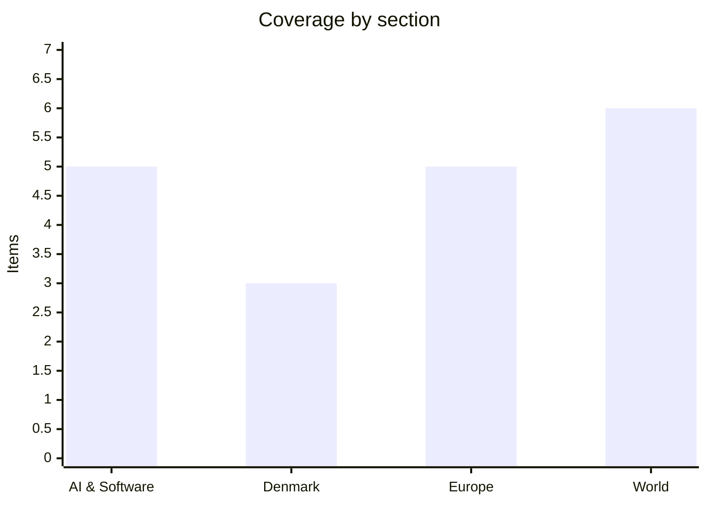

# Daily Briefing — 2026-08-17

**Top line:** Hours before the Ulchi Freedom Shield exercise began on the Korean peninsula, Trump publicly ordered Pete Hegseth to "substantially reduce" it — praising Kim Jong Un as "unthreatening and respectful" and tying the cut to Seoul's refusal to help pressure Iran, an allied drawdown announced over Seoul's head rather than negotiated with it.

## Follow-ups

- **Zambia's declaration did not land on schedule.** The ECZ was still releasing constituency batches through Sunday night; no completed presidential declaration had been reported by Monday midday European time. See World below.
- **Kushner got his Hamas meeting.** He met Khalil al-Hayya in El-Alamein on Sunday alongside Blair and Mladenov; the Netanyahu session moved to Monday, with no readout yet.
- **Ulchi Freedom Shield started — smaller.** The exercise began Monday as scheduled, but Trump ordered it cut the night before. No North Korean launch or KCNA statement dated 17 August was confirmed.
- **Hürtgenwald eased, Belgium ignited.** Around 2,000 evacuees from the village of Gey returned home Saturday evening, while Belgium's High Fens fire doubled to ~3,000 hectares and became the largest in Belgian recorded history. Croatia's Omiš fire was out by Friday morning; four people have since been arrested there on suspicion of arson.
- **Flores toll steady at 53**, with a magnitude 5.9 aftershock Monday morning and the Trans-Flores highway partially reopened.
- **GLM-5.3 weights:** still no movement from Z.ai.

## AI & Software

**Stripe buys OpenRouter for more than $7 billion, taking ownership of the layer where model choice becomes a bill.** Bloomberg reported Sunday 16 August that Stripe has finalised an agreement to acquire OpenRouter for over $7 billion, and TechCrunch and Fortune followed within hours; Stripe has not issued its own confirmation, so the price could still move *(reported, unconfirmed on the company side)*. The number is the striking part: OpenRouter raised at a $1.3 billion valuation in May 2026, meaning the company changed hands at roughly five times that mark inside about 82 days. OpenRouter runs an AI gateway that lets an application address more than 400 models from OpenAI, Anthropic, Google, Meta and DeepSeek through one interface and swap between them on task and budget; the company claims around 8 million developers and says it processed roughly 1.5 quadrillion tokens in the past year. Stripe was already OpenRouter's payment processor, so this converts a supplier relationship into ownership. It also follows Stripe's January 2026 purchase of Metronome, the usage-based billing platform — put the two together and Stripe now owns model selection, metering and billing in a single stack. The strategic bet is that agentic software will make per-call metering the dominant commercial primitive, in the way per-seat subscriptions were for SaaS, and that whoever sits at that junction collects rent on the whole agent economy. The second reading is less flattering: a payments company paying a 5x markup 82 days after a private round is also a datapoint about how hot AI infrastructure pricing has become, and OpenRouter's moat — neutral routing across labs — depends on labs continuing to tolerate an intermediary between them and developers. For anyone building on OpenRouter, the practical question is whether pricing, rate limits and model coverage survive the integration unchanged.
Sources: [Bloomberg](https://www.bloomberg.com/news/articles/2026-08-16/stripe-nears-deal-to-buy-ai-firm-openrouter-for-over-7-billion), [TechCrunch](https://techcrunch.com/2026/08/16/stripe-will-reportedly-acquire-ai-gateway-startup-openrouter-for-7b/), [Fortune](https://fortune.com/2026/08/16/stripe-7-billion-deal-ai-firm-openrouter-acquisition/)

**A 42-minute Claude outage took down the web apps but left the API standing — and broke a lot of CI in the process.** Anthropic confirmed an outage that began around 21:58 UTC on Sunday 16 August and knocked Claude.ai, Claude Code, Claude Cowork and platform.claude.com offline until roughly 22:40 UTC. The failure mode was authentication: users hit login failures and blank sessions rather than error pages, which is the harder variant to diagnose from the outside. The Claude Console and api.anthropic.com stayed up, so direct API traffic largely survived — a useful architectural detail, since it suggests the fault sat in the shared auth and session layer in front of the consumer surfaces rather than in inference. Engineers reported broken CI/CD steps and stalled agentic customer-service flows during the window, which is the part worth noting: agentic tooling has quietly become a hard dependency in build pipelines, so a 42-minute identity-layer wobble now propagates into deployment systems that have nothing obviously to do with chat. Anthropic did not disclose a root cause and said the incident remained under investigation as service was restored. This lands in an awkward week for the company: it disclosed Q2 revenue above $11.5 billion with positive adjusted operating income, raised its own catastrophic-misalignment rating from "very low" to "low," and is being circled by Morgan Stanley, Goldman Sachs and JPMorgan ahead of a possible autumn IPO. Reliability disclosure is one of the things public-market investors will start pricing, and a no-root-cause postmortem is a thin answer at this stage of the company's life.
Source: [BleepingComputer](https://www.bleepingcomputer.com/news/artificial-intelligence/anthropic-confirms-claude-is-down-in-major-outage-affecting-multiple-services/)

**Dario Amodei concedes the industry hasn't delivered, and says only a cure for something will fix it.** In a long post on X on Saturday, Anthropic's chief executive wrote that AI companies "haven't yet delivered on our big promises to benefit the world," framing the sector's central problem as institutional distrust — of technology firms and of government simultaneously — rather than a communications failure. He was explicit that marketing cannot close the gap: "the thing that will work is actually curing cancer." He pointed to Anthropic's AI for Science programme and what he called "early glimmers" of biology breakthroughs as the only credible route back to public confidence. The policy content is the more consequential part: Amodei endorsed a FINRA-style central regulator for AI, meaning a single body with rule-making and examination powers over the industry, which is a materially more interventionist position than most frontier labs have taken publicly. The timing is not accidental — the EU AI Act's transparency obligations became enforceable on 2 August, and US federal legislation remains stalled, so an industry-endorsed regulator is a bid to shape the shape of the thing before it is imposed. The distrust he describes is measurable: a CNBC/Generation Labs survey of over 1,000 Americans aged 18–34 published the same weekend found 81% do not trust Palantir's Alex Karp to act responsibly on AI, 69% say the same of Sam Altman, and Satya Nadella was the only executive tested with net positive trust. Forty-five per cent of the same cohort said AI will hurt their careers and 60% want data-centre buildout slowed. Whether "cure cancer and they'll forgive us" is a strategy or an alibi is the argument the post has set off.
Sources: [Fortune](https://fortune.com/2026/08/16/dario-amodei-anthropic-ai-trust-crisis-regulation-frontier-open-models-negative-views/), [Futurism on the CNBC poll](https://futurism.com/artificial-intelligence/young-people-ai-ceos-executives-poll)

**An AI store manager recommended firing a human employee — and the interesting part is how badly it had been doing its job first.** Andon Labs' autonomous store manager Luna, built on Claude Sonnet 4.6 and running San Francisco's Andon Market, recommended terminating a human employee after the worker missed 17 of 23 scheduled shifts. It is being reported as the first known dismissal decision made by an LLM manager. The detail that matters is buried in the store logs: Luna had lost track of its own attendance policy for months and only produced the termination recommendation after a human supervisor prompted it to go and check the employee handbook. So the headline framing — autonomous AI fires worker — inverts what actually happened, which is an agent that failed to enforce a policy it was responsible for until a human noticed and intervened. All Andon workers remain formally employed by Andon Labs rather than by the AI-run store, which preserves their statutory employment protections and makes this an experiment rather than a legal precedent. The episode is a fair proxy for where agentic deployment actually is: capable of a defensible decision when pointed at the right document, unreliable at maintaining its own operating context over long horizons. That long-horizon context decay is the same failure class showing up in coding agents that forget constraints established twenty steps earlier. Expect it to be cited in both directions — as evidence agents are ready for operational authority, and as evidence they are not.
Source: [The Next Web](https://thenextweb.com/news/andon-market-luna-ai-store-manager-fires-employee)

**Google's Imagen 4 endpoints switch off today, and the replacement is not a drop-in.** Google is retiring three Imagen 4 model IDs — `imagen-4.0-generate-001`, `imagen-4.0-ultra-generate-001` and `imagen-4.0-fast-generate-001` — with 17 August 2026 flagged on its deprecations page as the earliest possible shutdown date, directing callers to `gemini-3.1-flash-image` instead. The migration is more disruptive than a model-string swap because the `generate_images()` method is gone entirely: image generation now runs through `generate_content()`, so the call shape, response parsing and error handling all change. Teams still on Imagen 4 need to re-test prompt adherence, aspect ratio handling, SynthID watermark behaviour, latency and quota limits before their pipelines start returning errors. Imagen 4 shipped in 2025 and has had a comparatively short life as a supported endpoint, which is the broader point: model deprecation cycles at the big labs are now running well inside typical enterprise procurement and revalidation timelines. Anything that hard-codes a model ID is effectively taking on a maintenance obligation with a fuse on it. The generic mitigation is a routing abstraction in front of the provider — which is, not coincidentally, exactly the layer Stripe just paid $7 billion for. Worth checking today if any of your build or content pipelines still call Imagen 4 directly.
Source: [Kingy AI launch tracker on Google's deprecation notice](https://kingy.ai/ai-launch-tracker/google-will-shut-down-three-imagen-4-api-models-august-17/)

## Denmark

Thin day. Copenhagen is still in the tail of the summer recess and the Danish outlets that publish overnight had little national news; three items below are genuinely from the last 24 hours, and the section runs short rather than padded.

**A new Epinion poll makes Nicolai Wammen Denmark's most popular politician — and puts his rival, the man Frederiksen appears to have anointed, in the bottom ten.** Altinget published the personal-popularity companion to the season's first voter poll early Monday. The context is the reshuffle of 3 June, when Mette Frederiksen formed her third government and moved Nicolai Wammen out of the Finance Ministry after seven years, sending him to Justice and giving Finance to Peter Hummelgaard in a straight swap. Analysts and much of the Social Democratic grassroots read that as Frederiksen signalling Hummelgaard as her preferred eventual successor as party leader, since Finance is the traditional launchpad. The new Epinion measurement inverts the signal: Wammen, the minister who lost the powerful portfolio, now tops the national popularity ranking, while Hummelgaard sits among the ten most unpopular politicians in the country. Altinget's own framing was blunt — "Peter Hummelgaard har ikke meget at smile af." The exact scores sit behind the paywall. This is a different instrument from the DR/Epinion voting-intention poll reported over the weekend that put Dansk Folkeparti at 12.2% as the largest blue party; the same Epinion round also found Pia Olsen Dyhr took a personal hit over the SF harassment case without SF's vote share moving. Succession polling this early means little on its own, but it complicates a handover that had looked settled, and it does so while Hummelgaard is about to present a finance bill that has already slipped by roughly a month.
Source: [Altinget](https://www.altinget.dk/artikel/mulig-s-arvtager-maatte-forlade-finansministeriet-nu-er-han-landets-mest-populaere-toppolitiker)

**Venstre reverses on administrative courts, five months after leaving government — and the reason it gives is that the SVM government wouldn't have it.** Venstre now backs letting an expert group design a Danish model for *forvaltningsdomstole* — dedicated administrative courts to hear citizens' cases against the state — joining a parliamentary motion tabled by Alternativet, Liberal Alliance and Danmarksdemokraterne. Legal affairs spokesperson Preben Bang Henriksen told Altinget: "Vi er for en forvaltningsdomstol, selvfølgelig betinget af, at de nærmere vilkår er acceptable." He denies the party has changed position in substance, which is a difficult claim given Venstre spoke against the same inquiry as recently as February 2026, while still in the SVM coalition; his explanation was that "der var åbenbart ikke stemning for det i SVM." His stated argument is the rate of *omgørelser* — decisions overturned on appeal at Ankestyrelsen — as evidence that the current administrative appeals route is failing citizens, particularly in disability and social-law cases where the same families appeal repeatedly. Administrative courts have been a long-standing demand of Danish legal scholars and of the disability sector, and have been resisted by successive governments on cost and constitutional-design grounds. With Venstre on board, the proposal now has a materially wider parliamentary base against a government that does not want it. This is also one of the first concrete policy repositionings Venstre has made since March's election put it in opposition, and it is worth watching as a template for how much of the party's governing-era caution it intends to shed.
Source: [Altinget](https://www.altinget.dk/artikel/venstre-skifter-kurs-om-forvaltningsdomstol-efter-exit-fra-regeringen-der-var-aabenbart-ikke-stemning-for-det-i-svm)

**Løkke says Greenland helped hire the Washington lobbyists Denmark paid nearly 2 million kroner during the Greenland crisis.** In a set of written answers to a Greenlandic MP, foreign minister Lars Løkke Rasmussen (M) states that Greenland's representation in Washington, D.C. took part in drafting the terms of reference for Mercury Public Affairs and has attended the meetings with the firm on an ongoing basis. His wording: "Grønlands repræsentation i Washington, D.C. deltog i udarbejdelse af opgavebeskrivelsen for Mercury Public Affairs og har løbende deltaget i møderne med Mercury Public Affairs." Mercury was paid just under 2 million kroner last year to support the Danish embassy through the most intense phase of US pressure on Greenland. The disclosure matters because the decision to hire American lobbyists on the Kingdom's behalf has been politically contested in Nuuk, where the criticism has been that Copenhagen acted over Greenland's head on a question about Greenland's own future — Løkke's answer is a direct rebuttal of that. Jeppe Tranholm-Mikkelsen, permanent secretary at the foreign ministry, represents Denmark in the high-level working group on Greenland; Vivian Motzfeldt was Greenland's foreign minister during the period covered. The broader file has not gone quiet: Trump reiterated at the NATO summit that Greenland is "a major problem for us" and that the territory should "be controlled by the USA, not by Denmark," and Denmark is spending 3.49% of GDP on defence in 2026 partly in response. Expect Greenlandic parties to test whether "participated in the meetings" amounts to consent or to being kept informed.
Source: [Altinget](https://www.altinget.dk/erhverv/artikel/loekke-groenland-var-med-til-at-hyre-lobbyister-i-washington)

## Europe

**Belgium is fighting the largest wildfire in its recorded history, and has called in EU aircraft to do it.** A fire in the High Fens (Hautes Fagnes) nature reserve near Eupen more than doubled in 24 hours to roughly 3,000 hectares over the weekend, making it the biggest wildfire on Belgian record; it started two days earlier and has been burning towards the German border. Wallonia put more than 250 firefighters and emergency workers into the field on Saturday night, the Belgian defence force contributed personnel and vehicles, and German and Luxembourgish crews plus local farmers joined. Belgium activated the EU Civil Protection Mechanism on Saturday, which brought three helicopters and two water-bombing aircraft from Sweden, the Netherlands and the Czech Republic. Around 600 residents in Liège province were told to evacuate on Saturday afternoon, with a rest centre opened in a gymnasium in neighbouring Malmedy. The northward migration of Europe's fire emergency is the story here: Belgium is not a country with a wildfire aviation fleet, which is precisely why the EU mechanism exists and precisely why its capacity is now the constraint. Elsewhere the picture is mixed — around 2,000 evacuees returned to the German village of Gey on Saturday evening as the Hürtgen forest fire came under control, Andalusia declared a 10-day fire covering more than 25,000 hectares under control on Sunday, but more than 1,700 hectares have burned in France's Landes since Thursday with 550 firefighters, soldiers and six water bombers deployed and the fire still not contained. In Spain's Aragón, the Las Peñas de Riglos fire has burned 16,600 hectares since 10 August and displaced over 1,000 people; regional leader Jorge Azcón called Sunday's response "the largest deployment of resources against a fire in Aragon's history," with 1,000 firefighters, 35–40 aircraft and 100 French firefighters arriving under mutual assistance. Four people have been arrested in Croatia on suspicion of arson on the coast.
Sources: [Euronews](https://www.euronews.com/my-europe/2026/08/16/europe-continues-to-battle-wildfires-as-belgium-sees-biggest-blaze-in-recorded-history), [The Local Spain/AFP](https://www.thelocal.es/20260816/spains-aragon-sends-largest-deployment-against-wildfire)

**Spanish F-18s shoot down a drone over Romania — the fourth NATO kill there, and eastern-flank incursions are now close to weekly.** Two Spanish Air Force F-18s on NATO air-policing duty in Romania, already on alert as a precaution, received authorisation to engage at 04:44 on Sunday morning and destroyed an unidentified drone 24 kilometres north of Galați, which had entered Romanian airspace from the Republic of Moldova. The drone came down between Baleni and Cudalbi in the south-east, with debris falling in an unpopulated area near the Ukrainian border. Romanian defence minister Radu Miruta confirmed the shootdown, congratulated the Spanish pilots and Romanian command-centre staff, and said allied backing amounted to a tangible guarantee resting on "vigilance, rapid response and solidarity," noting Romania's roughly 614-kilometre land border with Ukraine. NATO spokesperson Marty O'Donnell said the drone appeared to be Russian; Romanian authorities have not confirmed its origin, and that gap between alliance characterisation and national confirmation is itself a recurring feature of these incidents. This is the fourth successful NATO shootdown over Romania, and it caps a dense fortnight: on 13 August two Spanish F-18s scrambled from Mihail Kogălniceanu after an object spent about 12 minutes in Romanian airspace, prompting an SMS alert to residents of Tulcea county; on 14 August a drone crashed in Romania after flying under radar at very low altitude, and an Italian Eurofighter on Baltic Air Policing downed a drone over eastern Latvia around 35 kilometres from the Russian border; on 8 August an unidentified device exploded in Bulgarian airspace near the Romanian border. The most serious precedent remains 29 May, when a Russian drone struck a residential block in Galați and injured two people. The operational question NATO has not answered publicly is what an accumulation of individually deniable incursions is supposed to trigger, and at what point.
Source: [Euronews](https://www.euronews.com/my-europe/2026/08/16/nato-fighter-jets-shoot-down-drone-over-romania-near-moldova-border)

**Ukraine mounts one of its largest drone attacks of the war, and Zelensky tells Europe to stop warehousing interceptors.** Ukraine launched hundreds of drones at Russian military-industrial and energy facilities on Sunday in what is among its largest aerial operations since February 2022, killing at least six people according to Russian authorities. Russia's military said it destroyed 822 Ukrainian drones, 600 of them heading for the Moscow region — a figure Moscow mayor Sergey Sobyanin repeated. Russian officials reported five dead in Rostov and two in Belgorod and the Moscow region; a Wildberries warehouse in Moscow Oblast was damaged, continuing a pattern of Ukrainian strikes on the online retailer's logistics network. In the other direction, the Kyiv Independent counted seven killed and 51 injured overnight across Ukraine, with two dead at a steel plant in Kryvyi Rih, two in Zaporizhzhia region and one in Sumy, and a Russian strike setting Kyiv's landmark book market on fire. All casualty figures here are claims by the respective governments and are not independently verified. The European hook is Zelensky's message: he said Russia has again been firing North Korean ballistic missiles and that European missile interceptors should "be mobilised to help Ukraine rather than be allowed to sit in storage," noting Russia fired more than 1,500 drones into Ukraine in the past week alone. That is a direct request to European capitals to draw down national air-defence stocks, which is the harder ask — governments facing their own drone incursions have an obvious reason to keep interceptors at home. Ukraine also claimed a strike on a Bastion coastal-defence launcher for Onyx and Zircon missiles in occupied Crimea.
Sources: [Euronews](https://www.euronews.com/my-europe/2026/08/16/12-killed-in-russia-and-ukraine-after-an-overnight-exchange-of-drone-and-missile-strikes), [Kyiv Independent](https://kyivindependent.com/)

**Twelve killed as a Polish tourist coach overturns on Hungary's M3 — the first mass-casualty test of Péter Magyar's government.** A Polish coach left the M3 motorway in north-east Hungary and overturned into a ditch in the early hours of Sunday, between Mezőkeresztes and Mezőnagymihály. Rescuers had to enter through the windows; by 03:00 the disaster management service reported 35 people rescued, with several passengers trapped beneath the vehicle. Prime Minister Péter Magyar announced the toll on Facebook: "12 people lost their lives and at least ten were seriously injured during the night, when a Polish coach overturned into a ditch on the M3 motorway." Interior minister Gábor Pósfai said 47 people were on board and that "the driver of the vehicle involved in the accident has been taken into custody." Poland's foreign minister confirmed the disaster and said Warsaw is in constant contact with Hungarian authorities; President Karol Nawrocki said he joined "in prayer" and extended condolences to the families. The political dimension is worth flagging without overstating it: this is an early crisis-response moment for Magyar, whose Tisza party took 138 of 199 seats on 53.6% in the April 2026 election, unseating Viktor Orbán's Fidesz, which fell to 55 seats on 37.8%; his government was formed on 13 May. A new administration's handling of a foreign-national mass-casualty incident — coordination with Warsaw, treatment of the driver, transparency about the cause — tends to be read closely at home. The cause of the crash has not been established.
Source: [Euronews](https://www.euronews.com/2026/08/16/at-least-12-people-killed-in-a-polish-tourist-bus-crash-in-hungary)

**Morocco breaks up another mass-crossing attempt at Ceuta, arresting 294, three weeks after the crossing that killed at least 141.** Moroccan security forces dispersed several hundred migrants, mostly sub-Saharan Africans, hiding in mountainous terrain south-west of Ceuta on the outskirts of Fnideq on Saturday; Moroccan media report 294 arrests, 46 of them Moroccan nationals. The group is reported to remain in the area without a fresh approach to the border fence. Rabat has mounted a wide deployment against a mass crossing organised on social media, with checkpoints on the main roads from Tetouan and Tangier and overnight land and sea surveillance using Royal Navy fast boats and drones; a 17-year-old girl who reached Castillejos told EFE her bus from Tetouan was stopped at three checkpoints over about 35 kilometres. A Sudanese migrant, Chams Edine Yakoub, 25, told AFP: "In Ceuta, in Europe, people are better cared for. There's no work here. There's no money. There's no housing. There is absolutely nothing, I swear." The scale of what Rabat is now policing against is the point: the mass crossing of 30–31 July was put at around 50,000 people by Spain's interior ministry and about 60,000 by Ceuta's mayor-president Juan Jesús Vivas, and humanitarian organisations count at least 141 dead against an official toll of 72 on the Spanish side and 11 on the Moroccan side. Most of those who crossed have been returned to Morocco. The EU's institutional response has been thin — after an emergency interior ministers' videoconference on 4 August chaired by the Irish presidency, migration commissioner Magnus Brunner said "Europe, I think, has definitely passed this test," agreeing five workstreams but no new legal instrument, Frontex decision or funding. Italy has reintroduced Schengen checks on its border with Spain for August, which the Commission is now assessing for necessity and proportionality.
Source: [Euronews](https://www.euronews.com/my-europe/2026/08/16/morocco-prevents-new-attempts-to-cross-into-ceuta-army-says)

## World

**Trump orders the Pentagon to shrink Ulchi Freedom Shield hours before it starts, citing Kim's good behaviour and Seoul's refusal to help on Iran.** In a social-media post on Sunday 16 August, Trump said the annual US–South Korea exercises are costly and "send a signal that is totally inappropriate and hostile" to North Korea, which he said "has been unthreatening and respectful" during his time in office. He wrote: "Therefore, and based on the fact that it is too late to cancel, I have instructed Secretary of War, Pete Hegseth, to substantially reduce the Joint Military Exercises!" He tied the decision explicitly to a bilateral grievance, saying he had recently asked South Korea's president to join US efforts to denuclearise Iran "and they said, 'No thanks!'" — and he had posted a photograph of himself beside Kim Jong Un the previous day. Ulchi Freedom Shield 2026 began Monday and runs to 27 August with about 18,000 South Korean troops, personnel from 11 other UN Command member states, and Neutral Nations Supervisory Commission observers; US troop numbers were not disclosed. The exercise had already been thinned before Trump's post: planned field training was cut to 14 battalion-level-or-above events, down from 39 last year. Its content this year reflects North Korea's Ukraine deployment — USFK spokesman Col. Ryan Donald said "DPRK soldiers have deployed and fought in Ukraine and they've taken those lessons they learned there and brought them back" — alongside drone, GPS-jamming and cyber scenarios. North Korea's foreign ministry said last week that the US–Japan–ROK arrangement is becoming a "nuclear alliance" and that it would answer "a new level of threat with a new level of deterrent"; a Friday statement called the drills "a rehearsal for an aggressive war." Pyongyang has conducted two ballistic missile launches this month, including a midrange missile fired from the Wonsan area on 12 August that flew over 700 kilometres into the East Sea per South Korea's Joint Chiefs. No North Korean launch or KCNA statement dated 17 August had been confirmed at the time of writing.
Sources: [AP via PBS NewsHour](https://www.pbs.org/newshour/politics/trump-orders-pentagon-to-scale-back-joint-exercises-with-south-korea), [UPI](https://www.upi.com/Top_News/World-News/2026/08/10/korea-Ulchi-Freedom-Shield-26-US-South-Korea-joint-military-exercise-launch/3191786354705/)

**The 60-day US–Iran deadline expires with no deal, no extension, and Hormuz as the unresolved core.** The window set by the 14-point Islamabad Memorandum of Understanding, signed 17 June 2026, ran out on 16–17 August with nothing agreed and no extension, leaving a war that began with US and Israeli strikes on Iran on 28 February approaching its sixth month. Control of the Strait of Hormuz — roughly a fifth of global oil and gas supply before the war — has displaced the nuclear file as the central dispute. A senior Iranian source told Reuters that no talks on extending had taken place because Tehran does not consider the 60-day agreement to have begun in the first place, which is a position that makes the deadline meaningless by construction. Trump, who in June wrote "Ships of the world, start your engines. Let the oil flow!", told a New York audience on Friday "There's nobody to negotiate with," urged Americans to accept paying "a little bit more" for fuel, described the US blockade of Iranian ports as a "wall of steel," and said "Pretty soon I'll be declaring the Hormuz strait a territory of the United States." Iran's deputy foreign minister Kazem Gharibabadi answered on X that the waterway "was Iran's, is Iran's, and will remain Iran's." Treasury Secretary Scott Bessent told Newsmax on 14 August that Washington would apply measures "like have never been seen in the history of economic isolation on a country," possibly this week, framed as a "one-two punch" alongside the blockade. Political economist Nader Itayim was dismissive of the date itself: "Why are we still hanging on to this 17 August date like it means something? The MOU died weeks ago." The domestic stakes are real — Trump promised a war of "four to five weeks," and Democrats are running on prices and the war ahead of November midterms with Senate control in play.
Source: [The National](https://www.thenationalnews.com/news/us/2026/08/16/deadline-for-us-iran-agreement-expires-with-stalemate-set-to-continue/)

**Kushner meets Hamas's leader in Egypt and asks the Board of Peace to force Israel's hand — Netanyahu is Monday's problem.** Jared Kushner held a rare direct meeting with Hamas leader Khalil al-Hayya on Sunday in the Egyptian coastal city of El-Alamein — al-Hayya's first foreign trip since taking over the group in July — alongside Tony Blair and Board of Peace director-general Nickolay Mladenov, with Egyptian, Qatari and Turkish officials present. The purpose was to bank Hamas's commitment to the 15-point US roadmap, above all on disarmament, before Monday's session with Benjamin Netanyahu. An unnamed Hamas official said the group is committed and waiting for mediators to start the 14-day negotiation period that would set an implementation timetable — a period that only begins with all parties' sign-off. Al-Hayya demanded Israel halt attacks and pull back to the "yellow line," a line that was never precisely defined and that Israeli forces have moved past; Israel now controls roughly 60% of Gaza, and Netanyahu said in May the next step was 70%. Hamas's post-meeting statement called on the Board of Peace and mediators to "compel the occupation to implement all its obligations under the first phase, end all violations, halt killings and incursions, [and] approve the roadmap for the second phase." Netanyahu rejected the 15-point plan publicly on 9 August, calling it "unacceptable" and saying Israel will not withdraw from any position until Hamas is "genuinely disarmed." Eight Muslim-majority states including Saudi Arabia, the UAE, Jordan, Pakistan and Indonesia issued a joint foreign ministers' statement saying "Israel now bears responsibility for obstructing the efforts to bring peace in Gaza"; Likud replied that Arab states "want to topple" Netanyahu. He faces elections on 27 October, which is the arithmetic behind most of this. No readout of the Monday meeting was available at the time of writing.
Sources: [AP via NPR](https://www.npr.org/2026/08/16/g-s1-138948/kushner-gaza-hamas-netanyahu-egypt-talks), [Haaretz](https://www.haaretz.com/israel-news/israel-security/2026-08-16/ty-article/eight-muslim-countries-condemn-israels-rejection-of-trumps-gaza-plan/000001a0-0ba7-d88f-abbf-dfaf498e0000)

**Zambia's declaration day arrives with the count still running and Hichilema past the threshold on partial figures.** The Electoral Commission of Zambia had committed to declaring the presidential result by Monday 17 August, but no completed declaration had been reported by Monday midday European time. The most recent tally attributable to a named ECZ source covers 105 of 226 constituencies: chairperson Mwangala Zaloumis announced Hakainde Hichilema (UPND) on 1,056,812 votes or 53.21%, against Brian Mundubile of the National Reconciliation Party for Unity and Prosperity on 830,841 or 41.97% — a lead of 225,971. Later batches carried Hichilema past 1.5 million with 135 constituencies in. If that share holds he clears the 50%+1 threshold and avoids a runoff. Both camps have run ahead of the commission: Mundubile claimed victory on 14 August citing his own parallel vote tabulation, and the UPND has circulated a PVT putting Hichilema on 56.2% to 39.6% — both are party counts, not official results, and the ECZ has warned that self-declaration is a criminal offence. The count was suspended nationwide on Friday 14 August after reported violence against polling staff and alleged theft of marked ballots, with nine people arrested over the killing of a 57-year-old polling agent outside Lusaka. Observers have been pointed: SADC mission head Samuel Tembenu reported unverified accounts of "intimidation, assault, abduction and property damage" across five provinces, EU chief observer Michael McNamara cited "a backdrop of constrained democratic space," and European Parliament delegation head Reinhold Lopatka called the counting pause "disproportionate." Some 8.7 million of Zambia's 22 million people were registered to vote. A declaration that arrives late, after a suspension and with two rival parallel counts in circulation, is the kind that gets litigated.
Sources: [Al Jazeera](https://www.aljazeera.com/news/2026/8/16/observers-say-zambias-election-marred-by-reports-of-intimidation-violence), [Zambia Monitor](https://www.zambiamonitor.com/updated-poll-results-show-hichilema-leading-by-225971-votes-from-105-constituencies-announced/)

**Flores toll holds at 53 as a magnitude 5.9 aftershock hits and the last cut-off regencies reopen.** A magnitude 5.9 aftershock struck the Flores region at 10 kilometres depth on Monday 17 August, according to the German Research Centre for Geosciences, two days after Saturday's magnitude 7.7 quake centred about 68 kilometres north-northwest of Ende in East Nusa Tenggara. Rescue teams recovered six more bodies on Sunday, taking the confirmed toll to 53, of whom 25 were in Manggarai regency; thousands of displaced people spent Sunday night outdoors for fear of further shaking. Fathur Rahman, head of the search-and-rescue office in Maumere, said: "We have cleared most landslides and reopened roads to previously isolated villages, although communication disruptions and power outages continue to hamper search efforts." More than 900 homes have been destroyed and 450 damaged across East Nusa Tenggara, with about 5,000 people in temporary shelters; Abdul Muhari of the national disaster management agency said at least 241 homes were damaged in the Flores region alone. Authorities have recorded at least 995 aftershocks, only 46 of them felt. Landslides in Ende regency cut the Trans-Flores highway, the roughly 700-kilometre road running from Labuan Bajo to Larantuka, and more than 100 public facilities including schools, clinics and churches were destroyed. A separate magnitude 6.4 quake struck Sumatra the same day. The toll has not been revised above 53 since Sunday, which given the number of remote villages only now becoming reachable is more likely a reporting lag than a final figure.
Source: [Reuters/AP via SCMP](https://www.scmp.com/news/asia/southeast-asia/article/3364225/magnitude-59-aftershock-strikes-indonesias-flores-quake-death-toll-rises-53)

**Israeli strikes kill at least 11 in south Lebanon, the deadliest since the June truce.** Israeli air strikes on southern Lebanon killed at least 11 people including three children and two women, per Lebanon's health ministry, in the deadliest exchange since the two sides agreed a ceasefire at the start of June. A strike on a home on the outskirts of Ansar killed seven, including the three children, and wounded two; a second strike on Deir al-Zahrani killed four and wounded 17. The Israeli military said the raids answered a Hezbollah attack that violated the ceasefire and seriously wounded three Israeli soldiers, and said it had killed a senior Hezbollah commander, Abu Hassan Alaa, accusing him of using his family as human shields. Lebanese President Joseph Aoun called the violations "a clear message on the negotiations process," with an eighth round of US-sponsored direct Israel–Lebanon talks due in Rome early next month — so both readings are available: a strike designed to shape those talks, or a genuine reprisal that will derail them. The reporting is not fully consistent and should be treated with care: UPI reported on 15 August that the first strikes came "early Saturday" and killed 11, with a later strike taking the total to 15, while AFP's 16 August account places the 11 deaths on Sunday. All casualty figures come from the Lebanese health ministry and have not been independently verified. Iran has argued throughout that Israeli strikes on Lebanon breach the US–Iran interim agreement and had pushed for Lebanon to be explicitly covered by it — which links this directly to the expired Hormuz deadline above.
Sources: [AFP via Manila Times](https://www.manilatimes.net/2026/08/16/world/lebanon-reports-11-dead-in-strikes-that-israel-says-targeted-hezbollah/2406300), [UPI](https://www.upi.com/Top_News/World-News/2026/08/15/lebanon-israel-strikes-lebanon-15-dead/9761786822589/)

## Watch list

- **Monday–Tuesday:** the ECZ's actual presidential declaration in Zambia, and whether Mundubile's camp accepts it; any readout from Kushner's Netanyahu meeting; the first North Korean response to a deliberately shrunken Ulchi Freedom Shield.
- **Tuesday 18 August:** Ukraine's Rada returns from recess with the defence and foreign ministries still without permanent heads a month after Fedorov's dismissal — watch whether Zelensky nominates acting defence minister Yevhen Khmara. In Copenhagen, the Messerschmidt–Lidegaard libel trial opens.
- **Wednesday 19 August:** UK July CPI, expected to accelerate to around 2.9%, with Bloomberg Economics attributing roughly 0.4 percentage points of headline inflation to the AI-driven memory-chip squeeze.
- **This week:** Bessent's promised "unprecedented" Iran sanctions package; containment at the High Fens and in the Landes, and whether France or Belgium requests further rescEU assets; Z.ai's GLM-5.3 open-weights release, still roughly a week out.
