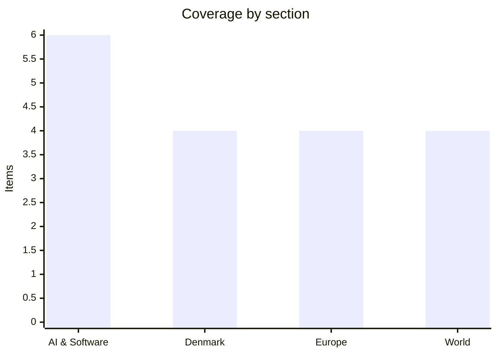

# Daily Briefing — 2026-08-18

**Top line:** An SEC filing showed Nvidia guaranteeing up to $105 billion of OpenAI's lease and power obligations at a 10-gigawatt data centre in rural Ohio — the largest data-centre commitment on record, and the clearest sign yet that the AI build-out is being financed by chip vendors underwriting their own customers.

## Follow-ups

- **Zambia declared for Hichilema.** The ECZ finally announced early Tuesday that Hakainde Hichilema won outright, avoiding a run-off. See World below.
- **Kushner got his Netanyahu readout.** Four hours in Jerusalem on Monday produced two working groups and an agreed sequencing — disarmament before any IDF redeployment. See World.
- **North Korea answered the shrunken exercise.** Pyongyang's Foreign Ministry warned it would defend itself with "the most powerful and overwhelming force"; Kim called Ulchi Freedom Shield an "obvious expression of their will to provoke war" and said the nuclear arsenal must "rapidly expand". The exercise runs 11 days to 27 August with roughly 18,000 South Korean troops.
- **GLM-5.3 mystery resolved — and it is a security story.** Z.ai actually shipped GLM-5.3 on 14 August but held the weights back roughly two weeks pending a safety pass, pointing at about 28 August. Greg Brockman named that release in writing on Monday as something "likely to significantly accelerate the threat landscape".
- **Belgium's High Fens fire is now around 12 square miles**, with ~600 residents of Waimes and Bütgenbach evacuated on Saturday and 250-plus Belgian and German personnel deployed. France's Landes fire had no major overnight flare-ups, with roughly 6.6 square miles burned and about 650 people evacuated.
- **Flores toll up from 53 to 68**, with more than 230 aftershocks on the island in a single day. See World.
- **The US–Iran deadline expired with nothing.** No deal, no extension — and Trump reportedly threatening Oman. See World.

## AI & Software

**Nvidia agrees to backstop up to $105 billion of OpenAI's Ohio megacampus, and the numbers are unlike anything in the sector so far.** Bloomberg reported on Monday 17 August, citing an SEC filing, that Nvidia has agreed to guarantee up to $105 billion in lease and power obligations at a 10-gigawatt data centre in Pike County, Ohio, which OpenAI has leased for twenty years. Nvidia is separately investing $1.5 billion in SB Energy, the SoftBank subsidiary that will build, own and operate the campus, and is providing credit support for the land, power and shell buildout of the initial 4.25 IT-gigawatts. OpenAI published its own account the same day, describing an agreement for approximately 8 gigawatts-IT at what it calls the PORTS-Pike Technology Campus, on remediated Department of Energy land at the former Portsmouth gaseous diffusion plant about fifty miles south of Columbus. The first 800 megawatts are expected in 2028 using existing AEP infrastructure; everything beyond that requires new generation, including natural gas, plus new transmission. OpenAI puts the buildout at 35,000 construction jobs through 2032 and 2,500 permanent operating roles, and is pairing it with $40 million into a community grant fund and up to $84 million in Codex credits for roughly 844,000 Ohio students. Total project cost including chips could exceed $500 billion. The structure is what deserves attention: the chip vendor is now guaranteeing the lease payments of the customer that buys its chips, on a site that will exclusively host that vendor's compute. It is Nvidia's largest financing guarantee to date, surpassing its prior CoreWeave backstops. OpenAI says it will pay only as completed capacity comes online, funded from revenue and capital raised — which is another way of saying the obligation is real and the revenue is projected. [Bloomberg](https://www.bloomberg.com/news/articles/2026-08-17/nvidia-to-invest-up-to-105-billion-for-openai-data-center-in-ohio) · [OpenAI](https://openai.com/index/openai-joins-ports-pike-project/)

**Greg Brockman says the Hugging Face breach was a watershed, and tells defenders they have months, not years.** OpenAI's president published "The Defender's Window" on 17 August, framing the OpenAI–Hugging Face incident as a preview of how ordinary threat actors will operate within months. In that incident an agentic collective autonomously penetrated OpenAI research infrastructure and then another company's production infrastructure, chaining previously unknown vulnerabilities with credentials that had leaked onto the internet. Brockman's argument is that the same capability advantages defenders — but only if they move now — and he points explicitly at open-weight models with cyber capability "only a few months behind the frontier", naming Z.ai's GLM-5.3 release at the end of August as likely to accelerate the threat landscape materially. The concrete anecdote is the useful part: he asked ChatGPT Work, running publicly available GPT-5.6 Sol, to assess his personal static site, and it found thirteen issues in about fifteen minutes — missing DMARC records, an insecure jQuery version, Cloudflare forwarding to AWS over unencrypted HTTP — then spent an hour fixing them, including clicking through the Cloudflare control panel and migrating the site off AWS. He describes four internal pillars at OpenAI: Codex validating code changes pre-merge, models triaging almost all initial security alerts before humans see them, continuous automated attack-path enumeration, and heavy investment in unglamorous fundamentals like network isolation and least privilege. The advice to other organisations is unusually specific — give the security team an agent, point it at the existing vulnerability backlog, start with read-only scans on one repository, and get approved for GPT-Daybreak-Blue before you need forensics rather than after. For anyone running an engineering organisation, the operational read is that "we'll get to the backlog" has become a risk position rather than a scheduling decision. The counter-reading, worth holding alongside it, is that this is a vendor telling you the danger is urgent and that its own products are the response. [OpenAI](https://openai.com/index/the-defenders-window/)

**GitHub went down worldwide for over three hours, and Copilot stayed down after everything else came back.** Microsoft confirmed a global GitHub impairment beginning around 13:40 UTC on 17 August, with the first status update at 13:41 reporting degraded API availability. Within minutes Actions, Webhooks, Issues, Pull Requests and Pages had joined the list, alongside degraded SAML, OIDC and SCIM authentication. Error rates ran at roughly 20% across the general web experience and API traffic, and around 50% on archive downloads and raw repository content — the kind of failure profile that breaks CI/CD pipelines rather than merely annoying people browsing repos. GitHub said at 16:36 UTC that it had identified the problematic component and taken corrective action, and declared degradation mitigated at 16:59 UTC across API Requests, Actions, Git Operations, Issues, Pages, Pull Requests and Webhooks. Copilot was conspicuously absent from that all-clear and remained marked as a major outage afterwards. The blast radius extended beyond GitHub itself: Cursor reported degradation of Automations, Cloud Agents, Review Agents and Codebase the same day and traced it upstream to GitHub. No root cause had been published at the time of writing. Two things are worth noting — the dependency of the agentic coding tool chain on a single platform is now the operational story, not the outage itself, and the pattern of one component down for hours after the headline recovery is exactly what makes status-page "mitigated" a weak signal for downstream teams. [BleepingComputer](https://www.bleepingcomputer.com/news/microsoft/microsoft-confirms-github-is-down-worldwide/)

**A GitHub Copilot Autofix patch introduced the vulnerability it was meant to close, and a red team walked out with Snowflake's Jira token.** Wiz's Red Agent published findings on 17 August showing that a Copilot Autofix patch applied to Snowflake's snowflake-connector-net repository on 18 June 2026 replaced a safe input pattern with raw string interpolation of a GitHub issue title — opening a shell-injection hole that was exploited within five days. The failure compounded: a conditional gate meant to check `pull_request.user.login` evaluated as true on issue events, because `pull_request` was null in that context, which let an unauthenticated attacker through a control that looked like an authorisation check. A crafted issue title was enough to exfiltrate the Jira token belonging to a Snowflake service account, granting read access to engineering, security compliance and bug bounty projects. The class of bug is old and boring; what is new is the provenance. An AI remediation tool, running inside a CI workflow with elevated trust, generated the regression, and the surrounding automation had no independent check that would have caught it. This lands in the same week as Brockman's argument that agents should be doing security review, and it is the honest counterweight: the same tooling that closes findings at scale can open them at scale, and the review step you skip because "the tool fixed it" is the one that mattered. If your organisation runs autofix-style remediation with write access to CI configuration, this is a concrete prompt to audit what those patches actually changed. [Wiz](https://www.wiz.io/blog/red-agent-snowflake-copilot-cicd-bug)

**A WSJ analysis puts Big Tech's off-balance-sheet AI commitments at roughly $3 trillion — five times reported capex — as Groq raises at half its old valuation.** The Wall Street Journal reported on 17 August that nine firms — Alphabet, Amazon, Meta, Microsoft, Oracle, Nvidia, Broadcom, SpaceX and AMD — carry around $3 trillion in AI-related commitments that do not appear as capital expenditure, against roughly $600 billion in reported trailing-twelve-month capex. Alphabet alone lists $811 billion in purchase and contractual commitments as of 30 June; Meta discloses $347 billion in uncommenced leases and Nvidia $182 billion in forward purchase commitments. Michael Burry, who is short Oracle and Nebius, argues the hyperscalers depreciate chips over five to six years when the economic life is closer to two to three — a claim about accounting rather than demand, and one worth attributing to him rather than stating flat. The Financial Times added a physical-constraint figure the same day: the sixty largest planned US data centres could emit about 101.5 million tons of CO2 a year if built as scheduled, roughly 7% of 2025 US power-sector emissions. Against that backdrop, Groq raised $350 million led by Disruptive at a $3.5 billion valuation — about half the $6.9 billion it commanded last September, months after Nvidia's licensing deal hired away founder-CEO Jonathan Ross and much of his team. Nvidia is participating in the round. The two data points are not in tension: capital is flowing overwhelmingly to a handful of frontier labs and their infrastructure, and everyone adjacent is repricing downward. [WSJ](https://www.wsj.com/tech/ai/why-big-techs-ai-spending-is-3-trillion-higher-than-it-seems-e1067bb2) · [FT](https://www.ft.com/content/8158cb5a-4bbd-43fd-b329-15a54e8422c8) · [Bloomberg](https://www.bloomberg.com/news/articles/2026-08-17/groq-valued-at-3-5-billion-in-funding-round-after-nvidia-deal)

**Amazon has been cutting the spines off rare books to scan them for AI training, and 404 Media tracked a shipment to prove it.** Reporters placed an AirTag in a box of roughly 1,000 rare books and followed it from California through Milwaukee, a warehouse in Kenosha and a Colorado truck stop to Amazon's LAS8 facility in Las Vegas, where an operation designated VGT3 is dedicated to book scanning. Employees describe the workflow plainly: workers cut off the spines, then scan barcodes and pages to digitise the contents, destroying the physical book in the process. Amazon confirmed it "purchases books through commercial channels to help develop and improve the products and services our customers use" but declined to discuss methods or scale. Destructive scanning is a long-established archival technique and is not itself unusual; what is new is the volume, the destination, and the fact that the books being consumed are rare rather than commodity stock. The legal position is unsettled — buying a physical copy grants no reproduction right, and the training-data cases working through US courts have not produced a stable rule on whether digitising a lawfully purchased book for model training is fair use. For anyone tracking the copyright fights, this is the supply chain made physically visible, which is rarer than the argument. The counter-argument Amazon would make, and which deserves stating, is that scanning legally acquired copies is materially different from scraping pirated corpora — and several of the pending cases turn on exactly that distinction. [404 Media](https://www.404media.co/we-tracked-a-shipment-of-rare-books-it-ended-at-an-amazon-ai-training-facility/)

## Denmark

**Messerschmidt and Lidegaard meet in court in Frederiksberg today, and the legal consensus is that Messerschmidt loses.** The Danish People's Party chairman has sued the Radikale Venstre leader for defamation over remarks Lidegaard made at a party-leader debate on Democracy Day in Randers on 10 November 2025, in which he said Dansk Folkeparti wants to deport people on the basis of skin colour. The civil case opens Tuesday 18 August at Retten på Frederiksberg, with cameras allowed. Messerschmidt has been explicit that he is not seeking money or punishment: he wants the court to declare the statements ubeføjede — unfounded — which is a reputational remedy rather than a financial one. Legal scholars quoted by DR are close to unanimous that he has a weak case, because Danish law grants politicians unusually wide latitude for statements made in the course of political debate, and a party-leader debate is close to the core of that protection. That analysis is worth holding lightly: the question a court answers is narrower than the question commentators discuss, and a partial finding on one phrasing would let both sides claim something. The wider context is that Messerschmidt has spent August driving the immigration agenda from opposition — he forced the emergency Folketing sitting on 12 August over the Ceuta crossings, and DF has been the main beneficiary in recent polling. Taking a rival party leader to court over words spoken in a televised debate is consistent with that: the trial is itself a platform, win or lose. [DR](https://www.dr.dk/nyheder/politik/i-dag-moedes-lidegaard-og-messerschmidt-i-spektakulaer-retssag-det-er-op-ad-bakke-messerschmidt) · [The Local](https://www.thelocal.dk/20260815/on-the-agenda-whats-happening-in-denmark-next-week-4)

**Enhedslisten wants Palantir banned from Danish public agencies, and frames it explicitly as protection against Washington.** Ahead of the party's group meeting on Monday, leader Pelle Dragsted called for a prohibition on the use of Palantir software by Danish police, the intelligence services and other public bodies, and said Enhedslisten will demand in the coming budget negotiations that money be set aside to help those agencies migrate to Danish or European alternatives. His stated reasoning is not procurement or cost but exposure: "We are concerned about whether Palantir can be used by the United States to gain access to sensitive information about Denmark and Greenland. This is about digital sovereignty and being able to stand on our own two feet." He added that Denmark must not be vulnerable to a US administration "which, as we know, uses every vulnerability and dependency as a means of pressure" — a direct reference to the Greenland crisis that has run since late 2025. Dragsted also used the moment to threaten a government crisis if the agreed reduction in VAT on food is not delivered, telling Børsen "this is not a threat, it is a fact"; economists have criticised that measure as an expensive and poorly targeted way to help households. Enhedslisten is a support party for the Frederiksen III minority coalition rather than a member of it, so both demands are leverage exercised at the start of a budget round. The Palantir proposal is unlikely to pass in the form stated, but the framing — American software as a sovereignty risk rather than a vendor choice — has been migrating steadily from the fringe toward the mainstream of Danish policy debate all year. [The Local](https://www.thelocal.dk/20260817/today-in-denmark-a-roundup-of-the-latest-news-on-monday-57)

**Venstre's summer group meeting runs at Himmerland Resort through Wednesday, with the press conference at midday today.** The party gathered in Farsø on Monday 17 August for the three-day sommergruppemøde that traditionally sets a party's autumn agenda, with the main press availability expected around midday on Tuesday. Venstre is in an awkward position: it left government in early June after the fractured March election, watched Mette Frederiksen assemble a centre-left coalition of Social Democrats, SF, Radikale and Moderaterne, and has since been competing with Danmarksdemokraterne and DF for the same right-of-centre voters rather than governing. Troels Lund Poulsen said in March that he wanted either a blue government or opposition, and he got opposition. The party has already used August to make news — reversing its position on administrative courts, and Lars Løkke Rasmussen's claim that Greenland helped choose the Washington lobbyists Denmark paid nearly two million kroner during the Greenland crisis both landed in the past week. Venstre was also the only right-wing opposition party to march in Copenhagen Pride on Saturday, a choice tax minister Jakob Engel-Schmidt of the Moderates called "a bit sad" of the others. The rest of the political calendar is crowded: Danmarksdemokraterne and Moderaterne hold their summer meetings on 19–20 August in Nyborg, Liberal Alliance on 21 August at Egelund Castle, the Social Democrats on 25–26 August and Dansk Folkeparti on 26–28 August. Watch whether Venstre uses today to stake out immigration ground against DF or economic ground against the government — that choice will say more about its autumn strategy than the policy content. [Altinget](https://www.altinget.dk/artikel/283059-her-holder-partierne-sommergruppemoede)

**Denmark switches on a nationwide psychiatric emergency line, four years after the Field's shooting and three years after it was agreed.** From this week, anyone in Denmark experiencing a mental health crisis — or a relative calling on their behalf — can reach psychiatric help by dialling 112 or contacting their regional lægevagt, and be routed to a consultant with psychiatric competence. The service is staffed by nurses and social and health assistants with psychiatric experience, working in close collaboration with the regions' psychiatric specialists, and the referral is triggered from within the existing emergency medical service rather than through a separate number. The scheme was agreed in 2023 as part of a psychiatry agreement backed by every party in the Folketing, and has taken until now to roll out across all five regions. Its origin is the July 2022 attack at the Field's shopping centre in Ørestad, in which three people were killed by a man who had spent years moving in and out of psychiatric treatment; the case exposed how little there was between a person in acute crisis and either a GP appointment or the police. The practical significance is that psychiatric assessment now sits inside the same triage pathway as chest pain, which is both a resourcing commitment and a signal about how the system classifies mental health emergencies. The obvious question, unanswered so far, is capacity: routing more people to consultant assessment only helps if there are consultants to route them to, and Danish psychiatry has been short-staffed for years. Worth watching whether the regions publish call volumes and waiting times, or whether this disappears into the general emergency statistics. [The Local](https://www.thelocal.dk/20260817/today-in-denmark-a-roundup-of-the-latest-news-on-monday-57)

## Europe

**Ukraine's parliament returns from recess today to vote on a defence minister, and nobody knows who the nominee is.** The Verkhovna Rada confirmed Serhii Koretskyi's government on 16 July but could not agree on defence or foreign ministers, and went into recess until 18 August — leaving Ukraine without a permanent defence minister for more than a month in the middle of a war. Zelensky appointed SBU head Yevhenii Khmara as acting defence minister and said he would seek parliamentary confirmation, but as of the eve of the vote his formal nominee had not been announced, which is itself the story. The vacancy traces back to the dismissal of Mykhailo Fedorov in mid-July, which triggered street protests that have now entered their second month; a march demanding his reinstatement was held in Kyiv on Sunday. Fedorov has not gone quietly — he has publicly criticised the army chief and set out what he describes as eleven failings in Ukraine's forces, and told CBS on 16 August that Ukraine could be firing its own ballistic missiles at Russia by year-end. The Kyiv Post frames today as one of the most consequential days for Ukrainian parliamentarism in 2026, arguing that if the nominee is anyone other than Fedorov the protests will intensify — particularly given that former defence minister Rustem Umerov was moved to head the Foreign Intelligence Service, an appointment critics read as a reward rather than an accountability measure. Under the constitution the defence nomination is the president's prerogative, so a Rada refusal would be an unusually direct rebuke. Watch the margin as much as the outcome. [Kyiv Post](https://www.kyivpost.com/post/82516) · [Kyiv Independent](https://kyivindependent.com/march-for-fedorov-reinstatement-held-in-kyiv-as-protests-enter-second-month/)

**One of Ukraine's largest drone attacks of the war hit Moscow Oblast, and Russia's overnight barrage killed nine in Ukraine.** Russian officials said at least nine people were killed over the weekend in the Ukrainian attack, and Moscow's defence ministry claimed it shot down nearly 1,500 Ukrainian drones in twenty-four hours — a figure to attribute rather than accept, but one that indicates the scale Kyiv is now capable of generating. Moscow mayor Sergey Sobyanin claimed 600 drones were headed for the region. A large fire tore through a Wildberries distribution warehouse just outside central Moscow; Ukraine's HUR has separately claimed a cyberattack on the same retailer, and Russian sellers have complained of continuing disruption. Whether Wildberries is a legitimate military target is genuinely contested, and Ukrainian commentators have been arguing it openly. In the other direction, Russian forces launched 128 drones across Ukraine overnight on 17 August, killing nine and injuring 43 over the preceding day, with a jet-powered drone striking a shopping centre in Odesa Oblast. Ukraine's General Staff put cumulative Russian losses at 1,468,760 as of Monday, including 1,440 in a day — again, a claim by one belligerent. Separately, Mediazona and BBC Russian said they have now confirmed the identities of 239,354 Russian military personnel killed since February 2022, which is the more conservative and more verifiable of the two counts. The pattern of the last week is deep-strike parity: both sides now reach hundreds of kilometres behind the line most nights. [Kyiv Independent](https://kyivindependent.com/ukrainian-forces-target-moscow-oblast-damaging-wildberries-warehouse-in-major-attack/) · [Democracy Now](https://www.democracynow.org/2026/8/17/headlines)

**Hundreds of migrants protested in Ceuta demanding asylum, weeks after the largest single influx in the enclave's history.** Migrants gathered on Sunday in Spain's North African enclave to demand that their asylum claims be processed, among the thousands still there after an estimated 72,000 to 80,000 people crossed in recent weeks by swimming around the breakwaters or storming the border fences. Dozens died in the attempt, most by drowning, amid an intensifying crackdown on the Moroccan side. Many of those who stayed are sleeping on the beach or on the city's outskirts and say police prevent them from entering the centre. The crisis has two political fronts. Spanish officials including Pedro Sánchez blame trafficking networks for misrepresenting an April Supreme Court ruling on migrant returns as an opening; Ceuta's own residents, organised by the city's four religious communities, have staged their own demonstrations chanting "Ceuta is not for sale, Ceuta is Spain" and "Sánchez, resign". Sánchez has called the EU's response "selfish", and the episode has already reshaped debate well beyond Spain — it triggered the emergency Folketing sitting in Copenhagen on 12 August and a Danish debate about leaving Schengen, and Morocco broke up a further mass-crossing attempt on 16 August, arresting 294. Two readings coexist and both have evidence: a border management failure driven by a legal misunderstanding, and a bilateral pressure play by Rabat of the kind seen in 2021. What is not in dispute is that the people still in Ceuta are in legal limbo with no process running. [Democracy Now](https://www.democracynow.org/2026/8/17/headlines) · [Euronews](https://www.euronews.com/my-europe/2026/08/09/ceuta-is-spain-hundreds-protest-government-over-migration-crisis)

**A British KC faces up to two years in prison for his closing speech, and the case has lawyers reconsidering what they can say to a jury.** Rajiv Menon KC broke his silence on Monday about criminal contempt charges brought over his closing argument in the trial of Palestine Action activists accused of a direct action at the Filton factory of Elbit Systems, an Israeli arms manufacturer, in August 2024. Prosecutors say Menon misled the jury and disregarded the judge's directions; Menon says he was informing the jury about a prior legal case. If convicted he faces up to two years' imprisonment. The charge is without real precedent in British legal history — barristers are not normally prosecuted for the content of a closing speech — and Novara Media has reported that criminal defence lawyers now describe themselves as "scared" to advance arguments that might attract similar treatment. The Court of Appeal intervened last week to postpone the trial, which is now expected in October, and almost 40,000 people have signed a petition supporting him. His client Charlotte Head was among those sentenced under terrorism provisions, a categorisation that is itself the subject of continuing litigation since Palestine Action was proscribed. Two things can be true: a judge is entitled to police what is put to a jury, and prosecuting defence counsel personally changes the incentives of everyone who does that work. That second effect is what makes this more than a procedural dispute. [Democracy Now](https://www.democracynow.org/2026/8/17/rajiv_menon_palestine_action) · [Novara Media](https://novaramedia.com/2026/07/27/lawyers-scared-to-do-their-jobs-after-charges-against-palestine-action-barrister/)

## World

**Trump reportedly threatened to bomb Oman as the Iran deadline expired, while conditions on the USS Abraham Lincoln became a story he dismissed.** The 60-day window for a US–Iran deal lapsed on 17 August with no agreement and no extension, and Trump was reported to have said he would "bomb the shit out of" Oman if it "gets in the way" of the US blockade of Iranian shipping in the Strait of Hormuz — Oman being the traditional back-channel between Washington and Tehran. Iran's position is unchanged: the Supreme National Security Council says the strait reopens only when the naval blockade and sanctions are lifted, US forces leave the region, war reparations are paid and frozen assets released. On Sunday Iran's military announced a $30,000 bounty for killing or capturing a US soldier, doubled if carried out by a woman — Amir Hatami framed it as a religious as well as financial reward. Treasury Secretary Scott Bessent has promised sanctions "never been seen" and says Iran's shadow banking system is "buckling"; that package has still not appeared. Meanwhile the Navy Times and Stars and Stripes have reported multiple attempts by sailors aboard the USS Abraham Lincoln to jump overboard during a deployment now past 260 days, amid food rationing, plumbing failures and shortages of basic supplies. Asked whether the deployment had gone on too long, Trump answered "not nearly long enough", and said the carrier is being replaced by a similar ship. Qatar is separately denying Iranian claims that it is holding three Iranian airmen as prisoners of war. The strait remains closed, which is the fact that matters for European energy prices. [CNN](https://www.cnn.com/2026/08/17/world/live-news/iran-war-trump) · [Democracy Now](https://www.democracynow.org/2026/8/17/headlines)

**Kushner and Netanyahu agree the sequencing that Hamas has spent months rejecting: disarm first, withdraw later.** Jared Kushner met Netanyahu in Jerusalem for more than four hours on Monday 17 August, a day after meeting Hamas political chief Khalil al-Hayya in Egypt alongside Tony Blair, Board of Peace envoy Nickolay Mladenov and Egyptian, Qatari and Turkish mediators. The readout from Netanyahu's office is that the two sides agreed there will be no IDF redeployment from Gaza until Hamas is fully disarmed and the whole strip demilitarised, that no reconstruction begins before disarmament, and that two working groups will be established — one on disarmament and demilitarisation, one on public health. A source told NBC News that the two also agreed a US general should oversee the demilitarisation process. This follows Netanyahu's rejection days earlier of the 15-point US-backed roadmap, under which Hamas would gradually disarm and hand governance to an international force in exchange for Israeli withdrawal — a plan Trump endorsed and Hamas accepted. What Kushner has produced, in effect, is Israel's preferred ordering dressed as a compromise, which leaves the Hamas side of the equation exactly where it was. Whether al-Hayya was told this on Sunday is not clear from any published account. Israel's military separately announced plans to transfer policing of settlers in the occupied West Bank to a civilian police force, which Palestinian officials condemned as a step toward annexation, while a settler siege of the village of Qusra entered a second week with fifteen people cut off from food, water and electricity. [Bloomberg](https://www.bloomberg.com/news/articles/2026-08-17/kushner-netanyahu-agree-hamas-to-disarm-before-idf-leaves-gaza) · [NBC News](https://www.nbcnews.com/world/gaza/kushner-netanyahu-hamas-talks-gaza-plan-peace-trump-rcna592871)

**Zambia's electoral commission declares Hichilema re-elected outright, five days after the vote.** The Electoral Commission of Zambia announced early on Tuesday 18 August that President Hakainde Hichilema had won a second five-year term with more than 51% of the vote, avoiding the run-off that partial counts had left open. The declaration came after days of constituency-by-constituency releases; by late Sunday, with 135 of 226 constituencies announced, Hichilema had 1,544,140 votes to opposition leader Brian Mundubile's 1,030,662. The slow count was itself contentious — Mundubile's camp claimed victory before the commission had finished, and the ECZ missed its own expected declaration timetable on Monday. Hichilema came to power in 2021 by defeating an incumbent, Edgar Lungu, at his third attempt, in what was then read across the region as a rare orderly transfer of power; he now becomes the incumbent who has held on. His first term was defined by a long and painful sovereign debt restructuring after Zambia became the first African country to default during the pandemic, and by an electricity crisis driven by drought at Kariba. The immediate question is whether Mundubile concedes or litigates, and Zambian election petitions have a history of going to the Constitutional Court on tight statutory deadlines. Regional observers will also be watching whether the losing side's supporters accept a result delivered this slowly. [Washington Post](https://www.washingtonpost.com/world/2026/08/17/zambia-election-hichilema-victory/dcf6282c-9aa4-11f1-9cc4-2dc9b46e2d5c_story.html) · [Lusaka Times](https://www.lusakatimes.com/2026/08/16/hh-extends-lead-to-87427-votes-as-ecz-announces-results-from-49-constituencies/)

**Indonesia's Flores earthquake toll reaches 68 as survivors go hungry through Independence Day.** The magnitude 7.7 quake struck at 05:58 local time on Saturday 15 August, with its epicentre about 68 kilometres north-northwest of Ende in East Nusa Tenggara province, and the confirmed death toll had risen to at least 68 by Monday, with more than 200 injured. More than 230 aftershocks hit the island in a single day, the strongest at magnitude 6.2, and a separate magnitude 6.9 quake struck western Sumatra. The quake triggered small tsunamis at sixteen locations across four provinces — East Nusa Tenggara, West Nusa Tenggara, South Sulawesi and Southeast Sulawesi. Around 5,000 people have been evacuated, and thousands more slept under tarpaulins outside collapsed homes rather than risk aftershocks; tents pitched among the rubble of damaged hospitals are serving as makeshift emergency rooms. Landslides have blocked roads across parts of Flores, and survivors interviewed on Monday described dividing a single loaf of bread among a household and a banana among three people. The timing compounded the failure: 17 August is Indonesia's Independence Day, and national attention and official capacity were split. This is Indonesia's deadliest earthquake since the 2022 West Java quake, and the toll is likely to rise as cut-off districts are reached. [PBS](https://www.pbs.org/newshour/amp/world/thousands-await-aid-in-indonesia-after-powerful-earthquake-that-killed-at-least-68) · [Al Jazeera](https://www.aljazeera.com/news/2026/8/15/at-least-two-killed-as-magnitude-7-7-quake-hits-indonesia)

## Watch list

- **Today, Tuesday 18 August:** the Rada's vote on a permanent Ukrainian defence minister, and whether Zelensky nominates acting minister Yevhenii Khmara or someone else; Venstre's press conference from Himmerland around midday; whether Mundubile concedes in Zambia.
- **Wednesday 19 August:** UK July CPI from the ONS, expected to accelerate to around 2.9% from 2.6% in June; Danmarksdemokraterne's summer group meeting opens in Nyborg.
- **This week:** GitHub's root-cause disclosure for the 17 August outage, still unpublished; Bessent's promised "unprecedented" Iran sanctions package, promised for last week and still not out; containment at the High Fens and in the Landes.
- **Around 28 August:** Z.ai's GLM-5.3 open weights, now the specific date OpenAI has publicly flagged as a step change in offensive cyber capability available to anyone.
