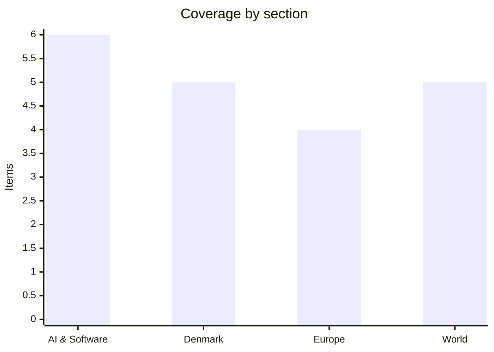

# Daily Briefing — 2026-08-19

**Top line:** Opening arguments began in Oakland in a 29-state trial arguing that Facebook and Instagram were *designed* to harm children — the first time platform mechanics rather than platform content are on trial at this scale, with Zuckerberg and Mosseri expected to testify and a Danish psychologist among the witnesses who built the case.

## Follow-ups

- **The Rada did not vote.** Tuesday's session was postponed amid protests, because Zelensky's formal submission had not arrived. It landed later the same day: Yevhenii Khmara for defence, Andrii Sybiha for foreign affairs. The vote is now expected today. See Europe.
- **Zambia is settled, more or less.** The ECZ's final consolidated result from all 226 constituencies gave Hichilema 2,965,326 votes (60.49%) to Brian Mundubile's 1,856,217 (37.87%) — a wider margin than the partial counts implied. Mundubile appears to have conceded in an interview with international media, though his alliance has not ruled out a petition and rigging claims persist.
- **No GitHub root cause yet.** GitHub still has not published an RCA for the 17 August global outage, and says the analysis will appear in its August availability report — due in September. Actions' 90-day uptime has fallen to 99.33%. See AI & Software.
- **Bessent's Iran sanctions still have not appeared.** What did appear was the UAE suspending all trade and financial dealings with Iran. See World.
- **Belgium's fire is quieter but not out.** Rain began falling on 17 August over the High Fens blaze, now put at about 3,000 hectares with roughly 500 firefighters and troops deployed; a crisis-cell spokesman said only that it "had not spread further but we cannot yet say it is contained". France's Landes fire held at about 17 km² with no major overnight flare-ups.
- **Flores displacement is the number that moved.** The death toll held at 68, but displacement rose to roughly 12,800–19,000, with more than 1,600 aftershocks recorded and a 14-day state of emergency declared. See World.
- **UK July CPI was not out at the time of writing** — the ONS release is at 07:00 today. Pantheon Macroeconomics expects 2.9%, up from 2.6% in June.
- **No change on GLM-5.3.** Z.ai's open weights are still pointed at around 28 August.

## AI & Software

**A bipartisan coalition of 29 states put Meta's product design on trial, and the remedy they want is not money.** Opening arguments began Tuesday 18 August in federal court in Oakland, California, with Colorado, California, New Jersey and Kentucky leading a case brought by 29 state attorneys general alleging that Facebook and Instagram were built with deliberately addictive features, that Meta misrepresented platform safety, and that it improperly collected children's data. Meta disputes all of it and points to what it says is heavy investment in protections for younger users; its formal position has included the argument that it cannot have misled consumers because "social media addiction" is not a recognised psychiatric diagnosis. Mark Zuckerberg and Instagram head Adam Mosseri are both expected to testify. What makes this different from the long run of content-moderation litigation is the relief sought: the states want structural changes to how the products work — age restrictions, and the removal or modification of features such as infinite scroll — rather than damages alone. Meta has warned that penalties could be enormous; the states have floated figures reaching into the hundreds of billions of dollars, which is a negotiating posture as much as a legal claim. The read-across is the real story. If a court can order design changes to an algorithmic feed, the same logic reaches TikTok, YouTube, Snap and anything else built on engagement optimisation, and it does so without touching the First Amendment questions that have sunk previous attempts. The counter-reading worth holding: proving that a specific design feature caused a specific harm is genuinely hard, and Meta has beaten causation arguments before. [Reuters, via Tech Startups](https://techstartups.com/2026/08/18/top-tech-news-today-august-18-2026-apple-baidu-bytedance-google-meta-openai-xiaomi-more/)

**Etched doubled its valuation to $21 billion in a single month, and shipped its first rack to the firm that led the round.** The inference-chip startup announced on 18 August that it had raised $700 million at a $21 billion valuation led by Jane Street, with Kleiner Perkins, Sequoia, Andreessen Horowitz, Tiger Global, Bain Capital Ventures, Peter Thiel, Blackstone, Neo, Primary, Stripes and Positive Sum participating. That is up from $10.3 billion at a $300 million Series C in July, and from $5 billion in December — roughly $11 billion of repricing in a month. The unusual detail is that Jane Street is both lead investor and first customer: Etched shipped its first rack to the quantitative trading firm last month and says Jane Street is now deploying it in its own data centre against live workloads. Etched sells what it calls frontier inference clusters rather than bare chips, pairing a low-voltage prefill chip with new memory and interconnect technology aimed at the decode stage. The company, founded by three Harvard dropouts, has now raised close to $2 billion and is recruiting engineers out of Nvidia. The strategic bet is that AI economics are shifting from training to continuous production inference, where specialised architectures can beat general-purpose accelerators on cost per token or latency. The obvious caution is that semiconductor startups die on things software companies never see — fab slots, packaging, memory supply, data-centre integration — and a first customer who is also your lead investor is a weaker market signal than an arm's-length one. Set against Groq raising at half its prior valuation two days earlier, the sector is not repricing uniformly so much as concentrating. [Etched](https://www.globenewswire.com/news-release/2026/08/18/3347095/0/en/etched-raises-700m-at-a-21b-valuation-and-completes-first-customer-delivery-to-jane-street.html) · [TechCrunch](https://techcrunch.com/2026/08/18/etcheds-valuation-doubles-to-21b-in-a-month/)

**OpenAI shipped a separate ChatGPT for 13-to-17-year-olds, with age prediction deciding who gets it.** The teen experience applies tighter restrictions around sexual and romantic roleplay, graphic violence and self-harm content, and adds safeguards intended to discourage emotional dependency on the assistant. Placement is not purely self-declared: users who identify as teenagers *or* whom OpenAI's age-prediction system estimates to be under 18 are routed into it automatically, which means the system is making a consequential inference about users who never told it anything. Parents who link accounts can set quiet hours and receive notifications in certain high-risk situations, and the product biases toward Study Mode over simply completing assignments. The timing is not a coincidence — it lands the same day as the Meta trial opening, and follows a year of escalating scrutiny of how conversational systems behave with minors. The design question underneath is whether an assistant that is deliberately less engaging is one teenagers will actually use, or one they will route around by claiming to be 19. For anyone building products with under-18 users, the more useful signal is the architecture: age inference plus a differentiated experience plus parental linkage is now the shape regulators are likely to treat as the baseline. Whether it works is a separate question from whether it becomes the template. [OpenAI, via Tech Startups](https://techstartups.com/2026/08/18/top-tech-news-today-august-18-2026-apple-baidu-bytedance-google-meta-openai-xiaomi-more/)

**Google is paying $10 million at a bankruptcy auction for a decade of Spirit Airlines' internal working life.** The package covers roughly 100 million employee emails, 500 million Microsoft Teams chats, plus spreadsheets, calendars and operational records from the collapsed carrier, all de-identified and to be scrubbed by a third party before transfer. Google outbid AI data firm Mercor's $7.5 million offer; a US bankruptcy judge is scheduled to review the sale this week. The stated use is product development and AI model training. What makes this worth noticing is not the price, which is trivial by AI standards, but the category: this is not scraped web text or licensed books, it is a complete record of how one large organisation actually coordinated, escalated, argued and decided — exactly the data that agentic workplace tools have no good source for. Public corpora contain almost nothing resembling an internal Teams thread about a delayed aircraft turnaround. It also opens an uncomfortable pipeline: corporate failure now produces a training-data asset, and employees who wrote those messages had no expectation they would end up in a model. De-identification addresses the legal exposure more than the intuitive objection, since writing style and situational detail are not names. Expect more bidding at bankruptcy auctions, and expect at least one jurisdiction to ask whether employee communications can be sold this way at all. [Business Insider](https://www.businessinsider.com/google-buys-spirit-airlines-data-ai-model-development-2026-8)

**GitHub Actions burned a year's downtime budget in one afternoon, and the root cause is now a September problem.** Analysis published on 18 August put GitHub Actions' 90-day uptime at 99.33% following the 17 August global outage, which ran for close to eight hours end to end — enough to consume almost the entire annual allowance implied by a three-nines target in a single incident. GitHub declared the headline degradation mitigated at 16:59 UTC on 17 August across API Requests, Actions, Git Operations, Issues, Pages, Pull Requests and Webhooks, but Copilot remained marked as a major outage afterwards. No root cause has been published, and GitHub says the analysis will be folded into its August availability report, expected in September. That is the second such deferral this month: the 6 August Actions incident, which ran from 15:22 UTC to a resolve post at 02:04 UTC the next day and was traced to a configuration change that reduced Pages deployment capacity, is also still awaiting a full write-up. For teams whose CI/CD sits entirely on Actions, the practical consequence is that "mitigated" on a status page is a weak signal and the explanation arrives a month after the decision you needed it for. The wider point, unchanged from Monday, is concentration: the agentic coding tool chain — Cursor among others — degraded downstream of GitHub rather than independently. Separately, a threat actor is offering databases claiming 3.6 million employee records taken from Microsoft Azure environments at multiple large companies; BleepingComputer reports the claimed access came through compromised credentials rather than any flaw in Azure itself, which is the more common and less reassuring failure mode. [TechTimes](https://www.techtimes.com/articles/324820/20260818/github-actions-hit-three-nines-failure-one-august-outage-consumed-years-downtime-budget.htm) · [IncidentHub](https://blog.incidenthub.cloud/github-actions-pages-outage-aug-6-2026)

**The UK is formally costing out what happens if it loses access to American frontier models.** The Financial Times reported that the UK government is conducting an urgent assessment of the economic consequences of losing access to advanced foreign AI models, prompted by the Trump administration's restriction of foreign-national access to Anthropic's Fable 5. The premise of the exercise is the uncomfortable one: a country without a domestic frontier lab has embedded models it does not control into coding, scientific research, cybersecurity, professional services and enterprise automation, and another government can switch that off on national-security grounds. That is a different problem from procurement or price — it is a single point of failure sitting under a large share of white-collar productivity. The likely policy responses are all expensive and slow: sovereign compute, domestic model development, or deliberate diversification onto open-weight systems that cannot be revoked. Europe and the UK have argued about compute sovereignty for two years without much moving; treating model *availability* as an economic-security question rather than an IT question is what could shift the budget conversation. It is worth noting this cuts both ways for open weights — the same GLM-5.3-style releases that OpenAI's president warned about on Monday as a security risk are, from a sovereignty standpoint, the thing that cannot be turned off. For anyone architecting on a single frontier provider, the assessment is a reasonable prompt to know what your fallback actually is. *(reported by the FT; no UK government publication yet.)* [FT, via Tech Startups](https://techstartups.com/2026/08/18/top-tech-news-today-august-18-2026-apple-baidu-bytedance-google-meta-openai-xiaomi-more/)

## Denmark

**A Danish psychologist who sat on Meta's own expert panel is a central witness in the case now opening in Oakland.** Lotte Rubæk, who leads the self-harm team in child and adolescent psychiatry in Region Hovedstaden, spent three years on Meta's global expert group covering self-harm, eating disorders and suicide before resigning, and has since testified against the company as a factual witness. Her testimony was used in a Los Angeles Superior Court case in which a 20-year-old American woman, Kaley, won against Meta and Google — the first time platforms have been found liable for deliberately designing for dependency and contributing to a user's mental health problems — and is set to be used across the JCCP 5255 "Social Media Cases" consolidated proceedings. Rubæk's framing, which she repeated to DR, is that this is "the tech giants' tobacco moment", a comparison that is doing real analytical work rather than rhetorical: the tobacco cases turned on internal documents showing the company knew, which is precisely what the state attorneys general say they have. Denmark has its own front in this. On 1 April 2026 the Dutch NGO SOMI filed a class action here against Meta's platforms over addictive features and algorithmic manipulation of young users, seeking a minimum of 25,000 kroner per person; anyone who used Facebook or Instagram after 28 February 2023 while under 18 can join. Danish coverage on 18 August also carried therapists reporting dependency in children as young as nine. The Danish case will move slowly and is unlikely to produce anything before the American proceedings do — but the evidentiary record built in Oakland is what it will draw on. [DR](https://www.dr.dk/nyheder/udland/dansk-psykolog-vidnede-i-sag-mod-meta-det-er-techgiganternes-tobaksoejeblik) · [Digitalt Ansvar](https://www.digitaltansvar.dk/aktuelt/historisk-sogsmal-meta-sagsoges-i-danmark-for-svigt-af-born-og-unge) · [TV 2](https://nyheder.tv2.dk/samfund/2026-08-18-boern-ned-til-ni-aar-afhaengige-af-sociale-medier-terapeut-ser-flere-triste-aarsager)

**The Economic Council of the Labour Movement now expects 4.2% GDP growth this year — roughly double what the Nationalbank and the Commission forecast.** AE published the first major forecast since Statistics Denmark's June revision of the national accounts, which adjusted growth for 2023–2025 upwards and meant Denmark entered 2026 in materially better shape than anyone had been assuming. AE's reasons are conventional: record-high employment, still-low unemployment, inflation under control and exports holding up despite tariffs, higher oil prices and general international instability. Analyst Fredrik Olsen singled out pharmaceuticals as the main engine, which is the standing caveat on every Danish growth number — a single sector, and to a large extent a single company, moves the national aggregate. The gap between forecasters is unusually wide and worth holding in mind: the OECD projects growth slowing from 2.9% in 2025 to 2.5% in 2026, the European Commission has 1.9%, and Danmarks Nationalbank had 1.8% in March. AE is the labour movement's own institute and its forecasts are not neutral instruments in a budget year. The political timing matters because the finance bill round is starting now, with Enhedslisten already threatening a government crisis over food VAT and demanding money to migrate public agencies off Palantir. A 4.2% headline gives the government room it would not otherwise have — and gives every support party a reason to ask for more. [The Local](https://www.thelocal.dk/20260818/today-in-denmark-a-roundup-of-the-latest-news-on-tuesday-60) · [TV 2](https://nyheder.tv2.dk/business/2026-08-18-ny-prognose-viser-overraskende-udvikling-i-dansk-oekonomi)

**Lidegaard told the court his words were sharp but not defamatory, and a verdict is weeks away.** The defamation case Morten Messerschmidt brought against Martin Lidegaard opened at Retten på Frederiksberg on Tuesday 18 August with cameras allowed. The disputed statement dates from a party-leader debate on Democracy Day in Randers in November 2025, where the Radikale leader said Dansk Folkeparti would "gladly intern and deport thousands of fellow citizens, just because they have a different faith or a different skin colour than most of us in this room". Lidegaard's defence in court was essentially that the phrasing was deliberately pointed and aimed at provoking debate — sharply cut, in his words, but a characterisation of policy rather than a dishonouring factual claim. Messerschmidt is not seeking damages or punishment; he wants a declaration that the statements were *ubeføjede*, unfounded, which is a reputational remedy. Legal scholars quoted by DR are close to unanimous that this is uphill, because Danish law gives politicians very wide latitude for statements made inside political debate and a televised party-leader debate sits at the centre of that protection. Proceedings continued through Tuesday afternoon and the court is expected to rule in a few weeks rather than immediately. Two readings are available and both survive the day's evidence: a genuine attempt to establish where characterisation ends and defamation begins, and a platform for an opposition leader who has spent August driving the immigration agenda. Neither requires the other to be false. [DR](https://www.dr.dk/nyheder/politik/lidegaard-og-messerschmidt-moedes-i-retten-foelg-med-her) · [Kristeligt Dagblad](https://www.kristeligt-dagblad.dk/lidegaard-i-retten-jeg-sagde-det-skarpt-og-soegte-debat)

**A section of the Port of Aarhus became a temporary military area on Tuesday morning, with a drone ban attached.** East Jutland Police confirmed it had given the Danish Armed Forces consent to establish a *midlertidigt militært område* (MMO) at the port from 07:00 on Tuesday 18 August until 20:00 on Thursday 20 August, in connection with the staging and guarding of sensitive equipment prior to shipping. The area is clearly marked, cordoned off, guarded, sits in a section of the port with no public access, and carries a drone prohibition for the duration. It is not an isolated event: the same police district authorised a comparable temporary military area at Grenaa Havn at the end of July, explicitly described as supporting a NATO effort. The pattern of short, publicly announced port activations along the Jutland east coast is what is new — these used to happen without a press release. The implication is a steady rhythm of matériel movement through Danish civilian ports toward the Baltic, formalised enough to need a legal designation and a drone ban rather than handled quietly. Neither the police nor the armed forces have said what is being shipped or where, and they are unlikely to. For anyone reading Danish defence posture from the outside, these notices are one of the few reliable public indicators of tempo. [Østjyllands Politi](https://politi.dk/oestjyllands-politi/nyhedsliste/midlertidigt-militaert-omraade-paa-grenaa-havn/2026/07/30) · [Copenhagen Post](https://cphpost.dk/2026-08-18/news/round-up/military-sets-up-temporary-area-at-aarhus-port/)

**A citizens' proposal to strip anonymity from the Afghanistan inquiry has passed 50,000 signatures.** The Folketing commissioned an inquiry in 2021 into Denmark's 2001–2021 military effort in Afghanistan, but its Presidium decided that politicians giving evidence may choose whether they are quoted by name. The citizens' proposal, founded by veteran Morten Kromann, argues that an inquiry into two decades of war cannot deliver accountability if the decision-makers can testify anonymously while soldiers cannot. Crossing 50,000 signatures means it qualifies for treatment in the Folketing under the *borgerforslag* system, which forces a debate rather than guaranteeing a change. The political awkwardness is that the anonymity rule was set by the parliament's own leadership, and every party currently in government or in opposition has former ministers within scope. It arrives in a week when Danish defence is unusually visible — a NATO-linked military zone at Aarhus, a defence minister who is also the leader of the largest opposition party, and a summer-meeting season in which every party is choosing its autumn ground. Whether the Presidium reconsiders is the thing to watch; a debate that ends with the rule intact would be its own kind of answer. [Copenhagen Post](https://cphpost.dk/2026-08-18/news/round-up/military-sets-up-temporary-area-at-aarhus-port/)

## Europe

**Zelensky finally named his defence minister — and the nominee has to quit the army before parliament can confirm him.** After Tuesday's Rada session was postponed amid protests with no presidential submission in hand, Zelensky sent two nominations later on 18 August: Major General Yevhenii Khmara for defence and Andrii Sybiha, returning to the post, for foreign affairs. Khmara has been acting defence minister since the dismissal of Mykhailo Fedorov in mid-July, and is a senior special forces officer credited with overseeing Operation Spiderweb, the strike Ukraine says destroyed a significant part of Russia's strategic bomber fleet. Ukrainian law requires the defence minister to be a civilian, and Ukrainska Pravda reported that Khmara has agreed to leave military service to meet that requirement — a step that has to be completed before the vote rather than after it. Several dozen protesters gathered outside parliament on Tuesday demanding Fedorov's reinstatement, in demonstrations now entering their second month. The vote is expected today, 19 August, which would end more than a month without a permanent defence minister in the middle of a war. The Kyiv Post's framing before the nomination was that anyone other than Fedorov would intensify the protests; that test now runs in public. Watch the margin as much as the outcome — the defence nomination is a presidential prerogative, so a narrow confirmation is itself a signal about how much authority Zelensky retains inside his own faction. [Kyiv Post](https://www.kyivpost.com/post/82605) · [Ukrainska Pravda](https://www.pravda.com.ua/eng/news/2026/08/18/8049197/)

**Brussels said the quiet part about Ceuta: everyone staying illegally goes back, minors included.** European Commission home affairs spokesperson Markus Lammert told a Brussels press conference on Tuesday that all people illegally remaining in Ceuta would be returned to Morocco, and that EU law provides for the return of unaccompanied minors in irregular migration cases — covered by the current Return Directive and, shortly, the EU Return Regulation. More than 1,100 unaccompanied minors are currently in overcrowded temporary reception centres, warehouses or on the streets of the enclave, among the thousands remaining after an estimated 72,000–80,000 people crossed in recent weeks. The legal position is more constrained than the political line suggests: the Return Directive requires a member state to satisfy itself before removal that a child will be handed to a family member, a guardian or adequate reception facilities in the destination country, and Spanish and international child-welfare law blocks summary returns. Spanish reporting indicates most unaccompanied minors have not been and cannot be returned quickly. NGOs responded to the Commission with the line "there are no illegal minors". The significance is that the Commission has chosen to state a maximalist return position in a case where its own instruments impose conditions it has not explained how Spain will meet — which is either a signal to member states ahead of the Return Regulation, or a gap between rhetoric and mechanism that will be litigated. Denmark is not a bystander here: the Ceuta crossings triggered the emergency Folketing sitting on 12 August and a live Danish debate about Schengen. [Euronews](https://www.euronews.com/my-europe/2026/08/18/eu-supports-repatriation-of-unaccompanied-migrant-minors-from-ceuta-to-morocco)

**The EU's e-Evidence regime went live on 18 August, and it applies to providers well outside the EU.** Regulation (EU) 2023/1543 became fully applicable on Tuesday, replacing the primary reliance on mutual legal assistance with direct cross-border orders: a judicial authority in one member state can now issue a European Production Order (EPOC) or European Preservation Order (EPOC-PR) straight to a service provider established in another. The accompanying Directive (EU) 2023/1544 requires many providers offering services in the EU — including non-EU providers — to designate an establishment or legal representative inside the Union to receive and process those orders. Scope is broad: electronic communications providers, cloud and hosting providers, online platforms, domain name registries and registrars, and other providers processing electronic data. The practical change for engineering and legal teams is that a lawful-access request can now arrive from a prosecutor in a member state where the company has no presence, on statutory timelines, without a treaty request routing through a national ministry first. That is a substantial reduction in friction, which is the point, and also the objection — the safeguards against a request from a member state with rule-of-law problems are thinner than under MLAT. Companies that have not designated a representative are already non-compliant as of yesterday. It is the kind of deadline that produces no news on the day and a great deal of it in six months. [Potomac Law](https://www.potomaclaw.com/news-EU-e-Evidence-Rules-Become-Operational-on-August-18-2026-US-Companies-with-European-Operations-Should-Prepare-Now)

**Russia hit a DTEK thermal power plant for the 230th time, and Ukraine is negotiating a drone production deal with Belgium.** DTEK said a massive strike on Tuesday 18 August severely damaged equipment at one of its thermal plants and forced the station to halt electricity generation entirely; the company puts the cumulative total at more than 230 attacks on its thermal plants since Russia's full-scale invasion began. Halting generation outright, rather than degrading it, is the distinction that matters heading into autumn — Ukraine's grid has survived previous winters by keeping damaged units partially online. In the other direction, Zelensky said on 18 August that Ukraine and Belgium are working toward a "Drone Deal", and discussed possible signing dates with Belgian Deputy Prime Minister Maxime Prévot; Zelensky put Belgian support to Ukraine at more than $1.3 billion this year alone. The shape of European support has been shifting from donated stocks toward co-production and financing of Ukrainian manufacturing, which suits both sides: Ukraine has the iteration speed, Europe has the money and wants the industrial learning. Belgium is also the jurisdiction holding the bulk of frozen Russian sovereign assets through Euroclear, which gives any Belgian-Ukrainian arrangement a subtext beyond its face value. Neither government has published terms or a date. Watch whether the deal is announced as procurement or as joint production — those are very different commitments. [Kyiv Post](https://www.kyivpost.com/post/82617) · [Ukrinform](https://www.ukrinform.net/rubric-polytics/4155374-zelensky-and-belgian-fm-discuss-potential-dates-for-signing-drone-deal.html)

## World

**Trump says there are no talks with Iran at all, the UAE has cut trade with Tehran, and oil is above $90.** Trump posted on Tuesday that "there are no talks or conversations going on, or scheduled, with the Islamic Republic of Iran," and said he would not try to revive the lapsed 60-day memorandum of understanding, which expired on 17 August without agreement or extension. Iran's Foreign Ministry spokesman Esmail Baghaei said the MOU had been irrelevant for weeks because of what he called gross US violations of the text signed on 18 June, and the Foreign Ministry said Tehran would shift to a "fully offensive" military posture; Trump called on Tehran to "put up the white flag of surrender". Parliament speaker Mohammad Bagher Ghalibaf restated the conditions for reopening the Strait of Hormuz: release of frozen Iranian assets, lifting of sanctions on oil and gas sales, and an end to the US naval blockade of Iran's ports. The economic transmission is now unambiguous. Confirmed transits through Hormuz fell 19.5% last week to 95, with only three vessels passing on Sunday; crude futures climbed above $90 a barrel on Monday following reports that Iran had seized a UAE-owned tanker; US pump prices set a mid-August record at a $4.06 national average. On Tuesday the UAE announced it had suspended all trade and financial dealings with Iran — a materially larger step than the sanctions package Scott Bessent has been promising for a fortnight and still has not produced. For European buyers the relevant fact remains the simplest one: the strait is closed and nobody involved has an exit that does not require someone to move first. [CNN](https://www.cnn.com/2026/08/18/world/live-news/iran-war-trump) · [Bloomberg](https://www.bloomberg.com/news/articles/2026-08-18/trump-takes-hard-line-on-iran-as-hormuz-standoff-drags-on) · [Democracy Now](https://www.democracynow.org/2026/8/18/headlines)

**An 800,000-barrel spill of Russian crude has spread across 2,000 square kilometres off Oman and is now on the beaches.** The tanker ran aground in a protected marine reserve after an unexplained attack on the vessel in June, and the oil has spread largely unchecked for weeks; it has now begun fouling Omani coastline. The scale puts this among the larger tanker spills of the past two decades, and the location — a protected reserve, in a region where response capacity is already consumed by the Hormuz standoff — makes containment harder than the raw volume suggests. Nobody has claimed the June attack and no state has publicly attributed it, which is itself part of the picture: the shadow fleet moving sanctioned Russian crude operates with opaque ownership, thin insurance and unclear liability, and there is no obvious party with both the money and the obligation to clean this up. Oman's exposure is compounded politically. Trump threatened on Monday to "bomb the shit out of" Oman if it gets in the way of US efforts to reopen the strait — a remarkable thing to say about the country that has served as the standing back-channel between Washington and Tehran for two decades. Muscat is therefore simultaneously absorbing an environmental disaster caused by the sanctions-evasion trade and being threatened by the government imposing the sanctions. Watch whether any international response mechanism is triggered at all; if none is, that absence is the story about who bears the cost of the shadow fleet. [Democracy Now](https://www.democracynow.org/2026/8/18/headlines)

**UNIFIL says Israel fired an average of 137 projectiles a day into southern Lebanon over two weeks, and the UN calls it "alarming".** Israel's military carried out fresh airstrikes and mortar attacks on southern Lebanon on Monday and Tuesday, after weekend airstrikes killed at least 11 people including children. UN spokesperson Stéphane Dujarric described an "alarming and concerning intensification of violence" in the south, and said the violence has displaced families from areas to which they had only recently returned. The 137-per-day figure comes from UNIFIL's own recording rather than either belligerent, which makes it the more reliable number in a conflict where both sides' counts are contested. The pattern — sustained fire at a level below the threshold that would be described as a new war, producing displacement and civilian deaths — has been running since the 2024 ceasefire arrangements, but the last fortnight represents a step change in tempo rather than a continuation. What it is *for* is genuinely unclear: Israel frames it as degrading Hezbollah reconstitution, while Lebanese and UN officials describe an intensity that makes return to border villages impossible, which has its own demographic effect regardless of intent. The immediate risk is that displacement in the south collides with Lebanon's unresolved fiscal and governance crisis. Nothing in the Gaza track currently constrains this. [Democracy Now](https://www.democracynow.org/2026/8/18/headlines)

**Kushner left Jerusalem without an agreement, and Israel's national security minister used the same day to demand a nightly kill quota.** Monday's four-hour meeting between Jared Kushner and Benjamin Netanyahu did not produce Israeli agreement to implement the 15-point US-backed framework that Hamas had already accepted, despite Netanyahu's office briefing an agreed sequencing of disarmament before withdrawal. Kushner's own framing to Fox News was blunt: "We have a plan to rebuild Gaza, but we will not allow Gaza to be rebuilt until the demilitarization occurs." Israel has been conducting near-daily attacks on Gaza despite last year's ceasefire, killing more than 1,200 people since October according to Palestinian counts. Against that backdrop, far-right National Security Minister Itamar Ben-Gvir told a podcast hosted by freed hostage Rom Braslavski that he wants targeted assassinations "taking down 30 to 40 every night, not just those who pose an immediate threat", adding that "there are people there who are not worthy of life… they're not even people." The remarks drew condemnation from staunch supporters of Israel including Nevada Democratic Senator Jacky Rosen, who called for Ben-Gvir's resignation and urged Netanyahu to disavow him. Netanyahu, who faces an election on 27 October, spent the weekend amplifying a Likud billboard placing New York mayor Zohran Mamdani alongside Erdoğan, Iran's supreme leader Mojtaba Khamenei and Hezbollah's Naim Qassem. The coalition arithmetic is the thing to hold onto: the minister making these statements is load-bearing for the government that has to sign any deal. [Democracy Now](https://www.democracynow.org/2026/8/18/headlines) · [NPR](https://www.npr.org/2026/08/16/g-s1-138948/kushner-gaza-hamas-netanyahu-egypt-talks)

**Flores displacement climbed to nearly 13,000 as Indonesia declared a 14-day emergency and flew in 275 tons of aid.** The confirmed death toll from Saturday's magnitude 7.7 quake held at 68 with more than 200 injured, but the displacement figure moved sharply — more than 12,800 people displaced by Tuesday, with some counts running to around 19,000 — and the island has now recorded more than 1,600 aftershocks. Damage assessments were revised upward twice: an early figure of 4,541 damaged homes became 7,968 with light to severe damage, alongside 744 damaged public facilities, and surveying is not finished. Authorities declared a 14-day state of emergency and deployed nearly 1,500 military and police personnel supported by ten aircraft, delivering 275 tons of aid, nearly 5,400 food packages, two field hospital tents, medicines and clothing. Access remains the constraint rather than supply: landslides have blocked roads across parts of Flores and deliveries to the hardest-hit communities are still slow, which is why survivors interviewed on Monday were describing a loaf of bread split across a household. The relative stability of the death toll against the rising damage and displacement counts suggests the initial casualty estimate was closer to right than these events usually allow — but districts that have not yet been reached are exactly where that assumption breaks. This is Indonesia's deadliest quake since West Java in 2022. [Al Jazeera](https://www.aljazeera.com/news/2026/8/17/thousands-await-aid-after-deadly-indonesia-quake-as-rescue-work-conducted) · [France 24](https://www.france24.com/en/indonesian-earthquake-aid-reaches-flores-as-death-toll-climbs)

## Watch list

- **Today, Wednesday 19 August:** the Rada vote on Khmara for defence and Sybiha for foreign affairs, contingent on Khmara having formally left military service; UK July CPI from the ONS at 07:00, consensus around 2.9%; Danmarksdemokraterne's summer group meeting opens in Gl. Vindinge, Nyborg.
- **This week:** the US bankruptcy judge's review of Google's $10m purchase of Spirit Airlines' internal data; Zuckerberg and Mosseri testimony scheduled in the Oakland trial; containment status of the High Fens fire once the rain stops.
- **26 August:** Nvidia reports Q2 FY2027, with consensus revenue of $93–95bn and China data-centre revenue still booked at zero.
- **Around 28 August:** Z.ai's GLM-5.3 open weights — still the date OpenAI has flagged in writing as a step change in offensive cyber capability available to anyone.
- **Still outstanding:** GitHub's root-cause analysis for 6 and 17 August, now deferred to the September availability report; Bessent's promised Iran sanctions package; the Messerschmidt–Lidegaard verdict, expected in a few weeks.
