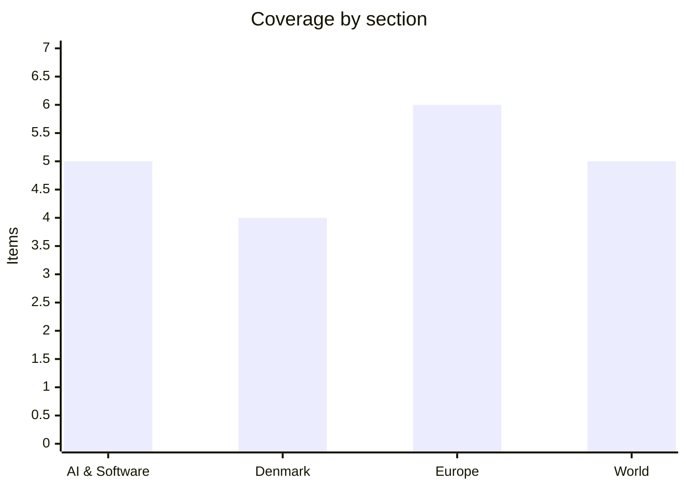

# Daily Briefing — 2026-08-23

**Top line:** Anthropic is running the numbers on an IPO it expects to match or beat SpaceX's record, with a public filing possible before the end of this month — the first time a pure-play frontier AI company will have to show the public markets its actual margins.

*Note: the last briefing in this series was 19 August, so the follow-ups below cover four days rather than one.*

## Follow-ups

- **Ukraine has a defence minister again.** The Rada confirmed Major General Yevhenii Khmara on 19 August with 312 votes, alongside Andrii Sybiha's return as foreign minister. Khmara said he had been discharged from military service under Article 26 of the Law on Military Duty "as part of organisational measures for senior officers", clearing the civilian-minister requirement. The comfortable margin answers the question the last briefing flagged about Zelensky's authority inside his own faction.
- **GitHub published the root cause after all.** It appeared on 20 August rather than being deferred to the September availability report as GitHub had said. See AI & Software.
- **Bessent's sanctions arrived as rhetoric, not text.** Trump announced an "economic D-Day" on 19 August; Bessent told a press conference the next day that he would impose "the toughest sanctions in history" and "collapse this regime", then said the actual details come Monday 24 August. Brent closed around $93.6 on 21 August.
- **The Meta trial is producing testimony, not yet Zuckerberg.** Former Meta engineering director Arturo Béjar testified that Zuckerberg encouraged growth over child safety. Zuckerberg is on the states' witness list for three hours at an unspecified point in a trial expected to run about six weeks; the jury returns an advisory verdict and Judge Yvonne Gonzalez Rogers decides liability and remedies.
- **Still open:** the Messerschmidt–Lidegaard verdict; Z.ai's GLM-5.3 open weights; Nvidia's Q2. No fresh reporting surfaced on the containment status of Belgium's High Fens fire.

## AI & Software

**Anthropic is preparing to file publicly for what would be the largest IPO in history, and the risk factors are as interesting as the numbers.** Bloomberg reported on 20 August that Anthropic expects its offering to match or exceed the size of SpaceX's record-setting debut, and that it could file publicly as soon as the end of August. The company confidentially filed an S-1 on 1 June, with Morgan Stanley, Goldman Sachs and JPMorgan reported as underwriters, following a Series H that valued it at roughly $965 billion post-money; SpaceX's record raise was about $86 billion. Anthropic has told investors its annualised revenue run rate reached about $65 billion by the end of July, driven by enterprise Claude and agent deployments — a self-reported, unaudited figure; market forecasters are clustering around a $2 trillion valuation and an October listing, though those are predictions rather than company guidance. CNBC reported separately on 21 August that the filing will list AI backlash as a named risk factor — a striking thing for a company to have to underwrite in writing. That matters more than it sounds: an S-1 forces disclosure of gross margin on inference, customer concentration, compute commitments and the actual shape of the "annualised revenue" figure everyone has been quoting. Anthropic's compute is entangled with Broadcom-arranged financing structures (see below) and with Google and Amazon as both investors and suppliers, all of which has to be laid out. For anyone building on Claude, the practical read is that pricing and roadmap decisions become subject to quarterly public-market discipline in a way they are not today. The counter-reading is that a successful listing gives Anthropic a permanent capital source that its private rivals lack, which is the argument for doing it while the window is open. *(Reported by Bloomberg and CNBC citing people familiar; Anthropic has not confirmed a date.)* [Bloomberg](https://www.bloomberg.com/news/articles/2026-08-20/anthropic-expects-to-match-spacex-s-record-ipo-size-or-top-it) · [CNBC](https://www.cnbc.com/2026/08/21/-anthropic-ipo-filing-will-show-ai-backlash-as-risk-sources-say.html)

**Nvidia is paying $6 billion to license Poolside's technology and hire 109 of its people — without buying the company.** Under the arrangement reported on 20 August, Nvidia pays $6 billion under a *non-exclusive* licensing agreement covering Poolside's "Model Factory", invests a further $1 billion at a $12 billion pre-money valuation, and extends job offers to about 109 Poolside employees, while the corporate entity continues to exist and operate. Both parties say explicitly that this is not an acquisition or an acquihire and that the three co-founders remain — but the structure is the point: licensing plus mass hiring avoids the merger-review and change-of-control machinery that a $7 billion acquisition would trigger, while delivering a large share of the same assets. It also deepens Nvidia's push past silicon into the model layer, specifically AI coding — the segment where inference demand is growing fastest and where Nvidia has an obvious interest in making sure demand keeps landing on its hardware. Poolside's existing investors get liquidity and fresh capital without a sale; the remaining company keeps a non-exclusive right to what it built. The template is not new — Microsoft/Inflection, Amazon/Adept and Google/Character.AI ran variations of it — but the scale is a step change, and $6 billion for a non-exclusive licence is a number that will attract attention from antitrust authorities who have been watching this pattern for two years. The second reading worth holding: a non-exclusive licence genuinely is less than ownership, and if Poolside continues shipping independently the deal looks different than if it becomes a shell. Watch whether the residual entity announces anything in the next quarter. *(Reported by Newcomer; neither company has published terms.)* [Tech Startups, via Newcomer](https://techstartups.com/2026/08/21/top-tech-news-today-august-21-2026-anthropic-apple-broadcom-google-nvidia-openai-tesla-more/)

**GitHub's 17 August outage was an autoscaler that could not see the thing that ran out — and a retry storm from developers' own editors.** GitHub published its analysis on 20 August, earlier than the September availability report it had originally pointed to. The outage ran 7 hours 47 minutes across 17–18 August, with peak error rates around 20% on web and API traffic and roughly 50% on archive and raw content downloads, affecting GitHub.com, Actions, Copilot, Issues, Pull Requests and authentication. The root cause was not a deployment or configuration change but a straightforward capacity shortage in the US Central data centre: record traffic pushed the Istio sidecar proxies that mediate service-to-service communication to their processing limits, and the autoscaling logic did not account for sidecar capacity, so it never triggered expansion. Recovery was then prolonged by client-side retry behaviour — Copilot and VS Code clients retrying failed requests generated roughly an order of magnitude more traffic during exactly the window when the system needed less. That is the detail worth internalising: the failure was not in GitHub's servers so much as in a blind spot between two layers that each assumed the other was measured, compounded by clients that retry aggressively by default. It is also a specifically 2026 failure mode, in that a large share of the record traffic and essentially all of the retry storm came from AI coding tooling rather than humans pushing commits. For teams running agentic tooling against GitHub, the actionable item is your own retry and backoff policy, which is the part you control. The earlier 6 August Actions incident, traced to a configuration change that cut Pages deployment capacity, still has no equivalent write-up. [GitHub Blog](https://github.blog/news-insights/company-news/the-august-17-outage-and-the-work-ahead/) · [The Register](https://www.theregister.com/saas/2026/08/19/github-blames-8-hour-outage-on-autoscaling-fail-and-vs-code-retry-storm/5289547)

**Broadcom is arranging up to $100 billion of debt against future AI compute demand, much of it tied to Anthropic.** Bloomberg reported on 20 August that Broadcom is in talks with lenders for more than $60 billion, in a structure that could comprise roughly $60–70 billion of senior secured debt alongside about $30 billion of junior financing. The money is earmarked for AI infrastructure involving Anthropic and potentially other model developers, and follows earlier Broadcom work with Blackstone and Apollo on financing tied to Anthropic compute. What is notable is not the counterparty but the financing form. Rather than hyperscalers funding data centres from operating cash flow and carrying the assets on their own balance sheets, chipmakers, private credit funds and institutional investors are building special-purpose vehicles collateralised against expected future compute revenue — the structure normally used for pipelines, fibre builds and power plants. That has two consequences. It lets AI capex scale far past what any single company's balance sheet supports, and it means a demand shortfall no longer shows up primarily as a write-down at one firm but as stress across a credit market with a lot of participants who have never underwritten compute. It also arrives days before Anthropic's expected public filing, which will have to describe these commitments. The bull case is that this is exactly what a maturing infrastructure industry looks like. The bear case is that "asset class of its own" is a phrase that has preceded trouble before. *(Reported by Bloomberg citing people familiar; Broadcom has not confirmed.)* [Tech Startups, via Bloomberg](https://techstartups.com/2026/08/21/top-tech-news-today-august-21-2026-anthropic-apple-broadcom-google-nvidia-openai-tesla-more/)

**AT&T cut its cost for coding and advanced AI tasks by up to 56% by routing queries to cheaper models, and lost 2% of quality doing it.** The telecoms group uses a LiteLLM-based model router that sends work to the cheapest model capable of handling it — document and code summarisation to open-weight models from Nvidia, Meta and Google, complex code generation still to Anthropic and OpenAI. Open models now handle 40% of employee AI requests, with an internal target of 60–70% within a few years; some reporting puts the saving on specific Anthropic-served workloads as high as 90%. Goldman Sachs published analysis on 21 August arguing that this is not the threat to Big Tech it appears to be: Jim Covello's view is that cheaper inference expands total usage enough to fill the compute capacity hyperscalers are spending billions to build, making Amazon, Microsoft and Google net beneficiaries of open-weight models rather than victims. Both claims are company- and bank-sourced and worth treating as such — a 2% quality degradation is a measurement AT&T chose and defined itself, and "quality" on coding tasks is notoriously sensitive to how you benchmark it. Still, the direction is the useful signal. The interesting architectural point is that the router, not the model, has become the place where cost is decided, which makes routing quality a genuine engineering discipline rather than a config file. It also sharpens the sovereignty argument from last week: an organisation that has already built routing infrastructure has a much cheaper path off any single frontier provider. For anyone running a large internal AI bill, the 40%-to-60% figure is the one to benchmark against. [Tech Startups](https://techstartups.com/2026/08/21/goldman-sachs-says-open-source-ai-could-be-big-techs-unexpected-winner-as-att-cuts-model-costs-by-56/) · [Mobile World Live](https://www.mobileworldlive.com/operators/analysis-att-bets-on-routing-open-model-to-tame-ai-costs)

## Denmark

**The government wants to stop issuing residence permits to Ukrainians from 14 regions the Immigration Service now calls "less war-affected".** The proposal, announced on Saturday 22 August, would amend the special Ukraine act (*særloven*) so that people arriving from those 14 regions no longer qualify for residence under it. Immigration minister Morten Bødskov framed it in capacity terms: with roughly 47,000–48,000 Ukrainians in Denmark, he argued the pressure on municipal reception and integration services has to come down. Around a third of the Ukrainians currently living in Danish municipalities come from the regions now designated less war-affected, though the change is prospective rather than retroactive. Two further changes travel with it: internally displaced Ukrainians receiving cash assistance, previously exempt, would become subject to work requirements, and a separate bill would bar Ukrainians with outstanding military obligations from obtaining residence under the special act. The timing is awkward on its face — the announcement came the day after a Russian double-tap drone strike killed 16 people in a Kryvyi Rih shopping centre — and at least one mayor quoted by DR said the measure does not address the actual municipal problem, which is housing and school capacity rather than intake volume. The deeper significance is that the special act was Denmark's exception to its own restrictive asylum architecture, and this narrows it toward the ordinary rules. Whether the Immigration Service's regional risk assessment survives contact with the current strike tempo is the thing to watch; "less war-affected" is a judgement that Russian targeting can revise overnight. [DR](https://www.dr.dk/nyheder/indland/regeringen-vil-begraense-antallet-af-ukrainere-i-danmark) · [TV 2](https://nyheder.tv2.dk/samfund/2026-08-22-regeringen-vil-begraense-antallet-af-ukrainere-i-danmark)

**Three of the four governing parties are publicly pressuring the fourth over 2,055 people stuck in citizenship limbo.** Processing of naturalisation applications was suspended on 6 March 2026, when the bill covering that round — L 98, encompassing 2,055 adult applicants and roughly 1,120 children — lapsed with the dissolution of the Folketing ahead of the 24 March election. Nearly six months and one new government later, those cases are still frozen, and more than 14,000 people have applied since, all of them also waiting. The Moderates, the Social Liberals and SF have all said publicly that leaving over two thousand people in this position is unworthy of a democracy; the Social Democrats, who hold the immigration brief, have not moved. The blockage is a genuine political disagreement rather than administrative backlog: part of the coalition wants stricter naturalisation criteria first, including a proposal to summon applicants for interviews assessing their attitude toward democracy, and nobody wants to clear the queue under the old rules and then tighten them. This is the sharpest visible seam in a coalition that took a record-length negotiation to assemble, and it is the kind of issue where the smaller parties have to be seen to fight. Naturalisation in Denmark is granted by act of parliament rather than administrative decision, which is why a lapsed bill can strand real people for half a year. The practical stake for the applicants is concrete — voting rights, EU freedom of movement, and in some cases the loss of another citizenship they have already renounced. Watch whether an indfødsret bill appears in the autumn session; if it does not, this stops being a coalition irritation and becomes a story about the government's competence. [DR](https://www.dr.dk/nyheder/politik/2-055-ansoegere-til-dansk-statsborgerskab-skaber-interne-spaendinger-i-regeringen) · [The Local](https://www.thelocal.dk/20260821/today-in-denmark-a-roundup-of-the-latest-news-on-friday-58)

**Frederiksen has named return centres outside Europe as the single policy she will personally drive this term, and 19 member states are now behind it.** In interviews around the start of the political season, the prime minister said reception and departure centres beyond the EU's borders are the one concrete matter she intends to engage with most directly in her third term — an unusually narrow personal commitment for a head of government. The mechanism now exists to attempt it: the Council and Parliament reached agreement on the new Returns Regulation on 1 June 2026, replacing the 2008 Return Directive and explicitly providing for "return hubs" in third countries, subject to fundamental-rights conditions. Nineteen member states have endorsed the concept, which Denmark and Italy have jointly pushed for years, with Italy's Albania facilities held up as the working model despite their troubled record in the Italian courts. The next concrete step is a ministerial in Copenhagen on 4 September bringing together Denmark, Germany, the Netherlands, Austria and Greece; Bødskov has been in Berlin and The Hague preparing it. Frederiksen has said she expects the first hub to open in 2026–27, which is an aggressive timeline given no third country has publicly agreed to host one. That is the load-bearing gap in the whole project: the legal framework, the coalition of states and the political will are all now in place, and the missing input is a government willing to accept people the EU has rejected. The Ceuta episode earlier this month showed how fast the rhetoric outruns the mechanism. Watch 4 September for whether any host country is named. [InfoMigrants](https://www.infomigrants.net/en/post/72090/eu-pushes-ahead-with-plans-for-migrant-return-hubs-outside-europe) · [Council of the EU](https://www.consilium.europa.eu/en/press/press-releases/2026/06/01/council-and-parliament-reach-deal-on-returns-of-illegally-staying-third-country-nationals/)

**Denmark's battle group in Latvia has been handed to NATO command, under a Danish battalion commander who is the first woman to hold the role on an international deployment.** The transfer-of-authority ceremony took place at Camp Valdemar in Latvia, placing roughly 800 Danish soldiers and several hundred vehicles under the Canadian-led NATO Multinational Brigade Latvia. Lieutenant Colonel Karina Wøbbe commands the battle group — the first time a Danish combat battalion has deployed with a woman in charge. This is Denmark's fifth battle-group rotation to Latvia since 2022, taking over from Sweden, and the government has extended the presence period at Latvia's request; the deployment now runs to January 2027 rather than mid-December. The infantry company from Gardehusarregimentet that deployed earlier in the summer to bridge the gap can now come home. Read alongside the temporary military areas activated at Aarhus and Grenaa ports in recent weeks, the picture is a sustained logistics and force-rotation tempo through Jutland toward the Baltic that has become routine enough to have its own published rhythm. The Danish contribution is small in absolute terms but it is a full manoeuvre battalion rather than a symbolic tripwire, which is a meaningfully different commitment. The strategic question sitting underneath is what happens to these rotations if the war's front line changes materially, in either direction. For now the trend is longer, not shorter. [Forsvaret](https://www.forsvaret.dk/da/nyheder/2026/dansk-kampbataljon-i-letland-er-nu-overdraget-til-nato-brigade/) · [Janes](https://www.janes.com/defence-intelligence-insights/defence-news/land/danish-combat-battalion-arrives-in-latvia-to-join-canadian-led-nato-multinational-brigade)

## Europe

**Russia struck a crowded Kryvyi Rih shopping centre twice, half an hour apart, killing 16 and injuring 130 — and the second strike hit the rescuers.** A long-range drone struck the Soniachna Halereia shopping centre in Zelensky's home city at around 16:30 Kyiv time on Friday 21 August, while the mall was open and full; a second drone hit the same target roughly thirty minutes later, when emergency services were already on scene. The confirmed toll is 16 dead and 130 injured, including 23 children, with at least 29 of the wounded in serious condition. The UN Human Rights Monitoring Mission in Ukraine said the attack appears to constitute a breach of international humanitarian law — a deliberately careful formulation, but the double-tap pattern is the element that makes the legal question harder for Moscow to argue away, since the second strike's most likely casualties are first responders. EU foreign policy chief Kaja Kallas called it "terror by design". Macron announced on Saturday that France will deliver new interceptor missiles to Ukraine, telling Zelensky by phone that Paris is "strengthening our support with the delivery of interceptors"; Ukrainian air defences have been running short after several weeks of heavy strikes. France licensed Ukrainian production of French-designed cruise missiles, glide bombs and air-defence interceptors in June, so the announcement continues an established track rather than opening a new one. The strategic context is Putin's stated intent to escalate against Ukrainian economic infrastructure, which is a different targeting doctrine from military infrastructure and produces exactly this kind of casualty profile. Interceptor supply, not launcher availability, is now the binding constraint on Ukrainian air defence — which makes the composition of European support more important than its headline value. [Ukrainska Pravda](https://www.pravda.com.ua/eng/news/2026/08/22/8049713/) · [UN OHCHR Ukraine](https://ukraine.ohchr.org/en/Russian-attack-strikes-shopping-centre-full-of-civilians-UN-human-rights-monitors) · [Euronews](https://www.euronews.com/my-europe/2026/08/22/france-to-give-new-interceptor-missiles-to-ukraine-macron-says)

**Ukraine burned a 135,000-square-metre e-commerce warehouse and a Rosneft refinery in the same overnight raid, and hit Russian civilian logistics for the first time.** Ukrainian drones struck the Ozon logistics complex at Chapaevsk in Samara Oblast early on Saturday 22 August, setting a fire that had spread across most of the 135,000 m² site by 07:30; Ozon — Russia's second-largest online marketplace and the main domestic rival to Wildberries — said more than 500 employees were evacuated within minutes and several were injured. The same wave hit the Novokuibyshevsk refinery, part of Rosneft and one of the larger processing facilities in the Volga region, where imagery showed at least three separate fires. Russian officials reported drone activity across Saratov and Samara oblasts. Across the 24 hours, Russian strikes on Ukraine killed at least seven people and Ukrainian strikes on Russia and occupied territory killed at least ten, for a combined toll of around 17 — though counts for the Russian side varied, with the Moscow Times putting the overnight figure at six. Putin responded by warning of "far more destructive" retaliatory strikes on Ukrainian economic infrastructure and said Ukraine had opened a "Pandora's box". The Ozon strike is the genuinely new element: Ukraine has hit refineries, airbases and military logistics repeatedly, but a consumer-facing distribution hub is a shift toward the civilian economy, and it invites exactly the reciprocal framing Putin used. Both sides now describe their strike campaigns as targeting the other's economic capacity to sustain the war, which is a formulation with very little left inside it that is off-limits. Refinery damage has real transmission — Russian domestic fuel supply has been tight all summer — but the escalation logic is the more consequential development. [Kyiv Post](https://www.kyivpost.com/post/82870) · [Moscow Times](https://www.themoscowtimes.com/2026/08/22/ukrainian-drone-attacks-kill-multiple-people-across-russia-hit-ozon-warehouse-a93559) · [Al Jazeera](https://www.aljazeera.com/news/2026/8/22/russian-strikes-kill-6-people-in-ukraine-day-after-shopping-complex-attack)

**Six EU governments want a windfall tax on oil companies profiting from the Hormuz crisis, and Germany's own coalition is split on it.** Germany, Italy, Austria, Poland, Portugal and Spain sent a joint letter, reported on Sunday 23 August, asking that an EU-wide framework for taxing windfall profits be put on the agenda of next month's informal finance ministers' meeting in Dublin. The argument is that refining margins have risen faster than crude prices since the US and Israeli operations against Iran began in late February, so energy majors are capturing a spread that is a function of disrupted supply rather than of anything they did. The signatories point explicitly to the temporary solidarity contribution introduced in 2022 after Russia's invasion as the precedent to learn from — including its weaknesses, since that levy raised far less than forecast and was litigated by ExxonMobil among others. The political complication is inside Germany: finance minister Lars Klingbeil's SPD is for it, Merz's CDU/CSU is against, which means the German signature is a ministry position rather than a settled government one. The Commission has not signalled any intention to propose a levy, and tax measures need unanimity in Council, so the realistic near-term outcome is a discussion rather than a directive. What makes it worth tracking is what it signals about European fiscal politics: with Brent above $92 and pump prices at records, governments facing autumn budgets are looking for revenue that does not come from voters. The counter-argument, which the oil industry will make loudly, is that windfall levies discourage exactly the refining investment that would ease the spread. Dublin is mid-September. [Euronews](https://www.euronews.com/my-europe/2026/08/23/six-eu-countries-push-for-windfall-tax-on-oil-companies-amid-surging-war-profits)

**Merz was booed at the site of North Rhine-Westphalia's largest recorded forest fire, on his first public appearance after his summer holiday.** The chancellor visited Hürtgenwald in Düren district on Saturday 22 August, where a fire that broke out on 13 August burned roughly 300–400 hectares — the largest forest fire in NRW since systematic record-keeping began in 1991. Around two dozen demonstrators whistled and shouted through his statement, carrying signs reading "Der Wald brennt, und Friedrich pennt" ("The forest burns and Friedrich kips") and "Kommst du jetzt? Zu spät" ("Coming now? Too late"). The criticism is specifically about timing: Merz arrived only after the firefighting operation had concluded, and the visit was his first appointment back from holiday. He thanked the emergency services, saying that without the joint effort of the fire brigade, the Bundeswehr, the THW and the forestry and agricultural services the fire "would not have turned out so well". The substantive issue underneath the optics is that Germany's forest-fire exposure is rising — the Hürtgenwald terrain is complicated by unexploded ordnance from 1944 that constrains where crews can work — while civil protection capacity is a Länder competence with chronic funding gaps. Hecklers at a disaster site are not by themselves politically significant, but the specific charge of absenteeism is one Merz has faced before and it is cheap for opponents to repeat. Whether this produces any budget movement on civil protection in the autumn is the more useful question than whether the boos mattered. [t-online](https://www.t-online.de/nachrichten/deutschland/innenpolitik/id_101400980/nach-waldbrand-friedrich-merz-bei-erstem-termin-nach-urlaub-ausgebuht.html)

**Siim Kallas, who built modern Estonia's finances and became its first European commissioner, has died at 77.** His daughter Kaja Kallas, now the EU's High Representative for Foreign Affairs, announced the death on Saturday 22 August. Kallas held almost every senior post in post-independence Estonia: governor of the central bank, finance minister, foreign minister, and prime minister from 2002 to 2003, having co-founded the Reform Party that has dominated Estonian politics since. He went to Brussels as Estonia's first commissioner in 2004, holding the administrative affairs, audit and anti-fraud portfolio and then transport, and served as a vice-president of the Commission from 2010 to 2014. European Parliament President Roberta Metsola led the tributes. His significance is larger than the CV: Kallas was central to the radical liberalisation — flat tax, currency board, aggressive digitalisation — that took Estonia from a Soviet republic to a euro member in under twenty years, and he was among the very few figures whose career spanned the whole of that transition. The generational point is worth registering. The politicians who personally negotiated the Baltic states out of the Soviet Union and into NATO and the EU are now leaving the stage, at a moment when the security assumptions they built on are under the most pressure since 1991 — and with one of their children running EU foreign policy. [ERR](https://news.err.ee/1610116666/former-estonian-prime-minister-european-commission-vice-president-siim-kallas-dead-at-77) · [Euronews](https://www.euronews.com/my-europe/2026/08/22/metsola-pays-tribute-to-ex-eu-commissioner-kallas-after-daughter-kaja-kallas-announces-fat)

**Seven people, including two police officers, were killed in a head-on collision on the A66 near Middlesbrough.** A Volkswagen Passat carrying five people was travelling the wrong way down the dual carriageway at South Bank in the early hours of Saturday 22 August and struck a police vehicle travelling correctly. The collision happened at 03:39; all seven occupants of both vehicles were pronounced dead at the scene. Cleveland Police named the officers as PC Matthew Blades, 37, and PC Tom Clough, 38. The force said officers had begun a pursuit after sighting what they described as a suspicious vehicle, which means the incident will be referred to the Independent Office for Police Conduct as a matter of standard procedure whenever a death follows police contact. It is one of the deadliest single road incidents in Britain in years and the worst loss of police officers in a single event in Cleveland's history. The pursuit element is what will drive the inquiry: UK forces operate under national guidance requiring continuous risk assessment during pursuits, including whether to abandon, and the IOPC's job will be to establish what decisions were taken in the minutes before the collision. Nothing about the circumstances is established beyond the basic sequence, and early accounts of pursuit-related crashes are frequently revised. The investigation will take months. [Al Jazeera](https://www.aljazeera.com/news/2026/8/22/seven-killed-including-two-police-officers-in-uk-wrong-side-car-crash) · [Irish Times](https://www.irishtimes.com/world/uk/2026/08/22/seven-people-killed-after-car-driven-wrong-way-on-dual-carriageway-in-northeast-england/)

## World

**US–Canada trade talks collapsed and 50% tariffs on $20 billion of Canadian goods took effect at one minute past midnight on Saturday.** The deadline Trump had set expired at 00:01 Eastern on 22 August with negotiators recalled and no deal. The new tariffs cover hockey sticks, building materials, spirits and certain categories of clothing; energy, potash and critical minerals were carved out, which is the tell — those are the Canadian exports the US economy cannot substitute quickly. Prime Minister Mark Carney called the move "a miscalculation" and said the American side "asked too much, and they offered too little", describing the final US terms as "uneconomic, unfair" and as undermining the net benefit to Canada. Ottawa will match the measures "dollar for dollar" from 8 September, with retaliation targeting steel, dairy, appliances, agricultural equipment, pulp, paper and electronics — a list assembled for political effect in US states as much as for economic effect. This is a further deterioration in a trade conflict that has been running since 2025, and the significance is that it is now proceeding by escalation rather than negotiation, with a two-week gap before the Canadian response that functions as a last window to climb down. The selective carve-outs suggest Washington is calibrating for maximum pressure at minimum domestic cost, which is a strategy that works less well the longer it runs. For European exporters the read-across is the precedent: a G7 partner with a comprehensive trade agreement was tariffed at 50% on a deadline. Watch whether either side reopens talks before 8 September. [Al Jazeera](https://www.aljazeera.com/news/2026/8/22/us-imposes-50-tariffs-on-20bn-worth-of-canadian-goods-after-talks-fail) · [NPR](https://www.npr.org/2026/08/22/nx-s1-5941584/us-canada-tariffs) · [CNN](https://www.cnn.com/2026/08/21/economy/us-canada-trade)

**Iran declared its military doctrine no longer defensive, and threatened to close the Gulf entirely if its neighbours join the US sanctions campaign.** Army spokesman Brigadier General Mohammad Akraminia said on Saturday 22 August that Iran's doctrine is shifting from defensive to offensive, citing lessons from the current war; the IRGC's political deputy Yadollah Javani had trailed the same shift in conditional terms the week before. Ali Akbar Ahmadian's Supreme National Security Council went further on the economic front: if any neighbouring state enters Trump's economic war, "we will not allow a single drop of oil to pass through the Persian Gulf" — a threat aimed squarely at the UAE, which suspended trade and financial dealings with Tehran last week. Iranian officials also said Trump's rhetoric stems from "desperation" and that Tehran "will not submit". On the other side, Scott Bessent said the US will impose "the toughest sanctions in history" and predicted "we are going to collapse this regime", with the actual measures due Monday 24 August; he urged China, which buys more than 80% of Iran's shipped oil, to cooperate. Beijing's response was that "sanctions and pressure do not help resolve the problem". The physical picture is more porous than either side's rhetoric: Iran has selectively permitted Iraqi tankers through Hormuz, throughput is running at 8–9 million barrels a day via transponder-off "dark transits", and Iran says it has shipped 70 million barrels in the past month or two despite the blockade. Brent closed around $93.6 on Friday. The gap between the declared blockade and the actual flow is where any eventual off-ramp probably sits — but a doctrine change announced publicly is harder to walk back than a sanctions list. [CNN](https://www.cnn.com/2026/08/22/world/live-news/iran-war-trump) · [NBC News](https://www.nbcnews.com/world/iran/us-iran-keep-hostile-rhetoric-ahead-new-sanctions-rcna593870) · [Al Jazeera](https://www.aljazeera.com/news/2026/8/20/us-treasury-secretary-says-new-economic-measures-will-collapse-iran)

**A humanoid robot ran 100 metres in 9.32 seconds in Beijing, and the number is both real and misleading.** The machine, called Lightning and built by Chinese phone maker Honor, recorded the time in a preparatory test before the second World Humanoid Robot Games opened in Beijing on Saturday 22 August, hitting a peak of 14.5 metres per second. That beats Usain Bolt's 9.58-second world record from Berlin 2009. Researchers lengthened the robot's legs by 10 cm to 1.05 metres ahead of the games, in which it is entered for the 100m, 400m and 1,500m alongside roughly 2,000 other robots. The caveats matter as much as the headline: a purpose-built bipedal sprinter optimised for one motion on a prepared surface with no start-gun reaction time and no rules on limb proportions is not competing in the same category as a human athlete, and lengthening the legs to go faster is precisely the move a sports federation would ban. What the result does demonstrate is genuine progress in high-frequency balance control and actuator power density — the hard parts of dynamic bipedal locomotion, and the ones that transfer to warehouse and manufacturing robots that need to move fast without falling over. China's humanoid programme has been running an aggressive public-demonstration strategy for two years, and the games are as much an industrial-policy showcase as an engineering event. Treat it as a capability signal about actuators and control loops, not as a statement about robots outrunning people. [Al Jazeera](https://www.aljazeera.com/sports/2026/8/22/usain-bolts-100m-record-broken-at-world-humanoid-robot-games) · [CGTN](https://news.cgtn.com/news/2026-08-22/Lightning-strikes-Chinese-humanoid-robot-runs-100m-in-9-32-seconds-1POyg8yAjgk/p.html)

**Hawaii's Big Island faces up to 15 inches of rain from a second tropical system, a week after the first one swept away homes.** Tropical Storm Moke was roughly 300 miles southeast of Hilo and moving west on Sunday 23 August, with a flood watch in force from midnight HST on the 23rd until 18:00 on the 24th. The National Hurricane Center forecast 5 to 15 inches of rain on the Big Island, concentrated on the windward and southeastern slopes, with periods of rain reaching all islands through Monday. The compounding factor is that this lands on ground already saturated by Hurricane Lala, which hit the previous weekend, killed one person, damaged or destroyed more than 100 homes on the Big Island and produced flash flooding that carried structures away. Forecasters were explicit that it will take far less rain than usual to trigger flash flooding and landslides this time, because the soil has no remaining absorptive capacity. That sequencing — a second system arriving before the ground recovers from the first — is the mechanism behind most of the deadliest rainfall disasters, and it is the specific reason the warnings are framed as "life-threatening" rather than routine. Hawaii's exposure to Pacific tropical systems has been rising, though attributing any individual pair of storms to a trend is a claim the data does not currently support. The practical window is tonight through Monday. [weather.com](https://weather.com/2026/08/23/storms/hurricane/hawaii-tropical-storm-moke-forecast) · [NBC News](https://www.nbcnews.com/weather/hurricanes/hawaiis-big-island-lashed-rain-wind-tropical-storm-lala-rcna592682)

**An Israeli drone killed a Palestinian in Deir al-Balah on Saturday, in what monitors count as another violation of a ceasefire that has been nominally in force since October 2025.** The strike hit the courtyard of a home in the Al-Bassa area of central Gaza, killing one person and injuring others, according to witnesses speaking to Anadolu; Al Jazeera reported two killed in Israeli strikes that day. Israel identified the man killed as Sharif al-Hasanat and said he commanded Hamas's Deir al-Balah battalion, a claim that has not been independently verified. It is the kind of incident that no longer generates significant international reaction, which is itself the story: the arrangement signed on 10 October 2025 has produced what Palestinian and UN observers describe as neither war nor peace — recurring strikes at a tempo below the threshold that would be called a resumption of hostilities, with more than 1,200 people killed since October by Palestinian counts. The wider diplomatic track remains stalled after Jared Kushner left Jerusalem earlier this month without Israeli agreement to implement the 15-point US-backed framework that Hamas has accepted, with the disarmament-before-reconstruction sequencing the unresolved point. Netanyahu faces an election on 27 October and a coalition that includes ministers who have publicly called for far more aggressive operations, which constrains what he can sign. Nothing in the current framework provides a mechanism for enforcing the ceasefire's terms, which is why violations are counted rather than penalised. The near-term question is whether the election calendar makes agreement more likely after 27 October or simply freezes the file until then. *(Casualty details from witness accounts via Anadolu; not independently verified.)* [Middle East Monitor](https://www.middleeastmonitor.com/20260822-israeli-drone-strike-kills-palestinian-injures-others-in-latest-gaza-ceasefire-violation/) · [Al Jazeera](https://www.aljazeera.com/news/2026/4/10/neither-war-nor-peace-what-gaza-looks-like-six-months-into-ceasefire)

## Watch list

- **Monday 24 August:** Bessent's Iran sanctions detail, promised for Monday after two weeks of deferrals; US markets' first full session under the new Canada tariffs.
- **Tuesday 25 August:** UN Security Council debate on global food crises, chaired by Lars Løkke Rasmussen under Denmark's August presidency of the Council.
- **Wednesday 26 August:** Nvidia Q2 FY2027 results after the US close — company guidance is about $91bn ±2%, with analyst consensus quoted anywhere from $91.9bn to $95bn, and China data-centre revenue still booked at zero.
- **Around 28 August, then early September:** Z.ai's GLM-5.3 open weights, delayed for cyber-capability hardening; Anthropic's public S-1, possible before month-end; the five-country return-hubs ministerial in Copenhagen on 4 September; Canada's retaliatory tariffs on 8 September.
