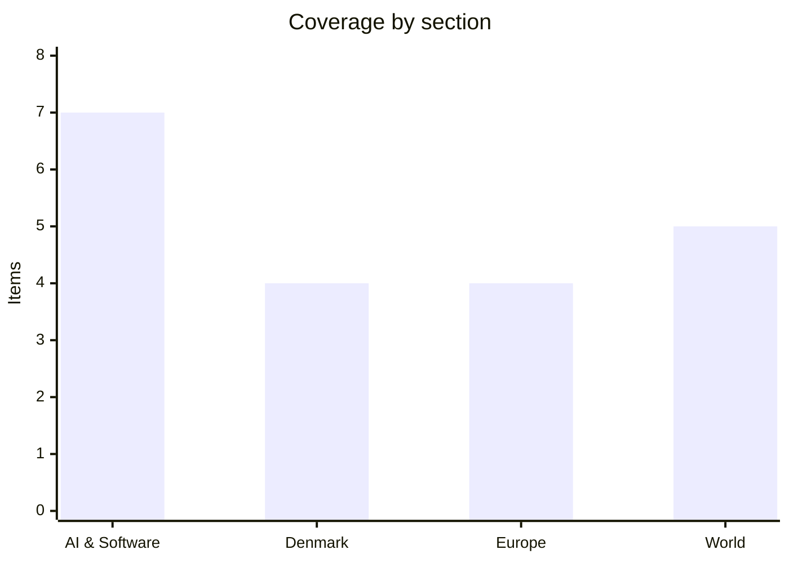

# Daily Briefing — 2026-08-27

**Top line:** Nvidia's quarter came in at $96.2bn with guidance of $108bn for the current one, and on the same call Amazon tripled its GPU order — but the more interesting number of the week is OpenAI's claim that its own inference chip beats Blackwell on performance per watt.

*Note: the last briefing in this series was 23 August, so the follow-ups below cover four days rather than one.*

## Follow-ups

- **Nvidia Q2 FY2027 landed on 26 August and beat the guidance we flagged** — $96.2bn against company guidance of about $91bn ±2% and consensus of $92.2bn. Full item below.
- **Z.ai shipped GLM-5.3-Flash on 26 August, two days ahead of the "around 28 August" window**, under an MIT licence — the delay for cyber-capability hardening did not push it further. Full item below.
- **Bessent's Iran sanctions detail arrived on 24 August as promised**, branded "Operation Economic Outcast" and covering five sectors, but the toughest secondary measures were announced rather than imposed — Bessent said the US is "giving everyone the opportunity to remedy bad behavior."
- **Lars Løkke Rasmussen did chair the UN Security Council food-crisis debate on 25 August** under Denmark's August presidency. Full item below.
- **Canada announced its retaliation on 25 August**: tariffs on C$27.6bn of US goods, dollar-for-dollar. Full item below.
- **Anthropic has still not filed a public S-1.** The confidential draft submitted on 1 June remains the only filing; reporting continues to point at an October Nasdaq listing. Month-end is Monday, so the window we flagged is nearly closed.
- **The five-country return-hubs ministerial in Copenhagen on 4 September is still on**, with Austria, Denmark, the Netherlands, Germany and Greece as the "implementers group."
- **No movement to report on the Danish proposal to stop issuing residence permits to Ukrainians from 14 "less war-affected" regions** — still at the announcement stage from 22 August.

## AI & Software

**Nvidia doubled revenue year on year to $96.2bn and guided to $108bn, and Jensen Huang told analysts to expect roughly 70% growth in fiscal 2028.** Revenue for the quarter ended 26 July was $96.2bn, up 18% sequentially and 106% from a year earlier, against analyst consensus of $92.2bn and the company's own prior guidance of about $91bn ±2%. Non-GAAP earnings came in at $2.22 per diluted share versus expectations in the $2.06–$2.09 range. Data centre revenue was $89bn, up 117% year on year and ahead of the $86.33bn consensus; that division now accounts for 92% of all Nvidia sales, which is the single most concentrated the business has ever been. Gross margin held at 75% for the second consecutive quarter — extraordinary for a hardware company, and the number to watch, because memory and wafer prices are rising and Nvidia has so far absorbed that without passing it through. Guidance for the current quarter is $108bn ±2%, well above the $104.2bn analysts had penciled in. Huang went further on the call and forecast around 70% revenue growth for fiscal 2028, a figure far above street models and one that only holds if the hyperscaler capex cycle does not turn. China data-centre revenue remains booked at zero, so none of this depends on export licences being restored. The bear case has not changed shape: the growth is real, but an increasing share of it is sold to a small number of customers who are themselves funding purchases with debt, and Nvidia's own $6bn Poolside licensing deal and reported Hugging Face approach show it is now recycling cash into the ecosystem that buys its chips. The second reading is that this is simply what a supply-constrained monopoly looks like while demand exceeds it. ([Nvidia investor relations](https://investor.nvidia.com/events-and-presentations/events-and-presentations/event-details/2026/NVIDIA-2nd-Quarter-FY27-Financial-Results/default.aspx), [CNBC](https://www.cnbc.com/2026/08/26/nvidia-nvda-earnings-report-q2-2027-live-updates.html), [Fortune](https://fortune.com/2026/08/26/nvidia-results-q2-earnings/))

**AWS committed to another 2 million Nvidia GPUs for 2027–2028, tripling an order it placed five months ago.** The announcement was made during Nvidia's earnings call and confirmed in a joint press release: AWS will deploy an additional 2 million Blackwell Ultra, Rubin and Rubin Ultra GPUs across its global infrastructure and dedicated AI factories over 2027 and 2028. This comes roughly five months after Amazon agreed to deploy more than 1 million Nvidia GPUs starting in 2026, so the new commitment roughly triples the standing order. Nvidia's Vera CPU is also coming to AWS — Vera is designed for the CPU-side work behind agentic AI and reinforcement learning, functioning both as a host processor for accelerated systems and as a standalone CPU for AI-factory workloads, which is Nvidia's answer to the fact that agentic workloads are bottlenecked on orchestration rather than matrix multiplication. The two companies also said they will build AI factories for the US government, including 100,000 GPUs on secure AWS infrastructure. For a developer audience the Vera piece matters more than the headline number: it signals that the industry now expects agent loops, tool calls and RL rollouts to be a first-class hardware target rather than something you run on whatever host CPU came with the rack. The commercial read is less flattering to Amazon — a company that has spent years building Trainium and Inferentia to reduce Nvidia dependence has just tripled that dependence. The most plausible explanation is that Amazon's own silicon cannot absorb demand fast enough, which is also the implicit argument in OpenAI's chip announcement below. ([Nvidia newsroom](https://nvidianews.nvidia.com/news/aws-and-nvidia-to-deliver-2-million-additional-gpus-and-next-generation-infrastructure-for-agentic-and-physical-ai), [About Amazon](https://www.aboutamazon.com/news/aws/aws-nvidia-2-million-gpus-ai), [TechCrunch](https://techcrunch.com/2026/08/26/amazon-just-tripled-its-order-of-nvidia-chips-over-surging-demand/))

**OpenAI published the first measured benchmarks for Jalapeño, its Broadcom-built inference chip, and claims 1.5–1.9x more work per watt than Nvidia's current racks.** The results were presented at the Hot Chips conference on 25 August, the day before Nvidia's earnings, and measured on InferenceX — a public benchmark from SemiAnalysis that scores the full path of serving a request rather than raw chip throughput, which is the harder and more honest test. OpenAI reports 1.5 to 1.9 times more AI work per watt at peak throughput and 1.7 to 3.6 times lower end-to-end latency than the Nvidia systems it tested. The caveats are substantial and OpenAI states most of them: Jalapeño does inference only, leaving Nvidia's training position untouched; the comparison is against GB200 NVL72 and GB300 NVL72 racks that launched in 2024 and 2025, not the Vera Rubin platform arriving next; and deployment is end-2026 in very small volumes, with meaningful capacity only in 2027. These are OpenAI's own published numbers on a third-party benchmark, not an independent replication. What makes this more than a vendor claim is the direction of travel — Google's TPUs, Amazon's Trainium, Meta's MTIA and now Jalapeño all point at the same conclusion, that inference is where custom silicon closes the gap first because the workload is narrow and power-bound. If that holds, Nvidia's 75% gross margin is defended by training and by the CUDA ecosystem, not by inference volume. Nvidia's stock reaction to its own blowout quarter suggests the market is starting to price that in. ([CNBC](https://www.cnbc.com/2026/08/26/openai-jalapeno-ai-chip-nvidia.html), [Seeking Alpha](https://seekingalpha.com/news/4636641-openais-jalapeno-spices-up-chip-market-as-it-outperforms-nvidias-blackwell))

**Nvidia is reported to have agreed to buy Hugging Face for $12.9bn — the default distribution point for open-weight models.** *(reported, unconfirmed)* Bloomberg reported on 27 August that Nvidia held discussions about acquiring Hugging Face; The Information reported that a deal has been agreed at $12.9bn, and several outlets note it is still being finalised and could still collapse. The sequence started on 24 August, when Business Insider reported that Hugging Face was fielding acquisition interest at a valuation of $13bn or more without naming a suitor. Hugging Face last raised $235m in August 2023 at a $4.5bn post-money valuation, in a round whose investors included Nvidia itself along with Google, Amazon, Salesforce, IBM, Intel, AMD and Qualcomm — so the reported price is close to a tripling in three years. The strategic logic is that Nvidia cannot fabricate a developer community: Hugging Face is where open-weight models, datasets and tooling are published and discovered, and it functions as the GitHub of machine learning. That is also precisely why the deal would be contentious. A neutral registry owned by the dominant accelerator vendor invites questions about model rankings, hardware-specific optimisation defaults and what happens to competitors' inference stacks in the hosting layer. There is no primary confirmation from either company at the time of writing, and Nvidia has not issued a press release, so treat the price and the "agreed" framing as reporting rather than fact. ([Bloomberg](https://www.bloomberg.com/news/articles/2026-08-27/nvidia-discussed-buying-ai-startup-hugging-face-insider-says), [BusinessWorld / Reuters citing The Information](https://bworldonline.com/technology/2026/08/27/772813/nvidia-agrees-to-buy-hugging-face-for-12-9-billion-the-information-reports/), [TechCrunch, 24 Aug](https://techcrunch.com/2026/08/24/hugging-face-reportedly-in-talks-to-be-acquired-for-13b/))

**Z.ai released GLM-5.3-Flash under an MIT licence: 320B parameters, 18B active, natively multimodal, one million tokens of context.** The model went out on 26 August with weights on Hugging Face, two days earlier than the window flagged in Monday's watch list and after a delay Z.ai attributed to hardening against cyber-capability misuse. Architecturally it is a mixture-of-experts model with 320 billion total parameters activating 18 billion per token, a 1,048,576-token context window, and native image and video input rather than a bolted-on vision encoder. Pricing is $0.15 per million input tokens and $0.50 per million output, with a 50% promotional discount running to 9 September that takes it to $0.075/$0.25 — Z.ai claims roughly ten times the cost efficiency of its predecessor, which is a company claim and not independently verified. The model had already been running anonymously on OpenRouter as "Ox Alpha" for about a week before the reveal, a stealth-launch pattern that lets a lab collect real usage data and community benchmarks before the name is attached. The MIT licence is the part that matters commercially: it is more permissive than Meta's Llama community licence and than most Chinese open-weight releases, and it removes the acceptable-use and scale restrictions that make enterprise legal teams nervous. For anyone building agentic tooling, a 320B/18B MoE at $0.075 per million input tokens with a million-token window is close to the price-performance point where you stop routing long-context work to frontier closed models. The strategic reading is that Chinese labs have settled on permissive open weights as the way to take developer mindshare that they cannot take on raw capability. ([Z.ai via SiliconANGLE](https://siliconangle.com/2026/08/26/z-ai-open-sources-ox-alpha-model-as-glm-5-3-flash/), [MarkTechPost](https://www.marktechpost.com/2026/08/26/z-ai-releases-glm-5-3-flash-a-320b-a18b-natively-multimodal-moe-with-a-1m-token-context/amp/), [TestingCatalog](https://www.testingcatalog.com/z-ai-launches-glm-5-3-flash-under-mit-license/))

**Meta agreed to pay up to $16.68bn to settle 29 states' claims that it engineered Facebook and Instagram to addict children — and accepted product changes it has resisted for a decade.** The settlement was disclosed in a court filing on 26 August, mid-trial, with Mark Zuckerberg expected to testify shortly. The states alleged Meta deliberately designed its platforms to be compulsive for minors, misrepresented platform safety to the public, and unlawfully collected personal data from children. The monetary figure is large — some reporting puts the ceiling as high as $18bn depending on how contingent components are counted — but the injunctive terms are the substantive part: a default two-hour daily limit for teen accounts, a mandatory night mode blocking access between midnight and 6am, notifications suppressed during school hours, usage prompts after every 15 minutes of continuous use, stronger age verification, expanded parental controls, hidden like counts on teens' posts, and the disabling of cosmetic-surgery and makeup filters for minors. The trial had already surfaced testimony from Instagram head Adam Mosseri and from current and former employees involved in teen-engagement research, which is likely why Meta settled before Zuckerberg took the stand. For anyone shipping consumer software, the precedent is that engagement-optimising design choices are now legally actionable as product defects rather than protected editorial decisions. The open question is enforcement: default settings can be changed by users, and the agreement's durability depends on compliance monitoring that the filing describes only in outline. ([Forbes](https://www.forbes.com/sites/zacharyfolk/2026/08/26/meta-agrees-to-1668-billion-settlement-in-social-media-addiction-trial/), [NBC News](https://www.nbcnews.com/tech/social-media/meta-settles-social-media-addiction-suit-16-billion-rcna594492), [UPI](https://www.upi.com/Top_News/US/2026/08/26/meta-settlement-social-media-harm-states-attorneys-general/7981787757058/))

**Amazon is shutting Mechanical Turk on 30 September, 21 years after Jeff Bezos called it "artificial artificial intelligence".** Amazon confirmed the closure this week, saying the decision followed an internal assessment of its programs and services; it had already stopped accepting new customers in July. MTurk launched in 2005 as a marketplace for Human Intelligence Tasks — data labelling, transcription, survey completion, and the countless small judgements that software could not yet make — and at its peak had more than 500,000 registered workers. Bezos's framing of it as "artificial artificial intelligence" was a joke that turned out to describe the entire supervised-learning era: much of what looked like machine capability was a human in a low-wage labour market, invisible behind an API. The platform has been in decline for years as Amazon under-invested and as specialised data-labelling firms — Scale AI, Mercor, Prolific — recruited its workers with better pay and task quality. The closing irony is well documented: a 2023 study found that up to 46% of MTurk workers were already using large language models to complete the tasks, meaning the human-labelling marketplace was partly laundering model output back into model training data. For research groups, MTurk's shutdown removes the cheapest and most-cited recruitment channel for behavioural studies, and replication of a large body of social-science work will now be harder and more expensive. The practical deadline is 30 September for anyone with pipelines still running against the API. ([CNBC](https://www.cnbc.com/2026/08/25/amazon-service-that-jeff-bezos-called-artificial-ai-is-shutting-down.html), [TechCrunch, July](https://techcrunch.com/2026/07/05/amazon-will-stop-accepting-new-customers-for-mechanical-turk/))

## Denmark

**Cepos says the government's two-year freeze of tax thresholds takes a larger share of income from working families than from directors — and the government's own package says the opposite.** The mechanism is quiet by design: rather than raising a rate, the government wants to freeze a range of monetary thresholds (beløbsgrænser) in the tax system for two years, so that deductions and brackets do not rise with prices and wages as they normally would. The effect is a real-terms tax increase that never appears as one. DR reported Cepos calculations showing a typical working family — a kindergarten teacher and a painter, say — losing around 0.7% of disposable income, against roughly 0.4% for a high-earning director household, with a two-child working family down about 4,500 kroner a year. Cepos's Mia Amalie Holstein calls it a hidden tax increase hitting a broad segment of the population. The government's counter is that the freeze finances the halving of VAT on food and its complete removal on fruit and vegetables, a package costing 17.4bn kroner annually, and a separate Cepos analysis of the full package finds every family type a net gainer in kroner terms. Both things are true, which is why the fight is over which comparison is honest: the freeze in isolation is regressive in percentage terms, the package as a whole is not. Information's editorial line has been blunter, calling the VAT cut unwise and populist policy. SF, one of the four government parties, has publicly backed the threshold freeze as sensible precisely because it funds the VAT cut. Expect this to be the defining domestic fight of the autumn finance bill. ([DR](https://www.dr.dk/nyheder/politik/regeringens-skattestigning-rammer-arbejderfamilier-haardere-end-hoejtloennede-direktoerer), [Cepos](https://cepos.dk/artikler/effekt-af-regeringsgrundlaget-fordelt-pa-jobtyper-2026-niveau/), [Information](https://www.information.dk/indland/leder/2026/08/regeringens-storstilede-nedsaettelse-foedevaremomsen-uklog-populistisk-politik))

**The expert report that was supposed to unblock 2,055 citizenship applications has slipped to the end of the year, and the government will not say what happens to its working group.** These are applicants who met every formal criterion under the previous naturalisation agreement but were flagged over things they had written on social media, which several parties considered incompatible with Danish citizenship. Three of the four governing parties — Moderaterne, Radikale Venstre and SF — have said publicly that leaving them in limbo is unreasonable; the fourth, the Social Democrats, has not moved. Integration Minister Morten Bødskov's position is that negotiations on new citizenship rules begin only when the expert group's report is complete, and that report, originally due mid-2026, has now been pushed to the end of the year. DR reported this week that the government left open questions about whether and how the working group continues at all. SF and Radikale want the route to citizenship made easier, which puts them against a Folketing majority, so even a completed report does not obviously produce an agreement. The practical effect is that people who cleared the bar as it stood are being held against a bar that has not yet been written — the sort of retroactivity that the Institute for Human Rights has flagged in its statelessness and citizenship monitoring. This was on Monday's briefing as an internal coalition tension; four days later it is a scheduling problem with no end date. ([DR, 2,055 applicants](https://www.dr.dk/nyheder/politik/2-055-ansoegere-til-dansk-statsborgerskab-skaber-interne-spaendinger-i-regeringen), [DR, working group](https://www.dr.dk/nyheder/politik/regeringen-efterlader-tvivl-om-arbejdsgruppe-om-statsborgerskab))

**Løkke chaired the Security Council's signature debate of Denmark's presidency on 25 August, on hunger as a weapon of war.** The high-level open debate was titled "Food under fire: the Security Council's role in mitigating global and local food crises" and was the set-piece event of Denmark's August presidency of the Council. Briefers were Secretary-General António Guterres, Carl Skau — the World Food Programme's acting executive director — and Perrine Benoist, co-CEO of Action Against Hunger, appearing for the Coalition Against Conflict and Hunger. Løkke was in New York on 24–25 August for the session. Denmark used the presidency slot to push Sudan up the agenda specifically, on the argument that the largest humanitarian crisis in the world — 11 million displaced and famine formally declared — receives a fraction of the attention given to Gaza or Ukraine. The underlying legal hook is Resolution 2417 of 2018, which condemned starvation of civilians as a method of warfare and created a reporting obligation the Council has almost never enforced. A signature debate is not a decision, and the Council's structural problem is unchanged: the states most often accused of restricting food access are protected by vetoes or by allies who hold them. What Denmark gets from it is agenda-setting and the diplomatic capital of having run a competent presidency, which it will spend on the return-hubs ministerial in Copenhagen on 4 September. ([Kristeligt Dagblad](https://www.kristeligt-dagblad.dk/danmark/loekke-leder-moede-i-fns-sikkerhedsraad-med-fokus-paa-konflikt-og-sult), [Security Council Report](https://www.securitycouncilreport.org/whatsinblue/2026/08/conflict-and-food-insecurity-high-level-open-debate-2.php), [The Copenhagen Post](https://cphpost.dk/2026-08-24/news/politics/lokke-chairs-unsc-meeting-on-conflict-and-hunger/))

**Copenhagen University is putting 110m kroner into AI in teaching and has created a vice-rector post for it, filled by an anthropologist.** *(reported via TV 2's short-news roundup; KU has not issued a standalone English release)* Morten Axel Pedersen takes up the newly created role of viceprorektor for kunstig intelligens on 1 September for a three-year term. He is a professor of anthropology and social data science whose research covers digital sovereignty, AI governance and human–AI interaction — a deliberate choice over a computer scientist, and the most informative detail in the announcement. The 110m kroner is earmarked for strengthening the use of AI in teaching and for producing new knowledge about what AI does to and in society, rather than for compute or model development. The context is that Danish universities have spent two years reacting to generative AI through assessment policy — rewriting exam rules, restricting take-home assignments, arguing about detection — and this is the first large Danish institutional commitment framed as adoption rather than containment. KU already runs CAISA, a national centre for responsible AI, so the infrastructure to spend it on governance research exists. The obvious risk is that 110m kroner spread across a university of KU's size buys pilots rather than change, and the announcement does not say how it is allocated between faculties. For Danish employers hiring graduates over the next three years, the more consequential question is whether this shifts what students are actually allowed to do with these tools in their coursework. ([TV 2 Kort nyt](https://nyheder.tv2.dk/live/kort-nyt), [KU AI portal](https://ai.ku.dk/))

## Europe

**Ukraine destroyed a 100,000-square-metre Wildberries logistics hub and set Russia's fourth-largest refinery alight in the same night, killing three.** The overnight strikes into 26 August hit the Wildberries distribution centre in Kotovsk, Tambov region, roughly 500km southeast of Moscow — Tambov governor Yevgeny Pervyshov said the facility was "completely destroyed by fire," with about 100,000 square metres ablaze, the equivalent of fourteen football pitches. Two people were hurt there: a 19-year-old man with concussion and a 49-year-old woman with a broken finger. It is the second strike on that same Wildberries facility in just over a month, which is the detail that makes this a campaign rather than an incident. Separately, the Ukrainian General Staff confirmed a strike on Lukoil's NORSI refinery at Kstovo in Nizhny Novgorod oblast — Russia's fourth-largest refinery and second-largest petrol producer, processing 15–17 million tonnes of crude a year, and a target Ukraine has now hit repeatedly through 2026, including in April, May, June and July. Two people were killed and two wounded in Lipetsk region when a drone came down on a house. Zelensky said Ukraine struck 16 targets across Russia over the preceding day, covering both oil and logistics. The strategic logic follows Monday's briefing: after the double-tap strike on the Kryvyi Rih shopping centre, Kyiv has extended deep strikes from military and energy infrastructure into Russian civilian commercial logistics, which is a deliberate widening of what counts as a target and will be argued over accordingly. ([The Moscow Times](https://www.themoscowtimes.com/2026/08/26/3-killed-in-russia-as-ukraine-sets-wildberries-warehouse-and-oil-refinery-ablaze-a93577), [Kyiv Independent](https://kyivindependent.com/major-russian-oil-refinery-in-flames-after-drone-strike-locals-say/), [Al Jazeera](https://www.aljazeera.com/economy/2026/8/26/ukrainian-drone-attacks-kill-3-as-fire-destroys-wildberries-warehouse))

**Slovak police foiled an arson attack on a Ukrainian drone factory using a gasoline-and-polystyrene mixture they described as napalm.** Three foreign nationals — two Latvian citizens and one Ukrainian — have been charged with preparing the attack on the Skyeton plant in eastern Slovakia, which was to have been carried out on 25 August. Two were detained in Slovakia; the third was picked up by German authorities on a European Arrest Warrant issued in what Slovak police called an exceptionally short time. Investigators seized the incendiary mixture and associated equipment, and said the fire could have caused tens of millions of euros of damage and endangered roughly 70 people working in the building. Police say the suspects acted "on commission" but have not named who commissioned it, which is the standard formulation in this class of case and usually the last thing established. Skyeton makes long-range reconnaissance drones for Ukraine and moved production into Slovakia partly to get it out of Russian missile range. This is one of the first known attempts to hit a defence manufacturer on Slovak soil, and it fits a pattern that European security services have tracked since 2022: sabotage and arson against industrial and logistics targets across the EU, carried out by recruited low-level operatives rather than intelligence officers, which keeps attribution deniable and prosecutions confined to the people caught holding the petrol. The political awkwardness is local — Robert Fico's government has been among the least hawkish on Russia in the EU, and it is now prosecuting a Russia-linked sabotage case. ([EUobserver](https://euobserver.com/233724/slovak-drone-factory-narrowly-escapes-russian-linked-napalm-arson-attack-as-police-arrest-three-foreign-suspects/), [The Slovak Spectator](https://spectator.sme.sk/politics-and-society/c/news-digest-slovakia-foils-attack-on-ukrainian-drone-factory), [Kyiv Independent](https://kyivindependent.com/slovak-police-thwart-arson-plot-targeting-ukrainian-drone-factory-media-reports/))

**Four EU economies have paid nearly €41bn extra for the same fossil fuels since March, and gas storage is 16 points below its five-year average heading into winter.** Analysis reported by Euronews on 26 August puts the additional cost at €12.7bn for Italy, €11.5bn for the Netherlands, €10.8bn for France and €8.8bn for Spain over March to August — money spent without importing a single additional unit of energy, purely on price. LNG has risen 60% in the Atlantic basin and 75% in the Pacific, and diesel and petrol are up 59% since the US and Israeli campaign against Iran began on 28 February. The structural exposure is that the Strait of Hormuz normally carries almost a fifth of global LNG trade and up to 40% of the EU's imports of refined products such as diesel and jet fuel, so the disruption hits Europe twice — once on gas and once on the middle distillates that move freight. EU gas storage stood at 62.99% full at the end of 24 August against a five-year average of 79%, and the bloc entered 2026 with 46 billion cubic metres in store versus 60 bcm in 2025 and 77 bcm in 2024. That is the number that decides whether this is an expensive year or a rationing one. Eurozone inflation was 2.9% in July with the energy component at 10.3%, and Christine Lagarde has warned that the longer energy prices stay elevated the more they feed through to core via second-round effects. There was one piece of relief: TTF gas fell more than 2% on 27 August on reports of the Iran–Oman transit corridor. Six member states — Germany, Italy, Austria, Poland, Portugal and Spain — take a windfall tax on oil profits to EU finance ministers in Dublin next month. ([Euronews, €41bn](https://www.euronews.com/my-europe/2026/08/26/eu-countries-face-nearly-41bn-in-extra-fossil-fuel-costs-as-hormuz-crisis-exposes-energy-v), [Euronews, gas prices](https://www.euronews.com/business/2026/08/26/europes-gas-prices-are-surging-who-will-be-the-first-to-pay-more), [ECB blog](https://www.ecb.europa.eu/press/blog/date/2026/html/ecb.blog20260727~1212bdb8f9.en.html))

**The Commission has told UPM and Sappi their €1.42bn graphic-paper joint venture looks anti-competitive.** Brussels sent a Statement of Objections on 26 August setting out its preliminary view that the proposed venture between UPM-Kymmene and Sappi would restrict competition in communication paper — the stock used for magazines, catalogues and books. The two are the largest producers of communication paper in the European Economic Area, and the Commission's specific concern is that the combined entity would gain enough market power in coated mechanical paper and coated woodfree paper to raise prices and let quality slip. UPM and Sappi had argued that consolidation is necessary in a structurally declining market — graphic paper demand in Europe has fallen for well over a decade as print migrated online — and that pooling assets delivers cost, environmental and resilience benefits. The Commission says it is not currently convinced those efficiencies offset the harm, which is the standard formulation but a meaningful one at this stage. UPM said it is reviewing the objections and will respond in due course, and remains confident it can address the concerns. A Statement of Objections is not a prohibition; the usual path from here is remedies, typically divestment of specific mills, and the parties have the right to reply and request an oral hearing. The wider point is that "our industry is dying so let us merge" has not been accepted as a defence — the Commission's position is that declining markets still have customers entitled to competitive pricing. ([European Commission](https://ec.europa.eu/commission/presscorner/detail/en/ip_26_1747), [PaperAge](https://www.paperage.com/2026news/08-26-2026upm-receives-european-commissions-statement-of-objections.html))

## World

**Rubio says no new US strikes on Iran "for the time being", and Iran and Oman have proposed a joint temporary shipping channel through Hormuz.** Secretary of State Marco Rubio told foreign counterparts on 26 August that the US does not expect to launch new strikes for now and will concentrate on economic pressure instead — the clearest de-escalatory signal since the campaign began on 28 February. In testimony to the Senate Foreign Relations Committee, Rubio said Iran had "mined large segments of Hormuz — international waters". Trump said the US Navy has cleared all mines from the main shipping lane and warned that any vessel laying new ones would be "immediately and systematically destroyed". Iran and Oman jointly outlined a proposal on Tuesday for a phased framework to establish a temporary shipping channel and to clear mines together, after weeks of difficult talks between them. The practical picture is less settled than the rhetoric: the UK Maritime Trade Operations agency reported no confirmed attacks over a 48-hour window but kept its warning about drifting and uncharted mines, with mine danger areas still active, and more than 80% of liquid cargo over the past fortnight has taken the Omani route — a UN-authorised channel Iran objects to. Meanwhile the economic track hardened: Bessent's 24 August "Operation Economic Outcast" sanctioned nearly 60 entities, individuals and vessels across the UAE, Hong Kong, China, Singapore and Switzerland, targeting digital assets, technology, gold, aviation and shipping, though the measures were announced with a grace period rather than imposed. China criticised the package and Tehran was publicly defiant. Whether this is genuine de-escalation or a pause while sanctions bite is the open question. ([CNN live, 26 Aug](https://www.cnn.com/2026/08/26/world/live-news/iran-war-trump), [Al Jazeera on mine risk](https://www.aljazeera.com/news/2026/8/26/why-hormuz-remains-high-risk-for-ships-despite-us-claims-of-mine-clearing), [NPR on sanctions](https://www.npr.org/2026/08/24/g-s1-139743/treasury-secretary-scott-bessent-to-unveil-new-economic-sanctions-on-iran))

**A gang attack on Kenscoff killed 47 people and took more than 50 hostages, the largest mass kidnapping in Haiti in years.** Armed men attacked the hilltown of Kenscoff, above Port-au-Prince, earlier this week — reports differ on whether the assault began Sunday 23 or Monday 24 August — killing at least 47 people and abducting more than 50. A gang leader has since posted a video threatening Vladimir Paraison, the director of Haiti's National Police, saying "Paraison, if any of our soldiers are hurt, I will kill all of them," referring to the hostages. Kenscoff matters symbolically because it was one of the few areas around the capital still considered relatively safe; it sits above the city and had largely escaped the gang control that has consumed Port-au-Prince since 2024. The attack punctures the working assumption of the past year that Haitian security was slowly improving under the Kenya-led multinational support mission, and it demonstrates that gangs can now mount coordinated operations outside their established territory. Mass abduction on this scale is also a tactical shift: kidnapping in Haiti has historically been individual and transactional, and taking fifty hostages as leverage against police operations is closer to insurgency than to extortion. The hostages' status is unknown at the time of writing and casualty figures come from Haitian authorities and local reporting rather than an independent count. ([NPR](https://www.npr.org/2026/08/26/nx-s1-5944787/50-kidnapped-haiti-gang-attack-47-dead), [Washington Times](https://www.washingtontimes.com/news/2026/aug/25/50-kidnapped-violent-gang-attack-haiti-leaves-47-dead/))

**Fourteen newborns died in a nursery fire at Islamabad's main government hospital; officials blame an air-conditioning compressor.** The fire broke out at around 6:45am on 26 August on the third floor of the Mother and Child Centre at the Pakistan Institute of Medical Sciences, the capital's largest public hospital. At least 15 newborns were in the nursery; 14 died and one was rescued. Officials say an air-conditioning compressor exploded inside the nursery. The blaze was confined to the nursery within the gynaecology ward and the rest of the hospital was unaffected, with no other injuries reported. Within hours the Islamabad district magistrate appointed a multi-agency fact-finding committee and ordered it to report within 24 hours, covering the cause, the spread, whether adequate fire-safety measures were in place, and the emergency response. Al Jazeera's reporting from the scene describes families' anger centred on accounts that the nursery doors were locked, which — if the inquiry confirms it — moves this from an electrical accident to a preventable-death case. Pakistan has a long record of fatal building fires traced to non-existent or unenforced fire codes, and public hospitals are among the worst-maintained infrastructure in the country. A 24-hour reporting deadline is fast enough to look responsive and short enough that it is unlikely to produce a serious technical finding; the question is whether anything follows it. ([Al Jazeera](https://www.aljazeera.com/news/2026/8/26/at-least-15-newborns-killed-in-pakistan-hospital-fire), [CNN](https://www.cnn.com/2026/08/26/asia/pakistan-newborns-hospital-fire-intl-hnk), [NPR](https://www.npr.org/2026/08/26/nx-s1-5944808/hospital-nursery-fire-kills-14-newborns-pakistan))

**Canada has hit back with tariffs on C$27.6bn of US goods — and Carney is already signalling he may abandon dollar-for-dollar matching.** Ottawa announced retaliatory tariffs on 25 August covering about C$27.6bn (roughly $19.9bn) of American goods including steel and dairy, a direct mirror of the 50% US tariffs on about $20bn of Canadian exports that took effect just after midnight on Saturday 22 August. That was the escalation flagged in Monday's briefing. What is new is Carney's framing: he said this week that Canada may need to move away from matching the US dollar for dollar and toward targeted retaliation designed to protect specific Canadian workers and industries, after Trump threatened a further 50% tariff on cars, trucks, auto parts and steel to take effect on New Year's Day. Carney has called the US measures "a miscalculation" and said publicly that Canada is economically "at war" with the United States, adding that "an attitude at the negotiation table that Canada is a subsidiary of the United States is not something we're going to accept." The strategic problem for Ottawa is arithmetic: Canada sends roughly three-quarters of its exports to the US and cannot match escalation symmetrically without doing more damage to itself than to the target, which is exactly why the dollar-for-dollar posture is being reconsidered. The auto threat is the real leverage — an integrated North American vehicle supply chain cannot absorb a 50% border tax at either end without shutting lines on both sides. ([CNBC](https://www.cnbc.com/2026/08/25/canada-trump-tariffs-trade-carney-leblanc.html), [France 24](https://www.france24.com/en/americas/20260825-canada-strikes-back-trump-with-retaliatory-tariffs-us-trade-war-escalates), [NBC News](https://www.nbcnews.com/business/economy/trump-canada-tariffs-carney-rcna593510))

**The State Department has paused immigrant visa appointments at every US embassy and consulate worldwide, with no end date.** The pause was announced on 26 August and applies globally, but only to immigrant visas — the permanent-residence track. Tourism, study, business and temporary-work visas are unaffected. The stated reason is training: consular officers are to be retrained to evaluate applicants "comprehensively and consistently," with particular focus on whether an applicant is likely to become a "public charge", meaning dependent on public benefits. No resumption date was given; a State Department official speaking anonymously said it could be several weeks depending on the post. Applicants with interviews already booked are reportedly receiving rescheduling notices with new dates to follow. The public-charge test is not new — it has existed in US immigration law since the nineteenth century — but its scope has swung sharply between administrations, and a global pause to retrain every consular officer on it signals a substantially broader application than the current standard. The practical effect is an immediate, indefinite halt to family reunification and employment-based green card interviews worldwide, on top of processing backlogs that already run to years at many posts. Whether this is administrative or a de facto slowdown by another name will be visible in the approval rates once appointments resume. ([Washington Post](https://www.washingtonpost.com/immigration/2026/08/26/state-dept-pauses-immigrant-visa-appointments-worldwide-says-staff-need-training/), [The National](https://www.thenationalnews.com/news/us/2026/08/26/us-visa-appointments-paused/), [Boundless](https://www.boundless.com/blog/immigrant-visa-appointments-paused-worldwide))

## Watch list

- **Friday 28 August:** Eurostat flash estimate season begins for August euro-area inflation, the first read on whether the 10.3% energy component is peaking; Klimafolkemødet runs in Middelfart through Saturday 29 August.
- **Monday 31 August:** month-end, the outer edge of the window in which Anthropic's public S-1 had been expected; still nothing filed.
- **Early September:** the five-country return-hubs ministerial in Copenhagen on 4 September, chaired by Denmark; EU finance ministers meet informally in Dublin, where six member states will table the oil windfall tax; Z.ai's GLM-5.3-Flash promotional pricing ends 9 September.
- **30 September:** Amazon Mechanical Turk shuts down — hard deadline for anyone with live pipelines against the API.
- **Unconfirmed:** the reported Nvidia–Hugging Face acquisition at $12.9bn, which multiple outlets say is still being finalised and could collapse; neither company has confirmed it.
