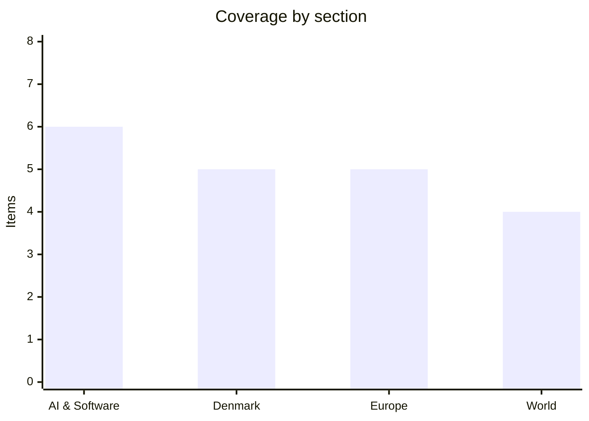

# Daily Briefing — 2026-08-27

**Top line:** The CIA director flew to Moscow unannounced on Monday, and the message was reportedly a warning not to attack the Baltics — which lands the same week US intelligence tied the explosive drone found at Leipzig airport to Russian military intelligence.

*Note: the last briefing in this series covered 23 August, so the follow-ups below span four days rather than one.*

## Follow-ups

- **Nvidia's Q2 FY2027 landed on 26 August and beat guidance** — $96.2bn against company guidance of about $91bn ±2%. Full item below, with the parts of the earnings call that matter more than the headline.
- **Bessent's Iran sanctions arrived on 24 August** as "Operation Economic Outcast", blacklisting more than 60 Iran-linked targets across shipping, oil, crypto, gold and aviation — but pointedly not the large Chinese banks that clear Iranian oil payments. Bessent, asked why: "Why would I want to blow up the global financial system?"
- **Z.ai shipped GLM-5.3-Flash on 26 August under an MIT licence**, two days ahead of the flagged window — and was simultaneously unmasked as the lab behind "Ox Alpha", the anonymous 1M-context coding model that had been running on OpenRouter for over a week while developers routed proprietary source through an unattributed endpoint.
- **Anthropic has still not filed a public S-1.** The confidential draft from 1 June remains the only filing, and month-end is Monday. What did emerge is the pitch: a reported $30tn total addressable market. Full item below.
- **Løkke chaired the UN Security Council's food-crisis debate on 25 August** under Denmark's August presidency, as scheduled.
- **Canada retaliated early.** Rather than waiting for 8 September, Carney announced measures on 25 August covering C$27.6bn of US goods — 50% duties on American steel, aluminium, dairy, furniture, clothing, games consoles and smartphones.
- **The five-country return-hubs ministerial in Copenhagen on 4 September is still on**, with Austria, Denmark, the Netherlands, Germany and Greece as the "implementers group".

## AI & Software

**Nvidia posted $96.2bn and guided to $108bn, but the two numbers that matter from the call are $1.3 trillion and "extreme pricing conditions in memory".** Revenue for the quarter ended 26 July was $96.2bn, up 106% year on year against consensus of $92.2bn; net income was $59.7bn, up 126%, on a 66% operating margin. Data centre revenue was $89bn, up 117%, and now accounts for 92% of all Nvidia sales — the most concentrated the business has ever been. Guidance for the current quarter is $108bn ±2% against a $104.2bn consensus, and that guide assumes *zero* data-centre revenue from China, so none of it depends on export licences being restored. CFO Colette Kress told analysts that capex among the top five hyperscalers will rise to $1.3 trillion next year from $800bn in 2026, which is the clearest quantification yet of the buildout — and of the concentration risk sitting under Nvidia's revenue. She also guided gross margin *down* to 71–72% by Q4 FY27, saying "we are experiencing extreme pricing conditions in memory. The magnitude of the price increase has exceeded our prior expectations and is headed even higher into next year", and noting that memory scarcity is being driven in large part by the AI buildout itself. Two commitments deserve reading carefully: the $100bn OpenAI arrangement is a letter of intent carrying explicit risk language — "there is no assurance that we will enter into definitive agreements" — and Nvidia's roughly $10bn investment in Anthropic remains "subject to certain closing conditions", i.e. not closed. Huang guided fiscal 2028 growth to "at least 70%" against a street consensus nearer 44%, which implies something like a $432bn annual run rate. Kress pre-empted the obvious criticism of the $500bn of third-party capital circulating through the ecosystem: "we know some will call this circular financing. We see it differently." The market's reaction — shares up roughly 4% after hours on a comprehensive beat — suggests investors are no longer paying up for good news, which is itself the signal. ([Nvidia press release](https://www.globenewswire.com/news-release/2026/08/26/3351702/0/en/nvidia-announces-financial-results-for-second-quarter-fiscal-2027.html), [CNBC](https://www.cnbc.com/2026/08/26/nvidia-nvda-earnings-report-q2-2027-live-updates.html))

**Meta secretly planned to shrink teams by up to 60% and replace them with AI agents, then killed the plan when the agents did not work.** Reuters published a special report on 26 August describing "Project OT", an internal programme to reduce many Meta teams by as much as 60% and leave small "talent-dense" groups of humans supervising fleets of virtual AI workers. Zuckerberg halted the second wave — planned for November — on the evening of 19 May 2026, hours before the first round of layoffs was due to go out. Reuters attributes the collapse to three causes: the agent technology never delivered the expected productivity gains, investors criticised the AI budget, and the workforce openly revolted. The revolt had a specific trigger: employees came to believe that tracking software logging their mouse clicks and keystrokes was training their own replacements. Internal employee-sentiment scores fell 19 points and labour-organising efforts grew. Meta has not confirmed the codename or the plan, so treat the detail as Reuters' sourcing rather than established fact. What makes this the most useful AI story of the week is that it is the first named, dated, internally-documented account of frontier agents failing a substitution test at scale — from the company with the strongest commercial incentive to prove the opposite. It is worth reading directly against Anthropic's IPO pitch below, which asks investors to price the total addressable market as the whole of human labour. Both cannot be right, and the interesting question is over what timeframe. *(reported, unconfirmed)* ([Reuters via Globe & Mail](https://www.theglobeandmail.com/business/article-zuckerberg-meta-staff-replace-ai/), [The Decoder](https://the-decoder.com/employee-revolt-and-failing-agents-forced-meta-to-scrap-its-ai-layoff-plan/), [Engadget](https://www.engadget.com/2244816/meta-reportedly-abandoned-an-ai-focused-restructuring-plan/))

**Anthropic will reportedly tell IPO investors its addressable market exceeds $30 trillion — bigger than the number SpaceX used, and roughly 40% of the entire US stock market.** The Wall Street Journal reported on 25 August that Anthropic is expected to put a figure above $30tn in front of investors, against the $28.5tn SpaceX claimed at its June 2026 listing. The methodology is the tell: it is not the software market but the full scope of *work* that could be performed by models — labour, not licences. Anthropic's Q2 2026 revenue was $11.6bn, more than double a year earlier, and one analysis notes the company's own revenue forecast requires capturing only about 0.65% of that TAM. Reported deal parameters have drifted upward through the summer, from a $60–75bn raise at a $1.75–1.8tn valuation in July to as much as a $100bn raise at roughly $2tn now; the higher pair is the less-corroborated one. Goldman Sachs, JPMorgan and Morgan Stanley are leading, with a Nasdaq listing targeted for October and a prospectus expected shortly. CNBC reported on 21 August that the prospectus will explicitly list "AI backlash" as a risk factor. Fortune's framing is the one worth holding on to: $30tn is roughly equal to US GDP. The number will anchor not just this listing but the market's valuation of every other lab, and it shifts the sell-side story decisively from software TAM to labour TAM — which is exactly the claim Project OT just failed to validate. *(reported, unconfirmed — Anthropic has not published the figure)* ([WSJ](https://www.wsj.com/tech/ai/anthropic-expected-to-tell-investors-it-sees-over-30-trillion-in-potential-revenue-a611efea), [Fortune](https://fortune.com/2026/08/26/anthropic-wants-investors-to-believe-its-market-is-worth-30-trillion-nearly-40-of-the-entire-us-stock-market/))

**Nvidia is closing in on a $12.9bn acquisition of Hugging Face, and still nobody has confirmed it.** TechCrunch's 26 August headline is "Nvidia closes in on Hugging Face acquisition"; The Information reported an agreed price of $12.9bn; Bloomberg confirmed discussions took place. Nvidia has issued no press release, did not respond to comment requests, and multiple outlets note the deal could still fall apart. The sequence began on 24 August when Business Insider reported Hugging Face fielding interest at $13bn or more without naming a suitor. Hugging Face last raised $235m in August 2023 at a $4.5bn post-money valuation, in a round that included Nvidia itself alongside Google, Amazon, Salesforce, IBM, Intel, AMD and Qualcomm — and the company reportedly rejected a $500m Nvidia investment last year at a $7bn valuation, which makes the current price close to a doubling in twelve months. The strategic logic is that Nvidia cannot manufacture a developer community: Hugging Face is where open-weight models, datasets and tooling are published and discovered, and functions as the GitHub of machine learning. That is precisely why it would be contentious. A neutral registry owned by the dominant accelerator vendor raises immediate questions about model rankings, hardware-specific optimisation defaults, and what happens to competing inference stacks in the hosting layer. Treat the price and the "agreed" framing as reporting, not fact. *(reported, unconfirmed)* ([TechCrunch](https://techcrunch.com/2026/08/26/nvidia-closes-in-on-hugging-face-acquisition/), [Bloomberg](https://www.bloomberg.com/news/articles/2026-08-27/nvidia-discussed-buying-ai-startup-hugging-face-insider-says))

**A German broker has connected a regulated brokerage to ChatGPT, Claude and Grok over MCP — and disclaimed responsibility for what they do with it.** Scalable Capital announced "Agentic Investing" on 25 August, letting customers connect their brokerage account to a supported AI assistant via the Model Context Protocol; the model receives a tool set mapped to Scalable's API, so "buy 10 shares of Siemens" becomes a tool call that executes. Launch functions cover executing trades, setting up savings plans, managing watchlists and creating price alerts. Scalable has more than one million clients and over €60bn in assets, and describes this as a European first for a bank opening its platform to mainstream assistants. Fortune reported on 26 August that in one internal test Claude beat human traders 76% of the time, which is a company-supplied figure over an unstated sample and period, and should be read as marketing. The genuinely notable part is the liability posture: Scalable says connected third-party AI apps "operate independently and outside its control" and that outputs do not constitute investment advice. A regulated broker has built an interface and then disclaimed responsibility for actions taken through it — so if a model mis-parses a prompt and liquidates a portfolio, who pays is unresolved. It arrives alongside Binance's Agent OS, Google's Agent Payments Protocol and the AI AGENT Act in Congress, so the regulatory attention is coming. For anyone designing tool-call authorisation, this is now the highest-stakes MCP deployment in production. ([Scalable Capital](https://de.scalable.capital/en/agentic-investing), [Reuters](https://www.reuters.com/business/finance/german-broker-scalable-opens-investment-platform-major-ai-chatbots-2026-08-25/), [Fortune](https://fortune.com/2026/08/26/scalable-capital-claude-chatgpt-traders-bank-invest/))

**Okta has made AI agents first-class identities in its directory, free, for 20,000 customers.** Agent SSO went generally available on 24 August, bringing the open Cross App Access standard into Okta's core single sign-on product at no additional cost. Agents using XAA can be registered as identities in Okta's Universal Directory, assigned policies, and issued short-lived tokens rather than running on hard-coded credentials or broad standing access. XAA is an extension of OAuth and has been incorporated as the Enterprise-Managed Authorization extension for the Model Context Protocol, which is what makes it more than a vendor feature. Okta's own supporting statistic is that only 34% of organisations apply the same identity and security controls to agents as to human employees — a gap that will look indefensible the first time an agent with a personal API key does something expensive. The coverage caveat is real: this governs XAA-compatible agents, not every agent, and adoption depends on tool vendors implementing the standard. It lands in a cluster of similar infrastructure — Cloudflare's WriteGuard private beta for controlling what MCP agents may *modify* rather than merely read, and AWS Bedrock AgentCore Payments reaching GA. Credential sprawl is the biggest unsolved operational problem in agent deployment, and bundling the structural fix free into the default SSO tier is an aggressive attempt to set the standard before anyone else does. ([Okta newsroom](https://www.okta.com/newsroom/press-releases/okta-brings-first-class-identity-to-ai-agents-with-agent-sso/), [SecurityBrief](https://securitybrief.com.au/story/okta-launches-agent-sso-to-manage-enterprise-ai-agent-access))

## Denmark

**The government has almost doubled its growth forecast: Danish GDP is now seen expanding 3.7% in 2026, and an expected 11bn kroner deficit has become an expected 39bn kroner surplus.** The Økonomisk Redegørelse is published today by skatte- og vækstminister Jakob Engel-Schmidt (M); TV 2 obtained it in advance on Wednesday evening. The 3.7% figure compares with 2.2% in the December edition, and would be among the highest growth rates in Europe. The drivers named are strong exports from the largest companies, rising employment and significant real-wage growth — which is to say Novo Nordisk and the pharmaceutical complex are still carrying an unusual share of the national accounts. Danmarks Statistik reinforced the picture this morning with June employment figures: 3,091,300 people in paid work, up 3,600 on May and 34,400 year on year, and up more than 300,000 over five years. Arbejderbevægelsens Erhvervsråd went further on 18 August with a 4.2% forecast after Danmarks Statistik revised 2023–25 growth upward. The political consequence is the interesting part: TV 2's business analyst expects the government to expand the økonomiske råderum by several billion kroner, which matters because a politically prioritised 2027 finance bill is still owed before the Folketing opens in the first week of October — only a technical FFL2027 was tabled in August because of the election. More room makes the 17.4bn kroner food-VAT pledge easier to finance, and that pledge is the government's most contested promise. The counter-argument, which the critics will make, is that an economy already at record employment does not obviously need fiscal expansion. Note the deficit-to-surplus figures come from TV 2's advance reporting rather than the published document. ([TV 2](https://nyheder.tv2.dk/business/2026-08-26-ny-redegoerelse-viser-dansk-oekonomi-i-topform-erfarer-tv-2), [AE Rådet](https://www.ae.dk/prognose/2026-08-prognose-danmark-har-udsigt-til-historisk-hoej-vaekst-i-2026))

**The Folketing votes today to close the residence route for Ukrainian men of military age, affecting a group of about 9,300.** The bill amends the særlov for ukrainere — in force since March 2022 — so that Ukrainian men aged 23 to 60 who fall under Ukraine's mobilisation rules can no longer obtain residence in Denmark outside the ordinary asylum system. As of 1 May 2026, roughly 9,300 men in that age bracket held or had held særlov permits and remain registered as resident; the ministry cannot say how many are actually liable for service. The change applies only to applications submitted after 25 June 2026, the tabling date, so it covers new arrivals and renewals rather than existing permit holders. Immigration minister Morten Bødskov (S) framed it plainly: "det er ikke meningen, at vores opholdsregler skal bruges til at undgå mobilisering til det ukrainske forsvar." The EU tightened its own rules from 30 July, requiring new temporary-protection applicants to document that they have met Ukrainian military obligations; Denmark sits outside those rules because of the retsforbehold but is aligning voluntarily. At first reading the bill was backed by the government parties plus DF, Liberal Alliance, Konservative and Danmarksdemokraterne, with Venstre "positivt indstillede" and Enhedslisten the only party present opposing. This is a separate measure from the proposal on 14 "less war-affected" regions announced on 22 August, though the direction is the same — and on Wednesday five Jutland mayors publicly contradicted the government's stated justification that municipalities are under too much pressure. ([Ritzau via Tidende](http://tidende.dk/ind-og-udland/erhverv-politik/lov-lukker-for-ophold-til-militaerpligtige-ukrainske-maend/404426), [Copenhagen Post](https://cphpost.dk/2026-08-27/news/round-up/big-drop-in-hours-with-negative-electricity-prices/))

**Denmark passes the spiralsagen compensation law today — and Greenland publishes reports tomorrow on legal responsibility and whether the IUD campaign was genocide.** The bill, introduced by sundheds- og kirkeminister Ida Auken (S) on 25 June, awards 300,000 kroner to Greenlandic women fitted with intrauterine devices without consent, with roughly 4,500 women estimated eligible and applications handled by Patienterstatningen. A September 2025 report documented at least 4,070 cases of IUDs inserted from the 1960s onward across three decades, many in teenagers. The government reversed course on Wednesday and added an appeals route by amendment, so rejections from Patienterstatningen can now be challenged administratively — a change Auken supports and which addresses the loudest criticism of the original bill. The law is expected to take effect on 1 September. What turns this from an administrative story into a political one is the timing: Greenland's government publishes two reports on Friday 28 August, one on legal responsibility and one on whether the practice constituted genocide, according to Greenlandic minister Mariane Paviasen Jensen. Mette Frederiksen said on Wednesday it was "totally a coincidence" that the compensation law passes the day before. Former Naalakkersuisut chair Múte B. Egede called the campaign genocide in 2024, and Frederiksen apologised in Greenland in September 2024 — so the word is not new, but a formal government finding would be. Friday's publication is the most consequential Danish news event of the next 48 hours, arriving into a Denmark–Greenland relationship already strained by the Trump administration's interest in the island. ([DR](https://www.dr.dk/nyheder/indland/groenland/regeringen-aabner-alligevel-klageadgang-i-spiralsag), [Kristeligt Dagblad](https://www.kristeligt-dagblad.dk/danmark/mette-f-forsvarer-vedtagelse-af-godtgoerelse-foer-rapporter-om-spiralsag))

**Søren Gade will vote against his own party on the Green Tripartite fertiliser law, as DF tries to turn nitrogen regulation into a food-price fight.** The gødskningslov, which tightens rules on how farmers may fertilise in order to cut nitrogen leaching into Danish waters, goes to a final vote on Thursday 3 September and takes effect on 1 January 2027. On Wednesday evening TV Midtvest obtained an email Gade sent to his West Jutland party base saying he cannot support "et lovforslag, som er tåbeligt og uden sagligt grundlag, og som river tæppet væk under landmænd og landdistrikter" — a public break by one of Venstre's heaviest figures, on a bill Venstre, Konservative and Liberal Alliance all backed at first reading on 13 August. Venstre deputy group chair Thomas Danielsen confirmed members may vote their conscience but warned that voting against means losing influence. Earlier the same day DF leader Morten Messerschmidt called on the whole blue bloc to vote no, citing Berlingske's reporting of expert warnings on prices; Aarhus University agroecology professor Peter Sørensen argued the bill works against the government's own self-sufficiency ambition because "danske grøntsager bliver dyrere, og efterhånden vil man købe grøntsager fra udlandet". Minister Christian Rabjerg Madsen (S) declined to predict the price effect and has asked the law's expert committee to double-check the technical basis. The Green Tripartite parties earmarked 1.23bn kroner in 2027 to balance costs and compensation for agriculture. The tactical read is that DF has found the seam between the government's environmental commitments and its food-price agenda, and several Central and West Jutland farming associations have already paused their Green Tripartite work over the nitrogen rules. ([Ritzau/TV Midtvest via Tidende](http://tidende.dk/ind-og-udland/erhverv-politik/soeren-gade-gaar-imod-partilinje-og-vil-stemme-nej-til-goedskningslov/404405), [Ritzau/Berlingske via Tidende](http://tidende.dk/ind-og-udland/erhverv-politik/messerschmidt-haaber-blaa-partier-stemmer-nej-til-groentsagslov/404388))

**The Competition Council is taking Wolt to court over three counts of abusing a dominant position, including charging restaurants for its own delivery failures.** Konkurrencerådet concluded on Wednesday that Wolt breached the competition act in three ways and will seek a fine in court; Wolt is separately bringing the case to court itself. The first is exclusionary: a standard contract clause barring restaurants from undercutting their Wolt prices on their own sales channels, which council chair Christian Schultz said "var egnet til at holde nye konkurrenter til Wolt væk og gøre det svært for eksisterende at vokse." Wolt said in November 2025 that it would drop the clause. The other two are exploitative — Wolt could grant discounts on restaurants' meals without informing them, while restaurants could not discount on their own channels; and Wolt could pay compensation of up to 400 kroner to dissatisfied customers at the restaurant's expense regardless of whether the complaint concerned the food or Wolt's own delivery. Schultz: "restauranten havde derfor ingen indflydelse på eventuelle klagesager mod den, men bar den fulde økonomiske risiko." Wolt's Danish market share rose from roughly 60% to 80% between 2022 and 2024, and the conduct covered "et meget højt antal aftaler" over that period. Acting country manager Jakob Bollerup says Wolt fundamentally disagrees and that the decision concerns a market and contract framework that has since changed. No fine amount has been named, which is the number to watch — Danish competition fines have historically been modest relative to platform revenue, and this is a test of whether that is changing. ([DR](https://www.dr.dk/nyheder/seneste/wolt-skal-doemmes-tre-lovovertraedelser-mener-konkurrenceraadet), [Ritzau via Tidende](http://tidende.dk/ind-og-udland/erhverv-politik/konkurrenceraad-vil-have-wolt-idoemt-boede-for-overtraedelse-af-lov/404399))

## Europe

**The CIA director flew to Moscow unannounced on Monday, primarily to warn Russia against escalation toward the Baltic states.** Politico reported on 26 August, citing two people familiar, that John Ratcliffe travelled to Moscow on 25 August — the first known visit by a CIA director in Trump's current term — and that the meeting was "primarily to warn Russia against any escalatory action against the Baltic states". Public flight-tracking data shows the military aircraft carrying him departed from Latvia. Ratcliffe also reportedly urged Moscow to reduce military and economic support for Iran and not to overreact to expanded US secondary sanctions. The Kremlin says Putin did not meet him. Trump, asked about it in a radio interview on 26 August, called the trip "semi-routine" and rejected the framing: "I hate to disappoint people. We would like to see the war with Ukraine end." Ukraine had not been briefed on the contents or outcome as of Wednesday, and a separate report says Washington asked Kyiv to refrain from striking Moscow during the visit. The context that makes this significant is a Wall Street Journal report earlier in August that US intelligence assessments now warn Putin could test NATO with a limited attack on an alliance member as early as this autumn — a material shift from the previous view that Moscow would not open a second front while committed in Ukraine. The second reading, which Trump is publicly offering, is that this was routine liaison and the Baltic framing is anonymous sourcing inflating a briefing. But sending the CIA director to Moscow is not routine, and doing it on a plane out of Riga is a message in itself. ([Politico](https://www.politico.com/news/2026/08/26/cia-russia-nato-moscow-ratcliffe-01051848), [Kyiv Independent](https://kyivindependent.com/cia-chief-warned-moscow-against-escalation-toward-baltic-nato-states-politico-reports/))

**US intelligence has linked the explosive drone found on the tarmac at Leipzig airport to Russia's GRU.** ABC News reported on 26 August, citing US intelligence officials, that the structure and explosives of the drone recovered at Leipzig/Halle on 5 August were "typical" of those used by Russian military intelligence. The drone was found near a Ukrainian cargo aircraft loaded with ammunition, carried military-grade explosives, and did not detonate — its triggering mechanism was disconnected after discovery. On the same day, a second unidentified flying object collided with an incoming DHL cargo plane at the airport; Bild reported four Ukrainian cargo aircraft were present. Leipzig/Halle has hosted Ukraine's Antonov Airlines since shortly after the full-scale invasion. German investigators found a third drone and a batch of explosives in a field west of the airport on 25 August, and it remains unclear why the explosive was never detonated. ABC counts 18 drone incidents disrupting air traffic at Leipzig/Halle since January 2026. Chancellor Merz declined to comment on the drone's origin, saying German agencies would announce findings shortly; interior minister Alexander Dobrindt spoke again on Wednesday of a "hohe Gefährdungslage". If the Generalbundesanwalt formally attributes this to the GRU, it is sabotage with military explosives on NATO territory against a member state's civil aviation infrastructure, with obvious Article 4 implications — which is precisely why Berlin is being slow and careful. Read alongside the Ratcliffe trip, the two stories describe the same autumn. ([ABC News](https://abcnews.com/International/leipzig-airport-drone-linked-russian-military-intelligence-us/story?id=135945223), [Kyiv Independent](https://kyivindependent.com/us-intel-links-explosive-drone-found-at-german-airport-to-russias-military-intelligence/))

**Sweden is leading a four-country push to reopen the frozen-Russian-assets fight, as Zelensky asks Brussels to front-load the €90bn loan.** The Kyiv Independent saw a draft open letter on 26 August, dated 27 August, from Swedish foreign minister Maria Malmer Stenergard and her Dutch, Polish and Spanish counterparts, addressed to Kaja Kallas, Valdis Dombrovskis, Marta Kos and Irish foreign minister Helen McEntee, whose government holds the Council presidency. It asks for a first discussion at the informal foreign ministers' Gymnich in Ireland on 1–2 September: "we believe now is the time to revert to the issue of how we can make further use of Russia's immobilized assets for the benefit of Ukraine." Crucially it asks the Commission to explore options "which ensure that the risk rests with all EU member states and where no member state holds a disproportionate burden" — language written directly at Belgium, which blocked the 2025 attempt because Euroclear sits in Brussels and would carry the litigation risk alone. Russia holds over €200bn in frozen financial assets across Europe. The EU's €90bn Ukraine loan, approved in April 2026 and split into two €45bn tranches for 2026 and 2027, was designed to cover two-thirds of Kyiv's needs to end-2027; the letter calls it a milestone but says "we are all aware it will not be enough." The trigger is a $27bn / €23.1bn hole in Ukraine's defence ministry budget, including around €6bn in advance payments for deliveries due in early 2027, which is why Zelensky wants 2027 money now — though European Pravda reported on 25 August that no formal request has been made and the Commission says the same. Belgian foreign minister Maxime Prévot has restated his concerns while signalling openness if risk is genuinely shared. Watch whether the letter is transmitted unchanged and whether it reaches the Gymnich agenda. ([Kyiv Independent](https://kyivindependent.com/exclusive-swedish-eu-letter-reopens-russian-frozen-assets-discussion/), [Euronews](https://www.euronews.com/my-europe/2026/08/26/ukraines-23-billion-funding-gap-puts-eu-in-a-bind-as-zelenskyy-seeks-fast-cash))

**Italy has quietly approved its largest-ever Ukraine package: four next-generation SAMP/T batteries and Aster 30 interceptors, worth around €3bn.** La Repubblica reported on 26 August that the Meloni government has signed off on four SAMP/T NG batteries capable of intercepting ballistic missiles, a stock of Aster 30 interceptors, and seven long-range radars — six from France's Thales and one from Italy's Leonardo. The estimated total is roughly €3 billion, and the decisions are expected to be formally folded into Italy's 13th aid decree. The arrangement is described as the product of an Italy–France deal reached in July 2026, with some missiles due for delivery by October to replenish stocks. SAMP/T NG matters because it is the only European system in the Patriot class for ballistic-missile defence, and Russia has been running nightly ballistic barrages on Kyiv — including one in the early hours of this morning, with at least six explosions heard in the capital, debris in the Podilskyi and Shevchenkivskyi districts, and at least seven people injured including three children in Zaporizhzhia. The constraint is supply: Aster 30 interceptor stocks in France and Italy fell to critically low levels through 2025, and Italy has separately moved to double production. Politically this is a significant move for Meloni, who has kept Italian aid deliberately low-profile to manage her coalition; formalising it in the 13th decree exposes it to parliamentary scrutiny and near-certain friction with Lega and the Five Star opposition. There is no Italian government confirmation yet and the €3bn is an estimate, so treat the figure loosely. *(reported, unconfirmed)* ([Kyiv Independent citing La Repubblica](https://kyivindependent.com/italy-to-supply-next-generation-samp-t-air-defense-systems-aster-30-missiles-to-ukraine-in-secret-aid-package-media-reports/), [Kyiv Independent on the overnight strikes](https://kyivindependent.com/explosions-rock-kyiv-as-russia-launches-ballistic-missiles-at-the-capital-and-other-regions-across-ukraine/))

**Romania's Senate passed a retroactive integrity law 106–19 that strips a sitting mayor of his mandate, with €770m of EU recovery money four days from its deadline.** The Senate — the decisional chamber — gave final approval on 26 August to a law containing the so-called "Fritz amendment", under which elected officials lose their mandate within 30 days of a final incompatibility or conflict-of-interest ruling, including rulings that predate the law. PSD, PNL, AUR and UDMR voted for; USR voted against, breaking the PNL–USR alliance. The target is not hypothetical: Dominic Fritz, USR party leader and mayor of Timișoara, was declared in conflict of interest by the High Court of Cassation and Justice in June 2026, so promulgation would cost him his office. On 24 August, EPP president Manfred Weber and Renew group leader Valérie Hayer wrote jointly to Ursula von der Leyen asking the Commission to state clearly that Romania's €770m recovery-plan tranche will not be disbursed unless the amendment is dropped, arguing the retroactive clause breaches the rule of law. The integrity law is itself a PNRR milestone worth that €770m, with a deadline of 31 August — four days away. The Constitutional Court has already validated the amendment, so the remaining decision point is President Nicușor Dan, who can promulgate or send it back. What makes this unusual is the EPP asking Brussels to punish a government containing its own affiliate, PNL, which voted for the law. It is a live rule-of-law conditionality test with a hard deadline, and the Commission's response will set the template for the next one. ([Euronews](https://www.euronews.com/my-europe/2026/08/25/european-conservatives-and-liberals-join-forces-to-urge-eu-to-freeze-770-million-in-romani), [HotNews](https://hotnews.ro/legea-integritatii-la-votul-final-al-senatului-cu-amendamentul-care-il-lasa-pe-fritz-fara-mandat-2333688))

## World

**Qatar's prime minister landed in Tehran today to restart mediation, while Trump said he has no timetable at all.** Sheikh Mohammed bin Abdulrahman Al Thani arrived on Thursday to meet senior Iranian officials, with Qatar's foreign ministry framing the visit around de-escalation, freedom of navigation through Hormuz, and "a return to the status quo before 28 February" — the day the US war on Iran began, six months ago tomorrow. Qatar brokered the June ceasefire, and this is the third mediation channel now running alongside Oman's and a Pakistani effort led by Field Marshal Asim Munir, who visited Tehran on 24 August. In an Al Jazeera interview published on 26 August, Trump removed any deadline pressure: "I have no time schedule, none. I'm not in a hurry. I have no time schedule at all," adding "we are winning very big. They've got massive inflation, their economy is falling apart." Asked whether economic measures work better than strikes, he said "I think they are both effective." The June 60-day memorandum covering Hormuz transit and sanctions relief expired earlier this month; the IRGC says the strait stays closed until Washington accepts Tehran's conditions, and foreign minister Abbas Araghchi says the US keeps violating the June terms. The economic pressure is real — the rial has passed 2,000,000 to the dollar on the free market, an all-time low, with Al Jazeera's basket showing chicken up 74% and cooking oil up 177%. Brent is at $86.93, down 1% on the day and comfortably off the $93 it reached last week, which suggests markets are pricing the blockade as porous. Watch whether Qatar produces anything concrete and whether Treasury eventually names Chinese banks — more than 80% of Iran's shipped crude goes to China, and Trump hosts Xi at the White House within weeks. ([Al Jazeera live blog](https://www.aljazeera.com/news/liveblog/2026/8/27/iran-war-live-trump-not-in-hurry-over-talks-tehran-defends-us-dialogue), [Al Jazeera interview](https://www.aljazeera.com/economy/2026/8/26/trump-tells-al-jazeera-not-in-a-hurry-for-iran-to-return-to-talks), [RTÉ](https://www.rte.ie/news/world/2026/0827/1589376-iran-middle-east/))

**Trump's own Gaza envoy criticised Israel at the Security Council and warned of a "point of no return".** Nikolay Mladenov, High Representative of the Board of Peace, told the UN Security Council on Wednesday that the 20-point plan has not stalled and "has moved from the negotiating table to the engineering table", and said Hamas has agreed to its key provision — to disarm and hand Gaza to civilian rule. He then turned on Israel's continuing strikes since last October's ceasefire, which are still killing Palestinians "though much fewer", meaning Gazans "can't feel that the conflict is ending". His sharpest line was a question: "after three years of war and 20 years of military operations, I ask, will another strike on a munitions depot stop Hamas from rearming or tightening its grip on Gaza? It will not." If war resumes, he said, "that would not be a setback — it would be a point of no return for everyone", framing the choice as "a Gaza disarmed, rebuilt and reconnected to the world. Or a Gaza rearmed, divided and in rubble, with a radicalized generation raised inside it and the next war already on the horizon." Netanyahu, who rejected the plan on 9 August, says Israeli forces will not withdraw from current lines until Hamas hands over all weapons; Israel's deputy UN ambassador Noa Furman reaffirmed commitment to the plan but said it cannot succeed while Hamas is armed. The plan includes a pathway to a two-state solution, which Netanyahu opposes outright. The significance is the source: this is the administration's own envoy assigning blame to Israel in public, two months before Israel's 27 October election, in which Netanyahu's coalition is polling behind. An Israeli airstrike damaged a food-aid warehouse in Deir al-Balah the same day. ([AP via NPR](https://www.npr.org/2026/08/27/g-s1-140400/israel-gaza-ceasefire), [The National](https://www.thenationalnews.com/news/us/2026/08/26/gaza-ceasefire-heading-for-point-of-no-return-says-board-of-peace-chief-envoy/))

**Nigeria has launched a manhunt for as many as 600 worshippers abducted from a mosque during Friday prayers.** Gunmen attacked four villages — Dekara, Gidan Zana, Sabon Gida and Masaka — in the Borgu Local Government Area of Niger State in north-central Nigeria, using improvised explosive devices. More than 40 people were killed. Abduction estimates range from 500 to 600 and are explicitly unverified; a local youth leader gave the lower figure and the president's own rescue order cites the higher one. The kidnappers posted a video to Facebook and WhatsApp showing large groups seated in forest surrounded by armed men, with children audibly crying, while a gunman speaking Hausa told families to identify their relatives — a ransom-negotiation tactic rather than an ideological broadcast. President Bola Tinubu ordered a manhunt and a major rescue operation in a statement through spokesman Bayo Onanuga reported on 26 August, and military and security services have begun operations. The area sits near Nigeria's border with Benin and the states of Kebbi and Kwara, in terrain that has become effectively ungoverned. If the 600 figure holds this would be among the largest single abductions in Nigerian history, exceeding the Chibok and Kankara mass kidnappings that defined the previous decade. Mass kidnap-for-ransom has surged across northern Nigeria through 2026, and with a presidential election in January security is set to dominate the campaign — which is both why Tinubu responded loudly and why the numbers should be treated with care from all sides. ([Al Jazeera](https://www.aljazeera.com/news/2026/8/26/nigeria-launches-hunt-for-hundreds-of-kidnapped-mosque-worshippers), [Africanews](https://www.africanews.com/2026/08/26/nigeria-orders-manhunt-after-deadly-mass-kidnapping/))

**Uganda is Ebola-free, but the DR Congo outbreak has become the deadliest ever recorded, with 2,715 dead and no vaccine available.** The WHO confirmed on 26 August, at a joint press conference with Uganda's health ministry, that Uganda has passed the 42-day monitoring period with no new cases; its outbreak totalled 20 confirmed cases and 2 deaths, with the last patient discharged on 16 June. The Democratic Republic of Congo is going the other way. As of 25 August the WHO records 5,656 confirmed cases and 2,715 deaths — a rise of 72 cases in a single day and a case fatality rate near 48%. Ituri province in the northeast is the epicentre with more than 4,700 infections. This is now the largest and deadliest Ebola outbreak in DRC history and, per Al Jazeera's reporting on 11 August, the fastest-growing on record, passing 2,000 deaths in roughly ten weeks — faster than the 2014 West Africa epidemic. The reason it is so hard to stop is the pathogen: this is Bundibugyo virus, for which there is no licensed vaccine and no specific therapeutic, unlike Zaire ebolavirus where both exist and were decisive in 2018–20. Early supportive care is the only lever available. It is spreading through communities already dealing with armed conflict, displacement and food insecurity, which is what defeats contact tracing. Uganda's all-clear removes one cross-border vector, but nothing in the DRC data suggests the curve is bending, and the question is whether WHO escalates to a formal public health emergency of international concern. ([WHO Disease Outbreak News](https://www.who.int/emergencies/disease-outbreak-news/item/2026-DON615), [Al Jazeera](https://www.aljazeera.com/news/2026/8/26/world-health-organization-says-ebola-outbreak-in-uganda-is-over))

## Watch list

- **Friday 28 August:** Greenland publishes two reports on the spiralsag — legal responsibility, and whether the IUD campaign constituted genocide. Also six months since the US war on Iran began.
- **Monday 31 August:** deadline for Romania's €770m PNRR integrity milestone, with President Nicușor Dan still to decide on promulgating the Fritz amendment; also the last day of the month-end window for Anthropic's public S-1.
- **1–2 September:** informal EU foreign ministers' Gymnich in Ireland, where the four-country letter wants the frozen-Russian-assets question reopened; informal EU defence ministers meet 31 August–1 September.
- **Thursday 3 September:** final Folketing vote on the gødskningslov, with Søren Gade breaking Venstre ranks and DF whipping the blue bloc against it.
- **Pending, no date:** the Generalbundesanwalt's findings on the Leipzig airport drone, which Merz says are imminent; Nvidia or Hugging Face confirming or denying the reported $12.9bn deal.
