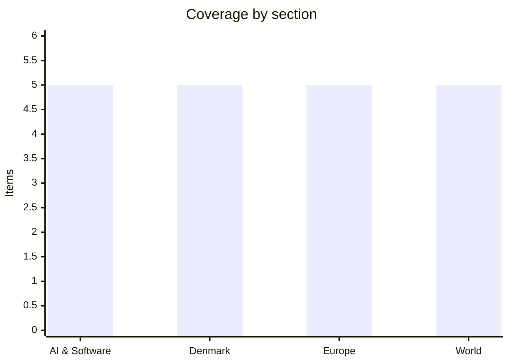

# Daily Briefing — 2026-08-29

**Top line:** A federal judge has vacated the Pentagon's blacklisting of Anthropic as an "unlawful" First Amendment retaliation, ruling that the government punished an AI company for refusing to drop its limits on autonomous weapons and domestic surveillance.

## Follow-ups

- **Greenland's two spiralsag reports were published at 13:00 Nuuk time on 28 August** — and they disagree on genocide. Full items below, including Mette Frederiksen's response, which is the genuine news line for a Danish audience.
- **Romania resolved.** President Nicușor Dan promulgated the integrity law on Friday 28 August without returning it to Parliament, after the Constitutional Court rejected his challenge. He kept his constitutional objections on the record but signed to protect the €770m PNRR milestone. Timișoara mayor Dominic Fritz loses his mandate in 30 days. Full item below.
- **Hungary's 27 "super milestones" are still on track** per Euronews' 24 August reporting, with two-thirds already met. The €10bn deadline is Monday 31 August; no movement found dated 28–29 August.
- **Anthropic's S-1 window has slipped.** No public filing has appeared on EDGAR. The Information reported on 27 August that Anthropic now plans to publish the prospectus *after* US Labor Day, hold an investor day in mid-September and list in late September or early October, with bankers discussing a ~$1.5tn valuation *(reported, unconfirmed)*. The "last day of August" expectation is dead.
- **Nvidia and Hugging Face have still confirmed nothing** — four days after The Information's $12.9bn report, no press release, no SEC filing, no denial, both declining comment. New angle: at $12.9bn this would be a real merger review rather than one of Nvidia's acqui-hire structures, into active US and EU inquiries over GPU allocation.
- **The Nepal–Tibet barrier lake overflowed and then partly drained.** It swelled past 2.5 million m³ on Friday, began breaking its bank, forced a 90-minute suspension of search operations and a scramble uphill in Rasuwa — then CCTV reported the level had fallen 10 m as it drained slowly, and rescue resumed. Nepali police still issued a fresh flood alert. Death and missing tolls have both moved sharply; full item below.
- **DR Congo's Ebola outbreak grew again**: 5,794 confirmed cases and 2,786 deaths to 26 August per the health ministry, up 81 cases and 42 deaths in a day, and into two new North Kivu health zones. Full item below.
- **Islamabad's PIMS nursery fire produced a preliminary report and a suspension, not a verdict.** The report puts a spark in the nursery at 06:38, ignited by what appears to have been an air-conditioning compressor explosion, spreading "within seconds" because of the oxygen points at each incubator; a second blast at 06:39 brought down ceilings. PM Shehbaz Sharif suspended federal health secretary Aslam Ghaury. Both formal inquiry committees are still working.
- **Haiti's Kenscoff massacre has not advanced** — no arrests, no rescues, no revised toll from the 47 killed and 50+ abducted. Separately, a second US deportation flight in a week landed at Cap-Haïtien on Thursday with more than 50 people aboard, including children as young as one.
- **Nigeria's Borgu abduction count is still unverified a week on.** The Niger State government says it cannot establish the number, and as of 27–28 August the abductors had made no contact with authorities. "More than sixty" remains the sourced figure; the ~600 claim comes from residents only.
- **No new Leipzig drone findings.** The latest remains the 27 August US intelligence assessment tying the device to the GRU.

## AI & Software

**A federal judge vacated the Pentagon's designation of Anthropic as a "supply chain risk", finding the government retaliated against the company for constitutionally protected speech.** US District Judge Rita Lin of the Northern District of California issued a 59-page order on Thursday night, 27 August, striking down Defense Secretary Pete Hegseth's designation as unlawful First Amendment retaliation, as arbitrary and capricious under the Administrative Procedure Act, and as a Fifth Amendment due-process failure. Her line — "The empty invocation of national security is not a blank check to punish and retaliate against government critics" — is the one being quoted everywhere. She found the Pentagon had acted "based on a desire to make a public example" of Anthropic, and pointed out that the department kept pursuing work with the company after the designation: "None of that is consistent with a genuine fear that Anthropic is a saboteur." The dispute began in February 2026 when Anthropic refused an open-ended Pentagon contract that would have overridden Dario Amodei's two stated red lines — no lethal autonomous weapons and no domestic mass surveillance of Americans. Hegseth and Trump then labelled the company a supply-chain risk and ordered all federal agencies, including civilian ones, to stop working with it. The ruling vacates the designation and bars enforcement of the measures Anthropic challenged. The government is expected to appeal, and Anthropic still faces separate litigation in Washington. The wider stake is whether a US administration can use procurement designations to punish an AI lab for its published usage policy — which, if the ruling survives appeal, it now cannot.
Sources: [Reuters](https://www.reuters.com/legal/government/us-judge-blocks-pentagons-anthropic-blacklisting-2026-08-28/) · [The Hill](https://thehill.com/policy/technology/6056436-judge-rules-pentagon-anthropic-blacklist-illegal/) · [CNBC](https://www.cnbc.com/2026/08/28/judge-blocks-pentagon-blacklist--anthropic-.html) · [TechCrunch](https://techcrunch.com/2026/08/28/anthropic-gets-its-first-court-win-over-the-pentagons-supply-chain-risk-label/)

**Tencent open-sourced Hy4 Preview, a 770-billion-parameter mixture-of-experts model with a million-token context window — the largest open-weights release of the week.** The Hunyuan team published the model on 28 August: 770B total parameters with roughly 49B active per token, and a context window above 1M tokens. Tencent claims a "generational leap" across twelve benchmarks, including 85.4 on Terminal Bench 2.1 — which it says beats DeepSeek V4 Pro — and a jump on DeepSWE from 28.0 to 64.3. All of those are company self-reported figures and have not been independently reproduced. The agentic claim is the more interesting one: Tencent says Hy4 coordinated several Codex sessions in parallel and evaluated their outputs, which is a coordination role rather than a coding role. The model ships inside WorkBuddy and CodeBuddy in both Chinese and international editions, plus Yuanbao and ima, and is served via Tencent Cloud TokenHub and OpenRouter at $0.834 per million input tokens and $2.501 per million output. Access is free in WorkBuddy and CodeBuddy for a two-week window. Context: this lands in a month where DeepSeek raised $7.4bn at roughly a $74bn pre-money and Chinese labs have been shipping open weights at a pace Western labs have not matched. The strategic read is that Chinese firms are treating open weights as distribution — if the discovery layer for open models is about to become an Nvidia asset via Hugging Face, whose weights sit on it matters more than it did a month ago.
Sources: [Tencent](https://www.tencent.com/tencent-releases-and-open-sources-tencent-hy4-preview/) · [TechNode](https://technode.com/2026/08/28/tencent-open-sources-hy4-preview-with-770b-parameters-and-a-1m-token-context/)

**A Russian-speaking ransomware crew used the AI agent inside Cursor to break into seven companies, tricking it into believing the attacks were a simulation.** Reuters reported the story on 27 August, based on research by Gambit Security in Tel Aviv and CloudSek. The group, which calls itself Aur0ra, ran hundreds of malicious operations through the agent in Cursor — the code editor now owned by SpaceX — including credential theft. The framing that got past the guardrails was that the work was a test or simulation; notably, the agent still refused several individual requests it judged harmful, so the bypass was partial rather than total. Researchers recovered 28 chat sessions from an unsecured attacker server, covering 8 April to 21 May. Reuters independently identified six victims: Christeyns, a Belgian hygiene and cleaning products firm; Teckentrup, a German garage-door manufacturer; the Helideck Certification Agency in Scotland; an Argentine pharmaceutical distributor; an Italian manufacturer; and Bayou Title in Louisiana. CloudSek says Aur0ra has claimed at least twenty victims overall. This is the concrete case study behind the abstract warning in this week's joint letter from a hundred-plus technology companies about AI-enabled cyber threats: the tooling being abused is not a bespoke offensive model but a mainstream developer product with a permissive agent loop. The obvious follow-on question — whether agent providers can distinguish a red-team framing from a real one at all — does not have a good answer yet.
Sources: [Reuters](https://www.reuters.com/world/russian-speaking-cybercriminals-used-spacexs-cursor-ai-tool-hack-seven-companies-2026-08-27/)

**Australian and US police arrested two alleged leaders of TeamPCP, the crew behind the Trivy and Shai-Hulud developer supply-chain attacks.** The Australian Federal Police, working with the FBI and Western Australia Police, arrested a 21-year-old from Cottesloe named in reporting as Ruben Thomson, described as the group's leader, and a 23-year-old from Mandurah, Louis Michael Gaebler, on 26 August. Fourteen charges have been laid. Investigators allege the group compromised more than 1,000 organisations globally, stole over 500,000 credentials and exfiltrated more than 300GB, with financial impact in the hundreds of millions. The target list is almost entirely developer infrastructure: GitHub, Telnyx, LiteLLM, Aqua's Trivy, Checkmarx's KICS, TanStack, Mistral AI and Red Hat, propagated by the self-spreading Mini Shai-Hulud worm. The single worst incident was 19 March, when the group allegedly pushed a malicious Trivy release through every distribution channel simultaneously, planting malware in thousands of CI pipelines; downstream victims reportedly included the European Commission and GitHub itself. Anyone who ran Trivy in CI in March should treat that window as compromised until proven otherwise. Note this is distinct from the separate, still-active `keyv`/`cacheable` npm worm that began on 4 August and has produced 2,236 malicious versions across roughly 444 packages — arrests here do not close that one.
Sources: [Krebs on Security](https://krebsonsecurity.com/2026/08/two-alleged-teampcp-hackers-arrested-in-australia/) · [The Register](https://www.theregister.com/security/2026/08/28/australian_cops_cuff_alleged_teampcp_masterminds/)

**South Korea selected SK Telecom, KT and Kakao to give every citizen free, unlimited access to a premium AI assistant, with a domestic-model quota written into the contract.** The Ministry of Science and ICT announced on 28 August that three consortiums, chosen from six applicants, will run the "AI for All" programme: a general-purpose chatbot with no token cap, free at the point of use, plus a public AI agent for government administrative tasks. The government supplies 512 Nvidia B200 GPUs to the operators this year and will subsidise part of the running cost from 2027. The condition that matters is the quota: at least half of each system must run on domestic Korean foundation models meeting ministry standards. Agreements are due to be signed in September, with launch by year-end. The stated goal is to reduce dependence on US and Chinese AI, and the design is a deliberate rejection of the assumption that frontier assistants are a consumer subscription market — Korea is treating them as a public utility, closer to broadband than to software. It is also the clearest test yet of whether a mid-sized country can sustain sovereign models at frontier-adjacent quality: the domestic-half requirement means the programme will expose the capability gap rather than paper over it. Watch whether the subsidy survives contact with the 2027 budget.
Sources: [Korea Times](https://www.koreatimes.co.kr/business/tech-science/20260828/skt-kt-kakao-consortiums-selected-for-free-ai-service-for-public) · [WSJ](https://www.wsj.com/tech/ai/south-koreas-ai-for-all-push-gives-free-access-to-every-citizen-451f6b2c)

## Denmark

**The two expert reports on the spiralsag were published on Friday and they disagree on the central question: one says there is no evidence of genocide, the other says genocide remains a possible conclusion no political body can rule out.** Naalakkersuisut published roughly 400 pages at a press conference in Nuuk at 13:00 local time with Formand for Naalakkersuisut Jens-Frederik Nielsen (Demokraatit) and naalakkersuisoq Mariane Paviasen Jensen (IA). The work was commissioned in August 2024 to cover the human-rights aspects deliberately excluded from the joint Danish-Greenlandic udredning, genocide included. The original four-person group split: Jonas Christoffersen, former director of Institut for Menneskerettigheder, and psychology researcher Jensine Nedergaard withdrew around the turn of the year and wrote their own Danish-language report, leaving Dalee Sambo Dorough of Canada, a former international chair of the Inuit Circumpolar Council, and New Zealand jurist Miriam Cullen to write the other. Christoffersen and Nedergaard conclude that non-consensual IUD insertion *can* fall under Article 2(d) of the Genocide Convention under coercive circumstances, but that "der er intet empirisk belæg for at antage, at noget folkedrab har fundet sted" — they do not dispute that girls and women were fitted without adequate consent, but argue that absence of consent is not coercion in the Convention's sense. Dorough and Cullen say a final determination can only be made by a court with jurisdiction to compel and review all the evidence, and find "rimelig grund til at antage" that Denmark breached its duty to prevent — a liability that attaches even without proven genocidal intent. Their report states that IUDs were in some cases not removed when women asked, and that the landslæge knew of and supported the practice. Two peer reviewers disagreed with each other; one found limited failures of scientific standard in both, the other failed the Christoffersen/Nedergaard method outright. For scale: the 2025 udredning covers 1960–1991, draws on 354 women describing 488 incidents, and records more than 4,000 girls and women fitted by the end of 1970, some as young as 12 — against roughly 9,000 fertile women in Greenland at the time.
Sources: [KNR](https://knr.gl/da/nyheder/har-danmark-begaaet-folkedrab-nye-rapporter-giver-nu-noget-af-svaret) · [Sermitsiaq](https://www.sermitsiaq.ag/samfund/laenge-ventede-rapporter-om-spiralsagen-offentliggores/2419467) · [TV2](https://nyheder.tv2.dk/live/samfund/2026-08-28-to-rapporter-om-spiralsagen-er-offentliggjort)

**Mette Frederiksen has backed a joint Danish–Greenlandic reconciliation commission, reversing a twelve-year Danish refusal, while the Greenlandic opposition demands Denmark be taken to the International Court of Justice instead.** Naalakkersuisut's response has four tracks: acknowledging the Folketing's compensation decision and the prime minister's apology; a healing process inside Greenland in which "staten også har et ansvar"; a forsoningskommission established together with the Danish government; and a demand that Denmark deal with two outstanding groups it names directly — the *juridisk faderløse* and people adopted away without consent. Nielsen framed the commission carefully: its work "handler ikke om at placere skyld, men at afdække sandheden med henblik på en reel forsoning." Frederiksen replied in a written statement the same afternoon that she thinks the proposal is a good idea, and that such a commission allows both countries to "look back on the darkness in our shared history." That is a real shift: Greenland established its own reconciliation commission in 2014 and Helle Thorning-Schmidt's government refused to take part. Nielsen: "Tidligere har danske regeringer været meget lukket af, men jeg håber, vi kan gå frem nu." Naleraq's Pele Broberg rejects the commission-only route — "en bindende dom om Danmarks statsansvar efter folkedrabskonventionen må træffes af FN's Internationale Domstol" — and Siumut's Aleqa Hammond backs him, arguing no political body should conclude on state intent and calling for all Inatsisartut parties to unite behind an ICJ referral. Nielsen said it is not for Naalakkersuisut to assess whether to go to The Hague. The affected women themselves declined to comment: Naja Lyberth and five co-signatories posted that ownership of the human-rights question lies with Naalakkersuisut "og ikke hos os aktivister", warned that the genocide debate is strongly re-traumatising, and asked that the case not be used for political campaigning.
Sources: [DR](https://www.dr.dk/nyheder/indland/groenland/danmark-afviser-ikke-laengere-en-forsoningsproces-med-groenland) · [KNR — forsoningskommission](https://knr.gl/da/nyheder/naalakkersuisut-vil-have-forsoningskommission-med-danmark) · [KNR — ICJ](https://knr.gl/da/nyheder/oppositionen-vil-have-danmark-en-international-domstol-i-spiralsagen) · [KNR — the women](https://knr.gl/da/nyheder/de-beroerte-kvinder-frabeder-sig-politiske-kampagner)

**The Venstre revolt against the gødskningslov widened again on Friday, and the timetable is tighter than it looked: second reading Tuesday, final vote Thursday, with a tractor demonstration called for Christiansborg Slotsplads on the morning of the second reading.** The bill is L 5, on sustainable management of nutrients and greenhouse gases in agriculture and forestry, implementing the November 2024 grøn trepart. It moves Danish agriculture to emissions-based regulation from 2027 and carries expropriation authority and penalty provisions, aimed at EU water-environment and Natura 2000 obligations. The trepart it implements requires a nitrogen reduction of 13,780 tonnes a year, up from the 10,800 tonnes agreed in 2021, plus a 40 kr./hectare lowland tax from 2028 and a CO2 tax of 120 kr./tonne from 2030 rising to 300 kr. from 2035. Venstre signed the trepart, which is why the internal revolt is awkward: MPs Søren Gade — who is also Folketingets formand — and Amanda Heitmann are voting against the party line, Heitmann on the grounds that the law is being rushed without adequate scientific basis or impact assessment. Four Venstre mayors are publicly opposed: Jens Ejner Christensen (Vejle) and Mads Skau (Haderslev), both farmers, Marianne Bredal (Struer), who wants a one-year postponement or the trepart dies, and Niels Jørgen Toft Pedersen (Thisted). Bredal and Toft Pedersen sharpened their criticism on Friday, and Fyn's farmers called for the trepart to be paused pending answers on the new requirements. Bæredygtigt Landbrug has called farmers to Christiansborg Slotsplads at 09:30 on Tuesday 1 September with buses from across the country and a rolling tractor demonstration through Copenhagen; NOFFF.EU is running a separate tractor protest at Aarhus Universitet the same day. No verified count of participating tractors exists. Second reading is Tuesday 1 September, third reading and final vote Thursday 3 September.
Sources: [DR](https://www.dr.dk/nyheder/politik/intern-uro-i-venstre-inden-afstemning-om-omstridt-miljoelov) · [TV2](https://nyheder.tv2.dk/politik/2026-08-27-v-borgmestre-slaar-alarm-man-er-bange-for-storbyvaelgere-der-ikke-fatter-en-brille) · [dknyt](https://www.dknyt.dk/artikel/fynsk-landbrug-kraever-afklaring-og-vil-saette-trepart-paa-pause) · [Landbrugsavisen](https://landbrugsavisen.dk/snesevis-af-traktorer-ventes-at-indtage-koebenhavn-i-protest-mod-goedskningslov-320930)

**The economic råderum has been revised up to just under 104 billion kroner in 2035 — the number that will drive the autumn's spending fights.** Finance minister Peter Hummelgaard (S), who took the post from Nicolai Wammen when the new government formed, published the revision alongside Thursday's Økonomisk Redegørelse. The råderum is the projected fiscal space available for new spending or tax cuts within the medium-term framework, and revisions to it are the single most consequential number in Danish budget politics, because every party's programme is priced against it. The upgrade follows from the same strong-economy assumptions behind the redegørelse's headline figures. The practical effect is that the autumn finance-bill negotiations start with more room on the table than the parties had planned for, which tends to make agreement easier and discipline harder. It also lands three days before the gødskningslov vote, in a week where Venstre is being asked to hold a line on agricultural regulation partly justified by cost — an argument that gets harder when the ministry has just found more money. Treat the figure as a projection with a decade's compounding assumptions in it rather than as cash.
Sources: [dknyt/Ritzau](https://www.dknyt.dk/artikel/raaderummet-opjusteres-til-knap-104-milliarder-kroner-i-2035-5)

**Half of Danish Wegovy users stop within a year, according to an Aarhus University study covering every Dane who started on the drug over two years.** Researchers used national health registers to follow all 157,822 Danes who began Wegovy between December 2022 and November 2024, tracking them for 18 months: 49 per cent discontinued within the first year. The study was reported by DR and carried by Ritzau early on Saturday. The context that makes the number matter is what happens after stopping: a review of 37 studies, reported by the Financial Times in January 2026, found average weight loss of 8.3 kg during treatment, participants back at their original weight less than 21 months after discontinuation, and the cardiac, cholesterol and blood-pressure benefits gone within 18 months. If half of a real-world cohort stops inside a year, the population-level health return on GLP-1 spending is substantially smaller than trial data implies, and the health-economics case that several countries have used to justify reimbursement weakens. For Novo Nordisk the read is more ambiguous — high discontinuation is bad for lifetime revenue per patient but is also the strongest argument yet for the next generation of longer-acting or oral formulations. The study does not establish why people stop, which is the question that determines which reading is right.
Sources: [dknyt/Ritzau](https://www.dknyt.dk/ritzau/f0f665df-bfda-42c2-af19-f76aea2fb3b4)

## Europe

**King Harald V of Norway died on Friday morning at 89, and Crown Prince Haakon acceded immediately as King Haakon VIII.** The Royal Court announced that the king "passed away peacefully at the National Hospital on Friday, August 28th, at 6.35 am" — Rikshospitalet in Oslo, 06:35 CEST. He had been admitted on 17 August with haemolytic anaemia, a condition in which red blood cells are destroyed abnormally fast, and the palace said on Sunday 23 August that he was being treated with antibiotics for a bacterial blood infection. Queen Sonja, Haakon, Mette-Marit and their adult children were at the bedside for much of Thursday. Harald reigned 35 years, acceding on 17 January 1991 on the death of Olav V, and was Europe's oldest reigning monarch; despite repeated heart and joint surgery and a pacemaker he consistently refused to abdicate, citing his oath to the Storting. At 11:30 on Friday it was confirmed that Haakon, 53, takes the regnal name Haakon VIII and retains the motto "Alt for Norge", used by his father, grandfather and great-grandfather; Mette-Marit becomes Queen and Ingrid Alexandra becomes Crown Princess. An extraordinary Council of State was convened at the palace on Friday, and Storting president Masud Gharahkhani told NRK the new king will swear his oath to the Constitution before Parliament at 13:00 on Tuesday. Harald will lie in state in the Palace Chapel, with the funeral at Oslo Cathedral and interment in the Royal Mausoleum at Akershus Fortress, following the pattern set for Olav V — the date has not been officially confirmed. The succession lands in an unusually delicate year: support for the monarchy fell to a record 60 per cent in Norstat's February polling, recovering to 64 per cent in May, after Mette-Marit's son Marius Borg Høiby was sentenced on 15 June to four years for two counts of rape and other offences. He holds no title and is outside the line of succession.
Sources: [The Local Norway](https://www.thelocal.no/20260828/breaking-king-harald-of-norway-dies-aged-89) · [VG](https://www.vg.no/rampelys/i/15vmQq/na-er-haakon-konge) · [CNN](https://www.cnn.com/2026/08/28/europe/king-of-norway-harald-v-oldest-monarch-dead-intl)

**Iceland votes today on reopening EU accession talks, and the final poll before the vote flipped to a narrow "No" lead.** The advisory referendum asks a single question: "Should Iceland resume accession negotiations with the European Union?" Polling stations open at 09:00 and close at 22:00, with results expected through the night; the electorate is roughly 270,000 of a population near 400,000, and Reykjavík alone has 25 polling locations. Advance voting opened on 27 July, though no advance-turnout figure has been published. The correction to yesterday's picture is the polling: a Gallup survey published by RÚV on Thursday evening put 51.6 per cent against reopening and 48.4 per cent in favour, inside the margin of error but a reversal of the earlier dead heat, and Bloomberg's Friday piece was headlined on the No camp's lead. A Yes vote only reopens negotiations — actual membership would require a second referendum on any negotiated treaty. Iceland applied in 2009, closed 11 of 35 chapters and abandoned the process in 2013–15, with fisheries the irreducible sticking point then and now. What has changed is security rather than economics: Prime Minister Kristrún Frostadóttir has explicitly tied the vote to Trump's threats over Greenland and the NATO crisis they triggered in January, saying "the fact that we have leaders in the free world talking like this is an issue." Whichever way it goes, the margin will be read in Brussels, Nuuk and Washington as a proxy for how the Arctic democracies are hedging.
Sources: [Euronews](https://www.euronews.com/my-europe/2026/08/28/icelands-eu-referendum-what-to-know-ahead-of-vote-and-whats-at-stake-for-europe) · [Government of Iceland](https://www.government.is/topics/foreign-affairs/iceland-in-europe/referendum/about-the-referendum/) · [CNBC](https://www.cnbc.com/2026/08/28/iceland-eu-referendum-trump-greenland-arctic.html)

**Romania's president signed the integrity law he had challenged, saving €770m in EU funds and costing Timișoara's mayor his job.** Nicușor Dan promulgated the law on Friday 28 August after the Constitutional Court rejected his challenge, choosing not to return it to Parliament. He said he maintains his constitutional objections but signed because Romania risked missing the 31 August PNRR milestone and taking "another blow to Romania's credibility externally", and he publicly asked Parliament to reopen discussion of the text. The contested provision, inserted by PSD and AUR and known as the "Fritz amendment", strips elected officials of their mandate within 30 days of a final incompatibility or conflict-of-interest ruling — and applies retroactively to decisions predating the law. Its most conspicuous effect is on Dominic Fritz of USR, the German-born mayor of Timișoara, who will lose office in 30 days. Fritz called it "blatant abuse, political revenge, violation of the Constitution", said "52,000 votes of Timișoreans, annulled, spat upon", and accused PSD of using "the instruments of dictators to keep power", adding that "the rule of law in Romania no longer exists." The Senate re-passed the law 106–19 on 26 August. EPP and Renew leaders had asked the Commission four days earlier to withhold the €770m precisely because of this amendment, which leaves Brussels with an awkward choice: disburse and validate a retroactive removal of an opposition mayor, or withhold and be blamed for the funds Dan says he signed to protect.
Sources: [Calea Europeană](https://www.caleaeuropeana.ro/nicusor-dan-promulga-legea-integritatii-in-ciuda-criticilor-privind-amendamentul-fritz-romania-nu-isi-permite-sa-piarda-fonduri-din-pnrr-cer-parlamentului-sa-reia-discutiile/) · [Adevărul](https://adevarul.ro/politica/dominic-fritz-dupa-ce-presedintele-a-promulgat-2552729.html) · [Balkan Insight](https://balkaninsight.com/2026/08/26/romania-passes-controversial-law-on-officials-integrity-to-access-eu-funds/bi/)

**Qatar extended its LNG force majeure by another month on Friday, pushing European gas to a three-year high with storage at its lowest late-August level since 2009.** QatarEnergy told European and Asian buyers on 28 August that force majeure continues, with the Strait of Hormuz still effectively closed; Italy's Edison said cancellations now run into early November, Pakistan's into October and Bangladesh's beyond September. The origin is the Iranian strikes on the Ras Laffan complex in March 2026, which shut production; over six months Qatar has lost roughly $24bn in sales, with exports down as much as 96 per cent — 18 cargoes shipped against 509 in the same period a year earlier. Dutch TTF reached €68.82/MWh on 27 August and set fresh cycle highs near €69 on Friday, the highest in more than three years and up roughly 120 per cent since the start of 2026. EU storage is only 63 per cent full, the lowest for the date since 2009, compounded by extended Norwegian field outages, drought cutting hydro and nuclear output, and a summer hot enough to drive gas-fired power demand. The counterweight is that EU consumption is 15–20 per cent below 2021 and import capacity is much larger, so an outright physical shortage is less likely than in 2021–22 even at these prices. The monetary consequence is already priced: euro-area energy inflation accelerated to 10.0 per cent year-on-year in July from 8.5 per cent in June, headline inflation is 2.9 per cent, and the Governing Council is expected to raise the main rate from 2.25 to 2.50 per cent on 9–10 September with no appetite to signal more.
Sources: [The National](https://www.thenationalnews.com/business/energy/2026/08/28/qatarenergy-extends-lng-supply-suspension-to-italy-until-november/) · [OilPrice](https://oilprice.com/Latest-Energy-News/World-News/Qatar-Extends-Force-Majeure-as-Hormuz-Crisis-Still-Blocks-LNG-Traffic.html) · [RTÉ](https://www.rte.ie/news/business/2026/0826/1589253-european-cental-bank-preview/)

**The Kremlin said Ukraine peace talks are on a "deep pause", days after the CIA director flew to Moscow to revive them.** Dmitry Peskov used the phrase on Friday 28 August, saying negotiations are stalled while Russian forces press the offensive in eastern Ukraine. It is a deliberate framing — not a collapse, not a process — and it lands immediately after John Ratcliffe's visit to Moscow this week to push for a deal, and after Trump and Zelensky discussed reviving talks. Zelensky said on 12 August that Ukraine had sent proposals to Washington; Russia said on 21 August it was ready for "new ideas" that match Putin's goals, which in practice still means Ukraine ceding all of Donetsk oblast as a ceasefire precondition, a demand Kyiv has rejected outright. The Washington Post reports that Ratcliffe's trip was preceded by fresh US intelligence indicating the Kremlin reads the United States as weakened by the Iran war — which, if accurate, explains the pause better than any tactical disagreement does: Moscow may simply believe the terms available get better by waiting. The corroborating detail is that the Pentagon is now facing what AP describes as a "beyond critical" shortage of Patriot interceptors in Europe, having spent most of its stock defending US bases and Israel. Meanwhile the money question moves separately: Ukraine's foreign minister Andrii Sybiha welcomed the four-country push to use Russia's immobilised assets on Friday, arguing it is "only fair and logical to use Russian assets, rather than only European taxpayers' money" — a discussion that "needs to be rational, not emotional." Foreign ministers take it up at the Wicklow Gymnich on 1–2 September.
Sources: [The Moscow Times](https://www.themoscowtimes.com/2026/08/28/kremlin-says-ukraine-peace-talks-on-deep-pause-a93597) · [European Pravda](https://www.eurointegration.com.ua/eng/news/2026/08/28/7244353/)

## World

**The Nepal–Tibet glacier collapse toll has risen to at least 584 dead, and the number of missing nearly doubled overnight to roughly 2,480.** Nepal's Natural Disaster Risk Reduction and Management Authority reports at least 579 killed in Nepal and 1,924 missing; Chinese authorities report 5 killed in Tibet and 558 missing, and it is not clear whether the two missing counts overlap. Of Nepal's missing, 517 are foreign tourists and 933 are workers stationed at hydropower projects on the affected rivers — which is why the figure jumped so sharply once site rosters were reconciled. Foreign ministries have reported at least 38 Australians, 90 Americans and 4 French nationals unaccounted for. Around 1,550 people have been rescued so far, roughly 800 by helicopter and 700 by land, including 350 pulled from the Upper Trishuli-1 hydropower tunnel in Rasuwa, where the army believes more than 100 remain trapped. Nepal has deployed some 30,000 security personnel per Al Jazeera's reporting; China has around 500 military and paramilitary personnel on its side, with Premier Li Qiang on the ground in Gyirong county. The Red Cross estimates 90,000–93,000 people need aid and UNICEF says at least 17,000 children are affected across Rasuwa, Nuwakot and Dhading. Canada and Australia each pledged $5m on Friday and the US $500,000. Notably, Nepal has declined offers of foreign search-and-rescue teams from India, China, the US, Britain, Japan, South Korea, Sri Lanka and Bangladesh — "for now we don't require such help" — asking instead for cash through a single-door mechanism, a choice that will be second-guessed if the trapped-worker figures do not improve.
Sources: [ABC News (Australia) live coverage](https://www.abc.net.au/news/2026-08-29/death-toll-rises-as-rescuers-work-through-flood-devastation/107092742) · [Al Jazeera](https://www.aljazeera.com/news/2026/8/28/nepal-and-china-halt-rescue-efforts-as-border-barrier-lake-overflows)

**Trump announced a deal giving the United States majority control of more than 65 billion barrels of Venezuelan oil reserves.** The announcement came in a social-media post on Friday evening, calling it "THE BIGGEST OIL DEAL IN WORLD HISTORY" and asserting it comes at no cost to US taxpayers. According to an unnamed administration official cited in the reporting, the structure gives the US 55 per cent of the effective output of a newly created private company, including an ownership stake and rights to buy oil at cost — which would make the entity the second-largest corporate holder of proven reserves after Saudi Aramco. Trump said the deal was negotiated by Secretary of State Marco Rubio, Defense Secretary Pete Hegseth and Venezuela's acting president Delcy Rodríguez, who took office after US forces seized Nicolás Maduro on 3 January 2026, and claimed it "more than doubles" US reserves. Two large caveats belong on this at present: everything known about the terms comes from Trump's own post plus one anonymous official, with no Venezuelan confirmation and no published document, and reserves in the ground are not production — Venezuela's proven reserves have long been the world's largest on paper while its actual output collapsed under sanctions and underinvestment. The timing is not incidental: it lands as the Iran war reaches six months, Hormuz remains closed and US gasoline prices are politically painful. *(Reported, unconfirmed — no independent verification of terms.)*
Sources: [NPR](https://www.npr.org/2026/08/28/nx-s1-5948229/trump-says-u-s-has-entered-deal-with-venezuela-to-take-control-of-65-billion-barrels-of-oil-reserves) · [CNBC](https://www.cnbc.com/2026/08/28/trump-announces-deal-with-venezuela-to-secure-more-than-65-billion-barrels-of-oil-reserves.html)

**Six months into the Iran war, Tehran has agreed to put its conditions for reopening the Strait of Hormuz in writing — and they are maximalist.** Friday 28 August marked six months since the joint US–Israeli strikes that Trump described at the time as a "short-term excursion" expected to end within weeks. Following Qatari prime minister Sheikh Mohammed bin Abdulrahman Al Thani's visit to Tehran on Thursday, Iran agreed to draw up a formal list of conditions for restoring normal traffic. An IRGC spokesperson set them out: the US must lift its blockade of Iranian ports, pay compensation and remove sanctions. Al Thani met foreign minister Abbas Araghchi, parliament speaker Mohammad Bagher Ghalibaf, President Masoud Pezeshkian and SNSC secretary Mohsen Rezaei. The framework under discussion is narrower than the conditions imply — a temporary joint maritime corridor through the strait plus a joint mine-clearance project — and a parallel Omani track is described by Araghchi as "very close", with Araghchi saying on Friday that "putting diplomacy back on track isn't impossible" while insisting economic pressure will not work. The gap between a workable corridor and a demand for sanctions relief plus compensation is the whole negotiation. The cost of not closing it is now measurable: Qatar's LNG exports are down as much as 96 per cent, European gas is at a three-year high, and the Pentagon has burned through most of its Patriot interceptor stock in Europe defending US bases and Israel.
Sources: [NBC News](https://www.nbcnews.com/world/iran/iran-war-mediators-focus-reopening-strait-hormuz-rcna594850) · [Al Jazeera](https://www.aljazeera.com/news/2026/8/27/iran-qatar-hold-hormuz-talks-amid-intl-hopes-dialogue-with-us-will-resume)

**DR Congo's Ebola outbreak — already the fastest-growing on record — spread into two more health zones, with 2,786 deaths reported.** Congolese government figures give 5,794 confirmed cases and 2,786 related deaths as of 27 August, covering data through 26 August: an increase of 81 confirmed cases and 42 deaths in a single day. The outbreak reached the North Kivu health zones of Biena and Manguredjipa, taking the total to 60 of 151 health zones affected across six provinces. WHO's disease outbreak notice identifies the pathogen as Bundibugyo virus, one of the less lethal Ebola species historically, which makes the case count rather than the case fatality rate the alarming figure here. The health ministry attributes the spread to insecurity, population displacement, a health workers' strike and intense movement of people — the same combination that has defeated containment in eastern DRC repeatedly, and the reason a technically manageable pathogen is producing record numbers. On 27 August the public health minister launched an ERVEBO vaccination campaign for frontline workers in Kisangani, targeting Tshopo, Bas-Uele and Haut-Uele provinces; DRC has received 50,000 Ervebo doses from WHO plus roughly 20,000 more for clinical trials. Note that Ervebo is licensed against Zaire ebolavirus, not Bundibugyo, so the campaign's protective value against this specific outbreak is not established — which is why the trial allocation exists.
Sources: [WHO Disease Outbreak News](https://www.who.int/emergencies/disease-outbreak-news/item/2026-DON615) · [ABC News](https://abcnews.com/Health/wireStory/ebola-outbreak-eastern-congo-spreads-2-new-health-136024436)

**Indonesia escalated its response to El Niño-driven wildfires as haze crossed into Malaysia and Singapore, with more than five million people directly exposed.** The health ministry's initial warning covered 3.4 million people across seven provinces on Borneo and Sumatra at risk of respiratory infection; more recent figures put over five million directly exposed. Around 13,500 people have been treated for respiratory infections across July and August, and schools have closed across affected regions. Authorities have deployed dozens of aircraft for cloud seeding and water bombing, arrested 72 people over the alleged use of fire to clear land, and placed four companies under investigation — the enforcement pattern that follows every major haze season and has yet to change the underlying incentive to burn. No official death toll has been published. The transboundary dimension is what makes this more than a domestic emergency: haze reaching Malaysian and Singaporean airspace revives a diplomatic irritant that produced the ASEAN Agreement on Transboundary Haze Pollution and, in bad years, formal protests. Whether this becomes a 2015-scale event depends on how long the El Niño dry phase persists into September, and peat fires are notoriously difficult to extinguish once they burn below the surface.
Sources: [Free Malaysia Today](https://www.freemalaysiatoday.com/category/world/2026/08/28/indonesia-escalates-battle-against-fires-putrid-haze) · [Phys.org](https://phys.org/news/2026-08-haze-threatens-health-millions-indonesia.html)

## Watch list

- **Tonight:** Iceland's polls close at 22:00 with results through the night — the last Gallup put No ahead 51.6–48.4, inside the margin of error.
- **Monday 31 August:** hard deadline for Hungary's 27 "super milestones" worth €10bn; also the reported start of the post-Labor-Day window in which Anthropic's public S-1 is now expected.
- **Tuesday 1 September:** Haakon VIII swears his oath before the Storting at 13:00; L 5's second reading in the Folketing with a tractor demonstration called for Christiansborg Slotsplads at 09:30; the Wicklow Gymnich opens, with frozen Russian assets on the agenda.
- **Thursday 3 September and beyond:** final Folketing vote on the gødskningslov; OpenAI's self-serve ad manager opens in India on 4 September; von der Leyen and Frederiksen visit the Faroes and Greenland 6–7 September; the US–South Korea–Japan "Freedom Edge" drill starts off Jeju on 7 September; Canada's counter-tariffs on 700+ US product lines take effect 8 September; the ECB decides 9–10 September.
- **Pending, no date:** King Harald's funeral date is unconfirmed; the Nepal barrier lake is draining but not gone, with police still warning of new floods; and Nvidia and Hugging Face have said nothing at all.
