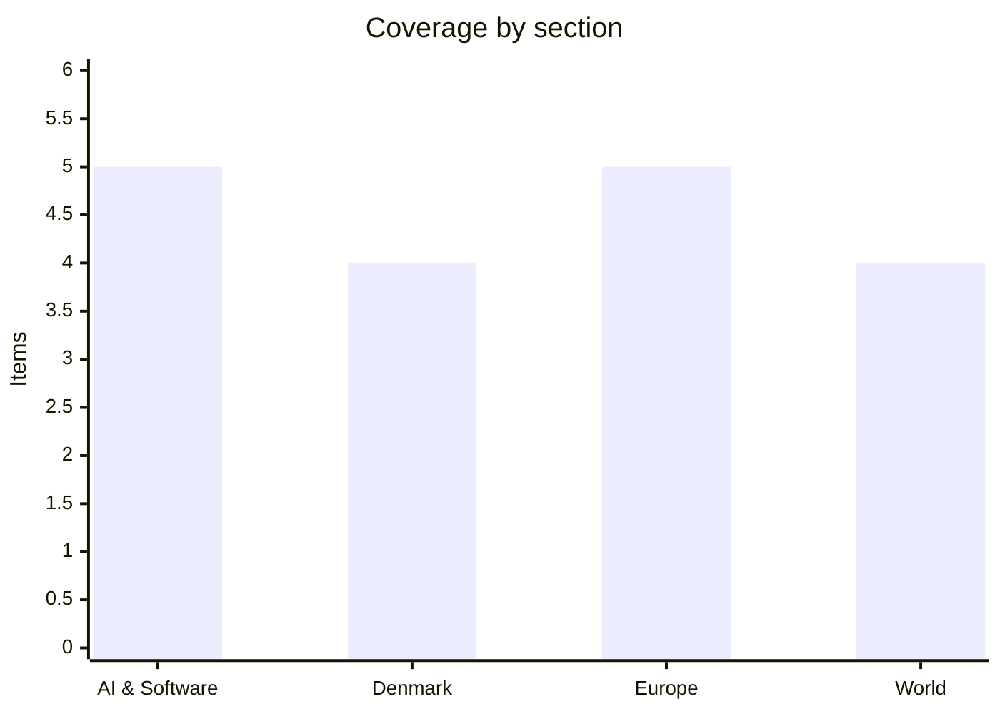

# Daily Briefing — 2026-08-31

**Top line:** Sony Music Publishing and Warner Chappell have sued Anthropic, its CEO and a co-founder in California over the alleged torrenting of tens of thousands of copyrighted compositions — a multi-billion-dollar claim landing weeks before the company expects to go public.

## Follow-ups

- **Iceland resolved: No.** 52.8% against reopening EU accession talks, 47.2% for, on 82.5% turnout — the highest participation in any Icelandic vote since the 2009 post-crisis election. Full item below.
- **Hungary's deadline is today.** The 27 "super milestones" worth €10.4bn fall due on 31 August. Euronews reported on 24 August that Budapest was on track with two-thirds met; no confirmation of completion had appeared as of Monday morning. Full item below.
- **Anthropic's S-1 is still not public.** Nothing has appeared on EDGAR. The post-Labor-Day window reported by The Information *(reported, unconfirmed)* opens next week — and the company now carries a fresh major copyright suit into it.
- **Nvidia and Hugging Face have still confirmed nothing**, five days after The Information's $12.9bn report. No press release, no filing, no denial.
- **The Nepal–Tibet barrier lake has overflowed rather than burst**, and officials now put the odds of a complete breach as relatively low — but Nepali authorities issued fresh flood warnings on Sunday 30 August as the Bhotekoshi rose again.
- **Norway has a funeral date.** King Harald V's state funeral is set for Wednesday 9 September; Haakon VIII takes his oath before the Storting tomorrow.
- **The Venstre revolt has names on the record.** Søren Gade and Amanda Heitmann have both confirmed they will vote against the gødskningslov at third reading on 3 September.

## AI & Software

**Sony Music Publishing and Warner Chappell sued Anthropic late Friday, naming Dario Amodei and Benjamin Mann personally and alleging a "brazen campaign" of intellectual property theft.**
The suit was filed in federal court in the Northern District of California and became public over the weekend. The publishers allege Anthropic obtained "thousands upon thousands" of copyrighted musical compositions through torrenting, scraping and bulk downloading of pirated collections, then used them to train Claude. They are seeking statutory damages of up to $150,000 per infringed work plus $25,000 for each instance in which copyright management information was stripped — arithmetic that gets to billions quickly given the alleged scale. What distinguishes this from earlier music-industry claims is both breadth and theory: previous suits focused on narrower sets of works, and this one leans heavily on the allegation that the source material was pirated rather than merely publicly available. Anthropic is not new to this fight — Universal Music, Concord and ABKCO sued over lyrics in 2023, BMG sued in March, and the independent publisher Round Hill filed earlier this month — but the company also settled with authors and publishers for $1.5bn in September 2025, the largest copyright settlement in US history, which gives the plaintiffs an obvious anchor for valuing a settlement here. Anthropic rejects the allegations and says it will defend itself in court. The timing is the sharpest part: the company is expected to publish its public S-1 within weeks, and a prospectus has to disclose material litigation. There is a plausible second reading — that the publishers filed now precisely to maximise leverage against an IPO calendar — but that does not make the underlying pirated-acquisition allegation any less serious if it is proven.
Sources: [Axios](https://www.axios.com/2026/08/29/anthropic-sony-warner-music-copyright), [TechCrunch](https://techcrunch.com/2026/08/29/sony-music-warner-sue-anthropic-alleging-a-brazen-campaign-of-intellectual-property-theft/), [Music Business Worldwide](https://www.musicbusinessworldwide.com/now-sony-music-publishing-and-warner-chappell-sue-anthropic-in-multi-billion-dollar-lawsuit-one-of-the-largest-and-most-blatant-ongoing-thefts-of-intellectual-property-in-history/)

**OpenAI is cutting Cursor off from its models on 12 November, fourteen days after SpaceX completed its $60bn acquisition of the company behind it.**
OpenAI formally notified SpaceX on 28 August that it was terminating the agreement under which Cursor serves OpenAI models, giving the maximum notice the contract allows. SpaceX agreed in June to buy Anysphere, Cursor's parent, in an all-stock deal valued at about $60bn, and closed it on 14 August; OpenAI says the change of ownership triggered a change-of-control provision that opened a limited window to terminate. Its stated reason is that it "cannot be confident that SpaceX will use our technology within our terms of service", and it pointed to what it described as a history of contract violations by Musk-controlled companies. Within hours, Anthropic said it would increase compute allocated to Claude models inside Cursor. For anyone building on top of a frontier lab, this is the concrete version of a risk that has mostly been theoretical: model access is contractual, and contracts have change-of-control clauses. Cursor is among the most widely used AI coding tools in the industry, and a large share of its users have been running OpenAI models by default, so the practical effect over the next ten weeks will be a forced migration of a lot of developer workloads to Anthropic, Google or Cursor's own models. It also folds developer tooling squarely into the Altman–Musk feud, which is now shaping which models a working engineer can actually reach. Watch whether SpaceX contests the change-of-control reading — it has not said it will, but the notice period gives it until mid-November to try.
Sources: [OpenAI](https://openai.com/index/our-decision-on-cursor-following-its-acquisition-by-spacex/), [GV Wire](https://gvwire.com/2026/08/29/openai-to-cut-off-ai-models-for-spacex-owned-cursor-escalating-feud-with-musk/)

**Sysdig caught an attacker using a stolen Ollama server to run a nine-stage autonomous exploitation framework — compute theft has turned into offensive tooling.**
Sysdig's Threat Research Team documented a threat actor who found an internet-exposed Ollama instance and, rather than reselling the free inference capacity as in earlier "LLMjacking" cases, used it to build and run an automated attack chain. The framework covers service fingerprinting, vulnerability matching, proof-of-concept synthesis, blind SQL injection, credential extraction, privilege escalation and orchestration across all of it, driven by structured prompts to the hijacked model. The exposure is a configuration default rather than a vulnerability: Ollama listens on port 11434 with no authentication, so any instance reachable from the internet is open capacity for whoever finds it, and independent researchers have catalogued roughly 175,000 publicly exposed instances across more than 130 countries. The significance is that it closes a loop between two trends that had been tracked separately — the economics of stolen AI compute, and the research literature on autonomous exploitation — inside a single actor's operation. It also means the marginal cost of running agentic offensive tooling for that attacker was zero, which changes the calculus on how much of it gets built. If you run Ollama anywhere with a public interface, the immediate action is to check whether 11434 is reachable and put authentication or a network boundary in front of it. This is the second AI-agent-abuse story in a week, after the Cursor-agent ransomware intrusions reported on Friday.
Sources: [Sysdig](https://www.sysdig.com/blog/llmjacking-evolved-attackers-are-using-stolen-ai-compute-to-build-offensive-agentic-tools), [Cloud Security Alliance](https://labs.cloudsecurityalliance.org/research/csa-research-note-llmjacking-evolved-offensive-agentic-tools/)

**Google DeepMind published WeatherNext Cyclones in Nature, claiming at least a full day's lead over the leading operational cyclone models.**
The model forecasts the track, intensity and size of tropical cyclones, and the paper reports that on 2023–2025 test data it delivered an average advantage of at least one day over leading operational models for certain forecast types. Rather than producing a single deterministic track, it generates large ensembles of possible storm evolutions, which is what forecasters actually work with when deciding how wide an evacuation zone needs to be. DeepMind says the model is being made available to the research community. The claim to weigh carefully is the framing: "at least one day" is an average over specific forecast categories on a retrospective test set, not a blanket statement that every cyclone forecast improves by 24 hours, and the operational baselines are the ones the model was evaluated against rather than whatever the national agencies run today. Even discounted, a day of extra warning is unusually legible as a benefit — it is the difference between an orderly evacuation and a rushed one. It also lands in a week where the Nepal–Tibet flood has made the limits of geophysical early warning very visible, though a glacier collapse is a different forecasting problem entirely. The broader pattern is that weather is turning into one of the clearest cases where AI models beat physics-based simulation on cost and lead time simultaneously.
Sources: [Nature](https://www.nature.com/articles/s41586-026-10953-2), [Google DeepMind](https://deepmind.google/blog/weathernext-ai-model-achieves-breakthrough-in-forecasting-cyclones/)

**Europe's electricity grids, not chips or capital, are becoming the binding constraint on AI data centres.**
Three separate national responses converged over the past fortnight. In the UK, Ofgem is examining rules that would force developers to demonstrate that a project is financed and has customers before it holds a grid connection slot, after speculative data-centre projects clogged the queue and delayed viable ones. In the Netherlands, Utrecht has frozen new electricity connections entirely since 1 July because of grid pressure. And Denmark published an emergency grid law on 20 August that replaces first-come, first-served allocation with a four-tier priority system — existing customers, new households and small businesses first, then electrification and green-transition projects, then batteries, and finally very large consumers such as data centres, ranked by how willing they are to flex demand. The Danish numbers explain the urgency: connection requests total roughly 60GW against peak national demand of about 7GW. Separately, Siemens CEO Roland Busch told Welt am Sonntag that the EU should accelerate approval processes, noting that legislation like the AI Act or Data Act takes around two years while models go through six or eight generations in the same period. The two arguments pull in opposite directions but describe the same problem — European infrastructure and rulemaking are both running on cycles slower than the technology. For anyone planning European capacity, the practical takeaway is that grid access is now a rationed political good rather than a queue you can buy your way to the front of.
Sources: [Bloomberg](https://www.bloomberg.com/news/articles/2026-08-20/denmark-publishes-emergency-grid-law-that-puts-data-centers-last), [Wired](https://www.wired.com/story/uk-data-centers-logjam-ofgem-regulations), [MarketScreener](https://www.marketscreener.com/news/siemens-ceo-warns-against-too-much-regulation-on-ai-ce7858dcd980f521)

## Denmark

**The gødskningslov reaches its second reading tomorrow with tractors booked for Christiansborg Slotsplads and two Venstre MPs publicly committed to voting against.**
The bill has its second reading in the Folketing on Tuesday 1 September and its final vote on Thursday 3 September. Søren Gade and Amanda Heitmann have both now confirmed they will break with the Venstre line and vote against at third reading — Gade saying he will not vote against his own convictions and his constituency, Heitmann arguing the law is being rushed through without adequate expert basis or impact assessment. Bæredygtigt Landbrug has called a demonstration on Christiansborg Slotsplads at 09:30 on Tuesday, with organised bus transport from around the country, while the group NOFFF.EU has called a parallel tractor demonstration at Aarhus University the same day. The substance of the law is a shift in what is regulated: instead of capping how much nitrogen may be applied to a field, it targets how much nitrogen from that field ends up in the aquatic environment. That is a defensible piece of environmental policy design and also a much less predictable constraint for a farmer to plan around, which is the root of the anger. Bæredygtigt Landbrug claims the law amounts to the state "laying off" more than half of Denmark's farmers — a campaign figure, not an impact assessment. The political problem for Troels Lund Poulsen is that Venstre backed the underlying green tripartite agreement in government, so the revolt is against a deal the party itself made, and it now has two named MPs, several mayors and a farm lobby behind it going into the week the vote falls.
Sources: [TV MIDTVEST](https://www.tvmidtvest.dk/midt-og-vestjylland/soren-gade-gar-imod-venstre-naegter-at-folge-partiets-linje-02134), [Maskinbladet](https://www.maskinbladet.dk/artikel/92720-to-venstre-folk-gaar-imod-partilinjen), [LandbrugsAvisen](https://landbrugsavisen.dk/snesevis-af-traktorer-ventes-at-indtage-koebenhavn-i-protest-mod-goedskningslov-320930)

**A panel of Danish traffic-safety experts called on Sunday for electric scooters to be removed from the roads entirely, in the seventh year of what was meant to be a trial.**
Tænketanken Trafiksikkerhed, a think tank of senior traffic and traffic-safety researchers, published a recommendation that el-løbehjul and other small electric vehicles be banned from traffic and returned to the status they had before 2019, when they were legal only on playgrounds. Riding them on cycle paths at up to 20 km/h has been permitted as a trial scheme since 2019 and has simply been extended each year. The safety case rests on the Vejdirektoratet's 2025 evaluation of the trial: measured on police-registered accidents, the accident risk on an electric scooter is eight to nine times that of a bicycle, and measured on National Patient Registry data — which captures far more minor injuries — it is three to four times higher. Harry Lahrmann of Aalborg University, the think tank's deputy chair, argues the combination of speed, small wheels and low stability is inherently dangerous both to riders and to other vulnerable road users. The group proposes a phase-out over several years for scooters, out of fairness to people who have already bought one, but an immediate ban on other small electric vehicles. Politically it is going nowhere fast: Moderaterne and the Konservative have both rejected a full ban, while Enhedslisten is open to reviewing which vehicle types belong on cycle paths at all. The more likely near-term outcome is another round of tightening — speed, age limits, enforcement — rather than removal, but the trial has now run long enough that "temporary" is doing no work.
Sources: [DR](https://www.dr.dk/nyheder/indland/skal-elloebehjul-og-andre-smaa-elkoeretoejer-vaere-fortid-i-trafikken-det-mener-eksperter), [TV 2 Fyn](https://www.tv2fyn.dk/danmark/eksperter-vil-forbyde-ellobehjul-i-trafikkken-c4281)

**Greenland's government is not pursuing a legal reckoning over the spiralsag, and is proposing a joint reconciliation commission with Denmark instead.**
Following Friday's publication of the two expert reports, Naalakkersuisut has indicated it is not currently moving towards a judicial follow-up — which forecloses, at least for now, the route the Greenlandic opposition has demanded of taking Denmark to the International Court of Justice. Government leader Jens-Frederik Nielsen has instead proposed that Denmark and Greenland jointly establish a reconciliation commission, and framed its purpose explicitly as uncovering the truth rather than assigning blame. Mette Frederiksen has called the proposal a good idea, saying it would let both countries look back at the darkness in a shared history, address it critically and acknowledge the pain it caused. That is a substantial reversal: Denmark refused a reconciliation process for twelve years. The reports themselves are the reason the question is live and unresolved — one concluded there is no evidence the spiral campaign constituted genocide, while the other held that a final determination is complex and can only be made by a court with the jurisdiction and resources to summon and review all the evidence. Naalakkersuisut has also said one of the two reports does not meet the requirements it was set. Both governments apologised in 2025, so the open question was never acknowledgement but consequence, and a commission is a way of deferring the legal question without closing it. Whether that holds depends on whether the Greenlandic opposition accepts a process it has already called insufficient.
Sources: [DR](https://www.dr.dk/nyheder/indland/groenland/groenlands-regering-laegger-ikke-umiddelbart-op-til-et-retligt-efterspil-af-spiralsagen), [TV 2](https://nyheder.tv2.dk/live/samfund/2026-08-28-to-rapporter-om-spiralsagen-er-offentliggjort), [Kristeligt Dagblad](https://www.kristeligt-dagblad.dk/danmark/mette-f-kalder-forsoningskommission-i-spiralsag-en-god-ide)

**The government filed a deliberately empty 2027 finance bill on Friday to satisfy the constitution, with the real one due in October.**
Grundloven §45 requires a finance bill to be laid before the Folketing no later than four months before the fiscal year begins, which means by the end of August. Because the June election and the subsequent government formation ate the summer, the new Social Democrat–SF–Radikale–Moderaterne coalition had no way to produce a bill reflecting its own priorities in time, so it filed a purely technical one on Friday 28 August: appropriation changes of an activity-determined and technical nature, with none of the government's political choices costed in. An updated proposal carrying the actual priorities is due before the Folketing opens on 6 October. This is not unprecedented — the same two-step was used after the June elections of 2015 and 2019 — but it does compress the autumn. The real negotiation now has to happen between early October and the end of the year, against the backdrop of the upward-revised economic råderum of just under 104 billion kroner in 2035 and an unusually strong growth picture, with GDP growth revised to around 4.2% for 2026 and July inflation at 1.7%. In practice, every spending claim the coalition parties have been staking out since June arrives at the table at once, in a shorter window than usual, with more money in the room than anyone assumed in the spring. Worth watching for how much of the råderum gets committed in the first budget rather than held back.
Sources: [Finansministeriet](https://fm.dk/nyheder/nyhedsarkiv/2026/juni/aendret-proces-for-finanslovforslaget-for-2027/), [Kristeligt Dagblad](https://www.kristeligt-dagblad.dk/danmark/regeringen-fremsaetter-fredag-finanslovsforslag-uden-politik)

## Europe

**Iceland voted No to reopening EU accession talks by 52.8% to 47.2%, on the highest turnout of any Icelandic vote since the 2009 crisis election.**
Official results published by RÚV on Sunday confirmed the rejection after a count that swung back and forth through Saturday night. A total of 225,031 votes were cast, giving turnout of 82.5% — higher than any Icelandic vote since the April 2009 parliamentary election held in the wreckage of the banking collapse. The margin was about 5.6 points, wider than the final Gallup poll suggested but still close enough that the campaign was genuinely competitive to the end. The referendum was technically non-binding, but the government has said it will respect the result, which effectively takes EU membership off Iceland's political agenda for several years. Iceland applied in 2009 and froze the talks in 2013 without withdrawing the application; this vote was framed by its backers as a now-or-never chance to restart, which makes the defeat harder to revisit quickly. Fisheries and control of the country's waters remained the decisive issue, as they have in every previous iteration of this argument. For Brussels it is a setback in a year when enlargement has otherwise been the main strategic story, and it comes with the awkward detail that the rejection came from a wealthy EEA member already inside the single market and Schengen — which is either evidence that the marginal benefit of membership is genuinely small for such a country, or evidence that the Yes campaign never made the security case that changed the debate in Finland and Sweden. Both readings are being argued in Reykjavík this morning.
Sources: [Euronews](https://www.euronews.com/my-europe/2026/08/30/iceland-votes-no-to-further-eu-accession-talks-in-tight-result), [Al Jazeera](https://www.aljazeera.com/news/2026/8/30/iceland-rejects-eu-membership-plan-in-referendum), [CNBC](https://www.cnbc.com/2026/08/30/iceland-eu-accession-referendum-result.html)

**Hungary's deadline for €10.4bn in recovery funds falls today, and missing it would mean repaying money already received.**
Budapest must have completed 27 "super milestones" on judicial independence, anti-corruption and public procurement by 31 August to access its Recovery and Resilience Facility allocation. The sum at stake is €10.4bn ($12.3bn), and the penalty for missing the deadline is not merely forfeiture: pre-financing already disbursed would have to be repaid. Euronews reported on 24 August that the process was on track with two-thirds of the milestones already met, quoting a Commission source saying Hungary had "every chance" of fulfilling all criteria on time and drawing down the money by autumn; no confirmation that the remaining third was completed had emerged as of Monday morning. The political context is that this is Péter Magyar's deadline, not Viktor Orbán's — Magyar won a landslide in April, ending Orbán's sixteen years in power, and campaigned explicitly on unlocking the suspended funds. In May he and Ursula von der Leyen agreed to release €16.4bn previously frozen over rule-of-law concerns, of which this tranche is the part still conditioned on reforms actually landing. Hungary has spent roughly €35bn in foregone or delayed EU money over the Orbán years, so hitting the date matters as much symbolically as fiscally. Expect Commission confirmation, if it comes, in the days after the deadline rather than on it.
Sources: [Euronews](https://www.euronews.com/my-europe/2026/08/24/hungary-on-track-to-unlock-10bn-in-eu-funds-before-august-reform-deadline), [Christian Science Monitor](https://www.csmonitor.com/World/Europe/2026/0830/hungary-corruption-eu-funds-magyar)

**Four EU foreign ministers have written to Kaja Kallas demanding frozen Russian assets go on the Gymnich agenda tomorrow.**
The foreign ministers of Sweden, the Netherlands, Poland and Spain have asked the High Representative to put the use of immobilised Russian sovereign assets held at Euroclear on the agenda of the informal Gymnich meeting on 1–2 September, and to have the Commission's technical experts explore new options for deploying them for Ukraine's benefit. Ukrainian foreign minister Andrii Sybiha welcomed the letter, arguing it is "only fair and logical" to use Russian assets rather than European taxpayers' money to cover the additional defence costs Ukraine and the rest of Europe are carrying. This is the recurring European argument that never quite resolves: the assets are immobilised rather than confiscated, the bulk sits with Euroclear in Belgium, and Belgium and the ECB have consistently warned that outright seizure carries legal and financial-stability risks that could damage the euro's standing as a reserve currency. What has changed is the fiscal arithmetic — European defence budgets and Ukraine support are both rising while US backing is unreliable — which keeps pushing the question back onto the table regardless of the legal caution. A Gymnich is informal and takes no decisions, so the realistic outcome is a mandate for technical work rather than a move on the money. The signal worth reading is which large member states are not on the letter.
Sources: [Interfax-Ukraine](https://en.interfax.com.ua/news/general/1196660.html), [Central Banking](https://www.centralbanking.com/central-banks/reserves/7976766/eu-foreign-ministers-renew-prospect-of-russian-asset-seizure)

**Zelensky says Russia fired nearly 2,000 drones, 1,600 glide bombs and 31 missiles at Ukraine in a single week, including North Korean ballistic missiles.**
The figures, given by President Volodymyr Zelensky on 30 August, cover the preceding seven days and are Ukrainian government numbers rather than independently verified counts. The deadliest single incident was a Russian strike on a warehouse near Myla in Kyiv Oblast on 29 August, which caused a fire and secondary detonations that damaged at least 130 residential buildings and a retirement home; Ukrainian authorities report at least 37 killed and at least 42 injured. Ukraine struck back overnight into 30 August, hitting a major oil refinery in Leningrad Oblast in Russia's north-west and an airbase in Krasnodar Krai — a continuation of the campaign against refining capacity and long-range aviation that has been the main Ukrainian deep-strike theme this year. All of this is happening while talks are, in the Kremlin's own word from last week, on a "deep pause", days after the CIA director flew to Moscow to try to restart them. Russia's stated objective remains full control of Donetsk and Luhansk by the end of 2026, though its own military leadership reportedly considers that timeline unrealistic and has asked for more time *(reported, unconfirmed)*. The pattern to watch is that both sides are escalating strike tempo precisely while the diplomatic track is frozen — each trying to set the terms of a negotiation neither expects imminently.
Sources: [Kyiv Independent](https://kyivindependent.com/), [Institute for the Study of War](https://www.criticalthreats.org/analysis/russian-offensive-campaign-assessment-august-29-2026)

**Norway has set King Harald V's state funeral for 9 September, with Haakon VIII taking his constitutional oath before the Storting tomorrow.**
Harald V died on Friday 28 August at 89, and Crown Prince Haakon acceded immediately as King Haakon VIII, with Mette-Marit becoming queen. The oath before the Storting — mandatory for a new Norwegian monarch — will be sworn on Tuesday 1 September in the parliament building, a short walk from the palace. The state funeral follows on Wednesday 9 September. Harald reigned for just over 35 years after succeeding Olav V in 1991, and was the first Norwegian monarch born in the country in 567 years; his marriage to Sonja Haraldsen, a commoner, was contested for nine years before his father consented. The compressed but not rushed timetable — twelve days from death to funeral — reflects the practical need to assemble European heads of state and government, and the guest list will be a minor diplomatic event in itself given the current state of Nordic security politics. For Denmark the interest is partly dynastic and partly practical: Frederik X and Mary will attend, and the two courts have been unusually visible in the Arctic security conversation over the past year. Haakon VIII inherits a monarchy with high but softening public support and a set of unresolved questions about his sister's family that his father largely managed by saying nothing.
Sources: [Hola](https://www.hola.com/us/royals/20260828920530/date-set-haakon-oath-as-king-norway/), [Unofficial Royalty](https://www.unofficialroyalty.com/king-harald-v-of-norway-some-preliminary-funeral-information/)

## World

**Details of Trump's Venezuela oil deal are emerging, and the reported terms are more sweeping than the initial announcement suggested — while Maduro resurfaced on social media.**
Trump announced a deal giving the United States majority control of more than 65 billion barrels of proven Venezuelan reserves. Reporting since has filled in the mechanics: a new private company in which the US holds an ownership stake and 55% of effective output, with rights to buy oil at cost, and Venezuelan crude earmarked to help refill depleted US strategic reserves. The duration is where accounts diverge — several outlets describe a 25-year energy agreement, while Bloomberg characterises the structure as a 100-year concession, a framing it explicitly compares to the industry's neocolonial past. That discrepancy is not trivial and has not been reconciled from public documents. The context is that this comes roughly nine months after US forces seized Nicolás Maduro and brought him to the United States to face narcoterrorism and drug-trafficking charges in New York; his former vice-president Delcy Rodríguez has been interim president since, with US backing, and has described the deal as a step toward economic recovery and modernisation of the oil industry. Trump says it will lower US petrol prices, though nobody has offered a timeline — Venezuelan production has been degraded by years of underinvestment and sanctions, and restoring meaningful volumes is a multi-year capital project, not a switch. Maduro himself resurfaced on Sunday in a series of photographs posted to social media, days after the signing, which is being read in Caracas as a signal that he retains a network there. The obvious question nobody has answered is what legal authority an interim government installed after a foreign military operation has to sign away a century of national resources.
Sources: [PBS NewsHour](https://www.pbs.org/newshour/politics/trump-says-u-s-has-entered-deal-with-venezuela-to-control-65-billion-barrels-of-its-oil-reserves), [Washington Post](https://www.washingtonpost.com/world/2026/08/30/venezuela-vowed-not-hand-over-its-oil-trump-aims-grab-windfall/), [Bloomberg](https://www.bloomberg.com/news/articles/2026-08-30/trump-s-venezuela-oil-grab-reprises-industry-s-neocolonial-past)

**Nepal's confirmed death toll from the glacier collapse stands at 469 with 977 missing, and the counts from the two governments still do not reconcile.**
Nepal's prime minister's office reports 469 confirmed dead and 977 missing, while Chinese authorities report at least three killed in Tibet with 558 still missing — figures that sit well below the "at least 584 dead, roughly 2,480 missing" that was circulating on Friday, and the gap is a function of how each authority counts rather than of the situation improving. Nepali officials say 644 of the missing are foreign nationals, including at least 85 US citizens, and that around 1,550 people have been rescued. The disaster began on Wednesday 26 August when a glacier collapse sent ice, water, rock and mud down Himalayan river valleys, burying villages and destroying roads, bridges and hydropower plants along the Nepal–China border. The secondary threat has partly receded: the barrier lake that formed in the debris has overflowed rather than burst, and officials now assess the probability of a complete breach as relatively low, though Chinese authorities had warned it held around two million cubic metres with another three million expected over three days. Nepali authorities nonetheless issued fresh warnings on Sunday 30 August as water levels rose again in the Bhotekoshi. The EU has allocated €2m in humanitarian aid. Climate scientists quoted across the coverage have been blunt that glacial lake outburst floods are becoming more frequent as Himalayan ice destabilises, and that the monitoring infrastructure on both sides of this border was not built for it.
Sources: [Al Jazeera](https://www.aljazeera.com/news/2026/8/28/death-toll-from-nepal-tibet-flood-passes-470-as-barrier-lake-threatens), [CNN](https://www.cnn.com/2026/08/29/world/live-news/nepal-china-flood)

**Indonesia has put 52 aircraft into the air against wildfires as haze crosses into Malaysia and Singapore, with 600 Sarawak schools already closed.**
Smoke from fires in Sumatra and Kalimantan is drifting towards the Malacca Strait and the Natuna Sea, raising the risk of transboundary haze reaching Malaysia, Singapore and Brunei. Indonesian authorities have deployed 30 aircraft for water-bombing and cloud-seeding over Kalimantan and a further 22 helicopters over Sumatra, dispersing salt particles into suitable clouds to induce rainfall — a technique that El Niño conditions have repeatedly rendered ineffective this season by leaving too few seedable clouds. More than 36,000 hectares have burned across ten provinces, more than five million people on Borneo and Sumatra have been directly exposed, and around 13,500 people have been treated for respiratory infections over the past two months. Across the border in Sarawak, roughly 600 schools closed last week as air quality deteriorated, affecting some 200,000 students, and Malaysia has been granted permission to fly cloud-seeding operations inside Indonesian airspace along the shared border. The pattern is a familiar one — the 2015 haze crisis is the reference point everyone reaches for — and it turns on land-clearing fires on drained peat that burn underground and are close to impossible to extinguish without sustained rain. The regional diplomatic friction that usually follows has so far been muted by the joint cloud-seeding arrangement, but that tends not to survive a bad week of air quality in Singapore.
Sources: [Taipei Times](https://www.taipeitimes.com/News/world/archives/2026/08/30/2003863385), [Free Malaysia Today](https://www.freemalaysiatoday.com/category/world/2026/08/30/indonesia-forest-fire-pollutants-could-drift-towards-malaysia-singapore-brunei), [Mongabay](https://news.mongabay.com/2026/08/indonesias-wildfire-season-surges-as-haze-spreads-into-malaysia/)

**DR Congo's Ebola outbreak has passed 2,786 deaths and a frontline vaccination campaign has begun in Kisangani.**
As of 26 August, DRC had reported 5,794 confirmed cases and 2,786 deaths, an increase of 81 cases and 42 deaths on the previous report. Sixty of the country's 151 health zones across six provinces are now affected. This is the deadliest Ebola outbreak in the country's history, having surpassed the 2018–2020 epidemic, and the fastest-growing on record. On 27 August the DRC health minister launched a vaccination campaign for frontline workers using the ERVEBO vaccine in Kisangani, targeting the affected provinces of Tshopo, Bas-Uele and Haut-Uele. The strain matters for why this has been so hard to stop: it is Bundibugyo virus, for which ERVEBO — licensed against Zaire ebolavirus — is not the matched vaccine, and the scientific effort to develop a Bundibugyo-specific vaccine is running behind the epidemic curve rather than ahead of it. That is the central reason case counts have kept climbing where the 2018–2020 response eventually bent them. The geography compounds it: Tshopo and the Uele provinces are large, thinly served by health infrastructure, and connected by river rather than road. Case-fatality is running close to half of confirmed infections, which is high even for Ebola and suggests substantial under-detection of milder cases as well as late presentation.
Sources: [UN News](https://news.un.org/en/story/2026/08/1168117), [WHO](https://www.who.int/emergencies/disease-outbreak-news/item/2026-DON615), [Al Jazeera](https://www.aljazeera.com/news/2026/8/11/drc-ebola-death-toll-passes-2000-amid-fastest-growing-outbreak-on-record)

## Watch list

- **Today, 31 August:** Hungary's hard deadline for the 27 super milestones worth €10.4bn — confirmation, if it comes, will likely follow in the days after rather than on the date.
- **Tuesday 1 September:** gødskningslov second reading with a demonstration called for Christiansborg Slotsplads at 09:30; Haakon VIII's oath before the Storting; the informal Gymnich opens with frozen Russian assets pushed onto the agenda.
- **Thursday 3 September:** final Folketing vote on the gødskningslov, with two Venstre MPs on record against; Norway's state funeral follows on 9 September and Sweden votes on 13 September.
- **Pending, no date:** Anthropic's public S-1, now expected in the post-Labor-Day window and carrying a new music-industry lawsuit; Nvidia and Hugging Face still silent on a $12.9bn deal reported five days ago; whether SpaceX contests OpenAI's change-of-control termination before 12 November.
