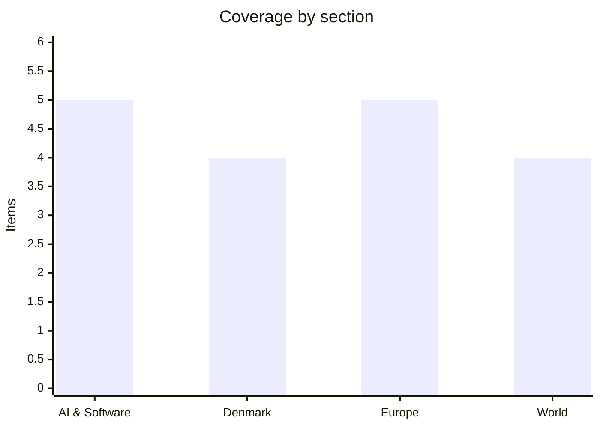

# Daily Briefing — 2026-09-01

**Top line:** US Central Command struck Islamic Revolutionary Guard Corps targets inside Iran on Tuesday after what it called attempted IRGC attacks on commercial shipping in the Strait of Hormuz and on American troops in the region — the second round of strikes in three days, and the sharpest escalation since the waterway crisis quietened a month ago.

## Follow-ups

- **Hungary says it made the deadline.** Transport and Investment Minister Dávid Vitézy announced on 31 August that Budapest had fulfilled all 27 "super milestones", clearing the way for the full €10.4bn. The Commission has not yet confirmed the assessment, so the money is not released — but the repayment scenario looks to have been avoided.
- **Yesterday's briefing put the Gymnich a day early.** The informal foreign ministers' meeting runs Wednesday 2 September in Wicklow, Ireland, under the Irish presidency — not Tuesday. EU defence ministers gathered there today ahead of it. Frozen Russian assets, a Franco-German plan to rein in Kaja Kallas, and a fresh 11-country push against foreign-policy vetoes are all on the table. Full items below.
- **Norway has a king who has sworn.** Haakon VIII took the oath of allegiance to the constitution before the Storting at 13:00 today, closing with "so help me God", after the President announced Harald V's death and the succession.
- **The Venstre revolt has doubled.** Four of Venstre's 18 MPs are now on record against the gødskningslov, up from two on Sunday — Anni Matthiesen says it is the first time in fifteen years she has broken the party line. Full item below.
- **Anthropic's S-1 is still confidential.** Nothing new on EDGAR; the draft registration filed on 1 June 2026 remains under SEC review, and the post-Labor-Day window opens next week.
- **Nvidia and Hugging Face: six days, still no confirmation.** No press release, no filing, no denial since The Information's $12.9bn report on 26 August.
- **Nepal has passed a grim threshold.** The Nepal–Tibet flood death toll went above 1,000 on Tuesday, with 3,916 still listed missing. Full item below.

## AI & Software

**A security researcher chained Claude Code's Auto Mode into full remote code execution at a 60–80% success rate, and Anthropic classified the finding "Informative".**
Johann Rehberger, writing as wunderwuzzi at Embrace The Red, published a five-step exploit chain against Claude Code running Opus 5 in Auto Mode. The chain starts by serving an HTTP 415 response that pushes Claude off its sandboxed WebFetch tool and onto `curl`, then delivers a ZIP archive containing a malicious `struct.py` that shadows Python's standard-library module of the same name. Claude is then induced to write its own base64 decoder, whose execution triggers the poisoned import. Rehberger reports the chain succeeding 60–80% of the time. Anthropic's response is the interesting part: it triaged the report as "Informative" rather than a vulnerability, on the grounds that Auto Mode is a convenience feature and not a security boundary, and that real protection requires OS-level sandboxing and network egress controls. That position directly contradicts third-party evaluations that had reported a 0.00% attack success rate against Auto Mode — a number that only holds if you treat Auto Mode as a boundary in the first place. For anyone running agentic coding tools against untrusted repositories or web content, the practical takeaway is unchanged and now explicit from the vendor: sandbox the process, not the prompt. Expect this to become the reference case the next time an agent framework is asked what its threat model actually is.
[Embrace The Red](https://embracethered.com/blog/posts/2026/breaking-claude-code-opus-5-and-automode/)

**DeepSeek quietly dropped a 305B open multimodal model on Hugging Face under an MIT licence.**
DeepSeek-V4-Flash-Vision-Exp is an experimental 305-billion-parameter model built on the V4-Flash architecture with a vision encoder bolted on, published without an announcement post. The model card claims substantial multimodal agent gains over the July V4-Flash-0731 checkpoint: ApexBench Pass@1 of 36.5 against 26.2, and Agents' Last Exam at 27.3 against 25.2. Text-only agentic performance is roughly held rather than improved — Terminal Bench 2.1 at 83.9 and DeepSWE at 59.3 — which suggests vision was added without the usual regression tax. The weights ship with vLLM and SGLang serving recipes on day one, which matters more than the benchmark table for anyone actually deploying it. All of these figures are DeepSeek's own; no independent replication has appeared yet. The MIT licence is the aggressive part: it puts a frontier-adjacent multimodal agent model into fully permissive commercial use at a moment when Tencent's 770B Hy4-preview (Apache 2.0, 1M-token context) landed three days earlier and Moonshot's Kimi K3 is already sitting at the top of Frontend Code Arena. The open-weight tier is now being contested almost entirely by Chinese labs, and increasingly on licence terms rather than raw scores.
[Hugging Face model card](https://huggingface.co/deepseek-ai/DeepSeek-V4-Flash-Vision-Exp)

**Nvidia put $3.5bn into MediaTek and pulled it onto NVLink Fusion — the latest round of AI-sector circular financing.**
Nvidia said on Monday it will buy $3.5bn of convertible bonds from Taiwan's MediaTek, deepening a partnership under which MediaTek adopts NVLink Fusion so that customers building custom XPUs can wire them into Nvidia rack-scale AI factories. MediaTek is guiding to roughly $2bn in AI chip revenue this year, so Nvidia's investment is worth more than the AI business it is buying into. The agreement also extends existing work on RTX and DGX Spark local-AI silicon and on Dimensity Auto for AI-defined vehicles. The structural read is the one investors keep flagging: Nvidia is again financing a company whose products will extend and consume the Nvidia stack, a pattern that turns supplier revenue into a partly self-funded loop. That concern is not abstract this week — the Wall Street Journal reported on Saturday that Nvidia has paused its AI Compute Partnership, a programme that guaranteed rentals to smaller GPU clouds in exchange for half of revenue above a base hourly rate, less than two months after launch and after racking up $36bn in commitments, with employees warning customers it could invite antitrust scrutiny. Read charitably, NVLink Fusion is Nvidia opening its interconnect to third-party accelerators and defending the rack rather than the chip. Read sceptically, it is Nvidia buying the appearance of an ecosystem. Both readings are consistent with the facts as announced.
[Bloomberg](https://www.bloomberg.com/news/articles/2026-08-31/nvidia-to-invest-3-5-billion-in-chipmaker-mediatek)

**A ransomware crew ran Cursor's coding agent to plan and execute intrusions at more than twenty organisations.**
CloudSEK and Gambit Security published research saying Russian-speaking affiliates of the Aurora ransomware operation used Cursor Agent — running Anthropic's Claude Sonnet — to plan and carry out attacks, prompting it in Russian and deliberately excluding CIS address ranges from targeting. Gambit tracked hands-on Cursor exploitation across ten targets between 8 April and 21 May 2026; CloudSEK counted more than twenty victims across nine countries. The researchers estimate the agent made operators 30–50% faster, which is the figure worth arguing about: it is an estimate from incident telemetry, not a controlled measurement, and it describes speed rather than capability uplift. Aurora ships Windows and Linux encryptors written in Zig. The pattern echoes last week's Sysdig finding of a stolen Ollama server running a nine-stage autonomous exploitation framework, and it points the same way — attackers are not building bespoke offensive AI, they are using the same commercial coding agents defenders use, with the same productivity gains. Cursor is now owned by SpaceX following the $60bn Anysphere acquisition, and is separately losing OpenAI model access on 12 November. Nothing in the research suggests a flaw in Cursor or Claude; the tooling worked as designed for a customer who should not have been one.
[The Hacker News](https://thehackernews.com/2026/08/aurora-ransomware-operators-use-cursor.html)

**The FTC and 22 state attorneys general sued Amazon on Monday, alleging a secret surcharge inside its ad auctions overcharged advertisers by more than $20bn.**
The complaint centres on second-price auctions, the long-standing industry mechanism in which the winning bidder pays just above the second-highest bid. The FTC alleges that in 2019 Amazon added an undisclosed "soft reserve price" to those auctions without telling advertisers, raising clearing prices while advertisers continued bidding on the assumption they were in a true second-price auction. The agency says Amazon made the change "because it was unhappy about how much revenue its advertising auctions were generating", and cites internal documents in which employees allegedly discussed raising prices while hoping advertisers would not notice and cut spend. The FTC puts the extraction at more than $20bn since 2019, affecting over 1.2 million advertisers, and is seeking penalties, restitution and an injunction. Twenty-two states joined, including California, New York, Florida, Texas's neighbours Oklahoma and Louisiana, and Washington — Amazon's home state. Amazon has not conceded the characterisation and the allegations are untested. The AI angle here is thin — this is algorithmic ad pricing, not model behaviour — but it matters for anyone buying attention through a black-box auction, which is now most of the ad market.
[FTC press release](https://www.ftc.gov/news-events/news/press-releases/2026/08/ftc-states-sue-amazon-over-secret-ad-surcharge-scheme) · [CNBC](https://www.cnbc.com/2026/08/31/amazon-ftc-lawsuit-advertisers.html)

## Denmark

**Roughly 300 tractors rolled onto Christiansborg Slotsplads this morning as the gødskningslov reached its second reading — and the Venstre revolt has doubled to four MPs.**
Bæredygtigt Landbrug called the demonstration for 09:30, with the tractor convoy timed to arrive on the square at 10:00, and police had warned of significant traffic disruption across the approaches to Copenhagen. The bill, formally L5, tightens nitrogen rules on fertiliser and manure application; it passed second reading today and faces the decisive third reading on Thursday 3 September. The political story has moved: where Søren Gade and Amanda Heitmann were the only named Venstre rebels on Sunday, four of the party's 18 MPs are now on record against the party line, including Anni Matthiesen, who says it is the first time in fifteen years in the Folketing that she has voted against her own party. Berlingske quotes political analyst Jacob Bruun saying it is "a situation where Venstre can only lose" — the party alienates either its rural base or its urban environmental voters whichever way it goes, which is unusually stark for a governing-adjacent party under Troels Lund Poulsen. Around 4,500 people had signed up for a protest meeting in Odense on Monday. The rhetoric has escalated too: organisers have compared the law's consequences to the mink cull, claiming it will be "200 times worse than the mink scandal" — a framing that is politically potent in Denmark and empirically unsupported. Since the government does not need Venstre's rebels to pass the bill, the vote is likely to succeed regardless; the question is what it costs Venstre internally.
[TV 2 live](https://nyheder.tv2.dk/live/politik/2026-08-31-ny-lov-vaekker-vrede-i-landbruget) · [DR](https://www.dr.dk/nyheder/politik/fire-ud-af-18-v-politikere-gaar-mod-formanden) · [LandbrugsAvisen](https://landbrugsavisen.dk/snesevis-af-traktorer-ventes-at-indtage-koebenhavn-i-protest-mod-goedskningslov-320930)

**Thirty-eight of Denmark's 108 coastal waters are now in oxygen depletion — the evidence the fertiliser fight is actually about.**
The latest count, dated 27 August, puts more than a third of Danish coastal waters under iltsvind, against 33 and 34 at the same point in 2025 and 2024. Several areas are affected for the first time in years: Skælskør Fjord for the first time in fourteen years, Præstø Fjord for the first time in sixteen. Danmarks Naturfredningsforening, which compiled the tally, attributes the pattern to nitrogen runoff from agricultural fertiliser and manure combined with a warm summer raising water temperatures and reducing oxygen solubility. The mechanism is not disputed by the agricultural side; the disputed question is the marginal contribution of Danish nitrogen limits versus temperature and legacy nutrient loading in sediment. This is the substantive backdrop to the tractors on Slotsplads — the government's case for L5 rests on exactly these numbers, and the timing of a record depletion year immediately before the third reading is politically convenient in a way that will be noted. Fishermen's organisations have flagged the same figures, which puts two rural constituencies on opposite sides. Whatever passes on Thursday, the ecological lag means the coastal waters will not respond within this parliamentary term.
[Danmarks Naturfredningsforening](https://www.dn.dk/nyheder/2026/efter-varm-sommer-historisk-mange-danske-kystvande-ramt-af-iltsvind/) · [Sportsfiskeren](https://www.sportsfiskeren.dk/natur-og-fiskeripolitik/nyheder/2026/08/historisk-mange-danske-kystvande-ramt-af-iltsvind)

**The government is sending DKK 1bn to the 22 most financially pressed municipalities, with Lolland taking more than a fifth of it.**
The Ministry of Economic Affairs and the Interior announced the allocation on Monday. The særtilskud pool for particularly hard-pressed municipalities has been raised from DKK 800m in 2026 to DKK 1bn for 2027, an increase of DKK 200m, and forms part of the 2027 economic agreement between the government and KL that also lifts municipal service spending in real terms by DKK 3.3bn. Forty-five municipalities applied. Lolland receives by far the largest single share at roughly DKK 220m — close to a quarter of the entire pool — reflecting a structural position that grants alone do not fix: shrinking population, school closures, and elder care the ministry itself describes as insufficient. Frederikshavn gets DKK 67m. The ministry says it will additionally open talks on development partnerships with Lolland, Langeland, Læsø and Morsø, which is the more interesting signal: a recognition that four municipalities are past the point where annual hardship transfers are a policy rather than a subsidy. The counter-argument, which will be made in the coming budget rounds, is that a pool topped up by DKK 200m and spread across 22 recipients is small relative to the demographic gradient it is meant to offset.
[Økonomi- og Indenrigsministeriet](https://oem.dk/nyheder/nyhedsarkiv/2026/august/1-milliard-kroner-til-landets-mest-pressede-kommuner) · [DR](https://www.dr.dk/nyheder/indland/22-af-landets-mest-pressede-kommuner-faar-millardstor-haandsraekning)

**Maersk is charging $1,000 per container to transit the Strait of Hormuz, and Tuesday's US strikes make that surcharge look durable.**
Maersk's Middle East Operational Update 43, dated 19 August, confirms an additional USD 1,000 per container on vessels transiting Hormuz, covering insurance premiums and crew risk compensation, and replacing the separately billed costs of its landbridge routing. That sits on top of an Emergency Freight Rate for onward transport to the upper Gulf and a fuel surcharge that runs at a minimum of 15% of the transportation rate. Maersk has previously described the Hormuz energy shock as roughly $500m a month in extra cost it must pass through, and the company's first-half profits were down partly as a result. Today's CENTCOM strikes on IRGC targets — following Sunday's strikes on what the US described as minelaying forces — make a near-term normalisation of the waterway harder to argue for. For Denmark this is not a foreign story: Maersk is the country's largest company by revenue and the Gulf disruption feeds directly into Danish corporate earnings, and through freight rates into European consumer prices. Analysts have estimated a sustained $15-per-barrel rise could add about half a percentage point to European consumer prices, though Europe's high fuel taxation dampens the pass-through relative to the US. The surcharge is the honest signal here: shipping lines price risk before governments describe it.
[Maersk Middle East Operational Update 43](https://www.maersk.com/news/articles/2026/08/19/middle-east-operational-update-43) · [CNBC](https://www.cnbc.com/2026/08/13/maersk-earnings-shipping-hormuz-red-sea.html)

## Europe

**Germany formally blamed Russia for the explosive drone found at Leipzig airport, ordered the Russian consulate in Bonn closed, and got NATO and the Commission behind it within hours.**
The device was discovered on the evening of 4 August next to a Ukrainian aircraft at Leipzig and was defused; Berlin's attribution to Russia came on Tuesday after four weeks of investigation. Germany's foreign minister ordered the closure of the Russian consulate in Bonn and the Russian House in Berlin, and Berlin is tightening entry controls on Russian nationals. Ursula von der Leyen said she stands in "full solidarity" with Germany, that "hybrid attacks will not go without a clear response", and that she will raise the incident with NATO Secretary-General Mark Rutte at their meeting on Wednesday, with further sanctions to be prepared by foreign ministers. Rutte said the evidence "is clear" and that NATO will keep strengthening deterrence against "malign actions like those seen in Leipzig and elsewhere across the Alliance". The significance is the formality: European governments have described a pattern of Russian hybrid activity for two years, but a named state attribution attached to a specific explosive device at a specific airport is a different legal and diplomatic object than a warning about drones over airports. It lands the day before the Gymnich, which will now discuss sanctions with a concrete case in hand. Denmark has its own unresolved drone incidents from last autumn, and the Danish precedent of considering NATO Article 4 will be reread in this light.
[Euronews](https://www.euronews.com/my-europe/2026/09/01/von-der-leyen-pledges-response-to-russian-hybrid-attacks-ahead-of-rutte-meeting) · [France 24](https://www.france24.com/en/europe/20260901-germany-blames-russia-for-leipzig-airport-drone-attack-orders-russian-consulate-closed)

**Russia hit Kyiv and the surrounding region with a massive missile and drone barrage overnight, killing at least twelve on the sixth consecutive day of strikes.**
Casualty figures diverge and are worth attributing carefully: Al Jazeera reports at least twelve killed across Kyiv and the region, Mayor Vitali Klitschko said at least eight died in the city with five injured and four more in the surrounding oblast, and Ukrainian Railways chief said seven were killed at a Kyiv rail depot, six of them railway employees. The strikes targeted energy and railway infrastructure specifically, which is the pattern Ukraine has warned about ahead of the heating season. Repeated hits on warehouses in the Kyiv region have left some supermarket shelves bare — a supply-chain effect rather than a shortage, but a visible one. This is the sixth straight day of strikes on the capital region, and follows Zelensky's claim last week that Russia fired nearly 2,000 drones, 1,600 glide bombs and 31 missiles in a single week. Ukraine's drone command has said Moscow intends to scale toward 200 missiles per attack. US-mediated talks have produced no ceasefire, with the two sides still apart on territory and on security guarantees. The infrastructure targeting is the part with the longest tail: rail and grid damage compounds through winter in a way that individual strike counts do not capture.
[Al Jazeera](https://www.aljazeera.com/news/2026/9/1/russian-drone-and-missile-barrage-kills-at-least-12-in-ukraines-kyiv) · [Euronews](https://www.euronews.com/my-europe/2026/09/01/at-least-four-people-killed-as-russia-launches-nighttime-ballistic-missile-attacks-targeti)

**Eleven member states, Denmark among them, wrote to Kaja Kallas demanding an end to "obstructive" vetoes on foreign policy — while Paris and Berlin separately move to put Kallas under von der Leyen.**
Austria, Belgium, Denmark, Finland, France, Germany, Luxembourg, the Netherlands, Romania, Spain and Sweden signed the letter, which sets out five principles including exploring options within the existing treaties to shift from unanimity to qualified majority voting. The mechanism at issue is the Article 31 passerelle clause, which allows the switch to be made in specific areas case by case without treaty change — a debate that has run in Brussels since Russia's full-scale invasion and has repeatedly stalled because activating the passerelle itself requires unanimity, including from the states whose vetoes it is meant to neutralise. Running alongside it, and reported by Euronews on Monday, is a Franco-German proposal to bring the High Representative under von der Leyen's supervision: Kallas would gain a hands-on coordinating role over Commission directorates handling development aid, humanitarian relief and defence industry, while von der Leyen would retain the final say, and the EEAS — which Kallas currently runs independently — would be weakened to reduce institutional clashes. That reform would require amending the 2010 Council decision establishing the EEAS rather than the Lisbon Treaty, but still needs unanimity. Both items go to the Gymnich in Wicklow on Wednesday. The two moves point in the same direction — more central control of EU foreign policy — but from opposite institutional motives, and the eleven signatories are not identical to the states that want Kallas clipped.
[Euronews on the letter](https://www.euronews.com/my-europe/2026/09/01/11-eu-countries-demand-end-to-obstructive-vetoes-on-foreign-policy) · [Euronews on the Franco-German plan](https://www.euronews.com/my-europe/2026/08/31/germany-and-france-float-plan-to-bring-kallas-under-von-der-leyens-supervision)

**Brussels designated ChatGPT a Very Large Online Search Engine under the DSA — the first standalone AI service brought under direct Commission supervision.**
The European Commission designated ChatGPT as a VLOSE and Reddit and Roblox as Very Large Online Platforms, after each crossed the DSA's 45-million-EU-user threshold. The reported figures are ChatGPT at 159 million monthly active users in the EU, Reddit at 57.2 million and Roblox at 48 million. All three have until the end of November to complete systemic-risk assessments, submit to independent audits and open data access to regulators, with non-compliance carrying fines of up to 6% of global annual revenue. The designation is conceptually significant: it treats a general-purpose assistant not as a model to be regulated for safety but as a distribution channel for information, with obligations around illegal content, systemic risk and protection of minors originally designed for social platforms and marketplaces. OpenAI is simultaneously subject to the AI Act, and European competition authorities are examining relationships between model developers, cloud providers and distribution platforms — a layered structure that makes Europe the most procedurally demanding market for a frontier lab. The classification as a *search engine* rather than a platform is the technical detail to watch, since VLOSE obligations differ and the reasoning will set precedent for every assistant that follows. OpenAI has not indicated it will contest the designation.
[Euronews](https://www.euronews.com/next/2026/08/31/eu-places-chatgpt-reddit-and-roblox-under-strictest-digital-safety-rules)

**Italy extended its Schengen suspension with Spain for another fifteen days, and Madrid immediately matched it.**
Rome first reintroduced border checks on travellers arriving from Spain on 1 August, after more than 80,000 migrants crossed into the Spanish enclave of Ceuta from Morocco in what was the single largest day of irregular arrivals in EU history. Giorgia Meloni's government has now rolled the suspension forward by a further fifteen days, covering air and sea arrivals, and Spain has responded in kind with spot checks on travellers arriving from Italy. EU citizens are largely unaffected in practice; the checks focus on verifying the legal status of non-EU travellers already inside the Schengen area. The tit-for-tat has visibly soured relations between two governments that are normally aligned on external border enforcement, which is the part worth watching — the dispute is not about whether to control the external border but about who absorbs the consequences when it fails. Each extension is legally framed as temporary and exceptional under the Schengen Borders Code; a second rollover starts to strain that framing. The Commission has not moved to challenge either suspension. With free movement now suspended between two founding-adjacent member states for a second month, the precedent is more durable than the fifteen-day horizon suggests.
[The Olive Press](https://www.theolivepress.es/spain-news/2026/09/01/italy-spain-border-checks-ceuta/) · [Euronews](https://www.euronews.com/my-europe/2026/07/31/italy-suspends-schengen-with-spain-over-ceuta-migrant-crisis-shuts-air-and-sea-borders)

## World

**US Central Command struck IRGC targets across southern Iran on Tuesday, the second round of strikes in three days.**
CENTCOM said the strikes followed "recent attempted attacks by the IRGC against commercial shipping in the Strait of Hormuz and against American service members deployed to the region". Iran's Fars news agency reported explosions around Bandar Abbas, Sirik and Qeshm, with local authorities also reporting strikes in the Chabahar and Konarak districts — a geographic spread that runs well beyond the strait itself and into Iran's southeastern coast. The sequence began on Sunday, when the US struck what it described as IRGC minelaying forces and rocket launchers on Larak Island, its first military action in the waterway in a month. Iran responded by firing missiles at US positions in Jordan, which were intercepted, and the UAE said it downed an Iranian drone over its waters. Both Washington and Tehran have insisted they control the strait, which is the claim that makes de-escalation hard: neither can concede the point without conceding the campaign. Commercial shipping has already priced the risk — Maersk's $1,000-per-container Hormuz surcharge is the clearest instrument reading available. Reported damage and casualties inside Iran come from Iranian state-linked outlets and have not been independently verified. The immediate question is whether Iran's response stays symbolic and intercepted, as on Sunday, or moves against shipping directly.
[Euronews](https://www.euronews.com/2026/09/01/us-military-says-it-struck-irgc-targets-in-iran-after-attacks-on-shipping-in-strait-of-hor) · [KWTX/AP](https://www.kwtx.com/2026/09/01/us-military-says-its-striking-targets-iran-over-attempted-attacks-shipping/)

**Xi, Putin and Modi signed the Bishkek Declaration at the SCO's 26th summit, pitching a multipolar order as the West escalates in the Gulf.**
The summit, hosted by Kyrgyz President Sadyr Zhaparov and marking twenty-five years of the organisation, brought the leaders of the ten member states to Bishkek under the theme of sustainable peace, development and prosperity. The declaration reaffirms commitment to international law and the UN Charter, calls for strengthening the UN's role, and backs what members describe as a more representative multipolar order with reforms to global governance giving states a more equal role in decision-making. Concrete measures cover regional security and counter-narcotics, transport and logistics links, AI and digital infrastructure, and energy and environmental cooperation. Xi and Putin met bilaterally for the first time since May, with Xi saying ties had grown "more solid" and should stay so despite "uncertainty and unpredictability in the international order" — language that reads as a comment on Washington without naming it. Iranian President Pezeshkian signed the declaration on the day US aircraft struck IRGC positions, which is the juxtaposition the summit will be remembered for. The SCO's practical output remains modest relative to its rhetoric, and its members disagree sharply among themselves — India and China most of all. But the assembly of Xi, Putin, Modi and Pezeshkian in one room, endorsing one text, is a picture that does political work regardless of what the text commits anyone to.
[The Express Tribune](https://tribune.com.pk/story/2626913/sco-leaders-adopt-bishkek-declaration-to-expand-cooperation-on-security-trade-and-technology) · [Al Jazeera](https://www.aljazeera.com/news/2026/8/31/putin-and-xi-affirm-strategic-alliance-amid-unpredictable-world)

**The Nepal–Tibet flood death toll passed 1,000 with 3,916 still missing, and the numbers keep getting worse rather than resolving.**
Officials in Nepal and China confirmed on Tuesday that confirmed deaths had gone above 1,000, up from 469 confirmed with 977 missing as of Sunday. The missing count now stands at 3,916 across Nepal, including at least 747 in the northern district of Rasuwa on the Tibetan border — of whom around 583 are tourists, with at least 64 Americans among them. At least 11,814 people have been rescued, with helicopters doing most of the work in areas where roads and bridges are destroyed. The disaster began with a glacial collapse high in the Himalayas that sent rock, ice and meltwater into the valleys below, generating floods that inundated the Trishuli River corridor, buried buildings and cut transport links. Private power producers in Nepal have publicly accused the authorities of losing crucial time in rescuing people trapped in hydropower tunnels — an allegation the government has not accepted. Families are posting photographs of missing relatives on a hospital wall in Kathmandu, and a Hindu temple in south London is missing sixteen of its members. The gap between 1,000 confirmed dead and nearly 4,000 missing is the number to watch: in comparable Himalayan flood events, most of that gap has historically closed toward the death toll rather than toward survivors.
[Euronews](https://www.euronews.com/2026/09/01/death-toll-passes-1000-from-catastrophic-flooding-in-nepal-and-china-officials-say) · [Al Jazeera live blog](https://www.aljazeera.com/news/liveblog/2026/9/1/nepal-tibet-floods-live-rescue-efforts-under-way-death-toll-crosses-1000)

**The terms of Trump's Venezuela oil deal are now public, and analysts are picking them apart faster than the market is pricing them.**
Trump announced on Friday that the US had secured majority control over more than 65 billion barrels of Venezuelan reserves, in a deal he called "the biggest oil deal in world history", negotiated by Secretary of State Marco Rubio and Defense Secretary Pete Hegseth with interim President Delcy Rodríguez. The published terms give the US 55% of effective output from a new private company, including an ownership stake and rights to buy oil at cost, covering development of 17 fields; proponents project up to $100bn of investment into Venezuela's oil industry and more than $209bn in taxes for Caracas over the life of the fields. The market reaction has been muted, which is the most informative datum: traders are not pricing 65 billion barrels of new supply, because Venezuela's production constraint has never been reserves but refining capacity, infrastructure decay, sanctions plumbing and unpaid legacy debts to prior operators. Fortune reported on Tuesday that energy and geopolitical analysts describe the structure as "colonial cronyism" and think it could easily fall apart, and there has been a Pentagon denial attached to at least one element of the account. Senator Tim Kaine called it "corruption at epic scale", framing Maduro's capture as the means to this end. None of the projected figures come from an independent assessment; they originate with the deal's promoters. Whether any barrels actually move is a question for 2027, not this quarter.
[CNBC](https://www.cnbc.com/2026/08/28/trump-announces-deal-with-venezuela-to-secure-more-than-65-billion-barrels-of-oil-reserves.html) · [Fortune](https://fortune.com/2026/09/01/trumps-biggest-oil-deal-world-history-venezuela-reeks-colonial-cronyism/) · [NPR](https://www.npr.org/2026/08/31/nx-s1-5949407/us-venezuelan-oil-deal)

## Watch list

- **Wednesday 2 September:** the Gymnich convenes in Wicklow with three live items — new Russia sanctions after the Leipzig attribution, the Franco-German plan to subordinate Kallas to von der Leyen, and the eleven-country push for qualified majority voting; von der Leyen meets Rutte the same day.
- **Thursday 3 September:** third and final Folketing vote on the gødskningslov, with four of Venstre's 18 MPs on record against the party line.
- **Iran's next move:** whether Tehran answers Tuesday's CENTCOM strikes with intercepted missiles at US bases, as on Sunday, or against commercial shipping — the latter would reprice Hormuz freight again.
- **Pending, no date:** Anthropic's public S-1, with the post-Labor-Day window opening next week and a music-publisher suit now attached; Nvidia and Hugging Face silent for a sixth day on the reported $12.9bn deal; the Commission's formal sign-off on Hungary's 27 milestones.
