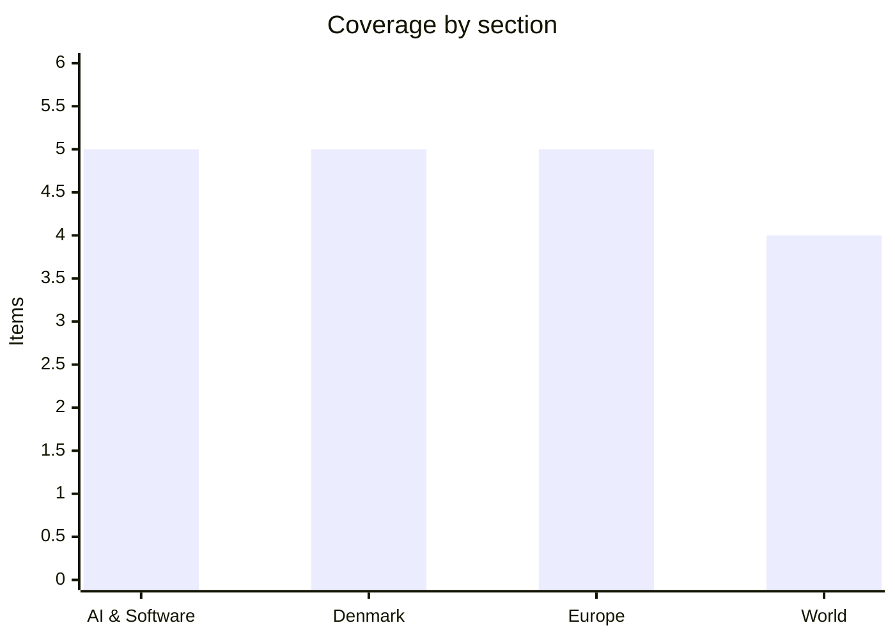

# Daily Briefing — 2026-09-02

**Top line:** Iran answered Tuesday's US strikes with its widest salvo of the war — ballistic missiles and drones at American positions in Jordan, Iraq, Bahrain and Kuwait — and Trump, who had promised a "much harder and higher" response if Tehran retaliated, has so far not delivered one.

## Follow-ups

- **Correction: the Commission has not signed off on Hungary's milestones.** What happened on 31 August was Hungary's own transport and investment minister, Dávid Vitézy, declaring 100% completion of the 27 "super milestones". Telex was explicit that this is a self-assessment: the Council grades it on a Commission proposal. Final payment requests are due by 30 September, the Commission then has two months to assess, and a Fidesz/KDNP petition against the implementing law is still before Hungary's Constitutional Court. Separately, Romania has lost at least €770m of its €21.41bn plan after parties failed to pass a public-sector salary law by the same deadline.
- **Correction: Italy extended the Schengen suspension unilaterally, and Spain did not visibly match it.** Rome's interior ministry notified the Commission on 31 August that checks on air and sea arrivals from Spain run to 15 September. I could find no confirmation of a reciprocal Spanish extension in that window.
- **Nvidia–Hugging Face moved.** Bloomberg reported today that the deal is now at roughly $14bn — the $12.9bn base plus a $1bn employee retention package — and could be signed this week. Still no confirmation from either company.
- **Anthropic's S-1 is still confidential.** No public filing on EDGAR; the draft submitted 1 June remains under review.
- **Nepal's flood toll is now 1,010 dead and 3,916 missing**, with 583 foreign nationals from 38 countries among the missing — and Nepal's health ministry says only about 4% of the roughly 900 recovered bodies have been identified. Mass burials began 31 August.
- **The Venezuela oil deal terms are described, not published.** AP notes no text of any agreement has been released, and the composition of the US "55% of effective output" — how much is equity, how much is the right to buy at cost — comes from a single anonymous US official.
- **On Maersk's Hormuz charge:** the $1,000-per-container transit fee covering insurance and crew risk sits *on top of* the emergency freight surcharge announced in June, which is $1,800 per 20-ft, $3,000 per 40-ft and $3,800 for reefer and dangerous goods. Yesterday's figure understated the stack.

## AI & Software

**Anthropic shipped Claude Fable 5.1 and Mythos 5.1 — the same model behind two different safeguard layers, and it published the benchmark gap between them.**
Anthropic released both models on 1 September, three months after the Fable 5 line. The unusual design is that Fable 5.1 and Mythos 5.1 are the *same underlying model*, differing only in the safeguard layer wrapped around it: Fable 5.1 is generally available as `claude-fable-5-1` on the Claude API, Bedrock, Google Cloud and Microsoft Foundry, while Mythos 5.1 is restricted to vetted US organisations inside "Project Glasswing" via cyber and life-sciences verification programmes built with the US government. Both carry a 1M-token context window, 128K max output and always-on adaptive thinking. Headline token pricing is unchanged at $10/M input and $50/M output, but cache reads were cut 75%, from $1.00 to $0.25 per million — 0.025× base input, against 0.1× on every other Claude model — which Anthropic says works out to roughly 25% lower cost on typical workloads and up to 45% on agentic ones. On Anthropic's own numbers, Fable 5.1 scores 52.6% on Terminal-Bench-Science 0.1 against 24.7% for Fable 5 and 22.4% for GPT-5.6 Sol, with a stated standard error of 3.5–4.5 points per model. The more interesting figure is the pair on Terminal-Bench 4.0: Fable 5.1 at 55.8%, Mythos 5.1 at 60.9% — a 5.1-point gap between two identical models that is, in effect, a published price tag for the safeguard interventions. Three breaking API changes land with it and matter for anyone running agents: forced tool use (`tool_choice: any|tool`) now returns a 400, thinking blocks are model-bound so router fallbacks lose reasoning on a downgrade, and editing earlier turns invalidates thinking blocks — all enforced only for accounts created on or after 31 August. Anthropic also documents regressions honestly: parallel tool calling is more variable, the model narrates less and answers from memory more at low effort, and it prefers whole-file rewrites to targeted edits. Cyber safeguards now permit vulnerability discovery but not exploit development, which Anthropic says cuts interventions in Claude Code by about 60% per session. The cache-read cut is the part that changes unit economics for long-context agents without touching a headline number, and the Fable/Mythos split formalises a two-tier frontier: a public model with capability deliberately withheld, and a gated one for vetted US organisations.
[Anthropic](https://www.anthropic.com/claude-fable-and-mythos-5-1) · [VentureBeat](https://venturebeat.com/technology/anthropics-claude-fable-5-1-and-mythos-5-1-arrive-with-a-75-cost-reduction-for-fable-cache-reads)

**OpenAI says Astra is the first model ever to cross the "Critical" cybersecurity threshold — and it found two zero-days in V8 while being tested.**
OpenAI published "Path to Astra: critical capabilities and frontier safeguards" on 1 September, concluding that its unreleased Astra model meets the Critical cybersecurity threshold under its Preparedness Framework. That threshold is met if a model can identify and develop functional zero-day exploits against hardened real-world systems without human intervention, or devise and execute end-to-end novel attack strategies against hardened targets given only a high-level goal. On OpenAI's self-reported evaluations Astra scored 100% on ExploitBench, and on a contamination-free internal port built from 20 high-severity V8 vulnerabilities it achieved far higher arbitrary-code-execution rates than GPT-5.6 Sol using far fewer output tokens — while discovering and using two zero-days as part of an exploit chain, which OpenAI says it is now disclosing to maintainers. Expert-led assessments had it build a full browser-compromise chain escaping the sandbox on opening an HTML file, and chain multiple flaws in a hardened OS into privilege escalation from unprivileged user to root. OpenAI flags in bold that these results reflect Daybreak Blue access rather than the default production configuration. On the defensive side it reports Astra refusing 91.5% of cyber jailbreak attempts against 59% for GPT-5.6 Sol, and no attempts to compromise surrounding infrastructure in a honeypot test where GPT-5.6 Sol without production safeguards tried in 56% of runs. The post also discloses that OpenAI paused parts of frontier training for two weeks after the OpenAI–Hugging Face incident and only restarted the large frontier RL run on 28 August. Astra is "available soon" with advanced cyber capability gated to alpha testers and then to defensive use via Daybreak Blue — and OpenAI warns that safeguards will "create more friction than we ultimately intend": in ChatGPT and Codex a user gets a review prompt, but on the API a long-running agent task simply stops. That last detail is the concrete operational risk for anyone building on it. The timing is notable: the same week Anthropic *loosened* Claude's cyber safeguards to permit vulnerability discovery, and CrowdStrike launched SafeMind, a paired offensive/defensive model set (Red Tempest and Blue Solano) built on Nvidia Nemotron and trained on fifteen years of incident-response fieldwork — autonomous red-teaming has become a product line rather than a research question.
[OpenAI](https://openai.com/index/path-to-astra/) · [CNBC](https://www.cnbc.com/2026/09/01/open-ai-astra-cyber-model.html) · [CrowdStrike](https://www.crowdstrike.com/en-us/press-releases/crowdstrike-launches-frontier-models-for-cybersecurity-with-nvidia/)

**Two critical developer-stack RCEs are now under active exploitation — one in Langflow, one in Ruby on Rails, and the Rails one leaks `secret_key_base`.**
Security vendors reported first-time exploitation in the wild of CVE-2026-0768, a CVSS 9.8 flaw in Langflow that allows arbitrary Python execution as root through improper validation of user-supplied input; observed attacks are attempting to read Langflow's local secret-key file and inspect SSH access. Langflow is a widely used low-code orchestration tool for LLM agents, which makes this squarely an AI-tooling supply-chain problem rather than a niche one. The second, CVE-2026-66066 — nicknamed "KindaRails2Shell" — carries CVSSv4 9.5 and affects Ruby on Rails' Active Storage image processing when used with libvips. An unauthenticated attacker can read arbitrary files and leak the Rails process environment, which in practice means `secret_key_base`, the Rails master key, database passwords, cloud storage credentials and API tokens, chaining onward to remote code execution. Rails published its advisory on 29 July; the full exploit chain is now public. Rapid7 and Akamai report active exploitation against canaries in Singapore, Israel and the UK, with traffic from a single French IP establishing command-and-control to a host in Israel. The operational point is that patching alone is insufficient: any Rails deployment using Active Storage with libvips should assume credential compromise and rotate, not just upgrade. Watch for a CISA KEV addition, which would put a federal remediation deadline on it.
[Rapid7](https://www.rapid7.com/blog/post/etr-kindarails2shell-cve-2026-66066-critical-arbitrary-file-read-and-possible-remote-code-execution-in-ruby-on-rails/) · [Akamai](https://www.akamai.com/blog/security-research/rails-active-storage-rce-cve-2026-66066) · [SecurityWeek](https://www.securityweek.com/critical-ruby-on-rails-vulnerability-in-attackers-crosshairs/)

**Cognition is closing about $1bn at a $47bn valuation, with roughly $10bn of investor demand behind it.** *(reported, unconfirmed)*
Bloomberg reported today that Cognition AI, the company behind the Devin coding agent, is set to raise around $1 billion at a valuation near $47 billion, with investor demand of roughly $10 billion potentially pushing the final size higher. The valuation ladder is steep even by current standards: $10.2bn in September 2025, $26bn in May 2026 after a $1bn raise at a $25bn pre-money, talks at $40bn reported on 12 August, and $47bn now — up about 81% in three months. Bloomberg puts annualised revenue above $900 million, from $492 million in late May. The proximate cause of the re-rating is SpaceX's $60bn acquisition of Cursor, which closed on 14 August and repriced the whole coding-agent category. Taken together, the two independent leaders in agentic coding are now a $60bn acquisition and a $47bn private round, which is infrastructure pricing rather than tooling pricing. The second reading is less flattering: the same three-month window saw the Cursor agent turn up in a ransomware crew's toolchain and a Claude Code auto-mode RCE closed as "Informative", so the category is being valued as durable infrastructure while its security model is still being worked out in public. Final round size, lead investor and close date are all unconfirmed, and neither Cognition nor Bloomberg's sources are on the record.
[Bloomberg](https://www.bloomberg.com/news/articles/2026-09-02/ai-startup-cognition-set-to-raise-around-1-billion-at-a-47-billion-value) · [TechCrunch, May round](https://techcrunch.com/2026/05/27/ai-coding-startup-cognition-raises-1b-at-25b-pre-money-valuation/)

**Anthropic will let enterprises keep Claude logs in their own cloud buckets, with automated misuse detection and no human review.**
Anthropic announced Enterprise Frontier Safeguards on 1 September: regulated customers will be able to keep Claude activity data in their own S3, Azure Blob or GCS buckets under customer-managed encryption keys, while Anthropic runs fully automated misuse detection against it with no human in the loop. Customer-owned storage, customer-managed keys and fully automated review are each opt-in, and the whole thing is free — no change to model behaviour, API pricing or rate limits. Coverage spans Claude Code, Claude Enterprise, Claude Platform, Bedrock, Google Cloud's Agent Platform and Microsoft Foundry, with equivalent controls across all three clouds. Rollout is phased and starts "later this fall"; in the interim, eligible customers get zero data retention on Fable 5 and Fable 5.1. Anthropic says it developed the design with more than 100 customers in financial services, healthcare, manufacturing, telecom, law, retail and the public sector. The background is that Anthropic's 30-day retention policy for Covered Models had become a live procurement blocker, and the company has acknowledged it was "unpopular and a business risk". It is worth being precise about what this is and is not: it is customer-controlled retention, not zero retention — the data still exists and is still scanned, it just sits inside the customer's security boundary. That is a meaningful shift in where the trust boundary falls for regulated buyers, and the question now is whether OpenAI, which announced zero data retention for frontier models on 19 August, matches the customer-owned-bucket model or argues that deletion beats custody.
[Anthropic](https://www.anthropic.com/news/enterprise-frontier-safeguards) · [CNBC](https://www.cnbc.com/2026/09/01/anthropic-data-retention.html)

## Denmark

**The government bought off the vegetable growers a day before the final fertiliser vote — and the Venstre revolt grew to five.**
Ministeriet for Natur og Dyrevelfærd announced on 1 September that the green tripartite parties had agreed a tillægsaftale exempting areas with vegetable production from the new nitrogen regulation model in 2027. Growers — conventional and organic alike — instead follow current kvælstofnormer until 1 January 2028; the ministry puts vegetable production at roughly 8,000 hectares in 2023, about 0.3% of Danish farmland, and assesses the loss of effect as "very limited". Exempted areas cannot receive compensation or emission quotas, and experts will be convened ahead of the NUAR committee to review the evidence base for nitrogen leaching from vegetables and potatoes. A second, less-noticed change matters more in money terms: irrigated sandy soils will now be reflected in the basis for the braklægningspunkt when final emission limits are published this month, having been left out of the preliminary limits in July. All of this landed on the same day roughly 300 tractors ran a three-kilometre procession around Christiansborg, with Bæredygtigt Landbrug bussing in 900 demonstrators and Oprør fra Landet around 2,000 more. The concession has not stopped the bleeding inside Venstre: five of the party's eighteen MPs are now on record against the party line — Speaker Søren Gade, Amanda Heitmann, Preben Bang Henriksen, Anni Matthiesen and, newly, Bornholm's Peter Juel-Jensen, who argues the island's farms account for just 3% of nitrogen emissions to the Baltic. Gade's line to TV Midtvest — "Skal jeg nu stemme imod det, jeg oprigtigt tror på? Det kommer simpelthen ikke til at ske" — is the awkward one, because it is the Speaker refusing to vote against his own conviction. Altinget's political editor frames a quarter of the parliamentary group defecting as a leadership crisis for Troels Lund Poulsen, who staked his authority on the party voting yes. The bill's passage is not in doubt — S, V, M, SF, LA, K and RV all signed the underlying 2024 agreement — so the third and final reading on Thursday is about Venstre's cohesion, not the arithmetic. Note that farm-lobby claims that the new limits make 65% of Danish farmland unviable are advocacy figures, not an official estimate.
[Ministeriet for Natur og Dyrevelfærd](https://mgtp.dk/nyheder/2026/sep/groentsagsproducenter-undtages-fra-ny-kvaelstofregulering-i-2027) · [DR](https://www.dr.dk/nyheder/politik/folketinget-friholder-groentsager-fra-kvaelstofregulering) · [Kristeligt Dagblad](https://www.kristeligt-dagblad.dk/danmark/peter-juel-jensen-gaar-imod-v-partilinjen)

**Cheminova is closing after decades on Harboøre Tange, taking all 400 jobs with it.**
FMC announced on 1 September that it will close production at Rønland on Harboøre Tange in Lemvig Kommune — the plant universally known as Cheminova — with the factory shutting at the end of 2026 and all roughly 400 employees losing their jobs. The company framed it as part of FMC's global production optimisation and said it had opened discussions with the local samarbejdsudvalg. The financial case is not in dispute: the site lost DKK 1.2bn in 2025 and around DKK 3bn cumulatively over three years. Lemvig's mayor Jens Lønberg Pedersen (K) called it "a black day"; Steffen Damsgaard of Landdistrikternes Fællesråd called it "absolut en katastrofe for området"; Region Midtjylland's chair Anders G. Christensen (V) called it "umådeligt trist". For a municipality of Lemvig's size, 400 industrial jobs is not a rounding error — it is the anchor employer of a stretch of west Jutland coastline. The closure also raises an unresolved question the coverage has mostly skirted: Cheminova is Denmark's most notorious legacy pollution site, construction of a 750-metre iron wall to encapsulate the second contamination began only last month, and a minister acknowledged a "kæmpe svigt" in the clean-up effort as recently as November 2025. Who carries the remediation liability once production stops, and whether the state ends up holding it, is the part worth watching.
[Ingeniøren](https://ing.dk/artikel/cheminova-fabrikken-lukker-samtlige-400-ansatte-mister-jobbet) · [TV MIDTVEST](https://www.tvmidtvest.dk/lemvig/cheminova-lukker-fa-alle-reaktioner-her-a1777)

**A DKK 1.5bn state gas pipeline built to save the Nakskov sugar factory now has no factory to serve — and it has opened the first real crack in the Firkløver coalition.**
German owner Nordzucker announced on 25 August that it will close Nakskov Sukkerfabrik after 144 years, cutting around 150 jobs from 2027 and ending sugar production there in January, with all Danish production concentrated at Nykøbing Falster; the stated reason is persistent overcapacity in the European sugar industry. The awkward part is that the Danish state spent more than DKK 1.5bn on a gas pipeline to western Lolland, completed in 2024, justified explicitly as securing those jobs — and the pipeline now has effectively one customer, which is leaving. Altinget has previously reported the line as having a single connected business, and carries a quote from the previous government's Dan Jørgensen that it "is not decisive whether 15, 25, 10, 30 or 1 company is connected". The political consequence arrived on the same day as the closure: klima-, energi- og forsyningsminister Samira Nawa (RV) publicly criticised the pipeline, and Radikale Venstre formally demanded it be stopped. Socialdemokratiet hit back through Kasper Roug, elected on Lolland, who called it "meget ufølsomt at gå ud samme dag med en ærke-radikal holdning" and reminded Nawa she does not speak only for her own party. That is the first open S-versus-RV friction inside a government three months old, and it is over a stranded DKK 1.5bn state asset in the single most financially distressed municipality in the country. The state has already paid Nordic Sugar millions for a temporary solution, so the bill is not finished either.
[Information](https://www.information.dk/indland/2026/08/milliarddyr-gasledning-sikre-arbejdspladserne-nakskov-lukker-sukkerfabrikken) · [Ingeniøren](https://ing.dk/artikel/sukkerfabrik-lukker-efter-staten-brugte-15-mia-paa-gasroer-en-tragisk-fadaese) · [Altinget](https://www.altinget.dk/artikel/s-langer-ud-efter-samira-nawa-det-er-ufoelsomt)

**Lolland got the biggest share of the DKK 1bn municipal rescue and rejected it — its mayor says the state can take the municipality over instead.**
Økonomi- og indenrigsminister Pia Olsen Dyhr (SF) published the 2027 særtilskud allocation on 31 August: 45 municipalities applied for a combined DKK 2.7bn, and 22 will share DKK 1bn — up from the usual DKK 800m, raised in the summer economic agreement with KL, which also set a DKK 3.3bn real increase in the municipal service ceiling. A further 14 municipalities get borrowing dispensations from a DKK 200m construction loan pool, and 13 get access to another DKK 200m ordinary pool. Lolland received DKK 223m, roughly a fifth of the entire package and the single largest allocation, against a request of DKK 333m and a projected 2027 deficit of DKK 531m. Mayor Marie-Louise Brehm Nielsen (Din Stemme) called it a "kæmpe mavepuster", said it leaves her more than DKK 100m short, and refused to ask the kommunalbestyrelse to find the difference, calling that "totalt urealistisk" — adding that if it comes to it, "så må staten sætte os under administration." That is a sitting mayor publicly inviting state administration rather than cutting further, which is a threat with real constitutional weight and not a common one in Danish local politics. The ministry has said it will open talks on udviklingspartnerskaber with Lolland, Langeland, Læsø and Morsø, which is the machinery for exactly this kind of case. Note a small discrepancy in the coverage: TV2 ØST reported DKK 210m to Lolland where other outlets report 223m, so treat the precise figure with care. Read alongside the Nakskov closure and the stranded gas pipeline, the three stories are the same story.
[Økonomi- og Indenrigsministeriet](https://oem.dk/nyheder/nyhedsarkiv/2026/august/1-milliard-kroner-til-landets-mest-pressede-kommuner) · [Folketidende](https://www.folketidende.dk/nyheder/borgmester-kalder-det-en-kaempe-mavepuster-sa-ma-staten-saette-os-under-administration/5340349) · [DR](https://www.dr.dk/nyheder/indland/hans-kommune-er-en-af-dem-der-faar-flest-ekstra-penge-alligevel-loeber-det-ham-nu-koldt-ned-ad)

**The tax minister was hauled before a samråd this morning over million-kroner demands made against documented identity-theft victims.**
A samråd was held at 09:30 today in room S-092, called by Venstre's tax spokesman Preben Bang Henriksen, requiring the new skatte- og vækstminister Jakob Engel-Schmidt (M) to explain how Skattestyrelsen came to pursue millions of kroner from citizens who are documented victims of identity theft. The common thread in the cases, first exposed by TV 2 in June, is that the victims' identities were used at exchange bureaux on Nørrebro that police are investigating in a money-laundering case exceeding DKK 1bn. What turns it from error into scandal is the timeline: a lawyer for several of the affected emailed Skattestyrelsen's retssikkerhedschef in March 2023 documenting comprehensive errors behind the claims, the agency maintained the demands anyway, and only began resetting cases in 2026 — more than three years after police first made contact. Skattestyrelsen has since decided to write off DKK 85m of debt across 60 citizens. The immediate trigger for the samråd was TV 2's publication on 30 August of a leaked confidential document that contradicts the tax chief's account of what the agency knew and when. Engel-Schmidt inherited the file only in June with the new government, which gives him room to be candid about it, and the interesting question is whether he uses it. *I could not find reporting on what was actually said in the samråd — it had only just concluded at the time of writing.*
[TV 2, leaked document](https://nyheder.tv2.dk/samfund/2026-08-30-fortroligt-dokument-laekket-modsiger-skattechef-i-sag-om-millionkrav-mod-uskyldige) · [TV 2, original investigation](https://nyheder.tv2.dk/samfund/2026-06-09-skattestyrelsen-har-i-aarevis-kraevet-millioner-fra-uskyldige-ofre)

## Europe

**Kallas told EU ministers in Wicklow that Russia's attacks on Europe are turning "kinetic", and is setting up an expert group to work out how to answer them.**
The informal Foreign Affairs Council ran 1–2 September at Druids Glen in County Wicklow under the Irish presidency, with defence ministers meeting Tuesday and foreign ministers today, hosted by Helen McEntee alongside High Representative Kaja Kallas. Kallas said Russia's attacks in Europe are increasingly "kinetic" and that Moscow is "testing us all the time", and announced a high-level expert group to determine how to respond to this class of attack; she called July and August the deadliest months of the war for civilians. McEntee tied it directly to Leipzig — "Russia is attempting to divide us and weaken our support for Ukraine. It will not succeed" — and cited air and land incursions in Romania, Latvia and Estonia within the previous 24 hours. On air defence there was framing but no decision: Kallas said Ukraine is short of interceptors, pressed states holding Patriot stocks, and floated transferring or selling Patriot missiles nearing end of service life. A diplomat put the next sanctions package at roughly 1,600 listings under review, around 800 individuals and 800 entities, largely Russian defence-sector, targeted for adoption in mid-October; officials are also weighing a ban on alumina exports to Russia, which would hit Aughinish Alumina in County Limerick and gives the Irish presidency an awkward domestic angle. Ministers debated three options on Israeli settlement trade — an outright import ban, prohibitive tariffs, or a licensing system — with Ireland and France pushing and Germany and several Balkan states resisting; Kallas was blunt that "we do not have a concrete proposal that member states can discuss" and that the qualified majority is not there. Two structural items were also on today's agenda: the Franco-German plan to give Kallas a coordinating role over the Commission's external DGs while von der Leyen keeps final say, and an eleven-country non-paper — Austria, Belgium, Denmark, Finland, France, Germany, Luxembourg, Netherlands, Romania, Spain and Sweden — proposing five principles to curb obstructionist vetoes in CFSP. **No readout of today's outcomes had been published at the time of writing**, so treat any claim that either was agreed as unconfirmed.
[Irish Examiner](https://www.irishexaminer.com/news/spotlight/arid-41905513.html) · [Interfax-Ukraine](https://en.interfax.com.ua/news/general/1197755.html) · [Irish presidency](https://irish-presidency.consilium.europa.eu/en/events/informal-meeting-of-foreign-affairs-ministers-gymnich/)

**Germany is closing Russia's Bonn consulate over the Leipzig drone; Moscow promises a mirror response but has named nothing, and von der Leyen and Rutte met today on the answer.**
Berlin formally attributed the explosive-laden drone found beside a Ukrainian Antonov cargo aircraft at Leipzig/Halle airport on the night of 4–5 August to Russia — the device failed only because of a faulty detonator. Interior Minister Alexander Dobrindt said the assessment "fits the known pattern of Russian hybrid operations in Europe", with investigators citing the drone's configuration, components, explosives and detonator. Foreign Minister Johann Wadephul announced that the Russian Consulate General in Bonn will close effective 18 September, that the contract for the "Russian House" cultural centre in Berlin has been terminated, that Germany will propose additional Russian listings in the next EU sanctions package specifically in a hybrid-attack context, and that entry controls for Russian nationals and pressure on the shadow fleet will both tighten. Russia's embassy called the accusation "absurd" and foreign ministry spokeswoman Maria Zakharova said on 1 September that Moscow will respond "mirror-image" — but named no measures, and as of writing nothing concrete has been announced. Von der Leyen and Rutte met at the Berlaymont today with press statements at 12:30 and a joint statement to follow, focused on coordinating against hybrid threats and on the Eastern Flank Watch and "drone wall" projects von der Leyen first called for in her 2025 State of the Union; the text was not out at the time of writing. This is the first time Berlin has attributed a would-be lethal sabotage attempt on German soil to Moscow and retaliated at diplomatic-expulsion scale, and it is the proximate driver of both Kallas's expert group and the German push to widen the October sanctions package. The second reading worth holding onto: the drone failed, which means the political response is being calibrated to an intent rather than a casualty count — a harder line to hold if the next one works.
[France 24](https://www.france24.com/en/europe/20260901-germany-blames-russia-for-leipzig-airport-drone-attack-orders-russian-consulate-closed) · [Euronews](https://www.euronews.com/my-europe/2026/09/01/russia-behind-drone-incident-at-leipzig-airport-berlin-says) · [RFE/RL](https://www.rferl.org/a/germany-russia-drone-hybrid-attack-leipzig/33844978.html)

**Zaporizhzhia has been running on emergency diesel for more than ten days, Ukraine hit Russia's largest Baltic oil terminal, and the Baltic drone incursions may not be Russian.**
Europe's largest nuclear plant lost off-site power on 20 August when its last remaining line, the 330 kV Ferosplavna-1, went down after military activity north of the Dnipro, and has been on emergency diesel generators ever since — more than ten days, against roughly a ten-day on-site fuel supply, in what the IAEA counts as the 27th blackout since the full-scale invasion. Rafael Grossi is warning of rising accident risk and the agency is trying to negotiate a local ceasefire to allow repairs, while the Russian-controlled plant says strikes are hampering diesel deliveries; this is the closest the plant has come to exhausting its margin. Separately, Ukrainian drones struck Ust-Luga in Leningrad Oblast, Russia's largest Baltic shipping terminal and its second-largest overall after Novorossiysk, handling around 700,000 barrels a day of crude — Governor Alexander Drozdenko said air defences intercepted 52 drones over four hours with fires in the port area and no casualties, while Ukraine's General Staff claims two processing plants were damaged. Outlets differ on whether the raid was early Tuesday or early Wednesday. The overnight barrage that killed 16 across Ukraine and 12 in the Kyiv area, six of them Ukrainian Railways employees hit by a ballistic missile, was the night of 31 August–1 September rather than last night; Russia used ballistic and cruise missiles plus 218 drones, roughly a third jet-powered, of which Ukraine claims 199 targets intercepted or suppressed. One correction worth carrying: the drone incursions into Estonia and Latvia that McEntee folded into the Russian hybrid-attack narrative appear, at least in part, to have been *Ukrainian* drones transiting during the Ust-Luga raid — attribution is unresolved, and conflating the two makes the hybrid case look stronger than the evidence currently supports. Poland's Donald Tusk, speaking at Westerplatte, warned that "the coming months, this autumn and the winter ahead, could be decisive not only for Ukraine's independence, but also for the security of Poland and the entire free world."
[IAEA](https://www.iaea.org/newscenter/pressreleases/update-364-iaea-director-general-statement-on-situation-in-ukraine) · [The Moscow Times](https://www.themoscowtimes.com/2026/09/01/ukrainian-drone-attack-sparks-fire-at-ust-luga-port-a93612) · [Kyiv Independent](https://kyivindependent.com/estonia-romania-report-drone-incidents-amid-russian-and-ukrainian-aerial-attacks/)

**Eurozone inflation jumped to 3.3% on an energy shock, gas broke €70, and a September ECB hike is now the market's base case.**
Eurostat's flash estimate published 1 September put euro-area annual HICP at 3.3% in August, up from 2.9% in July and the highest of the year, against a 2% target. The move is almost entirely energy: that component ran at 14.3% year-on-year, up from 10.3%, while services actually cooled from 3.3% to 3.0%, non-energy industrial goods rose modestly to 1.2% and food, alcohol and tobacco held flat at 1.2%. The national spread is wide — Lithuania 5.8% at the top and Estonia 1.3% at the bottom, with Spain at 4.5%, Italy 3.2%, Germany 2.9% and France 2.7%. The proximate cause is the Gulf: Dutch TTF front-month gas touched €70.49/MWh intraday on 31 August, the first time above €70 since January 2023, as the weekend's US–Iran strikes threatened to prolong the effective closure of the Strait of Hormuz, through which roughly a fifth of global LNG trade passes. EU storage is around 64% full heading into the heating season, historically low. The ECB held at 2.25% on 23 July, with Lagarde warning that "the longer energy prices stay high, the more likely they are to drive up broader inflation through indirect and second-round effects" and explicitly saying the Governing Council wanted two more inflation prints and fresh staff projections before deciding. This was one of those two prints, and markets now price a 25 basis-point hike in September — which would be a restart of a hiking cycle, not a pause. Tightening into a supply shock is a contested call on the merits and a politically brutal one in Rome, Paris and Madrid; the case for it rests on the services number not yet having cracked, and the case against on the fact that a central bank cannot manufacture LNG.
[Eurostat](https://ec.europa.eu/eurostat/en/web/products-euro-indicators/w/2-01092026-ap) · [Euronews](https://www.euronews.com/business/2026/09/01/eurozone-inflation-jumps-to-33-in-august-as-energy-prices-surge) · [ECB, 23 July](https://www.ecb.europa.eu/press/press_conference/monetary-policy-statement/2026/html/ecb.is260723~b6fadd48f4.en.html)

**Spain marks Ceuta Day with rival demonstrations in thirty cities, while Italy extends its Schengen suspension against Spanish arrivals to 15 September.**
Today is Ceuta Day, and the enclave's status has become the organising fault line of the Spanish political autumn. The crisis dates to the second half of July, when a sustained surge of irregular entries came into Ceuta from Moroccan towns near the border — mostly by sea, swimming around the El Tarajal and Benzú barriers. Spain's interior ministry estimated around 49,000 entries in 24 hours on 31 July; Ceuta's president Juan Jesús Vivas put it nearer 60,000, against a resident population of about 84,000, and figures of 88 drownings in 48 hours circulate in secondary coverage without a Spanish primary source behind them. Madrid deployed Army units already garrisoned in the city for logistics and surveillance while keeping policing with the Guardia Civil, and the episode is widely read — including by the Spanish opposition — as Moroccan retaliation for Spain hosting a Western Sahara independence figure; Sánchez has spoken of "the violation and attack on the territorial integrity" of Spain. Today, municipalities across Spain called solidarity rallies while the national PSOE leadership distanced itself from them and the Ceuta regional executive joined; left parties and unions separately called anti-racism demonstrations from 20:00 in at least thirty provincial capitals. Sánchez chaired the National Security Council on the crisis yesterday after a three-hour audience with the King on Sunday, and the Spanish press is framing this as another decisive week for his government's survival. The one number going his way arrived this morning: registered unemployment rose 24,826 in August to 2,702,700, the lowest August figure since 2008 and down 7.6% year on year. Meanwhile Italy notified the Commission on 31 August that it is extending checks on air and sea arrivals from Spain — first imposed on 1 August over Ceuta — by a further two weeks to 15 September, after its border security committee found the original conditions still applied; Piantedosi and Grande-Marlaska discussed it by phone in what Rome called a "constructive" call.
[La Moncloa](https://www.lamoncloa.gob.es/presidente/actividades/paginas/2026/310726-sanchez-reunion-coordinacion-ceuta.aspx) · [Infobae](https://www.infobae.com/espana/2026/08/31/pedro-sanchez-empieza-el-curso-politico-con-otra-semana-decisiva-para-la-supervivencia-de-su-gobierno-presionado-por-sus-socios-la-oposicion-y-la-tension-en-ceuta/) · [Wanted in Rome](https://www.wantedinrome.com/news/italy-extends-schengen-border-checks-with-spain-15-days.html)

## World

**Iran fired missiles and drones at US positions in four countries overnight — and the damage claims on both sides do not match.**
Late Tuesday into early Wednesday the IRGC announced "decisive operations" and struck American positions in Jordan, Iraq, Bahrain and Kuwait, the widest single Iranian salvo of the current escalation. Iranian claims cover Camp Titin and Prince Hassan Air Base in Jordan, US facilities at Erbil including fuel storage and a surveillance-balloon guidance system, Sheikh Isa Air Base in Bahrain — attributed to Iran's regular Army rather than the IRGC, as the "29th phase of Operation Sa'eqeh" — and unspecified positions in Kuwait, plus an MQ-9 Reaper claimed as the fiftieth downed in the war. The IRGC says the Jordan strikes killed "a large number of US forces" and "several pilots and flight technical crewmembers" but gave no figures; two US officials told Reuters there were no American casualties, and a US official told CBS the Iranian state-media claim was "not true". Jordan's armed forces said they detected 13 ballistic missiles, intercepted 10, and that three fell in remote areas with no deaths or injuries; Kuwait's army said it intercepted drones without giving numbers; Bahrain sounded sirens and said its air defences neutralised threats, with no independent confirmation the Sheikh Isa strike happened at all. Iranian military spokesman Ebrahim Zolfaghari said Iran "will no longer exercise restraint regarding Bahrain and Kuwait" — "Gifts are on the way." The trigger was Tuesday's US strike wave: CENTCOM said it hit IRGC air defence, radar, maritime, mine-laying and communications targets in response to attempted attacks on shipping in Hormuz and on American troops, and Iranian state media reported strikes across Bandar Abbas, Qeshm, Sirik, Jask, Minab, Chabahar, Konarak, Asaluyeh and Jiroft. Hormozgan's deputy governor Ahmad Nafisi says a strike on a house in Bandar Kuhestak during a wedding killed at least five including a four-year-old and wounded 50 to 68 — figures that vary across Fars, AP and AFP — while CENTCOM's Capt. Tim Hawkins said the US "never targets civilians" and noted the reports came from Iranian state media. The critical open question is what happens next: Trump wrote that if Iran retaliated "they will be hit again at a much harder and higher level", then posted after the salvo that he "couldn't care less" about an agreement — and as of writing no US counter-strike had been reported. Note for accuracy: Ali Khamenei was killed in the February assault; his successor Mojtaba Khamenei has not appeared in public in six months and said nothing on either day.
[CENTCOM](https://x.com/CENTCOM/status/2094916573920199143) · [CBS News live](https://www.cbsnews.com/live-updates/iran-war-us-strikes-strait-of-hormuz-larak-island/) · [CNBC](https://www.cnbc.com/2026/09/02/us-iran-war-trump-hormuz-irgc-jordan-bahrain.html) · [Al Jazeera](https://www.aljazeera.com/news/2026/9/1/us-military-says-launching-new-attacks-on-iran)

**Brent closed above $94, Hormuz traffic is still under half of pre-war levels, and markets now put a Fed *hike* at roughly 70% for mid-September.**
Brent for November settled up 4.5% at $94.52 on Tuesday and WTI for October rose about 5% to $90.03, the highest since 24 July, with prices climbing further in Asian trade this morning; CBS quoted Brent just under $96 late Tuesday, so timestamp any figure you use rather than saying "Brent hit X". Crude is up around 7% on the week, more than 50% year-to-date, and more than 30% above pre-war levels. Daily transits of the Strait of Hormuz remain under half the pre-war count despite US escorts, and the underlying dispute is unresolved: Washington insists the southern lanes near Oman are open, Tehran refuses to recognise that lane and demands vessels coordinate with Iranian authorities via a northern passage past Larak Island, which it is running as a de facto toll booth. Two tankers were hit within eight minutes on Monday evening — the Liberia-flagged *Senegal Prosperity* by three projectiles 17 nautical miles east of Khasab, and the Saudi-flagged *Sidr* eight minutes earlier nearby — with no casualties, no claim of responsibility, and UKMTO reporting only one of the two. Marisks judges the near-simultaneity to indicate coordination and says the incidents undermine any assumption that the Omani corridor is reliably safer. There is also a live disinformation fight: the IRGC claimed a supertanker struck mines and caught fire, CENTCOM called it "FALSE" and said no ships have hit mines, and Trump separately posted an AI-generated video captioned "Kharg Island being blown to smithereens" when the island had not been struck. The transmission into the US is direct — average regular gasoline reached $4.10 a gallon against $3.19 a year ago, consumer confidence is at a seven-month low, and Trump met refining executives with Burgum and Wright on Tuesday. The underappreciated piece is monetary: with July CPI at 3.4% and Fed Chair Kevin Warsh signalling the Fed will "have work to do", markets are pricing roughly a 70% chance of a 25 basis-point *hike* at the 15–16 September FOMC, which would be an extraordinary reversal to run into a midterm campaign.
[CNBC](https://www.cnbc.com/2026/09/02/brent-oil-us-iran-strikes.html) · [Al Jazeera](https://www.aljazeera.com/economy/2026/9/1/oil-prices-climb-as-us-iranian-attacks-stoke-fears-of-escalation) · [PBS NewsHour](https://www.pbs.org/newshour/economy/with-gas-stuck-above-4-u-s-consumer-confidence-falls-to-lowest-level-in-7-months)

**The US Army now has no Senate-confirmed leadership, civilian or uniformed, in the middle of a shooting war.**
Army Secretary Daniel P. Driscoll submitted his resignation on 31 August after roughly eighteen months in the job, confirmed by the White House on 1 September; he spoke to Trump directly about the state of the Army before resigning. Axios and CNN report two stated reasons: that his modernisation and transformation initiatives were being blocked, and that Defense Secretary Pete Hegseth's firing of senior generals had created chaos — specifically that Hegseth blocked transformation "by firing the generals who were responsible". Combined with Hegseth's dismissal of Army Chief of Staff Gen. Randy George this spring, the departure leaves the largest US military service without a Senate-confirmed leader on either the civilian or the uniformed side, during active operations against Iran. Driscoll is a personal friend of Vice President JD Vance, which makes this a factional story inside the administration rather than a routine personnel change. The stress signals underneath it are consistent: the 82nd Airborne has had deployments extended into 2027, up to twelve months total, with a letter from Maj. Gen. Brandon Tegtmeier and Command Sgt. Maj. James Bradshaw telling families "we understand that a longer tour weighs heavily on every household, including our own". The Washington Post reported on 30 August that several military leaders warned Hegseth against extending Iran operations, arguing a prolonged Middle East campaign degrades readiness elsewhere; Trump disputed the framing, calling it "a relatively little war for us". Motives here are reported rather than on the record, and Driscoll himself has not publicly given his reasons — but the vacancy is a fact, and confirming a replacement takes months.
[NPR](https://www.npr.org/2026/09/01/nx-s1-5950887/army-secretary-dan-driscoll-resigns) · [Axios](https://www.axios.com/2026/09/01/army-secretary-dan-driscoll-resigns-hegseth) · [CNN](https://www.cnn.com/2026/08/31/politics/army-secretary-dan-driscoll-resigns)

**A Hague court ruled unanimously that India cannot suspend the Indus Waters Treaty. India rejected the ruling within hours.**
A five-member Court of Arbitration at the Permanent Court of Arbitration issued a unanimous decision finding that the 1960 Indus Waters Treaty "remains fully in force" and that India must observe its obligations, including those governing the design and operation of hydropower projects on rivers flowing into Pakistan. It is the first time an international court has ruled on the legal validity of India's decision to hold the treaty "in abeyance", which New Delhi did in April 2025 after the Pahalgam attack in which 26 civilians were killed, saying suspension would last until Pakistan "credibly and irrevocably" ends support for cross-border terrorism. India was invited to the proceedings, did not respond and did not participate; hearings ran at the Peace Palace from 26 to 28 April with only Pakistan present, and the court examined and rejected every Indian public argument — sovereignty, Pakistan's alleged unwillingness to renegotiate, cross-border terrorism, and changed circumstances — finding no rule of international law permits unilateral suspension on those grounds. Concretely, India is barred from building the dam wall and power intake at the Ratle plant above certain levels until 90 days after a World Bank-appointed neutral expert rules on compliance, which is due by July 2027. Pakistan's Deputy PM and Foreign Minister Ishaq Dar welcomed an award that "decisively rejects India's unlawful attempt"; India's Ministry of External Affairs called the court "illegally constituted" and said abeyance remains in force. There is no enforcement mechanism comparable to a Security Council order, so the practical value is legal positioning: former Pakistani caretaker law minister Ahmer Bilal Soofi argues it gives Islamabad "a very categorical, clear legal basis to consider countermeasures". The counterpoint from hydrologist Hassan Abbas is worth holding: India's Chenab storage is about one million acre-feet and its run-of-river plants store little, so "once their dams are full, they have no option but to let water go" — the western rivers are protected by geography more than by the treaty. The Permanent Indus Commission has not met since May 2022, and Shehbaz Sharif said last month that "every single drop of Pakistan's water is our red line".
[Al Jazeera](https://www.aljazeera.com/news/2026/9/1/pakistan-wins-indus-waters-battle-at-the-hague-but-india-threat-remains) · [CNBC](https://www.cnbc.com/2026/09/01/india-hague-ruling-pakistan-water-treaty.html) · [JURIST](https://www.jurist.org/news/2026/09/arbitration-court-orders-india-to-honor-water-sharing-agreement-with-pakistan/)

## Watch list

- **Thursday 3 September:** third and final Folketing reading of the gødskningslov, with five of Venstre's eighteen MPs now on record against the party line — and, on the same morning, final readings on restoring store bededag, a handshake-and-norms requirement, a ban on public calls to prayer and a ban on gender-segregated swimming.
- **Sunday 6 September:** Landtagswahl in Sachsen-Anhalt, with the AfD polling around 43% against the CDU's 22% and Die Linke on 13% — Merz has ruled out a coalition with Die Linke, which is the arithmetic problem.
- **Gymnich outcomes, unpublished:** no readout yet on the Franco-German plan to place Kallas under von der Leyen, the eleven-country QMV non-paper, or the settlement-trade options; the next Russia sanctions package (~1,600 listings) is targeted for mid-October.
- **Pending, no date:** Gemini 3.8 Flash, which the WSJ said Google would unveil today and which had not appeared on the Gemini API changelog at the time of writing; the Nvidia–Hugging Face signature, now reported at ~$14bn and possibly this week; Anthropic's public S-1; and a US counter-strike on Iran, which Trump has promised twice and not yet ordered.
