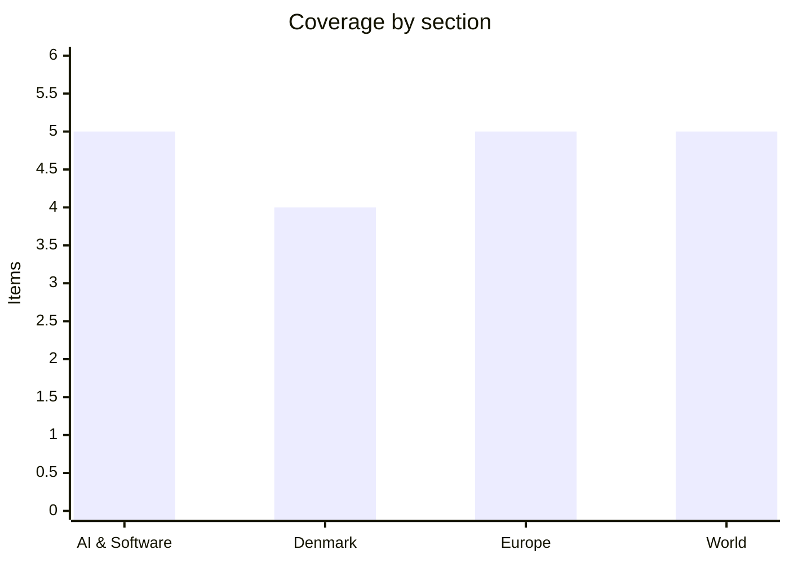

# Daily Briefing — 2026-09-03

**Top line:** Moscow answered Berlin's Leipzig-drone sanctions by ordering every Goethe-Institut in Russia closed and letting Medvedev threaten strikes on "some other places in Berlin", while Kaja Kallas told EU ministers a package listing 1,600 more Russian names is already being prepared and called the drone plot "state-sponsored terrorism".

## Follow-ups

- **Gemini 3.8 Flash landed.** The model the WSJ said Google would unveil on 1 September appeared on 2 September, in two versions — see the AI section. It was the last unresolved "pending, no date" item from yesterday that has now moved.
- **Nvidia–Hugging Face is still unsigned.** Bloomberg's 2 September piece is headlined "Nvidia Nears $14 Billion Hugging Face Deal This Week" and says explicitly that no contract exists yet, that terms include a $1bn employee retention package, and that talks could still collapse. Neither company has confirmed anything. The price has now been reported at two different numbers — $12.9bn (The Information, 26 August) and ~$14bn (Bloomberg, 2 September).
- **Anthropic's S-1 is still confidential.** No public filing on EDGAR; the draft submitted on 1 June 2026 remains under SEC review, and no share count or price range has been set.
- **Cognition's round is still not closed.** Bloomberg (2 September) says the company is "set to raise" around $1bn at roughly $47bn with nearly $10bn of investor interest, but states talks are ongoing and terms could change. No confirmation from Cognition.
- **The Rails RCE got worse, and patching alone does not fix it.** VulnCheck's canaries went from 50+ detections of CVE-2026-66066 on 30 August to 360 by 1 September. More importantly, VulnCheck tested a patched 8.1.3.1 server and found the fix blocks the libvips file read but does *not* neutralise the variation-key Marshal deserialization — the RCE gadget still executes on a patched server given a valid signature. Rotating `secret_key_base`, database credentials and Active Storage service credentials is the actual remediation, not optional hygiene. Neither CVE-2026-66066 nor the Langflow bug CVE-2026-0768 was in yesterday's CISA KEV batch.
- **Trump's promised counter-strike on Iran was delivered.** US strikes resumed on 1 September; Iran's health ministry now puts this week's death toll at 18. Details in World.
- **The gødskningslov third reading has not happened yet.** It is on the Folketing order paper for 10:00 CEST today, after this briefing was written.

## AI & Software

**Google shipped Gemini 3.8 Flash and a locked-down Cyber variant — its third Flash model in six weeks, and still no frontier model.**
Google released Gemini 3.8 Flash on 2 September in two versions: a general-purpose reasoning and coding model, and Gemini 3.8 Flash Cyber, which is not publicly available and is distributed through the Fairwind Program to government agencies, critical infrastructure operators and software maintainers. On Google's own numbers 3.8 Flash scores 73.7% on DeepSWE v1.1, a long-horizon software engineering benchmark — just below Claude Opus 5 at 74.0%, ahead of GPT-5.6 Sol at 72.7%, Claude Sonnet 5 at 53.8% and its own three-week-old predecessor 3.7 Flash at 65.3%. Introductory pricing is $0.75 per million input tokens and $3.75 per million output, the same as 3.7 Flash, rising to $1.50 and $7.50 from January 2027; Opus 5 is $5.00/$25.00 and GPT-5.6 Sol $4.00/$20.00, so even at the regular rate it stays far cheaper per token. The catch is that Google attributes part of the gain to the model "working harder" — more reasoning steps and iterative tool calls — and Artificial Analysis measures cost per task at $0.58 against $0.40 for 3.7 Flash, a roughly 40% increase despite identical token rates. Google itself recommends lower reasoning levels or staying on 3.7 Flash for efficiency-sensitive workloads, which is an unusual thing for a vendor to say about its own newest model. Artificial Analysis puts 3.8 Flash at 59 on its Intelligence Index, three points above 3.7 Flash and level with GPT-5.6 Sol at xhigh reasoning and Grok 4.6 at medium. The Cyber variant scores 86.2% on CyberGym for C/C++ vulnerability discovery against 77.5% for 3.5 Flash Cyber, 83.6% for GPT-5.6 Sol and 85.6% for GPT-5.5-Cyber, and 47.2% Pass@1 on CWE-Bench automated patching, close to the leading frontier model's 47.8%. On the Gray Swan indirect-prompt-injection benchmark 3.8 Flash has a 5.5% attack success rate, against 60.1% for DeepSeek V4 Pro, 52.7% for Kimi K3 and 51.8% for Grok 4.6 — only Claude Opus 5 does better at 4.8%. The strategic reading is contested: this is the third Flash in six weeks while Gemini 3.5 Pro is months late and Gemini 4 is still training, and new DeepMind chief Koray Kavukcuoglu said on 1 September that Google's models are "a little bit below the frontier" but insisted "there's nothing other than being at the frontier that is important for us." For anyone budgeting agentic coding spend, the number that matters is the $0.58 per task, not the $0.75 per million tokens.
[Google blog](https://blog.google/innovation-and-ai/models-and-research/gemini-models/3-8-flash-and-3-8-flash-cyber/) · [The Decoder](https://the-decoder.com/gemini-3-8-flash-is-googles-third-budget-model-in-six-weeks-while-frontier-models-remain-mia/) · [Artificial Analysis](https://artificialanalysis.ai/articles/gemini-3-8-flash)

**The US Department of Justice filed against The New York Times, arguing that training models on copyrighted text is fair use.**
The DOJ intervened on 2 September in the consolidated Manhattan copyright litigation (In re OpenAI Inc. Copyright Infringement Litigation, MDL 1:25-md-03143, SDNY) to argue that training large language models on copyrighted material qualifies as fair use. Its core argument is a distinction between training and output: during training entire works are copied but never made publicly available, and the resulting outputs "often if not always lack substantial similarity" to the originals, so a theory of market harm that conflates the two is legally wrong. The filing uses Joan Didion as its analogy — as a teenager she copied out Hemingway's stories to understand how his sentences worked — and argues that under the reasoning of the Kadrey ruling she could have faced liability every time she published, because her learning and her later writing would be treated as one use. The NYT sued OpenAI and Microsoft in late 2023, alleging millions of its articles were used without permission to train GPT-4 and to build products competing with the paper as an information source, claiming billions in damages and demanding destruction of the models. The department goes directly after the US Copyright Office's 2025 report, which rejected blanket fair use for AI training on the grounds that models work with perfect copies at superhuman scale: the DOJ says former Copyright Register Shira Perlmutter's assessment "carries no binding legal authority" and ignored case law on case-by-case analysis. Perlmutter was fired by the Trump administration shortly after that report was published; the DOJ notes in a footnote that she is currently challenging her dismissal. The filing's own formulation is careful — "the fair-use inquiry hinges on the specific facts and uses at issue in each case" — but its conclusion is that broad liability rendering training impermissible without licensing would be "problematic and legally incorrect". The obvious counter, which the department does not engage, is scale: a teenager copying Hemingway is not a multibillion-dollar company turning that content into a competing mass-market product. This is an amicus-style intervention, not a ruling, and it binds no court — but it is the clearest signal yet of where the executive branch stands, and it lands in the case most likely to set the precedent. It also cuts directly against the direction European courts have taken, where a German court recently rejected a fair-use defence for the music generator Suno.
[The Decoder](https://the-decoder.com/us-department-of-justice-backs-fair-use-for-ai-training-in-landmark-copyright-case/) · [filing via Bloomberg Law](https://www.bloomberglaw.com/public/desktop/document/InReOpenAIIncCopyrightInfringementLitigationDocketNo125md03143SDN/94?doc_id=XTLPJ54AKH9658CD38BR2H8M8T)

**CISA's KEV update yesterday was unusually developer-shaped: an LLM gateway, a Python web framework, a workflow engine and an artifact repository, all actively exploited.**
CISA added seven vulnerabilities to the Known Exploited Vulnerabilities catalog on 2 September, and four of them are infrastructure that engineering teams self-host. CVE-2026-59822 in BerriAI LiteLLM (CVSS 8.8) is an MCP authentication bypass: before v1.84.0, the MCP Streamable HTTP endpoint fell back to an OAuth2 passthrough path that replaced failed LiteLLM key validation with an empty `UserAPIKeyAuth()` object, so a fabricated Authorization header let an unauthenticated caller list and invoke every configured MCP tool. CVE-2026-48710 in Starlette — the "BADHOST" bug, fixed in 1.0.1 — is missing Host-header validation: a Host value containing `/`, `?` or `#` shifts the path/query/fragment boundaries when `request.url` is reconstructed, so `request.url.path` diverges from the raw ASGI path the router actually used, and any middleware doing path-based authorisation on `request.url` can be bypassed. CVE-2026-49869 in Kestra OSS is an authentication filter that checks `/configs` with `endsWith` rather than exact matching, allowing unauthenticated flow creation and therefore root code execution in the worker container via the default script plugins; fixed in 1.0.45 and 1.3.21. The remaining entries are CVE-2026-82329 (JFrog Artifactory), CVE-2026-9586 (Sangoma Switchvox) and CVE-2026-83548/83549 (SonicWall SMA1000). CISA set remediation deadlines of 5 September for Kestra, Artifactory, Switchvox and SonicWall, and 16 September for LiteLLM and Starlette — a three-day window for the first group, which is unusually short. The Artifactory entry is the one to act on first: BleepingComputer reported the same day that attackers are exploiting it in the wild, with offensive-security firm watchTowr observing them "minting themselves admin tokens" and, by 1 September, enumerating users, groups, credentials and federated access relationships. JFrog patched on 28 August across 7.111.21, 7.117.28, 7.125.20, 7.133.29, 7.146.38 and 7.161.20, and says JFrog Cloud was never exposed — but the flaw is present in the *default* configuration of self-managed instances, and because JFrog treats access tokens as independent credentials with their own expiry, upgrading the binary does not invalidate a token an attacker already minted. Black Duck's Collin Hogue-Spears put the blast radius plainly: admin access "reaches released artifacts that downstream systems already trust and pull automatically". Third-party trackers rate the Artifactory bug CVSS 9.8; JFrog's own advisory is notably thin and does not state a score, so treat 9.8 as reported rather than vendor-confirmed.
[CISA](https://www.cisa.gov/news-events/alerts/2026/09/02/cisa-adds-seven-known-exploited-vulnerabilities-catalog) · [BleepingComputer](https://www.bleepingcomputer.com/news/security/hackers-exploit-critical-jfrog-artifactory-flaw-to-forge-admin-tokens/)

**The Pentagon put ChatGPT and Grok on GenAI.mil — and Claude is still the one frontier model missing.**
The Department of War announced on 2 September that OpenAI's ChatGPT Mil and xAI's Grok for Government are now available on GenAI.mil, the Pentagon's internal AI platform, which since its launch last December had carried only Google Gemini. The department says the platform has more than 1.7 million users out of over three million employees and service members. ChatGPT Mil is pitched at administrative tasks, logistics and planning; the Grok announcement is framed in more operational terms, citing procurement analysis and supply chain management. Both run in a dedicated secure environment walled off from the commercial versions, with the department stating that no sensitive government data crosses over and no user data is collected. The conspicuous absence is Anthropic, which refused to grant the Pentagon unrestricted use of Claude and was subsequently classified as a supply chain risk by the Trump administration — a classification a US court ruled unlawful in late August. So the practical position today is that a court has struck down the mechanism used to exclude Anthropic, and Anthropic is still excluded, because the underlying disagreement about usage restrictions has not been resolved. For anyone tracking how frontier labs price their safety commitments, this is the cleanest available data point: two labs accepted the terms and are now serving 1.7 million users inside the world's largest defence bureaucracy, and one did not. It also sits awkwardly beside Anthropic's own Mythos 5.1 tier, which is restricted to vetted US organisations through cyber and life-sciences verification programmes built with the US government — the company is not refusing government work, it is refusing unrestricted use. Whether that distinction survives procurement pressure is the thing to watch.
[Pentagon — ChatGPT Mil](https://www.war.gov/News/Releases/Release/Article/4586352/department-of-war-launches-openais-chatgpt-mil-on-genaimil/) · [Pentagon — Grok](https://www.war.gov/News/Releases/Release/Article/4586482/department-of-war-launches-starshield-ais-grok-for-government-on-genaimil/) · [The Decoder](https://the-decoder.com/us-military-adds-chatgpt-and-grok-to-ai-platform-genai-mil/)

**Uber cut 3,300 jobs — 10% of staff and 20% of management — to fund the robotaxi transition.**
Dara Khosrowshahi told employees in a memo on Wednesday 2 September that Uber is cutting 3,300 roles, about 10% of its global workforce and its largest reduction since the pandemic layoffs of May 2020, when it cut 3,700. Managerial roles are being reduced by 20%, and the number of "micro-teams" in which a manager has only one or two direct reports is being halved. Uber had roughly 34,000 employees worldwide at the end of 2025, so the cuts take headcount back to around 30,000. Khosrowshahi framed the move as removing complexity accumulated during years of rapid growth and "simplifying team structures" in order to "build the autonomous future" and "invest even more in drivers, couriers and merchants" — explicitly not a response to a deteriorating core business. Uber is also concentrating staff in major hubs and reducing fully remote positions, which is the part most likely to drive attrition beyond the announced number. The strategic backdrop is that Waymo and other autonomous developers are resetting ride-hailing unit economics, and Uber has to decide how much AV capability to build versus access through partnerships — a decision that determines whether it ends up an operator or a demand aggregator. The second reading, which the company will not offer, is that a 20% cut to management is what you do when you expect agents and automation to absorb coordination work that currently justifies headcount. Affected workers have been notified except where local employment law requires a different process, which means European and Danish staff will hear later through consultation procedures.
[TechCrunch](https://techcrunch.com/2026/09/02/uber-is-laying-off-10-of-staff-or-3300-people/) · [Bloomberg](https://www.bloomberg.com/news/articles/2026-09-02/uber-to-cut-3-300-jobs-in-company-overhaul-to-reduce-management-layers) · [Al Jazeera](https://www.aljazeera.com/economy/2026/9/2/uber-lays-off-3300-employees-in-largest-cuts-since-the-pandemic)

## Denmark

**Lidegaard promised a corporate tax cut in the 2027 budget from the stage at Dansk Erhverv — without saying how big.**
Erhvervsminister Martin Lidegaard (R) told Dansk Erhverv's annual congress at Bella Center on Wednesday 2 September that the selskabsskat *will* be cut in 2027, and that the government will say by how much "inden for få uger". He tied it directly to the live budget round: "Vi sidder og forhandler finanslov lige nu. Jeg vil ikke love, at vi kommer hele vejen, men vi kommer et stykke." The government sent four ministers to the event, which ran from 11:45 to 16:30 and also heard from Jakob Ellemann-Jensen, Kasper Rørsted and Rane Willerslev. Altinget reports that blå blok has signalled it will back the cut provided the financing is sound, which — with the firkløverregeringen of S, SF, Moderaterne and Radikale holding office since June — means the measure is unlikely to fail on arithmetic. The process is unusual this year: after the 26 February election the government split the budget in two, tabling a purely technical FFL 2027 in August with the political version due before the Folketing opens in October, and L 24 (Finanslov for finansåret 2027) plus L 25 and L 26 on expenditure ceilings including 2030 are currently at "Fremsat". The commitment is real but the number is the whole story, and it does not exist yet. Note also the coalition tension it implies: SF has been explicit that cutting the corporate tax "er helt klart ikke SF's politik", so a Radikale minister has just pre-committed the government to something one coalition partner campaigned against. Watch for whether the figure arrives before or after the political finanslov is tabled — announcing it first would make it non-negotiable in the budget round, which is presumably the point.
[Altinget](https://www.altinget.dk/erhverv/artikel/regeringen-lover-lavere-selskabsskat-i-2027)

**The government put a number on Danish business red tape for the first time — DKK 70bn a year — and killed the committee that was supposed to police EU over-implementation.**
At the same Dansk Erhverv event Lidegaard disclosed the figure the government has been trailing all autumn: Danish business carries roughly DKK 70bn a year in administrative burdens, and the target is to cut that by 25% by 2035, or DKK 17.5bn. His framing was that no single requirement is the problem: "Hver sten vejer ikke så meget, men I skal bære dem alle sammen." The full byrdebekæmpelse plan is due later this autumn. There is an unexplained gap in the government's own numbers worth flagging — the same commitment has previously been described in terms of DKK 30bn by 2035, and I could not reconcile the two figures from outside Altinget's paywall. Separately and on the same day, Altinget reported that the firkløverregeringen has quietly abolished EU-Implementeringsudvalget, the body set up to prevent unintended over-implementation of EU legislation into Danish law. Lidegaard confirmed the abolition and said only "vi kommer til at tage et andet greb på det her." The politics are pointed: the committee was revived with considerable fanfare in autumn 2024 by the then SVM government, with Troels Lund Poulsen personally touring business circles to promote it — so it is being scrapped in the same week its sponsor is fighting for his party leadership. The day before, Lidegaard had pre-empted the inevitable pushback from DI and Dansk Erhverv by telling business to put samfundssind above short-term business models, and complaining that parts of the business community lobby for special carve-outs while demanding fewer burdens overall: "Det er et fælles ansvar, at byrdehavet bliver mindre." Read together, the two announcements move burden-cutting out of a standing consultative committee and into a ministerial plan the government controls — more accountable in one sense, less transparent in another.
[Altinget — 70bn/17.5bn](https://www.altinget.dk/erhverv/artikel/lidegaard-vil-skaere-administrative-byrder-for-175-milliarder) · [Altinget — committee scrapped](https://www.altinget.dk/erhverv/artikel/regeringen-dropper-udvalg-til-at-bekaempe-eu-byrder)

**The fertiliser revolt has become a leadership crisis: Troels Lund Poulsen has put his chairmanship behind the party line, hours before the vote.**
What changed overnight is that this stopped being a whip story. Altinget's political editors write that "mens en fjerdedel af folketingsgruppen ikke vil stemme for gødskningsloven, sætter Troels Lund Poulsen sit formandskab ind på, at partiet stemmer for", and DR's analysis renders his message to the rebels as: pulling Venstre out of the grønne trepart happens "uden mig som formand". Poulsen has since said he will "vælge at rumme" the disagreement and that there will be no consequences for the dissenters — a retreat from the implied ultimatum that is itself part of the problem, since Information's verdict on 2 September was "Troels Lund er høvding uden pondus". The named rebels are Søren Gade, Amanda Heitmann, Anni Matthiesen (the group secretary), Peter Juel-Jensen (transport spokesman) and Preben Bang Henriksen — five of eighteen MPs, up from four on 31 August when Juel-Jensen had not yet declared. Gade's objection is that the law "trækker tæppet væk under landmænd og landdistrikter"; Bang Henriksen's line was that in fifteen years he had never voted against his party. Gade avoided the press entering Thursday morning's group meeting. The colour driving Danish coverage is that mid-mutiny, Poulsen attended Gade's wedding party at the castle used for the TV show "Forræder", which is the kind of detail that outlives the policy. Altinget's Morten Reimar argues the crisis "er begyndelsen på noget grimt, som kan ændre Danmarks ældste parti for altid", and TV2 has bagland members warning "vi bliver splittet en gang mere, er jeg bange for". The third reading of L 5 is at 10:00 CEST today; the government has the majority regardless, so the vote is a test of Poulsen, not of the law. The alternative reading is more benign: a free-ish vote on an agricultural bill in a party with deep rural roots is survivable, and Poulsen's decision not to punish the five may be the thing that contains it.
[Altinget](https://www.altinget.dk/artikel/gyllemytteriet-stiller-troels-lund-poulsen-i-en-decideret-formandskrise) · [DR](https://www.dr.dk/nyheder/politik/analyse-troels-lund-poulsen-med-klart-budskab-til-oproererne-det-bliver-uden-mig-som-formand) · [Information](https://www.information.dk/indland/2026/09/troels-lund-hoevding-uden-pondus)

**The spiral-case compensation scheme is now in force at DKK 300,000 a woman, days before von der Leyen flies to Nuuk.**
The compensation law for the antikonceptionssagen — L 11, from Sundheds- og Kirkeministeriet under Ida Auken, tabled 25 June 2026 — entered into force on 1 September. It pays DKK 300,000 per woman, covers the period 1960 to 1991, and is administered by Patienterstatningen; applications opened on 1 July 2026 and run until 1 September 2028. An estimated 4,500 women are thought to be eligible, which puts the scheme's ceiling at roughly DKK 1.35bn if all of them apply and qualify. The context is that two investigative reports into the spiral case were published in Nuuk on Friday 28 August, and Altinget's Arctic correspondent Martin Breum argued beforehand that they would be "definerende for forholdet mellem Grønland og Danmark i mange år frem" — with the explicit warning that renewed Greenlandic anger over the case is exploitable by Donald Trump. The diplomatic calendar makes that timing acute. Ursula von der Leyen arrives in Nuuk on Sunday 6 September, met by Mette Frederiksen and Naalakkersuisut chair Jens-Frederik Nielsen; the semi-annual rigsmøde follows on 7–8 September with Frederiksen, Nielsen and Faroese lagmand Beinir Johannesen, and then the Foreign, Security and Defence Contact Committee, focused on the North Atlantic and Arctic picture. On the table is the Commission's proposal to more than double EU support to Greenland — €530m over seven years from 2028, roughly DKK 4bn — plus a floated investment package of over €150m. The money is announced, not signed, and the visit is the moment it either firms up or does not. The honest framing is that Copenhagen is settling a historical debt in cash in the same fortnight it needs Nuuk to be receptive to a European alternative to American attention, and those two facts are not unrelated.
[Patienterstatningen](https://patienterstatningen.dk/presse-og-nyheder/fokusomraader/godtgoerelse-til-kvinder-for-antikonception-i-groenland-spiralsagen) · [Retsinformation — L 11](https://www.retsinformation.dk/eli/ft/202522L00011/dan/pdf) · [Altinget](https://www.altinget.dk/artikel/ny-groenlandsk-vrede-over-spiralsagen-kan-blive-en-foraering-til-trump)

## Europe

**Russia is closing every Goethe-Institut in the country, and Medvedev is threatening strikes on Berlin.**
Sergei Lavrov confirmed at the Eastern Economic Forum in Vladivostok on 3 September, via Interfax, that Russia will close the Goethe-Institut: "Of course they will be closed, after our cultural centre was driven out of there." The institute runs a head office in Moscow plus centres in St Petersburg and Yekaterinburg, and is one of the last German institutions still operating in Russia — it survived the full-scale invasion. Lavrov said Berlin was knowingly accepting that its move against the Russian House "clearly means the end of its cultural presence in the Russian Federation". This follows Germany's announcement on Tuesday 1 September, by interior minister Alexander Dobrindt (CSU) and foreign minister Johann Wadephul (CDU), blaming Russia for the explosives-laden drone found at Leipzig/Halle airport on 4 August near Ukrainian cargo aircraft; Dobrindt said the device showed "a high degree of technical expertise and considerable organisational effort", with drone configuration, components, explosive and detonation technology known from other Russian hybrid operations. On 2 September Russia's foreign ministry summoned the German embassy's chargé d'affaires in Moscow, rejected "completely fabricated accusations", and warned that "a harsh answer will follow the actions of the German government". Putin, in Bishkek, called Berlin's sanctions "another serious mistake". Dmitry Medvedev, deputy chair of Russia's Security Council, wrote on Telegram that Germany "deserves a direct strike against all German military production facilities" and "certainly also some other places in Berlin", describing the German leadership as "neo-Nazi". A further step under consideration in Moscow is closing Germany's consulate general in St Petersburg, which would mirror the Bonn closure. Medvedev's threats are a known genre and should not be read as operational planning; the Goethe-Institut closure is concrete, and it removes one of the last remaining civil channels between the two countries.
[ZDFheute](https://www.zdfheute.de/politik/ausland/russland-deutschland-goethe-institut-leipzig-drohne-100.html) · [t-online](https://www.t-online.de/nachrichten/ukraine/id_101413502/ukraine-krieg-aktuell-medwedew-deutschland-verdient-direkte-angriffe.html)

**Kallas called the Leipzig drone "state-sponsored terrorism", summoned Russia's EU ambassador, and told ministers a 1,600-name sanctions package is already in preparation.**
Kaja Kallas summoned Russia's ambassador to the EU in Brussels and, before the informal foreign ministers' meeting in Wicklow, said: "It is clear that it has all the hallmarks of state-sponsored terrorism," adding that all member states stand behind Germany — "I think this is exactly the united response we need." She told ministers that preparations were already under way to sanction 1,600 further individuals and companies tied to Russia's military-industrial complex, with more possibly added; she had begun work on the package in August, before Germany publicly attributed the Leipzig drone, so the timing is convergence rather than causation. Wadephul tabled extensive German proposals, said the coming weeks would focus on adding individuals to the list and that he expected "a large number of persons" to be affected, and pressed for more military support to Ukraine before winter — particularly air defence, noting that some member states still hold reserves that now need to be discussed. Four capitals moved in parallel: France summoned the Russian chargé d'affaires in Paris, with Jean-Noël Barrot calling for sanctions on the shadow fleet; Finland's Elina Valtonen said she would summon Russia's ambassador in Helsinki; Belgium announced the same. The other thing Wicklow reopened is the frozen assets question, dormant since talks collapsed in December 2025. Sweden's Maria Malmer Stenergard said the change is Russian behaviour — "we also see the hybrid attacks aimed at dividing us" — and that "the most fair thing to do, also for taxpayers, is to take the frozen assets and give them to Ukraine", urging the Commission to produce a risk-sharing proposal "as soon as possible, because Ukraine cannot wait". Roughly €200bn sits with Euroclear in Belgium, and Brussels' fear is that a successful legal challenge would leave Belgium alone owing €200bn; Luxembourg's Xavier Bettel said pointedly, "I am still waiting for the solidarity mechanism," and that if someone has to pay, "I want solidarity from the 26". Nothing has been tabled: the 1,600 listings and the asset mechanism are both still Commission homework.
[ZDFheute](https://www.zdfheute.de/politik/ausland/leipzig-drohne-sanktionen-eu-russland-100.html) · [Kyiv Independent — Kallas](https://kyivindependent.com/eus-kallas-calls-russia-leipzig-hybrid-attack-state-sponsored-terrorism/) · [Kyiv Independent — frozen assets](https://kyivindependent.com/split-the-risk-and-save-the-taxpayer-sweden-doubles-down-on-russian-frozen-assets/)

**Norway seized a Russian passenger ship at Svalbard to enforce Naftogaz's $4.22bn Crimea award.**
The Governor of Svalbard, Lars Fause, arrested the Russian vessel *Professor Molchanov* at the port of Barentsburg on Wednesday 2 September. The Nord-Troms and Senja District Court ordered the seizure on 31 August to secure enforcement of Russia's outstanding obligations under an arbitral award of approximately $4.22bn plus interest and costs, won by Ukraine's Naftogaz over assets Russia seized in Crimea in 2014 and confirmed as enforceable by a Dutch court in late 2024. Fause, who holds police authority on the archipelago and acted here as enforcement authority, said the vessel "will remain berthed in Barentsburg until the Governor or the Nord-Troms District Court decides otherwise", and that his office would take responsibility for crew and passengers in cooperation with Arktikugol, the Russian state coal company that runs Moscow's operations on Svalbard. The *Professor Molchanov* is a 43-year-old Finnish-built oceanographic research vessel operated by the Northern Directorate for Hydrometeorology and Environmental Monitoring, an agency under Roshydromet; it made its first Barentsburg voyage in June 2025 and was scheduled for ten return trips from Murmansk this season. The route matters: Svalbard sits outside Schengen, so sailing from Murmansk lets Russian citizens bypass Norwegian passport control, with the only requirement being a passenger list filed 48 hours before docking. This is the first Arctic enforcement of the Naftogaz award and it is legally clean — a court order executed by the competent authority, not a political seizure — but it lands in the most jurisdictionally delicate place in Europe, where the 1920 Svalbard Treaty gives Russia settlement rights Norway administers. Neither Moscow nor Arktikugol had commented at time of publication. If Russia responds by contesting Norwegian enforcement jurisdiction on Svalbard specifically, this becomes a much larger story than one ship.
[The Barents Observer](https://www.thebarentsobserver.com/news/norway-seizes-russias-svalbard-liner/457215) · [Sysselmesteren](https://www.sysselmesteren.no/nb/nyheter/2026/09/har-tatt-arrest-i-russisk-skip/)

**European gas hit €74.40/MWh, the highest since January 2023, a week before the ECB decides.**
Dutch TTF front-month gas rose to €74.40/MWh on 2 September, the highest level since January 2023 and more than 130% up since the start of the year. Three things are driving it: the Strait of Hormuz remaining effectively closed by the Iran–US war, Norway extending outages at gas fields, and drought cutting both hydroelectric and nuclear generation across the continent. Europe is going into the heating season with inventories at roughly a two-decade low, and analysts say there is a real chance the EU misses even its softened flexible target of 75% storage fill by 1 November — "at the current rate, it will be difficult for the EU to hit even the lower storage target". A cold winter on top of continued supply constraints is being modelled at €90–120/MWh, with Q4 2026 and Q1 2027 forecasts expected to be revised toward an average near €60. For scale, this is still far below the €350 peak of the 2022 crisis, so the correct framing is a severe squeeze, not a repeat. The direct consequence is monetary: eurozone inflation came in at 3.3% for August on the energy shock, and the ECB Governing Council decides on Thursday 10 September, statement at 14:15 CET and Lagarde's press conference at 14:45. A hike is now the market's base case, with economists broadly expecting a final 25bp move to 2.5% and forwards pricing as far as 3%. The awkwardness for the Council is that this is an imported supply shock, which monetary policy cannot fix, arriving on top of a growth picture that does not want tightening — so the argument inside the room will be about inflation expectations rather than about energy. Note that the €74.40 figure is a market print rather than an official announcement, and the storage and price forecasts are analyst commentary.
[Trading Economics](https://tradingeconomics.com/commodity/eu-natural-gas) · [CNBC](https://www.cnbc.com/2026/08/27/europe-gas-storage-prices-winter-lng.html)

**Madrid put €309m behind Ceuta as the migration crisis turned into a national political fight.**
Spain's Council of Ministers approved an emergency decree-law on 1 September mobilising €309m for the remainder of 2026 in response to the Ceuta migration crisis of 30–31 July. The package has four axes: €118m for humanitarian reception, €90m for security, €80m for support to economic activity, and €21m to reinforce essential services. Within the economic axis, €36.6m goes in direct aid to businesses and the self-employed — roughly €5,000 per self-employed worker and between €10,000 and €150,000 per company depending on turnover. Separately, the Ceuta city government receives €63.6m to strengthen capacity for the roughly 1,500 unaccompanied migrant minors currently in its child protection system, which is the specific pressure point that has driven the confrontation between the enclave and the mainland regions over relocation quotas. The money landed the day before Ceuta Day, when rallies were called for 20:00 outside town halls across Spain; the call came from the Spanish Federation of Municipalities and Provinces, led by the PP, which framed it as institutional, while the PSOE characterised it as a right-wing manoeuvre to move protest into the streets and its leadership stayed away. Vox called explicitly for the rallies to become a mass protest against Pedro Sánchez. Sánchez has acknowledged that many Ceuta residents believed the state's response was insufficient, which is as close to a concession as the government has made. The two readings are straightforward: either €309m is a substantive response arriving five weeks late, or it is the price of neutralising a mobilisation the opposition had already organised. Both can be true.
[La Moncloa](https://www.lamoncloa.gob.es/serviciosdeprensa/notasprensa/presidencia/Paginas/2026/010926-plan-choque-ceuta.aspx) · [elDiario.es](https://www.eldiario.es/economia/gobierno-aprueba-plan-choque-309-millones-responder-crisis-humanitaria-ceuta_1_13479219.html)

## World

**Saudi Arabia publicly accused Iran of deliberately killing two crew on one of its tankers — the Gulf's neutrality is over.**
Saudi Arabia's foreign ministry said on Wednesday 2 September that Iran deliberately targeted the crude tanker *Sidr*, owned by state carrier Bahri, as it transited the Strait of Hormuz late on Monday 31 August, killing two crew members who were citizens of the Philippines. It is the sharpest public Saudi attribution of a Hormuz attack to Iran since the war began on 28 February. Kuwait and Qatar's foreign ministries also condemned the strike, with Doha calling it a "flagrant violation of the rules of international law and freedom of maritime navigation" and rejecting the use of the Strait as a "bargaining chip". Bahri confirmed the vessel "was involved in a security incident while transiting the Strait of Hormuz". The accounts of what happened are irreconcilable and both should be attributed: Greek maritime risk firm Marisks reported that unidentified projectiles struck two tankers overnight into Tuesday, while Iran's Revolutionary Guard said on Wednesday the two vessels caught fire after striking mines. Kpler data show both had loaded two million barrels of crude at Juaymah on Saudi Arabia's east coast last week. This is the third Bahri vessel hit since July — the supertanker *Wedyan* was struck near Oman in July, and *Masa* and *Amzan* were attacked in the Red Sea in July and August after the Houthis declared a naval blockade of Saudi Arabia. Overnight into Thursday 3 September, Kuwait's army said its air defences were engaging "hostile" missile and drone attacks that it blamed on Iran. The significance is not the tanker: it is that Gulf states which host US bases, have spent three years rebuilding relations with Tehran, and have been scrupulous about not naming Iran, are now formally on the record accusing it. That narrows Iran's remaining diplomatic room considerably, and it is the change of the week.
[Al Jazeera](https://www.aljazeera.com/news/2026/9/2/saudi-arabia-condemns-deadly-iranian-attack-on-tanker-in-strait-of-hormuz) · [Al Jazeera live](https://www.aljazeera.com/news/liveblog/2026/9/3/iran-war-live-trump-says-renewed-us-iran-clashes-will-not-last-too)

**Iran says this week's US strikes killed 18 including a child; CENTCOM denies hitting a wedding; Trump says it "will not last too long".**
Iran's health ministry spokesperson said on Thursday 3 September that US attacks this week killed 18 people — including two women and a child — and injured 142. The figure is Iran's and is not independently verified. It includes a strike on a wedding celebration in Kuhestak, Sirik County, in southern Hormozgan province overnight into 2 September; Iranian state media outlet Tasnim reported four killed there and published images of injured children in a trauma ward. US Central Command denies striking a wedding, and there is no independent confirmation either way. Trump said the renewed fighting "will not last too long" while simultaneously saying the US is ready to strike Iran "at any time" and repeating his claim that the US controls Hormuz. He said on 1 September the strikes were retaliation for Iran's attempt to mine the Strait and target US service members over the weekend. The Wall Street Journal reported that the 1 September strikes also hit two Iranian government tankers under a new "tanker for tanker" policy Trump has approved — retaliating in kind for Iranian attacks on commercial shipping; that policy has not been officially announced and should be treated as reported. Iran's security chief Mohsen Rezaei said Washington would soon see Tehran's "new strategy". Treasury Secretary Scott Bessent said on 1 September that the US is likely to sanction a bank this week and is examining airline-leasing companies and other entities doing business with the IRGC, claiming the plan to "economically asphyxiate" Iran's economy has support from "many of our allies" — though several allies used the G20 to voice displeasure about the war's effect on energy and shipping. France said the UN Security Council will vote this month on renewing the mandate of the Iran sanctions monitoring panel, which expires 26 September, with diplomats warning of possible Russian and Chinese vetoes.
[Al Jazeera live](https://www.aljazeera.com/news/liveblog/2026/9/3/iran-war-live-trump-says-renewed-us-iran-clashes-will-not-last-too) · [Just Security](https://www.justsecurity.org/155980/early-edition-september-2-2026/)

**A weak ADP print knocked the September Fed hike off near-certainty, with payrolls tomorrow.**
ADP's National Employment Report, released Wednesday 2 September, showed US private payrolls rose just 38,000 in August — below the 47,000 economists expected, down from 46,000 in July, and the smallest gain since January. Education and health care, leisure and hospitality, and construction added the most; manufacturing saw the largest decline. CME FedWatch odds of a September hike fell to roughly 60–64% from 68.2% the previous day, so a move that was being described as near-locked earlier in the week is now a coin-flip-plus. The FOMC meets 15–16 September; the target range has been 3.50–3.75% since the July hold. The hawkish case rests on energy-driven inflation from the Iran war plus market doubt about the Fed's resolve after July, and Chair Kevin Warsh's Jackson Hole remarks on 28 August were widely read as preparing markets for a hike. J.P. Morgan Wealth Management and BofA Securities both still expect 25bp in September, with BofA holding the call through the ADP miss. The decisive data point is the Bureau of Labor Statistics August employment report at 08:30 ET on Friday 4 September. The dollar held near a two-week high despite the weak labour print, while gold and silver steadied as hike expectations eased. Market levels on Thursday: Brent $95.01 (−0.64%), WTI $90.57, gold $4,431.66/oz, silver $65.98, US 10-year at 4.775% after pulling back from a three-year high, S&P 500 7,662.85, Nasdaq 100 29,016, DXY 99.43, USD/JPY 157.76. One tension worth holding: US Energy Secretary Chris Wright said more than 17 million barrels transited Hormuz on Monday 31 August — the highest daily volume since the war began, against roughly 20 million b/d pre-war — while Kpler counted just four commodity vessels transiting on Tuesday, down from ten on Monday. Both can be true on different days, but the official number is being used to argue the Strait is functioning, and the vessel counts suggest traffic is sporadic rather than restored.
[CNBC](https://www.cnbc.com/2026/09/02/private-payrolls-rose-by-38000-in-august-fewer-than-expected-adp-reports.html) · [Trading Economics](https://tradingeconomics.com/commodity/brent-crude-oil)

**Lula's lead over Flávio Bolsonaro has collapsed to a single point a month before Brazil votes.**
A Quaest poll commissioned by Globo and released Wednesday 2 September put Lula at 42% against Senator Flávio Bolsonaro's 41% in a simulated runoff — a technical tie given the poll's two-point margin of error, and down from a three-point lead in Quaest's previous survey on 14 August. In the first round Lula leads on 37%, with Bolsonaro on 30%, Augusto Cury on 10% and Renan Santos on 3%. Quaest surveyed 2,004 people between 30 August and 1 September. The narrowing follows new developments in an investigation into Lula's son, Fábio Luís Lula da Silva, over allegations he improperly assisted a lobbyist in dealings with the Health Ministry. Flávio Bolsonaro, eldest son of the former president, is read by markets as more fiscally restrictive, and the market response was immediate: the Ibovespa rose 1.18% on 2 September to close near 181,845, extending a winning streak, though it remains below its April 2026 record of 199,355 and is up about 30% year-on-year. Brazilian bond yields fell after Q2 GDP showed growth of 0.5% alongside a sharp contraction in household consumption, reinforcing expectations of further cuts from the current 14.00% Selic. Banco do Brasil, Santander Brasil and B3 all gained; Petrobras fell 0.5% as oil eased. The pattern of a market rallying on the prospect of a Bolsonaro presidency is familiar from 2018 and 2022 and is not a prediction — Quaest's own first-round numbers still show a seven-point Lula lead, and one month is a long time in a Brazilian campaign.
[Investing.com / Reuters](https://www.investing.com/news/economy-news/lulas-lead-over-bolsonaro-narrows-to-1-point-in-latest-poll-93CH-4886266) · [Bloomberg](https://www.bloomberg.com/news/articles/2026-09-02/lula-and-bolsonaro-deadlocked-in-virtual-tie-in-new-brazil-poll)

**Nicaragua's Congress voted to write the exclusion of opposition parties into the constitution and extend Ortega and Murillo's terms to seven years.**
The National Assembly passed a constitutional reform on Tuesday 1 September that bars opposition parties from contesting elections and extends the presidential term from six years to seven. The reform is backed by co-presidents Daniel Ortega and his wife Rosario Murillo and also extends to seven years the terms of other elected officials and of the heads of the army and police. Under Nicaraguan law constitutional changes require approval in two separate legislative sessions, and the ratifying second vote is scheduled to begin on 18 January, so this is not yet final — though there is no meaningful prospect of it failing. Reporting indicates the measure suspends the elections scheduled for November and pushes the next national vote to 2028, extending both leaders' terms in the interim; that specific consequence comes from secondary aggregation of the wire copy rather than the legislative text, so treat it as reported. The United States criticised the initiative before passage and has urged the international community to isolate Managua; several Central American governments plus Bolivia, Brazil and Chile have condemned it, and Panama has reportedly withdrawn its ambassador. In substance this formalises in law what has been the case since the 2021 election, in which Ortega's principal rivals were jailed before the vote — the constitutional change removes the need to keep improvising. It is the most consequential governance story in Latin America this week and has been almost entirely crowded out by the Iran war, which is worth noting in itself: the international attention that used to constrain this kind of move is currently allocated elsewhere.
[Reuters](https://www.reuters.com/world/americas/nicaraguan-congress-passes-ortega-backed-reform-excluding-opposition-elections-2026-09-02/) · [UPI](https://www.upi.com/Top_News/World-News/2026/09/02/latam-nicaragua-elections-reform/6181788369010/)

## Watch list

- **Today, 10:00 CEST:** third reading of the gødskningslov (L 5) in the Folketing, with five of Venstre's eighteen MPs on record against the party line and Troels Lund Poulsen's chairmanship attached to the outcome; the same morning brings final readings on restoring store bededag, a handshake-and-norms requirement, a ban on public calls to prayer and a ban on gender-segregated swimming.
- **Friday 4 September, 08:30 ET:** the US August employment report, which after ADP's 38,000 print is now the deciding input for the 15–16 September FOMC — hike odds have already slipped from ~68% to roughly 60–64%.
- **Sunday 6 September:** Landtagswahl in Sachsen-Anhalt, with the dawum average of 28 August at AfD 41.7%, CDU 22.2%, Linke 12.1%, SPD 8.0% — every two-party majority arithmetic includes the AfD, whose state branch the Verfassungsschutz classifies as definitively right-wing extremist. The same day, von der Leyen arrives in Nuuk, with the rigsmøde on 7–8 September and a proposed €530m EU package for Greenland on the table.
- **Thursday 10 September, 14:15 CET:** ECB decision, with a 25bp hike to 2.5% now the base case on a gas-driven inflation shock that monetary policy cannot address.
- **Pending, no date:** the Nvidia–Hugging Face signature, reported at ~$14bn and "possibly this week" for the second week running; Cognition's ~$1bn round at $47bn; Anthropic's public S-1; and CISA's 5 September remediation deadline for the Artifactory, Kestra, Switchvox and SonicWall KEV entries.
