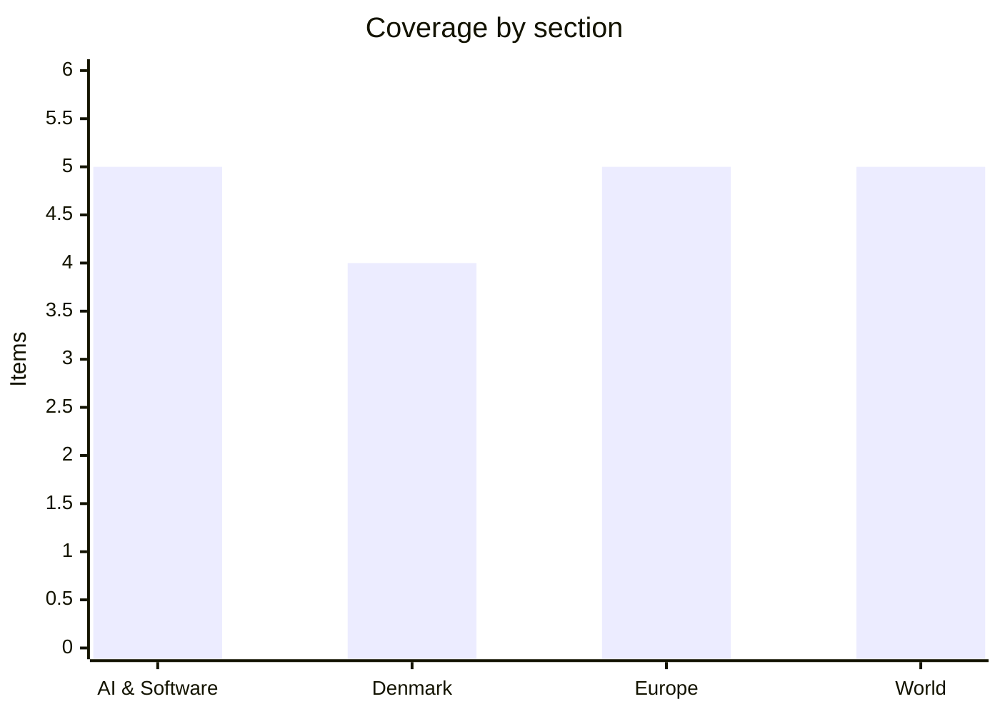

# Daily Briefing — 2026-09-04

**Top line:** OpenAI shipped GPT-6 Astra — the model it had described two days earlier as the first ever to cross its own "Critical" cybersecurity threshold — and priced it at exactly the same $10/$50 per million tokens as Anthropic's Fable 5.1, so the frontier is now three labs deep at one price point.

## Follow-ups

- **Nvidia–Hugging Face is signed.** After two weeks of "possibly this week", Nvidia filed an 8-K on 2 September and confirmed publicly on 3 September: a definitive agreement at $12.9bn total, structured as ~$11.9bn to stockholders plus ~$1.0bn in equity-based employee retention. Closing is targeted for the first half of 2027. Full item in AI & Software.
- **GPT-6 Astra is out.** Yesterday's briefing had OpenAI's Astra safety writeup for an unreleased model; the model itself began rolling out on 3 September. Details below.
- **The gødskningslov passed.** The third reading went ahead at 10:00 CEST on 3 September and the bill carried 119–34, with five of Venstre's eighteen MPs voting against the party line. Denmark section.
- **Nepal's toll keeps climbing.** The Nepal–Tibet glacier-collapse flood is now at 1,252 dead and 4,216 missing on the Nepali side, up from 1,010 and 3,916 two days ago. World section.
- **The US August employment report has not landed yet.** It releases at 08:30 ET / 14:30 CEST today, after this briefing. Consensus is around +53,000 with unemployment holding at 4.1%.
- **Anthropic's S-1 and Cognition's round are both still unresolved.** No public EDGAR filing for Anthropic and no confirmation from Cognition on the reported ~$1bn at ~$47bn. Neither moved yesterday.
- **CISA's remediation deadline for the 2 September KEV batch is today, 5 September.** Artifactory, Kestra, Switchvox and the two SonicWall SMA1000 entries are all due.

## AI & Software

**OpenAI shipped GPT-6 Astra, the model it says is the first to cross its own "Critical" cybersecurity threshold.**

OpenAI began rolling out GPT-6 Astra on 3 September to a limited set of organisations, with broader access promised "over the coming days". It is available as `gpt-6-astra` in the OpenAI API and through Amazon Bedrock, with a GPT-6 Astra Pro tier for Pro, Business and Enterprise plans and ChatGPT access for Plus, Pro, Business and Enterprise users inside existing plan allowances. API pricing is $10 per million input tokens and $50 per million output — identical to Anthropic's Claude Fable 5 and 5.1 — with a "Fast" mode at roughly 2.5x standard speed for 2x the price. Context is listed at about 1.05M tokens; on OpenAI's own eight-needle retrieval benchmark it scores 100% between 256K and 512K tokens and 96.3% between 512K and 1M. OpenAI claims Astra saturates FrontierMath Tier 4 at 97.6% and ARC-AGI-3 at 99.9% under its own provider adapter harness, hits 100% on ExploitBench, and sets a new frontier on computer use with 72.6% on OSWorld 2.0 at roughly 47% less time per task than GPT-5.6 Sol. All of those are company self-reported figures on OpenAI's own harness, and the ARC-AGI-3 number in particular should be read with the harness caveat attached. The interesting part is not the benchmark sheet but the pricing: three labs now sit at $10/$50 for a frontier model, which suggests the price is being set by competitive positioning rather than by inference cost. The security framing also matters commercially — OpenAI said on 1 September that Astra found two zero-days in a modified ExploitBench, and it is shipping the offensive-security capability behind abuse detection, account restrictions and monitoring, without naming its external testing partners.

Sources: [Simon Willison](https://simonwillison.net/2026/Sep/3/gpt6-astra/), [LLM-Stats model page](https://llm-stats.com/models/gpt-6-astra), [ThePCEnthusiast benchmark writeup](https://thepcenthusiast.com/gpt-6-astra-benchmarks-arc-agi-3-availability/)

**Nvidia's $12.9bn Hugging Face acquisition is now a signed definitive agreement.**

Nvidia entered into a definitive agreement to acquire Hugging Face on 2 September and confirmed it publicly on 3 September, ending roughly a week of reporting in which the price was quoted at $12.9bn by The Information on 26 August and "~$14bn" by Bloomberg on 2 September. The 8-K puts the structure at approximately $11.9bn payable to Hugging Face stockholders plus an equity-based retention programme of up to approximately $1.0bn for employees joining Nvidia — which reconciles the two reported numbers. The transaction is expected to close in the first half of 2027, subject to customary closing conditions including regulatory approvals, so this is a signature and not a completion. Hugging Face's CEO told CNBC the company approached Jensen Huang weeks before the deal, which is a notable framing given how the story was reported as Nvidia pursuing an acquisition. This is Nvidia's second-largest purchase ever, behind the roughly $20bn it paid for Groq assets at the end of last year and ahead of the ~$7bn Mellanox deal in 2019. Nvidia has said it will keep the Hugging Face platform open and consistent with existing practices, which is the commitment that will actually be tested — the Hub is the default distribution point for open-weight models, including those from Nvidia's competitors. Regulatory review is the real variable here: a GPU vendor owning the neutral distribution layer for open models is exactly the kind of vertical arrangement that DG COMP and the FTC have been signalling interest in. Worth watching whether the EU's newly loosened Article 102 guidance (see Europe) changes the tone of that review.

Sources: [NVIDIA blog](https://blogs.nvidia.com/blog/nvidia-to-acquire-hugging-face/), [NVIDIA 8-K, SEC](https://www.sec.gov/Archives/edgar/data/0001045810/000104581026000078/nvda-20260902.htm), [CNBC](https://www.cnbc.com/2026/09/03/nvidia-agrees-to-buy-hugging-face-for-almost-13-billion-ai-expansion.html)

**Wayve and Uber put the UK's first autonomous rides on the road in London.**

Uber and Wayve launched supervised autonomous rides in London on 3 September, the first time autonomous trips have been available to the public anywhere in the United Kingdom. Riders requesting an UberX, Uber Electric or Uber Comfort in London may now be matched with a Wayve vehicle at no extra cost, with the upfront fare shown in-app as normal. The cars are all-electric Ford Mustang Mach-Es running the Wayve AI Driver with surround sensors, and every ride has a trained, TfL-licensed private hire driver on board to supervise — this is not a driverless service. The fleet is fewer than 20 vehicles at launch, covering anywhere in London except the airports, with more than 140,000 riders opted in. Wayve's technical bet is distinctive: an end-to-end learned driving model rather than the HD-map-plus-modular-stack approach that Waymo built its business on, which is why a London launch with no prior mapping campaign is possible at all. The commercial context is Uber's pivot — the same company cut 3,300 jobs, about 10% of corporate staff and 20% of management, on 2 September explicitly to fund the robotaxi transition, and says it is on track to facilitate AV trips in as many as 15 cities globally by the end of 2026. The supervision requirement is the thing to watch: the economics only work when the safety driver comes out, and that is a Department for Transport and TfL decision rather than an engineering one. Waymo has also been circling London, so the next twelve months will produce a fairly clean comparison between the two technical approaches in the same city.

Sources: [Wayve press release](https://wayve.ai/press/wayve-uber-launch-autonomous-rides/), [Uber investor relations](https://investor.uber.com/news-events/news/press-release-details/2026/Wayve-and-Uber-Launch-First-Ever-Autonomous-Rides-in-the-UK-2026-VoFQI1WbQi/default.aspx), [Tech.eu](https://tech.eu/2026/09/03/londoners-can-now-hail-wayve-autonomous-vehicles-through-uber)

**Claude went down across Mythos 5.1, Fable 5.1 and Opus 5 on Wednesday morning.**

Anthropic confirmed an outage beginning around 09:41 ET on 3 September that produced elevated error rates across multiple Claude models simultaneously, including the two-day-old Mythos 5.1 and Fable 5.1 as well as Opus 5. The company identified the cause and shipped a fix, but did not publish a root-cause writeup at the time of the incident. The cross-model scope is the notable detail — an outage that takes out models on different safeguard tiers at once points at shared serving or routing infrastructure rather than anything model-specific. This lands two days after a major release and in the same week Anthropic announced Enterprise Frontier Safeguards, the tier that lets customers keep Claude logs in their own cloud with zero data retention, which is an availability-sensitive product to be selling. For anyone with Claude in a production path, this is the second reminder in a fortnight that single-provider dependency is a live operational risk rather than a theoretical one. Separately on 3 September, Claude Code gained `/limit-reset`, letting users reset their session limit once a week. Neither item is individually large, but taken with the pricing convergence at the top of this section they describe a market where the frontier labs are now competing on reliability and quota mechanics rather than on capability gaps alone.

Sources: [BleepingComputer](https://www.bleepingcomputer.com/news/artificial-intelligence/anthropic-confirms-claude-is-down-multiple-models-affected/), [Anthropic release notes via Releasebot](https://releasebot.io/updates/anthropic/claude-code)

**Uber is shutting down in Nigeria and Uganda, leaving four African markets.**

Uber announced on 2 September that it will wind down operations in Nigeria and Uganda after what it called a review of evolving business priorities and investment focus across Africa. The announcement landed the same day as the 3,300-job global restructuring, and the two are explicitly part of the same shake-up. Uber leaves after roughly a decade in both markets, following its exit from Tanzania in January 2026 and Côte d'Ivoire in 2025; it now operates in four African countries — Kenya, South Africa, Ghana and Egypt. Drivers in both markets had complained for years that fares failed to keep pace with fuel costs while Uber's commission stayed put, a squeeze that sharpened after Nigeria removed its fuel subsidy in 2023 and again with this year's petrol price rises. Uber's stated rationale is that it is concentrating investment where it can "add the most value for drivers by providing earning opportunities at scale" — which reads as an admission that unit economics in high-inflation, low-fare markets do not work for a company now funding an autonomous-vehicle transition. Local competitors Bolt and inDrive are the immediate beneficiaries in both countries. The strategic reading is straightforward and worth stating plainly: capital that used to buy market share in emerging economies is being redirected to robotaxi capex in London, Austin and Phoenix. Whether that is a durable bet or a fashionable one is the open question, and the Wayve launch above is the same decision seen from the other end.

Sources: [Techpoint Africa](https://techpoint.africa/news/uber-exits-nigeria-uganda/), [Daily Monitor (Uganda)](https://www.monitor.co.ug/uganda/news/national/end-of-an-era-uber-exits-uganda-nigeria-after-decade-in-market-5581500), [The Register](https://www.theregister.com/offbeat/2026/09/03/uber-rapture-leaves-passengers-and-drivers-behind-in-nigeria-and-uganda/5294152)

## Denmark

**The Folketing passed the fertiliser law 119–34, and five Venstre MPs voted against their own leadership.**

After nearly three hours of debate on Thursday 3 September, the Folketing adopted L 5, the nitrogen regulation bill, by 119 votes to 34. Five of Venstre's eighteen MPs — Søren Gade, Anni Matthiesen, Preben Bang Henriksen, Peter Juel-Jensen and Amanda Heitmann — voted against, despite the party under chairman Troels Lund Poulsen backing the bill. The law sets new limits on how much nitrogen farmers may discharge from their fields into the marine environment, and is a direct implementation of the Grøn Trepart agreement of 2024, which Venstre negotiated while in government. That provenance is the whole political problem: Venstre is being asked to vote for its own agreement against the objections of its own electoral base. Landbrug & Fødevarer called it "a difficult day for Danish agriculture" and said parliament had taken a major step toward making food production harder and more expensive in Denmark. Critics inside the sector argue that farmers who borrowed and invested to comply with state rules are having their business foundation removed without compensation — the same structural grievance, though not the same legal situation, that made the mink cull so politically expensive. The environmental case is that Danish coastal waters are in measurably poor condition and that voluntary measures have not delivered; the agricultural case is that the burden of adjustment is falling on a single industry with no transition funding attached. Both readings are defensible, and the fight now moves from the chamber to implementation, where the practical question is how the nitrogen ceilings are allocated farm by farm.

Sources: [DR](https://www.dr.dk/nyheder/politik/folketinget-vedtager-omstridt-goedskningslov), [Effektivt Landbrug](https://effektivtlandbrug.landbrugnet.dk/artikler/politik/124629/folketinget-vedtager-goedskningsloven-l5), [TV2 Øst](https://www.tv2east.dk/sjaelland-og-oeerne/omstridt-lov-om-godning-er-vedtaget-3318e)

**The vote is over; Venstre's internal crisis is not — members are resigning and local chairs are calling for new leadership.**

The parliamentary defections are the visible part of a wider revolt in Venstre's organisation. Lars Peter Frisk resigned from the party in protest at the leadership's decision to back the bill; Martin Brag Christiansen, a farmer, stepped down as a constituency association chairman over the same thing. Klaus Aage Bengtson, another association chairman, said publicly that Venstre's leadership needs to be replaced, arguing it has chosen urban Venstre over the rural base. Troels Lund Poulsen had already been forced to address the split before the vote, saying he was sorry the debate was now being conducted in public — which is the kind of statement a party leader makes when internal channels have failed. The mobilisation outside parliament was substantial: roughly 300 tractors drove into central Copenhagen on Tuesday 1 September for a demonstration outside Christiansborg called by Bæredygtigt Landbrug, drawing more than 1,000 people and shutting down traffic on the approach roads until early afternoon. One farmer's line — that this law "makes the mink case look like a miniature" — has been widely repeated and captures the emotional register even though the legal parallel is weak. Poulsen tied his chairmanship to holding the line and technically held it, since Venstre's official vote was for the bill. The cost is that a party that governed until this spring now has five MPs on record against its leadership and an organisation openly discussing succession, at a point in the electoral cycle where it has no immediate route back to power. Watch whether the defecting five face any group discipline, and whether the association-level resignations spread beyond the west Jutland heartland.

Sources: [DR — members resigning](https://www.dr.dk/nyheder/politik/venstre-folk-melder-sig-ud-i-protest-det-er-en-sorgens-dag), [DR — four of eighteen against the chairman](https://www.dr.dk/nyheder/politik/fire-ud-af-18-v-politikere-gaar-mod-formanden), [DR — 300 tractors to Copenhagen](https://www.dr.dk/nyheder/indland/i-dag-koerer-300-traktorer-til-koebenhavn-paa-grund-af-lov-der-faar-minksagen-til-ligne-en-miniput)

**PET says Russia is actively preparing sabotage against Danish defence companies.**

Politiets Efterretningstjeneste assessed publicly on 3 September that Russia is actively preparing sabotage operations against Danish companies, with defence-industry firms connected to military aid for Ukraine identified as the specific target set. Justice Minister Nicolai Wammen called the assessment "deeply serious" and said he has asked the Straffelovrådet to examine how to modernise the criminal law on influence operations and sabotage, and the rules on handling classified information. That referral is the concrete policy consequence: Danish sabotage statutes were not drafted for deniable, proxy-recruited operations against private industrial targets, and prosecutors have said before that the evidentiary thresholds are awkward. The timing places Denmark inside the same pattern as the Leipzig airport drone that Germany attributed to Russia in early August and answered on 1 September by closing Russia's Bonn consulate and the Russian House in Berlin — an escalation Moscow returned on 3 September by closing the Goethe-Institut branches in Russia. Kaja Kallas told EU defence ministers this week that Russian action against Europe is turning "kinetic" and is standing up an expert group on how to respond, so PET's assessment is not an outlier reading. What PET has not published is the evidentiary basis, the number of plots, or whether any arrests have been made, so the specificity of "actively preparing" is doing a lot of work here. For Danish defence suppliers the practical implication is immediate: physical security and personnel vetting at Terma, Systematic and the smaller subcontractors move from compliance exercise to operational requirement.

Sources: [TV 2](https://nyheder.tv2.dk/live/samfund/2026-09-03-rusland-afsloeret-i-forberedelse-af-sabotage-mod-danmark)

**Denmark hosts five-country talks in Copenhagen today on building deportation centres in Rwanda or Uganda.**

Migration minister Morten Bødskov hosts ministers from Austria, Germany, Greece and the Netherlands in Copenhagen today, 4 September, to agree next steps on establishing asylum "return hubs" outside Europe. The shortlist has narrowed: Libya and Egypt have been ruled out, leaving Rwanda and Uganda as the frontrunners, with Rwandan authorities confirming last month that talks are under way while stressing no decision has been taken. Uganda is reported to be in advanced discussions with all five countries, each negotiating bilaterally, echoing a Dutch draft deal signed last year under which Uganda would take failed asylum seekers from countries in its region. The stated plan is to launch an initial project next year. Austria's interior minister Gerhard Karner has described Austria and Denmark as four-year partners and "drivers" of the offshore-processing agenda, which is an accurate description of Danish policy under three consecutive Frederiksen governments. Spain and France oppose the approach, pointing out that comparable projects — the UK–Rwanda scheme, Italy's Albania centres — delivered almost no returns at very large financial and human cost. The comparison the five keep making is with the United States, which has deportation agreements with more than 35 countries and has reportedly removed over 23,000 people to countries where they have no connection; Human Rights First and Refugees International call those agreements transactional and describe migrants as bargaining chips. The honest summary is that this is a policy with a consistent track record of failure being pursued for the fourth time, and that its political value to the governments involved does not depend on it working.

Sources: [EUobserver](https://euobserver.com/234725/denmark-hosting-foreign-deportation-centre-meeting/), [Euronews](https://www.euronews.com/my-europe/2026/09/01/schengen-strained-solidarity-broken-and-return-hubs-disputed-eu-struggles-again-with-migra)

## Europe

**Zelensky told airlines Russian airspace is closing, and Moscow's airports shut down two nights running.**

On 1 September Volodymyr Zelensky issued a direct warning to every airline operating in Russian airspace, every insurer, and foreign governments: Russian skies are becoming "thoroughly unsafe", and "there will simply be drones in Russia's skies on a scale that has to be taken into account". The effect was immediate and measurable. Moscow's Vnukovo and Sheremetyevo suspended operations for a second consecutive night by 2 September; Flightradar24 recorded 21 cancellations and 235 delays at Sheremetyevo and 22 cancellations and 94 delays at Vnukovo, with all four Moscow international airports — Vnukovo, Sheremetyevo, Domodedovo and Zhukovsky — placed under restriction. Zelensky subsequently said foreign carriers have begun suspending Russia flights. Rosaviatsiya issued a NOTAM asserting that Ukrainian documents about Russian airspace have no legal force and violate the Chicago Convention, which is legally correct and practically beside the point — the constraint is insurance underwriting, not ICAO procedure. Putin has accused Ukraine of state terrorism over the campaign. This is a deliberate shift in Ukrainian strategy from destroying military targets to imposing civilian economic costs by making a sovereign airspace commercially uninsurable, and it is closer to a blockade than to a strike campaign. The precedent cuts both ways: a belligerent successfully declaring an opponent's airspace unusable by public warning is a tool other states will notice. Watch the war-risk premiums and whether any major non-Russian carrier formally suspends rather than quietly reroutes.

Sources: [Kyiv Independent — Moscow airports](https://kyivindependent.com/moscow-airports-cancel-flights-after-zelenskys-closed-skies-warning/), [Kyiv Independent — Zelensky's warning](https://kyivindependent.com/the-russian-sky-is-becoming-completely-dangerous/), [NV Business](https://english.nv.ua/business/moscow-shuts-down-airports-second-night-in-row-50638147.html)

**Sachsen-Anhalt votes on Sunday with the AfD polling around 40% and no coalition arithmetic that excludes it.**

The ninth Landtag election in Sachsen-Anhalt takes place on Sunday 6 September. The ZDF-Politbarometer of 28 August put the AfD at 40%, and the party has polled above 40% for months; the dawum aggregate of the same date had AfD 41.7%, CDU 22.2%, Linke 12.1% and SPD 8.0%. Other polling puts Linke at 13%, SPD at 9%, Greens at 6%, and FDP and BSW at 3% each — meaning at least two of the smaller parties are fighting the five-percent threshold, and which of them clear it will determine the shape of the parliament as much as the AfD's own number does. The AfD is not projected to win an absolute majority on its own and would need a coalition partner it does not have, since every other party maintains a Brandmauer against governing with it. The arithmetic problem is that once the AfD holds around 40% of seats, every remaining combination has to run through the CDU and two or three small parties simultaneously, which is how you get fragile four-party governments. The Sachsen-Anhalt AfD is classified by the Verfassungsschutz as definitively right-wing extremist, not merely a suspected case, which raises the constitutional temperature around any outcome. The CDU, which has led the state since 2002 under Reiner Haseloff and his successor, is facing significant losses. Whatever the result, expect the national debate that follows to be about the Brandmauer rather than about Sachsen-Anhalt.

Sources: [dawum polling aggregate](https://dawum.de/Sachsen-Anhalt/), [bpb background](https://www.bpb.de/kurz-knapp/hintergrund-aktuell/581006/landtagswahl-in-sachsen-anhalt-2026/), [t-online](https://www.t-online.de/nachrichten/deutschland/innenpolitik/id_101371622/sachsen-anhalt-wahl-2026-wahlumfrage-zeigt-trend-diese-parteien-bangen.html)

**The Commission is rewriting its abuse-of-dominance guidance so dominant firms can plead "resilience" as a defence.**

The European Commission set out plans on 3 September to give dominant companies more latitude under Article 102 TFEU where their conduct advances policy goals such as public health, product safety, sustainability or supply-chain resilience. Under the revised guidance, a firm accused of abuse — including excessive pricing — could rebut the claim by arguing the behaviour makes European supply chains more able to withstand shocks, reduces raw material use or pollution, or increases recycling. This is the culmination of a review that began with draft guidelines published on 1 August 2024, which drew heavy criticism from competition lawyers for moving away from the established effects-based approach, downplaying the as-efficient-competitor test, and introducing presumptions that shift the burden of proof onto companies. The new resilience carve-out pulls in the opposite direction from that criticism: it is a discretionary, policy-goal-based defence, which is a different kind of legal uncertainty rather than less of it. The political driver is unmistakable — Brussels has spent two years being told that its competition rules prevent European champions from reaching scale against American and Chinese rivals, and this is a partial concession to that argument. The obvious risk is that "resilience" becomes a phrase that any sufficiently large incumbent can attach to any pricing decision, and that enforcement becomes a negotiation about industrial policy. Whether it survives contact with the Court of Justice is a separate question, since guidelines bind the Commission but not the courts. Note the timing against the Nvidia–Hugging Face review above.

Sources: [Bloomberg](https://www.bloomberg.com/news/articles/2026-09-03/eu-tweaks-antitrust-rulebook-to-help-boost-bloc-s-resilience), [Insurance Journal](https://www.insurancejournal.com/news/international/2026/09/04/883894.htm)

**Gas eased to €71.40/MWh but the ECB is still walking into a hike it cannot justify on demand.**

Dutch TTF gas settled at €71.40/MWh on 3 September, down 3.04% on the day but still close to the three-and-a-half-year high above €74 reached earlier in the week — the highest since January 2023. Eurozone headline inflation jumped to 3.3% in August, driven almost entirely by energy, and Oxford Economics estimates that at current wholesale gas pricing full-year second-half inflation runs closer to 3.5% against a baseline just above 3%. Markets now widely expect a 25bp hike at the Governing Council meeting on Thursday 10 September, taking the deposit rate to 2.5%. The awkwardness is structural: this is an imported supply shock originating in the Strait of Hormuz and in below-normal European storage ahead of the heating season, and there is no plausible mechanism by which a European policy rate affects either. The case for hiking anyway rests on second-round effects and inflation expectations rather than on the shock itself — a defensible argument, but one the ECB has historically been criticised for acting on too readily, most notably in July 2008. The counter-case is that the euro area's underlying demand is weak and that tightening into an energy squeeze compounds the real-income hit to households. Storage levels remain below seasonal norms, which means any further Gulf disruption feeds straight through. The decision next Thursday is close to priced, so the interesting content will be Lagarde's framing of how long the Council intends to look through energy.

Sources: [Trading Economics — EU natural gas](https://tradingeconomics.com/commodity/eu-natural-gas), [FXStreet](https://www.fxstreet.com/analysis/ecb-september-rate-hike-all-but-guaranteed-as-gas-prices-and-inflation-climb-202609020829)

**The EU's ban on Brazilian meat, poultry and related products took effect on 3 September.**

The Commission confirmed that from 3 September Brazil can no longer export bovine, equine and poultry products, eggs, aquaculture products, honey or casings to the European Union. The measure follows a vote by a committee of member state experts and rests on Brazil's use of antimicrobials as growth promoters, a practice the EU banned in 2006 and which is central to its antimicrobial resistance policy. The scope is unusually broad for a food safety action — this is not a targeted plant delisting but a category-wide suspension across most of Brazil's animal-protein exports to the bloc. Brazil is one of the world's largest beef and poultry exporters, and the EU is a high-value rather than a high-volume destination for it, so the immediate trade damage is more reputational and price-related than volumetric; the larger risk to Brasília is that other importers follow the EU's evidentiary lead. The suspension can be lifted if an ongoing EU audit gives the green light, which is the mechanism to watch rather than any negotiation. The political context is uncomfortable: the ban lands while the EU–Mercosur agreement is still being ratified against loud opposition from European farmers, and it will be read in Brazil as protectionism wearing a public health badge. That reading is not obviously wrong or obviously right — the antimicrobial concern is real and long-standing, and so is the European agricultural lobby's interest in the outcome.

Sources: [EUobserver](https://euobserver.com/234750/eu-officials-confirm-ban-on-brazilian-meat-and-dairy-amid-health-concerns/), [Euronews](https://www.euronews.com/my-europe/2026/05/12/eu-to-ban-brazilian-meat-imports-from-september)

## World

**Trump announced an "economic D-Day" against Iran and said there are no talks of any kind.**

Trump announced on Wednesday evening what he called the "MOST CRUSHING ECONOMIC OPERATION EVER" against Iran, describing it as "Economic Warfare and Isolation on an unprecedented scale" and "an ECONOMIC D-DAY", and calling on allies to join in isolating Tehran. He threatened "TREMENDOUS Economic Consequences" for any country providing Iran a lifeline, naming oil smuggling, swap lines, cash transfers, exchange houses, ship registries and front companies as targets. The announcement extends Operation Economic Fury, the pressure campaign running since April, and comes with the Strait of Hormuz effectively closed since early March. On the diplomatic track Trump wrote on Truth Social that "there are no talks or conversations going on, or scheduled" with Iran, adding that he prefers the current position "with almost total control of the Hormuz Strait, and their economy totally collapsing". Militarily the week has been continuous: US strikes near Hormuz that Trump said answered a failed Iranian mining attempt, Iranian retaliation against US positions in Jordan, Iraq, Bahrain and Kuwait, two Iranian ballistic missiles fired at the UAE that landed harmlessly in water, and an Iranian claim — denied by CENTCOM — that a US strike hit a wedding, killing four to five people including children and wounding more than 60. Iran's health ministry puts this week's death toll at 18. Trump said from the Oval Office that "we're prepared to do another one any time we want". The gap between "economy totally collapsing" and any stated objective is the thing to note: there is now no negotiating track, no declared end state, and an explicit preference for the status quo, which is a description of an open-ended campaign rather than a strategy with a terminus.

Sources: [The Hill](https://thehill.com/homenews/administration/6040249-trump-announces-economic-warfare-iran/), [CBS News live updates](https://www.cbsnews.com/live-updates/us-iran-war-deal-strait-of-hormuz/), [NBC News](https://www.nbcnews.com/world/iran/us-launched-large-powerful-strikes-iran-trump-says-rcna595581)

**Nepal's flood toll reached 1,252 dead and 4,216 missing, and the two governments' numbers still do not reconcile.**

The death toll from the Nepal–Tibet glacier collapse and the flooding it triggered along the Trishuli River has climbed to 1,252 in Nepal, with 4,216 people still listed as missing. Chinese state media report a further 16 dead and 546 missing on the Tibetan side, bringing the combined figures to 1,268 dead and 4,762 missing. At least 747 people are thought to be missing in Rasuwa district alone on the border with Tibet, of whom roughly 583 are foreign tourists; about 75 Americans remain unaccounted for, with 14 having reached safety and no confirmed American deaths. An estimated 1.6 million people have been affected. The pattern that has held all week continues: the confirmed-dead number rises while the missing number rises with it rather than falling, which is what happens when recovery is slower than registration of the unaccounted-for, and it means the eventual toll is likely to be far higher than 1,252. Identification remains the bottleneck — Nepal's health ministry said earlier this week that only around 4% of roughly 900 recovered bodies had been identified. A report cited by CNN on 1 September found that warning signs of the glacier collapse were visible beforehand, which will drive the accountability question once the recovery phase ends. The two governments' counts have not reconciled since the first week, and until they do, any single total should be treated as an approximation.

Sources: [ABC News](https://abcnews.com/International/nepal-floods-death-toll-climbs-1252-rescue-efforts/story?id=136167244), [Al Jazeera](https://www.aljazeera.com/news/2026/8/30/nepal-china-flood-disaster-whats-the-latest-toll-how-many-are-missing)

**Xi Jinping went to Cairo for the first time in a decade and proposed a new Middle East security framework.**

Xi Jinping arrived in Cairo on 1 September for his first visit to Egypt in ten years, marking 70 years of diplomatic relations, and used it to call for a new Middle East security framework — a direct pitch to a region where the American security guarantee is being actively tested. The two governments signed five formal agreements and memoranda covering artificial intelligence, transport and manufacturing, with Egyptian sources putting the wider total at more than 20 documents including technology localisation and AI cooperation. Central to the package is a third phase of the Egyptian–Chinese Suez Canal Economic Zone, which already hosts roughly 200 companies and about $4bn of investment, and a memorandum aligning Egypt Vision 2030 with the Belt and Road Initiative. The timing is the story: the US–Israel war with Iran has closed Hormuz, cut Suez traffic and pushed Gulf states to reassess where their security and economic interests actually lie, and Saudi Arabia publicly accused Iran this week of killing two crew on one of its tankers. Egypt is the most exposed economy in the region to Suez revenue collapse and the least able to refuse capital from any source. China's framing — security architecture plus infrastructure plus AI localisation, with no political conditionality — is the same offer it has made across the Global South, and it lands better when the incumbent guarantor is conducting an open-ended bombing campaign nearby. Cairo will not choose between Washington and Beijing, and does not need to; the significance is that it no longer feels obliged to pretend otherwise.

Sources: [Al Jazeera](https://www.aljazeera.com/news/2026/9/2/chinas-xi-urges-new-middle-east-security-framework-during-rare-egypt-visit), [Egypt Today](https://www.egypttoday.com/Article/3/149231/Egypt-China-partnership-expands-with-new-investment-technology-deals)

**The US August jobs report lands this afternoon as the deciding input for a Fed meeting that may raise rates.**

The Bureau of Labor Statistics releases the August employment situation at 08:30 ET / 14:30 CEST today. Consensus is for payrolls up about 53,000, with some surveys nearer 58,000, and the unemployment rate holding at 4.1%. The baseline is grim: July payrolls fell by 23,000 and the prior two months were revised down by a combined 103,000, so June and July together show a net loss of about 3,000 jobs. ADP's private-sector print of 38,000 earlier this week already knocked a September hike off near-certainty, with market-implied odds sliding from around 68% to roughly 57–64% depending on the venue. The reason a weak labour print does not automatically kill the hike is that Fed officials have spent the past fortnight explicitly de-prioritising employment: Governor Michael Barr called the labour market "stable" and Governor Christopher Waller described the jobs picture as in "satisfactory shape", while Chair Kevin Warsh's Jackson Hole address was read as hawkish. With Brent above $94 and the ten-year Treasury yield near 4.80%, the committee's stated concern is energy-driven inflation, not slack. That produces the unusual setup where a soft payrolls number this afternoon would be read as an argument against a hike by markets and as tolerable collateral by several governors. The 15–16 September FOMC is the resolution point; today's print mainly determines how contested it is.

Sources: [CNBC preview](https://www.cnbc.com/2026/09/03/august-2026-jobs-report-payrolls.html), [BLS Employment Situation](https://www.bls.gov/news.release/empsit.nr0.htm)

**Guinea-Bissau voters approved a constitution that concentrates power in the presidency, with the opposition boycotting.**

Voters in Guinea-Bissau approved a new constitution with around 70% support, ahead of elections scheduled for December. The text lets the president appoint and dismiss the prime minister and cabinet, create or abolish ministries, and dissolve parliament during a serious political crisis — a decisive shift from the semi-presidential arrangement that has governed the country since 1994. The main opposition party campaigned against the referendum and boycotted the vote, which means the 70% figure describes the preferences of those who participated rather than of the electorate, and turnout is the number that will determine how the result is read internationally. Guinea-Bissau has had four successful coups and numerous attempts since independence in 1974, and the standard argument for presidential consolidation there is that cohabitation between president and parliament has repeatedly produced paralysis that the army then resolves. The counter-argument, which the opposition is making, is that removing the checks does not remove the instability, it just changes who benefits from it — and that the December election is now being run under rules written by the incumbent. West African regional bodies have limited appetite for confrontation after the sequence of coups in Mali, Burkina Faso, Niger and Guinea, so external pressure is unlikely. It is a small country and this will not lead any bulletins, but it is another data point in a decade-long regional trend away from constitutional constraint.

Sources: [Democracy Now! headlines](https://www.democracynow.org/2026/9/3/headlines), [allAfrica](https://allafrica.com/stories/202609030092.html)

## Watch list

- **Today, 14:30 CEST:** US August employment report — consensus +53,000, unemployment 4.1%; after ADP's 38,000 print this is the deciding input for the 15–16 September FOMC, where hike odds sit around 57–64%. Also today in Copenhagen, Bødskov hosts Austria, Germany, Greece and the Netherlands on return hubs in Rwanda or Uganda, with an initial project targeted for next year.
- **Today, 5 September:** CISA remediation deadline for the 2 September KEV batch — JFrog Artifactory (CVE-2026-82329), Kestra (CVE-2026-49869), Sangoma Switchvox (CVE-2026-9586), Starlette (CVE-2026-48710), LiteLLM (CVE-2026-59822) and the two SonicWall SMA1000 entries.
- **Sunday 6 September:** Landtagswahl in Sachsen-Anhalt, with the AfD polling 40–41.7% and the Greens, FDP and BSW all near the five-percent threshold. The same day von der Leyen arrives in Nuuk, with the rigsmøde on 7–8 September and a proposed €530m EU package for Greenland on the table.
- **Thursday 10 September, 14:15 CET:** ECB decision, with a 25bp hike to 2.5% close to fully priced on a gas-driven inflation shock; the content will be Lagarde's framing rather than the number.
- **Pending, no date:** Anthropic's public S-1, still confidential since the 1 June draft submission; Cognition's reported ~$1bn round at ~$47bn, still unconfirmed by the company; broader GPT-6 Astra availability "over the coming days"; and regulatory review of the Nvidia–Hugging Face agreement, which is not expected to close until the first half of 2027.
