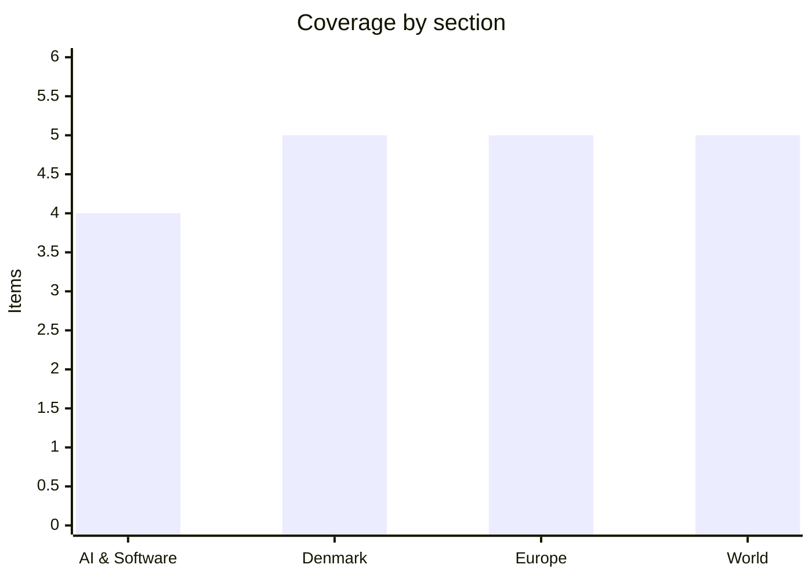

# Daily Briefing — 2026-09-07

**Top line:** Iran's Supreme National Security Council says it will declare a "restricted maritime zone" running from the US blockade line to the Strait of Hormuz within days, blacklisting any ship that transits without coordinating with Tehran — and Brent pushed toward $97 as the tanker war entered its second week of direct US–Iran exchanges.

## Follow-ups

- **Sachsen-Anhalt:** the AfD's 43.8% converted into **39 of 83 seats — three short of the 42 needed for an absolute majority**. The CDU finished on 17.2%, its worst ever result in the state. A CDU–SPD–Green–Left–BSW bloc holds 44 seats, so a non-AfD government is arithmetically possible but would be a five-party coalition spanning the entire non-AfD spectrum. AfD co-chair Tino Chrupalla to Merz: "Friedrich Merz wanted to halve us; we have now halved the CDU." ZDF polling found three-quarters of respondents, and about half of CDU voters, thought Merz personally hurt the result. ([ZDF](https://www.zdfheute.de/politik/deutschland/landtagswahl-sachsen-anhalt-wahlergebnisse-cdu-afd-schulze-siegmund-100.html), [Tagesspiegel](https://www.tagesspiegel.de/politik/die-ersten-reaktionen-zur-wahl-in-sachsen-anhalt-friedrich-merz-wollte-uns-halbieren-wir-haben-jetzt-die-cdu-halbiert-16024052.html))
- **Correction to yesterday's watch list — the Moscow–Kyiv strike pause has not expired.** Two overlapping windows are running: Putin's 72-hour halt on strikes on Kyiv from midnight on 5 September, and Ukraine's own line-of-contact ceasefire order running 00:00 on 5 September to **23:59 on 8 September**. No resumption of strikes was reported today. ([Euromaidan Press](https://euromaidanpress.com/2026/09/05/ukraine-orders-temporary-ceasefire-as-us-envoys-visit-moscow/))
- **Mladić was buried at Topčider today without state or military honours** and with no serving official present — see the Europe section.
- **Anthropic's IPO has slipped to mid-October** and the public prospectus to late September — see AI & Software.
- **Anak Krakatau got worse, not better:** six airports still closed (down from eight), but cumulative disruption is now put at **1,558 flights and roughly 170,000 stranded passengers**, up from yesterday's 1,500-flight figure. ([Tempo](https://en.tempo.co/read/2119084/6-indonesian-airports-remain-closed-as-anak-krakatau-ash-disrupts-flights), [FlightGlobal](https://www.flightglobal.com/asia-pacific/2026/09/jakarta-airport-closure-extends-following-anak-krakatau-eruption/))
- **Nepal:** no verified update. The most recent confirmable figure is *lower* than yesterday's 1,375, which looks like a different counting basis rather than a revision, so it is not being re-reported.

## AI & Software

**Anthropic's IPO slides to mid-October, with the listing timed to land days before the US midterms.** Reuters reported on 5 September, citing sources, that Anthropic now expects to begin marketing its IPO in mid-October at the earliest, with the listing completed shortly before the 3 November midterm elections. The public prospectus, which had been expected as early as this week, is now not anticipated until late September. The delay is procedural rather than a sign of trouble: Anthropic is first finalising a **$15bn revolving credit facility**, after which analysts — including those at the banks financing it — are expected to meet the company. Morgan Stanley, Goldman Sachs, JPMorgan and Citi are working on the deal. Anthropic filed a confidential draft S-1 with the SEC on 1 June, and there is still no public EDGAR filing. Some investors have floated a listing valuation around **$2trn**, which would make it one of the largest IPOs ever attempted and the first real public-market test of AI-lab economics; the last private mark was roughly $965bn on a $65bn round. The mid-October window is tight — it puts a mega-cap AI listing into the same fortnight as the closing stretch of a US midterm campaign, and leaves no slack if markets turn. The second reading is less flattering: pushing a $2trn book into a pre-election window is not obviously the calmest tape to price into, and it suggests the timetable is being driven by the credit facility and SEC review rather than by choice. *(reported, unconfirmed — Reuters sourcing, not company confirmation.)*
Sources: [Reuters via CNBC](https://www.cnbc.com/2026/09/05/anthropic-ipo-launch-shifts-toward-mid-october-reuters.html), [Anthropic](https://www.anthropic.com/news/confidential-draft-s1-sec)

**The EU Cyber Resilience Act's 24-hour vulnerability reporting duty starts this Friday, and it applies retroactively to everything already shipped.** From **11 September 2026**, Article 14 of the CRA obliges manufacturers of any product with digital elements sold in the EU to file an early warning to ENISA and the relevant national CSIRT within **24 hours** of becoming aware of an actively exploited vulnerability or a severe incident, followed by a full notification within **72 hours** and a final report within **14 days** of a fix being available (a month for severe incidents). Reporting goes through a single ENISA platform, which — awkwardly — goes live the same day the obligation becomes mandatory. Non-compliance carries fines of up to **€15m or 2.5% of worldwide annual turnover**, whichever is higher. The scope is the part most teams have underestimated: the duty attaches to every in-scope product already on the EU market, so firmware shipped in 2022 and software installed years before the regulation existed are covered. For anyone running a software business in Europe this is the week the CRA stops being a 2027 compliance-roadmap item and becomes an on-call runbook question — specifically, who is authorised to decide within 24 hours that something is "actively exploited", and who files. The backdrop makes the timing pointed: the Shai-Hulud npm worm campaign that began with the compromise of the *keyv* maintainer's account on 4 August ultimately touched over 1,300 package versions representing around 2bn monthly downloads, exactly the kind of event the 24-hour clock is designed for.
Sources: [European Commission](https://digital-strategy.ec.europa.eu/en/policies/cra-reporting), [Jones Day](https://www.jonesday.com/en/insights/2026/07/eu-cyber-resilience-act-24hour-reporting-duties-start-september-11-2026), [DLA Piper](https://www.dlapiper.com/en-us/insights/publications/2026/08/the-cras-24-hour-rule-preparing-for-the-cyber-resilience-acts-september-2026-reporting-obligations)

**Artificial Analysis rebuilt its leaderboard mid-cycle after the GPT-6 Astra scores drew scepticism, and Claude Fable 5.1 came out on top.** The benchmark firm published **Intelligence Index v4.2** on 4 September, an interim release pulling forward elements of a planned v5 "to keep pace with the frontier". The substantive change is defensive: **40% of the index weighting now comes from private, held-out test sets, double the previous share**, explicitly to make the leaderboard harder to game. It adds two new evaluations — AA-Briefcase, aimed at realistic knowledge work, and GDP.pdf from Surge AI for document analysis — and drops GPQA-Diamond on the grounds that models have simply solved it. On the reworked index Anthropic's Claude Fable 5.1 leads on **57**, with OpenAI's GPT-6 Astra second on **55**, and Meta third among labs ahead of SpaceXAI, Moonshot, Z.AI and Google. Artificial Analysis separately notes Astra is more token-efficient than almost anything else near the frontier, which is a different axis from raw score and matters more for anyone paying per task. Context: the rewrite followed public doubt about how Astra scored on the previous version, and it lands a week after OpenAI president Greg Brockman told reporters he personally thinks Astra may be AGI. The honest reading is that third-party benchmarking is now in an arms race with model releases, and a leaderboard that has to be rebuilt twice in a month to stay meaningful is telling you something about the reliability of any single number in it.
Sources: [Artificial Analysis](https://artificialanalysis.ai/articles/artificial-analysis-intelligence-index-v4-2), [The Decoder](https://the-decoder.com/artificial-analysis-overhauls-its-intelligence-index-after-gpt-6-astra-scoring-drew-skepticism/)

**IFA Berlin has turned into a physical-AI show, and the hardware stack underneath it is largely Chinese.** IFA 2026 runs 4–8 September and the headline theme is robots and on-device AI rather than televisions: humanoid platforms from EngineAI, Unitree, DEEP Robotics, Agibot, Dobot and NEURA Robotics (showing its 4NE1 humanoid), alongside household machines like Dyson's R1 Nurovi Dry and R2 Nurovi Wash+Dry with sensing that adapts cleaning behaviour, plus a run of local-AI home hubs and low-power edge devices. D-Robotics used the show to put its **Sunrise** AI chip family into three shipping consumer robots — TCL's "hey AiMe" companion, Vbot's SuperDog quadruped and xLean's TR1 floor-washer. TCL, Hisense, Haier, DJI and Xiaomi are all present in force; Samsung sat this year out. The framing worth noting is the shift the organisers themselves are pushing — away from conversational assistants toward spatial awareness, physical execution and decentralised compute, i.e. inference that runs on the device rather than in someone's cloud. For European industrial software that cuts both ways: edge inference reduces the data-transfer and sovereignty problems that make cloud AI awkward in regulated sectors, but the reference silicon and reference designs on display in Berlin are overwhelmingly not European. Treat the product claims as vendor marketing — trade-show demos are a poor guide to reliability in a real home.
Sources: [IFA Berlin](https://www.ifa-berlin.com/press-releases/ifa2026-humanoid-robots), [Xinhua](https://english.news.cn/europe/20260905/1e1bbb423ef042849227a66780205df0/c.html), [Tech Digest](https://www.techdigest.tv/2026/09/ifa-2026-key-announcements-so-far.html)

## Denmark

**Von der Leyen signed the EU–Greenland partnership declaration in Nuuk today, hours before Denmark, Greenland and the Faroes opened their own rigsmøde.** The Commission president arrived in the Greenlandic capital on Sunday 6 September alongside Mette Frederiksen for a two-day visit, with the declaration formally signed today. It comes with money: the Commission has proposed **more than doubling EU support for Greenland to €530m over seven years from 2028**, with a further package of more than €150m floated on top. This is von der Leyen's second trip to Nuuk — in March 2024 she opened the Commission's office there and signed cooperation agreements worth close to €94m. Running in parallel, the rigsmøde between Frederiksen, Greenland's Jens-Frederik Nielsen and the Faroes' Beinir Johannesen took place today, with foreign, justice and defence ministers from all three attending; tomorrow the Foreign, Security and Defence Policy Contact Committee turns to the North Atlantic and Arctic security picture. Frederiksen said the Arctic "will play a large role in the coming forsvarsforlig" and that the priority is "how we strengthen cooperation on military armament and increase our common deterrence". Nielsen's line was the one that will travel: Greenland chooses the EU, NATO and the Kingdom of Denmark, and "Greenland and the Greenlandic people cannot be bought — the right to self-determination is our own." The subtext throughout is Washington's continued interest in the island, and the strategy on display is Frederiksen's: turn a bilateral Danish-American problem into a European one.
Sources: [DR](https://www.dr.dk/nyheder/seneste/mette-frederiksen-arktis-kommer-til-spille-en-stor-rolle-i-det-kommende), [ArcticToday](https://www.arctictoday.com/eu-and-greenland-to-sign-partnership-declaration-during-von-der-leyen-visit/), [Kristeligt Dagblad](https://www.kristeligt-dagblad.dk/danmark/rigsfaellesskabets-ledere-samles-i-september-i-nuuk-til-rigsmoede)

**Between 1,000 and 2,000 tractors spelled out "NO FARMERS, NO FOOD, NO FUTURE" in a field north of Ikast on Sunday evening, against a fertiliser law passed four days earlier.** The aerial-photo protest began at 17:00 on 6 September at Favrholt in Ikast-Brande municipality, organised by the grassroots group NoFFF. The target is **L5, the gødskningslov, passed in the Folketing on Thursday 3 September by 119 votes to 34**. From next year each farm receives a quota for how much nitrogen its production may *discharge*, sized to what the local marine environment can tolerate — replacing the previous regime that capped how much nitrogen could be *applied* to fields. It flows from the green tripartite agreement. The environmental driver is hard to argue with: **38 of Denmark's 108 coastal water bodies suffered oxygen depletion in 2026**, with the Kattegat affected for the first time since 2008 and Præstø Fjord for the first time in around sixteen years. The farmers' objection is economic and straightforward — less fertiliser per hectare. Sunday's protest capped a rolling campaign that had already put roughly 300 tractors and around 2,000 farmers outside Christiansborg the previous Tuesday. The politically consequential part is inside Venstre: five of its eighteen MPs — Søren Gade, Amanda Heitmann, Anni Matthiesen, Preben Bang Henriksen and Peter Juel-Jensen — voted against the party line, and chairman Troels Lund Poulsen declined to sanction them. With municipal elections in November and Venstre polling in the 8–10% range, the farm belt is not a constituency the party can afford to lose.
Sources: [DR](https://www.dr.dk/nyheder/indland/reels/landmaend-vil-have-omstridt-lov-taget-af-bordet), [TV MidtVest](https://www.tvmidtvest.dk/ikast-brande/landmaend-demonstrerer-mod-godskningslov-med-luftfoto-f54e3), [Landbrugsavisen](https://landbrugsavisen.dk/stort-flertal-i-folketinget-har-nu-vedtaget-goedskningsloven-324276)

**Mærsk is putting a sail on a container ship for the first time — a 35-metre rotor from a British supplier.** The company announced on 6 September that it has contracted UK firm **Anemoi** to install a rotor sail on one of its Lima-class container ships. The rotor is a rotating cylinder **35m tall and 5m in diameter**, exploiting the Magnus effect to generate thrust perpendicular to the airflow; the vessel is roughly 300m long with capacity for around 8,700 standard containers. Installation is scheduled for **mid-2027**, after which the rotor will be integrated with the ship's existing systems and tested in normal commercial operation on North and South Atlantic routes. Mærsk Tankers has run wind-rotor trials before, but never on the container fleet, which is the core business. The commercial logic sits in regulation rather than romance: FuelEU Maritime and the extension of the EU ETS to shipping mean even single-digit percentage fuel savings show up directly in the P&L, and rotor sails are a retrofit rather than a newbuild commitment, unlike Mærsk's dual-fuel methanol vessels. The caveat is physics — the Magnus effect peaks when apparent wind is roughly perpendicular to the heading, so the fuel gain is highly route- and weather-dependent, and one ship is a pilot, not a fleet decision.
Sources: [TV2](https://nyheder.tv2.dk/business/2026-09-06-maersk-vil-saette-sejl-paa-containerskibe), [Ingeniøren](https://ing.dk/artikel/maersk-satser-paa-35-meter-hoejt-sejl-magnus-effekten-skal-skubbe-containerskibe-frem)

**The government parties have reversed course and now back full openness in the Afghanistan inquiry, dropping the arrangement that let politicians strip their names from quotes.** The switch came in a letter from Foreign Policy Committee (Udenrigspolitisk Nævn) chairman **Karsten Hønge (SF)** to the Folketing Præsidium on 5 September, written on behalf of all four government parties. In **May 2026** the Præsidium had decided — on the committee's own recommendation — that politicians could have their names removed from quotes in the inquiry into Denmark's military engagement in Afghanistan, a break with previous practice for such reviews. The inquiry is being written by researchers at **DIIS** and was commissioned by a broad Folketing majority in **2021**. The reversal followed sustained pressure: a citizens' initiative started by a veteran passed **50,000 signatures** against anonymisation, the military outlet OLFI argued the arrangement was constitutionally dubious, and Frederiksen said in August that the government "supports that there should be openness on these issues". Coming in the same week as Flag Day and the Copenhagen street clashes around it, the veteran constituency's political weight is the through-line. What it does not yet settle is whether the change applies retroactively to interviews already conducted under the anonymisation promise.
Sources: [TV2](https://nyheder.tv2.dk/politik/2026-09-05-regeringen-aendrer-kurs-om-afghanistan-anonymisering), [DR](https://www.dr.dk/nyheder/politik/flertal-droppe-anonymisering-i-afghanistan-udredning)

**Queen Margrethe was admitted to Rigshospitalet on Sunday with a new blood clot and will miss King Harald V's funeral.** Kongehuset said the 86-year-old former monarch was admitted on 6 September after feeling unwell, and that doctors found a new blood clot in the hip region along with mild dehydration, both being treated. She is described as in good spirits but is expected to remain in hospital for the coming week for observation. The immediate consequence is that she will not attend the funeral of Norway's King Harald V at Oslo Cathedral on **Wednesday 9 September at 13:00**; King Frederik X and Queen Mary will represent Denmark, having already cancelled a planned state visit to Belgium to do so. Harald died on 28 August aged 89 at Rikshospitalet in Oslo and has been succeeded by King Haakon. Margrethe abdicated in January 2024 and has had a run of hospital admissions since; DR's health correspondent Peter Qvortrup Geisling played down the severity of this one. Her absence is conspicuous given the guest list — Spanish, Swedish and Dutch royals and Japan's Crown Prince Akishino are all expected — and given that she and Harald were second cousins and reigned in parallel for over three decades.
Sources: [Kongehuset](https://www.kongehuset.dk/presse/pressemeddelelse-h-m-dronning-margrethe-er-blevet-indlagt-paa-rigshospitalet), [TV2](https://nyheder.tv2.dk/2026-09-06-dronning-margrethe-indlagt-paa-rigshospitalet)

## Europe

**Mladić was buried in Belgrade today with no state honours, no military ceremony and no serving official present.** The body of the Bosnian Serb wartime commander, convicted of genocide at Srebrenica and serving a life sentence when he died on 27 August aged 84, lay in state at the Church of St Luke on Vidikovac with public viewing from 09:00 to 12:30, an Orthodox *opelo* at 12:35, and a procession to Topčider Cemetery, where he was interred alongside his daughter Ana. President Aleksandar Vučić did not attend; nor did the prime minister or the parliament speaker. There were no artillery salutes and no ceremonial military presence, and despite family requests he was not buried in the Alley of the Greats. Son Darko Mladić framed it as "a people's funeral" and appealed for restraint; Serbian security services had earlier forecast that tens of thousands might turn out, and no verified turnout figure is available yet. The restraint at the graveside contrasts sharply with **3 September, when the coffin arrived from The Hague on a Serbian government aircraft and *was* received with military honours** — which is what triggered the diplomatic incident. EU enlargement commissioner **Marta Kos cancelled her planned trip to Serbia** on 4 September, saying glorification "is incompatible with the values on which the EU path is built"; Vučić called her statement "extremely brief, but stupid, as usual". Belgium's foreign minister Maxime Prévot called the honours "shameful and disrespectful for the victims". The plausible second reading is that Belgrade calibrated deliberately: honours at repatriation to satisfy the domestic constituency, restraint at the burial to limit the damage to the accession file.
Sources: [Euronews](https://www.euronews.com/2026/09/05/bosnian-serb-war-criminal-mladic-commemorated-in-belgrade-but-no-state-honours), [BalkanInsight](https://balkaninsight.com/2026/09/04/serbias-vucic-slates-eu-condemnation-of-mladic-tributes-as-stupid/btj/), [Al Jazeera](https://www.aljazeera.com/news/2026/9/3/serbia-welcomes-return-of-war-criminal-mladics-body-with-military-honours)

**Witkoff and Kushner finished their Moscow–Kyiv shuttle with "substantive" talks and no breakthrough, and Zelensky called for trilateral negotiations to resume.** The two US envoys met Zelensky in Kyiv on Sunday 6 September, a day after spending more than three hours with Putin in the Kremlin. Kremlin aide **Yuri Ushakov** said Putin told them it was necessary to eliminate "all root causes of the Ukrainian conflict" — the standard Russian maximalist formula, which in practice means Ukrainian neutrality and territorial concessions. The Kyiv session covered security and economic guarantees, a support package, and above all **urgently needed air-defence interceptor supplies**. Witkoff said the US is seeking "a diplomatic resolution rather than a kinetic one" and expressed confidence in "a good resolution"; Kushner backed reviving three-way talks. Peskov's standing position remains that a trilateral presidential meeting is only possible to formalise agreements that already exist — which is a polite way of saying not yet. Background: CIA director John Ratcliffe reportedly floated a Trump–Putin–Zelensky summit during a covert Moscow trip in late August. Zelensky's own summary was blunt — "we expect the war will continue". The ceasefire windows tied to the visit run to 23:59 tomorrow, and what happens at midnight on 8 September is the real test of whether anything was agreed.
Sources: [NPR](https://www.npr.org/2026/09/06/nx-s1-5959657/us-envoys-witkoff-kushner-talks-in-kyiv-putin-moscow), [RFE/RL](https://www.rferl.org/a/kushner-witkoff-putin-zelenskyy-ukraine-russia/33847622.html), [CNN](https://www.cnn.com/2026/09/06/europe/witkoff-kushner-visit-kyiv-intl)

**Ukraine has asked Brussels to fund its first PAC-3 Patriot purchase, which requires punching a hole in the EU loan's European-content rules.** Kyiv has formally requested that several billion euros from the **€90bn EU support loan** be released to buy US-built PAC-3 interceptors. Von der Leyen disclosed the request after meeting NATO Secretary-General Mark Rutte in Brussels on 2 September, saying it was "moving in the right direction". The problem is structural: the loan splits roughly **€60bn for defence procurement and €30bn for budget support**, and its rules cap non-EU and non-Ukrainian content at **35% of a purchase's value** — so buying American interceptors needs a formal carve-out. Since June the EU has disbursed **€8.5bn** from the facility for Ukrainian drones and missiles, all of it consistent with the European-content principle. Brussels was reported to be aiming to approve the Patriot funding as early as this week, with parallel discussions about a NATO contribution, though no decision is formally scheduled — treat the timing as expectation rather than diary. The context is Russia's jet-powered drone campaign against Kyiv and badly depleted interceptor stocks, and the tension is one the EU has been dodging for two years: the loan was designed partly as European defence-industrial policy, and Ukraine's most urgent capability gap can only be filled by Lockheed Martin.
Sources: [Defense News](https://www.defensenews.com/news/pentagon-congress/2026/09/05/ukraine-asks-eu-to-fund-first-pac-3-patriot-buy/), [Euronews](https://www.euronews.com/my-europe/2026/09/02/eu-readies-fresh-cash-for-ukraines-air-defence-as-patriot-stocks-run-low)

**Italy's electoral-law rewrite went back into Senate committee today, with a floor vote set for 15 September.** The Senate Constitutional Affairs Committee resumed voting on amendments on Monday 7 September; the chamber opens debate on 9 September and a final vote is scheduled for **15 September**. On 3 September the committee approved the majority's unified amendment on preferences: the list leader stays blocked, voters may express **up to three preferences** for the rest of the list, and gender alternation begins from the candidate *after* the list leader. Italian reporting describes the wider package as including a **majority premium at 42% with no runoff** and the prime-ministerial candidate's name printed on the ballot — a de facto step toward Meloni's *premierato* without a constitutional amendment — though both are still couched in conditional terms in Italian coverage and should be read as reported-not-final. **697 amendments** were tabled by the 1 September deadline; the opposition has protested the ruling out of **67** of its own, including those that would strip the PM indication or change the premium threshold. All of this lands the week after the Meloni government passed **1,413 days** in office, the longest-lived in the history of the Republic, marked with a rally in Bari on 4 September. Rewriting the electoral law from a governing majority is a familiar Italian move; the question is whether the Quirinale and the Constitutional Court see the premium-without-runoff design as within bounds.
Sources: [ANSA](https://www.ansa.it/sito/notizie/topnews/2026/09/03/via-libera-in-commissione-al-senato-allemendamento-di-maggioranza-sulle-preferenze_8947a505-a96f-406a-bc1c-e652fc7110d1.html), [Carte in Regola](https://www.carteinregola.it/idossier-2/legge-elettorale-2026-cronologia-e-materiali/)

**A Greek F-4 Phantom crashed at an airshow near Athens, killing both pilots in front of thousands of spectators.** A Hellenic Air Force F-4E AUP Phantom II, serial **01504**, came down at approximately **14:55 local** on Saturday 5 September, about two minutes into its display at Tanagra Air Base during Athens Flying Week. Spectator video shows a fast, low run, a roll into a turn back toward the runway, then a descent that never recovers; the aircraft struck the ground beyond the airfield perimeter near an industrial estate that was closed for the weekend and exploded. Both crew, officers of the **117th Fighter Wing** at Andravida, were killed — one named as Squadron Leader **Ioannis Blesias, 40**, from Pyrgos in the western Peloponnese, who leaves a five-year-old son. Greek authorities said there is no indication the ejection system was activated. No spectators were injured. The wider point, which Greek commentators have already made, is that the Phantom remains in front-line Greek service decades after nearly every other NATO air force retired the type, and Greece has been running its upgraded F-4Es alongside Rafales and incoming F-35s as a stopgap. Expect this to feed directly into the procurement and airframe-life debate rather than staying a display-flying story.
Sources: [The Aviationist](https://theaviationist.com/2026/09/05/greek-f-4-phantom-crashes/), [Euronews](https://www.euronews.com/my-europe/2026/09/05/two-pilots-killed-in-phantom-f-4-jet-crash-during-greek-air-force-annual-show)

## World

**Iran says it will declare a "restricted maritime zone" beyond Hormuz within days, and Brent pushed toward $97.** Mohsen Rezaei, secretary of Iran's Supreme National Security Council, said Tehran will shortly announce a zone running from the point where the US naval blockade line begins, through the Strait of Hormuz and into the Persian Gulf; any vessel transiting without coordinating with Iran would be added to an Iranian sanctions list, with knock-on effects on its insurance cover and future passage rights. Rezaei also said the Strait will stay closed unless Washington takes "practical steps" under a peace memorandum he says the two sides signed in June, and that a new shipping corridor jointly designated by Iran and Oman, under Iranian management, will be announced soon. **All of these are Iranian official statements and none has been independently verified or formally promulgated**, and the widest English pickup is via Xinhua wire, so primary coverage is thin. What is verifiable is the price: Brent rose toward **$97/bbl** on Monday, extending last week's gains. This follows the weekend exchange — the US destroying or disabling three Iranian tankers under its "tanker for tanker" policy after IRGC ballistic missiles were fired at a US carrier and a destroyer. US Vice-President JD Vance said Washington will not hold talks until Iran stops attacking shipping in Hormuz. Al Jazeera's assessment on 6 September was that the six-month-old conflict has become a full tanker war, quoting Iran's chief negotiator saying "the era of 'proportionate responses' is over". For Europe the transmission channel is energy prices into an ECB decision on Thursday that is already priced for a hike.
Sources: [Xinhua](https://english.news.cn/20260907/80e810e8c6174d9abd1afb0a73d74780/c.html), [Al Jazeera](https://www.aljazeera.com/news/2026/9/6/us-iran-engaged-in-tanker-war-where-is-the-months-long-conflict-headed), [Trading Economics](https://tradingeconomics.com/commodity/brent-crude-oil)

**An Amazon-branded cargo 767 overran a runway at Miami International, killing five.** 21 Air Flight 7598, a Boeing 767-300 freighter operating for Amazon, overran Runway 30 at around 14:00 local on Sunday 6 September after arriving from Luis Muñoz Marín International Airport in San Juan, Puerto Rico. The aircraft came to rest in a field just outside the airport perimeter, struck multiple vehicles and caught fire, sending a black smoke column over the city. **Five people were killed and five injured**, with reporting indicating the dead included people in the struck vehicles rather than only crew; the toll was initially reported as three and revised upward, so figures may still move. Amazon confirmed it was an Amazon flight operated by 21 Air, a US cargo carrier that flies 767 freighters. The NTSB has launched a go-team and will determine cause jointly with the FAA. Runway overruns on landing are typically a combination of approach speed, touchdown point, braking and runway condition rather than a single failure, so the investigation will focus on the flight data recorder and the approach profile. The commercial angle worth watching is contract-carrier oversight: Amazon does not operate these aircraft itself, and the accident puts the safety governance of outsourced air cargo back in front of US regulators.
Sources: [CNN](https://www.cnn.com/2026/09/06/us/boeing-miami-plane-overruns-runway), [NPR](https://www.npr.org/2026/09/06/nx-s1-5959749/amazon-cargo-plane-crashes-at-miami-airport)

**Yemen's war has reignited, with more than 60 killed on Saturday and government forces retaking Hais near the Red Sea chokepoint.** Fighting between the Saudi-backed internationally recognised government and the Houthis killed **more than 60 people on Saturday 5 September**, according to military and medical sources cited by AFP: 26 government troops, 31 Houthi fighters, and six civilians killed by a missile strike on a bus near government-held Taiz, with seven wounded. **Friday's fighting was deadlier still, at 129 dead by AFP's tally** — among the worst days in years since the collapse of the 2022 ceasefire in July. Government forces said on Saturday they had recaptured **Hais district** south of Hodeidah, a junction linking the Hodeidah, Taiz and Ibb provinces, and captured dozens of Houthi fighters at al-Jarahi. The Houthis have been pushing around Taiz toward the government-held port of al-Makha and the **Bab al-Mandeb** strait. UN OCHA reported roughly **1,800 families displaced in two days**. Al Jazeera's 6 September assessment is that the government gains do not yet amount to a decisive shift. The reason this matters beyond Yemen is the map: with Hormuz effectively closed and now a live fight for the southern end of the Red Sea, both of the region's maritime chokepoints are contested simultaneously — which is the structural story behind the oil price, not the daily headlines.
Sources: [Al Jazeera](https://www.aljazeera.com/news/2026/9/6/how-significant-are-the-yemeni-governments-military-gains-against-the-houthis), [Arab News](https://www.arabnews.com/middle-east/fresh-yemen-clashes-kill-more-than-60-military-medical-sources-3000584)

**Philippine Vice-President Sara Duterte was arrested and bailed over an alleged plot to have President Marcos assassinated.** A Philippine court ordered her arrest on **three counts of grave threats** on Friday 4 September; she surrendered, was fingerprinted, and posted **360,000 pesos (about $5,740)** bail on 5 September, producing a court order lifting the warrant. The charges stem from a November 2024 online news conference in which she said she would have an assassin kill President Ferdinand Marcos Jr., First Lady Liza Araneta-Marcos and then-House Speaker Martin Romualdez if she herself were killed — adding that she was not joking. Duterte denies the allegations and now says she was expressing fear for her own safety rather than threatening the president. The Marcos-aligned House impeached her in May over unexplained wealth, misuse of confidential funds and the same remarks. This is a further escalation in the Marcos–Duterte feud, which began as a governing alliance in 2022 and has become the central axis of Philippine politics ahead of the 2028 presidential race in which she is the presumptive front-runner. The strategic relevance is that the Philippines is a US treaty ally on the front line of the South China Sea disputes, and a prolonged constitutional fight in Manila is a variable Beijing will factor in.
Sources: [Al Jazeera](https://www.aljazeera.com/news/2026/9/4/philippine-court-orders-arrest-of-vp-duterte-over-president-marcos-threats), [NPR](https://www.npr.org/2026/09/05/g-s1-142148/philippines-vice-president-posts-bail)

**Trump pledged $400–500m of super PAC money to the midterms and set a state dinner for Xi Jinping on 24 September.** Trump said he will allocate **$400m–$500m from MAGA Inc.**, his aligned super PAC, to Republican candidates in the **3 November midterms**, describing it as "my money" and saying leftover funds could roll into 2028. MAGA Inc. reported roughly **$403.5m cash on hand as of 31 July**, below Trump's separate claim of having "close to a billion dollars" — so the top of his range is not currently funded. The first tranche is a **$10m** TV and digital buy in the Texas Senate race. Separately, he told reporters on Friday that he will host a state dinner for **Xi Jinping on 24 September** during Xi's Washington visit; in Trump's second term only King Charles III has received comparable treatment, and it follows Trump's own state visit to China in May. CNBC reported on 2 September that expectations for the summit are low, with US sanctions pressure on Chinese buyers of Iranian crude and unresolved trade issues both live irritants. Republicans go into November at real risk of losing the House despite aggressive mid-decade redistricting, which is the context for a personal cash injection on this scale.
Sources: [CNBC](https://www.cnbc.com/2026/09/04/trump-maga-inc-500-million-republicans-midterm-elections.html), [NBC News](https://www.nbcnews.com/politics/2026-election/trump-aligned-super-pac-ads-spend-10-million-texas-senate-race-paxton-rcna596261), [NOTUS](https://www.notus.org/trump-white-house/state-dinner-china-president-xi-jinping-visit-washington-dc)

## Watch list

- **Tuesday 8 September, 23:59:** Ukraine's line-of-contact ceasefire order and Putin's Kyiv strike pause both lapse. Whether strikes resume at midnight is the only real read on whether the Witkoff–Kushner shuttle achieved anything. Canada's retaliatory tariffs on US steel, dairy, appliances, agricultural equipment, pulp and paper and electronics also take effect on 8 September, matching US 50% tariffs on $20bn of Canadian goods "dollar for dollar".
- **Thursday 10 September, 14:15 CET:** ECB decision, with a 25bp hike to 2.5% essentially fully priced and an oil price near $97 arguing against any signal that this is terminal. Watch whether Lagarde links the move explicitly to Hormuz.
- **Friday 11 September:** the EU Cyber Resilience Act's 24-hour reporting obligation takes effect for all in-scope products already on the EU market, with the ENISA reporting platform going live the same day. Also this week: Ukraine's PAC-3 request may or may not clear Brussels — Commission approval was reported as possible "as early as next week", but nothing is formally scheduled.
- **Sunday 13 September:** Swedish general election, all 349 Riksdag seats plus regional and municipal councils. Then Monday 15 September, the Italian Senate's floor vote on the electoral law, and late September for Anthropic's public IPO prospectus.
