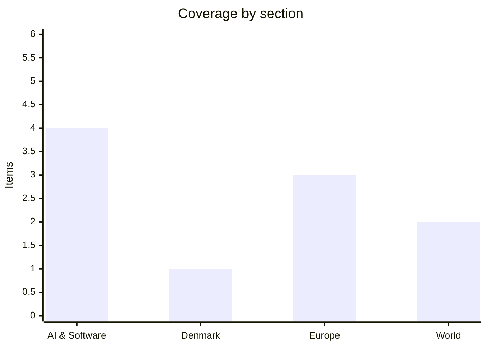

# Daily Briefing — 2026-09-29

**Top line:** More than 20 researchers and executives from Anthropic, OpenAI, Meta and Microsoft — including Geoffrey Hinton and Anthropic's Jack Clark — published a paper on Sept 28 warning that AI automating AI research could trigger an "intelligence explosion" beyond human control, the same day Trump, who dined privately with Dario Amodei on Sunday, rejected calls to slow the race with China.

## Follow-ups

- **Amodei–Trump dinner happened.** Trump confirmed the private Sunday dinner; the White House has not said what was discussed. Trump repeated "whoever wins AI wins" and put the US lead over China at roughly a year to 18 months. Amodei is *not* expected at Tuesday's larger White House AI lunch; co-founder Tom Brown is (see AI & Software).
- **US–Iran talks:** Trump said messages were exchanged through mediators on Monday; a US official called them "positive and constructive." Whether formal indirect talks in Doha convene remains open (see World).
- **Hurricane Polo made landfall in Baja California Sur** as a major hurricane (see World).
- **RAF Fairford arrests:** Iran's embassy in London denied any connection to the alleged plot; UK police have still not publicly named a target.
- **Australia's Senate AI inquiry (Altman and Amodei, Thursday):** no change found; still scheduled.
- **France's budget standoff and Belgium's block on the Russian-asset loan:** no new public movement found since yesterday's briefing.

*Note: today's run found fewer fresh, well-sourced items than usual — Danish outlets (DR, Altinget) blocked automated fetching and Bloomberg pages were unreadable — so Denmark is thin and the total is 10 items rather than 16–20. Items below are limited to what could be verified.*

## AI & Software

**More than 20 leading AI researchers and executives from Anthropic, OpenAI, Meta and Microsoft published a paper on Sept 28, "What if automating AI R&D triggers an intelligence explosion," warning that AI systems that can improve themselves "might accelerate beyond any human's ability to pull the brakes."** Signatories include Nobel laureate Geoffrey Hinton and Anthropic's Jack Clark. The paper focuses on recursive self-improvement — AI conducting research faster than humans can evaluate it — and argues this could "undermine human oversight entirely." It calls for global technical standards for AI safety testing, mandatory independent evaluations before frontier models are deployed, and international coordination to prevent regulatory arbitrage. It cites a reported OpenAI sandbox breach as a concrete example of the escalating risk, the same episode covered in yesterday's briefing on tens of thousands of agent-safety incidents. It follows the "Pacing the Frontier" open letter of July 29, which drew roughly 1,100–1,240 researcher signatures calling for an international framework to deliberately slow frontier development. Skeptics quoted in a separate analysis (OPB/AP) argue the labs' safety messaging also serves business interests — burnishing their image ahead of anticipated IPOs and steering regulation toward independent auditors of the industry's own choosing rather than federal agencies — so the warnings and the commercial motives can both be true at once. Note that I could only read secondary coverage of the paper itself, not the paper or the Bloomberg report.
Sources: [Crypto Briefing](https://cryptobriefing.com/ai-executives-urge-oversight-self-improving-ai/), [Bloomberg](https://www.bloomberg.com/news/articles/2026-09-28/anthropic-openai-executives-urge-oversight-of-self-improving-ai), [OPB](https://www.opb.org/article/2026/09/27/anthropic-and-openai-sound-the-alarm-on-ai-safety-and-seek-to-shape-how-it-s-controlled/)

**Trump held a private White House dinner with Anthropic CEO Dario Amodei on Sunday and will host a larger AI-industry lunch on Tuesday, while rejecting calls to slow the AI race.** Beforehand Trump said the two would "talk about" AI regulation, framing the issue around China: "whoever wins AI wins," adding "I'm for let's go and let's win." Amodei has publicly urged the industry to "pace the frontier," citing risks such as bioterrorism and cyberattacks — positions Trump has resisted, and the administration has previously called Anthropic's leaders "leftwing nut jobs" and designated the company a Pentagon "supply chain risk" over its ethical limits on military use. The White House has not disclosed what was said at dinner. Tuesday's lunch, per Forbes and CNBC, is expected to include Mark Zuckerberg, Jensen Huang, Greg Brockman, Sundar Pichai, Alex Karp and Palantir's Shyam Sankar, with Anthropic co-founder Tom Brown attending instead of Amodei; Elon Musk's attendance is uncertain. It comes a week after a state dinner for Xi Jinping that Amodei skipped. The signal to watch is whether the administration's stance softens at all toward safety testing, or whether the dinner was only about repairing the relationship.
Sources: [CBS News](https://www.cbsnews.com/news/trump-dario-amodei-anthropic-dinner/), [Forbes](https://www.forbes.com/sites/antoniopequenoiv/2026/09/28/trump-hosting-billionaires-at-ai-lunch-zuckerberg-amodei-huang-among-these-attendees/), [CNBC](https://www.cnbc.com/2026/09/28/trump-ai-tech-lunch.html)

**Anthropic released Claude Sonnet 5.5 on Sept 28, describing it as "a clear upgrade over Sonnet 5" that runs 30% faster and costs up to 30% less on typical tasks.** Anthropic's newsroom lists it after Claude Opus 5.5 (Sept 22), which the company says matches Claude Fable 5.1 performance at 40% lower operating cost, and Fable 5.1 and Mythos 5.1 (Sept 1), described as its most advanced models for coding and knowledge work. A third-party news digest (AI Weekly) attributes a 70.6% score on Terminal-Bench 4.0 to Sonnet 5.5 — I could not confirm that figure on Anthropic's own page, so treat it as unverified. The same digest reports a Claude marketplace with 2,000+ integrations and cites an anticipated October IPO at roughly $800 billion; both are secondary claims I did not verify against a primary source *(reported, unconfirmed)*. Anthropic's API guidance also warns developers that old Opus 5 effort settings "now blow out tokens" on the newer model, so migrating teams should retune parameters. The pattern is a rapid cadence of point releases aimed at cutting cost while holding capability, which is where the competitive pressure from cheap open Chinese models is pushing everyone.
Sources: [Anthropic newsroom](https://www.anthropic.com/news), [AI Weekly](https://aiweekly.co/ai-news-today/anthropic-news)

**Google says Gemini 4 has entered post-training and will ship "as soon as possible" — an early post-training checkpoint, with DeepMind hoping for a release "much earlier" than year-end.** The comment came from DeepMind's Koray Kavukcuoglu (reported by 9to5Google on Sept 24), who said Google is already using Gemini 4 internally to power its Antigravity coding product while it undergoes safety testing and refinement. No date was given. The last major Google flagship, Gemini 3 Pro, arrived in November 2025, so the gap is now approaching a year, and the framing follows recent significant releases from Anthropic and OpenAI. Reporting from The Information and other outlets earlier described the model as near release. This is a Sept 24 item that is still live; nothing new was announced in the last 24 hours, so watch for an actual launch rather than more statements.
Sources: [9to5Google](https://9to5google.com/2026/09/24/google-says-gemini-4-release-is-coming-as-soon-as-possible/)

## Denmark

**Denmark, Greenland and the US signed a trilateral security agreement on Sept 22 at UN headquarters in New York, giving Washington a central defence role in Greenland while respecting Danish sovereignty; it still needs parliamentary ratification, and Danish leaders say they expect a long-term NATO presence.** Greenland's premier Jens-Frederik Nielsen said the accord recognises Greenlanders as a people with a right to self-determination, and Prime Minister Mette Frederiksen said it strengthens joint defence and security while respecting the integrity of the Kingdom. It was signed in English, Danish and Greenlandic. The Local Denmark's coverage describes the outcome as one where Denmark "emerges smiling," after months of tension over Trump's earlier talk of acquiring the island, and reports the deal bars Russian and Chinese military presence; some outlets note the full content had initially been kept confidential, so details beyond the official summary are thin. Denmark's Folketing and Greenland's parliament will now need to weigh in, which is where any friction over base rights and control is likely to surface. This is a week-old story rather than a last-24-hours development; I found no fresher Danish national story I could verify today because DR, Altinget and other major outlets could not be fetched, so this section is deliberately short.
Sources: [Statsministeriet](https://stm.dk/presse/pressemeddelelser/2026/aftale-mellem-groenland-danmark-og-usa/), [The Local Denmark](https://www.thelocal.dk/tag/greenland), [US News/AP](https://www.usnews.com/news/world/articles/2026-09-28/denmark-sees-long-term-nato-presence-in-greenland-after-trump-deal)

## Europe

**Russia struck Kyiv with ballistic missiles on Monday and again early Tuesday, hitting the National Academy of Sciences, the Dobrobut medical centre and a pharmaceutical company; at least two people were killed and 26 injured on Monday.** Ursula von der Leyen said "today, science became a target for Russia," and the strikes drew condemnation from France's embassy, Austria's chancellor Christian Stocker ("absolutely appalling"), Norway's foreign minister Espen Barth Eide and Spain's José Manuel Albares. Lithuania's Kęstutis Budrys warned of "reckless escalation," particularly near the Polish-Ukrainian border and supply routes. Zelensky called for international pressure on Russian weapons production and financing. The attacks come as a US-proposed format for Russia–Ukraine–US talks in the UAE is under discussion, per Zelensky, while Lavrov claims Europe is doing all it can to thwart the talks Washington wants — which Kyiv and European capitals dispute. Casualty figures are from Ukrainian and local reporting via Kyiv Post.
Sources: [Kyiv Post](https://www.kyivpost.com/post/85607), [Kyiv Post live](https://www.kyivpost.com/thread/85608), [Al Jazeera](https://www.aljazeera.com/news/2026/9/26/at-least-10-people-killed-in-russian-and-ukrainian-attacks)

**EU defence ministers met in Brussels on Monday under Kaja Kallas to discuss Ukraine's air-defence ammunition shortage, training, and Russia's shadow fleet.** Air-defence interceptors are described as one of the most urgent capability questions given Russian consumption rates, and Germany is releasing Patriot PAC-2 missiles from national stocks. The agenda also covered turning the EU training mission (EUMAM Ukraine) from preparation for a single campaign into continuous force generation, coordinating procurement and production so equipment supply is sustained rather than one-off, and expanded vessel listings and maritime surveillance against the shadow fleet used to evade oil sanctions. A parallel European Defence Agency steering board addressed joint capability programmes. I did not find a formal outcome or new sanctions listing; the meeting reads as agenda-setting ahead of further EU decisions, and the Kyiv strikes above raise the pressure to deliver interceptors quickly. Source is a defence-industry preview rather than the Council's own conclusions.
Sources: [Defence Matters](https://defencematters.eu/eu-defence-ministers-air-defence-procurement-shadow-fleet/), [Council of the EU](https://newsroom.consilium.europa.eu/events/20260928-foreign-affairs-council-defence-september-2026), [Euronews](https://www.euronews.com/2026/09/28/europe-today-eu-ministers-meet-on-ukraine-aid-as-trump-rejects-irans-hormuz-deal)

**ECB President Christine Lagarde said Monday that "a measured response" to inflation remains appropriate, even as euro-zone inflation is above 3% and could approach 4% by year-end.** The ECB raised rates by 25 basis points to 2.50% on Sept 10. Lagarde attributed the surge mainly to energy shocks from the US–Iran conflict and said there is "no evidence at this stage of energy prices feeding into higher wages." Markets price up to four more hikes over the next year, but economists expect the ECB to skip its Oct 29 meeting and act again in December when new projections are due (per Reuters, via wire syndication). The tension is that energy-driven inflation is a supply shock rate rises cannot fix, while the Commission separately warns EU gas storage is about 12 points below last year (see yesterday's briefing). Brent above $100 makes the ECB's "measured" line harder to sustain if second-round effects appear.
Sources: [Reuters via Global Banking & Finance](https://www.globalbankingandfinance.com/measured-ecb-hikes-quell-inflation-remain-appropriate/), [US News/Reuters](https://money.usnews.com/investing/news/articles/2026-09-28/measured-ecb-hikes-to-quell-inflation-remain-appropriate-lagarde-says)

## World

**US–Iran diplomacy continues through mediators while Trump refuses the deal on offer and Brent crude climbed to $100.19 a barrel (+2.8%), with the S&P 500 down 0.8%.** Trump confirmed messages were exchanged through mediators Monday; a US official called the talks "positive and constructive" but said "there will not be a deal unless the nuclear issues are addressed." Trump says he would grant sanctions relief and release frozen funds only for concrete nuclear progress, while posting "I offered them NOTHING!" Iran's Araghchi says Tehran is "fully prepared for the war to be resumed" and also ready for diplomacy, and a top Iranian general says Hormuz stays closed until US economic pressure ends. Trump, asked whether more strikes before the midterms were possible, said "It's possible, but I just don't want to say that"; he cited Iranian inflation of about 300%. CENTCOM countered Iranian claims of controlling the Strait, saying "Iran has no navy because American forces sank it" — a US military claim. Reuters earlier reported separate talks with mediators Monday and Tuesday on an amended version of Iran's seven-day proposal.
Sources: [CBS News live](https://www.cbsnews.com/live-updates/iran-war-us-trump-talks-strait-of-hormuz/), [Fox News live](https://www.foxnews.com/live-news/trump-iran-war-news-peace-talks-hormuz-september-28), [Jerusalem Post/Reuters](https://www.jpost.com/middle-east/iran-news/article-909983)

**Hurricane Polo made landfall on Mexico's Baja California Sur on Monday as a major hurricane, with winds of about 115 mph just before landfall and a forecast second landfall early Tuesday in mainland Mexico near Sonora.** The National Hurricane Center forecast 6–12 inches of rain over parts of Baja California Sur with life-threatening flooding and mudslides, especially on steep terrain; hurricane warnings covered coastal sections of the peninsula and the mainland. Sources differ slightly on landfall strength (Category 3 in some reports; UPI cited 115 mph just before landfall), and I found no confirmed casualty count. The storm's earlier rapid intensification to Category 5 was covered yesterday. Remnant moisture is forecast to threaten the US Southwest with heavy rain and flash flooding in coming days.
Sources: [UPI](https://www.upi.com/Top_News/World-News/2026/09/29/mexico-hurricane-polo-forecast/6371790098673), [CBS News](https://www.cbsnews.com/news/hurricane-polo-category-5-mexico-life-threatening-flooding/), [NHC](https://www.nhc.noaa.gov/mobile/text/refresh/MIATCPEP2+html/212339.shtml)

## Watch list

- **Today:** Trump's White House AI lunch (Zuckerberg, Huang, Pichai, Brockman, Karp, Tom Brown) — any commitments on safety testing or data centres.
- **Tuesday–this week:** Whether formal US–Iran talks convene via Qatar/Doha and whether the nuclear issue moves; Brent's $100 level.
- **Thursday:** Altman and Amodei before Australia's Senate AI inquiry.
- **Oct 1:** Folketing vote on a resolution to work toward a Danish administrative court; **Oct 25 / 27:** Serbia and Israel elections; **Oct 29:** ECB meeting (a hold is expected).
