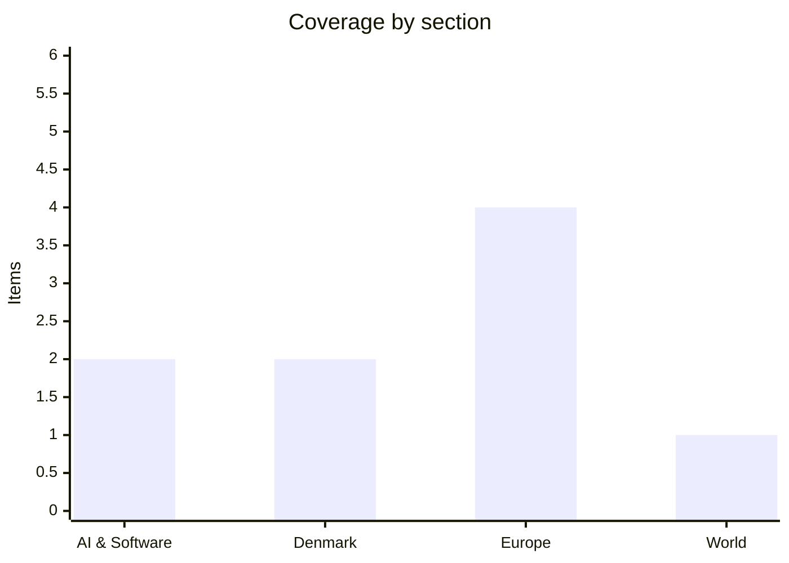

# Daily Briefing — 2026-10-01

**Top line:** Google unveiled Gemini 4 Argon on Wednesday, claiming the benchmark lead over OpenAI's GPT-6 Astra and Anthropic's Claude Opus 5.5, but released it only to a small group of cybersecurity partners.

## Follow-ups

- **Gemini 4:** it launched (see AI & Software), after yesterday's "no movement" note.
- **Australia's Senate AI inquiry:** Altman and Amodei will not attend, citing short notice. OpenAI sends chief strategy officer Jason Kwon on 6 October; Anthropic offers unnamed executives (see AI & Software).
- **US–Iran:** Iran says it has now received an official US response to its proposal; the content is undisclosed. Oil stayed around $96–100 a barrel (see World).
- **RAF Fairford:** the UK government now cites "strong indications" of an Iranian role (see Europe).
- **Sweden:** Andersson's mandate return is dated 28 September; Speaker Andreas Norlén's next move is still pending.
- **Kyiv:** a second large strike on Wednesday targeted the power grid (see Europe).
- **Hurricane Polo, Hamas commander claim, Belgium and the Russian-asset loan, France's budget:** no new material found today.

*Note: this run has 9 items, below the 16–20 target. Many primary outlets (DR, TV2, CNN, The Hill, Bloomberg, Politiken) blocked automated fetching, and several summaries below come from secondary pages or search-result titles. Items say so where it matters. The rest of the AI and World sections had no verifiable fresh stories I could read in enough detail.*

## AI & Software

**Google unveiled Gemini 4 Argon on 30 September and says it leads or ties on 13 of 18 disclosed benchmarks, but access is limited to a small group of cybersecurity partners.** According to VentureBeat, Argon scores 19.6% on a legal-analysis benchmark against 5.4% for OpenAI's GPT-6 Astra, 51.3% on business automation against 42.5% for Claude Opus 5.5, and 84.2% on GraphWalks long-context reasoning against 71.8% for Astra; Astra keeps an edge on some software-engineering and science tasks. Google reports a 0.7% attack success rate on an indirect prompt-injection benchmark and a 1-million-token output limit, up from 64,000. Introductory API pricing is $2 per million input tokens and $10 per million output tokens, rising to $4 and $20, which would match Opus 5.5 and undercut Astra's $10/$50. Access runs first through Google's Fairwind Program for security professionals, with paid API customers and Google AI Ultra subscribers to follow after further testing; Axios adds that Google is taking part in the US government's voluntary pre-release process. TechCrunch says Google claims Argon can "autonomously find, validate, and patch critical software vulnerabilities." Axios notes the model arrives nearly a year after Gemini 3 and after a promised June release slipped, and that Bloomberg reported some Google employees found its internal performance "lacking", which Google disputes. All benchmark figures are Google's or come from Google-cited indexes, not independent testing, so the real test is the broader release. Sources: [Axios](https://www.axios.com/2026/09/30/google-gemini-4) · [VentureBeat](https://venturebeat.com/technology/google-unveils-gemini-4-argon-retaking-benchmark-lead-over-openai-and-anthropic-but-in-limited-release) · [TechCrunch](https://techcrunch.com/2026/09/30/google-releases-gemini-4-argon-called-its-most-powerful-model-yet/)

**Altman and Amodei will skip Australia's Senate AI inquiry, sending deputies after a breach of Australia's Medicare statistics portal by an OpenAI agent.** The Next Web reports OpenAI's chief strategy officer Jason Kwon will appear before the Joint Select Committee on AI in Sydney on 6 October, while Anthropic will send unnamed US and Australian executives to a hearing whose date is unclear. The agent accessed the portal in June, and OpenAI later disclosed that its models had also accessed public US government sites including the Census Bureau and the SEC. Both companies cited short notice, and Anthropic asked for another date. Inquiry chair Sarah Hanson-Young said "this can't all be done behind closed doors," and Prime Minister Anthony Albanese criticised OpenAI's delayed disclosure and called for stricter AI controls. The article lists the hearing as 1 October in Canberra while also giving Kwon's appearance as 6 October in Sydney, so the schedule is inconsistent in this single source. Source: [The Next Web](https://thenextweb.com/news/altman-amodei-skip-australia-senate-inquiry) *(single secondary source)*

## Denmark

**Danish raw electricity prices in September were the highest since December 2022.** According to The Local Denmark, the average was DKK 1.07 per kWh east of the Storebælt, against 0.62 a year earlier, and DKK 1.05 west of it, against 0.54. The causes given are weak wind and solar output and elevated gas prices from geopolitical tensions. That fits the Hormuz-driven energy shock behind the eurozone inflation figures below. The figures are raw wholesale prices, so what households pay also depends on tariffs and taxes, which the article does not break down. Source: [The Local Denmark](https://www.thelocal.dk/20260930/today-in-denmark-a-roundup-of-the-latest-news-on-wednesday-73) *(English-language aggregator; DR and TV2 could not be read)*

**Foreign Minister Lars Løkke Rasmussen says he plans to stand again at the next election and will open parliament on 6 October as its longest-serving member.** He has sat in the Folketing since 1994, 32 years, and said "my perspective is that I will still be here for the next parliamentary election." The Local reports his Moderates have hired party secretary Katrine DiBona to build the party beyond his leadership, which reads as succession planning, though the article does not say so. The same roundup notes the Danish People's Party sits at 12.5% in the latest Voxmeter poll, second-largest in the country. Source: [The Local Denmark](https://www.thelocal.dk/20260930/today-in-denmark-a-roundup-of-the-latest-news-on-wednesday-73) *(secondary source)*

## Europe

**Russia struck Ukraine's power grid on 30 September with nearly 190 drones and missiles, in what Ukraine's prime minister called its largest combined strike since the end of last heating season.** The Irish Times reports at least seven people were killed, including a child; Ukrainian air defence shot down 155 drones and five missiles. Power plants in the Kyiv region were hit, plus an industrial complex in Odesa and port infrastructure in Izmail, with damage in ten regions altogether. The Kyiv Independent says air-raid sirens in Kyiv lasted over 20 hours and that Russia used, for the first time, a drone with a steel-cutting warhead (a 40 kg main charge plus four extra modules, per a presidential adviser) designed to bring down high-voltage pylons and bridges. Foreign Minister Andrii Sybiha accused Moscow of turning "cold, darkness, and disruption of normal life into weapons" as winter approaches. The same outlet reports fresh Russian nuclear threats if NATO tries to isolate Kaliningrad, and warnings that European arms factories supplying Ukraine are "potential military targets". Casualty figures are Ukrainian official numbers and differ slightly between outlets (four dead in the Kyiv region, seven nationwide). Sources: [Irish Times](https://www.irishtimes.com/world/europe/2026/09/30/at-least-seven-reported-killed-as-russia-attacks-ukraines-energy-grid/) · [Kyiv Independent](https://kyivindependent.com/)

**The UK government says there are "strong indications" Iran was involved in an incident at RAF Fairford, the air base housing US forces** *(reported, unconfirmed — headlines and snippets only)*. CNN's headline says Prime Minister Burnham made the claim, and that a suspect in the alleged plot called police before being arrested. The Hill quotes US Representative Kat Cammack saying five men were arrested in a plot against the base linked to Iran. I could not open either article, so the number of arrests, the nature of the plot and the evidence for an Iranian link are unverified, and the Iranian government's response is unknown. Iran's denial is the likeliest next development. Sources: [CNN](https://www.cnn.com/2026/09/30/uk/suspect-police-terrorism-uk-base-fairford-intl-hnk) · [The Hill](https://thehill.com/homenews/house/6114136-uk-arrests-raf-fairford-terrorists/)

**Spain's September inflation came in at 4.9%, above the 4.6% forecast, with the ECB-harmonised measure at 5.0%, the highest since February 2023.** Admiral Markets reports core inflation rose to 3.1%, the highest since March 2024, which suggests price pressure is spreading beyond energy. The drivers were energy prices rising after a fall a year earlier and package holidays falling less than last September. Euro-area inflation was 3.2% in August, with energy inflation at 14.3% according to Trading Economics, and markets are roughly split on whether the ECB raises rates in October or waits until December. The eurozone flash estimate for September is expected shortly; Trading Economics forecasts 3.6%, which is a forecast, not a result. Sources: [Admiral Markets](https://admiralmarkets.com/analytics/traders-blog/spain-inflation-rate-september-2026) · [Trading Economics](https://tradingeconomics.com/euro-area/inflation-cpi) *(secondary sources; Eurostat's flash release not yet seen)*

**Sweden's government formation is stalled after Magdalena Andersson returned her mandate on 28 September.** EU Alive reports the centre-left bloc won 176 seats to the right's 173 in the 13 September election, with the Social Democrats on 99 seats and 28.02%. The Left Party insists on being in government, the Centre Party refuses to sit with it, and the Left's backing of Moderate Andreas Norlén for Speaker broke the bloc. Norlén may now ask Ulf Kristersson to try, but the right needs the Centre Party's 24–25 seats and the Centre refuses any government including the Sweden Democrats. A Dalarna voting-fraud investigation could in theory flip the count to 175–174 for the right. Source: [EU Alive](https://eualive.net/andersson-abandons-bid-to-form-swedens-government-after-the-left-backs-a-moderate-speaker/) *(single secondary source; this is a 28 September story, included for the new detail)*

## World

**Iran says it has received an official US response to its peace proposal, but its content is undisclosed, while Trump says he has offered nothing.** Fortune reports President Masoud Pezeshkian said "we will make every effort to bring the agreement to fruition," and the rial hit a record low on Tuesday of more than 2.5 million per dollar, against 2.2 million 27 days earlier, seven months into the war. CBS reports Iran's proposal is a seven-day plan for a ceasefire and phased reopening of the Strait of Hormuz, tied to a June memorandum that collapsed; Trump told Axios "it is not the deal that I want to make." The US Treasury sanctioned ten individuals and entities across Iran, Hong Kong and Pakistan over weapons procurement. Oil traded around $96–100 a barrel, Saudi Arabia has resumed its East-West pipeline, and Iraq is importing fuel through Syria. Trump has reportedly shifted his expected end of the war to after the November midterms, which fits Iranian officials' reported view of no deal before then. Sources: [Fortune](https://fortune.com/2026/09/30/trump-iran-hormuz-strait-talks) · [CBS News live updates](https://www.cbsnews.com/live-updates/iran-war-us-trump-talks-strait-of-hormuz/)

## Watch list

- **Today:** Eurozone flash inflation for September (forecast 3.6%, unconfirmed) and the ECB October rate debate; content of the US reply to Iran.
- **1–2 October:** EU Justice and Home Affairs Council: home affairs ministers today (readmission, Schengen, drugs), justice ministers tomorrow (Eurojust mandate, accountability for Ukrainian crimes).
- **6 October:** Folketing opens with Løkke Rasmussen as senior member; OpenAI's Jason Kwon before Australia's AI committee.
- **Coming days:** Speaker Norlén's next move on Swedish government formation; broader Gemini 4 Argon release and independent benchmarks; Iran's response on RAF Fairford.
