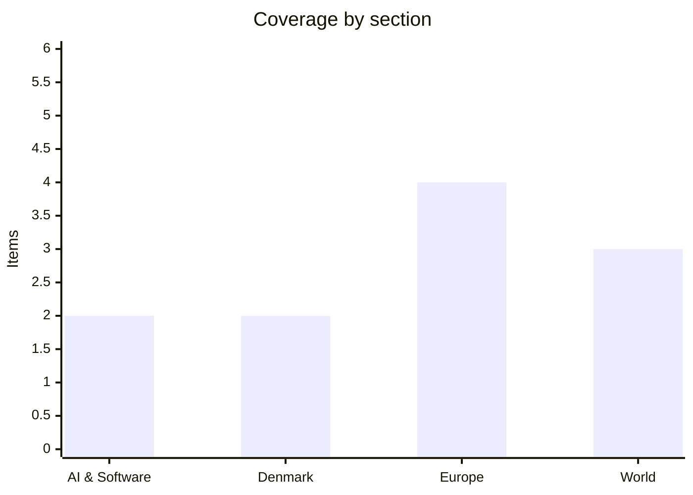

# Daily Briefing — 2026-10-03

**Top line:** A Flydubai co-pilot stabbed his captain in the cockpit of a Tel Aviv-bound flight and tried to crash the plane; Trump says he will hit Iran "very hard" if Tehran is linked to it, while Britain charges two Iranians over a separate Manchester bomb plot.

## Follow-ups

- **RAF Fairford:** police now say a dual UK-Iranian national was arrested on Thursday over a suspected plot against the base, and that it is unconnected to the Manchester charges below (see Europe).
- **Kyiv:** Russia has now hit a key Kyiv bridge three days running, after the 30 September grid strike (see Europe).
- **Eurozone flash inflation and ECB:** I could not find the Eurostat flash release for September, so the 3.6% forecast remains unconfirmed.
- **Gemini 4 Argon, Australia's Senate AI inquiry, Sweden's government formation, US reply to Iran:** no material new reporting found today.

*Note: this run has 11 items, below the 16–20 target. Search returned mostly generic or stale results, and many primary outlets could not be read, so items rely on a handful of outlets that could be fetched (Al Jazeera, Euronews, Kyiv Independent, The Local Denmark, TechCrunch headlines). Items flag where detail is thin.*

## AI & Software

**Apple is tightening macOS "Full Disk Access" controls because of risks from AI agents.** TechCrunch's front page, my only source for this and read as a headline summary, says Apple is adding stricter security around the permission that lets apps read nearly everything on a Mac. The stated reason is the danger of AI agents, which increasingly run with broad file access on developers' machines. The change matters for anyone running coding agents locally, since tools that depend on blanket disk access may need reworking. Details such as the macOS version and the exact new prompts were not available to me. Source: [TechCrunch](https://techcrunch.com/) *(headline-level; article not read)*

**Meta is courting developers to build devices around its Muse assistant, following last week's "Muse Charm" pendant.** TechCrunch reports Meta wants third-party gadgets "infused" with Muse, after Axios and the Irish Times covered the 23–24 September unveiling of Muse Charm, a pocket or keychain device for the assistant. This extends Meta's AI-hardware push beyond its smart glasses toward a platform other manufacturers can use. Terms, pricing and developer access were not visible to me, so whether this is an open platform or a licensing scheme is unknown. Sources: [TechCrunch](https://techcrunch.com/) · [Axios](https://axios.com/2026/09/23/meta-muse-ai-hardware-handheld-glasses) *(headline-level for the new development)*

## Denmark

**A hacker attack at DTU, the Technical University of Denmark, may affect up to 200,000 people.** The Local Denmark reports that "a large amount of data" was downloaded from the university's user database. The headline figure of up to 200,000 is far larger than DTU's current enrolment, which suggests the database includes former students, staff and other registered users, though the article summary I could read does not say so. The data types involved, the date of the breach and whether DTU has notified the Danish data protection authority were not available to me. Expect questions about what was stored and how long. Source: [The Local Denmark](https://www.thelocal.dk/20261002/hacker-attack-at-dtu-could-affect-up-to-200000-people) *(English-language aggregator; I could not open DR or TV2 coverage)*

**EU nations will hold an emergency meeting on soaring diesel prices amid US pressure.** The Local reports the meeting; the background comes from a 29 September report that the White House urged the EU to release emergency diesel reserves. US retail diesel is around $6.50 a gallon, a record, and US distillate stocks are 13% below a year ago, the lowest seasonal level in over 40 years. Trump publicly backed restricting diesel exports on 22 September, and Europe takes roughly a quarter of US diesel exports, so European benchmarks rose more than 5% on the threat. EU officials note that emergency stocks, set at 90 days of net imports or 61 days of consumption, are meant for major supply disruptions, not price management. Whether the meeting agrees a coordinated release is the open question. This is a Europe-wide story with a Danish pump-price angle, as Denmark's September electricity prices were already the highest since 2022. Sources: [The Local Denmark](https://www.thelocal.dk/20261002/eu-nations-to-hold-emergency-meeting-on-soaring-diesel-prices-amid-us-pressure) · [ROIC](https://www.roic.ai/news/white-house-urges-eu-to-tap-diesel-reserves-as-global-fuel-crunch-deepens-09-29-2026) *(aggregator for the figures)*

## Europe

**Britain has charged two Iranian nationals over an alleged bomb plot against Manchester's Jewish community, and separately arrested a dual UK-Iranian national over a suspected plot against RAF Fairford.** Rahman Salehi, 34, and Salam Ahmadyan, 36, were arrested in Manchester on 20 September, Yom Kippur, and are charged with preparing a terrorist act. Counter-terrorism police say they tried to acquire components for an improvised explosive device, conducted reconnaissance of targets, and were in contact with an overseas third party "who may be in Iran". Both arrived by small boat from Europe years ago, one with asylum and one with a pending claim; they appear at Westminster Magistrates' Court on Saturday. Home Secretary Shabana Mahmood said Iran targets Jewish communities "often through proxies". Detectives say there is no link to the Fairford case, so the two should not be read as one plot, though both feed the UK government's stated suspicion of Iranian involvement. The charges come a year after the Heaton Park synagogue attack that killed two. Source: [Al Jazeera](https://www.aljazeera.com/news/2026/10/3/two-iranians-charged-over-alleged-plot-targeting-jewish-community-in-uk)

**Russia hit a key Kyiv bridge for a third straight day, halting traffic.** Mayor Vitali Klitschko said the bridge's surface and trolleybus overhead lines were damaged. Separately, Russian drones struck a pharmaceutical warehouse in Hostomel, injuring four people including a child, and Ukraine's Foreign Ministry says no embassies have asked to leave Kyiv despite the bombardment. This follows the 30 September strike of nearly 190 drones and missiles on the grid. Repeated hits on one crossing suggest an effort to cut transport links as well as power ahead of winter. Source: [Kyiv Independent](https://kyivindependent.com/)

**Russia has expelled Hungarian diplomats as Budapest breaks with Orbán-era foreign policy.** Euronews reports the expulsions in a headline and short summary only. They signal a sharp change in the Hungary-Russia relationship following the political shift in Budapest that ended Orbán's government. The number of diplomats, the trigger and Hungary's reply were not available to me. If this is a tit-for-tat after Hungarian moves, expect Budapest to answer in kind. Source: [Euronews](https://www.euronews.com/news) *(headline-level)*

**South Korea's president is threatening "additional measures" against Ukraine unless Kyiv publicly apologises over the handling of captured North Korean soldiers.** Euronews and the Kyiv Independent both carry the dispute; the exact grievance, apparently the transfer of the prisoners, is only sketched in the summaries I could read. It matters because Seoul has been a significant, if cautious, supporter of Ukraine, and a rift touches the sensitive question of what happens to North Korean troops fighting for Russia. Kyiv's response had not surfaced. Sources: [Euronews](https://www.euronews.com/news) · [Kyiv Independent](https://kyivindependent.com/) *(thin detail)*

## World

**A Flydubai co-pilot stabbed the captain mid-flight on a Tel Aviv-bound plane carrying 174 people, and the aircraft dropped about 17,000 feet before recovering.** Captain Smit Machchhar told Indian Prime Minister Narendra Modi, in a call reported by Al Jazeera, that he opened the cockpit door while still being hit, letting passengers and crew in to overpower the co-pilot. A second pair of Flydubai pilots then landed the plane at Tabuk, Saudi Arabia, and the captain is recovering in a UAE hospital. A UAE presidential adviser called it a "terrorist act" and an investigation into terrorism links has begun. Trump said he would strike Iran "very hard" if Iranian involvement is confirmed, and Netanyahu suggested "Islamist radical indoctrination", but neither has published evidence and the co-pilot's identity was not disclosed. With US–Iran talks stalled and Hormuz disrupted, an unproven Iran link could quickly harden positions. Sources: [Al Jazeera](https://www.aljazeera.com/news/2026/10/2/flydubai-pilot-recounts-cockpit-stabbing-in-call-with-indian-pm-modi) · [Euronews](https://www.euronews.com/news)

**North Korea fired at least one ballistic missile from Wonsan toward the sea off its east coast, a day after Kim Yo Jong said the North will "permanently cut ties with the South."** South Korea raised alert levels for further launches and Japan issued an emergency warning over the suspected missile. Kim Yo Jong's statement rejected Seoul's demand for an apology over landmine blasts in the demilitarized zone. The launch fits a run of hypersonic tests, live-fire drills and the commissioning of a new warship. Source: [Al Jazeera](https://www.aljazeera.com/news/2026/10/2/north-korea-fires-ballistic-missile-towards-the-sea-south-korea-says)

**The US and Australia have suspended diplomatic operations in Brazil ahead of its elections, citing security concerns.** Al Jazeera's summary gives no detail on the specific threat, the length of the suspension or Brazil's response. Pulling routine consular activity before a vote is unusual and implies a credible security assessment, but the nature of it is unverified here. Source: [Al Jazeera](https://www.aljazeera.com/news/2026/10/3/us-and-australia-suspend-diplomatic-operations-in-brazil-before-election) *(headline-level)*

## Watch list

- **Today:** the two Iranians' first appearance at Westminster Magistrates' Court; any Iranian response to Trump's threat and the Flydubai investigation's findings.
- **Coming days:** the EU emergency diesel meeting and whether any release of stocks is agreed; a possible US diesel export restriction.
- **6 October:** Folketing opens; OpenAI's Jason Kwon appears before Australia's AI committee.
- **Unconfirmed:** Eurostat's September flash inflation and the ECB's October rate decision; Seoul's next step against Kyiv.
