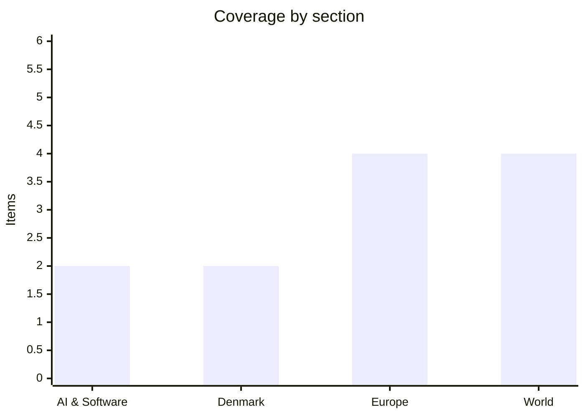

# Daily Briefing — 2026-10-06

**Top line:** Hackers used a Danish company's legitimate access to the national CPR register to extract names, addresses and CPR numbers of about 8.8 million people, roughly 80% of everyone registered in Denmark.

## Follow-ups

- **EU diesel meeting:** the technical meeting on Friday 2 October reached no decision; Energy Commissioner Dan Jørgensen called a fresh stock release "a possibility". Euronews now reports the G7 announced a release of 100 million barrels of diesel and crude after Trump's export-ban threat (see Europe).
- **Kyiv strikes:** Merz visited Kyiv on Sunday with a €1.3 billion package (see Europe).
- **DTU breach:** still the same story as Friday; the new national CPR leak (below) is a separate and much larger incident.
- **Flydubai cockpit attack and Iran link:** I found no new confirmed reporting of an Iranian link; Trump's threat remains conditional. Eurostat flash inflation and the ECB, Seoul's dispute with Kyiv, and the Manchester court hearing: nothing new found.

*Note: this run has 12 items, below the 16–20 target. Search returned mostly headlines and I could only open a handful of outlets (Al Jazeera, Euronews, TechCrunch, The Local Denmark); DR, TV2 and the Danish dailies could not be read. Items flag thin detail where relevant.*

## AI & Software

**Reflection AI has launched Beam, an open-weight model aimed at matching leading Chinese open models at lower compute cost.** Beam is a 501-billion-parameter mixture-of-experts model with 23 billion active parameters, trained on 23.8 trillion tokens, with a 1 million token context window; it is text-only. Reflection claims it matches Chinese open models on advanced reasoning benchmarks while using 3–4x less inference compute than Z.ai's GLM-5.2 (about 744 billion total, 40 billion active), and says it beats Mira Murati's Inkling on four coding benchmarks. TechCrunch notes none of this is independently verified. The company has raised about $4.7 billion (Nvidia, Sequoia and Lightspeed among backers) at a $25 billion valuation and has over $7 billion in compute deals with SpaceX and Nebius. Weights are due in October via hyperscalers and open-source libraries; the licence was not stated. It is the most serious US attempt so far to answer Chinese open-weight dominance, so licence terms and independent evals are the things to watch. Source: [TechCrunch](https://techcrunch.com/2026/10/05/reflection-debuts-beam-a-open-weight-ai-model-to-rival-chinese-models-at-lower-compute-cost/)

**OpenAI will start invisibly watermarking ChatGPT text in the EU to comply with the AI Act's transparency rules, which took effect on 2 August.** The system, called textGrain, uses a secret key to subtly bias next-word choices, leaving a statistical pattern a detector can find even after copy-paste. It rolls out over the coming weeks to ChatGPT and Codex users in the EU; API developers anywhere can enable it now, but it is off by default outside the EU. OpenAI's own testing shows its limits: replacing 10% of words with synonyms drops detection from 92% to 66%, and short passages, maths answers and translations are harder to detect. So it is a compliance measure more than a reliable provenance tool. It is also another case of EU rules producing region-specific product behaviour. Source: [TechCrunch](https://techcrunch.com/2026/10/05/openai-will-start-watermarking-chatgpts-text-in-the-eu/)

## Denmark

**Unauthorised users obtained names, addresses and CPR numbers of about 8.8 million people from Denmark's national person register.** The CPR administration, under the digital affairs ministry, says the attackers exploited a Danish company's legitimate access to the system, and that the data includes deceased and emigrated people; registered persons total roughly 11 million. The administration has revoked the company's access, brought in specialists, and reported the incident to the Danish Data Protection Authority and the police, and it points citizens to sikkerdigital.dk and warns against sharing passwords in unsolicited contacts. CPR numbers are used as identifiers across Danish public and private services, so the main risk is fraud and impersonation rather than direct account access. The open questions are which company it was, how long the access was abused, and who bears liability. This follows Friday's DTU breach of up to 200,000 people, though nothing reported links the two. Source: [The Local Denmark](https://www.thelocal.dk/20261005/hackers-get-personal-info-on-8-8-million-people-in-denmark-govt-data-leak) *(English-language aggregator quoting the ministry; I could not open DR or TV2)*

**The government says it will resubmit the stalled citizenship bill covering 2,055 people and their children in the first half of 2027.** Applicants will be re-reviewed under a new screening model assessing alignment with democratic values and human rights, so some previously approved people may be excluded, and children who have turned 18 since approval will not be covered. The Social Liberals welcomed it ("lift them over the finish line"), while the Danish People's Party leader claimed citizenship would be granted "without screening". One approved applicant described being used as "a bargaining chip". The delay of at least several months leaves people who were already approved in limbo, and the new screening criteria are likely to be the next fight when Folketing opens. Source: [The Local Denmark](https://www.thelocal.dk/20261005/danish-government-to-resubmit-stalled-citizenship-bill-in-first-half-of-2027)

## Europe

**The G7 has agreed to release 100 million barrels of diesel and crude, per Euronews, after Trump threatened a 90-day US diesel export ban unless Europe supplied more.** A virtual G7 meeting that included Macron preceded the announcement. It follows Friday's inconclusive technical meeting in Brussels, where Commissioner Jørgensen called a release "a possibility"; European diesel is at a record €2.24 per litre, and the previous emergency release was 400 million barrels in March. Diplomats described US pressure as "rough", and Treasury Secretary Bessent pushed publicly, with the November US midterms in the background. The split between how much is diesel versus crude, and each country's share, was not available to me. Whether a one-off release lowers prices before winter is doubtful. Sources: [Euronews](https://www.euronews.com/2026/10/05/merz-and-mathernova-send-a-message-to-moscow-from-kyiv) · [Euronews, 2 Oct](https://www.euronews.com/2026/10/02/eu-holds-crisis-meeting-as-us-pressure-mounts-to-release-emergency-oil-stocks) *(G7 figure from a one-line summary; not confirmed from an official statement)*

**Merz travelled to Kyiv on Sunday and announced €1.3 billion for Ukraine's defence and energy needs.** He said "If Russia is not stopped, its war machine will sooner or later turn against us"; EU ambassador Katarína Mathernová said "We are staying" despite Moscow's warnings. The money is aimed at the air defence and grid damage from the strikes covered last week, including the bridge attacks. The detail of what the package funds and its timetable were not in the summary I could read. Source: [Euronews](https://www.euronews.com/2026/10/05/merz-and-mathernova-send-a-message-to-moscow-from-kyiv)

**Ukraine says Russian drones sank a Turkish-owned grain ship in Romania's Black Sea economic zone, killing two.** The "Royad Mammadov", carrying corn, caught fire and sank on 5 October; 11 crew were rescued, among them Azerbaijani and Indian nationals. Zelenskyy blamed two Russian drones striking a civilian vessel in neutral waters; Russia's response was not in the source. Romania has had several drone incursions this year (May, June, July) and its navy has destroyed nine drifting mines since the war began. A death in a NATO member's waters on a Turkish-owned ship raises the pressure on NATO and Ankara to respond, though attribution so far rests on Kyiv. Source: [Al Jazeera](https://www.aljazeera.com/news/2026/10/5/ukraine-says-russian-drone-attack-sinks-ship-in-romanian-waters) *(Ukrainian claim)*

**Latvia's centre-right United List won Sunday's parliamentary election, and Spain's Pedro Sánchez has called a snap election.** Euronews's roundup gives only these headline facts: the Latvian vote was dominated by Russia's invasion of Ukraine, and no date or seat counts for either were available to me. In Bosnia, Milorad Dodik claimed victory amid ethnic tension. Separately, between 400 and 500 French secondary schools faced closures on Monday over student protests. The Spanish election is the bigger shift, since it reopens a key EU government's majority, but I could not verify the date or reasons. Source: [Euronews](https://www.euronews.com/2026/10/05/merz-and-mathernova-send-a-message-to-moscow-from-kyiv) *(headline-level, unconfirmed detail)*

## World

**Brazil's presidential election goes to a runoff on 25 October between Flávio Bolsonaro and Lula.** With 99.8% counted, Bolsonaro has about 56 million votes against Lula's 53.7 million, with Augusto Cury on 3.4 million and Ronaldo Caiado and Renan Santos on 5.3 million combined. Roughly 8.7 million votes (7.5% of eligible ballots) sit with three minor candidates who have not endorsed anyone. Bolsonaro said "Brazil wants change"; Lula called the result "unexpected" and said "I am very good in the knockout stage". The US and Australia had suspended diplomatic operations in Brazil before the vote, as noted Saturday. A Bolsonaro win would align Brazil with Trump-friendly governments in Latin America. Source: [Euronews](https://www.euronews.com/2026/10/05/brazil-heads-to-a-runoff-presidential-vote-after-bolsonaro-and-lula-fail-to-acquire-outrig)

**The Parti Québécois, a secessionist party, won Quebec's election.** It took the most seats in the 127-seat National Assembly, ending eight years of Coalition Avenir Québec rule, but Al Jazeera reports it was unclear whether it reached the 64 needed for a majority, so a minority government is possible. Leader Paul St-Pierre Plamondon promised a third referendum on leaving Canada in his first term, while saying he would wait until Trump leaves office in January 2029. Support for independence is about 30%, low by historical standards, and the PQ won just three seats in 2022. The vote shows a recovery rather than a mandate for separation. Source: [Al Jazeera](https://www.aljazeera.com/news/2026/10/6/secessionist-parti-quebecois-wins-quebec-election-in-canada)

**Saudi-backed Yemeni forces say they have retaken the port of Mocha from the Houthis, and Turkey and Pakistan are deploying forces to Saudi Arabia under the Mecca defence pact.** Al Jazeera's live blog reports a wider counteroffensive towards Bab al-Mandeb, and says the pact's collective deterrence measures were activated in response to Houthi threats against Mecca and Medina. That puts Turkish and Pakistani troops into a Gulf conflict that Al Jazeera frames within the wider Iran war. I could not confirm figures or the size of the deployments, and the capture claim is from the forces involved. Source: [Al Jazeera](https://www.aljazeera.com/news/liveblog/2026/10/6/iran-war-live-yemen-forces-reclaim-strategic-port-city-mocha-from-houthis) *(partisan claim; thin detail)*

**Britain has reportedly threatened to expel 27 Israeli diplomats if Israel closes the British consulate in East Jerusalem on 8 October.** Israel ordered the closure in retaliation for UK sanctions on illegal West Bank settlements, including an import ban; Britain's National Security Adviser attempted last-minute talks that are continuing without agreement. The threat comes from Israeli media (Ynet) and the British embassy declined to comment, so treat it as unconfirmed. The deadline falls in two days. Source: [Al Jazeera](https://www.aljazeera.com/news/2026/10/5/uk-threatens-to-expel-27-israeli-diplomats-over-jerusalem-consulate) *(reported, unconfirmed)*

## Watch list

- **8 October:** Israel's deadline to close the UK consulate in East Jerusalem, and any UK expulsion of Israeli diplomats.
- **Coming days:** details and national shares of the G7 stock release; whether the US still imposes a diesel export ban.
- **Denmark:** which company's CPR access was abused, and Data Protection Authority action; Folketing opening debates.
- **25 October:** Brazil runoff; Reflection's Beam weights and licence due this month.
