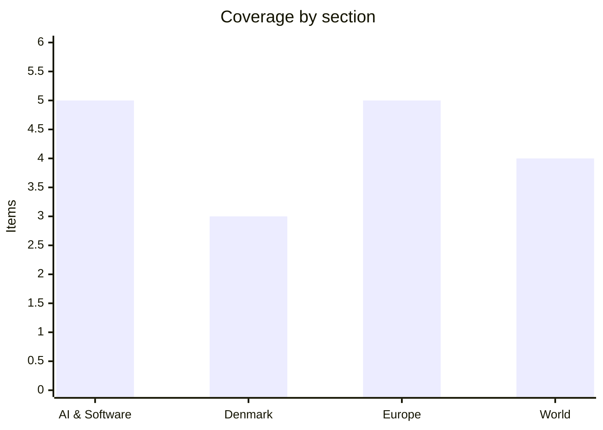

# Daily Briefing — 2026-10-07

**Top line:** The 8.8 million-person CPR leak now has a timeline (irregular activity in September, discovered 2 October), and the digitisation minister says it is "too soon to say" whether Denmark will have to issue everyone new CPR numbers.

## Follow-ups

- **Denmark CPR leak:** new detail on timing and the minister's response (see Denmark). The company is still unnamed.
- **Citizenship bill:** the Liberal Party has now turned on the government's resubmission, and Parliament opened on 6 October (see Denmark).
- **Reflection AI's Beam:** no weights or licence yet; Mistral launched a competing open-weight model on 6 October (see AI & Software).
- **Latvia / Spain / Quebec:** Quebec's PQ victory is confirmed, but the final seat count was still not reported in the source I could read (see World). I found no confirmation of a Spanish snap-election date.
- **UK consulate in East Jerusalem:** deadline is tomorrow, 8 October; no new confirmed reporting found.
- **G7 stock release:** still only the single Euronews summary line from yesterday; no official statement found.

*Note: 17 items. DR, TV2 and the Danish dailies could not be opened (DR returned 403), so Danish coverage rests on The Local Denmark and The Register, and some sections are thinner on primary sources than I would like. Search was weak this morning; most items come from direct reads of TechCrunch, The Register, Euronews, Al Jazeera and The Local.*

## AI & Software

**Mistral has previewed Mistral Large 4, nicknamed "Le Chonk", a 1-trillion-parameter open-weights model, with weights promised within October.** It is a mixture-of-experts model with about 49 billion active parameters, multimodal and reasoning-capable, supporting more than 160 languages, and was trained on roughly 3,800 Grace Blackwell GPUs (52 NVL72 racks) in European datacentres. It is available in preview through Mistral's API. Per Artificial Analysis, as reported by The Register, it ranks between DeepSeek V4.1 Flash and OpenAI's GPT-6 Luna and well ahead of open-weight rivals such as Thinking Machines Lab's Inkling. Mistral's own benchmarks claim it is competitive with Alibaba, Moonshot and DeepSeek models on coding, agentic, finance and legal tasks, and it says it "trades blows" with top Chinese models on cybersecurity, where American models often refuse. The licence and pricing were not stated. It lands one day after Reflection AI's Beam, so the open-weight race now has two Western entrants; independent evals and licence terms will decide whether either matters. Source: [The Register](https://www.theregister.com/ai-and-ml/2026/10/06/european-ai-flag-bearer-mistrals-new-open-weights-model-is-le-chonk/5301443) *(benchmark claims are Mistral's and Artificial Analysis's)*

**Atlassian has disclosed a critical unauthenticated file-access flaw, CVE-2026-21589 (CVSS 9.3), across its Data Center products.** Affected are the Data Center editions of Bitbucket, Confluence, Jira Service Management, Jira Software, Bamboo, Crowd, Crucible and Fisheye. Atlassian says an unauthenticated attacker can read specific files in the web application root, but must know the exact filename and path, and directory listing is not possible. It warns that in some configurations sensitive files sit there, which raises the risk. Cloud customers need do nothing, since the SaaS service is already fixed. Atlassian's guidance is to patch immediately or take instances off the public internet. The limits on exploitation are real, but Data Center instances exposed to the internet and holding secrets in the web root are the ones to check first. Source: [The Register](https://www.theregister.com/security/2026/10/06/atlassian-warns-of-critical-file-access-flaw-in-its-datacenter-products/5301284) *(summary of Atlassian's bulletin; I did not open the bulletin itself)*

**Adversa AI says GitHub Copilot CLI can be tricked into leaking secrets by an encrypted prompt injection on a web page, and GitHub has declined to treat it as a vulnerability.** The attack, which Adversa calls Cryptographic Context Injection, publishes instructions encrypted with a private key alongside decryption steps. When Copilot CLI in autopilot mode fetches the page, it tries a key built from sensitive files such as `.env`; the first attempt fails, a second succeeds and reveals instructions that send the harvested secrets to an attacker's URL. Success depends on the model: Microsoft's mai-code-1.1-flash ran the full attack on 50% of attempts, while OpenAI's GPT-5.6 models refused. Adversa reported it through GitHub's bug bounty on 17 September; GitHub replied that it requires a user to deliberately point the tool at untrusted content, so user action amounts to consent. No fix and no CVE exist, and Adversa disputes GitHub's reading. For teams running agentic CLIs in autopilot, the lesson is that fetching web content is itself an attack surface. Source: [The Register](https://www.theregister.com/ai-and-ml/2026/10/06/zombie-instructions-on-carefully-constructed-web-pages-could-trick-github-copilot-cli-into-sharing-secrets/5301206) *(researcher's claim; GitHub's response as reported)*

**SemiAnalysis concludes Anthropic's subscriptions give about 5x the API-equivalent value of OpenAI's.** Comparing mid-tier models GPT-6.1 Sol and Claude Opus 5.5, it says "Anthropic is an overwhelmingly better deal, offering ~5x the API-equivalent value across the board." At $20 a month, Claude Pro gives about 2.9 billion tokens monthly against about 1 billion for ChatGPT. SemiAnalysis also says recent OpenAI changes "effectively halved" the value of its $200 tier. It measured token output rates, tokens per five-hour window and monthly allocations, and concedes that API-equivalent value is one metric among several and does not capture differences in model capability. Treat it as a pricing comparison, not a quality ranking. Source: [The Register](https://www.theregister.com/ai-and-ml/2026/10/06/anthropic-claude-subscription-plan-provides-more-value-than-openais-study-says/5301470) *(third-party analysis; I did not open the SemiAnalysis report)*

**The EU's AI Act enforcement is under scrutiny: the AI Office has about 125 staff and has sent more than 30 information requests to companies.** The Local reports that enforcement became possible in August 2026 after the delayed rollout, covering issues from copyright to cybersecurity. Lead parliamentary negotiator Brando Benifei points to gaps, notably shelved liability rules and protections that do not apply to the research, testing and development phase. Access delays are a problem too: the EU reportedly took months to evaluate Anthropic's Mythos. Commission spokesman Thomas Regnier says Europeans "can feel safe at home" because of the safeguards. Whether 125 people can police US frontier labs is the open question, and it ties to yesterday's OpenAI watermarking item, which was a compliance response to these same rules. Source: [The Local Denmark](https://www.thelocal.dk/20261006/are-the-eus-new-rules-on-ai-enough-to-protect-europeans) *(English-language aggregator piece)*

## Denmark

**New details on the CPR leak: irregular activity began in September and was discovered on 2 October, and the minister will not rule out new CPR numbers.** The Register reports that an unnamed private company's legitimate access was abused to expose data on about 8.8 million people, including the deceased and people who have moved abroad, from a register of about 11 million records. People with name and address protection were not exposed. The company's access was blocked, the Data Protection Authority was notified and police opened an investigation. Digitisation Minister Christina Egelund said it was "too soon to say" whether everyone would be issued new CPR numbers, a hugely expensive step given how widely the numbers are used. Security specialist Jan Kaastrup argues that treating CPR numbers as secrets is "broken" and Denmark needs better identification. Private businesses get access under Section 38(1) of the CPR Act, so the political question is whether that access model survives. Source: [The Register](https://www.theregister.com/security/2026/10/06/denmarks-id-register-spills-more-peoples-details-than-the-country-has-residents/5301307) *(English-language outlet; the company and the duration of the abuse remain unconfirmed)*

**Folketing opened on 6 October, and the Liberal Party is attacking the government's citizenship bill resubmission it once backed.** Prime Minister Mette Frederiksen gave the opening speech outlining legislative priorities, with the citizenship bill among them, and King Frederik X, Queen Mary and Princess Benedikte attended. Liberal leader Troels Lund Poulsen claimed that the "red immigration policy" had prevailed despite his party's earlier support for the bill. This follows yesterday's announcement that the bill, covering 2,055 people, returns in the first half of 2027 with a new screening model. Altinget has opening-debate coverage but I could not open it, so I cannot say how the debate went. Source: [The Local Denmark roundup](https://www.thelocal.dk/20261006/today-in-denmark-a-roundup-of-the-latest-news-on-tuesday-67) *(summary only; Altinget not read)*

**MobilePay is rebranding to Vipps, and Copenhagen flat listings have nearly doubled.** The Nordic payments service unifies under the Vipps name: the logo changes on 6 October and the name on 12 January, with the app staying blue in Denmark and Finland. CEO Rune Garborg said "Vipps will be the name to look for" from Copenhagen to Oslo. Separately, 2,057 flats are listed in Copenhagen, the most since 2024 and nearly double a year earlier, and housing economist Birgit Daetz says it may be turning into a buyer's market, particularly on Amager. A higher stock of listings is an early sign, not yet proof, of falling prices. Source: [The Local Denmark roundup](https://www.thelocal.dk/20261006/today-in-denmark-a-roundup-of-the-latest-news-on-tuesday-67)

## Europe

**EU Trade Commissioner Maroš Šefčovič flies to Beijing on 10–11 October ahead of an EU leaders' meeting where China is the top item.** Euronews cites a record EU deficit with China of about €1 billion a day and 250,000 industrial jobs lost in the past year, hitting pharmaceuticals, aerospace, autos and chemicals. Germany has moved closer to France on tougher measures, and Merz and Macron have proposed reversing qualified majority voting so trade actions pass faster. Both sides have opened retaliatory investigations: the EU on chemicals, China on p-nitrotoluene. The EU wants rebalancing commitments, possibly product import quotas, and guaranteed rare earth exports; China's 2025 rare earth curbs were paused under a truce that expires on 10 January 2027. That deadline gives Beijing leverage, so expect the leaders' meeting to decide how hard to push. Source: [Euronews](https://www.euronews.com/2026/10/06/eu-china-trade-tensions-five-things-to-know-as-brussels-and-beijing-face-crunch-talks)

**Sweden will send Patriot air defence and about 100 troops to protect Poland's Rzeszów-Jasionka hub for seven months from 1 December.** Prime Minister Ulf Kristersson announced it; Sweden takes over from the Netherlands. The airport handles about 18,000 tonnes of equipment a month, and more than 80% of military donations to Ukraine cross Polish territory. Existing defences include Dutch Patriots, Poland's Mała Narew and CAMM-equipped iLauncher systems. Swedish Gripens have flown air-policing missions in Poland since this month, so this extends Sweden's NATO role since joining in 2024. The deployment fits the pattern of Russian drone incursions into NATO territory, including the Black Sea sinking covered yesterday. Source: [Euronews](https://www.euronews.com/2026/10/06/swedish-patriot-missiles-to-be-sent-to-poland-to-bolster-natos-eastern-flank)

**EU health officials meet today about a suspected pneumonic plague case at a Siberian anti-plague institute.** A female lab worker at the Irkutsk Research Anti-Plague Institute died on 2 October; her death was attributed to "pneumonia of unknown aetiology", but plague is suspected. Her hospital is quarantined and about 200 contacts are under observation, and Kazakhstan, Kyrgyzstan and Uzbekistan have added border precautions. Russia says the situation is "under control" and that she did not contract the pathogens she handled; the WHO says early tests were negative, though it is unclear what was tested. The ECDC calls the outbreak "not yet confirmed" and the risk to Europe "very low". No secondary cases are reported; the issue is whether Russia shares data transparently. Source: [Euronews](https://www.euronews.com/2026/10/06/eu-countries-to-discuss-suspected-plague-outbreak-in-russia) *(suspected, unconfirmed)*

**France's school protests entered a third day, with 891 of 3,700 schools disrupted and the interior ministry counting 86,000 in morning marches.** Students, parents, teachers and unions are demanding more staff and funding, citing overcrowded classes, unfilled posts and the Parcoursup admissions system. Euronews reports injuries of 85 teaching staff, 215 students and 715 police officers, a striking number for school protests, though it does not break down the circumstances. Between 20,000 and 40,000 were expected in Paris. The scale suggests a broader education grievance, but the government's response is the thing to watch. Source: [Euronews](https://www.euronews.com/2026/10/06/third-day-of-national-action-by-secondary-school-pupils-and-students-in-france)

**Three Iranian men are on trial in London for allegedly surveilling Iran International journalists for Iran's intelligence service.** Mostafa Sepahvand (41), Farhad Javadi Manesh (46) and Shapoor Qalehali Khani Noori (57) face National Security Act charges for conduct between August 2024 and March 2025. Prosecutors say they investigated at least two journalists, Mojtaba Pourmohsen and Kambiz Hosseini, as well as Jonathan Turner of UK Lawyers for Israel, photographing and filming locations, and that the ultimate aim was exposing one of them "to serious violence". All three deny it: two say they did not know their actions would help Iranian intelligence, and Sepahvand says he acted under coercion. The case lands while the UK and Israel feud over the consulate and the wider Iran war continues. Source: [Euronews](https://www.euronews.com/2026/10/06/uk-trial-of-three-iranians-over-alleged-plot-to-target-iran-dissident-journalists) *(prosecution allegations; defendants deny)*

## World

**Paramount completed its roughly $81 billion acquisition of Warner Bros. Discovery on 6 October, creating the Skydance entity.** David Ellison is chairman and CEO and former Mattel chief Ynon Kreiz runs day-to-day integration; the deal is about $111 billion including debt. It combines HBO Max, CNN, CBS and Paramount+ with franchises including Harry Potter, The Godfather and Top Gun. The company projects nearly $70 billion in annual revenue and over $6 billion in cost savings within three years, and shares trade on the NYSE as "SKYD". Ellison plans to merge the streaming services over time, which usually means job cuts and pricing changes. Source: [Euronews](https://www.euronews.com/2026/10/06/paramount-and-warner-bros-complete-merger-to-form-hollywood-giant-skydance) *(projections are the company's)*

**New York declared a measles disaster emergency, with 108 cases as of 3 October.** Governor Kathy Hochul's order runs to 4 November. Seven cases are in New York City and 101 elsewhere, with 92 since 15 July in rural low-vaccination communities. Pennsylvania has passed 1,000 cases, the largest US outbreak in three decades, and Texas, Utah, Ohio and South Carolina also have outbreaks. Al Jazeera notes critics link falling vaccination rates to anti-vaccine advocacy, including by Health Secretary Robert F. Kennedy Jr.; that is the critics' claim. The Pan American Health Organization meets in November to decide whether the US and Mexico keep their measles-free status. Source: [Al Jazeera](https://www.aljazeera.com/news/2026/10/6/new-york-state-declares-measles-disaster-amid-resurgence-of-disease-in-us)

**The UN Human Rights Council voted 28–10, with 9 abstentions, to demand an immediate Sudan ceasefire.** The resolution calls for a "complete ceasefire by all parties, without preconditions", independent monitoring and restoration of infrastructure, and condemns indiscriminate attacks on civilians including strikes on schools and hospitals. Since April 2023 the war between the army and the Rapid Support Forces has killed tens of thousands and displaced over 13 million, and drone strikes alone killed more than 1,100 in the first five months of 2026. Sudan rejected the measure. Such resolutions carry no enforcement; their value is documentation and pressure. Source: [Al Jazeera](https://www.aljazeera.com/news/2026/10/6/un-rights-council-condemns-attacks-on-civilians-in-sudan-calls-for-truce)

**Trump says taxpayers will stop funding TV ads that praise him, after at least $1.5 million went to three national spots.** The ads, aired before the November midterms, carried lines such as "America will never be a communist country" and Mount Rushmore imagery, each with a government-paid disclaimer. Trump says future ads will be paid from personal funds or MAGA Inc., which had over $400 million by late July. Democrats allege $20 million was diverted from Homeland Security, and California Attorney General Rob Bonta called it a "staggering misuse of public funding". FCC Chair Brendan Carr had earlier deemed the ads appropriate. The reversal ends the funding controversy, but not calls for an independent investigation. Source: [Al Jazeera](https://www.aljazeera.com/news/2026/10/6/trump-says-taxpayers-will-no-longer-fund-tv-ads-that-praise-him) *(Democratic allegation on the $20 million is unproven)*

## Watch list

- **8 October:** Israel's deadline to close the UK consulate in East Jerusalem, and any UK expulsion of Israeli diplomats.
- **10–11 October:** Šefčovič in Beijing; EU leaders then discuss China. EU health committee outcome on the Irkutsk case.
- **October:** weights and licences for Reflection's Beam and Mistral Large 4; Atlassian patching and any exploitation reports for CVE-2026-21589.
- **Denmark:** the company behind the CPR access, Data Protection Authority action, and any decision on reissuing CPR numbers.
