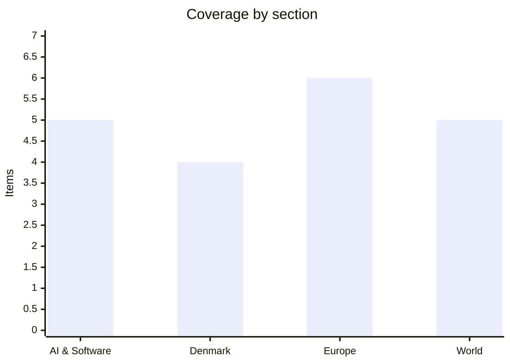

# Daily Briefing — 2026-10-08

**Top line:** Oil is back above $100 a barrel and Wall Street fell as tanker attacks multiply, with a tanker hit by projectiles off Qatar this morning and Houthi strikes killing three at Saudi airports, just as Israel's deadline to close the UK consulate in East Jerusalem expires today.

## Follow-ups

- **UK consulate in East Jerusalem:** the 30-day deadline expires today. Reuters (via Al-Monitor) reports UK National Security Adviser Jonathan Powell made an undisclosed visit last week without agreement, and Israel's foreign ministry says the consulate closes today (see World).
- **G7 stock release:** now confirmed by Al Jazeera: on 2 October the G7 agreed to release 100 million barrels of crude and diesel in coordination with the IEA (see World).
- **Denmark CPR leak:** The Local adds the discovery mechanism (an abnormally large September invoice), but the company is still unnamed and no minister has addressed reissuing CPR numbers in the sources I could read (see Denmark).
- **Mistral Large 4 / Reflection's Beam:** no new release or weights found; Mistral's weights are still promised "later this month".
- **Atlassian CVE-2026-21589:** The Register reports no known exploitation yet (see Watch list).
- **Irkutsk plague case:** a second suspected case is reported but denied by Moscow; WHO is asking for a formal response (see World).
- **Šefčovič in Beijing:** talks opened today (see Europe).

*Note: 20 items. DR, TV2 and the Danish dailies were not opened this morning; Danish coverage rests on The Local Denmark, and the search engine returned mostly stale results, so most items come from direct reads of The Register, TechCrunch, Euronews, Al Jazeera and Al-Monitor.*

## AI & Software

**OpenAI has rolled out an interactive "Intelligent UI" in ChatGPT, tied to GPT-6, starting 7 October.** Responses can now include tappable buttons, custom task calculators, interactive charts and editable graphs, and OpenAI's demos included an airplane-wing lift diagram, a bicycle-mechanics diagram, a multi-day hiking map and a personal savings calculator. Pro, Plus, Business and Enterprise users get it globally from 7 October, and Free and Go-tier users from today; users can dial the number of visuals down. The model underneath is GPT-6 "Astra", which OpenAI launched on 3 September with limited initial access, a claimed ability to operate a whole computer autonomously, and a shutdown mechanism if it goes beyond intended use, according to a Haitian news summary of the launch. TechCrunch gives no usage or performance figures for the new interface, so the claim that it makes learning easier is OpenAI's own. The strategic read is that visual, tool-like answers are becoming the interface race, following Meta's Muse apps and OpenAI's always-on "dots" agents, which The Register reports are already drawing open-source clones (OpenDots, Open Dot) and user complaints about failed tasks. Source: [TechCrunch](https://techcrunch.com/2026/10/07/chatgpt-is-getting-a-lot-more-visual-with-the-launch-of-a-new-interface/); [The Register on dots](https://www.theregister.com/ai-and-ml/2026/10/07/openai-dots-inspire-open-source-imitators-amid-technical-difficulties/5301734) *(GPT-6 launch details via a secondary summary; I did not reach OpenAI's own post)*

**Anthropic has merged Project Glasswing and its Cyber Verification Program into one three-tier programme.** The Register says both launched in April alongside Mythos. The tiers are Defense Access for security teams at companies, nonprofits, universities and governments, Red Team Access for penetration testing and offensive evaluation, and Specialized Access, a rebrand of Glasswing, for a limited set of verified organisations testing safety-critical systems such as flight systems, power grids, telecoms and interbank transfer infrastructure. The Register's testing reportedly saw Claude Opus 5.5 refuse 46 of 50 attempts at the Defense tier but complete 34 of 50 tasks at Red Team level. Anthropic's own numbers cited are at least 129,000 verified vulnerabilities found by partners between April and July, plus 5,500 more from open-source scanning through October, of which only 516 of 5,674 true positives are patched. VulnCheck's Patrick Garrity found that fewer than 0.5 percent of 225 Anthropic-linked vulnerabilities he tracked were exploited in the wild, so the patch backlog is large but exploitation so far looks small. Participants must allow data retention for a month or two, with zero data retention expected "soonish". Anthropic did not explain the change, according to The Register. Source: [The Register](https://www.theregister.com/security/2026/10/07/anthropic-reconfigures-its-cool-kids-security-program/5301509)

**Microsoft launched Nvidia-chip "RTX Spark" Windows PCs on 7 October and promised sandboxing for AI agents in Windows 11.** The Surface Laptop Ultra starts at $2,600, a more powerful variant at $3,700, and the top configuration reaches $5,900 and is already out of stock; a Surface RTX Spark Dev Box starts at $6,000 with VS Code, GitHub Copilot CLI, WSL and PowerShell 7 preinstalled, and Dell's XPS 16 Creator Edition is $3,800. Microsoft says the machines run AI models locally at no per-token cost and offers up to $1,000 for a MacBook Pro trade-in. Satya Nadella said the new "Execution Containers" feature, which sandboxes agents, will come to all Windows 11 users. The Register separately reports Microsoft is about to let Copilot loose on local file systems, so the sandboxing and the file access are arriving together. The pricing puts these firmly at developers and creators rather than mainstream buyers. Source: [TechCrunch](https://techcrunch.com/2026/10/07/microsoft-releases-new-nvidia-chip-ai-pcs-with-revamped-windows-11/); [The Register](https://www.theregister.com/personal-tech/2026/10/07/microsoft-is-about-to-let-copilot-loose-on-your-file-system/5301763)

**Attackers hijacked three country-code domains and obtained fake HTTPS certificates for Google domains and others.** Google says the affected TLDs are .gh (Ghana), .sl (Sierra Leone) and .as (American Samoa), that it learned of the attacks "last week", and that its systems were not compromised. Chrome has blocked suspected counterfeit certificates across those ccTLDs, but Google "cannot guarantee" it found every affected domain and said protections do not reliably cover non-Chrome users. It has "no reason to believe" the issuing certificate authorities did anything wrong, and it recommends Certificate Transparency monitoring, a review of CT entries for the three TLDs and restrictive CAA records. The number of certificates and the other targeted organisations were not disclosed. The case shows that a registry-level compromise can defeat the usual domain-validation checks without any CA misbehaving. Source: [The Register](https://www.theregister.com/security/2026/10/07/attackers-hijacked-top-level-domains-minted-fake-security-certs-for-google-and-other-orgs/5301718) *(based on Google's blog post as relayed by The Register)*

**The FBI and Secret Service say FortiBleed attacks on Fortinet firewalls are continuing, with ransomware affiliates now using stolen credentials.** A joint advisory (IC3 CSA 2026/261006) from 6 October warns that intruders can lock victims out by deleting or changing the original accounts' passwords and by creating new accounts. SOCRadar has verified more than 86,644 compromised devices across 194 countries, and says initial-access brokers are selling access to affiliates of INC/Lynx and Payload; it counted at least 12 confirmed ransomware attacks by July. The affected products are internet-facing FortiGate firewalls and SSL VPN gateways, and the access relies on credentials rather than a single named CVE. Mitigations include restricting internet-facing management access, terminating admin and VPN sessions, resetting passwords and phishing-resistant MFA. The agencies advise against paying ransoms. Source: [The Register](https://www.theregister.com/security/2026/10/07/fortibleed-still-a-bleeding-nuisance-as-fbi-confirms-ongoing-attacks/5301585)

## Denmark

**Denmark's CPR leak was found only because of an abnormally large invoice.** CPR numbers and personal details of 8.8 million living and deceased people were exposed, and the Ministry of Research, Education and Digitalisation says a routine invoice check flagged an unusually large September bill from a small, unnamed Danish company with legal access to the register. Each lookup carries a small fee, so the bill reflected the volume of queries. Without the invoice, the abuse could have gone unnoticed for at least 30 days, because the register has no automated alerts for that lookup method. The vulnerability has been closed, manual monitoring introduced and a security audit of critical state IT systems started. Henriette Erbs of the National Unit for Serious Crime says it is too early to name perpetrators and that such cases are often cross-border, and Laila Reenberg of the social security agency says the purpose of the harvesting is unclear but fraud is an obvious concern. The Register notes the register holds more records than Denmark has residents, because it includes the dead and people who moved abroad. Source: [The Local](https://www.thelocal.dk/20261006/danish-identity-number-breach-only-discovered-after-unusually-large-invoice); [The Register](https://www.theregister.com/security/2026/10/06/denmarks-id-register-spills-more-peoples-details-than-the-country-has-residents/5301307)

**Frederiksen opened the Folketing session with a legislative programme headlined "A safer, greener, and more equitable Denmark."** The programme includes a prison at the Kærshovedgård return centre, a law to restore the Great Prayer Day holiday by 2030, the long-delayed early pension for manual workers, and better conditions for pigs. She said "We must dare to hold on to what we are" and "We must hold on to being one people and one nation". Opposition figures called the speech unusually long, with the Conservatives' Helle Bonnesen calling it "long, and expensive". The Local reports it was partly paywalled, so I did not see the full text. The substance is that the government is leading with security and national identity ahead of its distributional measures, and the early pension and Prayer Day bills are the ones with the clearest dates. Source: [The Local](https://www.thelocal.dk/20261006/we-must-dare-to-hold-on-to-what-we-are-denmarks-pm-unveils-planned-bills)

**The government's immigration bills for the new session are now itemised.** Per The Local, a bill planned for November would create the legal basis for return centres in non-EU countries, which the government wants operating by the end of 2027. A bill due this month would make residency harder for Ukrainians from less war-affected areas and impose the same work requirements as for other foreign nationals. Another would give authorities far greater power to restrict the freedom of foreigners at Kærshovedgård and allow a locked facility for foreign offenders. Others would let universities use national security threat assessments for foreign students (November), add fees for EU posted workers and cross-border commuters (no amount given), and let authorities tell schools when a student loses residency (February 2027). The citizenship bill, stalled since January, is to be resubmitted in the first half of 2027. The Ukrainian measure is the most likely to draw EU-level attention, since displaced Ukrainians have so far had a separate status. Source: [The Local](https://www.thelocal.dk/20261006/key-points-how-bills-to-be-passed-by-danish-parliament-will-affect-foreigners)

**Frederiksen rejects the idea that the European Court of Human Rights has undermined Denmark's deportation push, and the government revives a bill criminalising mediation councils.** Frederiksen says she still expects the court to change course after the Chișinău Declaration, adopted in May by all 46 Council of Europe members. Court President Mattias Guyomar says the declaration "is not a roadmap for the court's judicial activity", so the two are publicly at odds. Separately, Justice Minister Nicolai Wammen is reintroducing a stalled bill making it illegal to take part in mediation councils outside the legal system, often offered by mosques, with penalties of a fine or up to four years in prison. Jyllands-Posten reported in 2024 that East Jutland Police had encountered such councils in western Aarhus. The Local also reports that a 31-year-old goes on trial in Copenhagen over a fatal World Cup punch, with Frederiksen saying prosecutors' proposed sentence should be stricter. Source: [The Local](https://www.thelocal.dk/20261007/today-in-denmark-a-roundup-of-the-latest-news-on-wednesday-74)

## Europe

**Hungary is set to lift its veto on two more clusters of Ukraine's EU accession talks, subject to a minority-rights law.** The clusters cover the internal market and competitiveness, and Budapest on 7 October allowed technical preparation of the Council letters asking Kyiv for its negotiating positions. The condition is that Ukraine's parliament adopts a law strengthening the educational and cultural rights of the ethnic Hungarian minority in Transcarpathia, which the Rada is expected to do on Monday. Hungary would then approve opening the clusters at the General Affairs Council in Luxembourg the next day, where a €4.2 billion cohesion payment to Hungary, blocked over corruption concerns, is also expected to be approved. A formal opening could follow at an intergovernmental conference the following Tuesday, and Brussels wants all remaining clusters open by the end of 2026. The sequence could also clear the way for a first Magyar–Zelenskyy meeting and for Moldova's talks. The risk is that the Rada has struggled to find stable majorities, and the article quotes no statement from Prime Minister Péter Magyar. Source: [Euronews](https://www.euronews.com/2026/10/07/hungary-set-to-lift-veto-on-ukraines-eu-membership-talks)

**EU ambassadors agreed the largest single expansion of the Russia sanctions list, with 1,646 new names.** It comprises 743 individuals, 826 entities and 77 lawmakers elected in Russian-occupied Ukrainian territories in the "widely discredited" September State Duma election. Foreign ministers are expected to approve it formally on Monday in Luxembourg, after which the names are published, and the list would reach about 4,650 names. Targets face travel bans and asset freezes. New listings are already being prepared over a drone incident at Leipzig airport. The package comes after the EU removed Alisher Usmanov and Mikhail Fridman in September, with France having requested Usmanov's removal in connection with an Azerbaijani prisoner release, and Kaja Kallas said she does not see their reinstatement "any time soon". The Commission has proposed moving sanctions decisions to qualified majority voting through the passerelle clause, which itself requires unanimity. Source: [Euronews](https://www.euronews.com/2026/10/07/eu-agrees-to-sanction-over-1600-people-and-entities-linked-to-russias-war)

**The European Parliament voted 454–86 (110 abstentions) for a tougher line on China as trade chief Šefčovič opened talks in Beijing.** The resolution calls China "a decisive enabler" of Russia's war and urges the Commission to consider the Anti-Coercion Instrument if Beijing weaponises critical dependencies such as rare earths. Šefčovič meets Commerce Minister Wang Wentao on 8–9 October, with the EU's deficit with China above €1 billion a day, and wants "tangible results by October" for EU leaders to consider at their 15 October summit. The Financial Times reports China has rejected voluntary limits on hybrid-car exports, so the Commission wants Beijing to accept a unilateral EU cap. Macron and Merz have asked for a "credible instrument" that could be activated quickly against economic harm, which leaders will discuss next week. Beijing warns of a "resolute response" and tells France and Germany not to go down "the wrong path". The talks are a test of whether Brussels can get concessions before it chooses between new tools and a trade confrontation. Source: [Euronews](https://www.euronews.com/2026/10/07/meps-urge-tougher-action-against-china-as-tensions-hit-critical-point); [Al Jazeera](https://www.aljazeera.com/economy/2026/10/7/eu-china-trade-talks-begin-in-beijing-amid-escalating-pressure)

**Drone attacks in the Black Sea sank two merchant ships in two days and exposed gaps in the EU's maritime security plan.** On 5 October a Turkish-owned cargo ship carrying Ukrainian grain caught fire and sank off Romania, killing two; Zelenskyy blamed Russian drones. On 6 October a drone attack about 130 km off Bulgaria sank one merchant ship and damaged another, and no party was named. Romanian foreign minister Oana-Silvia Țoiu called the first "a flagrant violation of international law", Bulgarian prime minister Rumen Radev called the second "absolutely unacceptable", and von der Leyen said attacks on civilian shipping are unacceptable. The Commission cites 65 projects worth €200 million in the region and €20 billion in SAFE loans to the two countries, and a Black Sea Maritime Security Hub planned for Constanța and Varna. A leaked European Defence Agency readiness report flags "critical gaps" in naval munitions, naval air and missile defence, long-range strike and seabed protection. Source: [Euronews](https://www.euronews.com/2026/10/07/deadly-drone-attacks-raise-questions-over-europes-black-sea-defences)

**Germany's biggest spy scandal widened with a second arrest, over an alleged paid leak of BND secrets.** Former BND chief August Hanning was arrested on 6 October, and on 7 October his long-time confidant and former head of cabinet, Manfred D (64), was taken into custody on a charge of aiding and abetting treason. Prosecutors allege that from spring 2010 Manfred D continuously obtained classified material and passed it to Hanning for payment, and that Hanning used it for private consulting, including an analysis for foreign services. Investigators bugged Manfred D's property and monitored him for months. Der Spiegel reported Hanning may have been in contact with an Azerbaijani agent, which Baku denies, calling it "unfounded disinformation", and an Azerbaijani official says German officials confirmed the probe is unrelated to Azerbaijan. No German government reaction was reported, and no payment amounts have been disclosed. Source: [Euronews](https://www.euronews.com/2026/10/07/espionage-scandal-involving-ex-bnd-chief-second-arrest-over-suspected-treason)

**France's prime minister promised a response plan for the school protests by the end of October and suspended police stun grenades.** Sébastien Lecornu said in a televised address that young people's anger "does not come from nowhere" and that security forces have no orders to "confront" students. More than 6,500 people, mostly minors, have been arrested, and the stun-grenade suspension followed a 15-year-old in Lens losing a hand. Students want more teachers, school repairs and changes to the Parcoursup platform, and unions have called more strikes for today. Lecornu also promised to release diesel stocks, with diesel above €2.36 per litre, and repeated a goal of cutting the deficit to 5% of GDP next year. The pressure comes as the 2027 budget needs tens of billions in savings and Marine Le Pen is high in the polls for next year's presidential election. Source: [Euronews](https://www.euronews.com/2026/10/07/french-prime-minister-says-government-not-indifferent-to-students-concerns-in-tv-address)

## World

**Oil is back above $100 and US stocks fell after a run of tanker attacks, including one off Qatar today.** Brent was $101.53 and WTI $89.39 at 01:16 GMT, and Wall Street closed lower on Wednesday after record highs on Tuesday, with Treasury yields at 24-year highs on inflation worries. UKMTO reports nine tanker attacks in the Strait of Hormuz in October so far, half of September's total for the strait and the Gulf, and a tanker was hit by multiple projectiles about 94 km north of Madinat ash Shamal off Qatar, with casualties but no number or attacker named. Maritime Executive says it is the first reported attack on a tanker in the western Gulf in weeks. Secretary of State Rubio says Washington controls the strait and flows are near normal, and Kpler data shows Middle East crude exports back at or above pre-war levels at about 18.3 million barrels a day. The IEA says members stand ready to release more reserves, after the G7 agreed on 2 October to release 100 million barrels. Source: [Al Jazeera](https://www.aljazeera.com/news/2026/10/8/us-stocks-slide-as-oil-prices-fluctuate-over-renewed-iran-war-fears); [Al Jazeera](https://www.aljazeera.com/news/2026/10/8/tanker-hit-by-multiple-projectiles-off-north-coast-of-qatar-ukmto-says)

**Houthi-claimed attacks on Saudi airports killed three foreign nationals and injured 36.** On Tuesday at Abha International Airport, two women (one Moroccan, one Algerian) were killed and 28 injured, and on Wednesday at Riyadh's King Khalid International Airport a Sudanese citizen was killed and eight residents injured. The coalition says it intercepted a ballistic missile north of Riyadh and destroyed a platform in Sanaa used for launches. Yemen's government says the Houthis also fired missiles and drones at Aden airport, with no casualties. Saudi-backed Yemeni forces claim 1,860 Houthi fighters "neutralised" around Taiz, a figure that is the government's claim and is unverified. The Houthis hold territory around the Bab al-Mandeb Strait, so this adds a second chokepoint to the Hormuz risk above, and the US embassy in Riyadh has issued another alert. Source: [Al Jazeera](https://www.aljazeera.com/news/2026/10/7/saudi-arabia-says-three-foreign-nationals-killed-in-attacks-on-airports); [Al Jazeera](https://www.aljazeera.com/news/2026/10/8/yemeni-government-forces-claim-1860-houthis-neutralised)

**Israel's deadline to close the UK consulate in East Jerusalem expires today.** Israel ordered the closure on 8 September, within 30 days, after Britain announced it would ban goods made in Israeli settlements; France and Canada joined the sanctions, and Israel has not acted against them. Reuters, via Al-Monitor, reports National Security Adviser Jonathan Powell made an undisclosed visit last week to try to prevent the closure and reached no agreement. A spokesperson for Foreign Minister Gideon Saar says the consulate will close today, calling the sanctions "morally distorted" and accusing Britain of interfering in Israel's 27 October general election. Two sources told Reuters an agreement was possible but unlikely by the deadline, and the UK government had no immediate comment. The British sanctions take effect next year, so there is time for a face-saving arrangement, though today's deadline makes that less likely. Source: [Al-Monitor / Reuters](https://al-monitor.com/originals/2026/10/uk-security-adviser-visited-israel-bid-keep-jerusalem-consulate-open-sources-say) *(anonymous sources; not confirmed by the UK government)*

**The DNC and Common Cause sued Trump over taxpayer-funded ads praising him.** The DNC filed in Washington and Common Cause in the Southern District of New York, both arguing the ads breach an appropriations ban on "publicity or propaganda purposes". They allege $20 million was repurposed from a $175 million DHS immigration-enforcement package, meant for commemorative activities, and say the campaign has cost more than $12 million, per AdImpact. They ask for a ruling that the ads are illegal, an end to the spending and recovery of what was spent. Trump said on Monday that taxpayers will not fund future ads but did not commit to repaying what was spent, and the White House has not responded to the suits in the reporting I found. The cases test whether Congress's spending limits can be enforced against the president's reallocation of funds. Source: [Al Jazeera](https://www.aljazeera.com/news/2026/10/8/democrats-sue-us-president-trump-over-taxpayer-funded-ad-campaign)

**Russia denies a second suspected plague case in Irkutsk while the WHO asks for a formal response.** Moscow acknowledged a 28-year-old woman at a plague research institute died of "pneumonia of unknown aetiology", and media later reported a second employee with pneumonia of undetermined cause. Kremlin spokesman Dmitry Peskov says "the vast majority" of media reports are false, and Rospotrebnadzor says no infections were detected among staff. WHO chief Tedros says the agency asked Russia to respond, and Maria Van Kerkhove says the causative agent is unknown and "we don't understand how she was infected". The CDC rates the risk to the US as "extremely low" and has set up screening at JFK for travellers from Siberia, about 200 of whom come each year. Euronews reports the Kremlin welcomed a US offer to discuss the outbreak with Putin. Everything beyond the first death is reported by media and denied by Russia. Source: [Al Jazeera](https://www.aljazeera.com/news/2026/10/8/russia-dismisses-reports-of-second-plague-case-as-false-information); [Euronews](https://www.euronews.com/2026/10/07/trump-to-talk-plague-with-putin-as-russia-plays-down-fears-of-outbreak) *(second case: reported, unconfirmed)*

## Watch list

- **8–9 October:** Šefčovič–Wang Wentao talks in Beijing, ahead of the 15 October EU leaders' summit on China and competitiveness.
- **12–13 October:** Rada vote on the Hungarian minority-rights law, then the Luxembourg General Affairs Council on opening Ukraine's clusters and the €4.2 billion Hungary payment; foreign ministers also formally adopt the 1,646-name sanctions list.
- **14 and 23 October:** Google's Finnish unit must explain its plan to Finland's supervisory agency by 14 October and suspend site work at its Muhos and Kajaani data-centre sites by 23 October.
- **Denmark / October:** the company behind the CPR lookups, any Datatilsynet action, and the Ukrainian residency bill due this month; Atlassian CVE-2026-21589 exploitation reports.
