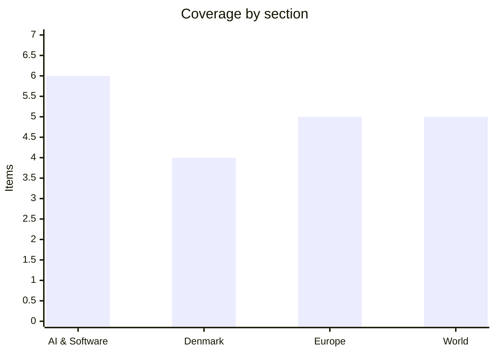

# Daily Briefing — 2026-10-09

**Top line:** US media report the Pentagon has told Central Command to finish preparing for a possible resumption of "major combat operations" against Iran, pushing Brent above $105 and Treasury yields to 20-year highs, while the EU's gas operator warns of a 12–15% winter shortfall if the cold is severe.

## Follow-ups

- **G7 oil-stock release:** Euronews, citing an internal document, says the G7's 100-million-barrel pledge largely overlaps with the unfinished March release (326 of 400 million barrels delivered), so it is not additional supply; the IEA Governing Board meets 15 October (see World).
- **Denmark CPR leak:** credit alerts tied to CPR numbers have risen from about 250,000 on 1 October to almost 970,000; the company and the hacker are still unnamed (see Denmark).
- **UK consulate in East Jerusalem:** the deadline passed on 8 October, but I found no confirmed report of the closure or of an agreement.
- **Irkutsk plague case:** nothing new beyond Russia's denial of a second case and the WHO's request for a formal response.
- **Mistral Large 4:** no weights release found; Mistral still says "late October".
- **Atlassian CVE-2026-21589:** no report of exploitation found.
- **Šefčovič in Beijing:** no readout found yet.

*Note: 20 items. DR, Børsen and TV2 blocked automated access, so Danish coverage rests on The Local Denmark (mostly Ritzau-based). The search engine returned mostly stale results, so items come from direct reads of The Register, TechCrunch, Euronews and Al Jazeera, whose front pages were captured on the evening of 8 October; nothing dated 9 October was available on them except a few Euronews items.*

## AI & Software

**OpenAI's revenue is reportedly about $20 billion below what investors had been shown.** The Financial Times reports OpenAI has told investors its annualised revenue is "approaching $50 billion", while a figure of nearly $70 billion had circulated after Axios reported it on 29 September. That earlier number would have put OpenAI level with Anthropic, whose annualised revenue CNBC reported at $65 billion in July. The FT says the $70 billion figure came from investors trying to compare directly with Anthropic. The two companies count differently: Anthropic includes sales made through its cloud partners, OpenAI does not, so the figures are not like for like. The gap matters because OpenAI raised $122 billion in March, carries very heavy spending, and CNBC reported in August that its IPO has slipped to early 2027. OpenAI had not commented in TechCrunch's report. Source: [TechCrunch](https://techcrunch.com/2026/10/08/openais-revenue-is-reportedly-20-billion-less-than-previously-projected/) *(FT report relayed by TechCrunch; OpenAI figure not independently confirmed)*

**Google launched a single enterprise agent inside Gemini at its Cloud event on 8 October.** The agent takes "objectives, not just instructions", according to Google Cloud CEO Thomas Kurian, plans the work, spawns sub-agents, and connects to Workspace, Microsoft 365, Slack, Jira, Git, BigQuery, Snowflake, Postgres and any MCP server. It gets its own Workspace account and email address, and its actions are logged to the agent rather than to a person. It routes each task to the best model by default, and users can pick Anthropic's Claude models manually. It launches for businesses first with no consumer date, and Google gave no price, only new spend controls such as real-time caps. Sundar Pichai said Gemini has over 1 billion monthly users and nearly 90% of the Fortune 100 use Gemini Enterprise; On, Shopify and PayPal are early testers. The Register is sceptical: the adoption figures and a 77.9% score for Gemini 4 Argon on DeepSWE v1.1 are Google's own claims, and a "single universal agent" that calls a rival's models sits awkwardly. It also asks how audit logs attribute actions to the new agent identities. Source: [TechCrunch](https://techcrunch.com/2026/10/08/google-brings-agentic-ai-to-gemini-starting-with-businesses/); [The Register](https://www.theregister.com/ai-and-ml/2026/10/08/there-can-be-only-one-google-cloud-casts-gemini-as-your-enterprise-ai-hero/5302086)

**Three OpenAI safety researchers fired last week dispute the misconduct claims in an open letter.** Jasmine Wang, Tomek Korbak and Mikita Balesni say they did not mishandle sensitive information, were not involved in a leak to The Information about less monitorable architectures in OpenAI's newest models, and that the firings chill safety culture. OpenAI's stated reason is "accessing and handling sensitive company information", reportedly including sharing material with a third-party safety group. Wang says she opened an executive's email by mistake under delegated recruiting access and reported it within minutes. Korbak says contact with outside evaluators about the Hugging Face incident fit company norms, and Balesni says he cleared materials with board members and executives. An internal memo seen by TechCrunch says "We do not terminate employees for raising concerns" and agrees with the letter's call to honour commitments to embed third-party safety auditors. OpenAI has not formally answered the letter or said which policies were broken. Source: [TechCrunch](https://techcrunch.com/2026/10/08/fired-openai-safety-researchers-dispute-misconduct-claims-warn-of-chilling-effect/)

**The Shai-Hulud worm has reached AI infrastructure through a malicious Tensorlake npm release.** Version 0.5.144 of Tensorlake's SDK, which has about 12,000 weekly downloads, was published early on 8 October (UTC) and flagged by Socket 11 minutes later, with SafeDep also reporting it. npm removed it and Tensorlake shipped 0.5.145. The code shares techniques with the "ChainDrop" variant used in August against packages including keyv and flat-cache. It steals crypto wallets, browser passwords, GitHub Actions secrets, cloud credentials and service-account tokens, keeps a command-and-control connection open, and self-propagates. It also watches stolen GitHub tokens and can delete the victim's home directory if one is revoked. The twist is that Tensorlake sells sandboxes for untrusted AI-generated code, yet the SDK's install script runs outside that sandbox, on developer machines or build servers holding deployment credentials. The Register says the impact is unknown. Check for 0.5.144, rebuild affected systems from a trusted source, and disable the token monitor before revoking credentials. Source: [The Register](https://www.theregister.com/security/2026/10/08/shai-hulud-worm-makes-jump-to-ai-infrastructure-with-tensorlake-compromise/5302054)

**CrowdStrike says a likely Chinese operator used Claude Code and an open-source pentest tool against South Korean banks, and left the AI logs exposed.** The Register summarises a CrowdStrike blog post by analyst Ashley Campion. Exposed session logs on a server, and on a second server in Hong Kong, held session histories, configuration files and AI memory files documenting the targeting, plus a resume-writing prompt naming "YY", a Chinese university and a Guangdong location. CrowdStrike thinks those details likely describe the attacker but cannot confirm it. The tools were ARTEX, a recently released Chinese open-source penetration-testing tool, together with Claude Code. According to The Korea Times, at least five lenders were hit: Shinhan (about 25,000 customers), KB Kookmin (119), Hana (89), Yegaram Savings and BNK Busan. CrowdStrike calls the actor financially motivated and says AI tooling let it run several intrusions quickly. Police are investigating, and parliament will question five bank heads on 19 October. Source: [The Register](https://www.theregister.com/cyber-crime/2026/10/08/crowdstrike-finds-possible-bank-hackers-cv-among-exposed-ai-logs/5301908)

**Anthropic updated its usage policy on 8 October, and the UK data regulator reported on ten AI developers.** TechCrunch says the new policy adds a ban on election interference under "Do Not Undermine Democratic Processes", separate bans on deceptive campaigns such as fake accounts and fabricated news outlets, new rules on weapons software and surveillance, and an explicit prohibition on persistently abusive conversations with Claude. Anthropic says the abuse rule is "meant to apply only in extreme cases", not ordinary frustration, dark fiction or testing; it follows an August change letting Claude end abusive chats. Separately, the UK Information Commission's Office says Amazon, Anthropic, Apple, Cohere, DeepSeek, Google, Meta, Microsoft, OpenAI and Stability AI have made or promised changes on training-data transparency and data-rights handling; xAI is excluded because of a separate Grok investigation. The ICO also opened a call for evidence on agentic AI, due 20 November, saying agent autonomy "is not an excuse for poor compliance". Source: [TechCrunch](https://techcrunch.com/2026/10/08/anthropic-changes-usage-policy-to-ban-model-abuse-and-election-interference/); [The Register](https://www.theregister.com/ai-and-ml/2026/10/08/ai-giants-promise-to-play-nice-with-personal-data-after-uk-watchdog-scrutiny/5301966)

## Denmark

**The CPR leak keeps growing: almost 970,000 credit alerts in a week.** The Ministry for Research, Education and Digitalisation told Ritzau that credit warnings tied to CPR numbers rose from about 250,000 on 1 October to almost 970,000. The leak, announced on Monday, affects more than 8.8 million people. One or more hackers used a small Danish company's access to the CPR register to copy data over ten days in September. Authorities have not named the company or the hacker. Nobody has yet addressed the harder question of whether CPR numbers, which Danes use as identifiers everywhere, can or will be reissued. Source: [The Local](https://www.thelocal.dk/20261008/today-in-denmark-a-roundup-of-the-latest-news-on-thursday-60) *(Ritzau-based; I could not open DR or TV2)*

**Small-parcel flows through Danish customs have collapsed after the EU's new fee, though the parcels still arrive.** An EU rule that took effect on 1 July puts a tariff of at least €3 on parcels worth €150 or less. Customs used to register 1.6–2.2 million such items a week; the figure was 400,000 the week before the rule, 200,000 the week after, and under 10,000 for 31 August–6 September. Tax and Growth Minister Jakob Engel-Schmidt welcomed it as fewer "cheap low quality items" from China. Dao's Steen Breiner (as quoted by TV2) says the parcels still arrive, now by truck from elsewhere in Europe, so they are not registered at Danish customs. The drop therefore partly reflects routing rather than demand. Source: [The Local](https://www.thelocal.dk/20261008/number-of-small-parcels-at-danish-customs-plummets-after-new-eu-rule)

**The government and The Alternative propose 70 million kroner in the 2027 budget for two national marine nature parks.** The money would be spread over three years (67.8 million kroner in the earmark), and Environment Minister Maria Reumert Gjerding backs it. The Alternative's Torsten Gejl wants the Bay of Aarhus to be one of the sites. The proposal shows The Alternative's role as a support party shaping the 2027 finance bill, and the sites are not yet chosen. Source: [The Local](https://www.thelocal.dk/20261008/today-in-denmark-a-roundup-of-the-latest-news-on-thursday-60)

**The government is restarting the stalled citizenship bill, which has held up 2,055 applicants for about a year and a half.** Social Liberal citizenship spokesperson Magnus Georg Jensen told The Local that applicants who turned 18 since the January 2025 pause will no longer qualify, which he called "super unfair". He also discussed a contested new screening system and a proposal to let time in higher education count toward eligibility. Source: [The Local](https://www.thelocal.dk/20261008/today-in-denmark-a-roundup-of-the-latest-news-on-thursday-60)

## Europe

**ENTSOG warns of a 12–15% gas shortfall in a severe winter.** Its winter outlook, released 8 October and assuming no Russian pipeline gas, finds that a severe cold snap combined with a disruption to the largest offshore supply route and a halt of Algerian pipeline imports would leave Europe 12–15% short, with up to 12% on peak days in south-eastern Europe. Even in a normal winter, tight LNG could take storage down to 13% by March 2027. Storage was 72% full on 1 October against 83% a year earlier, and Brussels now lets states aim for 75–80% by 1 November instead of 90%. Dutch TTF is around €80/MWh, almost triple its level before the Iran war began, with Qatari and UAE exports throttled since 28 February. Direct EU exposure to Qatari gas is only about 8%, but prices are global. Source: [Euronews](https://www.euronews.com/2026/10/08/eu-faces-gas-shortfall-of-up-to-15-if-severe-winter-hits-report-warns)

**EU auditors say 3.8% of last year's spending broke the rules and borrowing could reach €1 trillion by 2027.** The European Court of Auditors' error estimate (excluding the recovery fund) is up from 3.6%, against a 2% threshold. Spending got an adverse opinion for the seventh straight year, though the accounts were clean and the ECA flagged 17 suspected fraud cases. Cohesion errors rose from 5.7% to 6.6%. Outstanding EU debt rose over 20% to €738.9 billion, and expected NextGenerationEU borrowing costs are double the original estimates. Nine of 37 recovery-fund payments breached rules and 29 of 32 plan changes lacked evidence. The Commission says its figures are not comparable with the ECA's. This feeds the fight over the nearly €2 trillion 2028–2034 budget: six net payers including Denmark want hundreds of billions cut, and leaders discuss financing on 15–16 October. Source: [Euronews](https://www.euronews.com/2026/10/08/eu-debt-could-hit-1-trillion-by-2027-as-spending-errors-rise-auditors-warn)

**Germany raised its 2026 growth forecast to 1.3% from 0.5%, even with the Iran war.** The government forecasts 1.1% for 2027 (up from 0.9%) and 0.6% in 2028, with exports up 3.7% this year as importers stockpiled steel, fertiliser and aluminium. Data-centre construction is lifting orders for lasers, chip machinery and cooling, and defence and infrastructure spending should help. Inflation hit 3.3% in September, the highest in nearly three years, with 2.7% expected for 2026 and 3.0% for 2027, and real household spending is forecast to grow just 0.3%. Economy Minister Katherina Reiche says the economy is "on a path of recovery". Berlin announced a temporary fuel tax cut last week. Source: [Euronews](https://www.euronews.com/2026/10/08/germany-lifts-gdp-forecast-as-economy-withstands-iran-war)

**The US trade representative is probing the EU's carbon border tax.** USTR has asked for public comments, due 9 November, on how CBAM affects US trade and on the EU's plans to widen it, covering costs, regulatory burden and market access. The US argues the EU "adds a punitive markup" to default emissions values. Euronews found no cited legal basis and no Commission response. Meanwhile Council and Parliament are themselves split on expansion, both finding the Commission's proposal too narrow, and the Irish presidency wants a deal at a meeting on 20 October. Source: [Euronews](https://www.euronews.com/2026/10/08/us-probes-eu-carbon-border-tax-over-potential-trade-barriers)

**Italy's antitrust authority is investigating Activision Blizzard over children's spending in two mobile games.** The probe covers Call of Duty Mobile and Diablo Immortal, owned by Microsoft, and asks whether loot boxes, pay-to-progress design and unclear virtual currencies amount to a widespread infringement of EU consumer rules. Consumer authorities in Norway and Denmark support it, and it sits within a wider coordinated action by the EU's consumer protection network. Fines could reach 4% of annual turnover in each affected country. Euronews carried no statement from Microsoft or Activision Blizzard. Source: [Euronews](https://www.euronews.com/2026/10/08/italy-probes-gaming-giant-activision-blizzard-over-in-game-spending-by-children)

## World

**Oil is above $105 as the US reportedly prepares for possible renewed combat with Iran.** Citing US officials, US media report the Pentagon told Central Command to finish preparing for a possible resumption of "major combat operations", with energy, infrastructure and nuclear sites among possible targets; no date is set. An Israeli official told Axios an attack before next month's US midterms is "not high but we don't rule it out". Brent rose about 5% to $105.2 and WTI to about $92.75, the DAX fell 0.76%, and US 10-year yields reached 5.32%, a more-than-20-year high. UKMTO counts nine tanker attacks in Hormuz this month, and a tanker was hit by several projectiles 94 km off Qatar's north coast on 8 October with casualties but no named attacker. Euronews reports the G7's 100-million-barrel pledge overlaps with the March release (326 of 400 million delivered), with the IEA board meeting 15 October. Rubio says Washington controls the strait; Kpler says Gulf flows recovered to 81% of pre-war levels in September. Source: [Euronews](https://www.euronews.com/2026/10/08/oil-prices-are-climbing-on-concerns-about-an-escalating-iran-war); [Al Jazeera](https://www.aljazeera.com/news/2026/10/8/us-stocks-slide-as-oil-prices-fluctuate-over-renewed-iran-war-fears); [Al Jazeera](https://www.aljazeera.com/news/2026/10/8/tanker-hit-by-multiple-projectiles-off-north-coast-of-qatar-ukmto-says); [Euronews](https://www.euronews.com/2026/10/08/exclusive-g7s-100-million-barrel-pledge-tied-to-unfinished-march-emergency-oil-release) *(combat preparations: reported, unconfirmed, via US media citing officials)*

**The US suspended Microsoft, Adobe, Infosys and TCS from the H-1B visa programme.** Vice President JD Vance announced the ban over alleged fraud, and Labor Secretary Keith Sonderling said the department found $22 billion in visa fraud. A separate J-1 crackdown targets nine universities including MIT, Harvard, Yale and Stanford. Vance said Microsoft laid off 6,000 American workers while obtaining 6,300 H-1B visas, a claim Microsoft rejects, saying 80% of its visas extended or changed the status of existing employees and new-hire filings equal about 1% of its US workforce. The White House gave no data for Vance's claim on researcher pay. Microsoft's stock fell 1.5% and Adobe's rose 2.1% in late trading. Nearly three-quarters of H-1B approvals go to workers from India. Source: [Al Jazeera](https://www.aljazeera.com/economy/2026/10/8/us-suspends-microsoft-and-adobe-from-visa-programme-amid-fraud-claims)

**Samsung flagged a record $80 billion quarterly profit and TSMC posted record sales on AI chips.** Samsung's preliminary Q3 operating profit is about 107.4 trillion won, up 782.5% from a year earlier and just above the 106.1 trillion analysts expected, on revenue of about 195 trillion won (a margin near 55%). Euronews attributes it to demand for high-bandwidth memory in AI data centres and tight supply lifting DRAM and NAND prices. TSMC's September revenue was NT$511.86 billion, up 54.6%, and estimated Q3 revenue of NT$1.49 trillion beat the top of its guidance. Both are company preliminary figures. Source: [Euronews](https://www.euronews.com/2026/10/08/samsung-flags-783-profit-jump-to-record-80bn-as-ai-chip-boom-also-lifts-tsmc-sales)

**South Korea recalled its ambassador to Ukraine over two North Korean prisoners of war.** Seoul says Zelenskyy broke a non-disclosure agreement by revealing the transfer of two captured North Korean soldiers in his 23 September UN speech; Kyiv says no such agreement existed. President Lee Jae Myung has threatened unspecified punitive steps unless Ukraine apologises. Ukrainian foreign ministry spokesman Heorhii Tykhyi said Kyiv is open to "constructive dialogue" and that "Diplomacy must prevail over emotions". Separately, Ukrainian sanctions adviser Vladyslav Vlasiuk alleges 176,000 tonnes of South Korean fuel reached Russia in July and August; Seoul says it has not confirmed this and will act if it proves true, noting commercial diesel and jet fuel are not on its export control list. South Korea has given $445 million in aid to Ukraine since 2022. Source: [Euronews](https://www.euronews.com/2026/10/09/kyiv-open-to-constructive-dialogue-after-seoul-recalls-its-ambassador-amid-north-korean-po); [Al Jazeera](https://www.aljazeera.com/news/2026/10/8/south-korea-pledges-legal-action-over-alleged-fuel-exports-to-russia)

**The US disrupted a Chinese state-linked botnet while seven governments warned of PRC espionage.** The FBI seized seven domains and unsealed court documents on 8 October covering a Mirai-based botnet used by Flax Typhoon since 2021, plus the Microscan scanner and FishHub post-compromise tool, which the FBI says Integrity Technology Group developed. Victims named include a South Carolina power company, Japanese and Polish airports, Taiwanese gas and power firms, and about 20 Taiwanese universities. CISA added five CVEs to its known-exploited catalogue. The US, UK, Australia, Canada, Japan, New Zealand and Spain issued the advisory, and FishHub domains were still delivering malware as recently as March 2026. Source: [The Register](https://www.theregister.com/security/2026/10/08/us-disrupts-chinese-hacking-tools-as-7-govts-warn-of-prc-spies-stealing-sensitive-data-worldwide/5302107)

## Watch list

- **12–13 October:** Rada vote on the Hungarian minority-rights law, then the Luxembourg General Affairs Council on Ukraine's clusters and the €4.2 billion Hungary payment.
- **15 October:** IEA Governing Board on oil-release volumes; EU leaders' summit on China, competitiveness and the 2028–2034 budget (15–16 October).
- **19–20 October:** South Korean parliamentary audit of five bank heads; EU CBAM deal attempt under the Irish presidency.
- **Any day:** a US decision on striking Iran, Mistral Large 4 open weights (promised "late October"), and Tensorlake/Shai-Hulud fallout.
