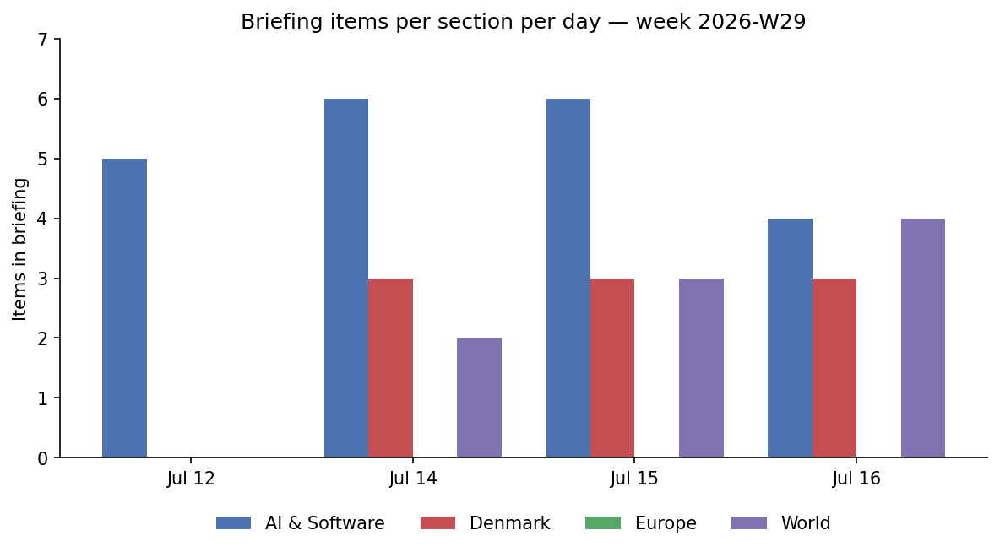
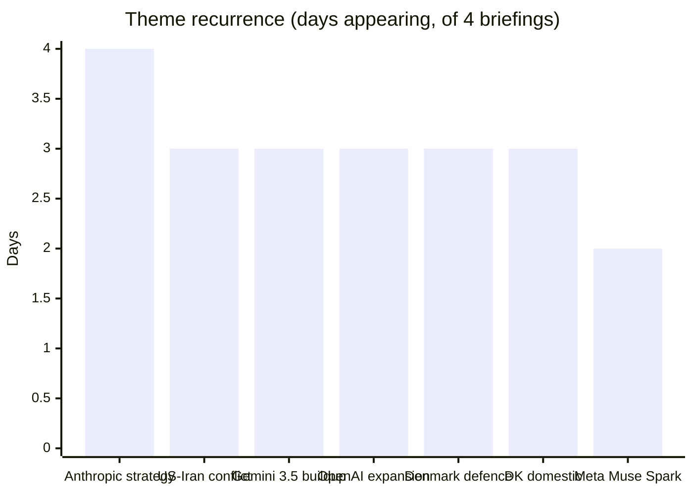
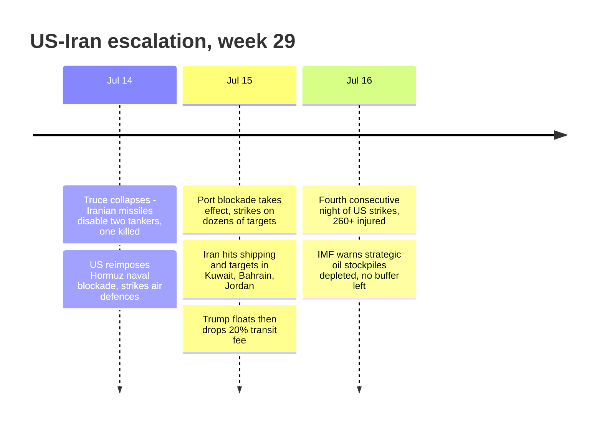

# Weekly Retrospective — 2026-07-18 (week 29)

*Covering daily briefings from 2026-07-12 to 2026-07-18. Briefings exist for July 12, 14, 15 and 16; July 13, 17 and 18 have no briefing, so late-week developments (including whether Gemini 3.5 Pro actually shipped on July 17) are outside this analysis. The July 12 edition was an AI-industry-only briefing; the multi-section format resumed July 14. No briefing this week carried a dedicated Europe section — European items surfaced under Denmark or World.*

## The week in one paragraph

The week split cleanly in two. Through July 12 the story was AI-industry positioning under legal and competitive pressure — Apple's trade-secrets suit against OpenAI gaining detail, Anthropic conspicuously silent on ChatGPT Work while quietly flipping hyperscaler defaults to Opus 4.8 — with the geopolitical world quiet. From July 14 the frame inverted: the US–Iran truce collapsed, the Hormuz blockade returned, and by July 16 US strikes had run four consecutive nights with Iranian retaliation reaching Kuwait, Bahrain and Jordan and the IMF warning that depleted strategic oil stockpiles leave no cushion for the shock. Underneath the conflict, the AI race stayed hot on a different axis than usual — not model launches but capital structure (OpenAI's proposed 5% US-government stake, Anthropic's reported October IPO prep and Samsung chip talks) and compute scarcity (Google capping Meta's Gemini access). Denmark's week was coherently defensive: intelligence hiring, emergency drone procurement, and troops in a Bastille Day parade themed on Europe's strategic awakening.

## Recurring themes

**US–Iran escalation (3 days: Jul 14–16).** The fastest-developing story of the week, moving from truce collapse (Iranian missiles disabling two tankers, one crew member killed, blockade reimposed) on July 14, to the port blockade taking effect with strikes on dozens of targets and Iranian retaliation against three Gulf states on July 15, to a fourth consecutive night of strikes and 260+ reported injured on July 16. Two sub-threads matter: Trump floated and then dropped a 20% Hormuz transit fee within roughly a day, and the IMF flagged that a ~4M barrel/day deficit between March and May was covered by inventory drawdowns — meaning the usual price-shock buffer is largely gone.

**Anthropic's strategic repositioning (4 days: Jul 12, 14, 15, 16).** The week opened with Anthropic's silence on ChatGPT Work framed as itself the signal, offset only by a distribution play (auto mode and Opus 4.8 made defaults on Bedrock, Vertex and Foundry). By midweek the silence read differently: hires of Tom Blomfield (after Karpathy and John Jumper), reported ~$47B annualized revenue, Samsung custom-chip talks, S-1 preparation for as early as October, and the top grade (a C+) on FLI's 2026 AI Safety Index. The arc of the week suggests Anthropic is answering OpenAI's consumer super-app not with a product counterpunch but with enterprise distribution, talent and an IPO story.

**Gemini 3.5 Pro launch buildup (3 days: Jul 12, 15, 16).** Rumored July 17 launch on the 12th with no confirmation; by the 15th–16th, reporting firmed up that DeepMind scrapped the 2.5 Pro architecture entirely and rebuilt, targeting a 2M-token context window and a "Deep Think" reasoning layer — landing a week after GPT-5.6 and the same day Shanghai's World AI Conference opens with Xi Jinping attending. Whether it shipped on the 17th falls in this week's briefing gap.

**OpenAI's expanding footprint (3 days: Jul 12, 14, 15).** ChatGPT Work and the GPT-5.6 rollout continued broadening, GPT-Live shipped full-duplex voice, and Altman pitched routing 5% of leading AI firms' equity (~$42.6B for OpenAI) into an Alaska-style public wealth fund — weeks before an expected IPO filing. The pattern: aggressive expansion on product, pre-emptive accommodation on politics.

**Meta's agentic push (2 days: Jul 14, 16).** Muse Spark 1.1 went from release note to full launch with Meta's first paid developer API — 1M-token context, computer use across desktop, browser and mobile, and claims of parity with GPT-5.5 and Opus 4.8 on agentic evals. Notably, Meta hit a compute wall the same week: Google capped its Gemini access after Meta asked for more capacity than Google could supply.

**Denmark arms up (3 days: Jul 14, 15, 16).** FE's recruitment of several hundred staff (mostly IT and cyber) appeared on two consecutive days, followed by the Folketing fast-tracking emergency drone and anti-drone procurement citing lessons from Ukraine. With Danish troops in the "Europe's strategic awakening" Bastille Day parade, the national thread of the week was unambiguous rearmament.

**Danish domestic pocketbook items (3 days: Jul 14–16).** The new SF transport minister ruled out road pricing on two consecutive days of coverage, and housing affordability recurred: most municipalities now require incomes out of reach for typical buyers (Frederiksberg topping the list at 2.9M kr household income), with loan demand rising anyway.

## Trend signals

**AI & Software.** The section stayed the heaviest all week (4–6 items daily), but its center of gravity moved twice. Early week: governance and courtrooms (Apple v. OpenAI, hyperscaler default flips) with explicit "capability-quiet, governance-noisy" framing. Midweek: agentic platforms everywhere — Google's Gemini Enterprise agent fleets, Meta's Muse Spark, GitHub's Copilot SDK in six languages, Oracle opening Fusion to coding agents. Late week: money and physical constraints — TSMC's record $39.6B quarter, two IPO tracks (OpenAI, Anthropic), a custom-chip deal, and compute rationing between hyperscalers. The direction of travel: value and news flow keep shifting from model capability to distribution, capital structure and compute supply. A safety counter-current is visible but weak — 200 protesters in San Francisco, a safety index whose best grade is C+, and an actively exploited CVE in Langflow as a reminder that agent infrastructure is now attack surface.

**Denmark.** Stable at three items per day, split consistently between security buildup (accelerating: FE hiring → emergency drone procurement in three days) and cost-of-living strain (housing affordability worsening, road pricing dead). One emerging oddity: near-30°C heat producing rare wildfire and water-shortage warnings — climate-adaptation stories reaching a country that rarely features them. The fertility-savings analysis (15bn kr/year by 2100 at 1.3 children per woman) was a one-day item but fits a slow-burn demographic-fiscal theme.

**Europe.** No briefing carried a Europe section this week, which is itself a signal about the format more than the continent. What leaked through elsewhere: the Bastille Day parade explicitly themed on European strategic awakening with Danish participation, and — from the July 12 AI briefing — the EU AI Act Digital Omnibus still awaiting Official Journal publication, leaving the 2026-08-02 high-risk deadline formally standing. That regulatory limbo is now less than three weeks from the deadline.

**World.** Went from absent (July 12's AI-only edition) to dominated by a single accelerating story. The Iran conflict crowded the section but didn't fully monopolize it: the Congo Ebola outbreak (700+ deaths, 80% of new cases from unknown transmission chains, the fastest-growing outbreak on the continent) and continental-scale wildfire smoke over the US Midwest and Northeast both entered late in the week — two slow-burn crises arriving just as attention concentrated on the Gulf.

## One-offs worth remembering

The Apple v. OpenAI trade-secrets suit dominated July 12 and then vanished from subsequent briefings, but its discovery cycle was expected to force further disclosures by August — dormant, not dead, and it puts any "ChatGPT-native device" procurement on hold. OpenAI's 5%-government-stake proposal is the kind of item that reads as a curiosity until an IPO filing makes it structural. The IMF's depleted-stockpile warning deserves separate memory from the conflict itself: it means any further Hormuz disruption transmits to prices faster than historical analogies suggest. CISA's Langflow KEV entry (CVE-2026-55255) is worth an infrastructure check for anyone running visual agent-building tools. And the Aarhus fertility analysis reframes falling birth rates as a fiscal windfall rather than only a crisis — a framing likely to resurface in Danish budget debates.

## Watch next week

First, whether Gemini 3.5 Pro actually shipped July 17 and how it benchmarks against GPT-5.6 and Fable 5 — a slip would confirm the DeepMind capacity story, a strong launch resets the frontier narrative. Second, the Iran trajectory: whether the strike campaign settles into a contained blockade or widens further into Gulf states, and how fast oil prices move given the missing inventory buffer. Third, Anthropic's October IPO track — an S-1 filing or Samsung chip confirmation would convert this week's signals into hard commitments, and the ChatGPT Work response question is still open. Fourth, EU AI Act Digital Omnibus publication in the Official Journal, with the August 2 high-risk deadline now imminent. Fifth, Denmark's defence acceleration: FE hiring plus emergency drone procurement in one week suggests more fast-tracked security decisions are queued, likely with classified specifics.
