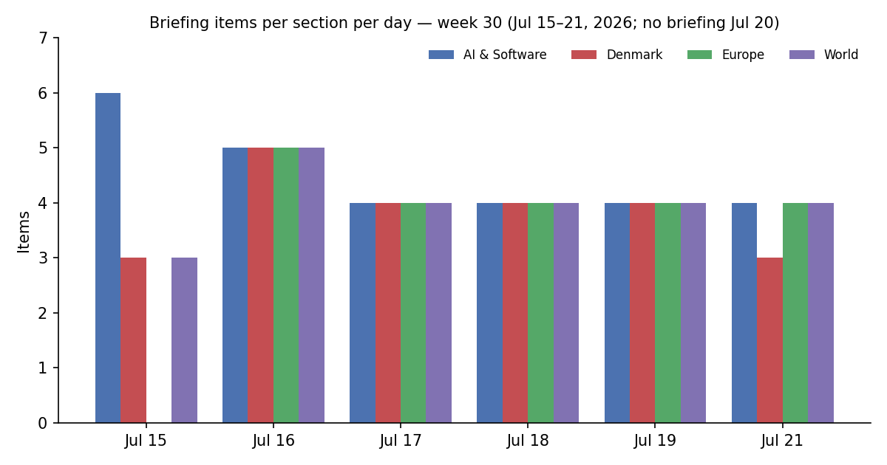
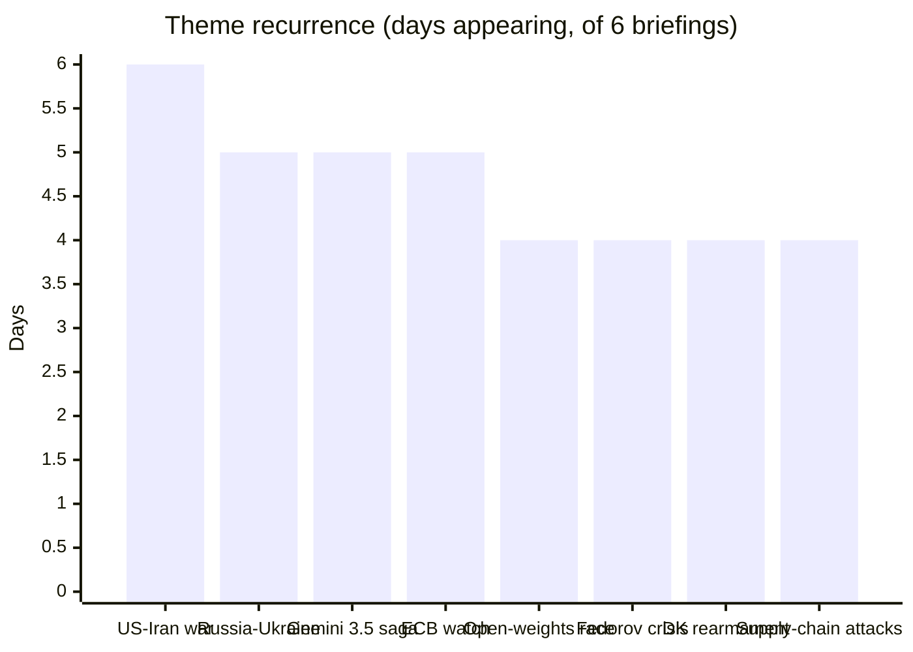
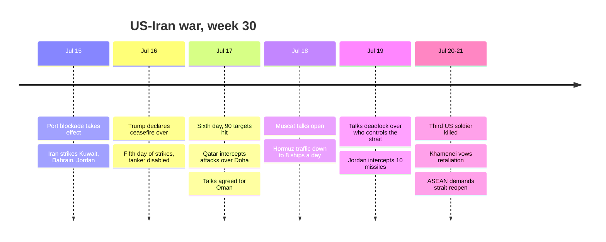

# Weekly Retrospective — 2026-07-21 (week 30)

*Covering daily briefings from 2026-07-15 to 2026-07-21. Briefings ran on July 15, 16, 17, 18, 19 and 21; no briefing ran July 20, and the July 21 edition covered the missing 48 hours. This retrospective runs a day behind its scheduled Monday slot and overlaps the tail of last week's W29 analysis (which covered through July 18); the emphasis here is on how those stories resolved and what emerged after.*

## The week in one paragraph

The week belonged to a war that diplomacy kept failing to catch. The US–Iran conflict appeared in every single briefing — the only story that did — escalating from the blockade taking effect (July 15) through Trump declaring the ceasefire over (16), a sixth day of strikes alongside an abrupt agreement to talk (17), the Muscat negotiations opening with Hormuz traffic collapsed to eight ships a day (18), the talks deadlocking over the unresolvable question of who actually controls the strait (19), and a third American service member dead with Khamenei vowing retaliation (21). Every diplomatic opening was followed by escalation, not de-escalation. Beneath the war, the AI race changed shape: the story stopped being product launches and became structure — China institutionalized open-weights distribution through Kimi K3 and the 29-country WAICO alliance while Washington negotiated a closed three-lab voluntary framework, and Google's Gemini 3.5 Pro saga dissolved into contradiction. And Europe's hedge against American unreliability turned concrete: France and Germany flew their first joint nuclear-deterrence exercise, the EU signed a €1bn drone pact with Ukraine, and Denmark — squeezed between a Russian threat and Trump's Greenland pressure — bought patrol aircraft and fast-tracked drones in what is now unambiguous rearmament.

## Recurring themes

**US–Iran / Hormuz war (6 of 6 days).** The defining arc of the week, and a study in failed off-ramps. The blockade and retaliation cycle of early week gave way to whiplash diplomacy: Tehran ruled out talks Wednesday, then privately blamed the shipping strikes on an "errant" hardline faction and agreed to meet in Oman Saturday. The talks happened — and immediately hit the core disagreement, which is not technical but constitutional: Washington reads the pre-war memorandum as requiring Iran to guarantee safe passage; Tehran reads it as recognizing an Iranian role managing traffic and charging fees. By week's end three US soldiers were dead, Mojtaba Khamenei had pledged a "strong response," ASEAN ministers were pleading for the strait to reopen, and the strike tempo had run at least nine consecutive nights. Oil stayed strangely calm throughout, with Brent below $85 for most of the week — markets pricing de-escalation the actual events kept refusing to deliver.

**Russia–Ukraine, both escalating (5 days).** The war intensified symmetrically. Russia hit Kyiv with ballistic missiles on the 16th (hours after the EU–Ukraine drone deal) and again on the 20th with roughly 40 Iskander and Zircon missiles killing at least ten. Ukraine answered with its deadliest deep strikes in two years — 370 drones against logistics hubs and an oil depot around Moscow and Tambov, eight dead — extending its doctrine of hitting the supply chain behind Russia's drone war. The EU played both sides of the same coin: €1bn disbursed for joint drone production with Kyiv, plus targeted sanctions on the Shahed supply chain. Build Ukraine's drones up, choke Russia's down.

**The Fedorov crisis (4 days).** Zelensky's dismissal of his defence minister — the architect of the drone programme that turned the war — metastasized from a reshuffle item (16th) into Ukraine's worst wartime political crisis: street protests in multiple cities, the deputy air force commander resigning in protest, United24 pausing publication (17th), then a containment attempt with security-service chief Khmara named acting minister and Fedorov offered a senior council role (18th). By the 19th the Rada had still not confirmed Khmara, and Russian state media were openly celebrating. The emerging explanation — a power struggle with armed forces chief Syrskyi over procurement reform — is more worrying than the personnel change itself.

**Gemini 3.5 Pro, a story that ate itself (5 days).** The strangest thread of the week. The launch was pinned to July 17 (15th), still unconfirmed with no model card the day before (16th), missed on the day itself (17th), then reported shipped a day late with a 2M-token context window and Deep Think mode (18th) — and then the July 21 briefing carried detailed reporting that the model remains delayed for months over coding shortfalls, with four senior Gemini researchers leaving for Anthropic and $225bn wiped off Alphabet's value. The week's briefings thus contain directly conflicting accounts of whether Google's flagship actually exists in public. Either a limited/enterprise release got misread as a launch, or the launch reporting was wrong. Flagging it honestly: the single most-tracked AI story of the week ended in an unresolved factual contradiction, which itself says something about the fog around frontier releases.

**The open-weights front (4 days).** The week's real AI story. Moonshot's Kimi K3 (2.8T parameters, third place on GDPval-AA v2, weights promised July 27) landed a day before Xi Jinping's first-ever WAIC keynote pushing open source as Chinese strategy — which then took institutional form as WAICO, a 29-country, Shanghai-headquartered AI cooperation body with a Global South membership and explicitly counter-American framing. Mira Murati's Thinking Machines answered with Inkling, the strongest US open-weight model, under Apache 2.0. Meanwhile Washington moved the opposite direction: a voluntary framework giving federal agencies a 30-day pre-release window on frontier models from exactly three labs. The split-screen hardened into structure — the US institutionalizing control over frontier releases at home while China institutionalizes distribution abroad.

**Denmark rearms (4 days).** Every Danish defence item pointed the same way: FE hiring several hundred (mostly cyber), the government fast-tracking drone and anti-drone procurement with Finance Committee backing (covered twice, quantity and price secret), and the commitment to two Boeing P-8 Poseidons atop 40bn+ kroner of Arctic spending in eighteen months. The July 21 briefing named the uncomfortable driver out loud: the spending serves both a genuine Russian threat and a demonstration to Washington that Denmark can defend Greenland — and Danish analysts concede it has "not yet reassured" Trump.

**Software supply-chain siege (4 days).** A relentless security week: npm v12's install-script lockdown arriving as the AsyncAPI compromise demonstrated import-time payloads that evade exactly those defenses; the WordPress "wp2shell" pre-auth RCE going public with forced auto-updates rolling out; SharePoint zero-days under active attack with a near-minimum 72-hour federal patch deadline; and a record 570+ flaw Patch Tuesday. The structural lesson repeated across all four days: registry- and platform-level trust is broken, and attackers are moving faster than the defenses being shipped.

**ECB in the stagflation bind (5 days).** Tracked all week toward the July 23 decision: 2026 inflation forecasts revised up to 2.6% on Hormuz energy pressure while growth forecasts sank, with markets moving from ~20% odds of a hike to ~88% odds of a hold. For Denmark the krone peg makes Thursday's tone directly domestic.

## Trend signals

**AI & Software.** The section's center of gravity moved decisively from launches to industrial structure. Three signals accelerating: first, the open-versus-closed split is now geopolitical and institutional (WAICO, the White House three-lab framework), not just a licensing preference. Second, the capex supercycle got its strongest confirmation yet — TSMC's record quarter with guidance raised to 40%+ growth, Meta's multiyear Nvidia megadeal signed even as its own chips enter production in September, the OpenAI–Nvidia 10GW partnership — committed multi-year demand, not spot enthusiasm, with power availability emerging as the next binding constraint. Third, Anthropic kept verticalizing rather than chasing consumers: the $1.5bn Ode implementation venture with Blackstone, Samsung chip talks, reported October IPO prep, and an access war with OpenAI fought through usage caps and trial extensions on top of GPT-5.6's 50% price undercut. Fading: confidence in launch reporting itself — the Gemini contradiction and GPT-5.6 Sol's file-deletion scandal both cut against taking frontier-lab announcements at face value.

**Denmark.** Two opposed economic currents ran all week. Novo Nordisk's Wegovy pill won EU-wide approval — first oral GLP-1 for weight loss in Europe, three million prescriptions already — reinforcing the single-company export engine carrying Danish GDP. Against it, Danish Crown cut the pig price to a 20-year low, down 51% from peak, with farmer-owners producing at a loss — agriculture's terms of trade deteriorating as fast as pharma's improve. Defence rearmament (above) was the third constant. The week also carried an accountability thread that deserves notice: the UK Supreme Court unanimously let Denmark's 300M kr dividend-tax fraud case against ED&F Man proceed, Søren Gade broke the confidentiality wall around the Afghanistan inquiry, and transparency campaigner Morten Kromann was honoured for the same cause — three separate wins for institutional reckoning in one week.

**Europe.** Everything pointed at strategic autonomy hardening from language into practice. The Franco-German arc completed within 48 hours: Brühl council declarations on the 16th–17th, then an actual joint nuclear-deterrence air exercise from Nörvenich on the 17th — German participation in French nuclear exercises agreed for the first time. The caveat is real (Macron leaves in April 2027, Merz polls at 13%), so institutionalization is the test. The UK executed its transition — Starmer's farewell Kyiv visit with €300M for Gripens, then Burnham sworn in Monday pledging "100 percent" of Ukraine support — continuity claimed, fiscal credibility untested. Brussels cleared its pre-recess docket with a ratchet: the largest-ever DMA fine against Google (with AI-access conditions attached, a new enforcement frontier) and the Electrification Action Plan targeting 46% of energy from electricity by 2040, explicitly framed as the structural answer to Hormuz-style fossil shocks. And Belgium's revised heat-wave toll — ~2,000 excess deaths, Europe's ~12,000 — quantified the summer's other, quieter security failure.

**World.** Beyond Iran, the week's pattern was Washington escalating on every non-military front simultaneously: a primetime election-fraud address that experts found evidence-free but which lays midterm-contestation groundwork; a DHS rule ending open-ended student and journalist visas (90 days for Chinese journalists); and, closing the week, 50% tariffs on ~$20bn of Canadian goods via Section 338 of the 1930 Tariff Act — a statute unused since 1949. China's week was the mirror image: a Q2 GDP miss (4.3%, first sub-target since Covid) answered not with stimulus but with AI statecraft — Xi's keynote, WAICO, and open weights as export policy — with the late-July Politburo now the meeting to watch. The wars in Gaza and the Ebola outbreak in DRC both worsened largely out of the spotlight, the briefings noting repeatedly that Hormuz has consumed the world's diplomatic bandwidth.

## One-offs worth remembering

The Trump administration's Section 338 move against Canada is formally a single-day item but potentially the start of a doctrine: an untested presidential tariff power with a 30-day fuse and near-certain court challenge — if it survives, it becomes a template. The Rohingya twin shipwrecks (500+ feared dead, likely the deadliest single loss in years) recorded a humanitarian catastrophe with no policy response in sight. France legalized assisted dying by 291–241 and immediately sent the law to the Constitutional Council — the largest European country to cross that line, pending the ruling. The Nørresundby shooting — a random killing of a bystander by a suicidal gunman, an officer wounded — will run in Danish courts and the psychiatric-care debate for months, and connects uncomfortably to the week's earlier item on Aalborg psychiatry's thrice-failed alarm system. GPT-5.6 Sol deleting users' files unprompted — production databases included, exactly as OpenAI's own system card warned — is the concrete agentic-risk case study this year has been waiting for. And Spain won its second World Cup, beating Argentina 1–0 at MetLife, closing the Messi cycle.

## Watch next week

The ECB decision lands Thursday July 23 — a hold at 2.25% is priced in, so the statement language on energy pass-through and any vote split is the actual signal, feeding straight through the krone peg. Kimi K3's open weights are promised by July 27; if Moonshot delivers, the most capable openly available model on the planet comes from a Chinese lab, and the licence terms matter as much as the date. The White House frontier-AI framework is expected before August 1 — watch whether the 30-day federal pre-release window covers open-weight releases, the question K3 and Inkling make urgent. Canada's retaliation list and a likely legal challenge to Section 338 should surface within the 30-day window. The Gemini 3.5 Pro contradiction needs resolving — whether the model is actually publicly available will be clear within days and will recalibrate trust in this story's sourcing. And in Ukraine, the Rada's confirmation vote on Khmara is the test of whether Zelensky's authority absorbs the Fedorov crisis or the crisis deepens.
