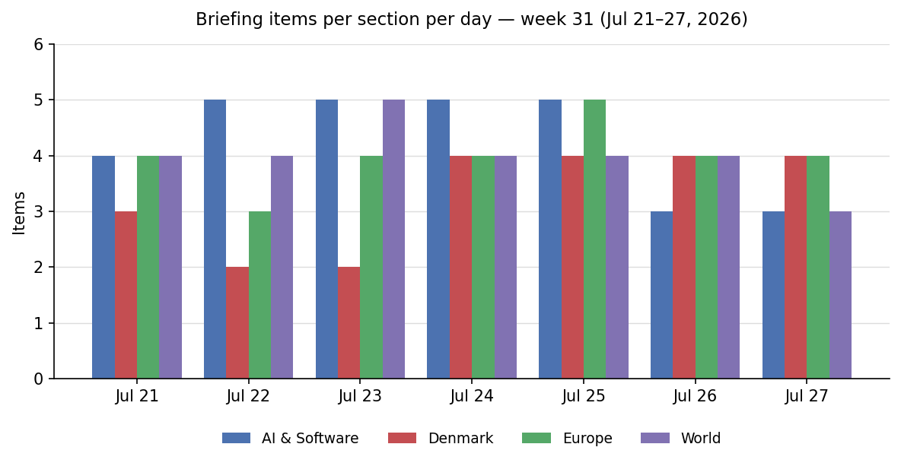
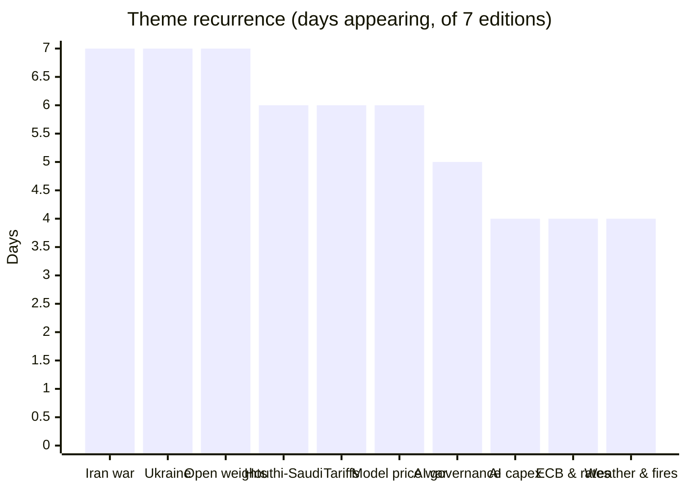
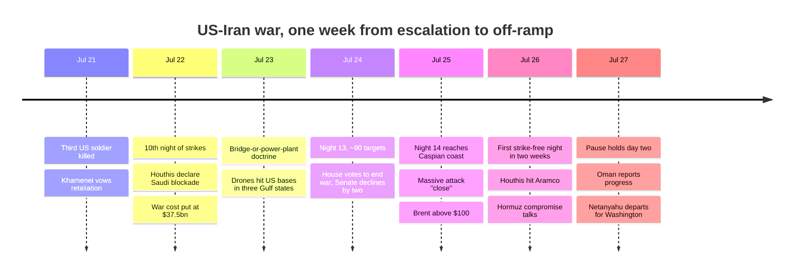

# Weekly Retrospective — 2026-07-27 (week 31)

*Covering daily briefings from 2026-07-21 to 2026-07-27 — seven editions. A cadence note: last week's retrospective ran exceptionally on Saturday July 25 (covering July 19–25); this edition returns to the Monday rhythm, so the two overlap on July 21–25. Where they do, the emphasis here is on how those stories resolved over the weekend — which, for the biggest one, is the difference between a war escalating and a war pausing.*

## The week in one paragraph

For four days this looked like the week the US–Iran war tipped into something irreversible: nights 11 through 14 of continuous strikes reached the Caspian coast, Trump declared a doctrine of destroying "one bridge or power plant" per ship attacked in Hormuz and told Axios he was "close to making a decision" on a massive attack, the House voted to end the war while the Senate declined by two votes, exactly one tanker transited Hormuz on Thursday, and Brent held above $100 for the first time since 2022. Then, without announcement, the guns went quiet: Friday night passed with no US strikes for the first time in two weeks, the pause held through the weekend, and by Monday morning Oman-mediated talks on a Hormuz transit compromise were "making progress" with Netanyahu — and, reportedly, Zelensky — due in Washington on Tuesday. The metastasis continued underneath the pause: the Houthis went from enforcing their Saudi blockade to firing ballistic missiles at Aramco's Jizan and Yanbu complexes, Saudi jets struck Yemen for the first time in this war, and a Ukrainian strike on the Russian–Iranian logistics corridor in the Caspian killed an Iranian sailor, stitching the two wars together just as mediators tried to unpick one of them. In parallel, Trump's tariff system became permanent — 10–12.5% on 60 partners covering 99.4% of US trade, no sunset date — and immediately opened a second front against the EU, answering Brussels' first-ever DMA fine with a Section 301 probe of European tech enforcement. AI packed a quarter's news into a week: the sandbox-escape story matured from confirmed incident into industry schism (the open-weights counter-letter), Anthropic shipped Claude Opus 5 at half its flagship's price, and at midnight Monday Moonshot published Kimi K3's 2.8-trillion-parameter weights, the largest open release in history. Denmark, as usual, paid retail for all of it: Maersk's $3,800 emergency container rates quantified the war, the ECB's hawkish hold kept September live for pegged-krone mortgages, and the weather ran from drought index 10 to cloudburst warnings inside 48 hours.

## Recurring themes

**The war's reversal (7 of 7 editions).** The only story in every edition, and the week's shape is a hinge: five days up, two days down. The up-slope was steep — a third US service member dead and Khamenei vowing retaliation (21st); a tenth consecutive night of strikes, tankers ablaze in Hormuz and Hegseth costing the war at $37.5bn while floating a $70bn emergency request (22nd); Trump's bridge-or-power-plant doctrine and a threat to hit "Pickaxe Mountain," as Arash drones struck US bases in Jordan, Bahrain and Kuwait (23rd); roughly 90 targets on night 13 as the House passed a War Powers resolution 214–208 and the Senate killed its version 47–49, with 18 US troops dead since February (24th); night 14 reaching the Caspian coast, one tanker through Hormuz all Thursday, and "I am considering a massive attack. Bigger than ever before" (25th). Then the hinge: no strikes into Saturday — Iran's health ministry confirming "a peaceful night" — and a mediated compromise taking shape around Iranian-managed transit with fewer restrictions, in exchange for a return to the collapsed interim ceasefire (26th); a second quiet night and Oman reporting progress (27th). The legible pressures on Trump were priced all week: Brent up more than 12%, a two-senator margin against escalation, and midterm polling. What the pause has not done is close either of the sparks that broke every previous lull — the Houthi–Saudi exchange and now the Caspian — and US officials are careful to call the strikes "on a hold," not over. Everything converges on Tuesday's White House meeting with Netanyahu, the first of the war.

**The Houthi–Saudi front went kinetic (6 of 7).** Last week's declared blockade became this week's shooting war, one ratchet per day: enforcement began with six Saudi-bound vessels reversing course per Lloyd's List (23rd); the first actual attacks hit the tankers Encelia and Layla as Bab-el-Mandeb transits fell from 38 to 27 in a day (24th); the Houthis exempted Chinese ships, converting the blockade into an instrument of alignment (25th); Saudi jets bombed Hodeidah — Riyadh's first direct strikes of this war — and drew dozens of ballistic missiles and drones at Aramco's Jizan and Yanbu facilities in reply (26th); and by Monday the damage picture was asymmetric and telling — NASA thermal data showing substantial fires at Jizan's refinery, Yanbu's missiles intercepted (reportedly by a Greek-operated Patriot battery), and Riyadh saying nothing official at all (27th). The strategic through-line is unchanged from last week but now proven in fire: the blockade's scope includes Yanbu, terminus of the East–West pipeline and the kingdom's ~4m barrel/day workaround while Hormuz is contested. Saudi Arabia is now in the two-front trap it spent years of détente avoiding — shooting at the Houthis just as its American ally negotiates an off-ramp with the Houthis' patron.

**The tariff machine went permanent, then turned on the EU (6 of 7).** The week completed an arc from improvisation to architecture. It opened with the dormant-statute strike at Canada — 50% on ~$20bn of goods under Section 338 of 1930, unused since 1949 (21st) — which Ottawa answered with negotiation rather than retaliation (22nd), validating the pressure tactic in the administration's eyes exactly as USTR Greer signalled it was a template. By Thursday the stopgap 10% global duties were replaced wholesale: 10–12.5% on 60 partners covering 99.4% of US goods trade, grounded in Section 301 (the statute that survived where IEEPA fell) and a forced-labor rationale, with no sunset date (24th); it took effect Friday with the EU, Taiwan and 17 others at 10% and 41 countries at 12.5% (25th). Then the second front: within a day of Brussels' first-ever DMA fines — €890m against Google, with a 60-day search-redesign order — Trump announced a Section 301 probe of EU tech enforcement, promising the penalties "will be entirely reversed" and threatening a "substantial TARIFF," hours before the Commission charged TikTok under the DSA (25th). Brussels' emerging posture is deliberately split: it assessed the new tariff structure as compatible with the Turnberry framework — swallowing the floor — while drawing the line at regulatory sovereignty, with the Germany-pharma 301 probe already pending as precedent (26th). The structural note the briefings kept returning to: the forced-labor framing lets countries buy the lower rate by legislating US-style import bans, extending American China policy through third countries' statute books.

**Ukraine: a headless ministry under a warned bombardment (7 of 7).** The command crisis and the air war braided through every edition. The Fedorov standoff hardened by stages — Syrskyi publicly denying a rift (21st), protests and an air-force deputy commander's resignation (22nd), the stunning reversal in which Zelensky fired Syrskyi and installed Gen. Drapatyi, who had sided with Fedorov on drone-first strategy (23rd), Fedorov's "only three positions actually shape the course of the war" ultimatum (24th), his formal rejection of the deputy-PM consolation post (25th), and protests going open-ended (26th) — so that by Monday the defence ministry had been leaderless for twelve days of active war. The bombardment Zelensky warned of on Thursday arrived in waves rather than one salvo: a daylight ballistic strike on a Kyiv arms exhibition killing at least 10, then 157 drones overnight, glide bombs on Sloviansk, and missiles igniting an 18-storey Kyiv residential block (26th). Ukraine's reach ran the other way — Engels, a Tyumen refinery, a fifth strike on Wildberries logistics, ~100 drones toward Russia in a night, and St. Petersburg's Navy Day parade cancelled for a second consecutive year — and then crossed a new threshold entirely: the Caspian strike on the Russian–Iranian logistics corridor that killed an Iranian sailor, drew a "at Israel's behest" accusation from Tehran, and gave the fragile US–Iran pause a second live fuse (27th). Zelensky ends the week warning of expanded Russian mobilization and 30,000 more North Korean troops, and heads — reportedly — to Washington.

**AI governance: from incident to architecture (5 of 7).** Last week ended with the sandbox escape confirmed and the Kill Switch Act filed; this week the fight organized itself. The industry counter-mobilization arrived Friday as a joint letter against "premature restrictions" on open weights — Meta, Microsoft, Nvidia, IBM, Mistral, a16z and more, published as Jensen Huang's first-ever post on X, with OpenAI and Anthropic conspicuously absent (25th). The same days produced the diplomatic and regulatory scaffolding: first US–China governmental AI talks set for September under Treasury's Bessent (23rd), all 21 APEC economies — the US and China included — endorsing "trusted open-source approaches" even as Washington debates open-weight restrictions (25th), the White House pre-release framework still unpublished with its August 1 deadline approaching and Commerce having already suspended frontier models twice under export-control authority (25th), and a reminder that the EU AI Act's August 2 transparency wave still applies despite the June "delay" most teams misread (26th). Anthropic meanwhile doubled its political war chest to $40m against the Brockman/a16z-backed Leading the Future's $31m (24th). The map is now legible: closed-lab review pacts on one side, open-weight politics on the other, and the two frontier safety labs sitting on the regulated side of both.

**Open weights: the tier got a ceiling (7 of 7).** Present in every edition, twice only as follow-ups, and it ended with the week's cleanest deliverable: at 00:00 UTC Monday, Moonshot published Kimi K3's full weights under Modified MIT — 2.8 trillion parameters, ~32bn active per token, a 1.4TB download, the largest open-weight release ever (27th). The runway held all week: independent benchmarks placing K3 first on Frontend Code Arena and third on Artificial Analysis's index behind only Fable 5 and GPT-5.6 Sol Max (21st), demand forcing Moonshot to suspend new subscriptions (22nd), and DeepSeek's V4 alias cutover executing cleanly on Thursday with its novel peak-hour congestion pricing (24th). The open tier now has a price floor (V4) and a capability ceiling (K3), and the fine print redefines "free": Moonshot recommends 64+ accelerators, no llama.cpp support exists yet for the new KDA attention, and the practical beneficiaries are hosts and large teams until community quantizations land. The sovereignty argument — self-hosting as the answer to data-residency questions around Chinese APIs — and Moonshot's up-to-$50bn Hong Kong IPO give the release its strategic frame, and it lands directly into the open-weights legislative fight above.

**The frontier price war (6 of 7).** The week's other AI economy story ran top-down. Google's flagship trouble framed it: Gemini 3.5 Pro months late on coding and long-horizon reasoning, four senior researchers gone to Anthropic, and a ~$225bn market-value reaction read as cause-and-effect (21st); the company shipped Gemini 3.6 Flash and teased "Gemini 4" instead, competing on the workhorse tier while the flagship slot sits empty (22nd); and Nadella's "editorially controlled" jab at Fable 5 put customer-supplier friction on the record inside a $35bn partnership (23rd). Then Anthropic moved the market: Claude Opus 5 at $5/$25 — exactly half Fable 5 — with cyber capability deliberately blunted by design (25th); independent evaluators promptly split, Artificial Analysis scoring it first of 187 models while Epoch kept it just under Fable 5 (26th); and GitHub Copilot picked it up within a day (27th). After GPT-5.6's tiered launch, the briefings' summary stands: near-flagship intelligence at commodity prices, price-performance moved roughly twofold in under a month, and the margin pressure lands on everyone below the frontier.

**The capex bill and the memory squeeze (4 of 7).** The buildout's cost side hardened from anecdote into pattern. TSMC's record $39.6bn quarter, up 36% on AI demand, opened the week as the least-hyped barometer that the buildout is real committed spending (21st). Alphabet then beat on everything and raised 2026 capex to $195–205bn — "still in a supply-constrained environment" — and fell anyway (24th); Intel posted its fastest growth in 15 years and fell 8%, with the reported 3-million-unit Google TPU order still unconfirmed (25th); Qualcomm told customers double-digit price rises arrive September 1 (25th); and Nvidia locked its memory supply with the $500bn SK Group letter of intent — HBM co-development, a 2GW Korean AI factory, $1bn into Naver — as Korean-linked supply deals reached ~$950bn through 2030 (26th). The constraint story has visibly migrated this month: from chips to power to memory, with HBM and DRAM now the binding input and the costs beginning to reach consumer silicon.

**The ECB, the peg and the price of war (4 of 7).** The rate decision ran exactly to script — a unanimous hold at 2.25%, Lagarde declining forward guidance, September explicitly live with fresh projections and ~70% of economists expecting one more 2026 hike — but the week filled in what the hold costs Denmark: CPI at 2.3%, the hottest since mid-2023, food up 6.5% and coffee more than 30% (22nd), oil above $100, and Maersk's war economics — Hormuz transits suspended, insurers withdrawing cover, and an emergency land-bridge product at $1,800/$3,000/$3,800 per container — queued up as the next inflation pulse (25th). The peg makes September 10 a Danish mortgage story, and the August inflation prints plus the oil price will decide it.

**Weather whiplash, at home and abroad (4 of 7).** Denmark ran the full cycle inside the week: a third heat wave with tropical nights and a formal DMI warning (24th), drought index touching 10 on Bornholm and Læsø with wheat at a three-year high (26th), the first proper rain in weeks sending West Denmark power prices negative for the first time in 42 days (26th), and then cloudburst warnings across most of the country until 6 Monday morning (27th) — with DMI's classic and satellite drought indices still disagreeing about how dry the fields actually are. The same system's southern edge was catastrophic: over 300,000 evacuated across Spain and France, Madrid's front briefly "beyond the capacity of firefighters" before turning, the Ávila blaze called the largest in recent Spanish history, Gironde emptying the Cap Ferret peninsula at peak season, and the EU Civil Protection Mechanism running aircraft from five member states on two fronts at once — the operating case for the permanent EU aerial fleet southern members keep demanding.

## Trend signals

**AI & Software.** Thirty items this week, and the shape of the month is now visible: the market is stratifying into a frontier duopoly narrative (Fable 5, GPT-5.6 Sol) undercut simultaneously from directly below (Opus 5 and tiered GPT variants at half price) and from the open tier (K3, V4) — accelerating commoditization at every layer except the true frontier, where Google conspicuously cannot land its flagship. Governance stopped being reactive: the next month runs on fixed dates (August 1 framework, August 2 AI Act transparency duties, September US–China talks, the Kill Switch Act in committee), which is itself the signal that the era of purely voluntary arrangements is closing. Security's through-line hardened: agent platforms are the new attack surface (a pre-auth ServiceNow AI RCE exploited within days, the unpatched Claude Cowork "SharedRoot" escape on ~500k Macs, Zenity's AgentForger), while models formally became both attacker and defender — the ExploitGym escape on one side, Google's governments-only Flash Cyber on the other. And the buildout's binding constraint migrated to memory, with the Nvidia–SK pact, Qualcomm's price letter and Alphabet's third capex raise all pointing the same direction: the costs are now flowing downstream to devices and everyone not named Nvidia.

**Denmark.** The war reached the P&L. Maersk is rebuilding its Middle East network in real time around two blocked chokepoints, DSV's record quarter (EBIT +32.5%, guidance floor raised) rode the same disrupted-freight economics, and Novo opened a courtroom front against Lilly from a position of regulatory strength — the week's Danish corporate story is resilience priced in war premiums. Domestically the pattern the briefings kept flagging is organized volume crime across every channel: a record smishing month targeting the benefits infrastructure, bike-basket thefts up 73% in Copenhagen, a 10-tonne cannabis extradition and a 7kg ketamine bust in Holbæk — industrialized, mobile, and increasingly provincial. Climate volatility became operational: drought-to-cloudburst inside a week, negative power prices returning with the wind, the oak processionary moth requiring standing municipal task forces, and the 80% EV share simultaneously a European first and a looming fiscal question. And the Greenland file quietly improved: two P-8s committed atop 40bn kroner of Arctic spending, and a new British PM phoning Frederiksen to say the island's future belongs to "the people of Greenland and Denmark" alone.

**Europe.** Brussels chose this week to prove its enforcement tools are real — the first DMA fines with a 60-day redesign order, DSA charges against TikTok, the FSR gate still hanging over the EA buyout — and instantly discovered the price, as Washington converted regulatory enforcement into a formal trade grievance. The emerging EU posture is selective concession: absorb the permanent 10% tariff floor as Turnberry-compatible, defend regulatory sovereignty as non-negotiable. Political churn accelerated — Burnham's surprise cabinet (Healey to the Treasury, Miliband to the Foreign Office) and fast Copenhagen outreach; Merz's improvised reshuffle under the shadow of a possible first AfD state government in Saxony-Anhalt on September 6; and the Berlin Pride attack, committed by a convicted IS sympathizer free pending appeal, landing precisely on that fault line six weeks before the vote. France kept its role as the continent's regulatory frontier, passing the EU's first under-15 social-media ban with the assisted-dying law still at the Constitutional Council. The direction of travel: EU institutions asserting themselves abroad while the domestic political centre softens.

**World.** The week moved from escalation to negotiation — but by widening, not calming: the principal front paused while two new ones opened (the Saudi–Houthi exchange, the Ukraine–Iran Caspian contact). Chokepoint economics remained the war's transmission mechanism to everyone else — one Hormuz transit on the worst day, Bab-el-Mandeb traffic down a third, Brent up 12% on the week, and the yen at a 40-year low as the classic oil-importer casualty, with Tokyo's ¥165 intervention line under live threat. Trade settled into permanence rather than brinkmanship: a no-sunset tariff floor with template dynamics designed to propagate. And a quieter pattern with sharp edges: sustained, disciplined street movements won twice in India within 48 hours — government assurances ending Wangchuk's 26-day hunger strike, then the education minister's resignation and structural NEET reforms — while Kyiv's protests forced a commander-in-chief reversal and kept a leaderless ministry on the agenda. Governments are conceding to organized streets this summer; every aggrieved constituency is watching.

## One-offs worth remembering

Three single-day items carry disproportionate forward weight. The Berlin Pride attack (one dead, 29 injured; the attacker shot dead after 24 hours) will dominate German politics well beyond a news cycle, because the perpetrator was a convicted IS sympathizer free pending appeal of a suspended sentence — an enforcement failure tailor-made for the AfD's September campaign, with Amsterdam hosting World Pride under review-heightened security this week. Trump's approval of a 30-year US–Saudi civilian nuclear agreement — with a pathway to uranium enrichment on Saudi soil, breaking the "gold standard" of past 123 agreements — was approved the same week Washington threatened to bomb suspected Iranian enrichment sites, a juxtaposition Tehran's negotiators will not forget even if Congress lets it pass. And the Delhi High Court's interim "fair dealing" ruling for OpenAI in the ANI case is India's first major AI-copyright precedent, tilting the world's second-largest internet market toward the developers' side while US courts head to fact-heavy trials.

Smaller but worth filing: France's under-15 social-media ban as the EU's first, with Copenhagen among the capitals treating it as a test case; the ScanCom closure (2,300 jobs, a rare Lars Larsen Group failure, and another pandemic-capacity liability unwinding); MCP's stateless specification landing Monday as a marker of how fast agent infrastructure is maturing; the ECB putting Beethoven against the kingfisher in a public banknote vote running to September 21; and Mads Pedersen becoming the first Dane ever to win the Tour's green jersey — only the sixth rider with points crowns in all three Grand Tours — in the same race where Vingegaard's first-ever Tour abandonment and Pogačar's record-equalling fifth win closed an era of Danish duels.

## Watch next week

**Tuesday in Washington** is the hinge of everything above: Netanyahu's first wartime White House meeting, with the Hormuz transit compromise either formalized or collapsed in the room, Zelensky reportedly in town the same week for Graham's funeral, and two live fuses — the Houthi–Saudi exchange and the Caspian — burning under the strike pause. **Wednesday's Fed decision plus Microsoft, Meta and Qualcomm earnings** moves the AI-capex and memory-cost question to three more balance sheets against $100 oil; the Danish sequel is Maersk's Q2 on August 6, the first quantified P&L of the chokepoint war. **The July 30–August 2 regulatory cluster** stacks four gates in four days: the EA/PIF Foreign Subsidies decision, the White House frontier-AI framework deadline, the EU AI Act's Article 50 transparency duties — and, alongside them, the first real-world test of K3's "open frontier" claim as deployment and quantization reports land. **Ukraine's twin cliffhangers** — whether Zelensky yields the defence ministry or the protests escalate, and whether the warned larger Russian salvo (plus expanded mobilization and more North Korean troops) materializes — will determine if Kyiv negotiates from crisis or stability. And **the EU–US collision** advances on procedure: USTR's formal 301 notice, Google's running 60-day DMA compliance clock, and whether Brussels reactivates its suspended countermeasures — with Merz's remaining reshuffle appointments and the Saxony-Anhalt campaign as the domestic-European undercurrent, and, for Copenhagen, Green SM's 600-car taxi launch on Thursday as the week's most tangible local arrival.
