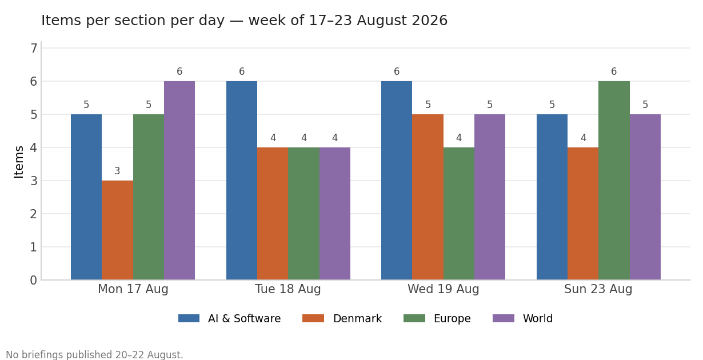
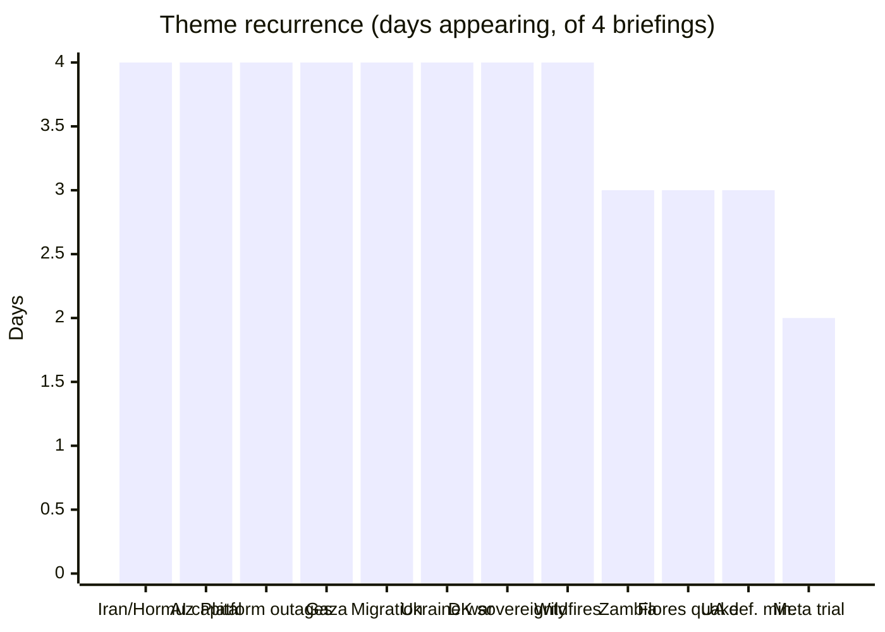
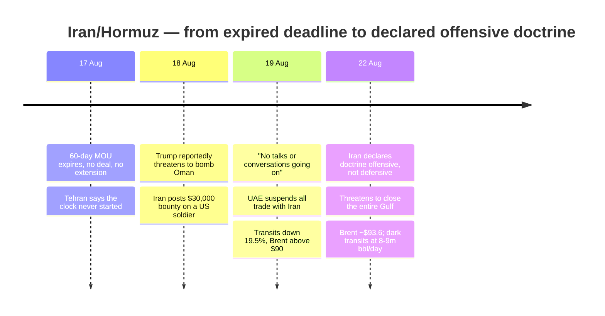

# Weekly Retrospective — 2026-08-24 (week 35)

*Covering the daily briefings of Monday 17 August through Sunday 23 August 2026 — four briefings, 77 items. No briefings were published on 20, 21 or 22 August, so Thursday-to-Saturday developments are visible only through the catch-up follow-ups in the 23 August edition. Where this analysis describes a trajectory across those three days, it is reconstructed rather than observed, and is flagged as such.*

## The week in one paragraph

This was the week the AI build-out stopped being financed on balance sheets and started being financed against promises, and the week two separate standoffs — Hormuz and Gaza — stopped pretending they were negotiations. The financing thread was the strongest of the four days: Stripe paying over $7 billion for OpenRouter on Monday at roughly five times its May valuation, Nvidia guaranteeing up to $105 billion of *its own customer's* lease and power obligations in Ohio on Tuesday, the WSJ putting Big Tech's off-balance-sheet AI commitments at about $3 trillion against $600 billion of reported capex the same day, Etched doubling to $21 billion in a month on Wednesday with its lead investor as its first customer, and by Sunday Broadcom arranging up to $100 billion of debt collateralised against future Anthropic compute while Anthropic itself prepared a public S-1 that would be the largest IPO in history. Each of those is a structure in which the party underwriting the risk is also the party that benefits from the demand being real. Meanwhile the same week's platform news ran in the opposite direction: a 42-minute Claude auth outage on Monday, an eight-hour GitHub outage on Tuesday that took CI/CD down worldwide, a Copilot Autofix patch that *introduced* the vulnerability it was closing, and by Sunday a root-cause analysis showing the outage was prolonged by a retry storm from AI coding tools — the industry raising capital against agentic demand while agentic demand was breaking the infrastructure it runs on. On the geopolitical side, the 60-day US–Iran window expired on Monday with no deal and no extension, and every subsequent day moved further from negotiation: Trump reportedly threatening to bomb Oman, then declaring "no talks or conversations going on," the UAE suspending all trade with Tehran, and by Saturday Iran formally declaring its military doctrine offensive rather than defensive, with Brent above $93 and US pump prices at a mid-August record. Gaza followed the same arc — Kushner met Hamas in Egypt on Sunday, Netanyahu in Jerusalem on Monday, and left with Israel's preferred sequencing (disarm first, withdraw later) dressed as a compromise and nothing Hamas had agreed to. Denmark's week was about sovereignty on four fronts: Greenland lobbying, a proposed Palantir ban, a NATO-linked military zone at the Port of Aarhus, and a battle group handed to NATO command in Latvia.

## Recurring themes

**Iran and Hormuz** appeared in all four briefings and moved monotonically in one direction. Monday: the deadline expires, with a senior Iranian source telling Reuters no extension talks happened because Tehran never considered the 60 days to have started. Tuesday: Trump reportedly threatens to bomb Oman — the country that has been the Washington–Tehran back-channel for two decades — while Iran posts a $30,000 bounty for killing a US soldier. Wednesday: Trump says flatly there are no talks; the UAE suspends all trade and financial dealings with Iran; confirmed Hormuz transits fall 19.5% to 95 in a week. Sunday: Iran declares its doctrine offensive and threatens to close the entire Gulf if any neighbour joins the sanctions campaign. The most useful detail arrived last and undercuts everything above it — actual throughput is running at 8–9 million barrels a day via transponder-off "dark transits", and Iran claims 70 million barrels shipped in a month despite the blockade. The declared closure and the physical flow have diverged, which is where any off-ramp probably sits. Bessent's "unprecedented" sanctions package was promised on the 14th, deferred through the week, upgraded to "economic D-Day" rhetoric on the 19th, and finally scheduled for Monday 24 August — a full ten days of announced-but-unwritten policy.

**AI capital structure** was the week's most analytically coherent thread, and it is worth stating what these deals have in common rather than listing them again: in every case the entity taking the risk is the entity selling into the demand. Nvidia guarantees OpenAI's Ohio leases on a site that will exclusively host Nvidia compute. Jane Street leads Etched's round and is its first customer. Broadcom arranges debt against Anthropic compute revenue that does not yet exist. Stripe buys the routing layer it already processed payments for. That is not fraud and it is not obviously irrational — vendor financing is how railways, telecoms and aircraft were built — but it means demand signals in this sector are increasingly endogenous, and a shortfall no longer shows up as one write-down at one firm but as stress across a private-credit market with participants who have never underwritten compute. Burry's argument, worth attributing to him rather than adopting, is that the depreciation schedules are the tell: five to six years booked against an economic life of two to three.

**Developer-platform reliability** appeared every day and gained a genuinely new explanation by the end. Monday's Claude outage was an auth-layer failure that broke CI pipelines while the API stayed up. Tuesday's GitHub outage ran nearly eight hours and took Cursor down with it. Wednesday's follow-up quantified it — Actions' 90-day uptime at 99.33%, a year's downtime budget spent in one afternoon, root cause deferred to a September report. Then on Sunday the RCA arrived early and named the mechanism: an autoscaler blind to Istio sidecar capacity, and recovery prolonged by roughly an order of magnitude of extra traffic from Copilot and VS Code clients retrying failed requests. The AI tooling that generated the record load also generated the retry storm that stopped the recovery. That is the first outage this year whose *cause* and *prolongation* were both attributable to agentic tooling rather than to humans, and it makes client-side backoff policy an operational risk item rather than a config detail.

**Gaza diplomacy** appeared all four days and ended exactly where it started. Kushner banked Hamas's commitment in El-Alamein on Sunday the 16th, spent four hours with Netanyahu on Monday, and produced an agreed sequencing — full disarmament and demilitarisation before any IDF redeployment, no reconstruction before disarmament — which is Israel's stated position rather than a compromise, and which Hamas has spent months rejecting. By Wednesday the framing had hardened further: Kushner on Fox saying reconstruction waits for demilitarisation, while Ben-Gvir publicly demanded assassinations at 30–40 a night. By Sunday the file had gone quiet enough that a drone killing in Deir al-Balah generated no international reaction at all. The election on 27 October is the arithmetic under all of it — the ministers Netanyahu needs to stay in government are the ones making agreement impossible to sign.

**European migration and returns** ran every day and shifted from crisis to institution. Monday: Morocco breaks up another mass crossing at Ceuta, 294 arrests, three weeks after the crossing that killed at least 141. Tuesday: hundreds protest in Ceuta demanding their asylum claims be processed, with thousands still sleeping on beaches. Wednesday: the Commission states that everyone staying illegally goes back, minors included — a maximalist position its own Return Directive conditions in ways it did not explain. Sunday: Frederiksen names return centres outside Europe as the single policy she will personally drive this term, with 19 member states behind it, the new Returns Regulation in place since 1 June, and a five-country ministerial in Copenhagen on 4 September. The load-bearing gap is unchanged and was visible all week: the legal framework, the coalition and the political will exist; no third country has agreed to host anyone.

**Ukraine** ran on two tracks that converged. The strike exchange escalated from parity to explicit economic-target doctrine: Monday and Tuesday were record drone volumes in both directions, Wednesday was the 230th strike on a DTEK thermal plant with generation halted outright rather than degraded, and by Saturday Ukraine had burned a 135,000 m² Ozon consumer logistics complex alongside a Rosneft refinery — the first clear move against Russia's civilian distribution economy — after Russia double-tapped a crowded Kryvyi Rih shopping centre on Friday, killing 16 including children and hitting the responders with the second drone. Both governments now describe their campaigns as targeting the other's economic capacity, a formulation with very little left inside it that is off-limits. On the political track, the month-long defence-ministry vacancy that dominated Tuesday and Wednesday resolved on the 19th: Khmara confirmed with 312 votes after discharging from military service, alongside Sybiha's return to foreign affairs. The comfortable margin answered the question the briefings had been flagging about Zelensky's authority.

**Danish sovereignty** was the through-line in a Denmark section that otherwise looked like unrelated domestic items. Monday: Løkke confirms Greenland helped hire the Washington lobbyists Denmark paid nearly 2m kroner. Tuesday: Enhedslisten demands Palantir be banned from Danish public agencies, framed explicitly as protection against US leverage rather than as procurement. Wednesday: a temporary military area with a drone ban at the Port of Aarhus, the second such Jutland port activation in three weeks. Sunday: 800 Danish troops handed to NATO command in Latvia under the first woman to lead a Danish combat battalion abroad, with the deployment extended to January 2027. Four different ministries, one argument — dependency is now the frame through which Danish policy reads American software, American pressure and Baltic logistics alike.

**European wildfires** were the fading story of the week, and the shape of the fade is the information. Monday carried a full item: Belgium's High Fens fire at ~3,000 hectares, the largest in Belgian recorded history, with EU Civil Protection aircraft from three countries. Tuesday and Wednesday demoted it to follow-ups — rain on the 17th, "not spread further but we cannot yet say it is contained." By Sunday no fresh reporting on containment had surfaced at all, and the only fire item was political: Merz booed at Hürtgenwald for arriving after the operation had finished. Last week's dominant European narrative became this week's heckling story in six days.

The chart is unusually flat, and that is itself the finding: eight distinct threads appeared in every single briefing. This was not a week of new stories but of seven or eight running ones compounding, which is why the analysis below is about direction rather than novelty.

## Trend signals

**AI & Software** was the heaviest section three days out of four (22 of 77 items) and moved decisively from capability news to capital and liability news. Not one item this week was about a model being smarter. The stories were financing structures, an IPO, an antitrust-shaped licensing deal, an outage post-mortem, a product-design trial, a data purchase at a bankruptcy auction, and a routing layer that cut costs 56%. Two patterns are accelerating. First, cost is migrating out of the model and into the router: AT&T now serves 40% of internal requests from open weights with a 2% quality cost and an internal target of 60–70%, and Goldman's read is that cheaper inference expands total usage enough that hyperscalers benefit rather than suffer. Second, the legal surface is widening from *what models say* to *how products are built* — the 29-state Meta trial seeks structural design remedies rather than damages, and if a court can order changes to an algorithmic feed it reaches every engagement-optimised product without touching the First Amendment. Fading: the pure capability race. Emerging: model *availability* as an economic-security question, after the UK began formally costing out the loss of access to American frontier models following restrictions on foreign-national access to Fable 5 — which makes open weights simultaneously the security risk Brockman warned about and the sovereignty hedge governments want.

**Denmark** grew steadily across the week (3 → 4 → 5 → 4) from a thin recess Monday to a full political season. Three directions are clear. Defence and sovereignty are becoming routine rather than exceptional — port activations with published legal designations, a full manoeuvre battalion under NATO command, an extended Latvia rotation. Immigration is where the government spends its capital and where its coalition is thinnest: 2,055 people frozen in citizenship limbo since a bill lapsed in March, with three of four governing parties publicly pressuring the fourth, while simultaneously narrowing the Ukraine special act and driving EU return hubs. And the economic backdrop turned unexpectedly permissive — AE's 4.2% growth forecast is roughly double the Nationalbank's and the Commission's, which gives the government room in the finance-bill round and gives every support party a reason to ask for more. Emerging and worth naming: American software as a sovereignty risk has migrated from Enhedslisten's fringe position toward the mainstream of the debate in under a year.

**Europe** finished as the largest section on the last day (6 items) after being the smallest mid-week, and its centre of gravity shifted from fire and heat to war and money. The escalation logic in Ukraine is the dominant signal: from deep-strike parity on Monday to reciprocal economic-infrastructure doctrine by Saturday, with interceptor supply — not launcher availability — now the binding constraint on Ukrainian air defence, which makes the composition of European aid more consequential than its headline value. Underneath that, an EU fiscal politics is forming around the energy shock: six governments including Germany, Italy and Spain want a windfall tax on refining margins on the Dublin agenda next month, though tax needs unanimity and Germany's own signature is a ministry position rather than a government one. Quietly, the e-Evidence regime went live on 18 August, letting a prosecutor in one member state issue production orders directly to providers in another, including non-EU providers with EU services — the kind of deadline that produces no news on the day and a great deal in six months.

**World** stayed at 4–6 items daily but its composition changed completely. Monday and Tuesday were dominated by three finite events — Zambia's election, the Flores earthquake, Korean exercise diplomacy — all of which resolved or plateaued by Wednesday: Hichilema declared at 60.49% with an apparent concession, Flores' death toll holding at 68 while displacement climbed to nearly 13,000, and North Korea answering the deliberately shrunken Ulchi Freedom Shield with a promise to expand its arsenal. What replaced them by Sunday was structural: Iran's doctrine change, and 50% US tariffs on $20 billion of Canadian goods taking effect at 00:01 on Saturday after talks collapsed, with Canada retaliating dollar-for-dollar from 8 September. The Canada item deserves more weight than a one-day story: a G7 partner with a comprehensive trade agreement was tariffed at 50% on a deadline, with carve-outs for energy, potash and critical minerals that reveal exactly where the US considers itself unable to substitute. For European exporters that is the precedent, not the news.

## One-offs worth remembering

Google paid $10 million at a bankruptcy auction for roughly 100 million Spirit Airlines employee emails and 500 million Teams messages — a decade of one organisation's actual internal coordination, which is precisely the corpus agentic workplace tools have no other source for. Corporate failure is now a training-data asset class, and nobody who wrote those messages consented to it.

The Wiz Red Agent finding is the sharpest counterweight to the week's "give your security team an agent" advice: a Copilot Autofix patch to a Snowflake repository replaced a safe input pattern with raw string interpolation, was exploited within five days, and leaked a Jira token because a conditional gate meant to check `pull_request.user.login` evaluated true on issue events where `pull_request` was null. AI remediation running with CI write access and no independent check can open findings at the same scale it closes them.

Rajiv Menon KC faces up to two years in prison over the content of a closing speech to a jury — without real precedent in British legal history, and reported to be making criminal defence lawyers reluctant to advance certain arguments at all. The trial is now expected in October.

Amazon is destructively scanning rare books at a dedicated Las Vegas facility, tracked by 404 Media with an AirTag. Destructive scanning is a normal archival technique; the volume, the rarity of the stock and the destination are what is new, and the training-data cases turning on lawfully-acquired-versus-pirated will cite this.

Siim Kallas died at 77. The generation that personally negotiated the Baltics out of the Soviet Union and into NATO and the EU is now leaving, at the moment its security assumptions are under the most pressure since 1991, with his daughter running EU foreign policy.

Denmark switched on a nationwide psychiatric emergency line via 112, four years after the Field's shooting and three years after every party in the Folketing agreed to it. Whether the regions publish call volumes and waiting times is the test of whether it is a pathway or a routing change.

A humanoid robot ran 100m in 9.32 seconds in Beijing, faster than Bolt, with legs lengthened 10cm for the occasion. Read it as a capability signal about actuator power density and high-frequency balance control, not about athletics.

## Watch next week

**Monday 24 August — Bessent's Iran sanctions detail**, promised for the 14th, deferred four times, upgraded to "collapse this regime" rhetoric on the 20th and now scheduled with a date. Two things to watch: whether text actually appears, and whether it names Chinese buyers, who take more than 80% of Iran's shipped oil and whose government has already said pressure does not resolve anything. The gap between the declared blockade and 8–9m bbl/day of dark transits is where this either bites or doesn't.

**Wednesday 26 August — Nvidia Q2 FY2027**, with guidance around $91bn ±2% and China data-centre revenue still booked at zero. This is the first hard number against a week in which Nvidia guaranteed $105bn of a customer's obligations, paid $6bn for a non-exclusive Poolside licence plus 109 staff, and appeared in Broadcom's financing orbit. The disclosure to read is not revenue but the commitments and guarantees footnotes.

**Anthropic's public S-1, possible before month-end.** If it lands it is the single most informative document the AI sector will produce this year: gross margin on inference, customer concentration, the real composition of the ~$65bn "annualised run rate", and the Broadcom/Blackstone/Apollo compute-financing structures laid out in writing, with AI backlash reportedly named as a risk factor. Every argument about the sector's economics is currently made without this data.

**Around 28 August — Z.ai's GLM-5.3 open weights**, delayed roughly two weeks for cyber-capability hardening and flagged in writing by OpenAI's president as likely to materially accelerate the threat landscape. It is also, per the UK's own reasoning this week, exactly the class of model that cannot be switched off by a foreign government. Both readings will be tested against the same release.

**Escalation without a mechanism, in three places.** Ukraine: after Kryvyi Rih and Ozon, both sides now claim the other's economic capacity as a legitimate target, with Putin promising "far more destructive" strikes and no ceiling stated by either. Iran: a publicly declared doctrine change is harder to walk back than a sanctions list. Canada: retaliation lands 8 September, leaving a two-week window that functions as the last chance to climb down. None of the three has a forum where de-escalation could be negotiated, which is the common feature.

**Also dated:** the Copenhagen return-hubs ministerial on 4 September, where the question is whether any host country is named at all; Nvidia's results and Zuckerberg's expected three hours of testimony in the Oakland Meta trial; the Messerschmidt–Lidegaard verdict, expected within weeks; and the Dublin informal ECOFIN in mid-September on the windfall levy. Still unexplained after three weeks: GitHub's 6 August Actions incident, which never received the write-up the 17 August outage eventually got.
