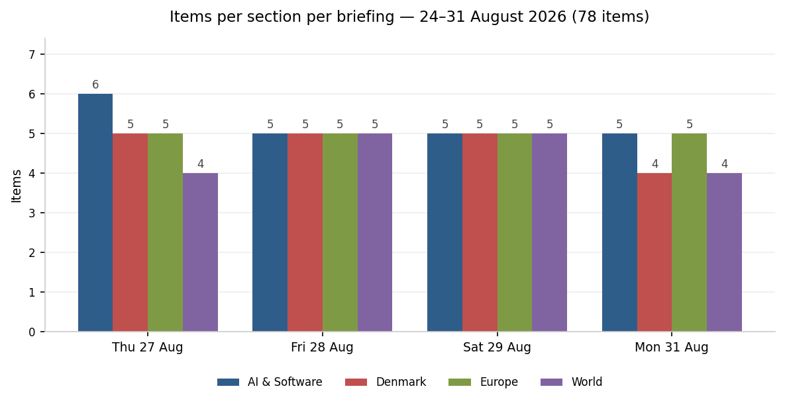
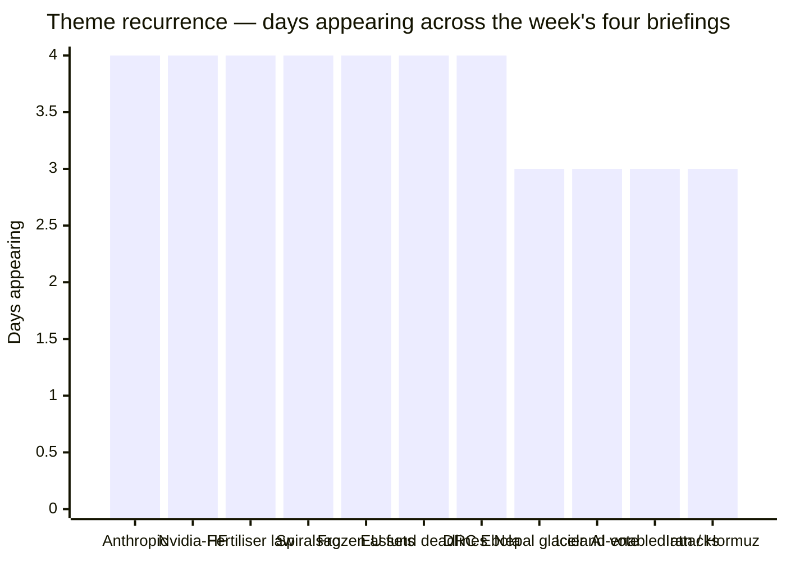
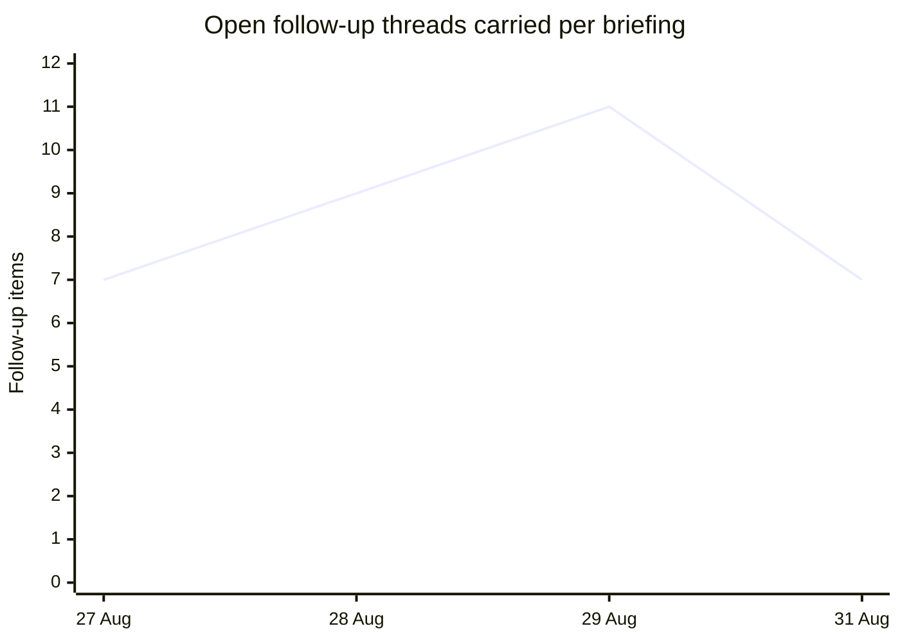

# Weekly Retrospective — 2026-08-31 (week 36)

*Covering the daily briefings of Monday 24 August through Monday 31 August 2026 — four briefings (27, 28, 29 and 31 August), 78 items. No briefings were published on 24, 25, 26 or 30 August; the 27 August edition's follow-ups span four days back to 23 August, and the 31 August edition carries the weekend's resolutions. Where this analysis describes a trajectory across the unbriefed days, it is reconstructed from those catch-up follow-ups rather than observed, and is flagged as such. The 31 August briefing overlaps the start of week 36 proper and will not be re-analysed next week.*

## The week in one paragraph

This was the week the news stopped being about announcements and started being about deadlines — and about who was willing to say anything on the record when one arrived. Three hard dates sat at the end of the week (Romania's €770m integrity milestone, Hungary's €10.4bn super-milestones, Anthropic's reported month-end S-1 window) and they resolved in three different ways: Romania's president signed a law he had just challenged in court, saving the money and costing Timișoara's mayor his job; Hungary reached its deadline with two-thirds met and no confirmation either way; and Anthropic's window simply slipped, first to "after Labor Day", then into a week that ended with Sony Music Publishing and Warner Chappell suing the company, its CEO and a co-founder personally over alleged torrenting of copyrighted compositions. Anthropic ran the full arc of the week on its own: a federal judge vacated the Pentagon's "supply chain risk" blacklisting on Friday as unconstitutional retaliation for the company's refusal to drop limits on autonomous weapons and domestic surveillance, and by Monday the same company was the defendant in a multi-billion-dollar copyright claim landing weeks before an IPO. Alongside that ran the week's most durable non-story: five days after The Information reported a $12.9bn Nvidia acquisition of Hugging Face, neither company had issued a press release, a filing, or a denial — silence long enough to become information in itself. The AI thread that actually moved, though, was security: a hundred-plus companies signed an open letter on Thursday warning that AI-enabled cyber attacks were about to become mainstream, and by Saturday and Monday there were two concrete cases — a Russian-speaking ransomware crew that talked Cursor's agent into breaching seven companies by telling it the attacks were a simulation, and an attacker who turned a stolen internet-exposed Ollama server into a nine-stage autonomous exploitation framework. Europe's week was about the cost of things it had assumed were free: electricity (Denmark now has 60GW of grid connection requests against 7GW of peak demand), Qatari LNG (force majeure extended again, gas at a three-year high), and the political consent of small electorates — Iceland voted No to reopening EU accession talks by 52.8% to 47.2% on the highest turnout since the 2009 crisis election. Denmark's week was dominated by two fights that will both come to a head in the first days of September: the spiralsag, where two commissioned expert reports disagreed on whether the IUD campaign constituted genocide and Mette Frederiksen responded by reversing twelve years of Danish refusal to accept a joint reconciliation commission, and the gødskningslov, where the Venstre revolt acquired names — Søren Gade and Amanda Heitmann on the record against their own government — with tractors booked for Christiansborg Slotsplads. And running under everything: the CIA director flying to Moscow unannounced to warn Russia off the Baltics in the same week US intelligence tied the Leipzig airport drone to the GRU, followed by the Kremlin declaring peace talks in a "deep pause".

The flatness of that chart is itself a finding: the briefing runs to a fixed shape of roughly five items per section, so volume carries no signal and all the week's variation lives in composition and in the follow-up load, which is charted below.

## Recurring themes

**Anthropic** appeared in every briefing and in three distinct registers, which is unusual for a single company. Monday's item was the reported $30tn addressable market it will show IPO investors — a number roughly 40% of the entire US stock market, and larger than the one SpaceX used. By Thursday and Friday the story was procedural: no S-1 on EDGAR, the month-end window closing, then The Information reporting the prospectus had moved to after Labor Day with an investor day in mid-September. Saturday brought the Pentagon ruling, which is the week's most consequential AI item and the one least likely to be remembered as such: a court found the US government had punished an AI lab for the content of its safety policy. Monday brought the music publishers' suit, seeking up to $150,000 per infringed work plus $25,000 per stripped copyright-management-information instance. The pattern across four days is a company whose legal exposure and its regulatory vindication arrived in the same 72 hours, immediately before it has to describe both to public investors.

**Nvidia and Hugging Face** is the week's control case for how to read silence. The Information's $12.9bn report landed on 26 August; by 31 August there had been no press release, no 8-K, no denial, and both companies declining to comment, with Reuters reporting no signed agreement exists. Five days of nothing from two companies that are both extremely capable of issuing a two-line denial is a different signal from one day of nothing.

**The spiralsag** was the week's defining Danish story and it developed on all four days. Wednesday: Denmark passes the compensation law, Greenland to publish two expert reports the next day. Thursday: the briefing flagged, before publication, that the existence of *two* reports rather than one was the story — a call that held. Friday: the reports disagreed, one finding no evidence of genocide, the other finding that genocide remains a possible conclusion no political body can rule out. That split is what made Frederiksen's response possible: backing a joint Danish–Greenlandic reconciliation commission after twelve years of refusal is a move available only when the underlying question has been left formally open. By Monday, Greenland's government had confirmed it is not pursuing a legal reckoning, while the Greenlandic opposition wants Denmark taken to the ICJ. Both governments chose the same off-ramp within 72 hours.

**The gødskningslov** escalated cleanly from a single defection to a whipped fight. Wednesday: Søren Gade will vote against his own party, with DF trying to reframe nitrogen regulation as food prices. Thursday: Venstre mayors across Jutland break ranks publicly, one saying it would take half his municipality's farmland out of production. Friday: the revolt widens and the timetable turns out to be tighter than assumed. Monday: two MPs on the record against, tractors booked for the second reading. This is the clearest example in the week of a story that moved every single day without any new government action — the movement was entirely in who was willing to be named.

**Frozen Russian assets** progressed from advocacy to agenda item over the same four days: a Swedish-led four-country push on Wednesday, formal transmission of the letter dated 27 August on Thursday naming the Gymnich, and by Monday a demand to Kaja Kallas that it go on Tuesday's agenda. Zelensky's ask — front-loading the €90bn loan — did not change; what changed was that it acquired a meeting.

**EU fund deadlines** (Romania and Hungary) ran as a paired story and resolved asymmetrically. Romania's went through the Constitutional Court, the Senate 106–19, and a president who signed on Friday a law he had personally challenged, keeping his objections on the record while saving €770m. Hungary's €10.4bn simply arrived at Monday with the last independent reporting nine days old. One of these produced a documented constitutional argument; the other produced nothing at all.

**DR Congo's Ebola outbreak** was the week's quietest and most consistent escalation, reported in every briefing: 2,715 deaths on Wednesday, 2,744 on Thursday, 2,786 on Friday against 5,794 confirmed cases, spreading into two new North Kivu health zones — daily increments of 29 and 42 deaths, with no vaccine available and, only by Monday, a frontline vaccination campaign beginning in Kisangani. It is already the deadliest on record, and it appeared four times without ever being the top line.

The follow-up load tells a second story about the week's shape: unresolved threads accumulated from Wednesday to Saturday, then dropped sharply on Monday as Iceland, Romania, the Norwegian succession and the Venstre defections all resolved at once.

## Trend signals

**AI & Software** moved decisively from capability news to consequence news. The week opened on Nvidia's $96.2bn quarter, the $1.3 trillion pipeline figure and "extreme pricing conditions in memory" — the last week-35-style financing item. From Thursday onward the section was dominated by security and law. The security arc is the important one: an industry-wide warning letter on Thursday, followed within 48 hours by two live incidents in which the agent itself was the attack surface (Cursor's agent socially engineered with a "this is a simulation" framing; an unauthenticated Ollama instance on port 11434 repurposed from stolen inference into a full exploitation chain). That is a shift from LLMjacking-as-theft to LLMjacking-as-tooling, and it happened inside one week. The legal arc ran in parallel: the Pentagon ruling, the music publishers' suit, and OpenAI terminating Cursor's model access on 12 November under a change-of-control clause triggered by SpaceX's $60bn acquisition — the concrete version of a risk that had been theoretical, with Anthropic increasing Claude compute inside Cursor within hours. Meanwhile the constraint story relocated from chips to electricity: Ofgem examining financed-and-customered tests for grid slots, Utrecht frozen since 1 July, and Denmark's 20 August emergency grid law putting large data centres last in a four-tier priority system against 60GW of requests. Also worth logging as a counter-current: open weights kept accelerating, with Z.ai's MIT-licensed GLM-5.3-Flash early and Tencent's 770B-parameter Hy4 Preview at a million-token context.

**Denmark** ran two constitutional-scale questions at once — colonial responsibility and coalition discipline — while the economics quietly improved underneath both. The Økonomisk Redegørelse landed as trailed at 3.7% growth and a 39bn kroner surplus (from an expected 11bn deficit), and by Friday the råderum to 2035 had been revised up to just under 104bn kroner. That number is the real driver of the autumn: it is what every faction in the gødskningslov and finance-bill fights will be spending. The government's Friday filing of a deliberately empty 2027 finance bill, purely to satisfy the constitution, tells you the real negotiation has not started. The direction of travel on Greenland is toward reconciliation-without-adjudication, with both governments converging on a commission and the ICJ demand confined to the Greenlandic opposition.

**Europe** hardened in two directions simultaneously. On Russia, the week moved from deterrence signalling (Burns in Moscow, the GRU attribution on the Leipzig drone, a third drone found at Kabelsketal on 14 August with roughly 50 grams of explosive) to open acknowledgement of failure — the Kremlin's "deep pause" — and to matériel and money instead: Italy's €3bn SAMP/T package (denied as a formal act by the defence minister the next day), Zelensky's tally of nearly 2,000 drones, 1,600 glide bombs and 31 missiles in a single week including North Korean ballistics, and the four-country push on frozen assets. On enlargement and energy, Europe got two bills at once: Iceland's No, on a turnout that makes it hard to dismiss as apathy, and a gas market at a three-year high with storage at its lowest late-August level since 2009 after Qatar extended force majeure — with Schnabel briefing a September ECB hike into exactly that. The Norwegian succession (King Harald V's death Friday, Haakon VIII acceding immediately, funeral set for 9 September) was the week's one item of pure continuity.

**World** was dominated by disasters whose numbers would not settle. The Nepal–Tibet glacier collapse went 392 dead on Thursday, at least 584 with ~2,480 missing on Saturday, then 469 confirmed with 977 missing on Monday — a *downward* revision of the confirmed toll, with the two governments' counts still not reconciling. Nigeria's Borgu mosque abduction went from "500 to 600" to the Catholic Bishops' Conference saying "over 60", to the Niger State government admitting a week later it cannot establish a number and that no contact has been made. In both cases the correction of the number became the story, and in Nigeria's case the absence of any verified figure a week on is itself the more serious finding. Against that, the Iran war's six-month mark produced the week's only structural movement — Tehran agreeing to put its Hormuz conditions in writing, and those conditions being maximalist, which is progress in form and stalemate in substance. Trump's Venezuela deal, announced Saturday as US majority control over 65bn+ barrels of reserves and reported Monday as more sweeping still, is the item most likely to look large in hindsight.

## One-offs worth remembering

Meta secretly planned to shrink teams by up to 60% and replace them with AI agents, then killed the plan because the agents did not work — the single most useful data point of the week for anyone forecasting agentic deployment, and it appeared once and vanished. Okta made AI agents first-class directory identities, free, across 20,000 customers, which quietly settles the question of where agent identity gets administered. A German broker, Scalable, connected a regulated brokerage to ChatGPT, Claude and Grok over MCP while disclaiming responsibility for what they do with it — the first regulated-finance MCP exposure with the liability question answered by simply not answering it. South Korea selected SK Telecom, KT and Kakao to give every citizen free unlimited access to a premium AI assistant, with a domestic-model quota in the contract — the first national-scale AI entitlement with industrial policy attached. OpenAI switched on advertising in ChatGPT in India, its second-largest market, with a self-serve ad manager opening 4 September. Google DeepMind's WeatherNext Cyclones was published in *Nature* claiming a full day's lead over operational cyclone models, which in a week containing a glacier collapse and a barrier lake is worth more than it reads. Australian and US police arrested two alleged leaders of TeamPCP, the crew behind the Trivy and Shai-Hulud supply-chain attacks. Kubernetes 1.37 "Garhwal" shipped a large deprecation sweep with the Metrics API finally GA after nine years in beta. Domestically: the Competition Council took Wolt to court over three counts of abuse of dominance including charging restaurants for its own delivery failures; the Danish state pension crossed 200,000 kroner for the first time; an Aarhus University study covering every Dane who started on Wegovy over two years found half stop within a year; and a panel of traffic-safety experts called for electric scooters to be taken off the roads entirely in year seven of what was meant to be a trial.

## Watch next week

The Danish week is already scheduled: the gødskningslov's second reading on Tuesday 1 September with a tractor demonstration at Christiansborg Slotsplads at 09:30, and the third and final vote on Thursday 3 September with two Venstre MPs on record against. The question is not whether it passes but what the margin costs the coalition, and whether the mayors' revolt outlives the vote. The Gymnich in Wicklow on 1–2 September is where the four-country letter on frozen Russian assets either gets an agenda slot or gets buried, and it meets in the same week the Kremlin declared talks paused — watch whether the assets question becomes the substitute for a negotiating track rather than a supplement to one. Anthropic's S-1 is the single most information-dense pending item: the post-Labor-Day window opens next week, and the prospectus will now have to describe both the vacated Pentagon designation and a fresh music-industry claim with per-work statutory damages, which makes the risk-factors section unusually worth reading. Hungary's €10.4bn is unresolved as of Monday and confirmation, if it comes, will arrive in the days after rather than on the date — the shape of the announcement will say as much as its content. And the AI-security thread is the one most likely to produce a genuine surprise: two agent-mediated intrusions surfaced within 48 hours of an industry warning letter, both exploiting defaults rather than vulnerabilities, and there is no reason to expect the third to take longer. Lower-probability but high-consequence: whether Nvidia or Hugging Face says anything at all, and whether Nepal's and China's death tolls ever reconcile.
