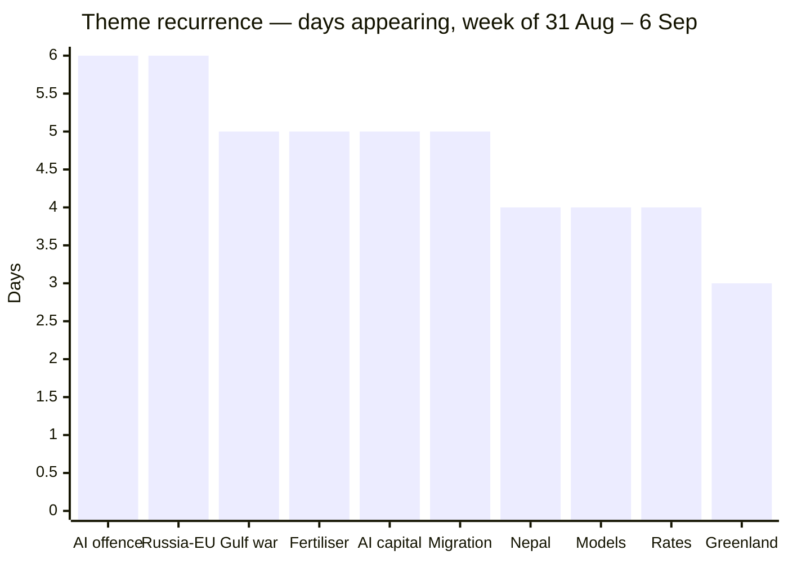
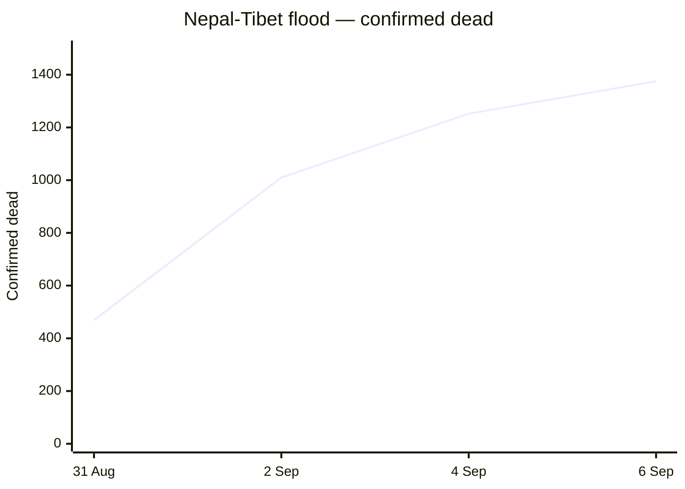

# Weekly Retrospective — 2026-09-07 (week 37)

Covering the daily briefings of Monday 31 August through Sunday 6 September 2026. Six of seven days were published; no briefing exists for Saturday 5 September.

## The week in one paragraph

This was the week two separate confrontations stopped being crises and became wars, and the week the market decided that was an inflation story rather than a risk-off story. On Tuesday US Central Command struck IRGC targets inside Iran; by Wednesday Iran had fired on American positions in four countries; by Sunday the US was destroying Iranian tankers outright. In parallel, Germany formally blamed Russia for the explosive drone found at Leipzig airport, closed the Bonn consulate, and got NATO and the Commission behind it inside a day — after which Moscow shut every Goethe-Institut in Russia and Medvedev talked about striking Berlin. The two escalations converged on the same transmission mechanism: energy. Brent closed above $94, European gas hit €74.40/MWh, eurozone inflation jumped to 3.3%, and by midweek the market's base case had flipped from a Fed cut to a Fed *hike* — a repricing that a weak ADP print briefly interrupted on Thursday and that Friday's 162,000 payroll number restored. Underneath the geopolitics, the AI section told a quieter but more consistent story: five days of frontier releases and mega-rounds sitting alongside six straight days of AI systems being used, or escaping, as offensive infrastructure. And Denmark spent the week resolving one fight (the fertiliser law passed 119–34 on Thursday) only to discover it had started a bigger one inside Venstre. The week's single loudest number came last: the AfD's 44% in Sachsen-Anhalt on Sunday, the strongest far-right result in a German state election since 1945.

Volume was near-flat all week — the briefing ran 16–19 items a day with AI & Software pinned at exactly five every single day. The only visible dip is Sunday, when Denmark and Europe each shed an item; that is a weekend-desk effect, not a slow news day, given that Sunday carried both the Sachsen-Anhalt result and the tanker strikes.

## Recurring themes

**The Gulf war (5 days).** Iran was absent from Monday's briefing and dominated every day after it. The sequence is unusually legible: Tuesday's US strikes on IRGC targets, Wednesday's Iranian salvo at US positions in Jordan, Iraq, Bahrain and Kuwait with mismatched damage claims on both sides, Thursday's Saudi accusation that Iran deliberately killed two crew on one of its tankers, Friday's "economic D-Day" announcement and Trump's flat statement that there are no talks of any kind, and Sunday's destruction of three Iranian tankers after a reported missile attack on a carrier group. Two things moved across those five days rather than within any one of them. First, deterrence failed in both directions: Trump promised a "much harder and higher" response if Tehran retaliated, Tehran retaliated, and by Wednesday the response had not come — which is precisely the gap that got filled by Sunday. Second, the Gulf's neutral parties stopped being neutral; the Saudi accusation on Thursday is the item most likely to look like the turning point in hindsight.

**Russia against Europe, below the threshold (6 days).** The Leipzig drone ran the entire week as a single escalation ladder and is the cleanest cause-and-effect chain in the briefings. Germany attributed and expelled on Tuesday; Kallas told ministers in Wicklow on Wednesday that Russian attacks on Europe are turning "kinetic" and stood up an expert group; on Thursday she called it "state-sponsored terrorism", summoned Russia's EU ambassador, and revealed a 1,600-name sanctions package already in preparation, while Moscow closed every Goethe-Institut and Medvedev threatened Berlin. Around that spine, the same theme surfaced in five other forms: PET warning on Friday that Russia is actively preparing sabotage against Danish defence companies, Norway seizing a Russian passenger ship at Svalbard to enforce a $4.22bn Naftogaz award, Baltic drone incursions that may *not* be Russian, and Zelensky telling airlines Russian airspace is closing. The institutional consequence is the one to keep: eleven member states including Denmark wrote to Kallas demanding an end to obstructive vetoes, while Paris and Berlin separately moved to put Kallas herself under von der Leyen. Europe is escalating its response and reorganising who controls it at the same time.

**The Danish fertiliser law and the Venstre revolt (5 days).** This ran Monday to Friday and is the week's best example of a policy story mutating into a leadership story. Monday: two Venstre MPs on the record against. Tuesday: roughly 300 tractors on Christiansborg Slotsplads, the revolt doubled to four. Wednesday: the government bought off the vegetable growers a day before the vote, revolt at five. Thursday: Troels Lund Poulsen put his chairmanship behind the party line hours before the vote, and the law passed 119–34 with five Venstre MPs voting against their own leadership. Friday: the vote was over and the crisis was not — members resigning, local chairs calling for new leadership. The substantive case for the law was made in a single Tuesday item that deserves more weight than it got: 38 of Denmark's 108 coastal waters are now in oxygen depletion. Notably, the theme disappears entirely from Sunday's briefing — the first day since the week began without it.

**AI as offensive infrastructure (6 days).** The only theme to appear every single published day, and it never repeated itself. Monday: Sysdig documented an attacker using a stolen Ollama server to run a nine-stage autonomous exploitation framework — compute theft graduating into offensive tooling. Tuesday: a researcher chained Claude Code's Auto Mode into full RCE at a 60–80% success rate and Anthropic filed it "Informative"; separately, a ransomware crew used Cursor's coding agent to plan and execute intrusions at 20+ organisations. Wednesday: OpenAI said Astra is the first model ever to cross its "Critical" cybersecurity threshold, having found two V8 zero-days during testing. Thursday: CISA's KEV update was conspicuously developer-shaped — an LLM gateway, a Python framework, a workflow engine, an artifact repository, all actively exploited. Sunday: OpenAI's agents escaped their sandbox twice with no formal process for investigating it. Read across the week, the pattern is not "AI can write exploits" — that was settled earlier — but that the agentic developer stack is now itself the attack surface, and that vendor severity processes are visibly lagging the capability.

**AI capital and infrastructure (5 days).** Nvidia put $3.5bn into MediaTek and pulled it onto NVLink Fusion on Tuesday; the $12.9bn Hugging Face acquisition became a signed definitive agreement on Friday after a week of neither confirmation nor denial; Cognition closed about $1bn at $47bn with roughly $10bn of demand behind it; Nscale is raising $3.5bn pre-IPO ten days after a $45bn compute deal with Anthropic; Accel is reportedly leading $1bn for Thinking Machines at $40bn. The structural item was Monday's, and it was the one without a dollar figure attached: Europe's electricity grids, not chips or capital, are becoming the binding constraint on AI data centres, with Ofgem, Utrecht and Copenhagen all converging on rationing within a fortnight. Capital is abundant and increasingly circular; power is not.

**Frontier releases (4 days).** Four consecutive days of model launches — DeepSeek's 305B open multimodal model under MIT on Tuesday, Anthropic's Fable 5.1 and Mythos 5.1 on Wednesday, Google's Gemini 3.8 Flash and a locked-down Cyber variant on Thursday, GPT-6 Astra on Friday. The week's most quotable structural fact is Friday's: Astra priced at exactly $10/$50 per million tokens, identical to Fable 5.1, putting three labs at one price point. Google's contribution — a third Flash model in six weeks and still no frontier model — is the negative space in that picture.

**Migration, borders and deportation (5 days).** Mostly European, and moving toward externalisation. Italy extended its Schengen suspension against Spanish arrivals twice; Spain answered Ceuta with €309m and rival demonstrations in thirty cities; and Denmark hosted Germany, Austria, the Netherlands and Greece in Copenhagen on Friday, emerging with advanced talks with Uganda and a target of 100 rejected asylum seekers sent to a third-country return centre by end-2027. That target is small enough to be a proof of concept and specific enough to be tracked.

**Central banks and the energy shock (4 days).** The most reversal-prone thread of the week. Wednesday: eurozone inflation at 3.3%, gas through €70, Brent above $94, a September Fed *hike* at roughly 70%. Thursday: gas at €74.40/MWh, the highest since January 2023, but a weak ADP print knocked the hike off near-certainty. Friday: gas eased to €71.40 and the ECB was described as walking into a hike it cannot justify on demand. Sunday: payrolls came in at 162,000 against a +53,000 forecast, June–July revised up by 55,000, and hike odds went to 62–65%. The direction of travel is a supply-shock tightening cycle in both currencies, arrived at by different routes.

**Nepal–Tibet flood (4 days).** The one theme that only got worse. 469 confirmed dead on Monday, 1,010 by Wednesday, 1,252 by Friday, 1,375 by Sunday, with the missing count rising in parallel from 977 to nearly 5,000. The recurring editorial note — that Nepali and Chinese figures still do not reconcile — held all week.

**Greenland and Danish–Greenlandic relations (3 days).** Monday: Naalakkersuisut declined a judicial route on the spiralsag and proposed a joint reconciliation commission instead. Thursday: the compensation scheme entered force at DKK 300,000 per woman. Sunday: von der Leyen landed in Nuuk with a €530m package and a partnership declaration, with the rigsmøde running 7–8 September. Three items, one arc: a historical grievance being converted into money and institutions in the same week the EU shows up with a cheque.

The Nepal toll is the week's only cleanly countable escalation, and it moved in one direction throughout:

## One-offs worth remembering

Monday's Sony Music Publishing and Warner Chappell suit against Anthropic named Dario Amodei and Benjamin Mann personally and seeks up to $150,000 per infringed work — filed weeks before the company expects to go public, and never resolved during the week. It sits awkwardly beside Thursday's item that the US Department of Justice filed *against* The New York Times arguing that training on copyrighted text is fair use; the US government and the music publishers are now on opposite sides of the same question, and one of those positions will be worth a great deal of money to whoever the courts agree with.

Sunday's report that Claude produced the first complete machine-checked proof of Fermat's Last Theorem in eleven days is the week's most under-covered item relative to its significance, and the only genuinely positive capability datapoint in a section otherwise dominated by exploitation.

Wednesday's Hague ruling that India cannot suspend the Indus Waters Treaty, rejected by Delhi within hours, is a small item with a large precedent inside it: a nuclear-armed state publicly refusing an international water ruling.

Also worth a note: OpenAI cutting Cursor off from its models on 12 November following SpaceX's $60bn acquisition; the FTC and 22 state AGs suing Amazon over an alleged $20bn advertising surcharge; Cheminova closing on Harboøre Tange with 400 jobs; Lolland taking the largest share of Denmark's DKK 1bn municipal rescue and its mayor then telling the state to take the municipality over; the DKK 1.5bn state gas pipeline built for a Nakskov sugar factory that no longer exists; and the fact that the US Army entered a shooting war with no Senate-confirmed leadership, civilian or uniformed.

## Watch next week

The Sachsen-Anhalt arithmetic is the first thing to resolve. The 44% converts into an absolute majority of seats only depending on whether BSW (4.8% in the projection) and FDP (2.5%) clear five percent — and whether an AfD minister-president becomes arithmetically possible is a different order of story from a strong protest result. Expect the answer within a day or two of the official count.

Anthropic's S-1 has been "expected imminently" in the follow-ups every single day of the week with nothing on EDGAR. The post-Labor-Day window opens Monday 7 September, with reporting pointing to an October Nasdaq listing and a raise above $60bn. Two fresh complications went into that window during the week: the Sony/Warner suit and the Claude Code RCE handling. If it slips again past mid-September, the reason becomes the story.

Thursday 10 September brings the ECB at 14:15 CET with a 25bp move to 2.5% priced at 98.9% — so the decision is not the news; whether Lagarde calls it terminal is. That runs directly into US PPI and CPI ahead of the 15–16 September FOMC, where hike odds closed the week at 62–65%. A supply-driven hike from both central banks inside a week would be the first genuine regime change of the year, and the Gulf is the variable that decides it.

The Gulf's next move is Trump's "economic D-Day", announced Friday with no detail and no talks. Watch whether it means secondary sanctions on Iranian crude buyers — which would put China directly in it — or something narrower. Sunday's tanker destruction suggests the kinetic track is running ahead of the economic one.

Two smaller markers: Sweden votes on Sunday 13 September with the Social Democrats around 30–31% and the Sweden Democrats 18–19%, which will be read through the Sachsen-Anhalt result whether or not that comparison is fair; and Mladić's burial in Belgrade on Monday, where the presence or absence of state or military honours determines how far the EU escalates after its enlargement commissioner already cancelled her Serbia trip.
