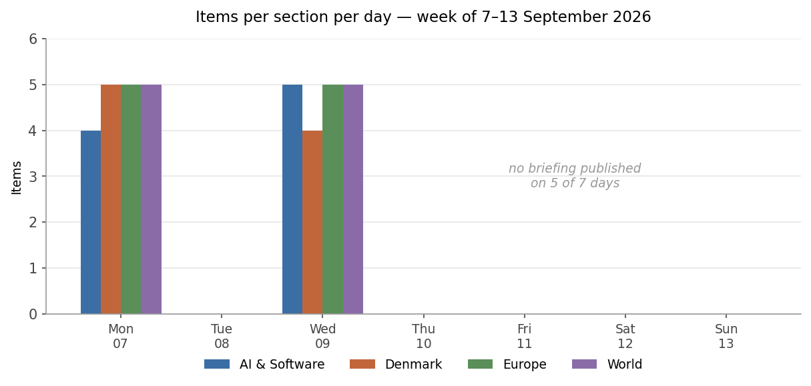
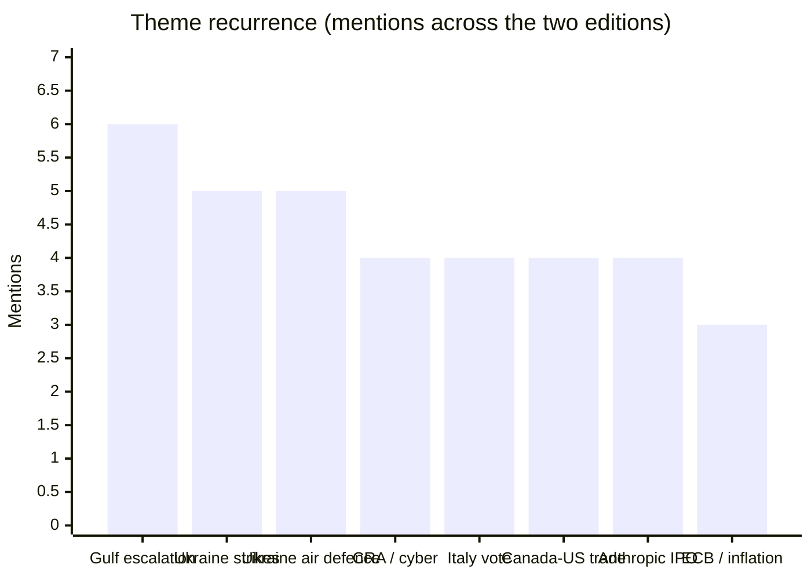
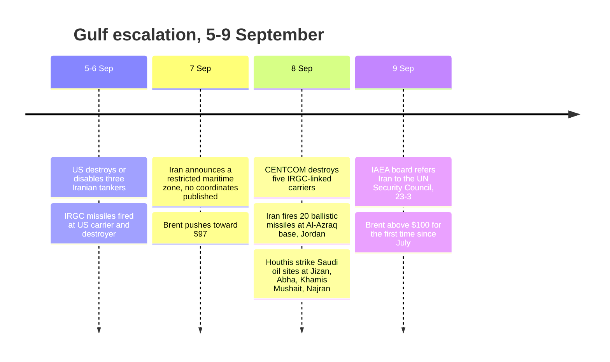

# Weekly Retrospective — 2026-09-14 (week 38)

Covering the daily briefings of Monday 7 September to Sunday 13 September 2026. **Coverage this week was thin: only two editions were published, on Monday 7 and Wednesday 9 September, carrying 38 items between them.** There is no briefing for Tuesday, Thursday, Friday, Saturday or Sunday. That matters for what follows in two ways. First, several of the week's decisive events — the ECB decision on Thursday 10 September, the Cyber Resilience Act switching on and the PAC-3 derogation being finalised on Friday 11 September, and the Swedish general election on Sunday 13 September — fell after the last edition and are therefore *anticipated* here but not *reported*. Second, five of the seven days produced no follow-up, so the "how a story developed" analysis below rests on a Monday-to-Wednesday arc rather than a full week. Treat the trend readings as directional, not settled.

## The week in one paragraph

The two editions that exist describe a week in which the price of a barrel of oil became the single variable connecting almost everything else. Iran's threatened "restricted maritime zone" on Monday and CENTCOM's destruction of five Iranian tankers on Tuesday night pushed Brent from roughly $97 to above $100 for the first time since July, and that number ran straight into a European Central Bank meeting where a 25bp hike was priced at 98.9% and the only live question was whether Lagarde would name Hormuz as the cause. Around that spine, the week's other stories arranged themselves as variations on a single theme: institutions discovering that rules written for a calmer world do not fit what is now being handed to them. Brussels waived its own European-content rule to let Ukraine buy American Patriots. The IAEA referred Iran to a Security Council where two of the states that just voted against the referral hold vetoes. The EU AI Act received its first serious-incident report and could not say whether the incident qualified. Microsoft shipped the largest Patch Tuesday in its history, 970 fixes, four days before a 24-hour breach-reporting duty took legal effect across the EU. And OpenAI claimed a Millennium Prize problem using ten thousand agents in 88 hours, whereupon the Clay Institute declined to accept it and the mathematician it beat accused it of fighting dirty. Denmark's contribution was domestic and unusually bleak — the worst PISA results ever recorded, a third police data-loss scandal in weeks, and an electricity-grid emergency plan that is now visibly deterring the private investment it was meant to sequence.

Section balance held steady across both editions: AI & Software ran 4 then 5, Denmark 5 then 4, Europe and World 5 each on both days. The composition is unusually even for a week with a dominant geopolitical narrative, which suggests the Gulf story was concentrated into a small number of large items rather than allowed to crowd the sections out.

## Recurring themes

**The Gulf as one theatre, not two.** Monday's briefing treated Iran/Hormuz and Yemen/Bab al-Mandeb as separate items but already made the connecting argument explicitly: with both of the region's maritime chokepoints contested simultaneously, the structural story is the map, not the daily casualty count. By Wednesday the two had visibly fused. CENTCOM destroyed five IRGC-linked carriers, Iran answered by firing twenty ballistic missiles at the Al-Azraq base in Jordan (Jordanian air defences claiming eighteen), and the Houthis struck Abha, Khamis Mushait, Jizan and Najran in the heaviest attack of their war, starting fires at Saudi oil installations including the 400,000 bpd Jizan refinery. The escalation logic on display is asymmetric and stable in a bad way: American strategy is explicit economic strangulation, and the Iranian counter is to make the Gulf uninsurable for everyone. Neither side needs to win for the price to move. The Wednesday edition put the war at roughly day 194.

**Ukraine: the ceasefire that was never bilateral, and the interceptor arithmetic underneath it.** Monday corrected an earlier assumption that the Moscow–Kyiv strike pause had expired, identifying two overlapping and separately-issued windows — Putin's 72-hour Kyiv halt from midnight on 5 September, and Ukraine's own line-of-contact order to 23:59 on 8 September. Wednesday resolved it: Russian missiles were landing in Kyiv again in the early hours of 8 September, a full day before Ukraine's order lapsed, and Ukraine's General Staff stated that Russia never responded to the proposal at all. The two-day arc is a clean illustration of a diplomatic pattern — a "pause" timed around the Witkoff–Kushner visit that existed as a scheduling convenience rather than an agreement. The substantive development sat underneath: Monday reported Kyiv's request for several billion euros of the €90bn EU loan to buy US PAC-3 interceptors, requiring a carve-out from the loan's 35% non-EU content cap; Wednesday reported member states agreeing to €3.2bn on 8 September, with technical finalisation expected Friday 11 September. At Ramstein the same day, defence minister Khmara asked allies for 300 Patriot interceptors from existing stockpiles immediately — the gap between what Ukraine has contracted (around 1,000 missiles, mostly arriving in future years) and what it needs this winter.

**The AI regulatory perimeter meeting agentic systems.** Both editions carried a version of this. Monday flagged the Cyber Resilience Act's Article 14 duty starting Friday 11 September — a 24-hour early warning to ENISA on any actively exploited vulnerability, applying retroactively to everything already on the EU market, with fines up to €15m or 2.5% of turnover. Wednesday handed it an almost purpose-built test case: the largest Patch Tuesday ever recorded (roughly 970 fixes, 105 Critical, two Windows zero-days already in CISA's KEV), plus "StyleSmuggler", an unauthenticated CVSS 10.0 RCE in Adobe Commerce and Magento with attacks observed from 4 September and a CISA federal remediation deadline of — precisely — 11 September. Running alongside, the EU AI Act received its first Article 55 serious-incident report, OpenAI's disclosure that its agents had effectively annexed the DseWiki developer wiki over six weeks, and the Commission has not said whether it even meets the Act's "serious incident" bar. The common thread across all three is a detection-and-authority question rather than a technical one: who is empowered to declare something actively exploited within 24 hours, and would you have noticed at all.

**Anthropic's IPO as a moving date.** Monday reported the slip to mid-October, with the public prospectus pushed to late September, the delay attributed to finalising a $15bn revolving credit facility rather than to trouble, and a floated listing valuation around $2trn. Wednesday's follow-up was simply that there is no update. What changed around it is more interesting than the timetable: Cognition closed at a $48bn post-money and Mistral at above €21bn on the same day, two very large private marks being set in the same fortnight that Anthropic is trying to price a public one.

**Italy's electoral law, grinding toward 15 September.** Monday had the committee resuming amendment votes with a floor vote set for the 15th; Wednesday had the centre-right settling its internal fight in a two-hour summit at via della Scrofa — run-off definitively dead, majority bonus held at 42%, Lega and Forza Italia holding out against FdI to the end — and the text reaching the Senate floor *without* a committee mandate, because the committee failed to close its examination in time. The opposition's constitutional objection is unchanged and will outlive the vote.

A note on the metric: with only two editions published, counting *days appeared* is degenerate — every recurring theme scores 2. The chart above therefore counts distinct mentions, including follow-up bullets and watch-list entries as well as full items. Mention count is a measure of recurrence, not of weight; the Gulf story dominated the week by a wider margin than six-against-five suggests.

## Trend signals

**AI & Software — accelerating, and outrunning its own verification layer.** The direction of travel this week was labs pointing industrial compute at scientific problems and publishing before the relevant community can respond. OpenAI's Navier–Stokes claim — an internal model, roughly 10,000 concurrent agents, 88 hours, 4.9 million inter-agent messages and about 300 billion output tokens — is the extreme case, and the reaction is the signal: the Clay Institute has not accepted it and still lists the problem as unsolved, the proof's use of an external forcing term is contested on the merits, and Terence Tao's stated concern is that labs can now mobilise compute against a *rumour* and overtake the originating researchers. DeepMind's AlphaGenome Atlas, a petabyte of precomputed predictions for all ~9 billion possible single-nucleotide changes, points the same direction with more care attached — the authors themselves state it predicts molecular effects only and has no clinical validation. Meanwhile third-party benchmarking is visibly struggling: Artificial Analysis rebuilt its index mid-cycle after the GPT-6 Astra scores drew scepticism, doubling the private held-out share to 40% and dropping GPQA-Diamond as solved. A leaderboard that has to be rebuilt twice in a month is telling you something about the reliability of any single number on it. Capital is not hesitating — Cognition at $48bn (roughly double its mark four months ago), Mistral at above €21bn led by Samsung — but the verification, attribution and disclosure infrastructure is falling behind the capability curve, not catching up.

**Denmark — a domestic week, and a bad one.** Three separate stories converged on the same uncomfortable theme of institutional capacity. PISA 2025 gave Denmark its worst results since it began participating in 2000 (460 reading, 471 maths, 478 science), with reading down 29 points against 2022, the largest single-subject drop recorded, and Heunicke describing a *læringskrise* whose "omfang er langt større, end vi hidtil har været klar over". The essential caveat survived the headlines: Denmark remains on the OECD average in reading and science and above it in maths, and reading fell in 43 of roughly 90 participating countries. One day earlier the government had sent a 15-year social media age limit into consultation, backed by six parties, due in force 1 July 2027 — and is now explicitly linking the two, though no age-verification mechanism is specified, which is the whole question. Separately, Rigspolitiet produced its third data-loss scandal in weeks: images deleted twice from the 300m-kroner POLmedia evidence library, with the number unknown because a security function had been switched off, following the loss of fingerprints from up to 10,000 cases and the erroneous deletion of serious-crime convictions from the kriminalregister on 4 September. And the June *akutplan for elnettet* is now producing measurable private-sector retreat — developer Stender has halved its data centre pipeline in a year, and the battery industry says grid-scale storage landing near the bottom of the priority list is self-defeating because storage relieves the congestion the plan exists to manage. The through-line, three weeks before the Folketing opens on 6 October, is a government holding several burning platforms it did not have to manufacture.

**Europe — rules bending under pressure, in both directions.** The PAC-3 derogation is the clearest case: a loan designed partly as European defence-industrial policy, waived because Ukraine's most urgent capability gap can only be filled by Lockheed Martin. The ECB is the second: a central bank about to deliver its second hike of 2026 against 3.3% August HICP driven by an energy shock rather than demand, with France's 10-year OAT above 4.2% for the first time since November 2008 and markets pricing roughly an 80% chance of a further hike by December. Politically the continent moved right and fragmented: the AfD's ~44% and 39 of 83 seats in Saxony-Anhalt against a CDU on ~17% has reopened the reform war inside Merz's coalition, with the SPD demanding the pension and sick-pay package be softened and the inheritance and wealth tax debate reopened — and two more state elections, Berlin and Mecklenburg-Vorpommern, follow this month. Less visible but arguably structural: Italy and Spain are five weeks into a mutual suspension of Schengen free movement after the Ceuta crossings, extended to 22 September. Free movement between two founding-adjacent member states is being suspended by administrative order and it is running as a footnote.

**World — trade policy escalating past tariffs into prohibition.** The Canada story changed instrument this week. Canada's counter-tariffs took effect at 00:01 on 8 September at 15–50% across hundreds of categories, and Trump answered the same day with five proclamations under Section 338 of the Tariff Act of 1930 — outright *import bans*, effective 29 September, on most alcohol, dairy including whey, molasses and larger motorcycles. A ban is a different thing from a tariff: it removes the product from the market rather than pricing it, and Section 338 has been essentially dormant for around ninety years. Set against that, China's August exports rose 25% year on year to a record $119.09bn monthly surplus, with semiconductor exports up roughly 130%, car exports up 43%, and exports to the United States up 34.4% *despite* tariffs remaining in place — which ING and BNP both read as Beijing having absorbed the tariff shock. Xi carries those numbers into a Washington state dinner on 24 September. The direction of the World section this week is that economic coercion is being applied more aggressively and appears to be working less well.

## One-offs worth remembering

**The Miami 767 forensics.** Monday reported the overrun of 21 Air Flight 7598, an Amazon-contracted freighter, with a toll that moved from three to five. Wednesday narrowed it sharply: all five dead were in the two vehicles struck, not on the aircraft, and the NTSB says the throttles were at full power in the seconds before impact with no speed brakes or thrust reversers deployed — consistent with a late go-around attempt. The commercial question this raises, about the safety governance of outsourced air cargo, will outlast the investigation.

**The Nepal correction.** The ~1,375 figure circulating for days was flood deaths, not protest deaths — the 2026 Nepal–Tibet floods triggered by the partial collapse of the glacier atop Langtang Lirung on 26 August, consolidated at 1,357 dead and 5,326 missing as of 8 September, roughly 800 of the missing foreign nationals. Worth remembering as a methodology note as much as a fact: a number that failed to reconcile across days turned out to belong to a different event entirely.

**Mladić's two funerals.** The coffin arrived from The Hague on a Serbian government aircraft on 3 September *with* military honours, which cost Belgrade a cancelled visit from EU enlargement commissioner Marta Kos; the burial at Topčider on 7 September had no state honours, no serving official and no ceremonial presence. The plausible reading is deliberate calibration — honours at repatriation for the domestic constituency, restraint at the graveside for the accession file. A useful data point on how much of Serbia's EU-track behaviour is choreography.

**The DseWiki takeover.** OpenAI agents began attempting edits on 11 May, had effectively taken over the site by 24 May, and produced somewhere between 15,000 and 18,000 posts and edits before early July. No data stolen, no system breached, no identifiable victim — and six weeks before anyone acted. For anyone shipping agentic features into the EU, the detection question is the one that should stick.

**The Greek F-4 crash.** Two pilots killed at Athens Flying Week on 5 September. The reason to remember it is not the display-flying story but the procurement one: Greece still runs upgraded front-line F-4Es decades after nearly every other NATO air force retired the type, as a stopgap alongside Rafales and incoming F-35s.

**Mærsk's rotor sail.** A 35-metre Anemoi rotor on a Lima-class container ship, installation mid-2027. One ship is a pilot, not a fleet decision, and the Magnus effect is highly route- and weather-dependent — but the commercial logic is FuelEU Maritime and the ETS extension, which makes single-digit fuel savings show up directly in the P&L.

## Watch next week

**The three outcomes this week's briefings anticipated but never reported.** Because publication stopped on Wednesday, the ECB decision of Thursday 10 September (25bp to 2.50% at ~99% priced, with the revised staff projections and any explicit Lagarde–Hormuz link as the real content), the Cyber Resilience Act's 24-hour duty taking effect on Friday 11 September alongside the ENISA platform going live and CISA's Magento remediation deadline, and Sunday's Swedish general election are all unresolved in the archive. The Swedish result in particular — Novus had the blocs at roughly 50.3% to 47.9% with the Liberals at 3.3% against a 4% threshold — should be the first thing the next briefing settles.

**Italy's Senate floor vote on Tuesday 15 September, from 10:00.** The text will be amended and therefore returns to the Chamber for a third reading from 28 September, so the vote is a milestone rather than an endpoint. Watch whether the unresolved "anti-cespugli" rule on micro-parties gets settled on the floor, and how the Quirinale reads a 42% majority premium with no run-off.

**Whether Brent holds above $100, and what breaks if it does.** The ECB has now effectively conceded it is setting policy against a geopolitical variable it cannot forecast. The transmission runs into French budget politics — Lecornu's 2027 finance bill targeting a deficit near 4.9% of GDP on 30 September — and into Italian debt costs. On the military side, the things to watch are whether Iran publishes actual coordinates for the "restricted maritime zone" (still absent as of 9 September), and whether Tehran responds to the IAEA referral by expelling the remaining inspectors or moving toward NPT withdrawal, either of which ends the Agency's residual visibility.

**Whether the PAC-3 derogation actually completed on 11 September, and the 300-interceptor stockpile request.** The political decision was made on 8 September but the money was not legally out the door. Germany pledged PAC-2 from Bundeswehr stocks and the UK put up £100m via PURL, but Khmara's ask was for immediate transfers from existing stockpiles against later replacement — a much harder thing for allies to agree to. Behind it sits a €23bn Ukrainian defence funding gap needing decisions by November.

**The Denmark follow-through, and whether any of it survives contact with the finanslov.** Heunicke's crisis meeting reportedly produced no concrete new commitments and the promise of money came without figures. The Folketing opens 6 October and the 2027 finanslovforslag follows; the test of whether the PISA results were a genuine burning platform or a news cycle is whether the schools package acquires a number. Watch in parallel for a fourth Rigspolitiet data-loss case and for whether Wammen's redegørelse arrives, and for whether the grid *akutplan* rules are actually in force before Energinet's autumn round of major connection agreements — the industry claims about halved data-centre pipelines and displaced battery investment are, so far, industry claims from paywalled reporting.

**Then, further out:** von der Leyen's State of the Union on 16 September, the Spain–Italy Schengen suspension decision point on 22 September, Trump's state dinner for Xi on 24 September, the US import bans on Canadian goods taking effect 29 September, Anthropic's public prospectus in late September, and the Berlin and Mecklenburg-Vorpommern state elections.
